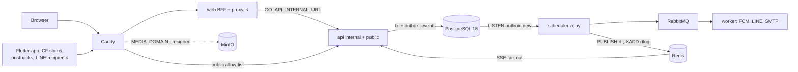
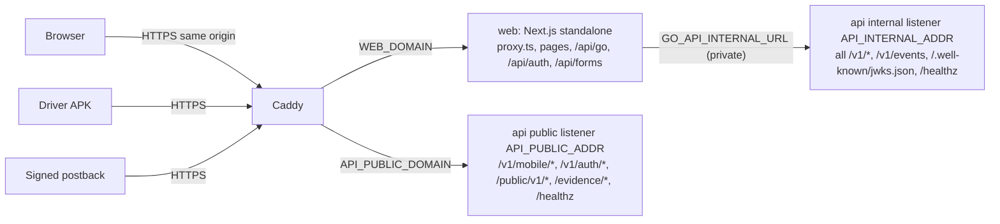
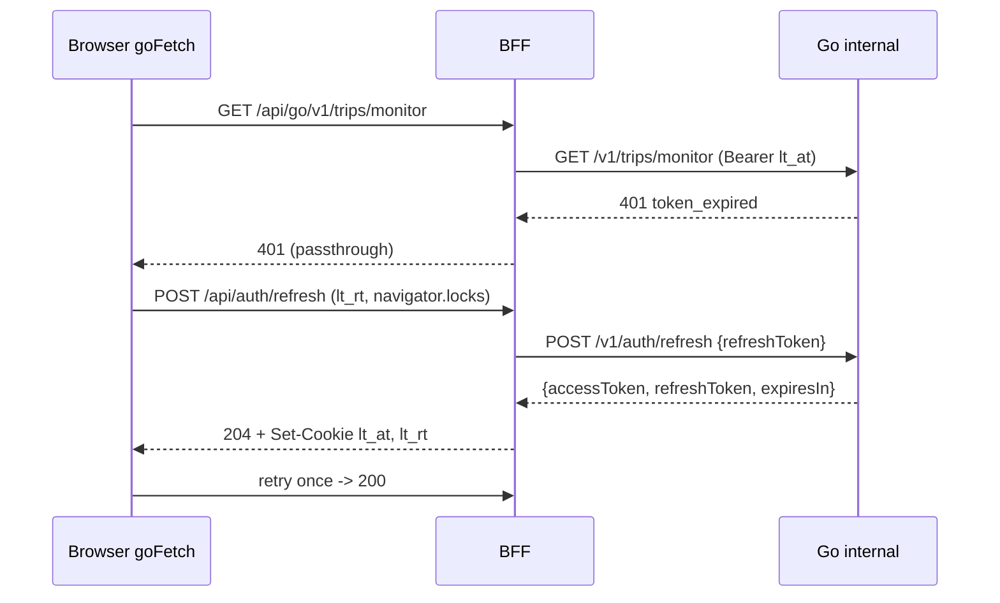

# LogiTrack mv-go — Developer Specification (Firebase → Go + PostgreSQL 18)

- **Status:** Draft for owner review. **Branch:** `mv-go`; this spec and each issue branch land by PR into `mv-go`. `main` is live production: no PR, merge or rebase until every mv-go issue is done and the git owner (`smartcode54-bit`) confirms (R90). **Date:** 2026-10-09.
- **Decision record:** [ADR 0029 — Migrate the Firebase stack to Go + PostgreSQL](shared-docs/adr/0029-migrate-firebase-stack-to-go-postgres.md) (Proposed)
- **Appendices:** [A — Data model](shared-docs/specs/mv-go/A-data-model.md) · [B — API catalog](shared-docs/specs/mv-go/B-api-catalog.md) · [C — Auth and RBAC](shared-docs/specs/mv-go/C-auth-rbac.md) · [D — Seed and mock data](shared-docs/specs/mv-go/D-seed-and-mock-data.md) · [E — Web fetch audit](shared-docs/specs/mv-go/E-web-fetch-audit.md)

**Contents**

- [0. Summary and how to read this spec](#0-summary-and-how-to-read-this-spec)
- [1. Current system fact base](#1-current-system-fact-base)
- [2. Target architecture](#2-target-architecture)
- [3. Data model and PostgreSQL 18 schema](#3-data-model-and-postgresql-18-schema)
- [4. Auth, sessions and multi-tenant RBAC](#4-auth-sessions-and-multi-tenant-rbac)
- [5. API surface](#5-api-surface)
- [6. Billing and compensation parity](#6-billing-and-compensation-parity)
- [7. Async processing and notifications](#7-async-processing-and-notifications)
- [8. Realtime](#8-realtime)
- [9. Object storage and media](#9-object-storage-and-media)
- [10. Web tier: Next.js BFF and TanStack Query](#10-web-tier-nextjs-bff-and-tanstack-query)
- [11. Mobile phase](#11-mobile-phase)
- [12. Delivery plan (strangler P0-P8)](#12-delivery-plan-strangler-p0-p8)
- [13. ETL and sync](#13-etl-and-sync)
- [14. Seed and mock data](#14-seed-and-mock-data)
- [15. Local stack](#15-local-stack)
- [16. Environment inventory](#16-environment-inventory)
- [17. CI/CD and branch policy](#17-cicd-and-branch-policy)
- [18. Issue plan](#18-issue-plan)
- [19. Risks and open questions](#19-risks-and-open-questions)

## 0. Summary and how to read this spec

### 0.1 สรุปสำหรับเจ้าของ (TL;DR)

- **ย้ายออกจาก Firebase ทั้ง stack:** Auth, Firestore (38 collections + 2 subcollections), Storage, Cloud Functions 53 ตัว, App Check, Hosting → Go 1.27 + Fiber v3.5 (`api` / `worker` / `scheduler` แยก process), PostgreSQL 18, RabbitMQ (transactional outbox), Redis, MinIO (S3 API)
- **คงไว้อย่างเดียวคือ FCM** (HTTP v1 จาก Go); หลัง P8 โปรเจกต์ Firebase เหลือไว้เพื่อ FCM
- **Auth ของเราเอง:** Argon2id + Google OIDC, access JWT 15 นาที + refresh rotation; ผู้ใช้เดิม verify scrypt ของ Firebase แล้ว rehash ตอน login แรก; RBAC multi-tenant (tenant = carrier, own fleet เป็น tenant หนึ่ง), catalog 81 keys (77 + 4 platform)
- **ลำดับเฟส:** P0 ฐาน → P1 master data (ETL โหลดทุก collection) → P2 operations → P3 billing (PDF/XLSX ที่ Go) → P4 HR → P5 comms → P6 security/dashboard (ถอด Firebase SDK จาก web) → P7 mobile (P7a แอป, P7b สลับ writer) → P8 ปิดระบบเดิม — **web ก่อน mobile ท้ายสุด**; ระหว่างทาง mirror Firestore→PG + compat projection PG→Firestore เฉพาะที่แอปเก่าหรือ Cloud Functions ยังอ่าน
- **PostgreSQL 18** (`postgres:18-alpine`): id = `uuidv7()` native, generated column ต้อง `STORED`
- **Web:** Next.js standalone หลัง Caddy + BFF — **browser ไม่เรียก Go ตรง**, cookie HttpOnly (§2.2), TanStack Query v5
- **Go เปิด public เฉพาะ** `/v1/mobile/*`, `/v1/auth/*`, `/public/v1/*` (postback ภายนอก — วันนี้ยังไม่มี), `/evidence/*`, `/healthz`; admin ของ mobile release และฟอร์ม waitlist / partner interest อยู่ internal
- **Billing port แบบ bit-for-bit** เป็น Go package เดียว + golden tests จาก vitest 20 ไฟล์ (แก้/คงไว้ §1.12, §6.18; parity allow-list §6.17; ช่องโหว่ §1.8)
- **Deploy ตัดสินแล้ว (R30):** VM เดียว + docker compose ตลอด P0–P6
- **Owner ต้องทำก่อน P0:** (1) rotate Cartrack credentials ที่หลุดใน `logitrack-mobile/.env.dev`/`.env.prod` (track ใน git, bundle ลง APK) และ `logitrack-web/functions/scripts/{check-creds,test-cartrack,test-cartrack-full}.js` — งานนี้**ไม่ได้อ่านค่า**; (2) ส่ง Firebase "Password hash parameters" ทางช่อง secret; (3) ตั้งชื่อ domain (`WEB_DOMAIN`, `API_PUBLIC_DOMAIN`, `MEDIA_DOMAIN`) + ผู้ดูแล DNS/ACME; (4) ตอบ §19
- **รอบนี้ = เอกสาร + GitHub issues เท่านั้น** (ไม่มีโค้ด, env มีแต่ชื่อ); PR เข้า `mv-go` — `main` (production) ไม่แตะจนทุก issue เสร็จและ owner ยืนยัน (R90)

### 0.2 Scope and non-goals

**This round (docs only):** this spec, Appendices A–E, ADR 0029 with index and glossary updates, a `.vibe-rules.md` Change Log entry, 12 labels, milestones M0–M8, 14 Epics, 69 tasks (T01–T60, TW1–TW9), all landed by PR into `mv-go` (R90). **Later (§12):** replace every Firebase product except FCM; own auth, RBAC, ETL, local stack, CI.

**Non-goals:** code now; any change to `main` (R90) · Buzzebee (ADR 0020/0023/0024), pending the owner (§19) · WebSocket and OTA updates (ADR 0007 floor stays) · PostgreSQL 18 features that change semantics (temporal `WITHOUT OVERLAPS`, `RETURNING OLD/NEW`) during parity (R34) · pricing changes beyond §1.12 and §6 · attestation enforcement and the cash-advance UI (R30) · business logic in the BFF (W2).

### 0.3 Confirmed decisions

Owner-confirmed; not re-litigated in this spec set.

| Topic | Decision | Spec |
|---|---|---|
| Auth | Own Go auth: Argon2id + Google OIDC; short access JWT + refresh rotation; Firebase scrypt verified, rehashed at first login | §4 |
| Push / realtime | FCM only (HTTP v1 from Go); SSE from Go + Redis pub/sub; WebSocket deferred | §7, §8 |
| Strategy | Strangler per domain, web first, mobile last; Firestore→PG mirror + PG→Firestore compat projection where old readers remain | §12, §13 |
| Deliverable | `developer-spec.md` + ADR 0029 + issues (`mv-go` label) on branch `mv-go` | §18 |
| Branch policy (R90) | `main` = live production, untouched; issue branches PR into `mv-go`; T14 adds `mv-go` CI; `mv-go` → `main` is a later owner decision | §17 |
| RBAC | Multi-tenant: tenant = carrier org (ADR 0026), `tenant_id` frozen on the row, `platform_admin` ≠ `tenant_admin`, dispatcher axis, customer scope | §4 |
| Workers | Async work in `worker` via RabbitMQ + outbox; `api` / `worker` / `scheduler` separate | §7 |
| Cache | Redis: hub maps (`cache:hubs:n2c`, `cache:hubs:c2n`, never merged), rate cards, settings, sessions, rate limits, idempotency, SSE fan-out; pricing reads PostgreSQL only (R17, R53) | §2.5 |
| Storage | MinIO (S3 API), any S3-compatible store later | §9 |
| Env | Names only; values never stored or sent | §16 |
| DB version | PostgreSQL 18, `postgres:18-alpine`, native `uuidv7()` (R34) | §3, §15 |
| Web tier | Next.js standalone + BFF + TanStack Query v5; browser → Next.js server → Go over the private network; small Go public surface | §2.6, §10 |

Closed in ADR 0029 (R30): single VM + compose P0–P6; 180-day legacy-password tail; revocable evidence links; cash-advance table without UI; attestation `off`.

### 0.4 What this supersedes

Effective **only when ADR 0029 is Accepted**. `.vibe-rules.md` is cited by section name (line numbers shifted after 4f552099, R75).

| Document / rule | Today | Replaced by |
|---|---|---|
| `shared-docs/database-migration-plan.md` (`:274-286`, `:288-300`, `:377-382`) | Hybrid; users, chats, settings, permissions_config, vehicle_locations, mobile_installations, security_events stay in Firestore; Firebase Auth is the source of truth | Full migration, own auth |
| `shared-docs/sql-migration-business-case.md:145-159` | Do not migrate yet; Supabase costing | Self-hosted PostgreSQL 18 |
| `.vibe-rules.md` "Database Architecture Plan" | Hybrid plan | ADR 0029 + this spec |
| `.vibe-rules.md` "Server Logic & Cloud Functions (MANDATORY)" | Server logic only as `onCall` | Go API; Next.js only as thin BFF + `/api/auth/*` (W2) |
| `.vibe-rules.md` "Single Source of Truth (SSOT)" | Zod in `shared-docs/schemas/` | OpenAPI 3.1 + goose/sqlc; Zod/Dart generated or validated from it (R27) |
| `.vibe-rules.md` Confirmed Patterns "Per-trip billing" (sync 2 files) | `web:lib/billingCompute.ts` + `fn:core/billingCompute.ts` | `internal/billing/compute` |
| ADR 0024 (row `shared-docs/adr/README.md:37`; file in no git ref) | Buzzebee on Supabase | Infrastructure only; scope open (§19) |
| `CLAUDE.md` "Rules" | Points at `database-migration-plan.md` | Points at ADR 0029 and this spec |

Kept: ADR 0026 tenancy (text not on disk; six rules restated in ADR 0029, R32); ADR 0007 floor (served by Go from P7a); `.vibe-rules.md` "API Versioning & Backward Compatibility (MANDATORY)" (callables retire after two zero-traffic release cycles, R26).

### 0.5 How to read this spec

**Precedence:** ADR 0029 (once Accepted) > this spec > Appendices > research notes. **Name owners:** Appendix A DDL (tables, columns), Appendix B (routes, topics, queues, Redis keys), §16 (env), Appendix C (RLS §C.3, security events, auth flows), E (listener dispositions, query keys); others copy them.

**Conventions:** `UNVERIFIED:` + reason = not confirmed by research · owner decisions → §19 · citations `path:line` at commit 4f552099; `web:` = `logitrack-web/`, `fn:` = `logitrack-web/functions/src/`, `mob:` = `logitrack-mobile/lib/` · `R1–R35`, `W1–W10` = plan decisions (in ADR 0029); `R36–R90` = cross-document resolutions · P0–P8 = milestones M0–M8 (P7 = P7a app + P7b storage flip) · Thai terms: หลัก/เสริม (`jobCategory` PRIMARY/SUPPLEMENTARY), พขร. (driver), ค่าโยก (multi-drop stop fee), งานหมด (standby); `shared-docs/glossary.md` · calendar Asia/Bangkok +07:00; money `NUMERIC(14,2)` THB (R20).

### 0.6 Document map

- Appendix A: DDL of the P0 baseline `0001_preamble` … `0009_infra`, RLS enablement, ETL mapping, quarantine codes, D1–D8 · B: endpoints with listener + capability, SSE topics, RabbitMQ, Redis keys · C: identity, 81-key catalog (77 + 4 platform), roles, RLS coverage, tokens, Firebase user migration · D: seed profiles, workflow → rows, invariants, sample rows · E: 63-route fetch audit, query keys, listener disposition, BFF design.
- ADR 0029; `shared-docs/glossary.md` (migration terms such as Compat projection, Callable shim, ETL quarantine); `.vibe-rules.md` Change Log entry.

## 1. Current system fact base

As-is `main`; only "fix", "decision" and "phase" columns look forward.

### 1.1 Counts

| Metric | Value | Evidence |
|---|---|---|
| Cloud Functions | **53** = 46 `onCall` + 4 `onSchedule` + 1 `onRequest` (`tripEvidence`) + 2 v1 Auth triggers | `fn:index.ts:15-39`; `fn:triggers.ts:12,35` |
| Firestore/Storage triggers | 0 (Firestore in `asia-southeast3`) | `web:firebase.json:4`; `fn:triggers.ts:5-6` |
| App Check | `enforceAppCheck: true` globally, `false` on 23 callables; functions in `asia-southeast1` | `fn:index.ts:8-12` |
| Callables: no caller / backfill / mobile | 5 / 7 (become SQL or ETL) / 5 (`setDriverClaims`, `sendCustomerLineNotification`, `computeTripBillingSnapshot`, `addDeliveryStop`, `markBroadcastRead`) | research reports |
| Firestore collections | 38 constants + `chats/{id}/messages` + `drivers/{id}/mobile_installations`; rules-only `checkin` unused | `web:lib/collections.ts:12-129`; `web:firestore.rules:213-223` |
| Composite indexes | 35 + 2 `fieldOverrides`; 22 used, 12 unused (one on non-existent `assignments`), 1 wrong scope; ≥3 queries lack one | `web:firestore.indexes.json` |
| Storage path patterns | 15 rows over 14 prefixes (plan's 16 splits multi-path rows); mobile writes 8 | §1.7 |
| Web data access | `getDocs` 112 · `onSnapshot` 31 in 24 files · `getDoc` 26 · `getCountFromServer` 19 · `httpsCallable` 30 · `useEffect` 208 · `"use client"` 219 files · no polling | Appendix E |
| Web routes | 63 under `web:app/app/**`, all client-rendered (`web:app/app/layout.tsx:1`) | Appendix E |
| Mobile realtime | 9 `.snapshots()` streams | §1.6 |
| RBAC | 8 roles · 50 capabilities (colon) · 36 matrix rows (underscore) · 53 route entries | `web:lib/roles.ts:13-22`; `web:lib/capabilities.ts:8-78,340-394` |
| Golden-test sources | 20 Vitest files (17 `web:lib`, 3 `fn:core`) | legacy-quirks report |
| Billing core | `web:lib/billingCompute.ts` ≡ `fn:core/billingCompute.ts` (643 lines, header differs) | billing report |

### 1.2 As-is architecture

The browser (static export on Firebase Hosting, `web:next.config.ts:10`, `[id]` placeholder rewrites `web:firebase.json:63-80`) and the Flutter app read and write Firestore directly, store token URLs in Cloud Storage, sign in with Firebase Auth custom claims and call Cloud Functions. Only Cloud Functions reach FCM, LINE, Cartrack, Bangchak and Distance Matrix; the APK calls Vision, Geocoding and Static Maps with shipped keys; Without triggers every side effect is a callable fired **after** the client's write, best-effort with swallowed errors (`notifyTaskUpdate`, `notifyChatMessageCreated`, `computeTripBillingSnapshot`, `sendCustomerLineNotification`), or a 15-minute sweep (`fn:tripBillingOnDelivered.ts:1225-1232`).

### 1.3 Identity duality

| `driverId` holds | Where | Evidence |
|---|---|---|
| Auth UID | trip_records, standby_records, chats, messages.senderId, payroll, driver_penalties, incidentReport, vehicle_expenses, `broadcasts.readDriverAuthIds`, `tasks.helperDriverIds[]` | `mob:features/loading_phase/presentation/pages/loading_phase_page.dart:1430` |
| drivers doc id | `tasks.driverId` (legacy rows may hold the UID, `web:firestore.rules:194`), truckAssignment, mobile_installations, leave_requests, `drivers/{id}.fcmToken`, claim `driverId` | `web:features/tasks/components/FirstMileTaskDialog.tsx:537` |
| legacy `authUid` | fallback read only | `fn:triggers.ts:164` |

Payroll matches `tasks.driverId == authId` (`fn:driverCompensation.ts:199-204`, confirmed bug); the UI hides the duality with `driversByAuthId[id] ?? drivers[id]` (`web:features/drivers/hooks/useDriverMonitor.ts:539`); `trip_records.taskId` holds the doc id or the business number (`:666-669`; UNVERIFIED: share depends on production data). **Target (R12, R55):** `drivers.user_id` UNIQUE, `driver_id` FK everywhere, Firebase uid in `users.legacy_auth_uid` / `drivers.legacy_auth_uid`; ETL resolves doc id → auth UID → (tasks) name, keeping `legacy_driver_ref` + `driver_ref_match`.

### 1.4 Document-id rules

| Collection | Doc id | PostgreSQL |
|---|---|---|
| trip_records | Driver-typed trip id = `spxTripId` (`fn:core/tripDocId.ts:10-18`); rename = copy + delete | uuid PK + mutable `trip_no` + `trip_no_history`; charset CHECK kept |
| payroll | `{authUid}_{YYYY-MM}_{R1\|R2}` | UNIQUE `(driver_id, period, round)` |
| billing_counters | `{customerId}_{YYYYMM}` | Counter row (`tenant_id`, R61) bumped in the statement tx |
| fuel snapshots | `yyyy-MM` / `yyyy-MM-dd` (Bangkok) | Date keys |
| hub_soc / soc_hub distances | `{hub}_{soc}` / `{soc}_{hub}` | One `hub_soc_distances` with `direction` (R14) |
| users / permissions_config / settings | Auth UID / role id / single docs | `users.legacy_auth_uid` / `role_capability_overrides` / `settings(key, value jsonb)` (R6, R7) |
| mobile_installations | install id | PK `(driver_id, install_id)` (R33) |
| tasks | auto-id; `taskId` `FM-ddMMyyyy-NNN` **not unique** (only web pads 3 digits, `fn:triggers.ts:408-419`) | legacy `task_no` non-unique; new numbers from `task_number_counters` per `(task_type, plan_date)` (R10) |
| all others | auto-id | `legacy_doc_id` + partial unique index |

### 1.5 Client-side logic that must move server-side

| Logic | Today | Go (phase) |
|---|---|---|
| Invoice number `{code}-{YYYYMM}-{seq3}` | Counter bumped before the insert (`web:lib/billingStatement.ts:73-98`) → gaps; fallback `INV-YYYYMM-<epoch>` (`web:lib/billingDocument.ts:231-235`) | One PG tx (P3) |
| Task number, `runOrder` | count+1 / max+1 in web (`web:features/tasks/hooks/useFirstMileTask.ts:210-213`) and mobile (`task_repository.dart:118-131`) → races | Counters in the insert tx (P2) |
| Duplicate checks (trip id + seal, driver hub, tax invoice, plate) | Mobile (`trip_records_repository.dart:42-79`, `hubs_repository.dart:219-226`, `vehicle_expense_repository.dart:197-212`) → races | UNIQUE constraints |
| Billing rows; second snapshot writer | 6 sequential hops (`web:features/accounting/api/billing.ts:737`); `EditBillingDialog` writes snapshots (`:444-466`) | `GET /v1/billing/rows`, one billing service (P3) |
| PDF / XLSX / billing ZIP | jsPDF, xlsx-js-style, jszip in the browser (`web:lib/billingDocument.ts:12-16`) | `documents.render` → `statement_documents` (P3, R69); photo ZIPs stay a lazy jszip chunk |
| Multi-doc workflows | Standby batch (`standby_repository.dart:98-147`); trip → task → billing → LINE → `activeTruck`; truck assignment (`web:app/app/truck-assignment/actions.client.ts:70,151`) | PG tx + outbox |
| Task completion, `activeTruck`, STD/STA, `jobCategory` copy | Mobile client (client-trusted) | Server (P2 write-back, P7a) |
| Dashboard aggregates | `DashboardStats.tsx:164-200` (~10.7k docs/visit) | `GET /v1/dashboard/summary` (P6) |
| Customer/partner scope | UI filters (`useDriverMonitor.ts:217`, `web:app/app/first-mile/page.tsx:262-266`) | Scope + RLS (R12) |
| Timestamps | Device time on trips, check-in, incidents, expenses | Server `created_at`; device time in business columns |

### 1.6 Realtime and offline

- **Web, 31 `onSnapshot` in 24 files:** force logout on `users/{uid}.forceLogoutAt` (`web:context/auth.tsx:95`); driver monitor ×4 (`useDriverMonitor.ts:454,471,488,649`, trips unbounded); FM/LH/job-assign ×3; chat ×5 (room writes `lastReadByAdmin` in its callback, `web:app/app/chat/room/page.tsx:108-113`); standby ×3; incidents, users, waitlist ×2; leave, payroll, holidays, drivers, trucks, expense audit, mobile settings, installations, security events ×1. Memory-only cache; every navigation is a hard load.
- **Mobile, 9 streams:** task queue (`mob:features/home/data/repositories/task_repository.dart:134-157`), chat list / doc / unbounded messages (`chat_repository.dart:48-94`), broadcasts list + badge, leave, holidays, active maintenance; plus `authStateChanges`.
- **Mobile offline:** SDK defaults read from cache and queue writes, awaited without timeout (UNVERIFIED: inferred from FlutterFire semantics); chat `runTransaction` fails offline; photos upload first (orphans); `DraftStorageService` only restores forms; the expense queue (`vehicle_expense_repository.dart:44-192`) drops photos and replays a non-idempotent `add`; `checkPendingTripOnServer` returns `unknown` offline and blocks clearing a stuck job (`delivery_phase_page.dart:141-148`); the version gate fails open with a 30-day cached floor.
- **Target:** web → SSE, visible-tab polling or fetch (W7, §10); mobile → FCM silent `tasks_changed` + fetch on resume, optional SSE, local cache, outbox with `Idempotency-Key` and `client_op_id`, presigned upload + commit (§11).

### 1.7 Storage

- Writers store Firebase **download-token URLs**, never keys; nothing is deleted; deterministic names are overwritten (UNVERIFIED: whether old token URLs survive). Prefixes: `checkin/`, `trip_records/{tripId}/{photoType}.jpg`, `incident_reports/`, `standby_records/`, `vehicle_expenses/`, `maintenance/`, `chat_media/`, `leave_evidence/`, `drivers/` (profile, ID card, licence), `trucks/` (seven shapes), `subcontractors/`, `customers/logos/`, `companies/{id}/{logo|stamp|signature}`, `app_releases/{flavor}/…apk`.
- Rules: attestation helper always true (`web:storage.rules:6-8`); public read on most prefixes **including ID cards and licences**; `companies/` unruled though `companies.ts:101` writes there (UNVERIFIED: deployed rules may differ; CI never deploys them, `deploy.yml:109,191`).
- URL-format dependents: `looksLikeImageUrl.ts:4`, `fn:tripEvidence.ts`, `trip_photo_download_service.dart:142`, `web:lib/download-image-urls-zip.ts:59`. APKs use a hand-built token URL because signed URLs expire after 7 days (`web:scripts/publish-mobile-release.mjs:218-291`); photos stay under the **old** trip id after a rename (`fn:renameTripRecord.ts:43-45`).
- **Target (R1, §9):** `file_objects` registry (`pending|committed|missing_at_source`); private bucket + presign; public bucket only for `app_releases/`; ETL keeps object keys. Photo access (presigned-only vs public-read): §19 Q5.

### 1.8 Security gaps

| # | Gap | Where | Fix in Go | Phase |
|---|---|---|---|---|
| 1 | `createDriverAccount`: no auth, arbitrary fields, claims overwritten | `fn:triggers.ts:48-135` | `drivers:create`, validated DTO, server-stamped tenant | P1 |
| 2 | `updateDriverAccount`: admin check commented out; can change any driver's email/password | `fn:triggers.ts:137-145` | PATCH + generated temporary password (`drivers:set_password`) | P1 |
| 3 | Default password = mobile digits or a literal | `fn:triggers.ts:66-69,212-215` | One-time password + `must_change_password`; invite = reset link (R29) | P0–P1 |
| 4 | `notifyTaskUpdate`, `notifyChatMessageCreated` unauthenticated | `fn:triggers.ts:312-357`; `fn:chat.ts:77-126` | Push only as an outbox side effect | P2, P5 |
| 5 | `getNextTaskId`, `checkMaintenanceAlert` unauthenticated; run order and stop progress unowned | functions report | Numbers in the insert tx; `driver:self` | P2–P3 |
| 6 | Anyone can force a LINE re-send; standby `forceRecompute` not admin-gated | `fn:lineNotify.ts:259-476`; `fn:standbyBilling.ts:238-261` | `accounting:recompute_force` | P3, P5 |
| 7 | Claims overwritten; "admin" defined three ways | `fn:triggers.ts:121-125,236-240`; `web:firestore.rules:13-15` | No custom claims; per-request capabilities | P0 |
| 8 | Users may write any field of their own users doc | `web:firestore.rules:57-60` | Users written only by Go; users page (list + writes) on Go from P0 (R49, R81) | P0 |
| 9 | Any user reads every task, trip, driver (ID-card PII); customers read every incident | `web:firestore.rules:195-196,288-289,93-96` | Scope + RLS (`tid`/`cs`/`drv`, R12) | P0+ |
| 10 | Public storage reads incl. ID cards and licences; `companies/` unruled | `web:storage.rules:6-8` | Private bucket + capability-gated presign (R23) | P1, P7b |
| 11 | Evidence tokens never expire, no revocation or rate limit | `fn:tripEvidence.ts:118-163`; `fn:lineNotify.ts:355,427` | Revocable (R47), per-IP limit, 15-min presigned GETs | P5 |
| 12 | Cartrack credentials in git (`logitrack-web/functions/scripts/check-creds.js`, `test-cartrack.js:11-12`, `test-cartrack-full.js:1-2`) and in mobile env files bundled into the APK (`logitrack-mobile/pubspec.yaml:95-96`); Google keys in the APK | integrations report | Owner rotates (values not read); server-only env; Go proxies OCR/geo | Before P0; P7a |
| 13 | Hardcoded bootstrap admins; `setAdminClaims` on every web auth change | `fn:auth.ts:5-7`; `web:context/auth.tsx:51-59` | `PLATFORM_ADMIN_EMAILS` in `cmd/seed` only | P0 |
| 14 | Revocation lag: rules ignore it, `revokeUserRefreshTokens` skips `forceLogoutAt`, mobile ignores it | `fn:authSessions.ts:9-61`; `mob:core/auth_session_listener.dart:32-45` | `auth_version` + SSE `session.revoked` + 401 (R50) | P0, P7a |
| 15 | Grants, driver claims, links, password changes not audited | `fn:securityEvents.ts:6,18-28` | `security_events` per auth mutation; names and placement per Appendix C (R22, R85) | P0, P6 |
| 16 | `CARTRACK_*`, `GOOGLE_MAPS_API_KEY` are plain params | `fn:cartrack.ts:18-23`; `fn:distances.ts:22-24` | Secret env (`GOOGLE_MAPS_SERVER_API_KEY`) | P6 |
| 17 | Manual LINE copy text falls back to national id / licence number | `web:lib/tripLineShare.ts:55-73` | Server Flex builder only | P5 |

### 1.9 RBAC as-is

- Roles admin, manager, operation_staff, operator, customer, partner, user, driver (`web:lib/roles.ts:13-22`); defaults admin `*`, manager 36, operation_staff 19, operator 13, customer 4, partner 4, user 2, driver none (`:40-136`).
- **Three key formats:** the matrix saves 36 underscore rows (`web:app/app/security-center/roles/page.tsx:385-398`), 15 equal a capability; `usePermission` reads colon keys (`web:hooks/usePermission.ts:51-65`), so rows never match; only rules use it (`security_view_audit`, `web:firestore.rules:32-38`); `fn:bangchakOilPrice.ts:8-26` reads `accounting:view_fuel` plus hardcoded roles.
- **Client-only route guard:** `canAccessRoute` ignores `permissions_config`, allows unmapped routes (`web:lib/permissions.ts:41-74`), runs after render (`web:app/app/layout.tsx:134-142`); `manager` holds fleet edit capabilities rules deny (`web:firestore.rules:308-311`).
- **Tenancy:** no `tenantId` on `main`; the `companyId` claim is read (`web:firestore.rules:527-543`, `web:hooks/useCompanyScope.ts:13-21`), never written; ADR 0026 logic exists only on `origin/feat/multi-tenant-carrier-isolation` (`fn:core/tenantResolve.ts`, `fn:tenantLookups.ts`).
- **Target (§4, R73):** 81 keys in Go (77 tenant/scope keys incl. `mobile:create_hub` + 4 `platform:*`); `memberships.role` (tenant role CHECK), `user_platform_roles`, `role_capability_overrides`, `user_scopes` (kind `customer` | `dispatcher`, R86) → `billing_parties.id`; tenant kinds `own_fleet` (partial unique), `carrier`, `quarantine`.

### 1.10 Schedulers and integrations

| Integration | Today | Go (phase) |
|---|---|---|
| Cartrack | `syncVehicleLocations` every 3 min, Basic auth, no timeout or retry, overwrites `vehicle_locations` (`fn:cartrack.ts:30-188`) | `cartrack.sync`, single active consumer, 20 s timeout (P6) |
| Bangchak | `recordMonthlyBangchakFuelSnapshot` 05:00 Bangkok (`fn:monthlyFuelPriceSnapshot.ts:12-25`); 15 s fetch, tolerant parser (`fn:core/bangchakOilFetch.ts:110-117`) | `bangchak.snapshot`: daily insert-only, monthly upsert on success (P3, R70) |
| Billing safety nets | `autoComputeBillingOnDelivery` 15 min, 540 s (`fn:tripBillingOnDelivered.ts:1228-1232`); `autoComputeStandbyBilling` 15 min (`fn:standbyBilling.ts:271-275`) | `billing.safety-net` → `billing.compute` (P3) |
| LINE | `fn:lineNotify.ts:43-476`, Flex builders `fn:core/lineMessage.ts`; no retry | `notify.line`, golden strings (P5) |
| Distance Matrix | `fn:distances.ts:103-125,243-404` | `distances.compute` (P1) |
| FCM | two token stores (`fn:chat.ts:13-70`, `fn:triggers.ts:279-293`) | `notify.fcm`, `device_tokens` (P2, P5) |
| Vision OCR, Geocoding, Static Maps | from the APK with keys (`cloud_vision_ocr_service.dart:9,68`, `photo_overlay_service.dart:36-72`) | Go proxies under `/v1/mobile/*` (P7a) |
| Password reset | Firebase Auth email (`useForgotPassword.ts:16`) | SMTP via `notify.email` (P0) |
| Google Sign-In | web popup; mobile `serverClientId` = `FIREBASE_WEB_CLIENT_ID` (`auth_repository.dart:117-119`) | go-oidc, `GOOGLE_OIDC_ALLOWED_CLIENT_IDS` incl. the APK's client id (P0, P7a) |
| App Check | reCAPTCHA (`web:firebase/client.ts:67-96`), Play Integrity (`mob:main.dart:61-66`) | removed; `MOBILE_ATTESTATION_MODE` `off` (R30); ipwho.is and map tiles stay client-side |
| Inbound webhooks | none; LINE group ids set by hand (`shared-docs/line-notifications-setup.md:46-61`) | empty `/public/v1/*` + signature checks (R35) |

### 1.11 Firestore behaviours lost in the move

- No triggers (client-fired callables, 15-min sweeps) → outbox + RabbitMQ (§7); rules are not filters (UI scope filtering) → scope + RLS (§4).
- Range filters skip docs lacking the field (`.where('status','!=',null)`, `fn:backfillCustomerLinks.ts:50`) → explicit NULLs; ETL quarantines, never skips (R11, R19, R68).
- Denormalising for rules (`drivers.activeTruck`, `helperDriverIds` capped at 1) → RLS joins `truck_assignments`, `helper_driver_id` (R12); 500-write batches (`syncExistingUsers` fails above 500 users, `fn:users.ts:435-469`) → PG transactions.
- Offline persistence and latency compensation → local cache + outbox (§11); natural ids, token URLs, collection groups → uuid + UNIQUE, `file_objects`, plain tables; memory-only web cache → TanStack Query (W5, W6).

### 1.12 Divergences and known bugs

Default **preserve bit-for-bit** unless marked fix; preserved items stay listed for the owner (§19). Evidence and reasons: §6.18; P3 parity allow-list: §6.17 (R72), where rows touched by §6.18 #1 (`SPK-GW`) and #9 (standby `billingCustomerId`) show zero differences.

- **Billing/payroll, fix:** payroll queries `tasks.driverId` with the Auth UID (`fn:driverCompensation.ts:199-204`; `driver_id` FK, P4 gate allows it); blank vehicle class → `4WJ` (unpriced `no_vehicle_class`, R15); billing date falls back to `Date.now()` (`no_billing_date`, R19); equal `effectiveFrom` ties in Firestore order (UNVERIFIED: likely doc id; R16 tie-break); `setTripJobCategory` weak provenance, no period lock; browser `EditBillingDialog` snapshot writer (`accounting:override_price`); WHT 1 % statement vs company rate (default 3) in documents (`withholding_tax_rate` snapshot, legacy 0.0100, owner confirms, R18); invoice counter gaps; re-downloads from live data, `CJSF` filenames (R69); browser-local month bounds, UTC payroll ledger dates.
- **Billing/payroll, preserve:** `SPK-GW` → `SPK` collapse (ETL collision report); `billingBaseRateThb` post-fuel on multi-drop, pre-fuel on single; multi-drop fee from stop 2 (comments say 3+); standby ignores `task.billingCustomerId` (R19); base leg under 'ค่าโยก' in the PDF, Gregorian period label; `netPay = max(0, earnings - deductions)`; JS `Math.round` ties to +∞, FMA, unrounded float sums (`jsRound`; 0.005 THB only for legacy multi-drop totals and `netAmount`, R20); `effectiveFrom` at UTC midnight before 2026-08-09. §6.18 lists further minor items.
- **Other, fix:** failed Bangchak run wipes the month snapshot (`fn:core/persistFuelMonthlySnapshot.ts:88-96`, §7) · `createOrUpdateTask` resets status and `runOrder` (`fn:tasks.ts:120-137,159`; UNVERIFIED: data impact; §5) · `addDeliveryStop` phone/plate fallback never matches (`fn:multiDeliveryTrips.ts:42-50`; R28) · FCM: two stores, one device per user, `task_assignments` channel never created (`mob:core/services/fcm_service.dart:8-50`; `device_tokens`, P7a) · scope keyed per screen, 0-trip customers see all incidents (`web:app/app/incident-reports/page.tsx:185`) · seven silent caps: users 50, trucks 100, drivers 100, income 500, standby 300, incidents 200, hub dropdowns 50 (W9) · photos under the old trip id after rename (`fn:renameTripRecord.ts:43-45`) · expense queue drops photos, replays non-idempotently (R63) · status vocabularies drift (`web:validate/taskSchema.ts:29`, `web:validate/tripRecordSchema.ts:4-10`; lower_snake, shim translates, D2, R65).
- **Other, not ported:** the customer-link backfill (committed-batch reuse, blanket default customer, `fn:backfillCustomerLinks.ts:6,56,90-94`); its links are data (R7, §13).

## 2. Target architecture

### 2.1 Process topology

One Go module (`logitrack-api/`) builds one image with seven binaries; the web is a separate standalone image; P0–P6 run as one docker compose project on one VM (§2.7).

| Service | Image · replicas · listens | Role |
|---|---|---|
| `api` | `/app/bin/api` · N · `API_INTERNAL_ADDR`, `API_PUBLIC_ADDR`, `METRICS_ADDR` | All routes (§2.6), SSE, JWKS, presign/commit, single-trip pricing; writes `outbox_events` in the domain tx, never publishes |
| `worker` | `/app/bin/worker` · N (`WORKER_CONSUMERS`) | The 16 queues of Appendix B §B.5.3; `consumer_inbox` dedupe; sole caller of FCM, LINE, SMTP, Cartrack, Bangchak, Maps |
| `scheduler` | 1 active (advisory lock) | Bangkok cron; outbox relay (publisher confirms) + Redis realtime publish |
| `migrate`, `seed`, `etl`, `release` | one-shot (`etl` long-running in transition) | goose; seed profiles + `PLATFORM_ADMIN_EMAILS` (§14); Firestore/GCS → PG/MinIO (§13); APK publish CLI on the private network → internal `/v1/app-releases*` with `RELEASE_API_KEY` (`release_publisher`, R43, R82) |
| `web` | standalone · N · `:3000` | Pages, BFF, `proxy.ts`; upstream only `GO_API_INTERNAL_URL` |
| `caddy` | `caddy:2.11.7-alpine` pinned by digest (TW2) · host 80/443 | ACME (`ACME_EMAIL`); `WEB_DOMAIN` → web, `API_PUBLIC_DOMAIN` → api public, `MEDIA_DOMAIN` → MinIO; no SSE buffering |
| `postgres` | `postgres:18-alpine` (18.4) | PGDATA `/var/lib/postgresql/18/docker`, volume `/var/lib/postgresql`; roles via `deploy/postgres-init/00-roles.sql` |
| `redis` | `redis:7-alpine` | Prefix `lt:{APP_ENV}:`; `cache:`, `auth:`, `rbac:`, `idem:`, `rl:`, `rt:`, `rtlog:`, `lock:` (R26); AOF, `noeviction` |
| `rabbitmq` | `rabbitmq:4-management-alpine` | `lt.events`, `lt.jobs`, `lt.retry`, `lt.requeue`, `lt.dlx`; quorum queues; 5 retries then DLQ (R22, R54) |
| `minio` + `mc` init | `minio/minio` (UNVERIFIED: RELEASE tag unresolved; pinned in T02) | `S3_BUCKET` private; `S3_PUBLIC_BUCKET` anonymous GET for `app_releases/` only (R23) |

**DB roles (R66):** `logitrack_migrator` (owner), `logitrack_app` (NOBYPASSRLS), `logitrack_etl` (BYPASSRLS), `logitrack_readonly`, `logitrack_rls_definer` (NOLOGIN; owns SECURITY DEFINER allocators). `api`/`worker`/`scheduler` use `DATABASE_URL`, `migrate` `MIGRATE_DATABASE_URL`, `etl` `ETL_DATABASE_URL`; `seed` writes via `ETL_DATABASE_URL`, `--verify` isolation via `DATABASE_URL`, `--reset` via `MIGRATE_DATABASE_URL` (R87); no `SET ROLE`; `0009_infra` is the single GRANT site.

### 2.2 Request paths



- **Web (W1–W4, §10):** the BFF proxy `/api/go/*` forwards `lt_at` as `Authorization: Bearer` (+ `X-Request-Id`, `X-Forwarded-For`), streams, applies `GO_API_INTERNAL_TIMEOUT_MS` (not SSE), checks `Origin`/`Sec-Fetch-Site` on mutations, never refreshes, 404s the token-bearing `v1/auth/*` routes and `v1/bridge/*` (R38). On `401 token_expired` the browser `goFetch` runs one shared refresh (`POST /api/auth/refresh`, `navigator.locks`; `{"force":true}` after `claims_changed`; cross-tab marker `localStorage["lt:lastRefreshAt"]`) and retries once (R37, R78). Only the BFF sets cookies (Go returns JSON): `lt_at` HttpOnly Secure SameSite=Lax **Path=/**, `lt_rt` likewise **Path=/api/auth**, Max-Age from `JWT_ACCESS_TTL` / `REFRESH_TOKEN_TTL_WEB` (R36). `proxy.ts` verifies `lt_at` against Go's JWKS and checks `ROUTE_CAPABILITIES` via internal `GET /v1/me` cached per `(sid, ver)` (R39). Firebase bridge `POST /api/auth/firebase-token` → `POST /v1/bridge/firebase-token`: P0 login switch to TW7, end of P6 (R40, R80). No build-time API URL or domain-flag variable exists; flags come from `GET /v1/config/web-flags` (R41).
- **Mobile (R42, §11):** all app endpoints under `/v1/mobile/*`; optional SSE `GET /v1/mobile/events?ticket=` (ticket from `POST /v1/auth/sse-ticket`); P7a session exchange `POST /v1/auth/exchange`; anonymous version gate `GET /v1/mobile/settings`.
- **Callable shims (R45):** the 5 mobile callables call their `/v1/mobile/*` targets on the public listener (live P2–P5 per callable, Appendix B §B.2.22) with `X-Api-Key` (scope `cf_shim`) plus the caller's Firebase ID token (securetoken issuer of `FIREBASE_PROJECT_ID` → `driver:self`, independent of `AUTH_FIREBASE_BRIDGE_MODE`); params `LOGITRACK_API_BASE_URL`, `LOGITRACK_API_KEY`.
- **Writes:** domain rows + `outbox_events` commit together; consumers dedupe via `consumer_inbox`; `billing.compute` locks the trip and drops stale events (R17).
- **Realtime (R50–R52, §8):** one global sequence (`INCR rtlog:seq`, `XADD` id `{seq}-0`) lets `Last-Event-ID` replay across topics. Claims changes (role, scope, driver link, platform role) bump `users.auth_version`: stale `ver` → `401 token_expired` (`details.reason=claims_changed`), SSE `session.revoked` (`claims_changed`); clients refresh and stay signed in. Disable, password events, admin revoke and refresh reuse end the session; `notify.fcm` sends `session_revoked` to those devices (R50, R78, R84). Task changes also push silent FCM `tasks_changed` (30 s per-driver dedupe, R21).

### 2.3 Module layout

```
logitrack-api/            module github.com/smartcode54-bit/logi-track-plateform/logitrack-api
  cmd/{api,worker,scheduler,migrate,seed,etl,release}/main.go
  internal/app/           config, wiring, routes per listener, consumers
  internal/<domain>/{handler,service,repo}
    auth (login, OIDC, refresh, sessions, api_keys, devices, SSE tickets, JWKS, exchange, bridge)
    authz (catalog.go, Principal, policies)  security  iam (tenants, memberships, roles, scopes, users)
    parties  drivers  fleet  places (hubs, nameToCode/codeToName, distances)  tasks  trips  standby
    expenses  chats  hr  mobile  billing  billing/compute  hr/compute  files (file_objects,
    presign/commit, /evidence/*)  jobs  webcfg  forms  public (/public/v1/*)  notify
  internal/platform/{db,cache,mq,outbox,inbox,storage,realtime,push,line,cartrack,bangchak,maps,
                     ocr,pdf,xlsx,email,tenancy,clock,i18n,telemetry,httpx,ingress}
  migrations/  sqlc/  api/openapi.yaml  testdata/golden/
  deploy/{Dockerfile,docker-compose.yml,Caddyfile,postgres-init/00-roles.sql,rabbitmq-definitions.json}
logitrack-web/            app/api/go/[...path], app/api/auth/{login,google,google/nonce,refresh,
                          logout,tenant,firebase-token}, app/api/forms/{waitlist,partner-interest},
                          proxy.ts, app/providers.tsx,
                          features/<domain>/api/use*.ts, features/hubs/api
```

Rules: `handler` never imports `repo`; `service` owns the transaction and the outbox append; `billing/compute`, `hr/compute` are pure ports of `lib/billingCompute.ts`, `lib/compensationCompute.ts` (no I/O, no clock; outside the standard library they import only the pure leaves `platform/clock` and `platform/jsmath`. `TestImportsArePure` (T36) enforces this for `billing/compute`, `billing/documents`, `platform/jsmath` and `platform/clock`: standard-library imports come from a pure allow-list (`errors`, `fmt`, `math`, `math/big`, `regexp`, `slices`, `sort`, `strconv`, `strings`, `time`, `unicode`, `unicode/utf8`; so no `os`, `io`, `net`, `syscall`, `os/exec` or `database/*`), and `time.Now`/`Since`/`Until`, timers, `time.LoadLocation`/`time.Local` and `fmt` printing are rejected; `hr/compute` joins the test in T44); `tenancy` ports `fn:core/tenantResolve.ts`; `clock` holds the +07:00 helpers; `jsmath` holds `jsRound` (`Round`, `Round2`, `ToFixed`). **Migrations (R59):** baseline `0001_preamble` … `0009_infra` all apply in P0; `0010_d5_unique_constraints` (NO TRANSACTION, CONCURRENTLY; written in T04, applied in the P1 runbook T24, R88) follows ETL and the owner's quarantine sign-off: `goose up-to 9` → ETL → sign-off → `goose up`.

### 2.4 Libraries and versions

Resolved 2026-10-09 (Go module cache; `web:package.json` and npm).

| Concern | Library | Version |
|---|---|---|
| Language / HTTP | Go; `gofiber/fiber/v3` (+ requestid, recover, cors, limiter, compress, etag, healthcheck) | 1.27 (`go.mod` pins `toolchain go1.27.2`: stdlib fixes GO-2026-6599…6617, found by govulncheck in T01); v3.5.0 (`SendStreamWriter` for SSE) |
| DB / codegen / migrations | `jackc/pgx/v5`; `sqlc`; `pressly/goose/v3` | v5.11.0; v1.31.1; v3.28.0 |
| Queue / cache / storage | `rabbitmq/amqp091-go`; `redis/go-redis/v9`; `minio/minio-go/v7` | v1.15.0; v9.23.0 (UNVERIFIED: patch not confirmed by the runtime report); v7.3.0 |
| Auth | `coreos/go-oidc/v3`; `golang-jwt/jwt/v5` (EdDSA); `alexedwards/argon2id` | v3.21.0; v5.3.1; v1.0.0 |
| Documents | `xuri/excelize/v2`; `signintech/gopdf` (Sarabun from `web:public/fonts/`) | v2.11.0; v0.38.1 (UNVERIFIED: not confirmed by the runtime report) |
| Ops | `robfig/cron/v3`; `rs/zerolog`; `go.opentelemetry.io/otel`; `caarlos0/env/v11`; `go-playground/validator/v10` | v3.0.1; v1.35; v1.47.0 (UNVERIFIED: runtime report says "v1.3x"); v11; v10.30.5 |
| Tests | `testcontainers-go` (postgres:18-alpine, redis, rabbitmq, minio); `brianvoe/gofakeit/v7` | v0.44.0; v7.17.1 |
| FCM | HTTP v1 + `golang.org/x/oauth2/google`; no Firebase SDK in Go | — |
| Web | `next` / `react` (`web:package.json:59,60,68,71,73`); `@tanstack/react-query`; `@tanstack/react-table`; `@tanstack/react-virtual`; `jose` | 16.1.1 / 19.2.3; v5; v8 (pinned, v9 evaluated later); v3; v6 |

### 2.5 Request/response conventions

- **JSON (R48):** camelCase everywhere incl. auth bodies (`accessToken`, `refreshToken`, `idToken`, `installId`, `expiresIn`). Success `{"data", "nextCursor"?, "meta"?}`, `202 {"data": {"jobId"}}` for async, `204` deletes. Errors exactly `{"error": {"code", "message", "details", "requestId"}}`; clients branch on `code` and localise it via en/th catalogues (R76): `token_expired`, `session_revoked`, `invalid_token`, `invalid_credentials`, `password_change_required`, `version_blocked`, … (Appendix B §B.1.5).
- **Request id, paging:** `X-Request-Id` (BFF or Fiber `requestid`) echoed and carried with `traceparent` into outbox headers; keyset `limit` (default 50, max 500) + opaque `cursor`.
- **Idempotency (R53, R63):** `Idempotency-Key` on mobile replayable writes, scope `(user_id, key)`; Redis `idem:http:{userId}:{key}` 24 h, durable `idempotency_keys` row until `IDEMPOTENCY_TTL` (default 168h); driver-created rows carry `client_op_id` UNIQUE per driver.
- **Auth:** EdDSA access JWT, 15 min, claims `sub, sid, ver, tid, rol, plt, dsp, drv, cs, amr, jti` (R3); `tid` = `sessions.active_tenant_id`, one live session per `installId` (R83); capabilities per request (`rbac:` cache); `must_change_password` login → `403 password_change_required` + single-use `passwordChangeTicket`, no tokens (R79).
- **Tenant:** never from a header or body; stamped per collection as in `tenantResolve.ts` (§13; `truck` covers maintenance, driverless expenses, vehicle locations), `tenant_source` an inline `text` CHECK (R11, R13, R58); billing tables carry the billing carrier's tenant (R61); own-fleet staff reach carriers with `contractor_tenant_id` = own fleet, global master writes are steward-only (R60, §19); `X-Act-On-Tenant` is platform-only, audited (R4).
- **Mobile headers:** `X-App-Version`, `X-App-Build`, `X-App-Flavor`, `X-Install-Id`, `X-Platform`; below floor → 426.
- **Time, money, schema:** RFC 3339 UTC instants; dates and `?year&month` are Bangkok values; `NUMERIC(14,2)` THB, parity math in float64 with `jsRound` and FMA blocking (R20); `uuid DEFAULT uuidv7()` keys except `outbox_events.id bigint GENERATED ALWAYS AS IDENTITY` (R57); generated columns `STORED`; statuses lower_snake `text` + CHECK, domain codes (PM/CM, R1/R2, PRIMARY/SUPPLEMENTARY, vehicle classes) upper-case (R34, D2, R65).
- **SSOT:** OpenAPI 3.1 + goose/sqlc schema, CI-checked (R27); additive-only `/v1` with `Deprecation`/`Sunset`.

### 2.6 Ingress policy

`API_INTERNAL_ADDR` (compose network) mounts **every** route; `API_PUBLIC_ADDR` (behind Caddy) mounts only the groups below that are also in `PUBLIC_ROUTE_GROUPS`, anything else is **404, not 401**. `X-Forwarded-For` is trusted only from `TRUSTED_PROXY_CIDRS`; `/metrics` only on `METRICS_ADDR`.

| Route group | Public | Caller |
|---|---|---|
| `/v1/mobile/*` | yes | Driver app (all routes incl. SSE, anonymous `settings`, presign/commit, OCR/geo proxies); Cloud Functions shims (R42, R45) |
| `/v1/auth/*` | yes | BFF `/api/auth/*` (internal) and the app; `sse-ticket`, `exchange` app-only |
| `/public/v1/*` | yes | Third-party postbacks, per-provider signatures; empty today (R35, R44) |
| `/evidence/{token}` (legacy `?k=`) | yes | LINE recipients; per-IP limit; revocable (R47) |
| `/healthz` | yes | Caddy, compose |
| `/v1/*` staff routes (e.g. `/v1/me`) | 404 | BFF only |
| Mobile-release admin: `GET /v1/app-installations[/stats]`, `GET /v1/app-releases`, `PUT /v1/app-releases/floor`, `POST /v1/app-releases[/presign]` | 404 | BFF; `cmd/release` (`RELEASE_API_KEY`) on the VM or via SSH from CI (R43, R82) |
| Anonymous forms `POST /v1/waitlist`, `POST /v1/partner-interest` | 404 | BFF `POST /api/forms/{waitlist,partner-interest}` (no auth), `RATE_LIMIT_PUBLIC_FORMS` (R44, R77) |
| `/v1/events` (web SSE), `/v1/bridge/*`, `/.well-known/jwks.json`, `/readyz`, `/startupz` | 404 | BFF, `proxy.ts`, orchestrator |

**Local:** all on localhost via compose; an optional tunnel (`TUNNEL_TOKEN`) exposes only `/public/v1/*`.

### 2.7 Deployment topology

- **P0–P6 (R30, closed):** one VM running the §2.1 services under docker compose; only Caddy publishes host ports. Scale-out later (managed PostgreSQL 18, RabbitMQ, object storage, more hosts) keeps process model and env names.
- **Hostnames (R74):** `WEB_DOMAIN` → web; `API_PUBLIC_DOMAIN` → api public (mobile `API_BASE_URL`); `MEDIA_DOMAIN` → MinIO for presigned and public object URLs. Go reaches MinIO at `S3_ENDPOINT` but signs against `S3_PRESIGN_ENDPOINT` (the origin browsers and the APK reach); public objects use `S3_PUBLIC_BASE_URL`; `CORS_ALLOWED_ORIGINS` is for the private bucket only. Names, DNS, ACME: §19 Q8.
- **Transition:** Firebase Hosting only redirects to `WEB_DOMAIN` until P8 (W1, §19 Q8); Cloud Functions shrink to shims (R25, R45); a `tripEvidence` redirect for old LINE links is §19 Q10.
- **After P8:** the Firebase project serves FCM only; Firestore is archived (GCS coldline + MinIO copy) with deny-all rules (§12).

## 3. Data model and PostgreSQL 18 schema

PostgreSQL 18 is the system of record for every Firestore collection, Firebase Auth user and Storage object reference. The runnable DDL of migrations 0001-0010, the ETL mapping and decisions D1-D8 are in [Appendix A](shared-docs/specs/mv-go/A-data-model.md), authoritative for table and column names; which tables carry RLS and which policies apply is owned by [Appendix C](shared-docs/specs/mv-go/C-auth-rbac.md) §C.3.0. Applied: R1, R2, R6, R7, R10-R20, R34, R55-R68, R82, R83 and R86-R88.

### 3.1 Design principles

| # | Principle | Rule |
|---|---|---|
| 1 | Keys | `id uuid PRIMARY KEY DEFAULT uuidv7()` (R57): R16's `created_at, id` tie-break is deterministic and Go never mints ids. Sole exception `outbox_events.id bigint GENERATED ALWAYS AS IDENTITY` (relay order; `trip_billing_snapshots.last_event_id` stores it without FK). `legacy_doc_id` (partial unique) on migrated tables; doc-id natural keys become UNIQUE columns. |
| 2 | One driver identity | `drivers.id` is the only driver FK; `drivers.user_id` UNIQUE. Legacy `driverId` is sometimes the Auth uid, sometimes the doc id (cause of the payroll bug at `driverCompensation.ts:199-204`); rows keep `legacy_driver_ref` + `driver_ref_match ∈ doc_id\|auth_uid\|name\|none` (R12). The Firebase uid lives in `users.legacy_auth_uid` and `drivers.legacy_auth_uid` (R55). |
| 3 | Trip identity | Surrogate `id` + mutable UNIQUE `trip_no` with the charset CHECK of `core/tripDocId.ts:10-18`; rename = `UPDATE` + `trip_no_history` row (today copy+delete, `renameTripRecord.ts:51`); object keys never derive from `trip_no` (`:43`). |
| 4 | Tenancy | `tenant_id uuid NOT NULL`, frozen at insert, plus inline `tenant_source text NOT NULL CHECK (tenant_source IN ('task','trip','driver','truck','self','form','quarantine'))` (R11, R58; no DOMAIN or ENUM). Resolution ports `tenantResolve.ts` (§13.5); unresolvable rows go to the quarantine tenant. Rate, billing and statement rows carry the billing carrier's tenant (R61). Own-fleet staff reach carriers working for the own fleet via `tenants.contractor_tenant_id` (R60, §19 Q13). |
| 5 | Billing party | `billing_parties(kind customer\|tenant)` is the single FK target of every `billing_*` / `*_linked_party_id` and the only home of `billing_date_basis` (R6), collapsing `tripBillingOnDelivered.ts:45-64`. |
| 6 | Time | `timestamptz` instants; Bangkok days as `date` via IMMUTABLE `bkk_date(ts)` = `bangkokDateStrFromMillis` (`billingCompute.ts:168-178`). Announcement rows keep `effective_from_date` (selection) and `effective_from_at` (tie sort). |
| 7 | Money | `NUMERIC(14,2)` THB (R20); multipliers `numeric(10,6)`, fuel prices `numeric(8,2)`, company WHT `numeric(5,2)`, statement WHT fraction `numeric(5,4)` (R18). Parity math in Go float64 (§6). Whole-baht fields `CHECK (x = trunc(x))`. 0.005 THB tolerance only for legacy multi-drop totals and `netAmount`. |
| 8 | JSONB vs child tables | Child tables for anything queried, joined, unique or appended; JSONB only for write-once blobs (`ocr_data`, fuel `items`, `security_events.details`, compensation tiers, `settings.value`, `etl.source_docs.raw`). Uid-keyed maps become child tables. |
| 9 | Vocabularies | `text` + CHECK, never `ENUM`; statuses lower_snake (D2, R65), translated to legacy literals by the projection and shims (§13.8); domain codes keep their case (`PRIMARY/SUPPLEMENTARY`, `PM/CM`, `R1/R2`, `HUB/SOC`, `SPX/SPK`, vehicle classes). |
| 10 | Immutability | `REVOKE UPDATE, DELETE` at the 0009 grant site plus a BEFORE trigger that raises (§3.6). |
| 11 | Cache | Redis `lt:{APP_ENV}:cache:*` read-through copies, invalidated by outbox `*.changed` (R26); hub maps are two keys `cache:hubs:n2c` / `cache:hubs:c2n`, never merged. Pricing reads hub maps, rate tables and period locks from PostgreSQL in the transaction, never Redis (R17, R53). |

### 3.2 PostgreSQL 18 specifics (R34)

- `postgres:18-alpine` in compose, testcontainers and CI; PGDATA `/var/lib/postgresql/18/docker`, volume on `/var/lib/postgresql` (§15); `pg_dump`/`psql` 18 for fixtures; pgx v5.11, sqlc v1.31, goose v3.28.
- Native `uuidv7()`; `citext` is the only extension. Append-only logs (`status_history`, `trip_no_history`, `security_events`, `notification_deliveries`, `etl.quarantine`) use uuidv7 too (R57).
- Generated columns default to VIRTUAL in 18, so each is written `GENERATED ALWAYS AS (...) STORED`: `tasks.plan_date`, `trip_records.billing_axis_date`, `standby_records.billing_axis_date`, `trip_photos.photo_type_known`, `vehicle_expenses.expense_date`, `driver_compensation_configs.effective_from_date`, `fuel_daily_snapshots.month_key` (IMMUTABLE wrapper `yyyy_mm()`, because `to_char` is STABLE). The compat `dateStr` (ddMMyyyy) is produced by the projection encoder (§13.8), not stored.
- Used: `UNIQUE NULLS NOT DISTINCT`, `security_invoker` views, `FORCE ROW LEVEL SECURITY`. Not in the parity round: `WITHOUT OVERLAPS`, `RETURNING OLD/NEW` (ADR 0029 "optional later").

### 3.3 Tenancy classification (all 85 tables)

Families of Appendix C §C.3.0: 81 tables in `public` (70 with `ENABLE` + `FORCE ROW LEVEL SECURITY`, 11 exempt) and 4 in `etl` (exempt). Parentheses give the `tenant_source` each table writes; every stamped table also accepts `quarantine`. Generators (§C.3.5): **G-tenant** = `p_bypass`, `p_not_quarantine` (restrictive), `p_tenant_staff` (`app_tenant_in_reach`), trigger `t_freeze_tenant_id`; **G-child** = `p_bypass`, `p_parent_read`, `p_parent_write`; **G-global** = `p_bypass`, `p_read`, `p_steward_write`; **G-base** = `p_bypass`.

| Family (count) | Enforcement | Tables |
|---|---|---|
| **tenant, operational** (14) | G-tenant; driver self `p_driver_read/insert/update`; customer/dispatcher `p_scope_read` with columns from `scope_*` views (§4.7) | tenants (keyed on `id`; `p_read`, `p_update_own`), tenant_files (`p_steward`), companies (self), drivers (self), trucks (self), truck_assignments (truck; UNVERIFIED: absent from §13.5 and A §A.1.2, inferred from the assigned truck), tasks (driver\|form), trip_records (task\|driver), standby_records (task\|trip\|driver), incident_reports (trip\|driver), vehicle_locations (truck; `p_dispatch_read`), chats (driver), mobile_installations (driver), leave_requests (driver) |
| **tenant, carrier-internal** (13) | G-tenant + driver self-read on own rows; no scope policy (never seen by dispatchers or customers) | customer_rate_entries, customer_fuel_rate_adjustments, customer_service_fees, standby_rate_entries, trip_billing_snapshots, billing_statements (form = billing carrier, R61); vehicle_expenses (driver\|truck); maintenance_records (truck); transactions (truck\|form); driver_compensation_configs (form); driver_penalties, payroll_runs, driver_advances (driver) |
| **parent-scoped** (21) | No `tenant_id`; G-child or G-base + explicit parent `EXISTS` (parent RLS applies inside) | status_history (→ entity); driver_customer_codes (→drivers); truck_files (→trucks); task_delivery_stops (→tasks); trip_no_history, trip_delivery_stops, trip_photos (→trip_records); standby_photos (→standby_records); trip_billing_stop_breakdown (→trip_billing_snapshots); billing_statement_lines, statement_documents (→billing_statements); maintenance_files (→maintenance_records); penalty_types (→driver_compensation_configs); payroll_line_items, payroll_penalty_applications (→payroll_runs); device_tokens (→users); chat_messages, chat_read_state (→chats); broadcast_recipients, broadcast_reads (→broadcasts); leave_request_attachments (→leave_requests) |
| **nullable-tenant** (4) | NULL = platform-wide; G-base + explicit policies; NULL rows written only by stewards (R60) | file_objects (NULL = APK or unattributed legacy object), broadcasts, security_events (append-only, `internal/security` only), holidays (NULL ⇔ `holiday_type='public'`) |
| **global-read-steward-write** (6) | G-global (`app.steward` writes); hubs and aliases add driver inserts (`mobile:create_hub`) | customers, customer_driver_id_types, billing_parties, hubs, hub_name_aliases, hub_soc_distances |
| **platform-only** (12) | G-base + self/staff read; written by auth/iam under `db.WithSystem` or by an allocator | users, auth_identities, user_platform_roles, sessions, refresh_tokens, password_reset_tokens, api_keys (NULL tenant = platform key), memberships, role_capability_overrides (NULL tenant = platform-wide), user_scopes, task_number_counters (`next_task_seq()`), billing_counters (form; `next_invoice_seq()`) |
| **exempt-service-layer** (11 + 4) | RLS off; explicit GRANTs at the 0009 grant site; one service is the access path (R67) | notification_deliveries, settings, mobile_app_releases, waitlist, partner_interest, fuel_daily_snapshots, fuel_monthly_snapshots, outbox_events (nullable tenant), consumer_inbox, idempotency_keys, jobs (nullable tenant); etl.source_docs, etl.quarantine, etl.watermarks, etl.reconciliation_runs (`logitrack_etl`, `logitrack_readonly` only) |

Counts: 14 + 13 + 21 + 4 + 6 + 12 = 70 RLS + 11 exempt + 4 `etl`. Standby billing columns stay inline, hidden from the executing tenant by a service projection (R61).

### 3.4 Table inventory per domain

Only columns that carry a design decision are named; Appendix A has the rest and the legacy source of each table.

- **Identity** (`0002`; `user_scopes` in `0003`). `tenants`: `kind own_fleet|carrier|quarantine`, `name_th`, `name_en`, `code`, `status`, folded carrier profile (no `subcontractors` table, R6), `contractor_tenant_id` (R56); own-fleet uuid from `OWN_FLEET_TENANT_ID` (seed/etl only); quarantine row with the fixed id `00000000-0000-7000-8000-00000000000f`, inserted by 0002. `users`: `email citext`, Argon2id `password_hash`, `legacy_auth_uid` (partial UNIQUE), `legacy_scrypt_hash/_salt` (bytea), `must_change_password`, `password_changed_at`, `status active|disabled|reset_required|deleted`, `auth_version` (R55). `sessions` (`active_tenant_id`, `install_id`; one live session per `(user_id, install_id)`, R83), `refresh_tokens` (family, reuse detection, 30 s grace), `password_reset_tokens` (`reset|invite`), `api_keys` (`scope integration|script|cf_shim|release_publisher`, R82; `key_hash`, `capabilities[]`), `memberships` (PK `(user_id, tenant_id)`, `role`), `user_platform_roles`, `role_capability_overrides`, `user_scopes` (`customer|dispatcher` only, R86), `auth_identities`, `tenant_files`, `status_history`; `file_objects` (R1: `bucket`, `object_key`, `visibility`, owner, `status pending|committed|missing_at_source`, `purpose`, `uploaded_by`, `tenant_id`, `expires_at`, `legacy_url`).
- **Master data** (`0003`). `customers` (`code` UNIQUE, `line_group_id`); `billing_parties` (`billing_date_basis`); `companies` (issuer, `withholding_tax_rate`); `hubs` (`source_id` UNIQUE, `name_th` NOT NULL, `HUB|SOC`, `SPX|SPK`) + `hub_name_aliases` (name→code as data, code→name from `hubs.name_th`, never merged: `.vibe-rules.md` Confirmed Patterns, as of commit 4f552099); `hub_soc_distances` (both directions, R14); `drivers` (`user_id`, `legacy_auth_uid`, `current_assignment_id`, `active_truck_id/plate`: the `.vibe-rules.md` "Vehicle identity" concepts); `trucks` (`vehicle_class` derived, NULL when unknown; plate unique per tenant, D4, §19 Q15); `truck_assignments` (current assignment derived, R14).
- **Operations** (`0004`). `task_number_counters` (R10; replaces `count()+1`, `triggers.ts:413-417`, `check_in_page.dart:2017-2022`); `tasks` (`plan_at`, linked parties, `truck_id`, `driver_id`, `helper_driver_id` max 1, `run_order`, `client_op_id`); `trip_records` (`trip_no`, raw and resolved places, `billing_party_id`, `billing_date`, `evidence_token` + `evidence_token_revoked_at`, R47); `trip_photos` (`photo_type` text + `photo_type_known`, R19); `standby_records` (inline price, `billing_unpriced_reason`, evidence columns, `client_op_id`); `vehicle_locations` (PK `truck_id`). `checkin` gets no table (rules at `firestore.rules:213-223`, no reader or writer); its docs stay in `etl.source_docs`.
- **Billing** (`0005`). Void-only rate entries and fuel adjustments; service fees (one per party and type after D5); `standby_rate_entries` (`voided_at`, R20); `trip_billing_snapshots` (billing service only: `manual_override`, `computed_by`, `last_event_id`, `unpriced_reason ∈ no_customer|no_rate|no_vehicle_class|no_billing_date`, R62); `billing_statements` (`invoice_number` UNIQUE, WHT snapshot, legacy 0.0100, `draft|sent|paid|cancelled`); `statement_documents` (`pending|rendering|ready|failed`, P3, R69).
- **Finance and HR** (`0006`). `vehicle_expenses` (frozen truck snapshot, toll fields, `pending|approved|rejected`, `client_op_id`); `maintenance_records` (`pm_booking|scheduled|in_progress|completed|cancelled`); `transactions` (`tax|insurance|driver_payout`); `payroll_runs` (`(driver_id, pay_period, pay_round)`, `draft|pending_approval|approved|paid|cancelled`; lines frozen after `draft`, ADR 0013); `driver_advances` (ADR 0014; UI deferred, R30).
- **Comms** (`0007`). `device_tokens` (PK `(user_id, install_id)`, `token` UNIQUE, `driver_id` nullable, R4); `chat_messages` (keyset `(chat_id, created_at, id)`, `client_message_id`); `broadcasts` (`voided_at`).
- **Platform** (`0008`). `settings` (only settings table, R7); `mobile_app_releases` (immutable per APK, ADR 0007); `mobile_installations` (PK `(driver_id, install_id)`, R33); `holidays` (`public|company|other`); `leave_requests` (`sick|business`, `pending|approved|rejected|cancelled`, `client_op_id`); fuel snapshots (daily create-only, monthly upsert on success only).
- **Infra** (`0009`). `outbox_events` (`event_id`, `exchange`, `routing_key`, `aggregate_id text`, `realtime_topics text[]`, `published_at`; NOTIFY trigger); `idempotency_keys` (until `IDEMPOTENCY_TTL`, 168h, R53); `consumer_inbox` (`(consumer, message_id)`); `jobs` (`type`, `status queued|running|succeeded|failed`, `owner_user_id`, `tenant_id`, `params jsonb NOT NULL DEFAULT '{}'`, `progress`, `result`, `error`; R14, R64); `etl.*` (quarantine reason codes §A.3, R68).

These 85 tables are the complete set; Appendix A §A.2.R and §A.2.S list every draft name folded into them.

### 3.5 Migration files (R59, R66, R88)

goose v3.28, one file per migration with Up and Down (R31). `-- +goose NO TRANSACTION` is allowed only for `CONCURRENTLY` index statements and is round-tripped like any other file; a data migration marked `-- irreversible` (in its header) may keep an empty Down and sets the CI round-trip floor: down-to the highest such version, else 0. `migrate check` enforces the rules: `NNNN_name.sql` numbered 1..N, a Down section in every file and SQL in it unless the file is marked `-- irreversible`, `NO TRANSACTION` exactly when the Up or Down uses `CONCURRENTLY`, no empty `StatementBegin` block (goose would drop the next statement), no `gen_random_uuid`, no goose `ENVSUB`. `0001_preamble` was authored with T03 (the embedded chain and sqlc need one real file), with the role assertion as its first statement; T04 adds `0002`-`0010`. Each table's policies ship in its own file after `CREATE TABLE` (§C.3.0). Baseline 0001-0009 is applied together in **P0** (issue T04); later phases change who writes a table, not whether it exists, so phase schema tasks are data-layer tasks.

| File | Besides the tables of §3.4 |
|---|---|
| `0001_preamble` | `citext`, schema `etl`; **asserts** the five roles and runs only as `logitrack_migrator`; `bkk_date`, `bkk_midnight`; GUC readers `app_*()` (incl. `app_subtenant_ids`, `app_is_steward`, `app_tenant_in_reach`, `app_quarantine_tenant_id`); `trg_set_updated_at`, `trg_forbid_mutation`, `trg_announcement_void_only` (permits `updated_at`, `firestore.rules:144`), `trg_outbox_notify`; Appendix C generators `app_rls_*`, `trg_freeze_tenant_id` |
| `0002`-`0008` | 0002 quarantine row, `file_objects` first, self-column triggers; 0003 `trg_driver_link_membership`, `driver_directory()`, `scope_drivers/trucks/tenants`; 0004 `next_task_seq()`, deferred tenant-consistency triggers, `scope_tasks/trips/standby/incidents`; 0005 `next_invoice_seq()`, draft-only delete; 0006 payroll freeze; 0008 `yyyy_mm()` |
| `0009_infra` | the **single GRANT site** (incl. `logitrack_readonly`); hands SECURITY DEFINER functions to `logitrack_rls_definer` |
| `0010_d5_unique_constraints` | authored by T04; `NO TRANSACTION`, `CREATE UNIQUE INDEX CONCURRENTLY IF NOT EXISTS`: `chats_one_open_per_driver`, `vehicle_expenses_fuel_taxinv`, `customer_service_fees_one_per_type` |

- **Production order:** `goose up-to 9` → ETL → owner's quarantine sign-off (incl. D5 winners, §19 Q16) → `goose up`; applying 0010 is a step of the P1 initial full-load runbook (T24, R88). Dev, CI (`etl-fixtures`) and seeded databases apply 0010 at once; later changes start at 0011.
- **Roles (R66)** come from the superuser script `deploy/postgres-init/00-roles.sql`: `logitrack_migrator` (LOGIN, owner), `logitrack_app` (LOGIN, NOBYPASSRLS), `logitrack_etl` (LOGIN, BYPASSRLS), `logitrack_readonly` (LOGIN), `logitrack_rls_definer` (NOLOGIN, BYPASSRLS, owns the allocators and scope helpers). URLs (R87): `DATABASE_URL` (api, worker, scheduler; `seed --verify` isolation checks as `logitrack_app`), `MIGRATE_DATABASE_URL` (migrate; seed TRUNCATE and schema checks), `ETL_DATABASE_URL` (etl; `cmd/seed` writes, same load path); no process switches role with `SET ROLE` (§15.3).

### 3.6 Business rules encoded in the schema

| Rule | Mechanism |
|---|---|
| Task numbers have no races | `next_task_seq()` over `task_number_counters`, global across tenants (R10), in the task insert; `FM\|LH-ddMMyyyy-NNN`; `task_no` indexed, not unique (legacy); `run_order = max+1` under a driver-row lock |
| Announcement rows | Only `voided` false→true (+ `voided_at/by/reason`, `updated_at`); no DELETE; a price change is a new row (`firestore.rules:142-163`); standby rates soft-delete via `voided_at` (R20) |
| Period lock | `billing_statements_period_lock (billing_party_id, period_year, period_month) WHERE status IN ('sent','paid')` read `FOR SHARE` in every pricing transaction → `billing_period_locked` + `blockedInvoiceNumber` (R17; `billingPeriodLock.ts:34-36,93`) |
| No invoice-number gaps | `next_invoice_seq()` in the statement's transaction (today incremented before `addDoc`, `billingStatement.ts:84-94` vs `:166`); only `draft` statements deletable |
| Pricing events in order | `billing.compute`: trip `FOR UPDATE`, `consumer_inbox` insert, drop events whose outbox id ≤ `last_event_id` (R17) |
| Unpriced is explicit | `unpriced_reason` (R62); NULL `truck_type` → `no_vehicle_class`, never a guessed `4WJ` (R15) |
| Offline idempotency | `client_op_id` + partial `UNIQUE (driver_id, client_op_id)` on driver-created `tasks`, `standby_records`, `incident_reports`, `vehicle_expenses`, `leave_requests`; `chat_messages.client_message_id` per chat (R63) |
| Append-only | `status_history`, `trip_no_history`, `security_events`, `fuel_daily_snapshots`, `transactions`, `billing_statement_lines`: trigger + REVOKE |
| Payroll freeze | `payroll_line_items` writes raise unless the run is `draft` |
| Tenant consistency | Deferred triggers: trip on its task's tenant, standby on its task's (else trip's), incident on its trip's; parents move only with children (`app.tenant_move`); one own_fleet and one quarantine tenant |
| Driver ↔ user link | `drivers.user_id` UNIQUE + `trg_driver_link_membership` (requires a `driver` membership in `drivers.tenant_id`) |
| Uniqueness | `hubs.source_id`; `trucks (tenant_id, license_plate)`; `customers.code`; `device_tokens.token`; stops `(task_id, stop_index)`; one open chat per driver (0010) |
| RLS cannot be forgotten | ENABLE + FORCE on exactly the 70 §C.3.0 "yes" tables; `internal/platform/db/rls_catalog_test.go` fails on any drift; `sqlc vet` rejects tenant-table queries without a reach predicate |

## 4. Auth, sessions and multi-tenant RBAC

Go owns identity from P0; Firebase Auth remains only as a transitional bridge (§4.9) and the FCM project. This supersedes `shared-docs/database-migration-plan.md:233-236, :284`. Policies, the scrypt verifier, claim mapping and all 81 capability keys are in [Appendix C](shared-docs/specs/mv-go/C-auth-rbac.md). **PostgreSQL is the users writer from P0 (R49):** user writes (create, role/scope change, disable, driver link, temporary password, revoke sessions) ship in P0 (T19) and the Security Center users page, list (`GET /v1/users`) and write actions, moves to Go in P0 (T18, R81); role-matrix UI, security-events viewer, API-keys UI and status stay P6 (T51); api-keys routes ship in P2 for the shims (T32).

### 4.1 Identity model

- **Organisations.** Tenant = carrier that runs rows; billing party = who pays; company = invoice issuer; a dispatcher organisation (TTP) is tenant, billing party and dispatcher grant at once, never merged (R13, R75). ADR 0026's text is not on disk; semantics from the branch glossary and `tenantResolve.ts` (R32).
- **`users`** (R55): `email`, `password_hash` (Argon2id, NULL until a migrated user's first Go login), `legacy_auth_uid` (kept forever), `legacy_scrypt_*`, `status`, `auth_version` (JWT `ver`), `must_change_password`, `password_changed_at`; no platform-admin flag, revocation epoch or force-logout column. `auth_identities` holds the Google `sub`.
- **Drivers.** The principal's `DriverID` comes from `drivers.user_id` (trigger-backed), never "drivers where authId == uid" (`auth_repository.dart:85-89`); role `driver` without a linked row → `403 driver_profile_required`.
- **Roles and scopes are rows:** `memberships`, `user_platform_roles`, `user_scopes`. The `companyId` claim (read at `firestore.rules:532`, never written) is dropped.

### 4.2 Login flows

| Flow | Verification | Outcome |
|---|---|---|
| Password `POST /v1/auth/login` | Argon2id (`ARGON2_MEMORY_KB/ITERATIONS/PARALLELISM`, read back from the PHC string); 10/min per IP; 5 failures / 15 min per email → `423 locked`; dummy verify for unknown emails | `{accessToken, refreshToken, expiresIn}` + tenants; `403 account_disabled` |
| Legacy Firebase password | `password_hash IS NULL` → verify-then-rehash with Firebase scrypt (§C.5.3); `FIREBASE_SCRYPT_SIGNER_KEY/_SALT_SEPARATOR/_ROUNDS/_MEM_COST` from the Console, not `auth:export`; only in `api` and `cmd/etl` | Argon2id stored, legacy columns NULLed |
| Must change password (R79) | No tokens: `403 password_change_required` + single-use `passwordChangeTicket` (Redis `auth:pwchg:{ticket}`, 10 min), redeemed at `POST /v1/auth/password/change {passwordChangeTicket, newPassword}`, then a normal login (§C.4.8) | R3 claim set unchanged |
| Google `GET /v1/auth/google/nonce` → `POST /v1/auth/google` | GIS ID token via go-oidc; `aud` ∈ `GOOGLE_OIDC_ALLOWED_CLIENT_IDS` (APK dart-define `GOOGLE_OIDC_CLIENT_ID`, `auth_repository.dart:117-120`; web `NEXT_PUBLIC_GOOGLE_OIDC_CLIENT_ID`); `email_verified`; single-use nonce (web); no auth-code flow (R23) | By Google `sub`, else verified email (linked), else `403 no_account`; no self-signup (today `onUserCreated` accepts anyone, `triggers.ts:12-31`) |
| Exchange `POST /v1/auth/exchange` (P7a) | Firebase ID token of an upgraded APK, securetoken issuer for `FIREBASE_PROJECT_ID` (R42) | Go session without re-entering passwords |
| Temporary password / invite | `POST /v1/users/{id}/password/temporary`: shown once, never emailed (R29). Invite (`POST /v1/users {sendInvite}`, `/v1/users/{id}/invite`): `notify.email` mails a `PUBLIC_WEB_BASE_URL` reset link | `must_change_password` / own password |
| Forgot / reset | Forgot always `202` (R4); 3/h per email, 20/h per IP; sha256 token, `PASSWORD_RESET_TTL` 30 min | All sessions revoked |
| 180-day tail (R30) | T0 = P7b gate; at T0 + 180 d `cmd/etl auth-tail` NULLs legacy hashes and sets `reset_required` where no Argon2id hash or Google identity exists. Before P0, `auth-weak-scan` flags the weak driver defaults (`triggers.ts:66-69, 212-215`) | Forgot-password (web) or temporary password (drivers) |
| `X-Api-Key` | `sha256(secret ‖ API_KEY_PEPPER)`; capabilities ⊆ catalog, never `platform:*`/`dispatch:*`; `api_keys.scope` (R82): `integration`/`script` (internal), `release_publisher` (internal publish routes), `cf_shim` (public shim targets, only with a Firebase ID token) | Scripts, `cmd/release` (`RELEASE_API_KEY`), the 5 shims (R45) |

### 4.3 Token model

| Item | Design |
|---|---|
| Access JWT | EdDSA/Ed25519, `JWT_ACCESS_TTL` 15 min, `iss=JWT_ISSUER`, `aud=JWT_AUDIENCE`, 30 s leeway, `kid=JWT_ACTIVE_KID` (thumbprint checked at start-up); `JWT_SIGNING_KEY_FILE`, verify-only `JWT_PREVIOUS_KEY_FILE` (R3) |
| Claims | `sub`, `sid`, `ver`, `tid`/`rol`, `plt`, `dsp`, `drv`, `cs` (billing party ids; max 20 scopes, so complete), `amr pwd\|google`, `jti`, `iat/nbf/exp`. No capabilities or PII (`GET /v1/me`). Firebase-token and API-key principals never get a Go JWT |
| JWKS | Internal `GET /.well-known/jwks.json` (active + previous key, `max-age=300`); `proxy.ts` caches by `kid` via `jose` (W4) |
| Refresh | 32 random bytes, sha256 stored with `family_id`, rotated on use. Reuse within 30 s while the successor is unused gets a sibling (R37); other reuse revokes family + session, bumps `auth_version`, writes critical `refresh_token_reuse` in tx. Web 7 d sliding / 30 d absolute; mobile 90 d absolute |
| Tenant switch | `POST /v1/auth/tenant` re-issues the access token; refresh is tenant-agnostic (`sessions.active_tenant_id`) |
| Per-request check | Redis `auth:sess:revoked:{sid}` → `401 session_revoked`; `auth:user:ver:{sub}` newer than `ver` → `401 token_expired` with `details.reason="claims_changed"` (an expired token gives `reason="expired"`; refresh picks up new claims, R50, R78); bad token → `401 invalid_token`. Redis down → same check in PostgreSQL, never fail-open |
| Revocation (R50) | Role, membership, scope, driver-link, platform-role changes bump `auth_version` and emit SSE `session.revoked` `reason=claims_changed`: clients refresh and **stay signed in**. Only disable, password events, admin revoke and refresh reuse end sessions. One transaction updates rows, `auth_version`, `sessions.revoked_*`, `security_events` and outbox `user.sessions_revoked`; the relay publishes on `rt:user:{uid}` (R22), and `notify.fcm` sends data type `session_revoked` to the revoked sessions' device tokens. Replaces `forceLogoutAt` (`context/auth.tsx:91-129`); today mobile never notices (`auth_session_listener.dart:32-45`) |
| Redis (R26) | `auth:*`, `rbac:*`, `rl:*` under `lt:{APP_ENV}:` (§B.6.2, §C.4.14); `auth.token-cleanup` prunes token tables (R2) |

### 4.4 Web session vs mobile session

| | Web (W2-W4, R36-R39; detail §10.4-§10.5) | Mobile (R42) |
|---|---|---|
| Path | Browser → BFF → `GO_API_INTERNAL_URL`; the browser never calls Go | Public listener on `API_PUBLIC_DOMAIN` (dart-define `API_BASE_URL`), `/v1/mobile/*` + `/v1/auth/*` |
| Auth routes (R38) | BFF `POST /api/auth/login\|google\|refresh\|logout\|tenant\|firebase-token`, `GET /api/auth/google/nonce`, `GET /api/auth/refresh?next=`; Go returns tokens in the body (`platform=web`), only the BFF sets cookies; the generic proxy 404s `v1/auth/(login\|google\|refresh\|tenant\|logout\|logout-all\|sse-ticket\|exchange)` and `v1/bridge/*` | Direct |
| Tokens (R36) | HttpOnly Secure SameSite=Lax `lt_at` **`Path=/`** (Max-Age `JWT_ACCESS_TTL`) and `lt_rt` **`Path=/api/auth`** (Max-Age `REFRESH_TOKEN_TTL_WEB`); `SESSION_COOKIE_DOMAIN`, `SESSION_COOKIE_SECURE` | Access in memory; refresh in `flutter_secure_storage` |
| Request | Bearer, `X-Request-Id`, `X-Forwarded-For` (from `TRUSTED_PROXY_CIDRS`), `X-Act-On-Tenant`; mutations need same-origin `Origin`/`Sec-Fetch-Site` = `WEB_PUBLIC_ORIGIN` | Bearer + `X-App-Version/Build/Flavor`, `X-Install-Id`, `X-Platform`; below floor → `426` |
| Refresh (R37, R78) | The proxy never refreshes. On `401 token_expired` (or no `lt_at`) `goFetch` runs ONE shared `POST /api/auth/refresh` (`navigator.locks`) and retries once; no-op while `lt_at` has > 120 s, except body `{"force":true}` after `details.reason="claims_changed"`; `localStorage["lt:lastRefreshAt"]` (timestamp, no token) de-duplicates forced refreshes across tabs; `GET /api/auth/refresh?next=` serves `proxy.ts` redirects | Serialized 401 interceptor (replaces `main_layout.dart:194-238`) |
| SSE | `/api/go/v1/events` with the cookie, no ticket | `POST /v1/auth/sse-ticket` → `GET /v1/mobile/events?ticket=` |
| Gating (R39) | `proxy.ts`: JWKS verify (`iss`, `aud`), internal `GET /v1/me` cached per `(sid, ver)` 60 s, `ROUTE_CAPABILITIES` (from `lib/capabilities.ts`, colon keys); web env adds `JWT_ISSUER`, `JWT_AUDIENCE`, `JWT_ACCESS_TTL`, `REFRESH_TOKEN_TTL_WEB`. Replaces the 500 ms hack (`app/app/layout.tsx:115-132`) and per-load `setAdminClaims` (`context/auth.tsx:51-59`) | Aliases `/v1/mobile/me[/sessions\|/devices]`; anonymous `GET /v1/mobile/settings` |

### 4.5 Roles and axes

Tenant roles, scopes and platform roles never merge (glossary "Dispatcher"). Effective set = (active tenant role defaults → platform-wide override → tenant override; `global` keys only for stewards) ∪ scope sets ∪ platform sets. `isAdmin` = `TenantRole == tenant_admin` for tenant actions, `HasPlatform(platform_admin)` for platform actions, retiring the three legacy definitions (`firestore.rules:13-15` among them).

| Role / axis | Held via | Default capabilities | Legacy |
|---|---|---|---|
| platform_admin | `user_platform_roles` | `platform:*`, `users:*`, `security:*`, `waitlist:view`; tenant_admin set under `X-Act-On-Tenant` | `PLATFORM_ADMIN_EMAILS` via `cmd/seed` (§19 Q4) |
| support | `user_platform_roles` | read-only `platform:cross_tenant_read`, `users:view`, `security:view_audit\|view_status\|view_mobile_clients` | new |
| tenant_admin | membership | 64 keys: all but `platform:*`, `dispatch:*`, `mobile:*` (`global` keys only in the own fleet) | `admin` → own-fleet (D1); `partner` → that carrier (D2) |
| manager | membership | 45 keys (`roles.ts:45-82` + assignments, live map, renewals, `drivers:view_pii`, `broadcasts:*`, `manage_tasks`, `manage_statements`, `users:view`); no `recompute_force`, `override_price`, `security:*`, `hr:*` | claim |
| operation_staff / operator | membership | `roles.ts:83-103` / `:104-118` + assignments, live map, `broadcasts:view`, `operations:manage_tasks`; operation_staff also `view_incidents` | claim |
| user | membership | `fleet:view_trucks`, `drivers:view` | fallback |
| driver | membership + `drivers.user_id` | `mobile:*` (12) + self-scope | `role=driver` |
| customer scope | `user_scopes(customer)` | `operations:view_driver_monitor\|view_first_mile\|view_line_haul\|view_incidents` | `customerScopeId` |
| dispatcher scope | `user_scopes(dispatcher)` + own-org membership (R13) | `dispatch:view_operations`, the four `operations:view_*`, `fleet:view_live_map`; projection only | new |

**Steward rule (R60, §19 Q13).** The seven `global` keys (`fleet:manage_customers`, `fleet:manage_subcontractors`, `operations:manage_sources`, `operations:calculate_distances`, `security:view_status`, `security:manage_mobile_release`, `waitlist:view`) and writes to PUBLIC holidays and platform-wide broadcasts work only for own-fleet staff or platform_admin (GUC `app.steward`); otherwise `403 permission_denied`.

### 4.6 Capability catalog

One colon-form catalog in Go (`internal/authz/catalog.go`), generated into `shared-docs/schemas/capabilities.ts`: **81 keys (77 + 4 platform)** (R73), i.e. 77 tenant/scope keys incl. `mobile:create_hub` (R5) plus 4 `platform:*`. Today three formats compete (50 colon keys `lib/capabilities.ts:8-78`, 36 underscore matrix rows `roles/page.tsx:385-398`, `security_view_audit` in `firestore.rules:32-38`) and the matrix controls one key. Full list: §C.2.3.

| Module | Keys | Highlights |
|---|---|---|
| fleet / drivers | 11 / 5 | new `manage_renewals`, `manage_assignments`, `view_live_map`; `view_pii`, `set_password` |
| chat / broadcasts / operations | 2 / 2 / 9 | new `operations:manage_tasks` |
| accounting | 14 | new `recompute_force`, `override_price` (`.vibe-rules.md` "ราคาเที่ยวคิดที่ server เท่านั้น", as of commit 4f552099), `manage_statements` |
| reporting / company / waitlist / packages / hr | 1 / 2 / 1 / 1 / 5 | hr = payroll, leave, holidays |
| users / security | 4 / 7 | `users:view\|manage\|assign_role\|revoke_sessions`; security overview, roles, audit, keys, status, mobile clients, mobile release |
| mobile / dispatch / platform | 12 / 1 / 4 | dispatch and platform never grantable by overrides |

`tenant_admin` is not overridable; tenants cannot grant `platform:*`, `dispatch:*`, `users:assign_role`. `PUT /v1/roles/matrix` writes override rows and one `role_matrix_saved` diff in tx, then `INCR rbac:ver` (cache `rbac:caps:{tenant_id|platform}:{role}:{rbac_ver}`), effective on the next request.

### 4.7 Tenant isolation

- **Two layers.** RLS is the safety net; repositories still name the reach so `(tenant_id, …)` / `(driver_id, …)` indexes are used (§C.3.8).
- **Request transactions.** `db.WithPrincipal` sets, in one `set_config(…, true)` round trip, `app.user_id`, `app.tenant_id`, `app.role`, `app.driver_id`, `app.customer_ids`, `app.subtenant_ids` (R60), `app.dispatcher`, `app.steward`, `app.bypass_tenant`. Background work (workers, scheduler, relay, seed, identity writes after authorization) uses `db.WithSystem(ctx, tenantID *uuid)` (R12), allowed only in listed packages (CI analyzer).
- **Policies** (generators in §C.3.5):

```sql
CREATE POLICY p_tenant_staff ON tasks USING (app_is_staff() AND app_tenant_in_reach(tenant_id))
  WITH CHECK (app_is_staff() AND app_tenant_in_reach(tenant_id));                -- G-tenant
CREATE POLICY p_driver_read ON tasks FOR SELECT                                    -- R28
  USING (app_role() = 'driver' AND (driver_id = app_driver_id() OR helper_driver_id = app_driver_id()));
CREATE POLICY p_scope_read ON tasks FOR SELECT USING (app_is_scope() AND (
     ARRAY[billing_party_id, source_linked_party_id, destination_linked_party_id] && app_customer_ids()
  OR app_task_stops_in_scope(id)));
CREATE POLICY p_scope_read ON incident_reports FOR SELECT                          -- visible trips only
  USING (app_is_scope() AND trip_id IS NOT NULL AND app_trip_in_scope(trip_id));
```

- **Driver self-scope** is keyed on `driver_id`. Drivers no longer read the whole `drivers` table (PII, `check_in_page.dart:56,776,1630`); the helper picker uses `GET /v1/mobile/drivers` (minimal fields, own tenant, R33).
- **Dispatcher and customer scope** read through `p_scope_read` without a tenant filter; columns come from `security_invoker` views `scope_tasks`, `scope_trips`, `scope_standby`, `scope_incidents`, `scope_drivers`, `scope_trucks`, `scope_tenants`. Carrier-internal tables have no scope policy. Driverless dispatcher tasks are stamped `form` in the dispatcher's tenant; moving one is an audited `PATCH /v1/tasks/{id}` with `tenantId` (R13).
- **Cross-tenant (R4).** `X-Act-On-Tenant` only for platform principals, internal listener only (public → `400 header_not_allowed`). `<uuid>` acts as that tenant's tenant_admin (`platform:cross_tenant_read`/`_write`); `*` is a read-only bypass (`BEGIN READ ONLY`, GET/HEAD; also `support`). Each request writes `platform_cross_tenant_access` in its **own committed transaction before** the handler (impossible in-tx for read-only `*`); no audit row, no access (§C.3.9).
- **Stamping** ports `tenantResolve.ts` with its 223-line tests (T28; table in §13.5). `tenant_id` never comes from a header or body except the three audited moves (task reassignment, driver move, quarantine re-home: `GET /v1/tenants/quarantine/rows`, `POST /v1/tenants/quarantine/rows/{table}/{id}/rehome`); `tenancy.orphan-scan` alerts when quarantine is non-empty (R11).

### 4.8 Customer and partner scope enforced server-side

Today any signed-in user reads `tasks` and `trip_records` (`firestore.rules:195-196, 288-289`), customers read every incident (`:93-96`), scoping is browser-only (`first-mile/page.tsx:260-269`, `useDriverMonitor.ts:216-219`) and a customer with zero trips sees all incidents (`incident-reports/page.tsx:185`). In Go, customer scope is the union of both browser definitions (billing, hub-linked and stop parties) in RLS and the aggregates (§5.4); incidents follow visible trips; partner scope becomes tenant isolation (plan §4b.1 finding closed).

### 4.9 Firebase bridge (R8, R40, R45)

`AUTH_FIREBASE_BRIDGE_MODE=off|mobile|web|both` governs only what the APK and the web may do with Firebase credentials. No Admin SDK: go-oidc verifies ID tokens against `https://securetoken.google.com/{FIREBASE_PROJECT_ID}`; custom tokens are RS256 JWTs signed with `GOOGLE_APPLICATION_CREDENTIALS`; account changes use the Identity Toolkit REST API.

| Mode | APK Firebase tokens (exchange, bearer) | Web custom tokens | Account mirror | Phases |
|---|---|---|---|---|
| `web` | no | yes | yes | P0-P6, until TW7 |
| `mobile` | yes | no | yes | P7a to P8 (`both` only while P7a overlaps an unfinished TW7) |
| `off` | no | no | no | after P8 |

- **Web (R40).** BFF `POST /api/auth/firebase-token` → internal `POST /v1/bridge/firebase-token` returns a custom token with the same uid and legacy claims `admin, role, driverId, customerScopeId, partnerScopeId`, minted **only** for own-fleet staff, platform_admin and users imported from a legacy partner/customer claim; dispatchers and carrier/customer users created in Go get no Firestore session.
- **Mirror.** While not `off`, Go account changes (create, password set, disable/enable, admin revoke, merged legacy claims) are written to Firebase Auth synchronously before the PostgreSQL commit; failure → `503 bridge_unavailable`.
- **Shims (R45)** are outside the mode: from P2 Go accepts a `cf_shim` key plus the forwarded Firebase ID token in every mode (§5.7).

### 4.10 Security fixes

| Gap | Go control |
|---|---|
| `createDriverAccount` unauthenticated, `updateDriverAccount` check commented out (`triggers.ts:48, 142-145`) | `drivers:create\|edit` + `RequireTenant()` + RLS; logins only via `POST /v1/users`, `PUT /v1/users/{id}/driver-link` |
| Weak default driver password (`triggers.ts:66-69, 212-215`) | Temporary password + `must_change_password`; weak-password scan |
| Unmerged claim overwrites (`triggers.ts:121-125, 236-240`), stale `driverId` (`users.ts:78`) | Roles are rows; link trigger; bridge claims merged |
| Self-writable `users/{uid}` incl. role (`firestore.rules:57-60`) | `PATCH /v1/me` (name, photo, login geo; column trigger), `PUT /v1/me/devices` |
| Unauthenticated `notifyTaskUpdate`, `notifyChatMessageCreated`, `getNextTaskId`, `checkMaintenanceAlert`; unowned `submitDeliveryStopProgress`; forceable LINE; ungated standby force (`standbyBilling.ts:238-261`) | Pushes and LINE are outbox effects of authenticated writes; counters in the DB; force needs `accounting:recompute_force` or `operations:edit_trip_details`; stops self-scoped |
| Check-in phone/plate fallback (dead phone branch, `multiDeliveryTrips.ts:46`) | Dropped; ownership `driver_id` or `helper_driver_id` (R28) |
| Passwords emailed | Never (R29) |
| Browser-only customer scope | RLS + server aggregates (§4.8) |
| Public ID card and licence images | Private bucket; `GET /v1/drivers/{id}/documents/{kind}` (`drivers:view_pii`), 5-min presigned GET (§19 Q5) |
| Permanent evidence links | Non-expiring but revocable (`evidence_token_revoked_at`, `EVIDENCE_TOKEN_TTL_DAYS=0`, R30, R47); presigned images; rate-limited |
| `ADMIN_EMAILS`, three admin definitions, three capability formats, `listUsers(1000)` (`users.ts:18,441`) | `PLATFORM_ADMIN_EMAILS` via seed; one `isAdmin`; one catalog; keyset lists |
| Cartrack credentials in tracked scripts and APK `.env.*`; `defineString` password | **Rotate before pushing `mv-go`**; only in `scheduler`/`worker`; gitleaks in CI; `GET /v1/admin/cartrack/probe` (platform) |
| App Check off on 23 callables (`index.ts:8-12`) | `MOBILE_ATTESTATION_MODE=off` (R30); `RATE_LIMIT_LOGIN`, `RATE_LIMIT_PUBLIC_FORMS`, `RATE_LIMIT_EVIDENCE` |

### 4.11 Firebase user migration

1. **Export** `firebase auth:export` per project (secret file, deleted after the last import); put the Console hash parameters in `FIREBASE_SCRYPT_*` and verify with three accounts in dev before P0 (§19 Q1).
2. **Load** (`cmd/etl auth-import`, T19): `localId` → `legacy_auth_uid` + `auth_identities(firebase_legacy)`; hash/salt → `legacy_scrypt_*`; Google `rawId` → `auth_identities(google)`; `disabled` → `status`; `lastSignedInAt` / `lastLogin` → `last_login_at`; `fcmTokens` + `drivers.fcmToken` → `device_tokens`.
3. **Claims to rows** per §4.5 (claims beat the users doc); unknown roles get no membership unless the CLI flag `--default-member-domain` applies; differing `permissions_config` entries become own-fleet overrides (unmappable: `etl.quarantine unknown_capability_key`).
4. **Sign-off** of `migration_users_report.csv` and `migration_rbac_report.csv` before the P0 web-login cut-over.
5. **Cut-over.** Rehash on first login; drivers stay on Firebase until APK 4.x (`auth-import --refresh-legacy` before P7a); tail per §4.2; from P8 Firebase is FCM only.

## 5. API surface

[Appendix B](shared-docs/specs/mv-go/B-api-catalog.md) is normative for routes, SSE topics, queues and Redis keys (one row per operation). This section gives conventions, listeners, route groups, web aggregates and the Cloud Functions crosswalk.

### 5.1 Conventions

- **Contract (R27).** `logitrack-api/api/openapi.yaml` (OpenAPI 3.1) is the source of truth; CI diffs it against the Fiber registry (method, path, listener, capability), `kin-openapi` validates requests, and it generates web types, Dart models and `shared-docs/schemas` Zod.
- **Versioning** (`.vibe-rules.md` API-versioning rule, as of commit 4f552099): `/v1` is additive only; breaking changes get a new path or `/v2`; retired routes send `Deprecation`/`Sunset` and go only after zero traffic for ≥ 2 release cycles. Evidence: `http_requests_total{route,app_version}`; for callables, Cloud Functions invocation metrics + `shim_requests_total{callable}` (R26).
- **JSON (R48).** camelCase everywhere incl. auth bodies (`accessToken`, `refreshToken`, `idToken`, `installId`, `expiresIn`). Success `{"data", "nextCursor"?, "meta"?}`, async `202 {"data":{"jobId"}}`, deletes `204`. Errors exactly `{"error":{"code","message","details","requestId"}}` with no second-language field (R76); `message` is fallback text (`Accept-Language` en/th) and clients localise by `code` through their en/th catalogues (table §B.1.5: e.g. `token_expired`, `session_revoked`, `invalid_credentials`, `password_change_required`, `permission_denied`, `billing_period_locked` with `details.blockedInvoiceNumber`, `version_blocked`).
- **Pagination.** Keyset `limit` (default 50, max 500; monitor 200) + opaque cursor over `(sort_value, id)`; no offsets, no silent caps (W9).
- **Idempotency (R53, R63).** `Idempotency-Key` required on the 16 replayable driver writes, scope `(user_id, key)`; Redis `idem:http:{userId}:{key}` 24 h (30 s in-flight lock); durable `idempotency_keys` until `IDEMPOTENCY_TTL` (168h); different fingerprint → `409 idempotency_conflict`, a duplicate still in flight → `409 idempotency_conflict` with `details.reason=in_flight`; only `2xx` answers are recorded (byte-identical replays, `Idempotent-Replayed: true`); with Redis down PostgreSQL decides alone (T09, Appendix B §B.1.5); `client_op_id` is the last defence.
- **Authorization.** `RequireAuth` → `RequireCap(any-of)` → optional `RequireTenant`/`RequirePlatform`/`RequireCrossTenant`. Appendix B's capability column is generated from the catalog (R5): renewals `fleet:manage_renewals`, force `accounting:recompute_force`, manual price `accounting:override_price`, broadcasts `broadcasts:send`, vehicle locations `fleet:view_live_map`, users list `users:view`; driver routes `mobile:* + driver:self`.

### 5.2 Listeners and ingress

The ingress policy is §2.6 (and §B.1.2): `API_INTERNAL_ADDR` mounts every route; `API_PUBLIC_ADDR` behind Caddy only `/v1/mobile/*`, `/v1/auth/*`, `/public/v1/*`, `/evidence/*`, `/healthz` (filtered by `PUBLIC_ROUTE_GROUPS`), else **404**; `/metrics` on `METRICS_ADDR`. Path decisions:

- **Web:** no build-time API URL or domain-flag variable; flags from `GET /v1/config/web-flags` (R41).
- **Mobile (R42):** every driver endpoint under `/v1/mobile/*`, re-mounting staff services with driver scoping.
- **Mobile-release admin (R43)**, internal only: `GET /v1/app-installations[/stats]`, `GET /v1/app-releases`, `PUT /v1/app-releases/floor` (human JWT only, ADR 0007), `POST /v1/app-releases/presign`, `POST /v1/app-releases`; `cmd/release` runs on the private network (VM or CI over SSH) and calls them at `GO_API_INTERNAL_URL` with `RELEASE_API_KEY` (scope `release_publisher`, R82).
- **Anonymous forms (R44, R77):** unauthenticated BFF route handlers `POST /api/forms/waitlist`, `POST /api/forms/partner-interest` → internal `POST /v1/waitlist`, `POST /v1/partner-interest`, `RATE_LIMIT_PUBLIC_FORMS`; `/public/v1/*` is reserved for signed postbacks.
- **Local:** compose on localhost (§15.6); a tunnel exposes only `/public/v1/*`.

### 5.3 Route groups

Operation counts from §B.7: **293** (216 internal-only, 77 public). Web groups are internal, reached through the BFF.

| Group | Main routes | Capabilities | Phase | Ops |
|---|---|---|---|---|
| Health, flags | `/healthz` (public), `/readyz`, `/startupz`, `/.well-known/jwks.json`, `GET /v1/config/web-flags` | public | P0 | 5 |
| Auth (public) | `/v1/auth/login`, `google/nonce`, `google`, `exchange`, `refresh`, `tenant`, `logout`, `logout-all`, `password/forgot\|reset\|change`, `sse-ticket` | public, rate-limited / authenticated | P0 (`exchange`, `sse-ticket` P7a) | 12 |
| Me, bridge | `/v1/me`, `/me/tenants`, `/me/sessions[/{sid}]`, `/me/devices[/{installId}]`, `POST /v1/bridge/firebase-token` | authenticated | P0 (devices P5) | 8 |
| Tenants | `/v1/tenants[/{id}]`, `/{id}/members[/{userId}]`, `/quarantine/rows[/{table}/{id}/rehome]` | `platform:manage_tenants\|cross_tenant_*`, `users:view\|assign_role` | P1 (members P0) | 9 |
| Users | `/v1/users[/{id}]`, `invite`, `disable`, `enable`, `password/temporary`, `sessions[/{sid}]`, `driver-link`, `scopes/{kind}`, `platform-roles[/{role}]`, `/v1/stats/users-by-role` | `users:*`, `drivers:set_password`, `platform:manage_platform_roles` | P0, R49, R81 (delete, stats P6) | 19 |
| Roles, keys, audit | `/v1/roles`, `/v1/roles/matrix`, `/v1/api-keys[/{id}]`, `/v1/security-events`, `/v1/security/overview` | `security:*` | P0 / P2 keys / P6 | 8 |
| Drivers | `/v1/drivers[/{id}]`, `/{id}/documents/{kind}` | `drivers:*`, `dispatch:view_operations` | P1 | 5 |
| Trucks | `/v1/trucks[/{id}]`, `import`, `renewals`, `{id}/renewals`, `{id}/pm-check`, `/v1/truck-assignments[/{id}/revoke]`, `/v1/vehicle-locations`, `/v1/admin/cartrack/probe` | `fleet:*`, `accounting:audit_expense`, platform | P1 (P3, P6) | 13 |
| Hubs | **`GET /v1/hubs`**, `/v1/hubs/maps`, `POST`/`PATCH`, `import`, `/v1/distances[…]`, `POST /v1/jobs/distances.compute` | authenticated; `operations:manage_sources\|calculate_distances` | P1 | 9 |
| Parties | `/v1/customers[/{id}]`, `/v1/subcontractors[/{id}]`, `/v1/companies[/{id}\|/owner]` | `fleet:manage_customers\|manage_subcontractors`, `company:*` | P1 | 12 |
| Tasks | `/v1/tasks[/{id}]`, `by-number/{taskNo}`, `cancel`, `import`, `stops`, `notify-line`, `trip` | `operations:*` | P2 (LINE P5) | 10 |
| Trips, evidence | `/v1/trips`, **`/v1/trips/monitor`**, `{id}`, `by-no/{tripNo}`, `deliver`, `PATCH`, `cancel`, `bulk-cancel`, `rename`, `job-category`, `billing/compute`, `billing/manual`, `notify-line`, `evidence/revoke`, `photos`; `/v1/incidents`; `/evidence/{token}`, `/evidence?k=` (public) | `operations:view_driver_monitor\|edit_trip_details\|view_incidents`, `accounting:*` | P2 (P3, P5) | 19 |
| Standby | `/v1/standby`, `backfill`, `{id}/customer`, `billing/compute`, `notify-line`, `evidence/revoke` | `operations:*`, `accounting:edit_rate_card` | P2 (P3, P5) | 6 |
| Billing, fuel | `/v1/billing/rate-entries`, `fuel-adjustments`, `service-fees`, `standby-rates` (+ void), `/v1/fuel/*`, **`/v1/billing/rows`**, `rows/missing-billing-date`, **`standby-diagnostics`**, `shopee-report[.pdf]`, `/v1/billing/statements[…]` (+ `documents/{kind}`, `documents/regenerate`), `POST /v1/jobs/bangchak.snapshot\|billing.*` | `accounting:*` | P3 | 36 |
| Expenses, maintenance | **`GET /v1/expenses`**, `POST`/`PATCH`, `status`, `bulk-status`, `toll-import`; `/v1/maintenance[/{id}]`, `remind` | `accounting:*`, `fleet:manage_maintenance` | P3 | 10 |
| Comms | `/v1/chats[…]` (messages, read, assign, close, reopen), `/v1/broadcasts[/{id}]` | `chat:*`, `broadcasts:*` | P5 | 13 |
| HR | `/v1/holidays[…/generate]`, `/v1/leave-requests[…]`, `/v1/payroll[…]`, `POST /v1/jobs/payroll.run`, `/v1/penalties[…]`, `/v1/payroll/config` | `hr:*` | P4 | 19 |
| Mobile release | `/v1/app-installations[/stats]`, `/v1/app-releases[/floor\|/presign]` | `security:view_mobile_clients\|manage_mobile_release`; publish routes also a `release_publisher` key; floor human JWT only | P6 | 6 |
| Dashboard, forms | **`/v1/dashboard/summary`**, **`/v1/badges`**, `POST /v1/waitlist`, `POST /v1/partner-interest`, `/v1/waitlist[/{id}]` | per block; `waitlist:view`; public forms | P6 | 6 |
| Files, SSE, jobs | `POST /v1/uploads/presign`, `GET /v1/files?key=`, `GET /v1/events`, `/v1/jobs[/{id}]`, `POST /v1/admin/queues/{queue}/replay` | authenticated / platform | P0 | 6 |
| Mobile (public) | `/v1/mobile/me[…]`, `events?ticket=`, `settings` (anonymous), `heartbeat`, `tasks[/manual\|/{id}/check-in\|/{id}/stops]`, `trips[…/deliver\|/stops/{index}/deliver]`, `incidents`, `standby`, `expenses`, `maintenance`, `chat`, `broadcasts`, `leave-requests`, `drivers`, `trucks`, `hubs`, `uploads/presign`, `files`, `ocr/annotate`, `geo/*`; shim-only `trips/{id}/billing/compute`, `…/line-notify` | `mobile:* + driver:self`; shims `cf_shim` + Firebase token | P7a (shims P2/P3/P5; settings, heartbeat P6) | 62 |
| Webhooks (public) | `/public/v1/{provider}/{event}` | provider signature | per provider (§19 Q11) | 0 |

`GET /v1/mobile/helpers` does not exist (R33); `{id}` is the uuid, and shim calls may pass a Firestore doc id resolved through `legacy_doc_id` (R25).

### 5.4 Aggregate endpoints for the web (W8, R35)

| Endpoint | Replaces (Appendix E) | Shape | Phase |
|---|---|---|---|
| `GET /v1/hubs` | 11 inline reads + `taskService.fetchHubs`, 4 shapes | One DTO, ETag, `cache:hubs:all`; `/v1/hubs/maps` gives `nameToCode`, `codeToName` separately | P1 |
| `GET /v1/trips/monitor` | `useDriverMonitor.ts` unbounded listener + side reads; rate cards re-read per change (`:799`) | Server join (check-in/depart, Thai name, incidents, hub display, stored price preview for `accounting:view_income`, never computed on read); keyset 200 | P2 |
| `GET /v1/billing/rows?customerId&year&month` | `fetchBillingTripRows` 6-hop waterfall, browser-local months (`billing.ts:737-1094`) | Invoice set (trip, `multidrop_stop`, standby) on each party's axis, Bangkok months, unpriced reasons | P3 |
| `GET /v1/billing/standby-diagnostics` | duplicate standby query (`billing.ts:1455`) | `[{id, reason: no_customer\|no_rate\|not_computed\|no_ended_at}]` | P3 |
| `GET /v1/expenses?type&status&cursor` | all-type scan (`expenses.ts:90-101`); audit reloads per status change | SQL filter; `status` in query and cache key | P3 |
| `GET /v1/dashboard/summary` | ~10.7k reads per visit (`DashboardStats.tsx:175-178`) | SQL aggregates per capability block, 60 s poll while visible | P6 |
| `GET /v1/badges` | whole-collection waitlist listener + chat/expense counts | Counters per capability, 30 s + SSE | P6 |
| `GET /v1/config/web-flags` | build-time domain flags (removed, R41) | `WEB_FLAG_OVERRIDES` over `PG_OWNED_DOMAINS`; `['webFlags']` 60 s, rollback without rebuild | P0 |

**Documents (R69).** `documents.render` (PDF, XLSX, ZIP into `statement_documents`) ships in **P3** (T39); jspdf and xlsx-js-style leave the bundle at P3 exit (T42); photo-ZIP downloads keep a lazy jszip chunk.

### 5.5 `/public/v1/*` webhooks and postbacks

Empty today (no inbound webhook exists). P0 skeleton (§B.2.24): `/public/v1/{provider}/{event}` mounted only when listed in `PUBLIC_ROUTE_GROUPS`; raw body kept for the provider signature (LINE: HMAC-SHA256 with the reserved `LINE_CHANNEL_SECRET`); ±300 s freshness; replay guard `idem:webhook:{provider}:{deliveryId}`; the handler only appends an outbox event; queue `webhook.{provider}` does the work; unknown provider 404. Providers: §19 Q11.

### 5.6 Evidence, SSE, JWKS

- **Evidence.** Public `GET /evidence/{token}` and legacy `GET /evidence?k=` keep the Thai labels of `tripEvidence.ts:25-49`; presigned images (`EVIDENCE_PRESIGN_TTL`, 15 min), `Cache-Control: private, max-age=300`, 60/min per IP (`RATE_LIMIT_EVIDENCE`). Tokens never expire but are revocable (R47): `POST /v1/trips/{id}/evidence/revoke`, `POST /v1/standby/{id}/evidence/revoke` set `evidence_token_revoked_at` (page then 404); a new token is minted on the next forced LINE send. Cards link to `EVIDENCE_BASE_URL/evidence/{token}`; old `cloudfunctions.net` links: §19 Q10.
- **SSE.** Web `GET /v1/events` (internal, through the BFF with the cookie, W7); mobile `GET /v1/mobile/events?ticket=` (`MOBILE_SSE_ENABLED`). One stream per client, `: ping` every `SSE_PING_INTERVAL` (25 s), at most `SSE_MAX_CONN_PER_USER` (5), `Last-Event-ID` replay from `rtlog:` over one global sequence `rtlog:seq` (R52). Topics: §8.3 and §B.4; the 31-listener web map: §8.4 and §10.8, with Appendix E as the detailed source (R89).
- **JWKS.** Internal only, consumed by `proxy.ts` (§4.3).

### 5.7 Callable crosswalk (all 53 Cloud Functions)

`fn:index.ts:15-39`: **46 onCall + 4 onSchedule + 1 onRequest + 2 Auth triggers = 53** (non-onCall kinds marked). Classes per §B.3: endpoint, event (outbox + consumer), scheduler (Go cron, Asia/Bangkok), etl (`cmd/etl`), inline, retired. Phase = when the last web caller switches (shims: the APK 4.x replacement).

**Shims (R45, T32).** The five APK 3.x callables stay as thin shims until P8, calling their `/v1/mobile/*` target on the **public** listener with `X-Api-Key` (platform key, scope `cf_shim`) **and** the caller's Firebase ID token as `Authorization: Bearer`, verified against the securetoken issuer for `FIREBASE_PROJECT_ID` (→ `driver:self`) from P2 regardless of `AUTH_FIREBASE_BRIDGE_MODE`. Functions params `LOGITRACK_API_BASE_URL`, `LOGITRACK_API_KEY`; no acting-user header or shared internal token. Targets (§B.2.22): rows 2, 23, 44, plus `POST /v1/mobile/trips/{id}/billing/compute` (31) and `POST /v1/mobile/{tasks|trips|standby}/{id}/line-notify` (52).

| # | Function | Caller today | Go replacement | Class | Phase | Shim |
|---|---|---|---|---|---|---|
| 1 | setAdminClaims | web `context/auth.tsx:52` | `GET /v1/me` + JWKS gate; seed `PLATFORM_ADMIN_EMAILS`; `POST /v1/bridge/firebase-token` (P0-P6) | endpoint | P0 | — |
| 2 | setDriverClaims | mob `auth_repository.dart:98,167` | `GET /v1/mobile/me` | endpoint | P7a | P2 |
| 3 | checkAdminStatus | none (dead) | `GET /v1/me` | retired | P0 | — |
| 4 | revokeUserRefreshTokens | web `users/page.tsx:603` | `DELETE /v1/users/{id}/sessions[/{sid}]` | endpoint | P0 | — |
| 5 | logSecurityEvent | web `roles/page.tsx:401` | in tx of `PUT /v1/roles/matrix` | endpoint | P6 | — |
| 6 | getUsers | web `users/page.tsx:453` | `GET /v1/users` (keyset) | endpoint | P0 | — |
| 7 | updateUserRole | web `users/page.tsx:79` | `PUT\|DELETE /v1/tenants/{id}/members/{userId}`, `/v1/users/{id}/scopes/{kind}` | endpoint | P0 | — |
| 8 | createUser | web `users/page.tsx:484`, `EditDriverForm.tsx:183` | `POST /v1/users` | endpoint | P0 | — |
| 9 | setUserDisabled | web `users/page.tsx:587` | `POST /v1/users/{id}/disable\|enable` | endpoint | P0 | — |
| 10 | linkDriverToUser | web `users/page.tsx:176` | `PUT\|DELETE /v1/users/{id}/driver-link` | endpoint | P0 | — |
| 11 | syncExistingUsers | web `users/page.tsx:648` | none; one-time `cmd/etl` import | retired | P0 | — |
| 12 | onUserCreated (Auth) | Firebase Auth | user creation in `POST /v1/users`, `POST /v1/drivers` | inline | P0 | — |
| 13 | onUserDeleted (Auth) | Firebase Auth | `DELETE /v1/users/{id}` (soft) | endpoint | P6 | — |
| 14 | createDriverAccount | web `drivers/actions.client.ts:82` | `POST /v1/drivers`; login via P0 user routes | endpoint | P1 | — |
| 15 | updateDriverAccount | web `drivers/actions.client.ts:151` | `PATCH /v1/drivers/{id}`, `POST /v1/users/{id}/password/temporary` | endpoint | P1 | — |
| 16 | notifyTaskUpdate | web `job-assign/page.tsx:308` + task hooks | outbox `task.*` (silent `tasks_changed`, R21) → `notify.fcm` | event | P2 | — |
| 17 | notifyMaintenanceReminder | web `maintenance.ts:53` | `POST /v1/maintenance/{id}/remind` | endpoint | P3 | — |
| 18 | getNextTaskId | none (dead) | `next_task_seq()` in `POST /v1/tasks` | retired | P2 | — |
| 19 | checkMaintenanceAlert | web `audit/page.tsx:175` | `POST /v1/trucks/{id}/pm-check`; inside `POST /v1/expenses/{id}/status` | endpoint | P3 | — |
| 20 | computeHubSocDistances | web `sources/page.tsx:281` | `POST /v1/jobs/distances.compute` | endpoint | P1 | — |
| 21 | notifyChatMessageCreated | web `chat/room/page.tsx:172` | outbox `chat.message_created` → `notify.fcm` | event | P5 | — |
| 22 | sendBroadcast | web `BroadcastComposer.tsx:205` | `POST /v1/broadcasts` | endpoint | P5 | — |
| 23 | markBroadcastRead | mob `broadcast_detail_page.dart:41` | `POST /v1/mobile/broadcasts/{id}/read` | endpoint | P5 | P5 |
| 24 | syncVehicleLocations (onSchedule 3 min) | Cloud Scheduler | cron `*/3 * * * *` → `cartrack.sync` | scheduler | P6 | — |
| 25 | saveGeneratedHolidays | web `holidays/page.tsx:227` | `PUT /v1/holidays/generate` | endpoint | P4 | — |
| 26 | deleteHoliday | web `holidays/page.tsx:194` | `DELETE /v1/holidays/{id}` | endpoint | P4 | — |
| 27 | saveHoliday | web `AddHolidayDialog.tsx:92` | `POST /v1/holidays`, `PATCH /v1/holidays/{id}` | endpoint | P4 | — |
| 28 | getBangchakRetailOilPrices | web `fuel/page.tsx:322` | `GET /v1/fuel/retail` | endpoint | P3 | — |
| 29 | recordMonthlyBangchakFuelSnapshot (onSchedule 05:00) | Cloud Scheduler | cron `0 5 * * *` → `bangchak.snapshot` (no overwrite on error, R70) | scheduler | P3 | — |
| 30 | syncBangchakFuelMonthlySnapshot | web `rate-card/page.tsx:856` | `POST /v1/jobs/bangchak.snapshot` | endpoint | P3 | — |
| 31 | computeTripBillingSnapshot | mob `delivery_trip_repository.dart:109,249`; web `income/page.tsx:232`, `useDriverMonitor.ts:825` | `POST /v1/trips/{id}/billing/compute`; outbox `trip.delivered` → `billing.compute` | endpoint | P3 | P3 |
| 32 | setTripJobCategory | web `EditTripDetailsDialog.tsx:621` | `POST /v1/trips/{id}/job-category` | endpoint | P3 | — |
| 33 | backfillTripBillingSnapshots | web `rate-card/page.tsx:728`, `income/page.tsx:835` | `POST /v1/jobs/billing.backfill-trips` | endpoint | P3 | — |
| 34 | normalizeRateEntryVehicleClasses | web `billing.ts:605` | `cmd/etl` transform | etl | P3 | — |
| 35 | autoComputeBillingOnDelivery (onSchedule 15 min) | Cloud Scheduler | outbox `trip.delivered`; cron `*/15` `billing.safety-net` | event | P3 | — |
| 36 | backfillTaskCustomerLinks | web `utilities/backfill/page.tsx:172` | `cmd/etl` step | etl | P2 | — |
| 37 | backfillTripJobCategoryFromTask | web `utilities/backfill/page.tsx:154` | `cmd/etl` step | etl | P3 | — |
| 38 | renameTripRecord | web `EditTripDetailsDialog.tsx:894` | `POST /v1/trips/{id}/rename` | endpoint | P2 | — |
| 39 | billingImpactReport | web `utilities/billing-impact/page.tsx:75` | `POST /v1/jobs/billing.impact-report` | endpoint | P3 | — |
| 40 | normalizeAnnouncementEffectiveFrom | none (never run) | `cmd/etl` transform | etl | P3 | — |
| 41 | createOrUpdateTask | web `useFirstMileTask.ts:276`, `useLineHaulTask.ts:283` | `POST /v1/tasks`, `PATCH /v1/tasks/{id}` (no status reset, `tasks.ts:120-137`) | endpoint | P2 | — |
| 42 | getNextRunOrderForDriver | none | `run_order` in the task transaction | retired | P2 | — |
| 43 | submitDeliveryStopProgress | none (dead) | `POST /v1/mobile/trips/{id}/stops/{index}/deliver` | endpoint | P7a | — |
| 44 | addDeliveryStop | mob `loading_phase_page.dart:1380` | `POST /v1/tasks/{id}/stops`, `POST /v1/mobile/tasks/{id}/stops` | endpoint | P2 | P2 |
| 45 | computeStandbyBillingSnapshot | web `billing.ts:1629` | `POST /v1/standby/{id}/billing/compute` | endpoint | P3 | — |
| 46 | autoComputeStandbyBilling (onSchedule 15 min) | Cloud Scheduler | outbox `standby.completed`; safety-net sweep | event | P3 | — |
| 47 | backfillStandbyBillingSnapshots | web `rate-card/page.tsx:732` | `POST /v1/jobs/billing.backfill-standby` | endpoint | P3 | — |
| 48 | backfillTripTruckData | web `utilities/backfill/page.tsx:91` | `cmd/etl` step | etl | P2 | — |
| 49 | backfillTruckType | web `utilities/backfill/page.tsx:122` | `cmd/etl` step | etl | P2 | — |
| 50 | generateDriverPayoutRun | web `payroll/page.tsx:70` | `POST /v1/jobs/payroll.run` | endpoint | P4 | — |
| 51 | approveDriverPayout | web `payroll/page.tsx:149` | `POST /v1/payroll/{id}/approve` | endpoint | P4 | — |
| 52 | sendCustomerLineNotification | mob `checkin_repository.dart:137`, `standby_repository.dart:153`; web `standby-records/page.tsx:143` | outbox `task.checked_in\|trip.delivered\|standby.completed` → `notify.line`; force `POST /v1/{tasks\|trips\|standby}/{id}/notify-line` | event | P5 | P5 |
| 53 | tripEvidence (onRequest) | LINE Flex links (`lineNotify.ts:239-242`) | `GET /evidence/{token}`, `GET /evidence?k=` | endpoint | P5 | — |

Tally: endpoint 35 · event 5 · scheduler 2 · etl 6 · inline 1 · retired 4 = **53**; Shim = shim live-from phase. Web callers reach zero traffic by the end of P6. The five shims and the four shim-only targets (`POST /v1/mobile/trips/{id}/billing/compute`, the three `…/line-notify`) are deleted in P8 after ≥ 2 release cycles at zero traffic.

## 6. Billing and compensation parity

This section is the port contract for money: `internal/billing/compute` and `internal/hr/compute` are built and tested from it alone. Path prefixes in §6–§9: `web:` = `logitrack-web/`, `fn:` = `logitrack-web/functions/src/`, `mob:` = `logitrack-mobile/lib/`; line numbers are from the fact base or the repo at commit 4f552099. R15–R20 apply throughout; every contract-vs-code difference is listed in §6.18. Routes, capabilities and listeners: Appendix B §B.2.12–§B.2.17; table and column names: Appendix A.

### 6.1 Scope, ownership and the server-only rule

| Item | Contract |
|---|---|
| One engine | `web:lib/billingCompute.ts` and `fn:core/billingCompute.ts` differ only in the header comment (line 3), likewise `compensationCompute.ts` (line 4). Each pair becomes ONE Go package, `internal/billing/compute` / `internal/hr/compute`: pure functions, no I/O, no clock. |
| Orchestration | Ports of `fn:tripBillingOnDelivered.ts`, `fn:standbyBilling.ts`, `fn:core/billingPeriodLock.ts`, `fn:driverCompensation.ts` and `web:lib/billingStatement.ts` live in the `internal/billing` / `internal/hr` services, which own the PG transaction. |
| Billing tenant (R61) | Rate tables, `trip_billing_snapshots`, `billing_counters` and `billing_statements` carry the **billing carrier's** tenant (the rate-card owner, own fleet today), not the tenant that ran the trip. Standby billing columns stay inline on `standby_records`, hidden from the executing tenant by a service projection. Pricing runs under `db.WithSystem`. |
| Server-only pricing | Only the §6.10 paths write a price. `EditBillingDialog` (`web:features/accounting/components/EditBillingDialog.tsx:120-190`, `web:features/accounting/api/billing.ts:444-466`) → `PUT /v1/trips/{id}/billing/manual`; `useDriverMonitor` stops calling `computeTripBillingSnapshot` (x3, uncancelled, `web:features/drivers/hooks/useDriverMonitor.ts:799,825`) and reads `GET /v1/trips/monitor`; the client estimate (`web:lib/billingRates.ts:67-86`) and rate-card fuel preview (`rate-card/page.tsx:659-711`) become API responses. No TypeScript engine survives P3. |
| Golden source | The 20 Vitest files (§6.16) become Go table tests in `logitrack-api/testdata/golden/` before endpoints ship (T36). |

### 6.2 Numeric semantics (match JavaScript bit for bit)

Legacy money is IEEE-754 float64 with `Math.round`, no decimal library. `compute` keeps float64 and reproduces: (1) **`Math.round` ties toward +Inf** (`Math.round(-2.5) = -2`, Go `math.Round` gives -3; negatives are real: fuel discounts -40/-50/-70, signed surcharges); (2) **no FMA fusion** (Go may fuse `x*y + z` on arm64, ppc64le, s390x, riscv64; amd64 `GOAMD64=v3` UNVERIFIED, treated as possible) — an explicit `float64(...)` on the product forces rounding; (3) **unrounded float sums stay unrounded** inside compute (multi-drop `stopChargeThb` / `totalBillingThb`, invoice `grandTotal`, line totals, payroll `totalEarnings` / `totalDeductions`, accumulated in array order).

```go
// package jsmath (internal/platform/jsmath) — the only rounding helpers money code may call.
func Round(x float64) float64 { // ECMAScript Math.round: half toward +Inf (0.49999999999999994 -> 0)
	if math.IsNaN(x) || math.IsInf(x, 0) || x == 0 {
		return x
	}
	if x < 0 && x >= -0.5 { // JavaScript keeps the sign: Math.round(-0.4) is -0, and (-0).toFixed(2) is "0.00"
		return math.Copysign(0, -1)
	}
	if x > 0 && x < 0.5 {
		return 0
	}
	f := math.Floor(x)
	if float64(x-f) >= 0.5 {
		f++
	}
	return f
}
func Round2(x float64) float64 { return Round(float64(x*100)) / 100 }

// package compute
func FinalRateTHB(base, mult, add float64) float64 { return jsmath.Round2(float64(base*mult) + add) } // billingCompute.ts:323-325
func FuelBandFloor(price float64) float64 { // :205-209
	if math.IsNaN(price) || math.IsInf(price, 0) {
		return math.NaN()
	}
	return math.Ceil(jsmath.Round(float64(price*100))/100) - 1
}
func FuelBandRange(price float64) (lower, upper float64, ok bool)       // {Round2(floor+0.01), floor+1}; ok=false on NaN (:212-219)
func FuelSurchargeTHB(price, baselineFloor, thbPerBaht float64) float64 // Round2(float64((floor-baseline)*perBaht)), signed, never clamped (:226-236)
func WithholdingTHB(total, rate float64) float64 { return jsmath.Round2(float64(total * rate)) } // billingDocument.ts:365,675
func RoundTHB(x float64) float64 { return jsmath.Round(x) }                                       // compensationCompute.ts:14
```

| Rule | Contract |
|---|---|
| CI | Goldens run on linux/amd64 (`GOAMD64=v3`) and linux/arm64. `TestNoFusedMultiplyAdd` (T36) parses `billing/compute`, `billing/documents` and `platform/jsmath` and fails on `math.Round`, `math.FMA`, `*=` and any product that is not the operand of a `float64(...)` conversion; `TestImportsArePure` allows only a pure standard-library set plus `platform/clock` and `platform/jsmath`, and rejects `time.Now`/`Since`/`Until`, timers, the host zone and `fmt` printing in `billing/compute`, `billing/documents`, `platform/jsmath` and `platform/clock` (§2.3). Evidence (T36, darwin/arm64): without the barrier in `FinalRateTHB` the characterisation vectors fail (`(9654, 0.95, 0.005)` gives 9171.31, V8 9171.3); with it, `go build -gcflags=-S` shows no `FMADDD`/`VFMADD*` in those packages for arm64 and amd64 `GOAMD64=v3`. |
| Storage | `NUMERIC(14,2)` THB (R20), multipliers `NUMERIC(10,6)`, fuel prices `NUMERIC(8,2)`, WHT rate `NUMERIC(5,4)` fraction. The repo binds `jsmath.Round2(result)`; summands are already 2-dp, so no half-satang tie is crossed. SQL statement/period/payroll totals are exact `NUMERIC` sums. |
| Tolerance | Exact everywhere except 0.005 THB for legacy multi-drop `billingEstimateThb` and statement `netAmount` (R20), against the raw Firestore value. |
| Display | `toFixed(2)` = `jsmath.ToFixed(v, 2)`: the exact decimal value rounded half up on the magnitude, `-0` without a sign (`strconv.FormatFloat` rounds half to even: `0.125` → `0.12`, V8 `0.13`; golden `'37.01–38.00'`); `Intl th-TH` → `i18n.FormatTHB` (ICU rounding UNVERIFIED, pinned by goldens); `bahttext` port tested against npm `bahttext@^2.4.0` outputs (satang behaviour UNVERIFIED: source not in repo). |
| Zero/NaN | `Number(x) \|\| undefined` drops 0 multipliers/adds (`billing.ts:983-984,1020-1021`): the DTO returns real numbers. Rows with `billingEstimateThb` 0/absent leave the invoice set (`billing.ts:942,966,1043`): kept as `estimate_thb <> 0`. |

### 6.3 Calendar and billing-date rules

| Rule | Contract |
|---|---|
| Zone | Fixed UTC+7, no DST: `time.FixedZone("ICT", 7*3600)` in `internal/platform/clock`, never `time.UTC` truncation or the host zone. SQL `bkk_date(ts)` = `((ts AT TIME ZONE 'UTC') + interval '7 hours')::date` = `bangkokDateStrFromMillis` (`web:lib/billingCompute.ts:168-178`). |
| Effective dates | `effective_from_date date` (selection key) + `effective_from_at timestamptz` (legacy instant, tie-break only). Legacy UTC-midnight rows (07:00 ICT, before 2026-08-09) need no rewrite: comparison is by Bangkok date (`:180-193`). New rows: `effective_from_at = bkk_midnight(date)`; standby rates normalised server-side (today browser-local, `rate-card/page.tsx:1146` → `billing.ts:664`). |
| Basis | `billing_parties.billing_date_basis ∈ {delivered, plan}`; the chain customers → subcontractors → `'delivered'` (`fn:tripBillingOnDelivered.ts:45-64`) collapses into it at ETL. CJSF is the known `plan` party (ADR 0027, summarised in glossary:267-297; file not in git). Plan instant = `tasks.plan_at` (legacy `tasks.date`, `:71-75`), copied verbatim. |
| Stored `billing_date` | `plan_at` when basis = plan and > 0, else `delivered_at`, else NULL (`:382-385`); stamped with `billing_party_id` on unpriced delivered trips too, unless the period is locked (`:83-102`). |
| `BillingDateFor` | First of plan instant (plan parties, > 0; delivered basis never overrides, `:387-390`), `delivered_at`, `created_at`. **No `Date.now()`** (legacy `web:lib/billingCompute.ts:252-262`): none → `(zero,false)` → `no_billing_date` (R19); reachable only for malformed input because `created_at` is NOT NULL at ETL (R68), still tested. |
| Standby date | `ended_at` ?? `started_at` ?? `created_at` (`fn:standbyBilling.ts:126-132`; `\|\| Date.now()` at `:160` unreachable). Period membership is always `ended_at`; completed without `ended_at` → never invoiced, `no_ended_at` (ADR 0008). |
| Period month | Bangkok `[first 00:00, next first 00:00)` server-side (today browser-local `new Date(y, m-1, 1)`, `billing.ts:741-742,1120-1121,1459-1460`). Lock month = UTC year/month of `ms + 7h` (`fn:core/billingPeriodLock.ts:43-46`). |
| D7 gap | ~112 CJSF trips priced before 13 Sep 2026 lack `billingDate`. Owner decision (§19 Q17); ETL default loads as stored (`missing_billing_date`), the Go restamp (§6.10 state 3) repairs open periods after P3 under the lock, sent/paid periods are reported `billing_date_locked` (§13). |

### 6.4 Input normalisation before lookup

| Input | Function | Exact behaviour (golden-tested) |
|---|---|---|
| Party | `ResolveTaskParty` | first non-empty trimmed of `task.billing_party_id`, `source_linked_party_id`, `destination_linked_party_id` (`web:lib/billingCompute.ts:264-272`); none → `no_customer` |
| Source hub | `ExtractHubID` | trim, split on `" - "`, part 0, trim, upper (`:113-118`): `"HUBA - Name"` → `HUBA`, `"SPK-GW"` stays |
| Destination | `NormalizeDestinationCode` | trim+upper; empty → `""`; prefix `SOCE`/`SOCN`/`SOCW` → that key; else FIRST `-` at index > 0 → text before it, trimmed; else unchanged (`:120-132`). `SPK-GW` collapses to `SPK` (§6.18 #1); rate entries use the same function on write and load |
| Hub maps | `HubMaps{NameToCode, CodeToName}` | from `hubs` + `hub_name_aliases`; `NameToCode`: `name_th`, `name_en`, legacy `hubName` → `source_id`, skipped when blank or equal to the code, first writer wins (`fn:tripBillingOnDelivered.ts:124-141`); `CodeToName`: code → `name_th`. **Never merged** (merging produced "No rate: SPK-GW → ห้วยขวาง10", `:108-118`). Exact match on the trimmed string (compare `alias::text`: the citext column must not widen matches); a miss returns the raw input (`:144-147`). Pricing reads both from PG in the pricing tx; Redis `cache:hubs:n2c` / `cache:hubs:c2n` are UI only (R53) |
| Rate class | `FoldVehicleClass` → `(string, bool)` | blank (after the JavaScript `trim`, which also strips U+FEFF) → `("", false)` (R15); else upper; `PICKUP→4W, 4WH→4W, 4 WHEELS→4WJ, 4 WHEELS JUMBO→4WJ, 6 WHEELS→6WH, 6W→6WH, 10 WHEELS→10WH, 10W→10WH, 18 WHEELS→18WH, 18W→18WH, 2 WHEELS→2W`, else upper (`:146-163`); task enum `4W, 4WJ, 6WH, 10WH, 18WH, VAN` (`web:validate/taskSchema.ts:36`) |
| Trip class (R15) | `TripVehicleClass(task) (string, bool)` | `tasks.truck_type` NULL/blank → `no_vehicle_class`; legacy `v \|\| "4WJ"` dropped at trip level, multi-drop too (`fn:tripBillingOnDelivered.ts:395-414`). Blank legacy rate rows fold to `4WJ` once in `cmd/etl`; legacy priced trips are never repriced by this rule |
| Truck → task class | `TaskClassFromTruckType` | `web:lib/truckType.ts:13-21`: `Pickup→4W, 4 Wheels→4WJ, 4 Wheels Jumbo→4WJ, 6 Wheels→6WH, 10 Wheels→10WH, 18 Wheels→18WH, Van→VAN`; else upper if in the enum; else `false` (never guess) |
| Filter buckets | `VehicleClassKey` | blank → `__none__`, never `4WJ` (`web:lib/vehicleClass.ts:40-44`) |

### 6.5 Rate-entry selection and the R16 tie-break

`SelectRateEntry(party, hub, dest, class, bill, entries, cat)` (`web:lib/billingCompute.ts:274-304`): (1) candidates `!voided && party && hub_code == hub && destination_code == dest && FoldVehicleClass(vehicle_class) == class && coalesce(job_category,'PRIMARY') == cat`, none → `no_rate`; (2) effective set `bkk_date(effective_from_at) <= bkk_date(bill)` (`:191-193`), stable sort descending by instant, first wins (same day: later instant wins); (3) bill date before every candidate → stable ascending, the OLDEST card (fuel adjustments have no such fallback); (4) **input order (R16)**: JS sort is stable, so equal instants keep input order (legacy Firestore order, doc id ascending, UNVERIFIED). The selector applies this order itself (T36): a stable sort on (instant in whole milliseconds, then `legacy_doc_id` ascending by bytes with NULLs last, `created_at`, `id`), so the result never depends on the order rows were loaded in, nor on a database collation (Firestore orders document ids by bytes; a non-C collation does not). The repository may keep `ORDER BY legacy_doc_id ASC NULLS LAST, created_at ASC, id ASC` for deterministic reads (`id` = `uuidv7()`, time-ordered; Go never generates ids). Two live new rows for one key and day → the FIRST created wins; corrections void the original (ADR 0009 §1). Fuel adjustments and standby rates use the same order.

Goldens (`web:lib/billingCompute.test.ts`): L154 voided newest → previous round; L178-192 00:21 ICT switch-day trip, UTC- and Bangkok-midnight rows → both in round, day before out; L198-222 CJSF Aug 2026 overnight → fuel Aug (-50) not Jul (-70), rate and standby rate Aug; new (R16): equal-instant legacy rows → lower `legacy_doc_id`, new rows → earlier `created_at`, mixed → legacy.

### 6.6 Fuel adjustment, final rate, band, round provenance

| Function | Contract |
|---|---|
| `SelectFuelAdjustment` | non-voided, party, Bangkok-day effective ≤ bill, newest, else `nil` (`:306-320`); customer-level only, no oldest fallback; `nil` → mult 1, add 0. **Skipped for SUPPLEMENTARY** (`:424-427,619-622`; golden `billingCompute.test.ts:415`) |
| `FinalRateTHB` | goldens `(100,1.05,0)=105`, `(100,1.055,12.345)`, `(333.33,1.01,0.005)` (`billingCompute.test.ts:56`) |
| Band | `(n, n+1]`, integer satang, signed: `42.00→41`, `42.01→42`, `41.1→41`, `43.29→43`, NaN/Inf → NaN (`:64-95`); `FuelBandRange(42.0)={41.01,42}` (`:96`) |
| Surcharge | `FuelSurchargeTHB(p, 41, 10)`: `41.5,42.0→0`, `42.01→10`, `43.01→20`, `40.5→-10`, `39.0→-30` (`:108-128`). Computed ONCE in `POST /v1/billing/fuel-adjustments` (today client-side, `rate-card/page.tsx:659-711`) and stored: percent → `mult = 1+pct/100, add 0`; fixed → `mult 1, add typed`; band → `add = FuelSurchargeTHB(ref, baseline\|\|41, perBaht\|\|10)`; `mult` finite > 0, `add` finite; never recomputed at pricing |
| Round provenance | `ResolveRoundProvenance` (`:68-86`): Bangkok date of the applied adjustment's `effective_from`, else of the rate entry (NOT the max; `web:validate/tripRecordSchema.ts:150` comment is wrong). Band + reference price from `adj.reference_fuel_price_thb` via `FuelBandRange` regardless of `fuel_band_enabled`, when numeric |

### 6.7 Job category (หลัก / เสริม)

Server rule (`fn:tripBillingOnDelivered.ts:357-360,436-463,515-553`): `SUPPLEMENTARY` task → SUPPLEMENTARY cards only, no fuel; `PRIMARY` → PRIMARY only, no fallback; absent (legacy) → PRIMARY then SUPPLEMENTARY (no fuel). Write: resolved category → `trip_records.job_category`, `manual_override = true` for SUPPLEMENTARY (`:359-360`), never for PRIMARY on this path. Rate rows: `SUPPLEMENTARY` stays, anything else `PRIMARY`. Import cells (`web:lib/jobCategory.ts:9-31`): blank → PRIMARY; `primary/หลัก/งานหลัก` → PRIMARY; `supplementary/supplement/เสริม/งานเสริม` → SUPPLEMENTARY; else reject the row. Task writes (`fn:core/jobCategoryWrite.ts:9-17`): sent → normalise; absent on create → PRIMARY; absent on update → keep. Display: trip value over task value, else "ตรวจสอบ" marker (`web:lib/jobCategory.ts:49-54`).

### 6.8 Single-trip and multi-drop pricing

**Single** (`computeTripBillingFromParts`, `web:lib/billingCompute.ts:590-643`): party → `ExtractHubID(ResolveNameToCode(source_hub))` → `NormalizeDestinationCode(ResolveNameToCode(destination))` → `TripVehicleClass` → `BillingDateFor` → `SelectRateEntry(cat)` → fuel unless SUPPLEMENTARY → `FinalRateTHB`. Writes `base_rate_thb` (RAW card), `estimate_thb`, `rate_entry_id`, `rate_import_id`, `lookup_hub_code`, `lookup_destination_code`, `fuel_adjustment_id`, `rate_multiplier`, `add_thb_per_trip`, `fuel_effective_from_date`, round provenance. **Display-name retry** (`fn:tripBillingOnDelivered.ts:520-534,870-887`): if nothing prices, `alt = CodeToName[(resolvedDest ?? rawDest).trim()] ?? CodeToName[rawDest.trim()]`; if `alt != resolvedDest`, price once more with the Thai name (cards keyed by name) — the only use of `CodeToName` on the money path.

**Multi-drop** (`computeMultiDeliveryBilling`, `:405-532`; gate `fn:tripBillingOnDelivered.ts:395-432`):

| Step | Contract |
|---|---|
| Gate | `is_multi_delivery` and ≥ 2 progress entries; stops = `trip_delivery_stops` with a destination and `status='delivered'` in COMPLETION order (`completed_seq`). < 2 delivered → error `multi_insufficient_stops` (legacy throws): nothing written, reported in the response, job failures and `billing_compute_total{result}`; not an `unpriced_reason` value (R62) |
| Stops | not name→code resolved (only `task.destination` is); each → `NormalizeDestinationCode(raw)` |
| Fee | `customer_service_fees` `fee_type='extra_stop'`, unique after D5 (0010) instead of "first doc" (`:416-432`); `unit` ignored, as today |
| FLAT (fee present) | `planned` = normalised resolved `task.destination`; `baseIdx` = its index among stops or -1; price `planned`, else the first stop that prices (becomes `baseIdx`), none → `no_rate`. `base = FinalRateTHB(...)`; breakdown[0] = `{1, base dest, RAW rate, base}`; `exclude = baseIdx >= 0 ? baseIdx : 0`; every OTHER delivered stop appends `{2,3,…, dest, fee, fee}`, no fuel on fees |
| LEGACY (no fee) | each stop priced `hub → stop` with fuel; unmatched stops free; index 0 → `base_rate_thb` = its final; index ≥ 1 → `stop_charge_thb`, `stop_index = idx+1` |
| Both | `nil` if base = 0 or no base entry; `estimate_thb = base + stop_charge` (float sum); `base_rate_thb` = FUEL-ADJUSTED base (§6.18 #3); extra stops from stop **2** (comments `:378`, `web:validate/tripRecordSchema.ts:124` saying "3+" are wrong); `lookup_destination_code` = breakdown[0]; full ADR 0009 provenance |

### 6.9 Standby pricing

Port of `fn:standbyBilling.ts:134-209` / `web:lib/billingCompute.ts:553-588`. Only `status='completed'`; priced and not forced → skipped. Party: `customer_party_id` ?? `task.source_linked_party_id` ?? `task.destination_linked_party_id` (`:77-106`), **never `task.billing_party_id`** (R19, §6.18 #9). Date per §6.3. Lock only when already priced and forced, key (`billing_party_id` or resolved party, pricing date); blocked → `{ok:true, skipped:true, blocked:true, invoiceNumber}` (`:165-179`). Rate: `SelectStandbyRate` over `voided_at IS NULL` rows (R20), Bangkok-day effective ≤ bill newest, else OLDEST, R16 order; fixed per event, duration ignored; writes `billing_estimate_thb`, `billing_party_id`, `billing_rate_source='standby_rate'`, `billing_rate_entry_id`, `billing_effective_from_date`, `billing_computed_at`. Fallback: `customer_service_fees` `fee_type='standby'` (legacy "last doc wins", `:49-59`) → `billing_rate_source='service_fee'`, entry id and date NULL. Unpriced (R62): `billing_unpriced_reason ∈ {no_customer, no_rate, no_ended_at}`, checked in that order of party, `ended_at`, rate (`compute.PriceStandby`, T36): the price is looked up on `ended_at` itself, since a record without it is never invoiced. Job category is a label only. `GET /v1/billing/standby-diagnostics` adds diagnostic-only `not_computed` (`billing.ts:1455`).

### 6.10 Snapshot model, the frozen rule and write paths

`trip_billing_snapshots` (0005, Appendix A §A.2.4; billing-carrier tenant, never in a dispatcher projection) + `trip_billing_stop_breakdown`; axis columns `billing_party_id`, `billing_date`, `job_category` stay on `trip_records`. `last_event_id bigint` = outbox id of the last applied event (R17, R57, no FK). `unpriced_reason ∈ {no_customer, no_rate, no_vehicle_class, no_billing_date}` iff `estimate_thb IS NULL` (R62). Provenance columns are NULLABLE (server writes explicit nulls, `tripBillingOnDelivered.ts:494,501-505,586-593`); legacy field mapping is Appendix A §A.3.9.

```go
// Snapshot fields are pointers: nil multiplier reads as 1, nil add as 0; a blank id and non-finite
// numbers carry no fuel (web:lib/billingCompute.ts:339-344).
func CarriesFuel(s Snapshot) bool {
	return nonBlank(s.FuelAdjustmentID) || finiteNot(s.RateMultiplier, 1) || finiteNot(s.AddTHBPerTrip, 0)
}
// :356-361; ADR 0008 amendment 2026-10-01: SUPPLEMENTARY with fuel and no override is NOT frozen.
func IsFrozen(s Snapshot, tripJobCategory JobCategory) bool {
	return s.ManualOverride || (tripJobCategory == Supplementary && !CarriesFuel(s))
}
```

One definition each, in `internal/billing/compute/frozen.go` (`TestFrozenRuleHasOneDefinition` scans the module); queries fetch candidates and filter in Go. `PriceTrip(ctx, tx, tripID, mode)` is the only trip price writer (`tryWriteBillingSnapshotFromTripData`, `fn:tripBillingOnDelivered.ts:273-604`); modes `auto` (event, shim, plain compute), `force` (`accounting:recompute_force`), `job_category`, `manual`.

| # | State | Result |
|---|---|---|
| 1 | `status != delivered` | skipped `not_delivered` |
| 2 | `auto`, priced | skipped, stored price returned |
| 3 | `force`, priced, `IsFrozen` | **restamp only** (`:228-270`): target = plan instant (plan party) else `delivered_at`; equal or no party/task → skip; else lock (old and new) then `UPDATE trip_records SET billing_date`, `billingDateMoved: true`; no price change |
| 4 | task missing | error `task_missing`; nothing written |
| 5 | no party / class / date / rate | unpriced with its reason; `billing_party_id` + `billing_date` stamped unless locked (`:83-102`) |
| 6 | forced reprice of a priced row | lock OLD `(billing_party_id, billing_date ?? delivered_at)` then NEW (`:200-210`); blocked → `409 billing_period_locked`, `details.blockedInvoiceNumber`, "Period already invoiced (X) — cancel or credit-note it first"; first pricing never blocked |
| 7 | priced | upsert with the FULL provenance set (single and multi), replace breakdown, `trip_records.job_category` = resolved, `manual_override = (category == SUPPLEMENTARY)`, `computed_by` per caller, outbox `trip.priced` / `trip.repriced` |

| Path | Contract |
|---|---|
| `POST /v1/trips/{id}/job-category` (`setTripJobCategory`, `:679-926`; `accounting:edit_rate_card`) | ONLY path that reprices a frozen row; explicit target, NO fallback; no rate → 422 `no_rate`, nothing written; `manual_override = (target == SUPPLEMENTARY)` (false un-freezes PRIMARY). **Fixes** full provenance (legacy omitted round/band and, on multi, `add/importId/effectiveFrom`, `:849-902`) and the lock check |
| `PUT /v1/trips/{id}/billing/manual` (`accounting:override_price`) | price > 0; reference price for `row.jobCategory`; `manual = no reference \|\| \|price − reference\| > 0.001`; `manual_override = manual \|\| SUPPLEMENTARY` (`EditBillingDialog.tsx:161-190`); `rate_import_id='manual'` without reference; lock checked |
| `PATCH /v1/trips/{id}` `deliveredAt`, `PATCH /v1/tasks/{id}` plan date | lock in the same tx; outbox `trip.delivered_at_changed` / `task.plan_date_changed` → `billing.compute` (restamp or reprice) |
| Repair flags (rows API) | `plan_date_drifted`, `supp_priced_with_fuel` (repaired by forced recompute), `supp_manual_price_with_fuel` (flag only) (`web:app/app/accounting/billing-document/page.tsx:75-101`) |

### 6.11 Period lock

Port of `fn:core/billingPeriodLock.ts` (ADR 0008 §5). Locking statuses `sent`, `paid` (never `draft`, `cancelled`). Key `(billing_party_id, period_year, period_month)` = Bangkok month of the instant (legacy `cid__YYYY-MM`, `:34-36`); blank party or zero instant → no lock (`:56-61`); several locking statements → latest `generated_at` supplies `invoice_number` (legacy order UNVERIFIED). Read inside the pricing tx: `SELECT invoice_number, status FROM billing_statements WHERE billing_party_id=$1 AND (period_year, period_month) IN (($2,$3),($4,$5)) AND status IN ('sent','paid') FOR SHARE` (R17); a status change takes `FOR UPDATE`, so a period cannot become `sent` while a reprice commits. Redis `cache:period_locks:{billingPartyId}` is a UI hint only. Callers: §6.10 paths, date edits, standby force, unpriced stamping, backfill pre-check (`fn:tripBillingOnDelivered.ts:1100-1111`), D7 restamp. Golden: 12 cases of `fn:core/billingPeriodLock.test.ts` (`2026-07-31T17:30Z → Aug`, `16:59Z → Jul`, Dec 31 17:00Z → next year, paid = sent, trims id).

### 6.12 Rate tables: immutability

| Table | Rule | Enforcement |
|---|---|---|
| `customer_rate_entries`, `customer_fuel_rate_adjustments` | INSERT, then void only (ADR 0009 §1; `firestore.rules:142-163`) | `trg_announcement_void_only` (0001): rejects updates of a voided row; requires `voided=true`, `voided_at`, `voided_by`; `to_jsonb(OLD)` = `to_jsonb(NEW)` minus `voided, voided_at, voided_by, voided_reason, updated_at` (`updated_at` allowed by `firestore.rules:144`); `trg_forbid_mutation` on DELETE; DELETE revoked (0009). API `POST …/{id}/void {reason}`; other writes → 409 `announcement_immutable` |
| `standby_rate_entries` | mutable; soft delete (R20) because `standby_records.billing_rate_entry_id` references it (today deletable, `firestore.rules:166-169`) | `POST /v1/billing/standby-rates/{id}/void`; DELETE revoked; edits never reprice stored snapshots |
| `customer_service_fees` | mutable, deletable | `customer_service_fees_one_per_type` (0010, after the owner-confirmed D5 dedupe) |
| `fuel_daily_snapshots` | insert-only (ADR 0009 §5) | `trg_forbid_mutation` |

On write (import, manual add): `hub_code = ExtractHubID`, `destination_code = NormalizeDestinationCode`, `vehicle_class = FoldVehicleClass` (blank → 422), `job_category` via `jobCategoryFromCell`, `effective_from_date` Bangkok `yyyy-MM-dd`, `import_id` `rc_<ms>` / `manual_<ms>` (`billing.ts:131-209`).

### 6.13 Compute-on-delivery pipeline (R17)

Today: a best-effort mobile callable after delivery (`mob:features/delivery_phase/data/repositories/delivery_trip_repository.dart:109`) plus a 15-minute sweep (`fn:tripBillingOnDelivered.ts:1228`, `fn:standbyBilling.ts:271`; no triggers, `:1225-1226`). In Go the price follows a committed event: producer tx → outbox → relay → `billing.compute` worker tx.

| Rule | Contract |
|---|---|
| Triggers | `trip.delivered`, `trip.delivered_at_changed`, `task.plan_date_changed`, `standby.completed`, `standby.customer_assigned`, `job.billing.safety-net` (§7.3) |
| Dedupe, order | `consumer_inbox('billing.compute', id)` (conflict → ack); `SELECT … FROM trip_records WHERE id=$1 FOR UPDATE`; id ≤ `last_event_id` → ack. Sound because producers append while holding `FOR UPDATE` on the trip. Standby: `standby_records FOR UPDATE`, same rule |
| Money reads | rate entries, fuel adjustments, fees, standby rates, hub maps and locks from PG in this tx (`FOR SHARE`), never Redis (R17, R53) |
| Mode, errors | events run `auto`; plan-date / `deliveredAt` events on priced trips run restamp-or-reprice (states 3/6); unpriced reasons and `multi_insufficient_stops` are permanent (ack, stamp, metric); transient → retries then DLQ (§7.2) |
| Safety net | `*/15`: unpriced delivered trips (`delivered_at >= now()-30m`) and completed standby (`ended_at >= now()-30m`), limit 100 each, as today |
| Sync endpoints | `POST /v1/trips/{id}/billing/compute`, `POST /v1/standby/{id}/billing/compute`: plain = `auto`, `forceRecompute` needs `accounting:recompute_force` (closes the ungated standby force, `fn:standbyBilling.ts:238-261`); response `{ok, skipped?, billingEstimateThb?, error?, blockedInvoiceNumber?, billingDateMoved?}` |
| Coexistence (P3–P7a) | Trips stay Firestore-written (class C): the mirror appends `trip.delivered` with the mirrored status change; the worker prices in PG and emits `trip.priced` / `standby.priced`, which `firestore.shadow` writes back as the `billing*` fields through the §13.8 encoder; the mirror ignores those fields. The mobile callable becomes a shim to `POST /v1/mobile/trips/{id}/billing/compute` (P3, public; `X-Api-Key` scope `cf_shim` + the caller's Firebase ID token as Bearer, `driver:self`, verified from P2 regardless of `AUTH_FIREBASE_BRIDGE_MODE`, R45; `{id}` may be the Firestore doc id or `trip_no`); `forceRecompute` rejected; no amounts in the response; an unmirrored trip returns `{ok:true, skipped:true, error:"not_mirrored"}` |
| Backfills | `POST /v1/jobs/billing.backfill-trips\|backfill-standby` → queue `billing.backfill`; params `{fromDateStr, toDateStr, maxScan 500 (≤ 2000), maxWrite 200 (≤ 500), forceRecompute, customerId}`, Bangkok day bounds; axis `billing_date` for a single plan-basis party, else `delivered_at` (`:1015-1050`); one tx per row; result `{scanned, eligible, written, skipped, failed, blocked, blockedInvoices[], failures[≤25], capped}`. `billing.impact-report` is read-only (baseline 41 / 10 per baht); the two legacy normalisation callables become ETL transforms |

### 6.14 Billing rows, statements, invoice numbers, WHT

| Topic | Contract |
|---|---|
| Rows (`GET /v1/billing/rows`, W8) | Port of `fetchBillingTripRows` (`billing.ts:737-1094`): delivered trips on axis `billing_date` (plan party) or `delivered_at` in the Bangkok month, `billing_party_id` filter unless `all`; completed standby by `ended_at` (always). `estimate_thb` NULL/0 → unpriced section with a dry-run reason. Multi-drop → one row per stop with `final_rate_thb <> 0`, id `{tripId}_s{stopIndex}`, trip no `{tripNo}-s{n}`; standby date `ended_at ?? started_at`; sort `billingDate ?? deliveredTimestamp` (`web:lib/billingDocument.ts:124-126`). Invoice set = customer + type toggles (trip/standby/multidrop) + category toggles (PRIMARY/SUPPLEMENTARY/unverified; standby exempt); plate, class and review-month filters change the preview only (`billing-document/page.tsx:287-334`) |
| Create (`POST /v1/billing/statements`) | one tx: invoice set from stored snapshots (never repriced), number, `billing_statements` (`draft`, server `generated_at`, `due_date = generated_at + payment_terms_days`, billing-carrier `tenant_id`), `billing_statement_lines`, outbox `statement.created` → `documents.render` (§9.9) |
| Invoice number | `next_invoice_seq(tenant, party, year, month, code)` SECURITY DEFINER allocator (owned by `logitrack_rls_definer`; counters reachable only this way, R66/R67; Appendix A §A.2.4) in the statement tx: upsert on `(billing_party_id, period_year, period_month)`, `last_seq + 1` only on the billing carrier's own counter (another carrier's returns NULL and the tx fails), `RETURNING last_seq`. Format `{customerCode}-{YYYYMM}-{seq %03d}` (4 digits after 999), `customerCode = customers.code ?? party id` (`billing-document/page.tsx:456`). Rollback leaves no gap (legacy increments before `addDoc`, `web:lib/billingStatement.ts:84-94,166`); fallback `INV-{YYYY}{MM}-{Date.now() digits}` (`web:lib/billingDocument.ts:231-235`) removed; a deleted draft (`trg_billing_statement_draft_only_delete`) leaves its number unused; ETL loads counters so numbering continues at `lastSeq + 1` |
| Status | `POST /v1/billing/statements/{id}/status` (`accounting:manage_statements`): `draft → sent → paid`, any non-terminal → `cancelled` (legacy unvalidated, `billingStatement.ts:256-267`); server `sent_at` / `paid_at`; `paid` → `statement.status_changed` → receipt; `sent` / `paid` lock the period |
| WHT (R18) | `withholding_tax_rate NUMERIC(5,4)` = issuing `companies.withholding_tax_rate / 100` at creation; legacy rows `0.0100` (hardcoded 1%, `billing-document/page.tsx:155`); `withholding_tax = WithholdingTHB(total, rate)`, `net_amount = total − withholding_tax`. PDF/Excel label and amount from the stored rate (legacy PDF label "ภาษีหัก ณ ที่จ่าย 1%", `billingDocument.ts:530`); receipt shows the deduction (commit e3bb23b). Owner confirms 1% (§19 Q6); legacy totals never recomputed (D8) |

### 6.15 Compensation and payroll

`internal/hr/compute` ports `web:lib/compensationCompute.ts`; orchestration ports `fn:driverCompensation.ts`.

| Rule | Contract |
|---|---|
| Identity | keyed by `drivers.id`: `payroll_runs UNIQUE (driver_id, pay_period, pay_round)` (legacy `payroll/{authId}_{YYYY-MM}_{R1\|R2}`). **Fix:** legacy finds own tasks with `tasks.driverId == authId` (`fn:driverCompensation.ts:199-204`) though `driverId` usually holds the drivers doc id, so own-task windows were missed and helper days paid on own-task days |
| Rounds | `pay_period 'YYYY-MM'`; R1 Bangkok `[day 1, day 16)`, R2 `[day 16, next day 1)` (`:45-66`); day ≤ 15 → R1 |
| Config | latest `driver_compensation_configs` with `effective_from_at <=` month end, else earliest; defaults 300/350/400, `fuel_min_refuels_per_month` 5; `sso_probation_months` unused (parity) |
| Base pay | delivered trips in the round by `delivered_at`; multi-stop excluded; standby excluded unless `pay_standby` (orchestrator passes `isStandby=false`); holiday = Sunday or any `holidays` date visible to the tenant (`tenant_id` NULL ∪ the tenant's rows, every type and status, as legacy reads the whole collection, `fn:driverCompensation.ts:108-115`); `RoundTHB(weekdays*weekdayRate + holidays*holidayRate)` |
| Helper days (ADR 0012) | window `[D 12:00, D+1 12:00)` Bangkok keyed `D = BangkokDate(t − 12h)`; anchor `check_in_at`, else plan date at noon; `tasks.helper_driver_id = driver` (legacy array-contains, cap 1, ADR 0011); query ±1 day, keep `startKey <= k < endKey`; one per window; a window with an own delivered trip or own assigned task pays trip only; `RoundTHB(max(0,days) * max(0,rate))`, rate `helper_day_rate_thb ?? 400`, category `HELPER_PAY` |
| R2 only | fuel incentive 0 (stub `computeFuelIncentive(null, 0, …)`, `:233`, OQ2; preserved); trip-volume tier over the month's non-multistop trips (`TRIP_VOLUME_INCENTIVE`, `:252`); SSO 5% / 15000 / 12000 / hired before 2026 / max age 55 as of month end; open penalties (`pending\|partially_deducted`), installment `installments_total > 1 ? Round(total/installments) : remaining`, clamped `[0, remaining]` (`:268-269`) |
| Deductions | SSO first, capped at available; penalties `ORDER BY incurred_at, id`, each `min(installment, remaining, available)`; `net_pay_thb = max(0, total_earnings_thb − total_deductions_thb)` (`:292`) |
| Line items (ADR 0013) | `payroll_line_items(line_no, item_type earning\|deduction, category, name, amount_thb, quantity, unit_rate_thb, description, meta)`; trip pay split into weekday and holiday lines (both emitted, sum = legacy "Trip pay", `:169`); SSO meta `{basePercent, baseThb}`; penalty meta `{installmentIndex, installmentsTotal, remainingThb, totalThb}`; frozen once the run leaves `draft` (`trg_payroll_lines_frozen`) |
| Generate / approve | `POST /v1/jobs/payroll.run {period, round}` (`hr:manage_payroll`), guard `lock:job:payroll:{period}:{round}`, overwrites `draft` runs only, keeps `created_at`. `POST /v1/payroll/{id}/approve` in one tx: `driver_penalties.remaining_thb -= applied`, `installments_paid + 1`, `cleared` if ≤ 0 else `partially_deducted`; `transactions` `tx_type 'driver_payout'`, `amount_thb` = `net_pay_thb`, **Bangkok** `tx_date` (legacy UTC, `:384`); run `approved`, `approved_by/at`, `ledger_transaction_id` |
| Cash advance (R30) | `driver_advances` ships (ADR 0014); no UI, no `CASH_ADVANCE` deduction in the parity release |
| Whole baht | `NUMERIC(14,2)` with `CHECK (x = trunc(x))`; `RoundTHB` is the only rounding site |

### 6.16 Golden tests

20 Vitest files (17 `web:lib/`, 3 `fn:core/`; 295 `it` blocks on 2026-10-09) are exported to JSON vectors and ported before endpoints ship (T36, T44, T49).

**Vector format (T36).** `logitrack-api/testdata/golden/<domain>/*.json`, one case per Vitest `it` (`name`, `line`) holding `checks: [{fn, args, want}]`; a case with `added` is new for the Go contract (R15, R16, R19, R20, characterisation) and is not counted as ported. Where Go deliberately differs a check also carries `legacy` (the TypeScript result) and `divergence`, plus `wantReason` for an unpriced reason. Numbers JSON cannot carry are `{"$num": "NaN"|"Infinity"|"-Infinity"|"-0"}`, dates `{"$date": ISO}`, a picked local date `{"$local": "…"}`, and a legacy `Date.now()` is `{"$now": true}`. `billing/export.mjs` (Node ≥ 22.18 strips the TypeScript types itself) writes them: ported cases re-run their Vitest assertions on the TypeScript output before storing it, so a vector can only hold what the legacy test accepts (`billingDocument` and `jobCategory` wants are literal: the first module needs the browser bundle, the second imports the `@/` path alias; the Vitest verifier checks them against the modules). Two verifiers read the same files: Go (`internal/golden` runner, which also asserts the ported counts below) and `logitrack-web/lib/billingGolden.test.ts`, which checks every `want` (or `legacy`) against the TypeScript modules on each `pnpm test` until P3 deletes them, and that `web:lib/billingCompute.ts` and `fn:core/billingCompute.ts` still differ only in line 3.

Ported verbatim unless noted (file, `it` count → Go target):

| File (`it`) → target | Locks; port note |
|---|---|
| `lib/billingCompute.test.ts` (49) → `billing/compute` | folding, final rate, band, surcharge, Bangkok date, voided, switch-day, round provenance, หลัก/เสริม, precedence, frozen rule; L50 `''/null → 4WJ` becomes `("", false)` + a trip-level `no_vehicle_class` case (R15), plus `no_billing_date` (R19) |
| `lib/billingRates.test.ts` (5) → `billing/compute.PriceTrip` (the pure core of the `PriceTrip` dry-run; T38 wraps it in the transaction) | SUPPLEMENTARY 950 no fuel; PRIMARY no fallback; 1200 − 40 = 1160; legacy PRIMARY→SUPPLEMENTARY; explicit customer → 700 |
| `lib/billingDate.test.ts` (8) → `platform/clock` | Bangkok midnight / date string (V8 parsing: a day past the month end rolls over); the picker cases replay the picked wall time in five zones (`MidnightOfCalendarDay`, `CalendarDayString`) |
| `lib/billingDocument.test.ts` (16) → `billing/documents` | rounds, axis date, basis, band label (`jsmath.ToFixed`), `groupToLineItems` (qty × unit = total, rounds never merge, stop → "ค่าโยก"); the renderers come with T39 |
| `fn:core/billingPeriodLock.test.ts` (12) → `billing/compute` (`PeriodKey`, `PeriodOf`, `PeriodLocks`; the in-transaction SQL read is T37) | key, Bangkok month, sent/paid, blank/zero; added: latest `generated_at` wins, draft/cancelled never lock |
| `fn:core/jobCategoryWrite.test.ts` (7) → `tasks` (T31 `PATCH /v1/tasks/{id}`); `lib/jobCategory.test.ts` (9) → `billing/compute` (`JobCategoryFromCell`, `ResolveDisplayJobCategory`; done in T36, `billing/jobCategory.json`), consumed by the task import (T31 `POST /v1/tasks/import`), the rate-card write (T37, §6.12) and the rows APIs | PATCH semantics; import cells (JS trim, blank → PRIMARY, หลัก/งานหลัก/primary, เสริม/งานเสริม/supplementary/supplement in any case, anything else rejects the row), display precedence (exact enum, trip over task, else none → "ตรวจสอบ") |
| `fn:core/tripDocId.test.ts` (6) → `trips` + `trip_no` CHECK | charset/length |
| `lib/compensationCompute.test.ts` (29) → `hr/compute` | rounding, rounds, holidays, base pay, tiers, SSO, helper days, deductions |
| `lib/lineMessage.test.ts` (15) → `notify/line` | Flex strings byte-equal (T49) |
| `lib/driverName.test.ts` (9) → `drivers` + `cmd/etl` | display chain, legacy driver match |
| `lib/placeFilter.test.ts` (23), `lib/truckPlate.test.ts` (17), `lib/vehicleClass.test.ts` (9) → monitor/rows filters | ADR 0006 places (never code→name), ADR 0005 plates (never `activeTruck`), class buckets |
| `lib/truckType.test.ts` (8) → `fleet`; `lib/monthFilter.test.ts` (8) → `platform/clock` | truck master → enum; Bangkok month keys |
| `lib/mobileVersion.test.ts` (24) → `mobile/version` | strict semver, `2.10.0 > 2.9.3`, 426 floor |
| `lib/permissions.test.ts` (26) → RBAC tests (T07) | rewritten for the 81-key catalog (77 + 4 platform, §4) |
| `lib/utils.test.ts` (9), `lib/formInvalidHandler.test.ts` (6) | stay web (UI) |

Characterisation vectors from the TS code, before deletion (untested today): `computeMultiDeliveryBilling` (both modes, base fallback, unmatched stops), `extractHubId`, `normalizeDestinationCode` (`SPK-GW → SPK`), `computeStandbyBilling` + fee fallback, `timestampLikeToMillis`, Excel detail sheet, PDF text layout, invoice counter, §6.10–§6.11 orchestration states, `hubDisplay`, `ageYearsAt`, multi-penalty order. **Done in T36** (`billing/characterisation.json`, 5234 checks from seeded random and curated inputs): JavaScript `Math.round`, `Round2`, `toFixed`, `WithholdingTHB`, `computeFinalRateThb` (900 random, the FMA canary), fuel band and surcharge, Bangkok dates, `extractHubId` / `normalizeDestinationCode` / `resolveTaskCustomerId` on spreadsheet-shaped text (NBSP, BOM, Thai, `ß`), rate / fuel / standby selection, round provenance, `computeTripBillingFromParts`, `computeMultiDeliveryBilling` (both modes) and `computeStandbyBilling` (driven through `compute.PriceStandby`, so the vectors pin its rate provenance; the service-fee fallback and the party chain are `TestPriceStandby`). `timestampLikeToMillis` has no Go counterpart (instants are `time.Time`; ETL converts); the orchestration states (`hubMaps` direction, display-name retry, category fallback, multi-drop gate) are Go table tests over `compute.PriceTrip`, since their TypeScript lives in the Firebase-bound callables; the rest stays with T39 / T44.

### 6.17 P3 parity gate and allow-list (owner, R72)

This subsection owns the P3 parity allow-list (§12 and T41 point here). Before `billing` joins `PG_OWNED_DOMAINS`: (1) every ported vector green on linux/amd64 (`GOAMD64=v3`) and linux/arm64; (2) a dry-run recompute (T41, `etl reconcile`; no writes, no locks) of every delivered trip and completed standby of the last 3 closed months equals the stored `billingEstimateThb` and provenance (`importId`, multiplier, add, round date, band) exactly, except the allow-list; (3) legacy statements reconcile (counts, subtotals, `netAmount` within 0.005; differences explained by toggles or edits are reported, not failed) and shadow-period statements match exactly; (4) a forced recompute in a sent/paid month returns `billing_period_locked` with the invoice number for the old and the new period; (5) numbering continues at `lastSeq + 1`; (6) two monthly closes run on Go and every billing callable shows zero web traffic (Cloud Functions metrics, R26).

| Allowed case | Difference | Rule |
|---|---|---|
| Frozen rows | not recomputed | stored snapshot byte-equal after load |
| Blank vehicle class | legacy `4WJ` price vs `no_vehicle_class` (R15) | listed; legacy snapshot untouched |
| `supp_priced_with_fuel` | SUPPLEMENTARY priced with fuel by the removed browser writer | listed; forced recompute after cut-over |
| Since-voided entries | rate entry or fuel adjustment voided after pricing | listed with the voided id |
| `plan_date_drifted` | plan date moved after pricing | listed |
| `setTripJobCategory` provenance (§6.18 #2) | amount equal, provenance stale | amount exact, provenance excluded |
| Legacy multi-drop totals, `netAmount` | float sums | 0.005 THB (R20) |

Divergences #1 and #9 are preserved bit for bit: rows they affect must show zero differences. P4 gate: one payroll period on both systems has identical `total_earnings_thb`, `total_deductions_thb`, `net_pay_thb` per driver except the own-task fix (§6.15) and the ADR 0013 line shape.

### 6.18 Divergence decisions

| # | As-is (evidence) | Decision | Reason |
|---|---|---|---|
| 1 | `normalizeDestinationCode` truncates `SPK-GW → SPK`, so `SPK-x` destinations collide (`web:lib/billingCompute.ts:127-130`) | preserve | parity; `cmd/etl` collision report; later ADR + re-import |
| 2 | `setTripJobCategory` reduced provenance, no lock (`fn:tripBillingOnDelivered.ts:849-902`) | fix | MANDATORY lock; stale rounds |
| 3 | `billingBaseRateThb` post-fuel on multi, raw on single (`:483` vs `:581-583`) | preserve | stored history |
| 4 | comments "stop 3+", code charges stop 2+ (`:378`; `tripRecordSchema.ts:124`) | preserve code | code is the billed truth |
| 5 | invoice groups every multidrop stop incl. base under "ค่าโยก"; Excel splits (`billingDocument.ts:304-307`) | preserve | golden; sent documents |
| 6 | WHT 1% hardcoded, documents use company rate (default 3), PDF label 1% | fix (R18) | one stored rate |
| 7 | re-download/receipt rebuild from current rows without provider (`billing-result/page.tsx:280,297`) | fix | render from statement lines (§9.9) |
| 8 | ZIP/receipt filenames hardcode `CJSF` (`billingDocument.ts:949,984`) | fix | real customer code |
| 9 | standby ignores `task.billingCustomerId` (`fn:standbyBilling.ts:92-94`) | preserve (R19) | parity; owner ADR |
| 10 | period bounds browser-local (`billing.ts:741-742`) | fix | Bangkok bounds |
| 11 | payout ledger date UTC (`fn:driverCompensation.ts:384`) | fix | Bangkok calendar |
| 12 | `netPay = max(0, earnings − deductions)` (`:292`) | preserve | equivalent |
| 13 | PDF period Gregorian, lines/Excel Buddhist (`billingDocument.ts:400`) | preserve | customer format |
| 14 | counter before `addDoc` → gap; `INV-…` fallback (`billingStatement.ts:73-98`, `billingDocument.ts:231-235`) | fix | counter in statement tx |
| 15 | blank class priced `4WJ` (`billingCompute.ts:147-148`) | fix (R15) | never guess a class |
| 16 | `getTripBillingDateMs` ends in `Date.now()` (`:262`) | fix (R19) | `no_billing_date` |
| 17 | equal `effectiveFrom` by Firestore order | fix (R16) | §6.5 order |
| 18 | service fee winner by query order | fix (D5) | unique row |
| 19 | standby rates hard-deletable, browser-local midnight (`rate-card/page.tsx:1146`) | fix (R20) | soft delete, Bangkok midnight |
| 20 | browser price writers (`EditBillingDialog`, removed monitor writer, Change Log 2026-10-01) | fix | server-only (§6.1) |
| 21 | payroll own tasks by auth uid (`driverCompensation.ts:199-204`) | fix | `driver_id` FK |
| 22 | fuel incentive stub 0 (`:233`) | preserve | owner OQ2 |
| 23 | one "Trip pay" line (`:169`) though ADR 0013 Accepted | fix | ADR 0013 lines, totals unchanged |
| 24 | statement transitions unvalidated, client `generatedAt` | fix | server state machine and clock |
| 25 | round-date comment "later of" vs code "adjustment if any" (`tripRecordSchema.ts:150`) | preserve code | golden `billingCompute.test.ts:241` |
| 26 | `resolveNameToCode` returns raw untrimmed on miss (`:144-147`) | preserve | normalisers trim |
| 27 | `bahttext` failure → number + " บาท" | preserve | document parity |

## 7. Async processing and notifications

Side effects that today are client-invoked callables or 15-minute sweeps (no triggers in asia-southeast3, `fn:triggers.ts:5-6`) follow a committed PG transaction: `api` appends an outbox row, `scheduler` relays it, `worker` consumes it (§2.1); `api` never publishes to RabbitMQ. Appendix B §B.5 / §B.6 are normative for topology and Redis keys.

### 7.1 Transactional outbox and relay

DDL: Appendix A §A.2.8. `outbox_events.id bigint GENERATED ALWAYS AS IDENTITY` is the relay order, the AMQP `message_id` (`id::text`) and the value of `trip_billing_snapshots.last_event_id` (R57); `aggregate_id text` (R14); `tenant_id` nullable (R12); `exchange`, `routing_key`, `realtime_topics text[]`; `AFTER INSERT` → `NOTIFY outbox_new`. Producer rules: `outbox.Append(tx, …)` inside the service tx is the only way to emit; a service emitting for an aggregate holds `FOR UPDATE` on it first (per-aggregate ids follow commit order); cron fires and admin jobs are outbox rows on `lt.jobs` (one message-id space); payloads are thin, consumers re-read state.

Relay: `scheduler`, single active (`pg_try_advisory_lock(hashtext('lt-scheduler'))`). `LISTEN outbox_new` + fallback tick `OUTBOX_RELAY_INTERVAL` (200 ms) → `SELECT … WHERE published_at IS NULL ORDER BY id LIMIT OUTBOX_BATCH_SIZE (500) FOR UPDATE SKIP LOCKED` → per row in id order: publish with confirms (headers `tenant_id, event_type, occurred_at, traceparent`); if `realtime_topics` is non-empty, one `INCR rtlog:seq`, then per topic `XADD rtlog:{topic} MAXLEN ~ RTLOG_MAXLEN {seq}-0` (not for ephemeral topics) and `PUBLISH rt:{topic}` (R52), plus a stripped copy to `dispatch:*` for operational events → `UPDATE published_at`, commit. A nack stops the batch at that row (`attempts`, `last_error`); at-least-once; metrics `outbox_pending`, `outbox_lag_seconds`.

### 7.2 Consumer contract and retries (R54)

| Rule | Contract |
|---|---|
| DB effects | `consumer_inbox` insert (`ON CONFLICT DO NOTHING`, 0 rows → ack) is the first statement; the tx runs through `db.WithSystem(ctx, tenantID)` (R12) |
| External effects | entity flags (`line_*_notified_at`), Redis `idem:` keys, provider idempotency headers (§7.6) |
| Transient | network, 5xx, 429, serialization: publish to `lt.retry` (topic) with key `{delay}.{queue}` and `x-attempts + 1`, then ack; delay queues `retry.10s`, `retry.1m`, `retry.5m`, `retry.30m`, `retry.2h` (bound `10s.#` … `2h.#`, `x-message-ttl`) dead-letter into `lt.requeue`, where only `{queue}` is bound (`*.{queue}`); the 6th failure → `nack(requeue=false)` → `lt.dlx` → `{queue}.dead` (§B.5.4) |
| Permanent | validation, `no_rate`, `tenant_orphan`, missing entity, provider 4xx → ack, outcome recorded on the entity or job |
| Replay | `POST /v1/admin/queues/{queue}/replay` (`platform`); alert on `mq_dead_letter_depth{queue} > 0` |

### 7.3 Queues

Exchanges `lt.events`, `lt.retry`, `lt.requeue` (topic), `lt.jobs`, `lt.dlx` (direct); durable quorum queues (`x-dead-letter-exchange: lt.dlx`) in `logitrack-api/deploy/rabbitmq-definitions.json`, asserted by the worker; `WORKER_CONSUMERS` picks groups; routing keys §B.5.2.

| Queue (group, prefetch) | Bindings | Effect → idempotency |
|---|---|---|
| `billing.compute` (billing, 8) | `trip.delivered`, `trip.delivered_at_changed`, `task.plan_date_changed`, `standby.completed`, `standby.customer_assigned`, `job.billing.safety-net` | §6.13 → inbox + `last_event_id`; emits `trip.priced` / `standby.priced` (Firestore `billing*` by `firestore.shadow`) |
| `billing.backfill` (billing, 1) | `job.billing.backfill-trips\|backfill-standby\|impact-report` | per-row `PriceTrip` → `lock:job:billing.backfill:{scope}` |
| `notify.fcm` (notify, 16) | visible `task.assigned\|reassigned\|cancelled`; silent `task.updated\|checked_in\|plan_date_changed` (R21); `chat.message_created`, `broadcast.created`, `maintenance.created\|reminder_requested`, `leave.decided`; `user.sessions_revoked` (R50) | `idem:fcm:{messageId}:{tokenId}` 24 h; `idem:push:tasks_changed:{driverId}` 30 s |
| `notify.line` (notify, 4) | `task.checked_in`, `trip.delivered`, `standby.completed`, `job.notify.line.force` | `*_notified_at` flags + `idem:line:{recordId}:{event}` + `X-Line-Retry-Key` |
| `notify.email` (notify, 4) | `auth.password_reset_requested`, `user.created`, `user.invited`, `job.notify.email` | inbox; duplicates accepted |
| `documents.render` (documents, 2) | `statement.created`, `statement.status_changed` (paid), `job.documents.regenerate\|shopee-report` | §9.9 (P3, R69) → `(statement_id, kind)`; emits `documents.rendered` |
| `images.thumbnail` (documents, 4) | `storage.object_committed` (images; `IMAGES_THUMBNAIL_ENABLED`) | `{key}.thumb.jpg`, originals untouched |
| `cartrack.sync` (integrations, 1, single active) | `job.cartrack.sync` | latest-only `vehicle_locations` + realtime-only `vehicle_locations.updated` |
| `bangchak.snapshot` (integrations, 1) | `job.bangchak.snapshot` | daily insert-only by `day_key`; monthly upsert only on success |
| `distances.compute` (integrations, 1) | `job.distances.compute` | Distance Matrix 25×25 / 100 elements, 200 ms spacing, per SPX/SPK → `hub_soc_distances`, `settings['distances_last_calculated']` |
| `payroll.run` (hr, 1) | `job.payroll.run` | `draft` runs → `lock:job:payroll:{period}:{round}` |
| `security.audit` (platform, 8) | `security.event` only | consumer-written `security_events` (§7.7) |
| `tenancy.orphan-scan` (platform, 1) | `job.tenancy.orphan-scan` | quarantine counts + `tenant_source='driver'` drift (R11); `tenant_orphans_detected` when > 0 |
| `storage.gc` (platform, 1) | `job.storage.gc` | delete pending `file_objects` past `expires_at` + objects |
| `etl.sync` (sync, 1; P1–P7b) | `job.etl.sync` | watermark catch-up (§13.7), emits domain events |
| `firestore.shadow` (sync, 4; until P7b) | `hubs.changed`, `customers.changed` + `companies.changed` (P1–P5, R71), `truck.created\|updated`, `assignment.created\|revoked`, `driver.created\|updated`, `tenant.created\|updated`, `holidays.changed`, `broadcast.created`, `settings.changed`, `trip.priced`, `standby.priced` (`billing*` fields, P3–P7a) | PG → Firestore projection by `legacy_doc_id` (§13.8); other class C write-backs are synchronous in `api` |

### 7.4 Scheduler (Asia/Bangkok, leader-only)

`robfig/cron/v3` (`cron.WithLocation`); a fire inserts a `jobs` row (owner NULL) + an `lt.jobs` outbox row; `lock:cron:{job}:{scheduledFor}` backs the advisory lock.

| Cron | Job | Contract | Live |
|---|---|---|---|
| continuous | outbox relay | §7.1 | P0 |
| `*/3 * * * *` | `cartrack.sync` | `CARTRACK_SYNC_ENABLED`; `GET …/rest/vehicles/status` on `CARTRACK_API_BASE_URL`, Basic auth `CARTRACK_API_USERNAME` / `CARTRACK_API_PASSWORD` (rotate first), 20 s timeout (legacy none, `fn:cartrack.ts:66-72`); bad coordinates skipped; failures on the job (`:141-146`) | P6 (R70) |
| `0 5 * * *` | `bangchak.snapshot` | `FUEL_MONTHLY_SNAPSHOT_ENABLED`; 15 s timeout; monthly row upserted **only on success** (fixes `fn:core/persistFuelMonthlySnapshot.ts:88-96`, which overwrote it with `status:'error', items:[]`) | P3 (R70) |
| `*/15 * * * *` | `billing.safety-net` | §6.13 | P3 |
| `*/5 * * * *` | `etl.sync` | `ETL_SYNC_ENABLED`, `ETL_SYNC_INTERVAL`; catch-up behind the worker's listeners | P1–P7b |
| `*/10 * * * *` | `auth.token-cleanup` (SQL) | `refresh_tokens` expired > 1 day, used/expired `password_reset_tokens`, `sessions` revoked or past `absolute_expires_at` > 30 days (R2) | P0 |
| `0 * * * *` | `storage.gc` | pending uploads past `expires_at` (24 h) | P0 |
| `0 3 * * *` | `tenancy.orphan-scan` | R11 counts; re-home via quarantine endpoints (§4) | P1 |
| `0 4 * * *` | `outbox.prune` (7 d), `consumer_inbox` + `jobs.prune` (30 d), `idempotency.prune`, `rtlog.trim` (SQL / Redis) | housekeeping | P0 |

The nightly `etl reconcile` (§13.10) runs as the `etl` process (`ETL_DATABASE_URL`): `logitrack_app` cannot read schema `etl`.

### 7.5 Admin jobs and progress API

`jobs` (§A.2.8, R14 + R64): `id`, `type`, `status` (`queued|running|succeeded|failed`), `owner_user_id` (NULL for cron), `tenant_id` (NULL = platform-wide), `params jsonb NOT NULL DEFAULT '{}'`, `progress jsonb` `{done,total}`, `result`, `error`, `created_at`, `started_at`, `finished_at`; service-enforced access (owner or `platform`), no RLS (R67). `POST /v1/jobs/{type}` checks the per-type capability listed in Appendix B (e.g. `hr:manage_payroll`, `operations:calculate_distances`; `platform` for `tenancy.orphan-scan` and `storage.gc`), takes `lock:job:{type}:{scope}` (`SET NX`, 1 h; held → `409 already_exists` with the running `jobId`) and returns `202 {"data":{"jobId"}}` after inserting the job and outbox rows in one tx. `GET /v1/jobs/{id}` / `GET /v1/jobs?type&cursor` (owner or `platform`) return `{id, type, status, params, progress, result?, error?, createdAt, startedAt, finishedAt}`. Consumers update `progress` every 50 rows and emit `job.updated` (full body) on `user:{owner}`, replacing the 540 s callables.

### 7.6 Notifications

**FCM (HTTP v1)**: `POST https://fcm.googleapis.com/v1/projects/{FCM_PROJECT_ID}/messages:send`, OAuth2 from `FCM_SERVICE_ACCOUNT_JSON`, one request per token, concurrency 16, no Firebase SDK in Go (`FCM_ENABLED` off locally).

| Topic | Contract |
|---|---|
| Tokens | `device_tokens` (R4): PK `(user_id, install_id)`, `token UNIQUE`, `driver_id` nullable; a token held by another `(user, install)` moves in one tx. Replaces `drivers.fcmToken` (`mob:core/services/fcm_service.dart:8-24`) and `users.fcmTokens{app}` (`:28-50`); ETL rows use `install_id` = `legacy:` + the first 16 hex of `sha256(token)` (Appendix A §A.3.1) until the device re-registers |
| Payload | `data.type` unchanged (`chat`, `broadcast`, `{first_mile\|line_haul}_task_{assigned\|unassigned\|cancelled}`, `maintenance_scheduled`) plus `tasks_changed`, `session_revoked`; channels `chat` / `task_assignments` (the latter never created by `MainActivity.kt`, §11); texts per `fn:triggers.ts:312-391`, `fn:chat.ts:77-198`; recipients server-chosen (closes unauthenticated `notifyTaskUpdate` / `notifyChatMessageCreated`) |
| `tasks_changed` (R21) | data-only, Android normal, APNs `content-available: 1` priority 5; `SET idem:push:tasks_changed:{driverId} NX EX 30`; staleness bounded by resume refetch and the 60 s Home poll |
| `session_revoked` (R50) | on a session-ending `user.sessions_revoked` (§8.6): data push `{reason}` to the `device_tokens` whose `install_id` equals `sessions.install_id` of a revoked session (R83); `claims_changed` sends none |
| Invalid / log | `UNREGISTERED` / `INVALID_ARGUMENT` → delete the token row in the consumer tx (legacy only `fn:chat.ts:55-69`); `notification_deliveries` status `queued\|sent\|failed\|token_invalid\|deduplicated` |

**LINE**: `POST {LINE_API_BASE_URL}/v2/bot/message/push`, `LINE_CHANNEL_ACCESS_TOKEN`, `LINE_NOTIFY_ENABLED`; port of `fn:lineNotify.ts`, `fn:core/lineMessage.ts`.

| Topic | Contract |
|---|---|
| Events | `task.checked_in`, `trip.delivered`, `standby.completed`; staff `POST /v1/{tasks\|trips\|standby}/{id}/notify-line` `{force?}` → `job.notify.line.force`; APK 3.x reaches the shim targets `POST /v1/mobile/{tasks\|trips\|standby}/{id}/line-notify` (events `checkin` / `delivered` / `standby`, P5, R45; drivers cannot force); flags make every path send once |
| Target | party `line_group_id`, precedence `task.source_linked_party → destination_linked_party → trip.billing_party` (`:134-159`); standby `customer_party_id` only (`:231-236`); no token or group → skipped (`:279-284`) |
| Builders | byte-equal to `web:lib/lineMessage.test.ts` (icons as in the goldens): "เช็คอินต้นทางแล้ว", "ส่งงานสำเร็จ", "งานหมด รถ Standby"; Buddhist-era `dd/MM/yy`, `HH:mm` Bangkok; name `fullNameTh → name → first+last → email → id` (`'-'`); code from `driver_customer_codes`, never the national id; delay note `incident_cause_*`; "ปิดงานโดยแอดมิน (ผ่านหน้าเว็บ)" when `delivered_via='admin_web'`; "ดูรูปหลักฐาน (N)" button only with photos, `{EVIDENCE_BASE_URL}/evidence/{token}` |
| Idempotency | `line_checkin_notified_at` / `line_delivered_notified_at` / `line_notified_at` checked first, set after a 2xx unless `force` (`:328,384-388,469-473`); `idem:line:{recordId}:{event}` `SET NX`; `X-Line-Retry-Key` = UUIDv5 `(entity, event, force nonce)` (verify in T49) |
| Evidence token | 12 random bytes base64url (16 chars, `:355,427`), minted when photos exist and no live token is set (a revoked one is replaced on the next forced send, R47) |
| Errors | 429/5xx → retries; other 4xx → ack, `skipped` with the reason |

**Email (SMTP)**: `SMTP_HOST`, `SMTP_PORT`, `SMTP_USER`, `SMTP_PASSWORD`, `SMTP_FROM`, `SMTP_FROM_NAME`, `SMTP_STARTTLS`; mailpit locally; th + en templates. Password reset: the consumer creates the `password_reset_tokens` row (`PASSWORD_RESET_TTL`, 30 min, single use; never via the api or the outbox) and mails `{PUBLIC_WEB_BASE_URL}/reset-password#token=…` (fragment, kept out of logs; Appendix C §C.4.9); invites on `user.created` / `user.invited` use the same link (72 h); admin alerts. **Passwords are never emailed** (R29): temporary passwords are shown once with `must_change_password=true`. `POST /v1/auth/password/forgot` always 202.

### 7.7 Security audit: in-transaction vs consumer

`security_events` is append-only (`trg_forbid_mutation`, UPDATE/DELETE revoked). Event names and placement are owned by Appendix C §C.4.13 (R85; §B.5.7 copies it). A change that grants, removes or exercises privilege, or that must be provable later, writes its row **in the same tx** (role / scope / platform-role / driver-link changes, disable / enable / delete, session revocation, refresh-token reuse, `password_changed`, `password_reset_completed`, `user_password_temporary_issued`, role matrix, API keys, trip rename, tenant re-home, task tenant reassignment, mobile floor, queue replay). Exception: `platform_cross_tenant_access` is committed in its own transaction **before** the handler, because the read-only `X-Act-On-Tenant: *` transaction cannot insert (Appendix C §C.3.9). `security.audit` (bound to `security.event` only) writes `login_failed`, `login_lockout`, `password_reset_requested`, `tenant_orphans_detected`, plus `evidence_viewed` and sampled `webhook_signature_failed`. `user.logged_in` writes no audit row; the login tx updates `users.last_login_*` (R22).

## 8. Realtime

SSE from Go, fed by the outbox via Redis pub/sub; WebSocket deferred; FCM is the only device push (§0). None of the 31 web / 9 mobile listeners (§1.6) needs client-to-server push. Appendix B §B.4 is normative for topics and fan-out; Appendix E §E.5 / §E.5.1 is normative for listener dispositions and the web cache action per event (§10.8 summarises it, R89).

### 8.1 Endpoints and authentication

| Client | Path | Auth |
|---|---|---|
| Web | `EventSource('/api/go/v1/events')` same-origin → BFF passthrough → `GET /v1/events` (internal listener) | `lt_at` forwarded as `Authorization: Bearer` (§10.3); no ticket |
| Mobile (P7a+, `MOBILE_SSE_ENABLED`, foreground only) | `POST /v1/auth/sse-ticket` (bearer) → `{ticket, expiresIn: 60}` (Redis `auth:sse:{ticket}`, `GETDEL`, R4) → `GET /v1/mobile/events?ticket=` (public listener, same handler) | ticket |

Never a bearer in a query string. BFF passthrough (W7): `text/event-stream`, `Cache-Control: no-cache, no-transform`, `X-Accel-Buffering: no`, `Last-Event-ID` forwarded, abort propagated, no timeout; Caddy buffering off on both paths. **Token expiry:** 30 s before the access token's `exp` Go sends `event: reconnect` `{"reason":"token_expiring"}` and closes; the web provider (TW5) runs the shared refresh (`POST /api/auth/refresh`, R37) and reopens with `Last-Event-ID` (a 401 close takes the same path once, then `/login`); mobile refreshes and requests a new ticket.

### 8.2 Fan-out, replay, limits

| Concern | Contract |
|---|---|
| Fan-out | the relay (§7.1) `PUBLISH rt:{topic}` (prefix `lt:{APP_ENV}:`, §B.6.1); each `api` replica runs one `PSUBSCRIBE rt:*` loop and dispatches to local connections by topic |
| Event id (R52) | one global `INCR rtlog:seq` per event; entry id `{seq}-0` in every `rtlog:{topic}` it joins, SSE `id:` = seq, so `Last-Event-ID` compares across the topics of one connection |
| Replay | `Last-Event-ID: n` → per non-ephemeral topic `XRANGE rtlog:{topic} (n-0 +`, merge by seq, cap 500, then live (drop events ≤ last replayed); `n` older than a trimmed head (`RTLOG_MAXLEN` ~1000, `RTLOG_TTL` 24 h) → `event: resync`, the client invalidates realtime-backed queries |
| Heartbeat | `: ping` every `SSE_PING_INTERVAL` (25 s); `retry: 3000` |
| Limits | one stream per tab; `SSE_MAX_CONN_PER_USER` (5) via `rl:sse_conns:{userId}` → 429 `resource_exhausted` (the tab falls back to focus refetch + 60 s poll) |
| Authorisation | implicit topics from the principal at connect (tenant, capabilities resolved per request, dispatcher grant, platform role, driver id); explicit `chat:{id}` via `?topics=`, checked against chat visibility. Membership, claims or role-matrix changes close the affected streams (`session.revoked` with `claims_changed`, or `event: reconnect`) so the implicit set is recomputed |
| Shutdown | readiness 503 → `event: reconnect` → close within `SHUTDOWN_TIMEOUT` |

### 8.3 Topic catalogue (R51)

| Topic | Implicit for | Events |
|---|---|---|
| `user:{userId}` | every principal | `session.revoked`, `job.updated` (full), `broadcast.created` (recipient drivers), `chat.message_created` (thin, own chat) |
| `driver:{driverId}` | drivers (mobile SSE) | `tasks.changed`, `maintenance.changed`, `leave.changed`, `trip.review_changed` |
| `tenant:{tid}:tasks` | `operations:view_first_mile` \| `operations:view_line_haul` | `task.created\|assigned\|updated\|checked_in\|cancelled\|reassigned\|plan_date_changed` (payload `taskType`, `planDate`) |
| `tenant:{tid}:trips` | `operations:view_driver_monitor` | `trip.created\|updated\|delivered\|priced\|repriced\|cancelled\|resubmitted`, `standby.completed\|priced`, `incident.created` |
| `tenant:{tid}:chats` | `chat:view` | `chat.created\|updated\|message_created` (thin) |
| `chat:{chatId}` | explicit; chat visibility | `message.created` (full), `read.updated` |
| `tenant:{tid}:fleet` | `fleet:view_trucks` | `truck.*`, `assignment.*`, `driver.updated`, `maintenance.*` |
| `tenant:{tid}:hr` | `hr:view_payroll` \| `hr:view_leave` | `leave.created\|decided`, `payroll.approved\|status_changed` |
| `tenant:{tid}:expenses` | `accounting:audit_expense` | `expense.created\|approved\|status_changed` |
| `tenant:{tid}:billing` | `accounting:view_rate_card` \| `accounting:billing_document` \| `accounting:billing_result` | `ratecard.changed`, `statement.created\|status_changed`, `documents.rendered` |
| `tenant:{tid}:vehicle_locations` (ephemeral) | `fleet:view_live_map` | `vehicle_locations.updated` (3-min batch, no replay) |
| `tenant:{tid}:config` (§B.4.2; never used for global master data, R51) | tenant members | `roles.changed`, tenant-owned `holidays.changed` |
| `global` | every staff principal | `hubs.changed`, `customers.changed`, `companies.changed`, platform `holidays.changed` (`tenant_id` NULL), `mobile_settings.changed` |
| `platform:security` | `security:view_audit` | `security.event`, `waitlist.created` |
| `dispatch:tasks`, `dispatch:trips` | dispatchers (`dsp`), instead of tenant topics | cross-tenant operational events minus billing, PII and cost fields; never `trip.priced` |

No other topic exists (installation and user lists poll). Payloads are thin (`type, topic, entity, id, tenantId, at, version, changed[]`) except `chat:{id}` messages and `job.updated`; clients refetch through REST.

### 8.4 Web listener map (31 `onSnapshot` sites)

Summary of Appendix E §E.5 (normative). **SSE** = invalidation or push from §8.3; **Poll** = `refetchInterval` while visible + refetch-on-focus; "also" events invalidate only while the stream is open; **Fetch** = cached query, or removed (Go joins the data). Sites under `web:`, `app/…` = `app/app/…`; brackets = today's read cap (∞ = none).

| # | Site [today] | Disposition | Replacement | Phase |
|---|---|---|---|---|
| 1 | `context/auth.tsx:95` `users/{uid}.forceLogoutAt` (`:91-129`) | SSE `user:{uid}` | `session.revoked` (§8.6) | P0 |
| 2 | `features/drivers/hooks/useDriverMonitor.ts:454` trips [∞] | SSE `tenant:trips` + `tenant:tasks`, 2 s debounce | `['trips','monitor',{from,to,filters}]` ← `GET /v1/trips/monitor` (keyset 200) | P2 |
| 3–5 | `useDriverMonitor.ts:471` drivers [300], `:488` incidents [500], `:649` tasks [500] | Fetch (removed) | joined in `/v1/trips/monitor` | P2 |
| 6 | `app/first-mile/page.tsx:182` tasks by day [100] | SSE `tenant:tasks` / `dispatch:tasks` | `['tasks',{date,type}]` | P2 |
| 7 | `app/line-haul/page.tsx:182` [100] | SSE | `['tasks',{date,type}]` | P2 |
| 8 | `app/job-assign/page.tsx:186` [150] | SSE | `['tasks',{date,type}]` | P2 |
| 9 | `app/standby-records/page.tsx:171` [300] | SSE `standby.completed\|priced` | infinite `['standby',{from,to,customerId}]` | P2 |
| 10 | `standby-records/page.tsx:207` drivers [300] | Fetch (removed) | names joined into `GET /v1/standby` | P2 |
| 11 | `app/standby-records/standby-backfill-dialog.tsx:119` drivers [500] | Fetch | `['drivers',{status,fields:'minimal'}]` | P2 |
| 12 | `app/incident-reports/page.tsx:106` [200] | SSE `incident.created` | infinite `['incidents',{from,to}]`, customer scope at Go | P2 |
| 13 | `incident-reports/page.tsx:155` drivers [300] | Fetch (removed) | names joined | P2 |
| 14 | `app/chat/room/page.tsx:74` chat doc | SSE `chat:{id}` `read.updated` | `['chat',id]` | P5 |
| 15 | `chat/room/page.tsx:90` messages [∞] | SSE `message.created` | infinite `['chat',id,'messages']` (50/page) | P5 |
| 16 | `app/chat/components/ConversationsPanel.tsx:127` unassigned | SSE `tenant:chats` | `['chats','queued']` | P5 |
| 17 | `ConversationsPanel.tsx:159` mine | SSE | `['chats','mine']` | P5 |
| 18 | `features/dashboard/components/ChatStatusWidget.tsx:23` count | SSE `tenant:chats` | `['badges']` ← `GET /v1/badges` | P6 |
| 19 | `features/dashboard/components/ExpenseAuditWidget.tsx:21` pending count | Poll 60 s | `['badges']`; also `tenant:expenses` | P6 |
| 20 | `components/app-sidebar.tsx:65` whole `waitlist` count | Poll 60 s | `['badges']` (staleTime 30 s); P0 interim: one `getCountFromServer` | P0 interim, P6 |
| 21 | `app/waitlist/page.tsx:26` [∞] | Poll 60 s | infinite `['waitlist']` | P6 |
| 22 | `app/security-center/users/page.tsx:372` [50, never raised] | Poll 60 s | infinite `['users',{q,role,status}]` (R49, R81) | P0 |
| 23 | `features/security-center/components/SessionManagementActiveUsers.tsx:148` [80] | Poll 60 s | `['users',{sort:'last_login_at'}]` | P6 |
| 24 | `hooks/useSecurityEventsFeed.ts:65` | Poll 30 s | infinite `['security','events',{range,type}]` | P6 |
| 25 | `app/security-center/mobile-clients/page.tsx:99` installations [200] | Poll 60 s | infinite `['installations',{tenantId,since}]` | P6 |
| 26 | `features/mobile-release/api/mobileAppSettings.ts:46` | Poll (focus only, staleTime 5 min) | `['mobileSettings']` ← `GET /v1/mobile/settings`; also `global` `mobile_settings.changed` | P6 |
| 27 | `app/leave-requests/page.tsx:66` [∞] | Poll 60 s | infinite `['leave',{status}]`; also `tenant:hr` `leave.*` | P4 |
| 28 | `app/payroll/page.tsx:94` [100] | Poll 60 s | infinite `['payroll',{period,round,status}]`; `job.updated` invalidates | P4 |
| 29 | `app/holidays/page.tsx:125` | Fetch | `['holidays',y]`; also `holidays.changed` | P4 |
| 30 | `features/drivers/components/DriversList.tsx:63` [100] | Poll 60 s | infinite `['drivers',{status,q}]` | P1 |
| 31 | `features/trucks/hooks/useTrucksList.ts:29` [100] | Poll 60 s | `['trucks',{filters,cursor}]`; also `tenant:fleet` `truck.updated` | P1 |

Totals: SSE 12, Poll 12, Fetch 7 (as §E.5). Each listener is removed in the phase that moves its domain (TW5); the silent caps (users 50, drivers/trucks 100, standby 300, incidents 200) disappear with keyset paging (W9).

### 8.5 Mobile listener map (9 `.snapshots()`)

FCM data push is the wake-up, REST (`/v1/mobile/*`, §B.2.21) the source, and every list refetches on resume/foreground.

| # | Site (`mob:`) [today] | Replacement |
|---|---|---|
| 1 | `task_repository.dart:141` driver tasks [∞] | FCM `tasks_changed` / task pushes → `GET /v1/mobile/tasks`; resume refetch; 60 s poll on Home; SSE `driver:{id}` in foreground (`MOBILE_SSE_ENABLED`) |
| 2 | `chat_repository.dart:53` own chats | FCM `chat` + `GET /v1/mobile/chat` on open/resume; server unread count (today `main_layout.dart:144-185`) |
| 3–4 | `chat_repository.dart:78` chat doc, `:93` messages [∞] | SSE `chat:{id}` (`read.updated`, `message.created`) while the room is open + keyset pages of 50 |
| 5–6 | `broadcast_repository.dart:13` list [100], `:22` latest (badge) | FCM `broadcast` + fetch on open; `GET /v1/mobile/broadcasts/latest` on Home/resume |
| 7 | `leave_request_repository.dart:43` | fetch on open (ETag) + FCM `leave.decided` |
| 8 | `holiday_repository.dart:17` | fetch on open (ETag) |
| 9 | `maintenance_repository.dart:39` (4 status spellings) | FCM `maintenance_scheduled` + `GET /v1/mobile/maintenance?status=active` on open |

Auth streams (`auth_session_listener.dart:32`, `auth_repository.dart:192`, `chat_balloon_overlay.dart:53`) become the 401 interceptor (refresh once, then login), SSE `session.revoked` and FCM `session_revoked`; offline reads move to the §11.6 local store.

### 8.6 Session revocation (`session.revoked`, R50)

Triggers: Appendix C §C.4.7. One tx updates the rows, bumps `users.auth_version` (all triggers except admin revoke), revokes `sessions` / `refresh_tokens` only for session-ending reasons, writes the in-tx `security_events` row and appends `user.sessions_revoked {userId, sessionIds, reason}` on `user:{uid}`. Post-commit: `SET auth:user:ver:{uid}`, `SET auth:sess:revoked:{sid}` (TTL `JWT_ACCESS_TTL` + 30 s), `DEL` their `auth:rt:*` and `auth:fbuid:{legacy_auth_uid}`. Every replica pushes `event: session.revoked` and closes the user's streams.

| Reason | Triggers | Effect |
|---|---|---|
| `claims_changed` | membership or role, customer scope or dispatcher grant, driver link, platform role | sessions stay valid; a stale `ver` gets `401 token_expired` with `details.reason="claims_changed"` (R78): the web calls `POST /api/auth/refresh {"force":true}` (skips the 120 s no-op; `localStorage["lt:lastRefreshAt"]` de-duplicates tabs), refetches `['me']` and reopens the stream; mobile refreshes; both stay signed in |
| `disabled`, `password_changed`, `password_reset`, `admin_revoke`, `refresh_reuse`, `logout_all` | disable, password events, admin revoke, refresh-token reuse, own `POST /v1/auth/logout-all` | sessions end (`401 session_revoked`); the web clears the QueryClient, `POST /api/auth/logout` (clears `lt_at` / `lt_rt`), signs out of the Firebase bridge, goes to `/login`; mobile logs out on SSE or the next 401; a backgrounded app gets FCM `session_revoked` |

Replaces the `users/{uid}` listener with its 3x permission-denied retry (`web:context/auth.tsx:91-129`) and the gap where a revoked driver kept working. Target: open tabs out within 5 s (T18).

## 9. Object storage and media

As-is: writers store Firebase download-token URLs, never paths; nothing is deleted; most prefixes are public-read (`web:storage.rules`), ID-card and licence images (PII) included; `companies/` has no rule; CORS GET/HEAD only (`web:storage-cors.json`); mobile compresses to ≤ 1024 px JPEG q75 → 35 (`mob:features/home/data/services/image_compression_service.dart:5-35`). Target: MinIO, later any S3-compatible service, keys in PG, presigned access (public-read photos remain owner question Q5, §19).

### 9.1 Buckets and endpoints (R74)

| Bucket | Policy | Content |
|---|---|---|
| `S3_BUCKET` (private) | no anonymous access; CORS origins `CORS_ALLOWED_ORIGINS` (its only use), `GET, HEAD, PUT`, headers `Content-Type, Content-Length, Content-Disposition, x-amz-*`, max-age 3600 | everything except APKs, incl. `etl/dumps/{ts}/`, `documents/`, `cache/` (lifecycle 30 d) |
| `S3_PUBLIC_BUCKET` (public, R23) | anonymous GET | `app_releases/` only |

`S3_ENDPOINT`: server-side address for every S3 call (compose `minio`). `S3_PRESIGN_ENDPOINT`: browser/APK-reachable origin used only to sign URLs (locally `http://localhost:9000`, elsewhere `https://{MEDIA_DOMAIN}`), via a second minio-go client with a fixed `S3_REGION` that signs offline. `MEDIA_DOMAIN`: the Caddy site fronting MinIO for presigned and public URLs; it must forward the original `Host` (SigV4 signs it). `S3_PUBLIC_BASE_URL`: base of public-bucket URLs. Buckets, policy and CORS are created idempotently at startup.

### 9.2 Key layout

Legacy objects are copied 1:1 under their keys (the ETL never rebuilds a key); new writes use entity UUIDs, so renames never move objects (renamed trips keep objects under the OLD number, `fn:renameTripRecord.ts:43-45`). Private keys are read through presigned URLs.

| Purpose | New key | Legacy key (copied) |
|---|---|---|
| trip photo | `trips/{tripId}/{photoType}-{ms}.jpg` | `trip_records/{tripNo}/{photoType}.jpg` (`stop_{i}_{type}`) |
| check-in | `checkin/{taskId}/{ms}.jpg`, `…/app_screenshot_{ms}.jpg` | same |
| standby / incident | `standby/{id}/{customer_worksheet\|site_photo}-{ms}.jpg`; `incidents/{id}/{map\|situation1\|situation2}-{ms}.jpg` | `standby_records/{id}/{type}.jpg`; `incident_reports/{id}/{type}.jpg` |
| chat / leave | `chats/{chatId}/{ms}.jpg`; `leave/{driverId}/{ms}_{i}.jpg` | `chat_media/{chatId}/{ms}.jpg`; `leave_evidence/{uid}/{ms}_{i}.jpg` |
| maintenance / expense | `maintenance/{id}/invoice_{i}.jpg`, `trucks/{truckId}/maintenance/{ms}_{name}`; `expenses/{id}/{receipt\|odometer}-{ms}.jpg` | same, `trucks/documents/maintenance/{truckId}/…`; `vehicle_expenses/{id}/{type}.jpg` |
| driver PII (5 min, `drivers:view_pii`) | `drivers/{driverId}/{profile\|id_card\|license}-{ms}.{ext}` | `drivers/profile/…`, `drivers/documents/…` |
| trucks / tenant docs | `trucks/{truckId}/{photos\|documents\|insurance\|receipts}/{ms}_{name}`; `subcontractors/{tenantId}/{id_cards\|company_docs}/…` | `trucks/**`; same |
| customer logo / company assets | `customers/{id}/logo-{ms}.{ext}`; `companies/{id}/{logo\|stamp\|signature}.{ext}` (also read server-side for PDFs) | `customers/logos/{ts}_{name}`; same (no rule today, `web:features/companies/api/companies.ts:101`) |
| statements / reports (15 min) | `documents/statements/{statementId}/{invoice_summary.pdf\|invoice_detail.xlsx\|bundle.zip\|receipt.pdf}`; `documents/reports/{jobId}/{name}` | — (browser today) |
| APK (public URL) | public bucket `app_releases/{flavor}/logitrack-{flavor}-v{version}.apk` | same |
| static-map cache (server only) | `cache/staticmaps/{hash}.png` | — |

### 9.3 `file_objects` lifecycle (R1)

DDL: Appendix A §A.2.1 (0002_identity, so later `*_file_id` FKs resolve): `UNIQUE (bucket, object_key)`, `tenant_id` (NULL only for platform objects), `purpose`, `owner_kind/owner_id`, `visibility` (`public` only for `apk`), `status`, `legacy_url` (token stripped), `expires_at`. API bodies carry `key`; services resolve `key → id`.

| State | Entered by | Leaves by |
|---|---|---|
| `pending` | presign, `expires_at = now() + 24 h` | commit; or `storage.gc` after `expires_at` deletes object and row |
| `committed` | entity commit, ETL copy, rendered documents | never GC-deleted (parity); a replaced photo keeps its row |
| `missing_at_source` | ETL: object absent in GCS | stays; UI placeholder; counted by reconciliation (fail loud) |

### 9.4 Upload: presigned PUT + commit

1. `POST /v1/uploads/presign` (web via the BFF; mobile `POST /v1/mobile/uploads/presign`) `{purpose, entityId?, contentType, sizeBytes, sha256?, key?}`: purpose allow-list (types, `sizeBytes ≤ UPLOAD_MAX_BYTES`), entity ownership or capability, `rl:presign_user` 120/min; key from the purpose template; `pending` row; returns `{key, url, method:"PUT", headers, expiresAt}` with TTL `S3_PRESIGN_PUT_TTL` (15 min). An existing pending `key` of the caller is re-signed (offline retry after expiry).
2. The client PUTs the bytes straight to storage.
3. Commit = the entity endpoint that references the key. In the entity tx the service loads the `pending` row (same uploader or tenant), `StatObject`s it (exists, size, type), sets `committed`, `owner_kind/owner_id`, clears `expires_at`, links the `*_file_id` and appends `storage.object_committed`; any failure → 422 naming the key, nothing half-committed. Driver commits from the offline outbox carry `client_op_id` (unique per driver on incidents, standby, expenses, leave and driver-created tasks; `chat_messages.client_message_id` per chat, R63) and an `Idempotency-Key` (Redis 24 h + `idempotency_keys` until `IDEMPOTENCY_TTL`, R53), so a replay never creates a second entity.

### 9.5 Download TTLs

Entity payloads carry `key` + presigned `url` (`S3_PRESIGN_GET_TTL`, 1 h); `GET /v1/files?key=` (mobile `GET /v1/mobile/files?key=`; entity authorisation) → 302 to a presigned GET (`S3_PRESIGN_GET_TTL`); photo lists (`GET /v1/trips/{id}/photos`) 15 min; driver PII (`GET /v1/drivers/{id}/documents/{kind}`, `drivers:view_pii`) 5 min; documents and reports 15 min, `Content-Disposition` with the real customer code (`invoice_{customerCode}_{YYYYMM}.zip`); evidence images `EVIDENCE_PRESIGN_TTL` (15 min). `looksLikeImageUrl` (`web:features/maintenance/utils/looksLikeImageUrl.ts:4`) becomes `content_type`. All prefixes are private (closes the PII hole).

### 9.6 Evidence gallery (R30, R47)

`GET /evidence/{token}` and `GET /evidence?k={token}` on the **public** listener (port of `fn:tripEvidence.ts:118-163`): lookup `trip_records.evidence_token`, then `standby_records.evidence_token`; trip pages show trip, stop and incident photos (map, situation1, situation2) with the Thai labels of `tripEvidence.ts:25-49`; titles "รูปหลักฐานการจัดส่ง" / "รูปหลักฐาน Standby". Tokens never expire (`EVIDENCE_TOKEN_TTL_DAYS` = 0) but are revocable: `POST /v1/{trips\|standby}/{id}/evidence/revoke` (`operations:edit_trip_details`) sets `evidence_token_revoked_at`; the next forced LINE send mints a new token. Revoked/unknown → 404 "ไม่พบรูปสำหรับลิงก์นี้ (อาจถูกเพิกถอนแล้ว)"; empty → 400 "ลิงก์ไม่ถูกต้อง"; error → 500 "เกิดข้อผิดพลาด กรุณาลองใหม่". Images: `EVIDENCE_PRESIGN_TTL` presigned URLs; `Cache-Control: private, max-age=300`; `rl:evidence_ip` 60/min (`RATE_LIMIT_EVIDENCE`). Redirecting old `cloudfunctions.net/tripEvidence?k=` links to `{EVIDENCE_BASE_URL}/evidence/{token}` until P8 is owner question §19 Q10.

### 9.7 APK releases (ADR 0007, R43)

Public key `app_releases/{flavor}/logitrack-{flavor}-v{version}.apk`, `Cache-Control: public, max-age=31536000, immutable`, metadata `sha256`, `buildNumber`, `flavor`; public because presigned URLs last ≤ 7 days (the legacy script hand-builds a token URL for that reason, `web:scripts/publish-mobile-release.mjs:206-208`). Internal-only flow run by `cmd/release` on the private network (VM or CI job over SSH), calling `GO_API_INTERNAL_URL` with an `api_keys` secret of scope `release_publisher` holding `security:manage_mobile_release` (env `RELEASE_API_KEY`, R82): `POST /v1/app-releases/presign` (`409 already_exists` without `force`) → PUT → `POST /v1/app-releases` (HEAD, size and sha256 check, `mobile_app_releases` row). Publishing never writes `minAllowedVersion`; only `PUT /v1/app-releases/floor` does, for human principals only (API keys rejected), refused while the flavor has no APK URL. No release route is public. During coexistence the URL is projected into Firestore `settings/mobile_app.apkDownloadUrl` (class B) for 3.x apps.

### 9.8 ETL copy and URL rewrite

`etl media-copy` copies each object from `ETL_GCS_BUCKET` to `S3_BUCKET` under the identical key; `etl rewrite-urls` maps `https://firebasestorage.googleapis.com/v0/b/{bucket}/o/{encodedPath}?alt=media&token=…` → `key = urldecode(encodedPath)`, upserts `file_objects` (`committed`, or `missing_at_source` when HEAD fails; `legacy_url` without the token) and writes the referencing `*_file_id`. It scans every text/jsonb column for the pattern and reports unmapped hits; unparseable → quarantine `url_unparseable`; it runs in parallel with the operational loads (§13.9). Whether overwritten deterministic keys kept old tokens valid is UNVERIFIED and irrelevant after the copy. P2–P7a: installed apps still upload class-C media to Firebase Storage and the mirror copies new objects the same way; files first uploaded through Go reach Firestore per §13.8 (absent field). From P7b only MinIO is written.

### 9.9 Server-side documents (`statement_documents`, P3)

Replaces jsPDF + `xlsx-js-style` + `jszip` in `web:lib/billingDocument.ts` (split in TW9 into `billingDocumentModel.ts`, which stays, and `billingDocumentRender.ts`, which goes; §10.11) and `web:lib/shopeeExpressReport.ts`. `documents.render` ships in **P3** with billing (T39, M3); jspdf and xlsx-js-style leave the web bundle at P3 exit (T42). Photo-ZIP downloads (trip and maintenance photos) have no server endpoint and keep a lazy jszip chunk (R69).

| Item | Contract |
|---|---|
| Table | `statement_documents` (0005): `kind ∈ {invoice_summary_pdf, invoice_detail_xlsx, receipt_pdf, bundle_zip}`, `status ∈ {pending, rendering, ready, failed}`, `UNIQUE (statement_id, kind)`; a regenerate re-renders in place with a new `file_objects` row (the old object stays) |
| Triggers | `statement.created` → PDF + XLSX + ZIP; `statement.status_changed` to `paid` → receipt (not in the ZIP, commit 25d5468); `job.documents.regenerate`; `job.documents.shopee-report` → `documents/reports/{jobId}/` |
| Inputs | statement row (number, period, WHT rate, totals) + `billing_statement_lines` joined to stored snapshots (never repriced) + issuer company profile (stamp/signature from `companies/…`) + customer bill-to; re-download serves stored files (fixes `billing-result/page.tsx:269-304`) |
| PDF | `signintech/gopdf` (version UNVERIFIED), Sarabun Regular/Bold from `web:public/fonts/` in `PDF_FONT_DIR` (italic → regular, no GPOS shaping, as jsPDF); `buildInvoicePdf` layout constants (`billingDocument.ts:342-628`) pinned by goldens; titles "ใบวางบิล (ใบแจ้งหนี้)" / "ใบเสร็จรับเงิน"; date head "วันที่ตามแผน" (plan basis) else "วันที่จัดส่ง"; grouping `vehicleClass::route::unitPrice::roundDate`; WHT from the statement rate; `bahttext(net)`; Bangkok dates (legacy: browser zone) |
| XLSX / ZIP | `excelize/v2` v2.11.0 reproducing `generateDetailExcelBuffer` (`:657-937`): row per trip/standby, multi-drop grouped (transport = stop 1, ค่าโยก = stops 2+), same columns, styles, `#,##0.00`, A4 landscape fit-to-width, sheet name ≤ 31 chars; stdlib `archive/zip` of the PDF + XLSX |
| Golden | PDF text extraction and XLSX cell comparison against fixtures generated by the TS code before removal |

### 9.10 MinIO → S3-compatible swap

minio-go v7.3.0 uses the S3 API only (no MinIO admin APIs at runtime), so a swap is configuration: the `S3_*` names of §16 (endpoint, presign endpoint, region, keys, buckets, addressing, TLS, public base URL, TTLs), `UPLOAD_MAX_BYTES` and `MEDIA_DOMAIN` (or the provider host). The provider needs SigV4 presigned PUT/GET, the chosen addressing style, public read (or a CDN) for the public bucket, bucket CORS and object metadata. Moving providers is a key-preserving copy (`file_objects` stores bucket + key, never URLs), an env change and an `api` / `worker` restart.

## 10. Web tier: Next.js BFF and TanStack Query

This section specifies plan §4b (W1-W10, the Go ingress policy, R35) with resolutions R36-R44, R48, R50, R51, R69, R76-R81 and R89. The audit behind it, with every file:line, is [Appendix E](shared-docs/specs/mv-go/E-web-fetch-audit.md), the detailed source for listener dispositions and query keys; the BFF, cookie and `proxy.ts` contract is Appendix E §E.8. Paths are relative to `logitrack-web/` unless stated. Two constraints shape everything:

1. **The browser never calls Go.** It talks only to the Next.js server on the web origin, which calls Go over the private network. Exceptions: the driver APK (no BFF, §11) and signed third-party postbacks (`/public/v1/*`, empty today).
2. **The BFF is thin.** It handles cookies, forwards requests and checks `Origin`. Every rule stays in Go, where capabilities and RLS apply (§4).

No build-time API URL or domain-flag variable exists; domain flags come from `GET /v1/config/web-flags` (R41, §10.6).

### 10.1 Audit summary

There is no cache layer and no server boundary: `app/app/layout.tsx:1` is `"use client"` and production is a static export (`next.config.ts:10`), so every `/app/**` page queries Firestore from the browser on mount. Code-path ceilings, not measured traffic (Appendix E §E.1): `getDocs` 112, `onSnapshot` 31, `getDoc` 26, `getCountFromServer` 19, `httpsCallable` 30, `useEffect` 208, `"use client"` files 219, about 17 unbounded master-data loads, no TanStack, no polling, one ad hoc cache (`app/app/accounting/income/page.tsx:180-181`).

| # | Most wasteful (Appendix E §E.1) | Today | Target |
|---|---|---|---|
| 1 | driver-monitor | unbounded trips listener + drivers 300, incidents 500, tasks 500; every realtime change re-reads all rate cards and fuel adjustments; 3 uncancelled pricing calls (`features/drivers/hooks/useDriverMonitor.ts:443-467,663-799,810-840`) | `GET /v1/trips/monitor` (P2) |
| 2 | dashboard | about 10.7k docs per visit; stats computed in the browser (`DashboardStats.tsx:111-149,175-178`) | `GET /v1/dashboard/summary` (P6) |
| 3 | accounting fuel/other/audit | every expense type scanned and filtered in the browser (`features/accounting/api/expenses.ts:90-101`) | `GET /v1/expenses` (P3) |
| 4 | billing-document | 6 sequential hops, standby query twice (`billing.ts:737-884`) | `GET /v1/billing/rows` (P3) |
| 5 | rate-card | 7 collections reloaded after each of 12 mutations (`rate-card/page.tsx:384-418`) | per-tab keys (P3) |
| 6 | first-mile, line-haul, job-assign | hubs x2 and a 4-step master-data waterfall on mount (`useFirstMileTask.ts:66-106`) | cached master data (P0) |
| 7 | income | 5-stage waterfall over the newest 500 rows, browser date filter (`income/page.tsx:286-585,336-342`) | infinite `['income']` (P3) |

**Silent caps** (bugs, removed by §10.10; sites in Appendix E §E.10): users 50 (`security-center/users/page.tsx:348,364-409`), trucks 100, drivers 100, income 500, standby 300, incidents 200, hub dropdown 50 (`first-mile/page.tsx:363`).

**Cross-cutting** (Appendix E §E.3, §E.4):

- Master data: hubs from 11 inline sites + 5 `taskService.fetchHubs` callers in 4 shapes; drivers 24 sites, trucks 16, customers 16; one ops session reads hubs about 7x.
- Context fan-out: `AuthProvider` value new per render (`context/auth.tsx:171`, 41 consumers); `t` recreated per render (`context/language.tsx:33-48`), so 8 effects refetch on a language toggle (e.g. `holidays/page.tsx:144`, `EditBillingDialog.tsx:114`; all in Appendix E §E.3) and fuel re-calls Bangchak (`fuel/page.tsx:345-348`); the sidebar listens to all of `waitlist` for a count (`components/app-sidebar.tsx:63-74`).
- Auth: `setAdminClaims` per hard load (`context/auth.tsx:52-53`); 500 ms redirect wait and post-render route check (`app/app/layout.tsx:115-142`); `usePermission` reads per instance (`hooks/usePermission.ts:51-52`); 7 pages fetch before the guard.
- **Customer scoping only in the browser** (tenancy defect): rules let any signed-in user read `tasks`/`trip_records` (`firestore.rules:195-196,288-289`) and customers read every incident (`:93-96`); a customer with 0 trips sees all incidents (`incident-reports/page.tsx:185`). Go closes it with scope and RLS (§4).
- Bundle: static xlsx, jspdf, xlsx-js-style, jszip and FullCalendar; both locales in the root provider (3,275 keys each); 5 font families + Material Symbols (§10.11).
- Other: the chat room loads full history and writes `lastReadByAdmin` in its snapshot callback (`chat/room/page.tsx:108-113`); more in Appendix E §E.3.13.

UNVERIFIED (Appendix E §E.11): real collection sizes; barrel tree-shaking; react-leaflet 4.2.1 on React 19.2.3; need for the 500 ms wait; `optimizePackageImports` coverage in Next 16.1.1.

### 10.2 Target topology

Single VM, docker compose (R30):



- Caddy terminates TLS (`ACME_EMAIL`) for `WEB_DOMAIN`, `API_PUBLIC_DOMAIN` and the media site `MEDIA_DOMAIN`; it never routes to the internal listener. `web` listens on `:3000` inside compose only.
- The public listener serves only the `PUBLIC_ROUTE_GROUPS` allow-list above; anything else is **404, not 401**. `X-Forwarded-For` is trusted only from `TRUSTED_PROXY_CIDRS`. `/public/v1/*` stays empty, reserved for signed third-party postbacks (R44).
- The browser PUTs/GETs presigned object URLs on `MEDIA_DOMAIN` (signed against `S3_PRESIGN_ENDPOINT`); that is storage, not Go (§9 owns origin and CSP).
- Web env (§16): the only new `NEXT_PUBLIC_` name is `NEXT_PUBLIC_GOOGLE_OIDC_CLIENT_ID`; server-only `GO_API_INTERNAL_URL`, `GO_API_INTERNAL_TIMEOUT_MS`, `SESSION_COOKIE_DOMAIN`, `SESSION_COOKIE_SECURE`, `WEB_PUBLIC_ORIGIN`, plus `JWT_ISSUER`, `JWT_AUDIENCE`, `JWT_ACCESS_TTL`, `REFRESH_TOKEN_TTL_WEB` shared with Go (R39). `NEXT_PUBLIC_FIREBASE_*` and `NEXT_PUBLIC_APP_CHECK_*` stay until P6 (bridge).
- Networks: `edge` (caddy, web, api), `backend` (web, api, worker, scheduler, data stores). Mobile without a BFF is owner question 12 (§19).
- Local (§15): `GO_API_INTERNAL_URL` is `http://api:8080` (or loopback-only `http://127.0.0.1:8080` for `next dev`); `SESSION_COOKIE_SECURE=false`; `WEB_PUBLIC_ORIGIN=http://localhost:3000`; an optional tunnel (`TUNNEL_TOKEN`) forwards only `^/public/v1/`.

### 10.3 BFF proxy (`app/api/go/[...path]/route.ts`)

| Aspect | Rule |
|---|---|
| Runtime | `runtime='nodejs'`, `dynamic='force-dynamic'`; `GET`, `HEAD`, `POST`, `PUT`, `PATCH`, `DELETE`; `OPTIONS` -> 405 |
| Path | `/api/go/<rest>` -> `GO_API_INTERNAL_URL/<rest>` (query kept); only `v1/...`; segments re-encoded; `..`, empty or encoded-`/` segments -> 400. Blocked (404, R38): `^v1/auth/(login\|google\|refresh\|tenant\|logout\|logout-all\|sse-ticket\|exchange)$` and `v1/bridge/*`. `v1/auth/password/{forgot,reset,change}` pass. |
| Headers | Forwarded: `Accept`, `Accept-Language`, `Content-Type`, `If-None-Match`, `If-Match`, `Range`, `Idempotency-Key`, `Last-Event-ID`, `X-Act-On-Tenant` (platform only), `User-Agent`; others dropped. Set: `Authorization: Bearer <lt_at>`, `X-Request-Id`, `X-Forwarded-For` (`web` is in `TRUSTED_PROXY_CIDRS`), `Accept-Encoding: identity`. |
| Body, response | Streamed both ways (`duplex:'half'`); hop-by-hop headers, `Content-Length`, `Content-Encoding` and upstream `Set-Cookie` stripped; `redirect:'manual'` so `GET /v1/files?key=` 302s reach the browser. File bytes never pass the BFF (presigned PUT, §9). |
| SSE | `v1/events` passes through with `Cache-Control: no-cache, no-transform`, `X-Accel-Buffering: no`; `Last-Event-ID` forwarded, and a `lastEventId` query parameter converted to it (§10.8); no timeout |
| Abort, timeout | `AbortSignal.any([req.signal, AbortSignal.timeout(GO_API_INTERNAL_TIMEOUT_MS)])` (SSE: `req.signal` only); a closed tab cancels the Go request (fixes `useDriverMonitor.ts:829-839`). Long work is a Go job (`202` + `GET /v1/jobs/{id}`, §7). |
| CSRF | Mutations need `Origin` = `WEB_PUBLIC_ORIGIN`, or `Sec-Fetch-Site: same-origin` without `Origin`; else 403. Cookies are `SameSite=Lax`; no token. |
| 401 | **Never refreshes** (R37): `lt_rt` never reaches this path. Go 401s pass through to `goFetch` (§10.4); without `lt_at` the call goes upstream with no bearer and Go answers 401 `unauthenticated`. |
| Logic | None (no body inspection, joins, caching or permission decisions); only `/api/auth/*` and the two `/api/forms/*` handlers (§10.4) hold logic. |

BFF-raised errors use the Go envelope (§5, R48): bad or blocked path 404 `not_found`; bad segment 400 `bad_request`; origin 403 `permission_denied` (`details.reason="origin"`); upstream refused 502 and timeout 504, both `unavailable`. Go errors pass through.

### 10.4 Session and auth

Tokens never live in script-readable storage (W3/R9).

| Cookie | Content | Path (R36) | Max-Age |
|---|---|---|---|
| `lt_at` | access JWT (EdDSA; claims `sub,sid,ver,tid,rol,plt,dsp,drv,cs,amr,jti`, R3) | **`/`** (`proxy.ts` reads it on `/app/*`) | `JWT_ACCESS_TTL` |
| `lt_rt` | opaque rotating refresh token (hash in `refresh_tokens`) | **`/api/auth`** | `REFRESH_TOKEN_TTL_WEB` (7 d sliding, 30 d absolute) |

Both: `HttpOnly`, `SameSite=Lax`, `Secure` per `SESSION_COOKIE_SECURE`, `Domain` only when `SESSION_COOKIE_DOMAIN` is set. The refresh token never accompanies navigations, assets or `/api/go/*`.

BFF auth routes, complete list (R38). Origin-checked; Go returns tokens in the JSON body to this internal caller (`platform:"web"`) and never sets cookies.

| Route | Go (internal) | Effect |
|---|---|---|
| `POST /api/auth/login` | `POST /v1/auth/login` (+ client IP, `User-Agent`) | sets both cookies; returns the body without tokens. A `must_change_password` user gets 403 `password_change_required` with a single-use `passwordChangeTicket` and no cookies; the form redeems it at `POST /v1/auth/password/change {passwordChangeTicket, newPassword}` (via `/api/go`), then logs in again (R79, Appendix C §C.4.8) |
| `GET /api/auth/google/nonce`, `POST /api/auth/google` `{idToken, nonce}` | `GET /v1/auth/google/nonce`, `POST /v1/auth/google` | GIS button with `NEXT_PUBLIC_GOOGLE_OIDC_CLIENT_ID`; Go checks `aud` in `GOOGLE_OIDC_ALLOWED_CLIENT_IDS` (ID tokens only). The owner adds `https://WEB_DOMAIN` (dev and prod) to the Authorized JavaScript origins of that OAuth client before TW3 ships (§10.12) |
| `POST /api/auth/refresh` `{force?}` | `POST /v1/auth/refresh` (`lt_rt` value) | rotates both cookies; **204 no-op while `lt_at` has > 120 s left** unless `force` (R37); failure clears cookies, 401 |
| `GET /api/auth/refresh?next=` | same | `proxy.ts` bounce: 303 to `next` (same-origin `/app` path) or 303 `/login?next=` |
| `POST /api/auth/logout` | `POST /v1/auth/logout` (no web "log out everywhere"; the session list covers it) | revokes, expires both cookies; client clears cache and bridge |
| `POST /api/auth/tenant` `{tenantId}` | `POST /v1/auth/tenant` | replaces `lt_at`; client invalidates every query |
| `POST /api/auth/firebase-token` | `POST /v1/bridge/firebase-token` (internal only) | Bridge from the P0 login switch until TW7 at the end of P6 (R8, R40, R80): custom token with legacy claims `admin, role, driverId, customerScopeId, partnerScopeId` for `signInWithCustomToken`. Minted only for own-fleet staff, `platform_admin` and users imported from a legacy partner/customer claim; dispatchers and carrier/customer users created in Go get no Firestore session and see only Go-served pages (§10.13). 404 unless `AUTH_FIREBASE_BRIDGE_MODE` is `web`/`both`. Once per login or when the Firebase uid differs from `['me'].legacyAuthUid` (removes `context/auth.tsx:52-53`) |

**Anonymous forms (R44, R77).** `POST /api/forms/waitlist` and `POST /api/forms/partner-interest` are unauthenticated route handlers: Origin-checked, no cookie read, no `Authorization`; they forward the body with `X-Forwarded-For` to internal `POST /v1/waitlist` / `POST /v1/partner-interest`, rate-limited per IP by Go (`RATE_LIMIT_PUBLIC_FORMS`), and replace the anonymous Firestore writes listed in Appendix E §E.8.3 (P6, T53).

**Refresh and revocation** (R37, R50, R78; Appendix C §C.4.3, §C.4.7):

1. `goFetch` treats 401 `token_expired`, or 401 `unauthenticated` on a request sent without a token, as refreshable: it awaits one shared refresh (`navigator.locks.request('lt-refresh', ...)`), calls `POST /api/auth/refresh`, retries once; a second 401 (`session_revoked`, `invalid_token`) is final.
2. Inside the lock the caller reads `localStorage["lt:lastRefreshAt"]` (a timestamp, no token): if a refresh finished after its trigger it retries without calling; otherwise it refreshes and records the time (R78). The 120 s no-op covers unforced callers; Go's 30 s reuse grace absorbs the race the lock cannot see (a `GET /api/auth/refresh?next=` navigation in another tab).
3. Role, scope, driver-link and platform-role changes bump `users.auth_version` and emit `session.revoked` `reason=claims_changed`: the client calls `POST /api/auth/refresh {force:true}`, invalidates `['me']` and active queries, and **stays signed in**. A stale-`ver` request that beats the event gets 401 `token_expired` with `details.reason="claims_changed"` (`expired` otherwise), which `goFetch` refreshes with `force`.
4. Other reasons (`disabled`, password events, `admin_revoke`, `refresh_reuse`), 401 `session_revoked` or a failed refresh: clear the cache, close the stream, sign out of the bridge, `/login?reason=revoked`. Replaces the `forceLogoutAt` listener (`context/auth.tsx:91-129`).



### 10.5 `proxy.ts` edge gate

Next.js 16 renamed `middleware.ts` to `proxy.ts` (Node.js runtime). `logitrack-web/proxy.ts`, `matcher: ['/app/:path*']`; public routes are outside it. Steps (R39):

1. No `lt_at` -> 307 `/api/auth/refresh?next=<path>`.
2. `jwtVerify` with `algorithms: ['EdDSA']`, `issuer: JWT_ISSUER`, `audience: JWT_AUDIENCE`, `clockTolerance: 30` against `createRemoteJWKSet(GO_API_INTERNAL_URL + '/.well-known/jwks.json')`, cached per `kid` (rotation via `JWT_ACTIVE_KID`/`JWT_PREVIOUS_KEY_FILE` needs no restart). Expired -> step 1; bad signature -> `/login`.
3. Claims: driver-only `rol` -> `/app/unauthorized`; `cs` customer scope; `plt` platform; `dsp` dispatcher.
4. Capabilities are not in the JWT (R3): internal `GET /v1/me`, cached per `(sid, ver)` for 60 s. No must-change-password branch: such a user never holds a session (R79).
5. Match `lib/routeCapabilities.ts` (exact, then longest prefix; `/app/dashboard`, `/app/unauthorized` open). **Unmapped paths are denied** (today allowed, `lib/permissions.ts:72`). Denied -> 307 `/app/unauthorized?from=`. No page code or data request runs first.
6. `/app` exactly -> 307 to the role's home (`getDefaultRouteForRole`, `lib/permissions.ts:92`); the page's server `redirect()` stays as fallback (R89).

`ROUTE_CAPABILITIES` moves from `lib/capabilities.ts:340-394` to `lib/routeCapabilities.ts`, re-keyed to colon keys (R5, R27) and shared with the sidebar. Changes:

| Route | Today | New |
|---|---|---|
| `/app/security-center/**` | admin-only (`lib/permissions.ts:55-57`) | mapped keys: index `security:view_overview`, `/users` `users:view` (dialogs `users:manage`, role `users:assign_role`), `/mobile-clients` `security:view_mobile_clients`, `/mobile-release` `security:manage_mobile_release` |
| `/app/accounting/fuel-price-history` | unmapped | `accounting:view_fuel` |
| `/app/drivers/{new,edit,view}` | `drivers:view` | `drivers:create`, `drivers:edit`, `drivers:view` |
| `/app/trucks/renew`; `/app/chat/with-driver` | `fleet:view_renewals`; `chat:view` | `fleet:manage_renewals`; `chat:send` |
| task boards; billing-result | page key | unchanged; writes need `operations:manage_tasks` / `accounting:manage_statements` |
| `/app/companies/new`, `/app/analytics`, `/app/packages`, `/app/utilities` | mapped | removed (no page); `/app/utilities/{backfill,billing-impact}` stay, now `accounting:recompute_force` |
| `/app`; `/app/users`, `/app/operations/roles` | page redirects | `proxy.ts` role home (step 6); `redirects()` (§10.12) |

A customer-scope principal reaches driver-monitor, first-mile, line-haul, job-assign and incident-reports (its `operations:view_*` keys, Appendix C), filtered by Go and RLS. `proxy.ts` replaces the 500 ms wait, the post-render check, fetch-before-guard and per-load `setAdminClaims`; `PagePermissionGuard`/`usePermission` stay for in-page controls over `['me']`. Go still authorises every request.

### 10.6 TanStack Query v5 foundation (TW4, P0)

`app/providers.tsx`: `QueryClientProvider` > `LanguageProvider` (memoised; one lazily loaded chunk per language, `context/locales/load.ts`, TW9; the `accounting` and `driverMonitor` namespaces split per route group in TW4, §10.11) > `AuthProvider` (adapter over `['me']`) > `RealtimeProvider` (§10.8) > `FirebaseBridge` (P0 until TW7, R80) > children + Toaster (+ lazy devtools in development).

- **Defaults:** `staleTime 30_000`, `gcTime 300_000`, `refetchOnWindowFocus`, retry <= 2 on network/5xx only; mutations no retry. A 401 that survives `goFetch` is final (clear cache, close stream, bridge sign-out, `/login?next=`); 403 shows a toast. Mutations declare `meta.invalidates`, applied by one global `onSuccess`.
- **Client:** `lib/goFetch.ts` `goFetch<T>(path, {method, body, signal, idempotencyKey})` calls `/api/go` + path, applies §10.4, parses `data`/`nextCursor`/`meta`, throws `ApiError {status, code, message, details, requestId}` (§5); `queryFn`s pass TanStack's `signal`; idempotent mutations send `Idempotency-Key`; types from `api/openapi.yaml` (R27).
- **`['me']`** (`GET /v1/me`, 5 min): user, tenant, role, platform roles, dispatcher, customer scopes, capabilities, `mustChangePassword`, `legacyAuthUid` (bridge only). `useAuth()` keeps its shape for 41 consumers; `customClaims` is synthesised for `getRole()`/`can()` until TW7; `usePermission` and `useCustomerScope` become selectors (removes `hooks/usePermission.ts:51-52,87`); `useCompanyScope` is deleted (its `companyId` claim is never written; Appendix C §C.7, R86). `['webFlags']` (`GET /v1/config/web-flags`, 60 s, Go env `WEB_FLAG_OVERRIDES`) loads beside it.
- **Context fixes:** memoised `AuthProvider` value (ends `context/auth.tsx:171`); `t` via `useCallback([language, messages])` and removed from the 8 effects of §10.1 (callbacks use React 19.2 `useEffectEvent`); Bangchak becomes `['fuel','bangchak',locale]`.
- **Domain adapter:** hooks in `features/<domain>/api/use*.ts` return the OpenAPI DTO; in P0 a `<entity>.firestore.ts` adapter may serve it, then `<entity>.go.ts` takes over when `flags.domains.<domain> === 'go'`. Keys never change; rollback is a `WEB_FLAG_OVERRIDES` edit; Firestore adapters go when the phase's cut-over criteria pass (§12).
- **Wrapped in P0** (W5): the existing promise functions of Appendix E §E.3.12 (e.g. `features/accounting/api/billing.ts` 25, `expenses.ts` 11, `truckService.ts` 7) and the 4 `actions.client.ts` files become the first `queryFn`s.
- **New `features/hubs/api`:** `useHubs({select})` over one `HubDTO[]` from `GET /v1/hubs` (`sourceId, sourceNameTh, sourceNameEn, latitude, longitude, stationType, linkedCustomerId/Name/Kind, createdByDriver`) with selectors replacing the 4 shapes (`selectHubOptions`, `selectHubBySourceId`, `selectHubLabel` over `lib/hubDisplay.ts`); `useHubMaps()` returns `nameToCode` and `codeToName` from `GET /v1/hubs/maps` as **two objects, never merged** (`.vibe-rules.md` billing rule). All 11 inline reads and 5 `fetchHubs` callers switch in P0 (Firestore `queryFn` until P1).

### 10.7 Query-key catalogue (W6, canonical)

Keys start with the domain; invalidate the narrowest prefix; infinite lists keep the cursor as `pageParam`. Hooks and endpoints per key: Appendix E §E.6.

| Keys | stale / gc | Invalidated or updated by |
|---|---|---|
| `['me']` | 5 m / 30 m | `roles.changed`, `session.revoked` `claims_changed`, tenant switch; cleared on logout |
| `['webFlags']` | 60 s / 30 m | stale time |
| `['hubs']`, `['hubs','maps']`, `['customers',p?]`, `['subcontractors',p?]`, `['companies',p?]`, `['holidays',y]`, `['compConfig',...]`, `['roles']`, `['roles','matrix']`, `['distances',...]` | 10 m / 60 m | own mutations; `hubs.changed`, `customers.changed`, `companies.changed`, `holidays.changed`, `roles.changed` |
| `[domain,'detail',id]`, `['drivers',{status,q,fields}]`, `['trucks',{filters,cursor}]`, `['renewals',{due}]`, `['truckAssignments',...]` | 5 m / 30 m | own mutations; `truck.*`, `assignment.*`, `driver.updated`, `maintenance.*`; drivers and trucks lists also a visible 60 s poll on their pages |
| `['tasks',{date,type,...}]` (keepPreviousData), `['tasks','detail'\|'trip',id]` | 30 s / 5 m | task mutations; `task.*` |
| `['trips','monitor',{from,to,filters}]` (200 per page), `['standby',...]`, `['incidents',...]` | 30 s / 5 m | `trip.*`, `standby.*`, `incident.created`, `task.*` (2 s debounce) |
| `['trips',{driverId,from,to,axis}]`, `['trips','detail',id]`, `['trips','photos',id]` (on click) | 30 s / 5 m; photos 60 s | trip mutations; photo resubmit or admin photo edit |
| `['billing','rows'\|'missingDate'\|'shopee',cust,y,m]`; `['billing','standbyDiag',cust,y,m]`; `['income',{from,to,cust,kind}]` | 5 m / 30 m, no focus refetch | the recompute, fix, manual-price or plan-date mutation only (rows and missingDate are never event-invalidated); standbyDiag also `standby.*`; `['income']` also `trip.priced`, `trip.repriced`, `standby.priced` (2 s) |
| `['rateCard','entries'\|'fuelAdj',cust]`, `['rateCard','serviceFees'\|'standby']` | 10 m / 60 m | own mutations; `ratecard.changed` `{customerId, table}` hits only the matching key |
| `['statements',...]`, `['statements','detail',id]` | 5 m / 30 m; detail 30 s | statement mutations; `statement.*`, `documents.rendered`; detail polls 5 s while a document renders and the stream is closed |
| `['expenses',{type,status,...}]` (status in key and query) | 60 s / 5 m | expense mutations; `expense.*` |
| `['maintenance',...]`, `['leave',...]`, `['payroll',...]`, `['broadcasts']`, `['apiKeys']`; `['penalties',...]` | 60 s / 5 m; penalties 5 m / 30 m | own mutations; `maintenance.*`; leave and payroll a visible 60 s poll (+ `leave.*`, `payroll.*`, payroll-run `job.updated`) |
| `['chats','queued'\|'mine']`, `['chat',id]` | 15 s / 5 m | `chat.*`, `read.updated` |
| `['chat',id,'messages']` (keyset `(created_at,id)`, 50 newest first) | never stale / 10 m | `setQueryData` from `message.created` |
| `['dashboard','summary',...]`, `['vehicleLocations']` | 60 s / 5 m | visible 60 s poll; `vehicle_locations.updated` |
| `['badges']`; `['security','events',...]` | 30 s / 5 m | `chat.*`, `expense.*`, `waitlist.created` + 60 s poll; `security.event` + 30 s poll |
| `['users',...]`, `['installations',...]`, `['waitlist']`; `['users','sessions',id]`, `['security','overview']`, `['security','usersByRole']` | 60 s / 5 m (sessions 30 s) | own mutations; the first three a visible 60 s poll, the rest focus (no `users.changed`/`installations.updated` event, Appendix B §B.4.2); `['waitlist']` also `waitlist.created` |
| `['mobileSettings']`, `['mobileReleases',{flavor}]` | 5 m / 30 m | `PUT /v1/app-releases/floor`; `mobile_settings.changed` |
| `['jobs',id]` | 0 / 10 m | `job.updated`; 5 s poll only while running and the stream is down |
| `['fuel','monthly'\|'daily',...]`, `['fuel','bangchak',locale]` | 60 m / 2 h | `bangchak.snapshot` job success; bangchak none |

### 10.8 Realtime bridge (W7)

`RealtimeProvider` opens **one** same-origin `EventSource('/api/go/v1/events')` per tab; the cookie travels with it, so the web never uses SSE tickets (mobile-only, R42). Implicit topics come from the token (§8, Appendix B §B.4.2).

- `useRealtimeTopic('chat:' + id)` adds explicit topics; at most every 500 ms the provider recreates the stream with `?topics=...&lastEventId=<last id>`. Ids come from one global sequence, so replay spans the connection's topics (R52).
- `event: resync` -> `invalidateQueries({refetchType:'active'})`; `event: reconnect` (drain, or the access token's `exp`) -> unforced shared refresh (§10.4), reopen after a jittered 1-3 s; an `error` with `readyState === CLOSED` also refreshes and reopens, or goes to `/login` if the refresh fails.
- Beyond `SSE_MAX_CONN_PER_USER` a tab gets 429 and falls back to focus refetch + 60 s poll. Monitor-affecting events use a 2 s trailing debounce; hidden tabs defer invalidation.

| Event | Topic (R51, Appendix B §B.4) | Cache action |
|---|---|---|
| `session.revoked` | `user:{uid}` | `claims_changed`: forced refresh + invalidate `['me']`, active queries; other reasons: sign out (§10.4) |
| `job.updated` (full) | `user:{uid}` | `setQueryData(['jobs',id])`; on success invalidate the job type's keys |
| `task.*` (created, assigned, updated, checked_in, cancelled, reassigned, plan_date_changed) | `tenant:{tid}:tasks`, `dispatch:tasks` | `['tasks']`; debounced `['trips','monitor']` |
| `trip.*` (incl. priced, repriced), `standby.completed\|priced`, `incident.created` | `tenant:{tid}:trips`, `dispatch:trips` (never priced events) | debounced `['trips','monitor']`, `['standby']`, `['incidents']`; `trip.priced`/`repriced`, `standby.priced` also `['income']`; `standby.*` also `['billing','standbyDiag']`; never `['billing','rows'\|'missingDate']` |
| `chat.created\|updated\|message_created` | `tenant:{tid}:chats` | `['chats',...]`, `['badges']` |
| `message.created` (full), `read.updated` | `chat:{id}` | prepend to `['chat',id,'messages']` page 0 (dedupe `id`/`clientMessageId`); read state in `['chat',id]` |
| `truck.*`, `assignment.*`, `driver.updated`, `maintenance.*` | `tenant:{tid}:fleet` | `['trucks']`, `['truckAssignments']`, `['drivers']`, `['maintenance']` |
| `leave.*`, `payroll.*` | `tenant:{tid}:hr` | `['leave']`, `['payroll']` |
| `expense.*` | `tenant:{tid}:expenses` | `['expenses']`, `['badges']` |
| `ratecard.changed`, `statement.*`, `documents.rendered` | `tenant:{tid}:billing` | touched `['rateCard',...]`; `['statements']` |
| `vehicle_locations.updated` (batch) | `tenant:{tid}:vehicle_locations` | `setQueryData(['vehicleLocations'])` |
| `roles.changed`, tenant `holidays.changed` | `tenant:{tid}:config` (Appendix B §B.4.2) | `['me']`, `['roles']`; `['holidays']` |
| `hubs.changed`, `customers.changed`, `companies.changed`, platform `holidays.changed`, `mobile_settings.changed` | `global` | `['hubs']`, `['customers']`, `['companies']`, `['holidays']`, `['mobileSettings']` |
| `security.event`, `waitlist.created` | `platform:security` | `['security','events']`; `['waitlist']`, `['badges']` |

**All 31 web `onSnapshot` sites** (summary of Appendix E §E.5, which wins on detail; S = SSE invalidation or push, P = `refetchInterval` while visible + focus refetch, F = plain cached fetch or removed):

| Listener | Replacement (phase) |
|---|---|
| `context/auth.tsx:95` `forceLogoutAt` | S `session.revoked` (P0) |
| `useDriverMonitor.ts:454` trips | S `['trips','monitor']` over `GET /v1/trips/monitor` (P2) |
| `useDriverMonitor.ts:471` drivers, `:488` incidents, `:649` tasks | F joined server-side into monitor rows (P2) |
| `first-mile/page.tsx:182`, `line-haul/page.tsx:182`, `job-assign/page.tsx:186` | S `['tasks',{date,type}]` (P2) |
| `standby-records/page.tsx:171`; `incident-reports/page.tsx:106` | S infinite `['standby']`; `['incidents']` (P2) |
| `standby-records/page.tsx:207`, `standby-backfill-dialog.tsx:119`, `incident-reports/page.tsx:155` (drivers) | F names joined server-side; dialog `['drivers',{fields:'minimal'}]` (P2) |
| `chat/room/page.tsx:74` chat, `:90` messages | S `chat:{id}` push (P5) |
| `ConversationsPanel.tsx:127,159` | S `['chats','queued'\|'mine']` (P5) |
| `ChatStatusWidget.tsx:23` | S `['badges']` via `tenant:{tid}:chats` (P6) |
| `ExpenseAuditWidget.tsx:21` | P 60 s `['badges']` (P6) |
| `components/app-sidebar.tsx:65` waitlist | P 60 s `['badges']`: one `getCountFromServer` (P0 interim), then `GET /v1/badges` (P6) |
| `waitlist/page.tsx:26` | P 60 s, infinite `['waitlist']` (P6) |
| `holidays/page.tsx:125` | F `['holidays',year]` (P4) |
| `leave-requests/page.tsx:66` | P 60 s, infinite `['leave']` (+ `leave.*` when the stream is open) (P4) |
| `payroll/page.tsx:94` | P 60 s `['payroll']` (+ payroll-run `job.updated`) (P4) |
| `DriversList.tsx:63`; `useTrucksList.ts:29` | P 60 s (+ fleet events), `['drivers']`; `['trucks']` (P1) |
| `mobileAppSettings.ts:46` | P focus `['mobileSettings']` (+ `global` `mobile_settings.changed` when the stream is open) (P6) |
| `security-center/mobile-clients/page.tsx:99` | P 60 s `['installations']` (P6) |
| `security-center/users/page.tsx:372` | P 60 s infinite `['users']` (P0, R49, R81) |
| `SessionManagementActiveUsers.tsx:148` | P 60 s `['users',{sort:'last_login_at'}]` (P6) |
| `hooks/useSecurityEventsFeed.ts:65` | P 30 s `['security','events']` (P6) |

Totals (as Appendix E): 12 S, 12 P, 7 F. The chat room's write in its snapshot callback (`room/page.tsx:108-113`) becomes one `POST /v1/chats/{id}/read` per newest visible message.

### 10.9 Aggregate endpoints (W8)

Internal-listener routes in [Appendix B](shared-docs/specs/mv-go/B-api-catalog.md) (which owns parameter spelling); scope is applied by Go and RLS.

| Endpoint | Replaces | Phase |
|---|---|---|
| `GET /v1/hubs` + `GET /v1/hubs/maps` | 11 inline reads, 5 `fetchHubs` callers, 4 shapes, the income module cache | P1 (hooks P0) |
| `GET /v1/trips/monitor` (join of task, driver, incidents, stored price preview; keyset 200) | `useDriverMonitor.ts` listeners and fan-out (`:663-799`); export loop `DriverMonitorDashboard.tsx:327-350` | P2 |
| `GET /v1/billing/rows`, `/v1/billing/standby-diagnostics`, `/v1/billing/rows/missing-billing-date` | `fetchBillingTripRows` (`billing.ts:737`), `fetchStandbyBillingDiagnostics` (`:1455`), `fetchTripsMissingBillingDate` (`:1116`), billing-result refetch (`:279,296`) | P3 |
| `GET /v1/expenses?type&status&cursor` | `expenses.ts:90-101,263-276` and filter lists (`:165,180`) | P3 |
| `documents.render` (§7): PDF, XLSX, billing ZIP into `statement_documents`, Shopee report | `lib/billingDocument.ts` (since TW9 its renderers, `lib/billingDocumentRender.ts`; the pure `billingDocumentModel.ts` stays, Appendix E §E.7 row 15), `lib/shopeeExpressReport.ts` | **P3** (R69, T39); jspdf and xlsx-js-style leave at P3 exit (T42); photo ZIPs keep lazy jszip |
| `GET /v1/dashboard/summary`; `GET /v1/badges` | `DashboardStats.tsx:111-149,164-200`, `ActivityChart.tsx:45-81`; `app-sidebar.tsx:65`, `ExpenseAuditWidget.tsx:21`, `ChatStatusWidget.tsx:23` | P6 |

### 10.10 Pagination and virtualization (W9)

`useInfiniteQuery` over keyset cursors (`created_at, id`, or the documented sort plus `id`); search, range and status are in the key and the request. TanStack Table v8 (R75).

| List | Page | UI | Cap removed |
|---|---|---|---|
| monitor trips, income | 200 | Table + Virtual | unbounded listener; 500 window |
| standby, incidents, security events | 100 | infinite list | 300 + browser date filter; 200; 500/150 (`security-center/audit/page.tsx:94-130`) |
| users | 50 | infinite + server `q` | **50** |
| drivers, trucks | 100 | infinite; driver stats from server counts in `meta` | **100** |
| leave requests | 50 | infinite list | unbounded listener (`leave-requests/page.tsx:61-66`) |
| maintenance, expenses, truck-assignment history | 100 | Table + Virtual | every row rendered (`MaintenanceOverview.tsx:515`; `fuel:726`, `other:458`, `audit:492`; `truck-assignment/actions.client.ts:237-245`) |
| billing-document preview | one customer-month | Table + Virtual (invoice set never paginated) | every row rendered (`billing-document/page.tsx:998`) |
| rate-card entries | 100 per customer | server-paged | all customers loaded (`billing.ts:211-217`) |
| chat messages | 50 newest first | reverse infinite | full history |
| hub pickers | full `['hubs']` cache | searchable combobox | **50** |

Payroll keeps a bounded server list (`period_end DESC`) with a cursor.

### 10.11 Bundle plan (W10)

Implemented in TW9 (the P0 rows). `pnpm analyze` (`@next/bundle-analyzer` 16.1.1, `ANALYZE=true next build --webpack`) writes the analyzer report. Next 16 no longer prints First Load JS, so `scripts/bundle-report.mjs` derives each route's initial JS from the analyzer's `isInitialByEntrypoint` data (`main-app` + the layouts + the page). `logitrack-web/bundle-before-tw9.json` is the report of the tree before TW9; `logitrack-web/bundle-budget.json`, the report after it, is the committed budget (§10.14 item 7, §17.3 item 5). Initial JS (gzip) fell on all 73 routes, by 18-65% (mean 541 -> 357 KB), e.g. `/app/accounting/income` 1,129 -> 425 KB, `/app/accounting/billing-document` 1,123 -> 401 KB, `/app/first-mile` 991 -> 432 KB, `/app/driver-monitor` 709 -> 439 KB, `/app/holidays` 555 -> 392 KB, `/app/dashboard` 473 -> 338 KB, `/login` 417 -> 326 KB; method, per-route table and the decisions are in Appendix E §E.7.1.

| Item | Change (TW9 result) | Phase |
|---|---|---|
| xlsx static in 9 files (e.g. `income:10`, `rate-card:6`; all in Appendix E §E.7) | `await import("xlsx")` in the export handlers of income, rate-card, sources and driver-monitor; the seven import dialogs load through `next/dynamic` with the shared loading shell (`LazyDialogLoading`) and mount on the first open; a body that fails to load or render shows a reload dialog instead of taking the page down (`components/lazy-dialog.tsx`) | P0 (done) |
| jspdf, jspdf-autotable, xlsx-js-style, bahttext (`lib/billingDocument.ts:12-16`, `lib/shopeeExpressReport.ts:14-15`) | `lib/billingDocument.ts` split into `billingDocumentModel.ts` (types, pure helpers) and `billingDocumentRender.ts` (renderers); the render module and `shopeeExpressReport.ts` load with `await import()` in the download handlers (`billing-document`, `billing-result`, `shopee-express-report`); Billing Document loads the renderer, jszip and the Sarabun font before it saves the statement (`lib/billingDocumentLoad.ts`), so a failed chunk cannot leave a numbered draft without its ZIP; deleted with server rendering (R69) | P0 (done) -> P3 exit |
| jszip (`lib/download-image-urls-zip.ts:1`) | `await import("jszip")` inside `downloadImagesAsZip`; the rest of the module is small, so it is not split (refines Appendix E §E.7 row 6); kept for photo ZIPs | P0 (done) |
| FullCalendar x5 (`holidays/page.tsx:67-71`) | `features/holidays/components/HolidayCalendar.tsx` through `next/dynamic(..., {ssr:false})` with a skeleton | P0 (done) |
| barrels (`features/dashboard/index.ts:7`, `features/incident-reports/index.ts:2`, `features/accounting/index.ts:1-3`) | map clients, import dialogs and the accounting API are no longer re-exported (also `features/security-center` and `features/trucks`, same defect); ESLint `@typescript-eslint/no-restricted-imports` bans static imports of the heavy libraries outside the lazily loaded modules, and static imports or re-exports of those modules (`logitrack-web/eslint.config.mjs`) | P0 (done) |
| both locales (`context/language.tsx:4`, `context/locales/index.ts:1-92`) | `context/locales/{en,th}/index.ts` + `context/locales/load.ts`: only the active language (stored preference, else English) is fetched, the other on its first toggle; en/th parity test (`context/locales/parity.test.ts`). The provider renders children once the dictionary is in, so prerendered HTML shows a loading screen instead of English text. Splitting `accounting` / `driverMonitor` per route group (step 2, Appendix E §E.7 row 9) moves to TW4 (#84), which owns the `LanguageProvider` (§10.6) | P0 (step 1 done, TW9; step 2 TW4) |
| fonts + Material Symbols (`app/layout.tsx:9-34,53`) | Geist (sans + mono) and Sarabun only; `--font-display` = Geist + Sarabun; landing icons are `lucide-react`; no Google Fonts request at runtime | P0 (done) |
| leaflet (`DashboardVehicleMap.tsx:5`, already `dynamic()`); `images.unoptimized` (`next.config.ts:12`) | leaflet stays lazy; `images.unoptimized: true` kept (decided after the baseline, Appendix E §E.7.1); react-leaflet under React 19 is still UNVERIFIED (§19.3) | P0 (decided) |
| `firebase` SDK (219 files via `firebase/client.ts`) | removed with the bridge (TW7) | P6 |

### 10.12 Hosting migration (W1, TW2, P0)

Full `next.config.ts`, `package.json`, Hosting and Dockerfile diffs are in Appendix E §E.9; the compose file and Caddyfile are §15. Implemented in TW2; the items marked "verified" were measured on the standalone build of Next 16.1.1 and the pinned Caddy, both behind the compose layout.

- `output: 'standalone'` always (the conditional `'export'` at `next.config.ts:10` goes); `outputFileTracingRoot` at the repo root, so the server is `.next/standalone/logitrack-web/server.js` (verified); `compress: false`. `turbopack.root` is set to the same root: Next warns and ignores a different value (verified; both `dev` and `build` use `--webpack`, where the `shared-docs` alias applies, so the standalone server needs no `shared-docs` files at runtime).
- `headers()` carries the Hosting rules over (`firebase.json:34-61`): `Cross-Origin-Embedder-Policy: unsafe-none` on every path plus `X-Content-Type-Options: nosniff` and `Referrer-Policy: strict-origin-when-cross-origin`; every path outside `/_next`, `/api` and `/app` (`PAGE_SOURCE`) `Cache-Control: public, max-age=0, must-revalidate` (the Hosting `**/*.html` rule for documents); images and fonts among those paths (`ASSET_SOURCE`: the `public/` files and `app/icon.jpg`) `public, max-age=3600`, Hosting's default for the files that no header rule matched (a `.jpg` never matched `**/*.html`); `/app` and `/app/*` `private, no-cache`; `/_next/static/*` keeps Next's own `public, max-age=31536000, immutable`. Verified: Next 16.1.1 keeps these `headers()` values on prerendered and dynamic pages, RSC payloads, `public/` files and the `app/icon.jpg` metadata route, so Caddy does not set `Cache-Control`. `/api/healthz` (the liveness route of the `web` container) answers `no-store`.
- `redirects()`: `/app/users`, `/app/operations/roles` to their security-center pages (308); the two pages stay as fallback. `/app` goes to the role's home in `proxy.ts` (§10.5, R89), its server `redirect()` kept as fallback.
- Removed: the flatten build step (`package.json:10`, `scripts/flatten-next-flight-paths.mjs`); the Hosting placeholder rewrites (`firebase.json:63-80`, `firebase.prod.json:59-76`); the four `generateStaticParams` placeholders under `customers/[id]` and `subcontractors/[id]` (real dynamic segments, rendered on demand; the customer pages read `useParams()` and `features/customers/utils/customerRouteId.ts` is deleted); the web and root Hosting `deploy*` scripts. Server values become runtime env; `firebase-admin` moves to `devDependencies`.
- Firebase Hosting until P8 serves `hosting-placeholder/index.html` plus one `hosting.redirects` entry `/:path*` -> `https://WEB_DOMAIN/:path` (301) in `firebase.json` and `firebase.prod.json`; the owner writes the decided dev and prod host names over `WEB_DOMAIN` in the commit used for the targeted Hosting deploy (§19 questions 8 and 18). Both files run `scripts/check-hosting-redirect.mjs` as `hosting.predeploy`: while a redirect still holds the literal `WEB_DOMAIN` (or a host without a dot, or not `https://`), any deploy that includes Hosting (`firebase deploy`, `--only hosting,functions,firestore`) aborts before anything ships, because the CLI runs every predeploy hook first; targeted `--only functions:<names>` / `--only firestore:rules` deploys do not run it. A browser caches a 301, so a redirect to a host that does not resolve could not be taken back. Old LINE links on `cloudfunctions.net/tripEvidence` are owner question 10 (§19).
- **Owner prerequisites for that Hosting deploy (dev and prod each).** The web on `WEB_DOMAIN` keeps the Firebase client SDK until TW7 (P6), so the new host must first be allowed in the Firebase and Google consoles; otherwise Google popup sign-in fails with `auth/unauthorized-domain`, no App Check token is issued and the enforced callables fail for every user the 301 sends there:
  1. Firebase Console → Authentication → Settings → Authorized domains: add `WEB_DOMAIN`. Required while the web calls `signInWithPopup` (`components/continue-with-google-button.tsx:23`), i.e. until TW3's BFF/GIS login; harmless afterwards.
  2. Add `WEB_DOMAIN` to the domain list of the App Check reCAPTCHA v3 or Enterprise key behind `NEXT_PUBLIC_APP_CHECK_RECAPTCHA_SITE_KEY` (`firebase/client.ts:67-96`). Required until TW7: unmigrated pages still call callables that keep the global `enforceAppCheck: true` (`functions/src/index.ts:8-12`), those in `auth.ts`, `authSessions.ts`, `chat.ts`, `holidays.ts`, `securityEvents.ts`, `triggers.ts` and `users.ts`.
  3. If the browser API key (`NEXT_PUBLIC_FIREBASE_API_KEY`) has HTTP-referrer restrictions, add `https://WEB_DOMAIN/*`.
  4. If App Check enforcement for Firestore or Storage is switched on in the Console, step 2 also covers their writes; `firestore.rules` itself does not enforce App Check (`isAppCheckVerified()` returns `true`, `firestore.rules:8-10`).

  Smoke gate on `https://WEB_DOMAIN`, before the redirect deploy: one Google sign-in, one email/password sign-in and one App Check-enforced callable (the users list on `/app/security-center/users`, `getUsers`, or a holiday save). Only then the targeted `firebase deploy --only hosting` (§19 question 18). Rollback is the previous Hosting release, which does not reach browsers that already cached the 301; so the smoke gate comes first. From TW3 the GIS button also needs `https://WEB_DOMAIN` among the Authorized JavaScript origins of the OAuth client behind `NEXT_PUBLIC_GOOGLE_OIDC_CLIENT_ID` (§10 BFF auth routes); the Firebase popup flow does not.
- Docker (`logitrack-web/Dockerfile`, repo-root context, `node:22.23.3-alpine` by digest, pnpm through corepack): `pnpm install --frozen-lockfile --filter logi-track...`, `next build`, then `scripts/check-standalone.mjs`; the runtime stage runs `node logitrack-web/server.js` as `USER node` with `PORT=3000`, `HOSTNAME=0.0.0.0`, `NODE_ENV=production`. Build args are only the §16.1 `web-public` names (`NEXT_PUBLIC_GOOGLE_OIDC_CLIENT_ID`, and `NEXT_PUBLIC_FIREBASE_*`, `NEXT_PUBLIC_APP_CHECK_*` until P6; `firebase/client.ts` fails the build while the required Firebase ones are empty). `logitrack-web/Dockerfile.dockerignore` allow-lists the workspace manifests, `logitrack-web` and `shared-docs` and excludes `**/.env*`. The standalone trace leaves out `.next/static` and `public`, which the runtime stage copies next to `server.js`; outside Docker `pnpm start` (`scripts/start-standalone.mjs`) makes the same two copies (replacing earlier ones) and then runs `server.js`, so `pnpm build && pnpm start` serves the pages with their assets (verified: chunks, CSS and `public/` files 200).
- Caddy (`logitrack-api/deploy/Caddyfile`): on `WEB_DOMAIN`, `/api/go/v1/events` gets `flush_interval -1` and no `encode`, everything else `encode zstd gzip` (verified with a stub upstream: events arrive one per second through Caddy, not batched); the `API_PUBLIC_DOMAIN` site forwards `/v1/mobile[/*] /v1/auth[/*] /public/v1[/*] /evidence[/*] /healthz` to the public listener (`api` + `API_PUBLIC_ADDR`) and answers anything else 404 `not_found` in the Go envelope (R48), a Go test keeps that list equal to `ingress.PublicPrefixes`; `MEDIA_DOMAIN` proxies MinIO with the Host header unchanged and answers `/minio/*` 404; the tunnel site `http://:8090` serves `/public/v1/*` only. `email {env.ACME_EMAIL}` is a runtime placeholder: the local `http://` sites need no ACME account, a TLS site refuses to start until it is set.
- CI (§17.3 item 3): job `build-standalone` in `ci.yml` builds with dummy public values and sentinel server-only values and runs `pnpm check:standalone`, which looks for the sentinels under `.next/static` and in the prerendered `.next/server/app` and `.next/server/pages` output (HTML, RSC payloads and segments, route-handler bodies, `.meta`), which the server returns as built (verified: a static page rendering `process.env.GO_API_INTERNAL_URL` fails the gate). The image build sets no sentinels, so only CI runs the value scan; a page rendered on demand cannot be covered by a build-time scan.

### 10.13 Route-group migration summary (63 pages)

A page moves in the phase that ships its domain's endpoints, switched at runtime by `['webFlags']`. The per-page table for all 63 `app/app/**/page.tsx` files, with phase and web flag, is Appendix E §E.2 (index §E.2.0). Endpoints are Appendix B routes called through `/api/go`.

| Group (pages) | Phase | Main hooks | Main endpoints | Removed |
|---|---|---|---|---|
| Shell `app/app/layout.tsx` | P0 | `useMe`, `useWebFlags`, `useBadges` | `GET /v1/me`, `/v1/config/web-flags`, `/v1/events` | `users/{uid}` listener, per-load `setAdminClaims`, 500 ms wait, sidebar waitlist listener |
| `/app`, `/app/unauthorized`, `/app/users`, `/app/operations/roles` (4, no data) | P0 | `useMe` | none | `/app` -> `proxy.ts` role home; page redirects -> `redirects()` |
| `/app/security-center/users` (1) | P0 (R49, R81) | `useUsers`, user mutations | `/v1/users` (+ writes), `/v1/tenants/{id}/members/{userId}` | listener cap 50; `getUsers`, `syncExistingUsers` |
| customers (4), subcontractors (4), `/app/companies`, `/app/settings/company-profile` (10) | P1 | `useCustomers`, `useSubcontractors`, `useCompanies`, `useOwnerCompany` | `/v1/customers`, `/v1/subcontractors`, `/v1/companies[/owner]`, `/v1/uploads/presign` | full scans; all-trucks scan (`SubcontractorDetail.tsx:29-48`); placeholders |
| `/app/sources` (1) | P1 | `useHubs`, `useDistances`, `useJob` | `/v1/hubs`, `/v1/distances`, `POST /v1/jobs/distances.compute` | customers x3 (`sources/page.tsx:137-161`) |
| trucks (5), `/app/renewals`, `/app/truck-assignment`, drivers (4) (11) | P1 | `useTrucks`, `useRenewals`, `useTruckAssignments`, `useDrivers` | `/v1/trucks` (+ `/import`, `/renewals`), `/v1/truck-assignments`, `/v1/drivers` | listeners `useTrucksList.ts:29`, `DriversList.tsx:63`; caps 100; `t` refetches |
| `/app/first-mile`, `/app/line-haul`, `/app/job-assign` (3) | P2 | `useTasks({date,type})`, `useHubs` | `/v1/tasks` (+ `/{id}/cancel`, `/import`, `/{id}/trip`) | 3 day listeners; hub waterfall; count-based ids; browser scope; hub cap 50 |
| `/app/driver-monitor`, `/app/standby-records`, `/app/incident-reports` (3) | P2 | `useMonitorTrips`, `useStandby`, `useIncidents` | `/v1/trips/monitor`, `/v1/trips/{id}[/...]`, `/v1/standby`, `/v1/incidents` | 9 listeners; pricing fan-out; caps 300/200; "0 trips sees all" path |
| `/app/accounting/*` (9) | P3 | `useRateEntries`, `useIncome`, `useBillingRows`, `useStatements`, `useExpenses`, `useFuelDaily` | `/v1/billing/*`, `GET /v1/trips?axis=delivered`, `/v1/expenses`, `/v1/fuel/*` | 7-collection reload; income cap 500; 6-hop chain; client invoice counter; browser snapshot writer |
| `/app/maintenance`, `/app/trucks/maintenance` (2) | P3 | `useMaintenance` | `/v1/maintenance` | full scans (`maintenance.ts:68-73`) |
| `/app/utilities/{backfill,billing-impact}` (2) | P3 | `useStartJob`, `useJob` | `POST /v1/jobs/billing.*`, `GET /v1/jobs/{id}` | 540 s callables; one-off repairs move to `cmd/etl` |
| payroll (3), `/app/leave-requests`, `/app/holidays` (5) | P4 | `usePayroll`, `usePenalties`, `useLeaveRequests`, `useHolidays` | `/v1/payroll`, `POST /v1/jobs/payroll.run`, `/v1/penalties`, `/v1/leave-requests`, `/v1/holidays` | 3 listeners; penalties waterfall |
| `/app/chat`, `/app/chat/room`, `/app/chat/with-driver` (3) | P5 | `useChats`, `useChatMessages`, `useBroadcasts` | `/v1/chats`, `/v1/broadcasts` | 4 listeners; write in snapshot callback |
| `/app/dashboard`, `/app/waitlist` (2) | P6 | `useDashboardSummary`, `useVehicleLocations`, `useWaitlist` | `/v1/dashboard/summary`, `/v1/vehicle-locations`, `/v1/badges`, `/v1/waitlist` | about 10.7k reads per visit; 3 listeners |
| security-center: index, roles, audit, api-keys, status (5) | P6 (api-keys routes P2) | `useSecurityOverview`, `useRoleMatrix`, `useSecurityEvents`, `useApiKeys` | `/v1/security/overview`, `/v1/stats/users-by-role`, `/v1/roles/matrix`, `/v1/security-events`, `/v1/api-keys` | 2 listeners; per-role reads; `status` stays static |
| `/app/security-center/{mobile-clients,mobile-release}` (2) | P6 | `useInstallations`, `useMobileReleases`, `useSetFloor` | `/v1/app-installations` (+ `/stats`), `/v1/app-releases`, `PUT /v1/app-releases/floor`, `/v1/mobile/settings` (R43) | 2 listeners; unbounded scan; ADR 0007 guard kept |

Count: 5 + 22 + 6 + 13 + 5 + 3 + 9 = 63 (P0 to P6). TW7 deletes `/api/auth/firebase-token`, `FirebaseBridge`, `firebase/client.ts` and every `*.firestore.ts` adapter.

### 10.14 Acceptance criteria

| # | Criterion and measurement | Gate |
|---|---|---|
| 1 | **No browser request reaches Go**: Playwright visits all 63 routes per seeded role and fails on any host other than the web origin, Google Identity Services or `MEDIA_DOMAIN`; `curl https://<API_PUBLIC_DOMAIN>/v1/customers` returns 404 | every phase |
| 2 | Tokens unreadable: no `lt_` in `document.cookie`, no JWT in Web Storage; `Set-Cookie` has `HttpOnly; SameSite=Lax` (+ `Secure`) with `Path=/` and `Path=/api/auth` | P0 |
| 3 | Gate first: a disallowed route yields the `proxy.ts` 307 before any `/api/go` request or page chunk; unmapped `/app/*` is denied | P0 |
| 4 | Revocation: admin revoke lands every tab on `/login` within 5 s (T18); `claims_changed` keeps the tab signed in with a fresh `['me']`; three tabs idle past `JWT_ACCESS_TTL` cause one rotation and no reuse revocation; a language toggle costs no request beyond one locale chunk | P0 |
| 5 | **Firestore read budget** (dev project, `document/read_count` per route vs Appendix E): from P0 no page reads a collection twice and an ops session reads each master collection at most once per stale time (today hubs about 7x); 0 reads on cut-over pages; 0 after P6 | P0, per phase |
| 6 | Callables: web `setAdminClaims`/`checkAdminStatus` = 0 after P0; all web callables = 0 at P6 end (T54) | P0, P6 |
| 7 | **Bundle**: baseline committed (TW9: `logitrack-web/bundle-budget.json`, `pnpm bundle:check`); CI (`bundle-budget`, once T14 adds the `mv-go` triggers, §17.3 item 5) fails on > 5% first-load growth; no xlsx, jspdf, jszip, `@fullcalendar/*` or leaflet in initial chunks; one locale per route; two font families; jspdf and xlsx-js-style gone at P3 exit (R69) | P0, P3, continuous |
| 8 | **Zero Firebase imports**: `grep -rE "from ['\"](firebase\|firebase/.*)['\"]" logitrack-web/{app,components,context,features,hooks,lib}` is empty; no `firebase` dependency or `NEXT_PUBLIC_FIREBASE_*`/`NEXT_PUBLIC_APP_CHECK_*` | P6 (TW7) |
| 9 | **Caps gone**: with data above every cap, the E2E reaches the last row and the hub picker offers every hub; driver stats equal server counts | per list |
| 10 | Realtime: one stream per tab; a mobile task change reaches the FM board within 5 s (T33); 50 trip events cause at most one monitor refetch per 2 s | P2 |
| 11 | Flag parity: Firestore and Go adapters render the same rows for the same data (hook snapshot test) | P0-P6 |

## 11. Mobile phase

The mobile app moves last (§12 P7): P7a ships APK **4.0.0**, which talks only to Go; P7b makes PostgreSQL the writer once the installed base has moved. Paths are relative to `logitrack-mobile/lib/`; the evidence is the mobile fact base (§1), with the 9 listeners and the dependency list re-verified.

### 11.1 Starting point

- Release `3.4.0+6` (`logitrack-mobile/pubspec.yaml:20`); no mobile CI; APKs published by script (ADR 0007).
- 8 Firebase packages (`pubspec.yaml:35-42,67`, listed in §11.3); 20 collections, 8 Storage prefixes, 5 callables in `asia-southeast1` (§11.10), 9 listeners (§11.7).
- No outbox: drafts only restore forms (`features/home/data/services/draft_storage_service.dart:206-387`); the expense queue drops photos and replays a non-idempotent `add` (`vehicle_expense_repository.dart:44-192`).
- Client races: task number `count()+1` (`check_in_page.dart:2023-2031`), `runOrder` (`task_repository.dart:118-131`), trip/seal check (`trip_records_repository.dart:42-79`), hub `source_id` (`hubs_repository.dart:219-226`), tax invoice (`vehicle_expense_repository.dart:197-212`), photo arrays (`delivery_trip_repository.dart:87-105,169-216`).
- Mixed driver identity (Auth UID vs drivers doc id); the loading-phase heartbeat probably no-ops (`loading_phase_page.dart:1430`, `mobile_client_heartbeat_service.dart:41-46`, UNVERIFIED at runtime).
- Google keys ship in the APK, Vision's in the URL query (`cloud_vision_ocr_service.dart:13-22`, `photo_overlay_service.dart:37,58`); git-tracked `.env.dev`/`.env.prod` are bundled with unused `CARTRACK_*` credentials (`pubspec.yaml:95-96`).

### 11.2 Transport

The APK calls the Go public listener at `API_BASE_URL` (`https://{API_PUBLIC_DOMAIN}`, owner question 12) under `/v1/mobile/*` only (R42; Appendix B §B.2.21), e.g. `GET /v1/mobile/tasks`, `POST /v1/mobile/trips`; auth uses `/v1/auth/*`. The helper picker uses `GET /v1/mobile/drivers?fields=minimal` (R33; closes `check_in_page.dart:56,776,1630`). Headers: `Authorization`, `X-App-Version`, `X-App-Build`, `X-App-Flavor`, `X-Install-Id`, `X-Platform`, `Accept-Language`, `X-Request-Id`; mutations add `Idempotency-Key`. camelCase JSON (R48).

### 11.3 REST client

- Added: `dio` (`QueuedInterceptor` refresh), `drift` + `sqlite3_flutter_libs`, `flutter_secure_storage`, `connectivity_plus`, `workmanager`, `uuid` (v7), pinned in T55; `http` stays for presigned PUT and gallery downloads.
- Removed in 4.0.0: `cloud_firestore`, `firebase_storage`, `cloud_functions`, `firebase_app_check` (`MOBILE_ATTESTATION_MODE=off`, R30), `firebase_app_installations` (the install id stays the UUID under `logitrack_mobile_install_id`, `mobile_install_id_service.dart:9-24`). `firebase_auth` stays only for the session exchange until the first 4.x after P8; `firebase_core`, `firebase_messaging`, `google-services.json` stay for FCM.
- Models generated from `api/openapi.yaml` (R27); unknown fields ignored, unknown enums map to `unknown`. Layout `core/api/`, `core/outbox/`, `core/cache/`; repositories keep their signatures; `Timestamp` leaves domain models. Errors switch on `error.code`; network errors are never auth errors.

### 11.4 Auth and session

| Flow | 4.x behaviour (replaces) |
|---|---|
| Password | `POST /v1/auth/login {email, password, platform, installId, appVersion, geo?}` -> `{accessToken, refreshToken, expiresIn, ...}`; a re-login on the same install replaces its old session (R83); refresh token (`REFRESH_TOKEN_TTL_MOBILE`, 90 d) in `flutter_secure_storage` (`auth_repository.dart:71-109`) |
| Google | `GoogleSignIn` with `serverClientId: GOOGLE_OIDC_CLIENT_ID` (today's `FIREBASE_WEB_CLIENT_ID`, same `aud`); `POST /v1/auth/google {idToken, platform, installId}`, no nonce (`auth_repository.dart:111-179`) |
| Driver check | `GET /v1/mobile/me` (driver via `drivers.user_id`, `mobileSettings`); no driver -> "Access Denied" (`setDriverClaims`, `auth_repository.dart:85-98,153-167`) |
| First 4.0.0 launch | persisted Firebase ID token -> `POST /v1/auth/exchange` (R42, Appendix C §C.6) -> normal token pair, then Firebase sign-out; no re-login. UNVERIFIED that the FlutterFire session survives install-over on every device; fallback is the login form with an admin temporary password (R29) |
| Cold start | stored refresh token -> silent refresh and Home (today the form always shows; `main.dart:127`) |
| Refresh | proactive at < 60 s; on 401 `token_expired` one single-flight refresh and retry (Go's 30 s reuse grace covers retries, R37). **Network errors never log out** (`main_layout.dart:194-238`) |
| Revocation (R50) | foreground SSE `session.revoked` (`POST /v1/auth/sse-ticket` -> `GET /v1/mobile/events?ticket=`); background FCM data `session_revoked`, sent by `notify.fcm` (bound to outbox `user.sessions_revoked`, R84) to the revoked sessions' tokens. `claims_changed` -> silent refresh; other reasons -> login page, outbox kept (`auth_session_listener.dart:32-45`) |
| Logout | `POST /v1/auth/logout {refreshToken, installId}` (deletes the install's `device_tokens` row) + Google sign-out; confirm first if ops are pending (`auth_repository.dart:181-190`) |
| Reset | `POST /v1/auth/password/forgot` (today a snackbar, `login_page.dart:134-140`); 403 `password_change_required` -> redeem `passwordChangeTicket` at `POST /v1/auth/password/change`, then log in (R79) |

### 11.5 Version gate (ADR 0007 kept)

- `GET /v1/mobile/settings?flavor` is anonymous (R42, P6): rate-limited, ETag, returns `{minAllowedVersion, latestVersion, latestBuildNumber, apkDownloadUrl, apkSha256, apkSizeBytes, releaseNotes, flavor, releasedAt}`; also embedded in `GET /v1/mobile/me`.
- Writers are internal-only (R43, R82): `cmd/release` on the private network (VM or CI over SSH) calls `POST /v1/app-releases/presign` then `POST /v1/app-releases` at `GO_API_INTERNAL_URL` with `X-Api-Key` from `RELEASE_API_KEY` (scope `release_publisher`) and never writes `minAllowedVersion`; only `PUT /v1/app-releases/floor` does (`security:manage_mobile_release`). Force stays disabled without `apkDownloadUrl` (ADR 0007 §1, §4).
- Client unchanged (ADR 0007 §6): checks at login, resume (`main_layout.dart:219`) and driver resolve (`:325`); cached floor in SharedPreferences (30-day TTL); failure uses the cache; no cache fails open; `pub_semver`.
- New server enforcement (`MOBILE_VERSION_FLOOR_ENFORCE`): `426 version_blocked` on idempotent `/v1/mobile/*` writes and `GET /v1/mobile/me` (§5); the client shows the dialog and pauses the outbox, which replays after the upgrade (drift migrations forward-only and tested).

### 11.6 Offline outbox, uploads and local cache

Every server-changing action becomes a durable op, stored before the UI confirms and replayed **exactly once** via `Idempotency-Key`, a durable `client_op_id` and natural keys.

```
outbox_ops(id TEXT PK            -- UUIDv7 = Idempotency-Key = client_op_id
          ,user_id TEXT NOT NULL -- never replayed under another user
          ,lane TEXT NOT NULL    -- 'task:{id}' | 'expense' | 'leave' | 'chat' | 'maintenance:{id}' | 'misc'
          ,kind, method, path, body_json TEXT NOT NULL
          ,depends_on TEXT NULL  -- must be 'done' first; its response_json supplies ids
          ,state TEXT NOT NULL   -- queued|uploading|sending|done|failed_permanent|blocked_version|needs_login
          ,attempts, next_attempt_at, last_error_code, last_error_message, response_json
          ,event_at INT NOT NULL, created_at INT NOT NULL)
outbox_files(op_id, slot, local_path, purpose, content_type, size_bytes, sha256, object_key NULL,
             state  -- local | presigned | uploaded
            ,PRIMARY KEY(op_id, slot))
```

| Op | Endpoint | Backstop besides `Idempotency-Key` |
|---|---|---|
| manual task | `POST /v1/mobile/tasks/manual` | `client_op_id` (R63); number allocated server-side (R10); the check-in `depends_on` it |
| check-in | `POST /v1/mobile/tasks/{id}/check-in` | state machine; owner = `driver_id` or `helper_driver_id` (R28) |
| loading | `POST /v1/mobile/trips` | `trip_no` UNIQUE, seal check |
| deliver, stop deliver, resubmit | `POST /v1/mobile/trips/{id}/deliver`, `.../stops/{index}/deliver`, `.../resubmit-photos` | delivered state; per-stop index under `FOR UPDATE` |
| add stop | `POST /v1/mobile/tasks/{id}/stops` | `duplicate_destination` |
| standby, incident, leave | `POST /v1/mobile/standby`, `/incidents`, `/leave-requests` | `client_op_id` (standby in one transaction) |
| expense | `POST /v1/mobile/expenses` | `(driver_id, tax_inv_id)` for fuel; `client_op_id` |
| maintenance | `POST /v1/mobile/maintenance/{id}/check-in\|complete` | state machine |
| chat | `POST /v1/mobile/chat/messages` | `clientMessageId` unique per chat |
| broadcast read; hub | `POST /v1/mobile/broadcasts/{id}/read`; `POST /v1/mobile/hubs` | `broadcast_reads` PK; `UNIQUE(source_id)` |

`client_op_id uuid` is partially unique per `driver_id` on incidents, standby, expenses, leave and driver-created tasks (R63, Appendix A). `IDEMPOTENCY_TTL` (default 168 h, R53) covers normal replays; later ones rely on `client_op_id`. In write-back mode Go checks the PG mirror for `(driver_id, client_op_id)` before creating the Firestore document. Online-only: login, password, exchange; OCR, geocode, static map (existing fallbacks); the heartbeat (debounced 45 s).

**Uploads (presigned PUT + commit, resumable):** (1) capture keeps overlay and compression on device (ADR 0018/0019, <= 500 KB) and writes `<AppDocuments>/logitrack_outbox/{op_id}/{slot}.jpg` with sha256 in the same drift transaction as the op; (2) `POST /v1/mobile/uploads/presign {purpose, entityId?, contentType, sizeBytes, sha256}` creates a `pending` `file_objects` row (R1); (3) PUT; on 403 or expiry re-presign the **same key**; uploaded files are never re-sent; (4) commit: the op carries the keys, Go `StatObject`s them and flips them to `committed` in the entity transaction; then local files are deleted; (5) `storage.gc` removes `pending` objects after 24 h (§9) and a commit that finds one gone resets the files to `local`.

Scheduling: on enqueue, reconnect, resume and an Android `workmanager` task (15 min minimum); one op per lane FIFO, at most 2 lanes; `depends_on` blocks dependants; backoff 5 s x 2^n +-20%, max 15 min.

| Response | Outbox action |
|---|---|
| 2xx or stored replay | `done` |
| 401 `token_expired` / `session_revoked` | refresh and retry / `needs_login` (paused, nothing deleted) |
| 426 `version_blocked` | `blocked_version` + ADR 0007 dialog |
| 409 (`duplicate_trip_id`, `duplicate_seal`, `duplicate_tax_invoice`, `duplicate_destination`, `failed_precondition`), 403 `not_task_owner`, 422 | `failed_permanent` on "Unsent items": edit and resend as a **new** op, or discard |
| 409 `idempotency_conflict` | `failed_permanent` + telemetry |
| network, 429, 5xx | backoff retry |

Ops wait for their own user's next login; the heartbeat adds a `pendingOps` count. **Local cache** (drift, ETag; offline banner): hubs (geofence detection, `hubs_repository.dart:250-276`), tenant trucks, own driver, task queue (ADR 0028 order), first history pages, own chat (50 messages), broadcasts, holidays, active maintenance. `GET /v1/mobile/trips/pending-in-transit` returning "unknown" offline still refuses to clear the job (`delivery_phase_page.dart:141-148`).

### 11.7 Replacing the 9 `.snapshots()` listeners

| # | Listener -> consumers | 4.x replacement |
|---|---|---|
| 1 | `task_repository.dart:141` -> `home_page.dart:383`, `check_in_page.dart:182` | `GET /v1/mobile/tasks` (cached) on FCM `tasks_changed` (R21: `task.updated`, `task.checked_in`, `task.plan_date_changed`, deduped 30 s), resume, 60 s while Home is visible, SSE `driver:{id}` `tasks.changed` |
| 2 | `chat_repository.dart:53` -> `main_layout.dart:148`, `chat_list_page.dart:39` | `GET /v1/mobile/chat` + `/chat/unread-count` (replaces `main_layout.dart:156-173`) on FCM `chat`, resume, SSE `chat.message_created` |
| 3 | `chat_repository.dart:78` -> `chat_room_page.dart:160` | `GET /v1/mobile/chat` on open + SSE `chat:{id}` `read.updated` |
| 4 | `chat_repository.dart:93` -> `chat_room_page.dart:50,186` | `GET /v1/mobile/chat/messages?before&limit=50` + SSE `message.created`; sends via the outbox with `clientMessageId`; `POST /v1/mobile/chat/read` |
| 5 | `broadcast_repository.dart:13` -> `broadcast_list_page.dart:63` | `GET /v1/mobile/broadcasts?cursor` + FCM `broadcast` (addressed broadcasts only) |
| 6 | `broadcast_repository.dart:22` -> `home_page.dart:289` | `GET /v1/mobile/broadcasts/latest` on Home/resume + FCM |
| 7 | `leave_request_repository.dart:43` -> `leave_request_page.dart:91` | `GET /v1/mobile/leave-requests` (ETag) + SSE `leave.changed` |
| 8 | `holiday_repository.dart:17` -> `working_holiday_calendar_page.dart:108,408` | `GET /v1/mobile/holidays?year` (ETag) |
| 9 | `maintenance_repository.dart:39` -> `vehicle_expense_page.dart:274` | `GET /v1/mobile/maintenance?status=active` + FCM `maintenance_scheduled` + SSE `maintenance.changed`; truck resolved server-side |

`FirebaseAuth.authStateChanges()` (`auth_session_listener.dart:32`, `chat_balloon_overlay.dart:53`) becomes a session notifier fed by §11.4. SSE runs only in the foreground on Home and in a chat room (`MOBILE_SSE_ENABLED`); FCM, resume and polling stay the guaranteed path (§8).

### 11.8 FCM (retained)

Go sends FCM HTTP v1 (`FCM_PROJECT_ID`, `FCM_SERVICE_ACCOUNT_JSON`) from `notify.fcm` (§7). `PUT /v1/mobile/me/devices {installId, token, platform}` writes `device_tokens` (PK `(user_id, install_id)`, `token UNIQUE`, R4) after login, on `onTokenRefresh` (not persisted today) and on resume, replacing `drivers.fcmToken` (`driver_repository.dart:73-83`) and `users.fcmTokens.app` (`fcm_service.dart:28-50`); `UNREGISTERED` prunes rows. The payload contract (`chat`, `broadcast`, `{first_mile|line_haul}_task_{assigned|unassigned|cancelled}`, `maintenance_scheduled`; channels `chat`, `task_assignments`) is unchanged for 3.x and 4.x; new silent types are `tasks_changed` (R21) and `session_revoked` (R50). Routing stays (`main.dart:71-82`, `main_layout.dart:95-142`); the duplicate `onMessage` in `home_page.dart:67-78` folds in. iOS foreground notifications remain UNVERIFIED (`notification_service.dart:13-29`).

### 11.9 Device services through Go

| Service | 4.x call | Kept on device | Leaves the APK |
|---|---|---|---|
| OCR | `POST /v1/mobile/ocr/annotate` (JPEG <= 4 MB, server `GOOGLE_CLOUD_VISION_API_KEY`, 60/min) | barcode/QR, preprocessing, regex profiles, raw-image retry, manual entry | Vision key and the Maps fallback (`cloud_vision_ocr_service.dart:13-22`) |
| Reverse geocode | `GET /v1/mobile/geo/reverse` (cached 7 d, `GOOGLE_MAPS_SERVER_API_KEY`) | native geocoder first, 3 s timeout (`photo_overlay_service.dart:36-54,92-149`) | `GOOGLE_MAPS_API_KEY` |
| Static map | `GET /v1/mobile/geo/staticmap` (PNG cached in storage, `GOOGLE_MAPS_STATIC_KEY`) | overlay, 5 s timeout, map-less fallback | `GOOGLE_MAPS_STATIC_KEY` |
| Gallery (ADR 0018) | `GET /v1/mobile/trips/{id}/photos` -> presigned URLs (15 min) in rank order | `LogiTrack_{tripId}_...` naming | permanent token URLs (`trip_photo_download_service.dart:142`); the probe (`trip_incident_photos.dart:101-107`) checks presigned URLs |

3.x APKs keep the client keys; once the floor is 4.0.0 the owner rotates or restricts them (§16.5).

### 11.10 Coexistence until P7b (R25)

During P7a Firestore stays the **only writer** of class C data: 4.x writes go APK -> Go -> write-back -> FS->PG mirror; 3.x keeps its SDK paths and callables; Go serves 4.x reads from PostgreSQL (classes and runbook §12.1, §13.8).

| Collection | 3.x | 4.x | Sync until P7b |
|---|---|---|---|
| tasks, trip_records, standby_records, incidentReport, vehicle_expenses, maintenance, chats, leave_requests (C) | SDK | `/v1/mobile/*` -> write-back (legacy literals) -> mirror; waits up to 3 s for the mirror ack (§13), else `202` echoing the document (outbox `done`) | FS->PG mirror |
| users (`lastLogin*`, `fcmTokens`) | direct writes | login geo; `PUT /v1/mobile/me/devices` | FS->PG field mirror |
| drivers | projection; writes `fcmToken`, `activeTruck` | `GET /v1/mobile/me`, `/v1/mobile/driver`; `active_truck` set and cleared in Go and written back as `activeTruck` for the 3.x maintenance rule | PG->FS projection + FS->PG field mirror |
| `drivers/{id}/mobile_installations` | Firestore heartbeat | `POST /v1/mobile/heartbeat` -> PK `(driver_id, install_id)` (R33) | FS->PG mirror |
| hubs | projection; driver `add` | `GET`/`POST /v1/mobile/hubs` (`mobile:create_hub`) | projection; 3.x driver hubs mirrored (`source_system='firestore'`) |
| hub_soc_distances, soc_hub_distances, trucks, truckAssignment, holidays, broadcasts, settings/mobile_app (B) | projection | Go reads | PG->FS projection |

Ids (§13.8): class B rows created in PG use `id::text` as doc id (stored in `legacy_doc_id`); write-back mints UUIDv7 doc ids that the mirror reuses; trips keep `trip_no`; `dateStr` is `ddMMyyyy` (Bangkok); `tasks.driverId` = `drivers.legacy_doc_id`; trip/standby/expense `driverId` = Auth UID. Statuses (canonical -> legacy): task `pending`/`assigned`/`checked_in`/`in_transit`/`completed`/`cancelled` -> `Pending`/`Assigned`/`Checked in`/`In-Transit`/`Completed`/`Cancelled`; maintenance `pm_booking`/`scheduled`/`in_progress` -> `PM Booking`/`Scheduled`/`In-Progress`; expense and leave upper-case (`pending` -> `PENDING`); driver `on_duty` -> `On-Duty`; trip unchanged. Unknown 3.x literals raise `status_out_of_vocab`.

**Callable shims** (T32) keep names, region and byte-compatible responses and forward to their `/v1/mobile/*` targets (Appendix B §B.2.22; the shims have no routes of their own, and no compat prefix exists, §B.2.25) on the public listener (`LOGITRACK_API_BASE_URL`) with `X-Api-Key` (an `api_keys` secret of scope `cf_shim`, param `LOGITRACK_API_KEY`) **and** the caller's Firebase ID token as `Authorization: Bearer`, verified against the securetoken issuer for `FIREBASE_PROJECT_ID` into a `driver:self` principal (R45). This holds from P2 whatever `AUTH_FIREBASE_BRIDGE_MODE` says; the mode only governs the APK's own Firebase-token calls (P7a). Path `{id}` may be the Firestore doc id (resolved through `legacy_doc_id`). Shim traffic is the retirement evidence (R26).

| Callable | Shim target (phase) | Legacy response rebuilt |
|---|---|---|
| `setDriverClaims` | `GET /v1/mobile/me` (P2); the shim merges the claims through the Admin SDK | `{success, role:'driver', driverId, message}` |
| `addDeliveryStop` | `POST /v1/mobile/tasks/{id}/stops` (P2) | `{ok, message}` |
| `computeTripBillingSnapshot` | `POST /v1/mobile/trips/{id}/billing/compute` (P3; force rejected) | `ok`, `skipped`, `error` only (no amounts) |
| `sendCustomerLineNotification` | by event: `POST /v1/mobile/{tasks\|trips\|standby}/{id}/line-notify` (P5; idempotent via `line_*_notified_at`) | `{ok, skipped?, reason?}` |
| `markBroadcastRead` | `POST /v1/mobile/broadcasts/{id}/read` (P5) | `{ok, alreadyRead}` |

### 11.11 API versioning for installed APKs

The MANDATORY API-versioning rule of `.vibe-rules.md` (as of commit 4f552099) carries over: `/v1` is additive only (§11.3); a breaking change gets a new path and the old one keeps `Deprecation`/`Sunset` headers; evidence is `http_requests_total{route, app_version}` for Go and invocation metrics plus the shim counter for callables (R26); delete only after >= 2 release cycles at zero traffic; the floor is the only forcing tool; §11.10 callable contracts are frozen until P8.

### 11.12 Rollout gates

| Step | Gate / action |
|---|---|
| Before P7a | needed `/v1/mobile/*` routes green (Appendix B); shims live (from P2); mobile CI (`flutter analyze`, `flutter test`) on `logitrack-mobile/**` (§17); Cartrack credentials rotated and removed |
| P7a release | 4.0.0 built `--flavor prod --dart-define=FLAVOR=prod`, published by `cmd/release` from the private network (immutable key, sha256, floor untouched, R43); link shared by hand (ADR 0007) |
| Raise the floor | **>= 95% of installations seen in 7 days on >= 4.0.0**, then an admin sets `minAllowedVersion` manually (typed confirmation, blocked count shown, URL non-empty; ADR 0007 §4-5) |
| P7a -> P7b | floor enforced; **0 Firestore writes from APKs < 4.0.0 for 14 days**; reconciliation 100% for 7 days; rollback rehearsed in dev (T58) |
| P7b flip | `PG_OWNED_DOMAINS` lists every domain; final mirror delta; mirror and projections stop; Firestore rules read-only; `AUTH_FIREBASE_BRIDGE_MODE` stays `mobile` until P8 (3.x APKs still use the shims); 4.x unaffected |
| Rollback | P7a: none needed (3.x untouched). P7b: re-enable write-back + mirror within 30 days (§12) |
| P8 | shims deleted after >= 2 release cycles at 0 traffic; `firebase_auth` removed in the next 4.x |

### 11.13 Environment and secret cleanup (names only)

- Rotate, then delete `CARTRACK_API_USERNAME`, `CARTRACK_API_PASSWORD`, `CARTRACK_SYNC_ENABLED`, `CARTRACK_PILOT_VEHICLE_IDS` from the git-tracked `logitrack-mobile/.env.dev`/`.env.prod` (bundled assets, no reader in `lib/`). The owner rotates them before P0 (§16.5); this spec never reads values; history rewriting is the owner's call.
- Dart-defines added: `API_BASE_URL`, `SSE_BASE_URL`, `GOOGLE_OIDC_CLIENT_ID` (replaces `FIREBASE_WEB_CLIENT_ID`). Kept for FCM only: `FIREBASE_API_KEY`, `FIREBASE_APP_ID_WEB`, `FIREBASE_MESSAGING_SENDER_ID`, `FIREBASE_PROJECT_ID`, `firebase_options.dart`. Dropped at P7a: `FIREBASE_AUTH_DOMAIN`, `FIREBASE_STORAGE_BUCKET`, `FIREBASE_MEASUREMENT_ID`, `GOOGLE_CLOUD_VISION_API_KEY`, `GOOGLE_MAPS_API_KEY`, `GOOGLE_MAPS_STATIC_KEY`.
- Recommended: `--dart-define-from-file` instead of bundled `.env.*` assets. A gitleaks scan covers `logitrack-mobile/` (§17).

### 11.14 Device test plan

Matrix: Android 10, 11, 13, 14/15 (one low-RAM); dev and prod flavors; Thai and English; emulator "EDGE" and "offline"; iOS smoke only; `integration_test` or checklists (T57/T58).

| # | Scenario | Expected |
|---|---|---|
| 1 | Offline check-in -> loading with 4 photos -> deliver; reconnect | 3 ops replay in order; each entity exists once (Firestore P7a, PG P7b); photos committed; one LINE message |
| 2 | Kill mid-upload (2 of 4 sent), reopen offline, then online | sent files not re-sent; one commit |
| 3 | Presigned URL expires before PUT | same key re-presigned |
| 4 | GC removed the pending object (offline > 24 h) | files re-uploaded, committed once |
| 5 | Replay after `IDEMPOTENCY_TTL` (incident, leave, expense, manual task) | `client_op_id` returns the existing row |
| 6 | Fuel expense with a used tax invoice | `failed_permanent` `duplicate_tax_invoice`; edit-and-resend works |
| 7 | Two devices deliver different stops of one trip | both recorded; trip delivered and billed once |
| 8 | Duplicate trip id or seal | 409 before any task patch; draft kept |
| 9 | Access expires offline; reconnect after 1 h | silent refresh; outbox resumes; no logout |
| 10 | Admin revoke (foreground / background / closed); admin driver-link change | login within 5 s or on next open, ops kept; `claims_changed` stays signed in |
| 11 | Refresh-token reuse from a restored backup | family revoked, login, `security_events` row; a retry within 30 s is not reuse |
| 12 | Floor raised, then airplane mode + force-stop | blocked from the cached floor; fresh offline install fails open; writes get 426, pause, replay after upgrade |
| 13 | Upgrade 3.4.x -> 4.0.0 with a Firebase session and 3.x drafts | exchanged without re-login; drafts sent via the outbox; same install id |
| 14 | 3.x helper and 4.x driver on one task | consistent status; helper check-in allowed (R28) |
| 15 | FCM types in foreground, background, terminated; token rotation | correct routing; one fetch per `tasks_changed`; rotated token registered |
| 16 | OCR, geocode, static map with the proxy down | manual entry, map-less overlay; no `AIza` string in the release APK |
| 17 | Gallery download of a trip with an incident (ADR 0018) | presigned downloads; names unchanged |
| 18 | Thai text; Bangkok-midnight plan dates | unchanged; `dateStr` correct for 3.x |

P7a exit: scenarios 1-17 pass, and a 7-day pilot with >= 10 drivers on 4.0.0 shows 0 client-caused `failed_permanent` ops, 0 duplicates and >= 99% crash-free sessions (crash reporting chosen in T55).

## 12. Delivery plan (strangler P0-P8)

The migration is a strangler per domain: web first, mobile last, with Firestore and PostgreSQL 18 coexisting from P0 until P7b. Three facts drive the plan:

1. **No Firestore triggers.** The database is in `asia-southeast3` (`logitrack-web/firebase.json:4`); every reactive write is a client-invoked callable or a 15-minute scheduler (`functions/src/triggers.ts:5-6`). Go uses a transactional outbox (§7) and a listener-based FS->PG mirror, so there is no "trigger parity" work.
2. **Mobile and web touch nearly disjoint collections.** Mobile touches 20 collections and calls 5 callables (`setDriverClaims`, `sendCustomerLineNotification`, `computeTripBillingSnapshot`, `addDeliveryStop`, `markBroadcastRead`; mobile fact-base report), which gives the ownership classes of §12.1.
3. **Installed APKs call callables by name and read `settings/mobile_app` directly** (`.vibe-rules.md` section "API Versioning & Backward Compatibility", as of commit 4f552099; ADR 0007). The 5 callables become Cloud Functions shims that call their `/v1/mobile/*` equivalents (§13.8, R45) as soon as each Go endpoint exists.

### 12.1 Ownership classes

| Class | Collections | Writer | Sync during coexistence | Ends |
|---|---|---|---|---|
| **A — web-only** | customers, subcontractors (-> `tenants` kind `carrier`), companies, customer_rate_entries, customer_fuel_rate_adjustments, customer_service_fees, standby_rate_entries, billing_statements, billing_counters, fuel_daily_snapshots, fuel_monthly_snapshots, payroll, driver_compensation_config, driver_penalties, transactions, security_events, permissions_config, waitlist, partner-interest, vehicle_locations, metadata | Firestore -> PostgreSQL at the phase cut-over | FS->PG mirror until cut-over, then Firestore is frozen; customers, carrier profiles and companies are projected PG->FS P1-P5 because `tripBillingOnDelivered` (to P3) and `lineNotify` (to P5) read them (R71) | P1, P3, P4, P6 |
| **B — mobile reads, web writes** | hubs (mobile also creates driver hubs), hub_soc_distances, soc_hub_distances, trucks, drivers (master fields), truckAssignment, holidays, broadcasts, settings/mobile_app | Firestore -> PostgreSQL | PG->FS projection (idempotent upsert by `legacy_doc_id`, PG-owned fields only); field-level FS->PG mirror of `drivers.fcmToken`, `.activeTruck`, `.currentTruckId`, `drivers/{id}/mobile_installations/*`, driver-created hubs | P7b |
| **C — mobile writes** | tasks, trip_records, standby_records, incidentReport, vehicle_expenses, maintenance, chats (+ messages), leave_requests, users (`lastLogin*`, `fcmTokens`) | Firestore until P7b | FS->PG mirror; Go reads PG and writes back to Firestore for callable and web writes (never a dual master) | P7b |

Users, credentials and sessions are PG-owned from P0 (R49); class C keeps only the mirrored user fields.

| Switch (§16) | Meaning |
|---|---|
| `PG_OWNED_DOMAINS` | `auth, masterdata, operations, billing, hr, comms, security, mobile_release, dashboard`. An absent domain keeps Firestore as writer (Go reads the mirror, writes class C by write-back, keeps class A/B read-only). Mirror and projection sets follow from it; `ETL_MIRROR_COLLECTIONS` / `COMPAT_PROJECTION_COLLECTIONS` only pin them per environment |
| Web domain flags | `GET /v1/config/web-flags` (`WEB_FLAG_OVERRIDES`) via the BFF as `['webFlags']` (60 s); each `features/<domain>/api/use*.ts` hook picks the Firestore `queryFn` or `fetch('/api/go/v1/...')`, so rollback needs no rebuild. Same 9 keys. No build-time API URL or domain-flag variable exists (R41) |
| `AUTH_FIREBASE_BRIDGE_MODE` | `off`/`mobile`/`web`/`both` (R8). `web`: BFF `POST /api/auth/firebase-token` -> Go `POST /v1/bridge/firebase-token` mints legacy-claim custom tokens for own-fleet staff, platform_admin and users imported from a partner/customer claim (R40); off at TW7. `mobile`: `POST /v1/auth/exchange` accepts Firebase ID tokens from P7a and the account mirror stays on until the Cloud Functions are deleted in P8. Shim keys verify ID tokens from P2 regardless (R45) |
| `ETL_SYNC_ENABLED` | Starts the mirror listeners and the 5-minute sweep (`etl.sync`, §13.7) after the P1 initial load |

**Migrations (R59).** Baseline `0001_preamble` .. `0009_infra` (Appendix A) is applied in P0 (schema-first, T04). `0001` asserts the roles of `00-roles.sql`, `0009` is the only GRANT site (R66); `0002` inserts the quarantine tenant `00000000-0000-7000-8000-00000000000f` (R56). Later phases add only `0010+`: `0010_d5_unique_constraints.sql` (`NO TRANSACTION`, `CONCURRENTLY`, `IF NOT EXISTS`) holds `chats_one_open_per_driver`, `vehicle_expenses_fuel_taxinv`, `customer_service_fees_one_per_type`; T04 authors it, the T24 runbook applies it (R88). **Production order:** `goose up-to 9` (P0) -> ETL initial load (P1) -> owner's quarantine sign-off -> `goose up`. T20-T23, T27, T37, T40 are data-layer tasks. Ids are `uuidv7()` except `outbox_events.id` (bigint identity, R57); generated columns are explicit `STORED` (PostgreSQL 18 defaults to VIRTUAL, R34).

### 12.2 Phase table

Sizes S < M < L < XL (about 1 : 3 : 8 : 15); Pn = milestone Mn. Per-phase realtime, aggregate and paging work (TW5, TW6, TW8) is in §12.4.

| Phase | Go scope | Web work | Data sync / writer | Cut-over criteria | Rollback | Size |
|---|---|---|---|---|---|---|
| **P0 Foundations** | `logitrack-api/` (Fiber v3.5, `cmd/{api,worker,scheduler,migrate,seed,etl}`; `release` in P6); internal and public listeners (ingress policy, §2.6). Baseline 0001-0009. Auth: Argon2id, lazy scrypt verify, GIS ID token, Ed25519 JWT + JWKS, refresh families with reuse detection and 30 s tab grace (R37), reset tokens, must-change-password ticket (R79). **Users on Go (R49, R81, T19):** `GET /v1/users` keyset list past the `listUsers(1000)` cap (`users.ts:18,441`), create, role/scope, disable, `driver-link`, temporary password, revoke sessions; claim changes bump `auth_version` and emit `session.revoked` `claims_changed` (R50). RBAC: 81 keys (77 + 4 platform, R73), memberships, overrides, RLS. Bridge, Redis, RabbitMQ + outbox, MinIO presign/commit, SSE, FCM, web flags, ETL/seed frameworks, compose (§15), `go-ci` (§17) | **TW1** done. **TW2** standalone + Caddy; drop `output: "export"` (`next.config.ts:10`), `scripts/flatten-next-flight-paths.mjs` (`package.json:10`), Hosting rewrites (`firebase.json:63-80`); Hosting redirects. **TW3** BFF `app/api/go/[...path]/route.ts`, the 8 `/api/auth/*` routes (R38), `lt_at` Path=/ and `lt_rt` Path=/api/auth (R36), `proxy.ts` on JWKS + cached `GET /v1/me` (R39). **TW4** provider, `['me']`, `['webFlags']`. **TW9**. Users page (list and writes) on Go (T18) | Users PG-written, loaded one-shot from `firebase auth:export` + `users` (`legacy_auth_uid`); password and disable changes mirrored to Firebase Auth until P7b. `PG_OWNED_DOMAINS=auth`; prod at `goose up-to 9` | 100% of web logins via BFF/Go for 7 days; `setAdminClaims`, `checkAdminStatus` and users-page callables at 0; admin revoke logs out within 5 s; scrypt verify for 3 dev accounts; bundle baseline | Domain back to the last static export on Hosting (deployable until P0 exit); Firebase Auth stayed in sync | XL |
| **P1 Master data** | Customers + `billing_parties`; carriers = `tenants(kind='carrier')` + `contractor_tenant_id` (R56, R60); companies; hubs, aliases, `hub_soc_distances(direction)`, Distance Matrix; trucks, renewals, import; `truck_assignments` in one tx; drivers (PII, customer codes, user link); `GET /v1/hubs`; hub maps `cache:hubs:n2c` / `c2n` never merged (R53) | `masterdata` on for /app/customers, /subcontractors, /companies, /settings/company-profile, /sources, /trucks/*, /renewals, /truck-assignment, /drivers; `features/hubs/api` replaces 11 inline hub `getDocs` and `taskService.fetchHubs` | **Full initial load of every collection** (§13.9, R71); everything not PG-owned stays mirrored. Projection: hubs, distances, trucks, drivers, truckAssignment, customers/tenants/companies. `goose up` after the quarantine sign-off | Reconciliation 100% for 7 days (counts + per-row checksums); no web Firestore writes here; `createDriverAccount`, `updateDriverAccount`, `computeHubSocDistances`, `linkDriverToUser` at 0 | Flag off, domain out of `PG_OWNED_DOMAINS` (Firestore complete via projection); `etl load --since` before re-enabling | M |
| **P2 Operations** | Data layer (T27): tasks (stops, helper, counters per `(task_type, plan_date)`, R10), trips (stops, photos, mutable `trip_no` + history), standby, incidents. Tenant stamping (§13.5), `tenancy.orphan-scan`. `GET /v1/trips/monitor`. Write-back: task create/update/assign/cancel/import, `addDeliveryStop`, rename, edit trip, bulk cancel, standby backfill, admin incident. Dispatcher `tenant_source='form'` (R13); check-in by `driver_id` or `helper_driver_id` (R28); silent `tasks_changed` FCM (R21). `api_keys` routes; shims `setDriverClaims`, `addDeliveryStop` (T32) | `operations` on for /app/first-mile, /line-haul, /job-assign, /driver-monitor, /standby-records, /incident-reports, EditTripDetailsDialog; monitor drops 4 listeners and the per-customer rate fan-out (`useDriverMonitor.ts:799`) | Firestore writer (mobile + write-back); mirror p95 < 5 s; write-back waits up to 3 s for the mirror ack, else `202` with the doc echoed | Mirror 100% daily for 7 days; no web Firestore writes to the 4 collections; `createOrUpdateTask`, `notifyTaskUpdate`, `renameTripRecord`, `backfillTripTruckData`, `backfillTruckType`, `backfillTaskCustomerLinks` at 0; no new quarantine rows for 7 days (legacy rows listed, §19) | Flag off (Firestore already writes) | L |
| **P3 Billing / finance** | `internal/billing/compute` and pipeline (§6: void-only rates, R16-R20, gap-free counters, WHT snapshot, lock read `FOR SHARE`, `billing.compute` with `consumer_inbox`, 15-minute safety net, backfill `jobs`, unpriced reasons R62); billing tenant = rate-card owner (R61); prices written back to Firestore trips until P7b. **`documents.render`** into `statement_documents` (R69, T39). **Bangchak** daily + monthly snapshots, no error overwrite (`persistFuelMonthlySnapshot.ts:88-96`, R70). Expenses, maintenance (audit, toll import, PM alert). Shim `computeTripBillingSnapshot` | `billing` on for /app/accounting/*, /app/utilities/*, /app/maintenance, /app/trucks/maintenance; documents downloaded from `statement_documents`; EditBillingDialog stops writing. **At exit** `jspdf` and `xlsx-js-style` leave the bundle (`lib/billingDocument.ts:12-16`, `lib/shopeeExpressReport.ts:14-15`; T42); photo ZIPs keep a lazy `jszip` chunk (`lib/download-image-urls-zip.ts:1`) | Rate tables, statements, counters, fuel snapshots: PG. Trips, expenses, maintenance: Firestore + write-back. ETL applies the never-run `normalizeAnnouncementEffectiveFrom` (`billingRoundMigration.ts:219`) at load | Parity gate §6.17 (§12.3); re-rendered documents of the last 2 sent statements match; 2 monthly closes on Go; 12 billing callables at 0 | Flag off; `etl export-back` of the 8 class A billing collections; browser document generator kept until P3 exit | L |
| **P4 HR / payroll** | `internal/hr/compute`; payroll (ADR 0013 lines, penalties, config versions, Bangkok-date ledger on approve, keyed by `driver_id`: fixes `driverCompensation.ts:199-204`); leave (write-back); holidays (PG + projection); `driver_advances` without UI (R30) | `hr` on for /app/payroll, /payroll/config, /payroll/penalties, /leave-requests, /holidays | Payroll, penalties, config, payout `transactions`: PG. Holidays: PG + projection. Leave: Firestore + mirror | One period identical on both systems except the `driver_id` fix; `generateDriverPayoutRun`, `approveDriverPayout`, `saveHoliday*`, `deleteHoliday` at 0 | Flag off; `etl export-back` | M |
| **P5 Comms** | Chats (Firestore writer, admin write-back, SSE from the mirror). Broadcasts (PG + projection), shim `markBroadcastRead`. `device_tokens` PK `(user_id, install_id)`; `notify.fcm` prunes tokens and pushes `session_revoked` (R50). `notify.line` (golden Flex strings), shim `sendCustomerLineNotification`. `GET /evidence/{token}` (short-TTL presigned GETs; non-expiring tokens revoked by `POST /v1/{trips\|standby}/{id}/evidence/revoke`, R47) | `comms` on for /app/chat/*, BroadcastComposer/History; stop writing `lastReadByAdmin` in the snapshot callback (`chat/room/page.tsx:108-113`) | Chats: Firestore + mirror. Broadcasts: PG + projection | One FCM per admin message, from Go; 7 days of LINE sends, 0 duplicates; evidence links resolve via Go | Flag off; redeploy the tagged pre-shim functions | M |
| **P6 Security / platform / dashboard** | Role matrix UI, security events viewer (event names from Appendix C, incl. `platform_cross_tenant_access`), API-keys UI, status, user soft delete (T51). Installations heartbeat (PK `(driver_id, install_id)`) + mirror. Release admin on internal `/v1/app-releases*`; `cmd/release` on the private network with a `release_publisher` key from `RELEASE_API_KEY` (R43, R82); APK in `S3_PUBLIC_BUCKET` `app_releases/`; publish never writes `min_allowed_version`. Cartrack, `vehicle_locations`, dashboard summary, badges (T53). BFF `POST /api/forms/waitlist`, `/api/forms/partner-interest` (unauthenticated) -> internal `POST /v1/waitlist`, `POST /v1/partner-interest` (R44, R77) | `security`, `mobile_release`, `dashboard` on for /app/security-center/*, /dashboard, /analytics, /waitlist, /packages. **TW7** removes the Firebase SDK and App Check, sets bridge `mobile`, drops `NEXT_PUBLIC_FIREBASE_*` / `NEXT_PUBLIC_APP_CHECK_*` | Class A: PG. `settings/mobile_app`: PG + projection | No `firebase` import in the bundle; every web callable at 0 (R26); projection 100% | Before TW7: flag off; after: previous web image | M |
| **P7 Mobile cut-over** | **P7a:** APK 4.0.0 on the public listener; first launch `POST /v1/auth/exchange` (no re-login); offline outbox (`Idempotency-Key`, `client_op_id`, R63); presigned upload; SSE `GET /v1/mobile/events?ticket=` via `POST /v1/auth/sse-ticket` (R42) or polling; version gate `GET /v1/mobile/settings`; OCR/geocode/static map via Go; Go stays in write-back mode (§11). **P7b:** every domain in `PG_OWNED_DOMAINS`, final delta, mirror and projections stop, Firestore read-only, bridge `off` | None | P7a: Firestore (4.x -> Go -> Firestore). P7b: PG | **Gate:** >= 95% heartbeats on 4.0.0+; floor raised to 4.0.0 (ADR 0007, manual); 0 old-APK Firestore writes for 14 days; mirror 100% for 7 days; rollback rehearsed in dev | P7a: none. P7b: re-enable write-back + mirror within 30 days | XL |
| **P8 Decommission** | Delete Cloud Functions after 2 release cycles at 0; rules deny all; final export to coldline + MinIO `archive/`; delete `logitrack-web/functions` and the Firebase CI secrets; forced reset for the 180-day tail (R30); remove the Hosting redirect; Firebase kept for FCM | — | — | Archive counts = last reconciliation | Archive restore | S/M |

**P2 before P3:** billing needs the PG mirror of trips and tasks, PG rate tables and tenant stamping, all from P2. The P2 write-back layer (about 15 operations) is the throwaway cost of "mobile last".

### 12.3 P3 parity allow-list

§6.17 owns the allow-list (R72): frozen rows (byte-equal, not recomputed); blank vehicle class -> `no_vehicle_class` (R15); `supp_priced_with_fuel`; rows priced against since-voided rate entries or fuel adjustments; `plan_date_drifted`; `setTripJobCategory` stale provenance (amount equal). The 0.005 THB tolerance applies only to legacy multi-drop totals and `netAmount` (R20). Divergences #1 (SPK dash collision) and #9 (standby ignores `task.billingCustomerId`) of §6.18 must show zero differences.

### 12.4 Web work per phase

| Web task | P0 | P1 | P2 | P3 | P4 | P5 | P6 |
|---|---|---|---|---|---|---|---|
| TW2, TW3, TW4, TW9 (TW7 in P6) | yes | | | | | | |
| `queryFn` -> `/api/go` (flag) | auth | masterdata | operations | billing | hr | comms | security, mobile_release, dashboard |
| TW5 realtime (W7, Appendix E §E.5) | `session.revoked` replaces the `users/{uid}` listener (`context/auth.tsx:95`); users list 60 s poll | drivers, trucks: 60 s poll + focus | SSE `tenant:{tid}:tasks` / `:trips` (monitor debounce 2 s) | `tenant:{tid}:billing` invalidates rate-card and statement keys | leave, payroll: 60 s poll; holidays: fetch | SSE `chat:{id}`, `tenant:{tid}:chats` | security events 30 s; installations, waitlist, active users 60 s; `['badges']`; `['mobileSettings']` on focus |
| TW6 aggregates | | | `/v1/trips/monitor` | `/v1/billing/rows`, `/v1/billing/standby-diagnostics`, `/v1/expenses`, server documents | | | `/v1/dashboard/summary` (replaces ~10.7k docs/visit), `/v1/badges` |
| TW8 paging, caps removed (§E.10) | users 50 (R81) | drivers 100, trucks 100, hubs 50; assignment history | monitor 200/page; standby 300; incidents 200; task boards | income 500; fuel/other/audit; billing preview; standby diagnostics; maintenance; rate-card | leave; payroll 100; penalties 200 | chat messages 50/page; driver search 200; broadcasts 50 | security audit 500; installations 200; dashboard samples |

### 12.5 Dependencies

P0 -> P1 -> P2 -> P3 -> P4; P1 -> P3; P5 needs P2 and P3; P6 needs P0, P2 and P3; TW7 needs P4, P5 and P6; P7a needs TW7 and P5; P7b needs the P7a gate (>= 95% of heartbeats on 4.x, floor 4.0.0, 14 days without old-APK writes); P8 needs 2 release cycles at 0 traffic. Also: shims `setDriverClaims`/`addDeliveryStop` need the P2 write-back, `computeTripBillingSnapshot` the P3 compute, the other two P5; the LINE worker needs the P3 compute (cards carry the price state).

### 12.6 Per-phase exit checklist

`Mn` closes when every box of `Pn` is ticked in its Epic issue.

- **P0:** [ ] Clean clone to `make up migrate seed` < 5 min, healthchecks green. [ ] Baseline round-trips on `postgres:18-alpine` (R31); no `gen_random_uuid`; `0001` fails on a missing role. [ ] Public listener: 404 `/v1/tasks`, 200 `/healthz`; internal listener unpublished in prod. [ ] Login sets `lt_at` / `lt_rt` (R36); `proxy.ts` redirects without a cookie and rejects an unknown `kid`; a 401 `token_expired` runs one shared refresh (R37). [ ] `['me']` resolved by Go. [ ] Reuse outside the 30 s grace revokes the family; admin revoke logs out within 5 s; a role change keeps the session via 401 `token_expired` `claims_changed` and a forced refresh (R50, R78). [ ] `must_change_password` login -> 403 `password_change_required` + ticket, no tokens (R79). [ ] Users page list and writes on Go; the list pages past 1000 (R49, R81). [ ] Bridge pages pass `firestore.rules`. [ ] `migration_users_report.csv` signed off. [ ] Locale, xlsx, jspdf, FullCalendar, dialogs lazy. [ ] Web flags toggle a domain without a rebuild.
- **P1:** [ ] Full initial load done; quarantine signed off, D5 duplicates decided, `0010` applied. [ ] Reconciliation 100% for 7 days; projection never overwrote a mobile-owned field (field-mask test). [ ] No web writes to class A/B master collections; the 4 callables at 0. [ ] Master lists page on the server; 3 silent caps gone.
- **P2:** [ ] Mirror p95 < 5 s; restart after a 10-minute gap resumes from the watermark. [ ] Write-back authenticated and capability-gated (closes `triggers.ts:48/142/312`); `task_no` atomic and unique per `(task_type, plan_date)`. [ ] `tenantResolve.test.ts` vectors pass; new quarantine rows raise `tenant_orphans_detected`. [ ] Boards update within 5 s of a mobile write; monitor = 1 paged request. [ ] P2 shims byte-identical; missing API key or Firebase ID token -> 401 (R45).
- **P3:** [ ] §6.16 goldens green; parity report over 3 closed months shows only §6.17 allow-list cases. [ ] Locked-month recompute -> `billing_period_locked` + `blockedInvoiceNumber` (old and new period). [ ] No invoice gap after an injected failure; WHT snapshotted. [ ] `statement_documents` for every statement sent on Go; `jspdf`, `xlsx-js-style` gone from `logitrack-web/package.json`. [ ] A failed Bangchak fetch keeps the previous monthly row. [ ] 2 closes on Go; billing callables at 0.
- **P4:** [ ] Payroll period matches (only the `driver_id` fix); Bangkok-date ledger rows. [ ] HR callables at 0; holidays projected.
- **P5:** [ ] One FCM per admin message; invalid tokens pruned. [ ] `lineMessage.test.ts` byte-equal; 7 days of LINE sends, 0 duplicates. [ ] Evidence keeps 400/404/500; revoked token -> 404.
- **P6:** [ ] Event filter covers Appendix C's names incl. `platform_cross_tenant_access`; user soft delete on Go. [ ] Publish never touches `min_allowed_version`; no release route on the public listener. [ ] `grep -rn "firebase" logitrack-web/{app,lib,features,hooks,context}` empty; Firebase web vars gone from `ENV_*_WEB`.
- **P7:** [ ] Airplane-mode submit replays once; partial upload resumes; no Google keys in the APK. [ ] Gate metrics hold; rollback rehearsed. [ ] P7b: final delta, mirror and projections stopped, Firestore read-only, bridge `off`.
- **P8:** [ ] Archive counts = last reconciliation; CI green without `functions/`; Firebase holds only FCM. [ ] ADR 0029 status, glossary, `.vibe-rules.md` Change Log updated.

### 12.7 Retirement evidence

"Delete after 0 traffic for 2 release cycles" (`.vibe-rules.md` section "API Versioning & Backward Compatibility", as of commit 4f552099) is measured on the Firebase side: Cloud Functions invocation metrics per callable plus the shim counter `shim_requests_total{callable}` (R26). Go's `http_requests_total{route,app_version}` only shows that the new route is used.

## 13. ETL and sync

`cmd/etl` does the initial load (Firestore + GCS into PostgreSQL 18 + MinIO), coexistence sync P1-P7b (mirror, projection, export-back) and the one-off repairs that replace the backfill callables (Appendix B §B.3). It connects with `ETL_DATABASE_URL` as `logitrack_etl` (BYPASSRLS, R66); sync parts inside worker and scheduler use `DATABASE_URL` and `db.WithSystem(ctx, tenantID)`. Column mapping, load outcomes and the reason-code vocabulary are in Appendix A §A.3 ([A-data-model](shared-docs/specs/mv-go/A-data-model.md)); this section owns the process, resolution rules, the per-collection tenant table (R75) and the runbook.

### 13.1 Source and dump format

- **Source:** live Firestore via `cloud.google.com/go/firestore`, paginated, database `FIRESTORE_DATABASE_ID` of `ETL_FIRESTORE_PROJECT_ID`, credentials `GOOGLE_APPLICATION_CREDENTIALS`. Not `gcloud firestore export` (LevelDB backup format, no maintained Go reader), which is only the immutable archive before each class A flip and at P8. Volume is small (`sql-migration-business-case.md:145-159`).
- **Dump:** NDJSON.gz per collection, lines `{_id, _path, _createTime, _updateTime, fields}` with `{"$ts"}`, `{"$geo"}`, `{"$ref"}` tags; subcollections (`chats/*/messages`, `drivers/*/mobile_installations`) via collection-group queries; stored under `S3_BUCKET` prefix `etl/dumps/{ts}/` (R74) or locally. A dump is the reproducible input of every `load`.

### 13.2 `cmd/etl` subcommands

| Subcommand | Purpose |
|---|---|
| `dump --collections= --out=` | Firestore -> NDJSON.gz, recorded in `etl.source_docs` |
| `load --dump --collections [--dry-run] [--since=]` | Upsert `ON CONFLICT (legacy_doc_id) WHERE legacy_doc_id IS NOT NULL`, applied only when `_updateTime` is newer; `--dry-run` writes the quarantine report without committing |
| `mirror`, `project`, `media-copy`, `rewrite-urls` | §13.7 listeners; one §13.8 pass; GCS (`ETL_GCS_BUCKET`) -> MinIO, identical keys; URLs -> `*_file_id` |
| `reconcile --period= --out=` | Counts and sums vs Firestore or a dump; exit 2 on mismatch; kept in `etl.reconciliation_runs` |
| `export-back --collection=` | Class A rollback (§13.10) |
| `quarantine list\|resolve --action=retry\|skip\|rehome` | `rehome` = service of `POST /v1/tenants/quarantine/rows/{table}/{id}/rehome` |
| `repair <name>` | `normalize-rate-entry-vehicle-classes`, `normalize-announcement-effective-from` (draft periods), `task-customer-links`, `trip-job-category-from-task`, `trip-truck-data`, `truck-type` |
| `status` | Watermarks, lag, quarantine counts |

### 13.3 Ids

- New rows take `uuidv7()`; Go mints ids only for write-back docs (§13.8). The quarantine tenant id is fixed by `0002`; the own fleet takes `OWN_FLEET_TENANT_ID`, without which `cmd/etl` refuses to start (R56).
- `legacy_doc_id` on every migrated table (partial UNIQUE); id map `etl.source_docs(collection, doc_path) -> (target_table, target_id)`; hub loser docs point at the survivor.
- `users.legacy_auth_uid` (UNIQUE); drivers keep nullable `legacy_doc_id` and `legacy_auth_uid`.
- `trip_no := spxTripId ?? docId` (mutable, UNIQUE); old `rename-trip-doc.js` copies can leave `trip_no <> legacy_doc_id` (Q3).
- Doc-id natural keys become UNIQUE columns: payroll `{uid}_{YYYY-MM}_{R1|R2}`, counters `{customerId}_{YYYYMM}` (split on the last `_`), fuel day/month, distances `{hub}_{soc}`, GPS id.

### 13.4 Identity resolution

| Legacy field | Rule | Provenance |
|---|---|---|
| any `driverId` | `drivers.legacy_doc_id` -> `doc_id`; `legacy_auth_uid` (`authId`/`authUid`) -> `auth_uid`; tasks only: `matchDriverOptionId` on `driverName` (`driverName.ts:44-61`) -> `name`; else `none` + `driver_unresolved`. Order per `tenantLookups.ts:62-78`; no phone/plate fallback (R28) | `legacy_driver_ref`, `driver_ref_match` (R12) |
| `tasks.helperDriverIds[]` | Auth UIDs (`taskSchema.ts:126`); `[0]` -> `helper_driver_id`; length > 1 flagged (ADR 0011) | — |
| `trip_records.taskId` | doc id, then `tasks.taskId` only if unique (Q4); else `task_id NULL` + `task_ambiguous`, trip still loads | `legacy_task_ref`, `task_ref_match` |
| `incidentReport.tripId` | `legacy_doc_id`, `trip_no`, `trip_no_history.old_trip_no`; else `trip_unresolved` | `legacy_trip_ref` |
| customer ids (billing, linked, rate) | customers, then subcontractors -> `billing_parties.id` (`tripBillingOnDelivered.ts:45-64`); else `party_unresolved` | — |
| `origin`, `destination`, `sourceHub` | raw kept; `nameToCode` only (`.vibe-rules.md` section "Confirmed Patterns & Completed Features", hub-map rule, as of commit 4f552099): code -> SOC spelling -> `hub_name_aliases` (`placeFilter.ts:70-89`); `SPK-GW` resolves to its hub, `lookup_destination_code` keeps the collapsed key | `*_raw`; else `hub_unresolved` |
| users and claims | Appendix C: `admin` -> own-fleet `tenant_admin`, `platform_admin` only from `PLATFORM_ADMIN_EMAILS`, `partner` -> `tenant_admin`, `customerScopeId` -> `user_scopes`; scrypt in `legacy_scrypt_hash`/`_salt` | `migration_users_report.csv` |

### 13.5 Tenant resolution

Ports `functions/src/core/tenantResolve.ts` and `tenantLookups.ts` (+ 223-line test) from `origin/feat/multi-tenant-carrier-isolation`; ADR 0026 text is not on disk, so semantics come from that branch (R32) and ADR 0029 restates the six rules. `tenant_id` is frozen at insert or load; `tenant_source` (inline CHECK, R58) records how; `driver` is an approximation (`tenantResolve.ts:27-33`). One `kind='own_fleet'` row (legacy `settings/tenancy.ownFleetTenantId`, `tenantLookups.ts:16-21`); carriers from `subcontractors` get `contractor_tenant_id` = own fleet (R60, Appendix A §A.3.2). Order tasks -> trips -> standby -> incidents (`tenantResolve.ts:88-93`).

| Collection | Chain, first hit wins (`tenant_source`) | Exhausted |
|---|---|---|
| drivers | `subcontractorId` -> carrier; none -> own fleet (`self`) | missing subcontractor -> quarantine |
| trucks | `ownershipType='subcontractor'` -> carrier; `own` -> own fleet (`self`) | quarantine |
| truckAssignment | truck (`truck`) | unresolved truck or driver -> rejected (Appendix A §A.3.0) |
| companies | `owner` -> own fleet; `subcontractor` -> carrier by `taxId`, then name (`self`) | quarantine (UNVERIFIED relationship, auth report §8) |
| tasks | driver (`driver`); API rows: active tenant (`form`, R13) | driverless legacy tasks -> quarantine (D6) |
| trip_records / standby_records / incidentReport | task -> driver / task -> trip -> driver / trip -> driver | quarantine |
| vehicle_expenses | driver -> truck | quarantine |
| driver_penalties, payroll, leave_requests, chats, mobile_installations | driver | quarantine (installations: rejected) |
| maintenance, vehicle_locations, truck `transactions` | truck | quarantine |
| rate tables, fees, standby rates, statements, counters, compensation config, payout `transactions` | billing carrier = rate-card owner, own fleet today (`form`, R61) | — |
| holidays / broadcasts, security_events | `PUBLIC` -> NULL, others own fleet / NULL | — |

Unresolved rows are never dropped or guessed (R11): they load into the quarantine tenant (`tenant_source='quarantine'`), invisible to tenant principals, listed by `GET /v1/tenants/quarantine/rows`, re-homed by a platform admin and counted by `tenancy.orphan-scan` (`tenant_orphans_detected`). **Broker drift:** a driver who changed tenant leaves old rows on the old tenant with `tenant_source='driver'`; the scan reports, never moves them (§14).

### 13.6 Load outcomes, quarantine and files

Outcomes (Appendix A §A.3.0): **loaded** (field problems -> NULL + `etl.quarantine` with `field`), **quarantined** (quarantine tenant), **rejected** (`missing_required`, e.g. a task without `date`, or no lossless status mapping; reloadable via `resolve --action=retry`), **dropped** (`checkin`, the named DB `trucks`). Billable docs are never rejected (R19): billing evidence aborts the run with exit 2. Trip `created_at := COALESCE(createdAt, std, deliveredTimestamp, Firestore create time)` + `created_at_derived` (R68); missing `deliveredTimestamp` stays NULL; `getTripBillingDateMs` has no `Date.now()` fallback (`billingCompute.ts:252-262`) -> `no_billing_date`; `trip_photos.photo_type` is free text + `photo_type_known`. **Invariant:** Firestore count = loaded + quarantined + rejected + dropped.

| Level | Reason codes (canonical merged list and CHECK: Appendix A §A.3.0, R68) |
|---|---|
| row -> quarantine tenant | `tenant_unresolved`; `driver_unresolved` where the FK is required |
| field (NULL; raw kept in `legacy_*` / `*_raw`) | `driver_unresolved`, `user_unresolved`, `truck_unresolved`, `task_unresolved`, `task_ambiguous`, `trip_unresolved`, `party_unresolved`, `customer_unresolved`, `tenant_mismatch`, `helper_overflow`, `bad_timestamp`, `bad_number`, `negative_money`, `vehicle_class_out_of_enum`, `url_unparseable` |
| rejected (billing evidence aborts, R19) | `missing_required`, `status_out_of_vocab` (mirror: field skipped); `bad_number`, `negative_money` when a CHECK or NOT NULL cannot hold |
| duplicates, losers kept; D5 indexes in `0010` after sign-off | `duplicate_natural_key`, `duplicate_service_fee`, `duplicate_hub_source_id` (loser rejected, mapped to the winner) |
| informational | `hub_unresolved`, `helper_tenant_mismatch`, `photo_type_unknown`, `file_missing_at_source`, `created_at_derived`, `missing_delivered_at`, `missing_billing_date`, `missing_ended_at`, `billing_date_locked`, `trip_no_mismatch`, `multidrop_priced_as_single`, `link_blanket_default`, `legacy_standby_trip`, `unknown_capability_key`, `unknown_collection` (dropped) |

**Files.** `object_key := urldecode(path after '/o/')`, token dropped; copied under the identical key (APKs to `S3_PUBLIC_BUCKET`, all else incl. ID-card images to `S3_BUCKET`) into `file_objects` (`committed`, or `missing_at_source` with the FK kept). Objects of renamed trips stay under the old trip id (`renameTripRecord.ts:43`); keys are never rebuilt from `trip_no`. `rewrite-urls` reports unmapped Firebase URLs in any `text`/`jsonb` column. 3.x uploads during coexistence: the mirror inserts a `pending` row and copies inline (retried by the sweep).

### 13.7 FS->PG mirror

- **Runtime:** one `Snapshots()` listener per collection in `worker`, single-active via a Redis `lock:` key, from the end of the P1 load (R71); `etl.sync` every 5 min sweeps watermarks. Only `etl.sync` and `firestore.shadow` exist (R25). Scope: collections outside `PG_OWNED_DOMAINS` plus class B mobile-owned fields, through the `load` transforms.
- **Watermarks:** `etl.watermarks(collection, last_update_time, last_doc_path)` (collection-group-safe tie-break); `updatedAt >= watermark - 10m` where reliable, else full rescan. UNVERIFIED: which collections lack a reliable `updatedAt` (measured on the first dump).
- **Deletes and renames:** `Removed` applied only where legacy deletes (draft statements, holidays, service fees, chat messages); a rename (`renamedFromTripId`) becomes `UPDATE trip_no` + `trip_no_history`; the nightly reconcile diffs id sets.
- **Read-your-writes:** last applied `UpdateTime` in `cache:mirror_ack:{collection}:{doc_id}` (R53); write-back waits up to 3 s, else `202`.
- **Metrics:** `mirror_lag_seconds{collection}` (SLO p95 < 5 s; alert > 30 s for 5 min), `mirror_apply_total{collection,result}`, `projection_lag_seconds{collection}`.

### 13.8 PG->FS projection and write-back encoder (coexistence, R25)

One legacy-shape encoder serves `firestore.shadow` (class B) and the synchronous write-back (class C). `COMPAT_PROJECTION_ENABLED` is the projection kill switch; write-back follows from `PG_OWNED_DOMAINS`.

- **Projection** writes only PG-owned fields (field-masked merge) and the mirror only mobile-owned ones, so no echo loop; driver-created hubs (`source_system='firestore'`) are skipped.
- **Id minting:** a class B row born in PG gets doc id `id::text`, stored as `legacy_doc_id` in the same tx; a driver is projected before tasks that reference it. Class C write-back mints a uuidv7 doc id; the mirror inserts the row with `id` = `legacy_doc_id` = that string. Users created in Go while bridge mode includes `mobile` get Firebase uid `users.id::text`, also in `legacy_auth_uid`.
- **Encoding:** `date` = `plan_at`; `dateStr` = Bangkok `ddMMyyyy`; `tasks.driverId` = `drivers.legacy_doc_id`; trip, standby, expense `driverId` = the driver's `legacy_auth_uid` (Q1); `helperDriverIds` = `[legacy_auth_uid]`; money 2 dp; file fields carry `legacy_url` for pre-cut-over objects, absent for Go uploads. UNVERIFIED: that every 3.x screen tolerates a missing image URL (mobile QA pass before P1 exit).

| Status (PG lower_snake, R65) | PG canonical | Firestore legacy literal |
|---|---|---|
| tasks.status | `pending`, `assigned`, `checked_in`, `in_transit`, `completed`, `cancelled` | `Pending`, `Assigned`, `Checked in`, `In-Transit`, `Completed`, `Cancelled` |
| tasks.task_type | `first_mile`, `line_haul` | `FIRST_MILE`, `LINE_HAUL` |
| trip_records.status | `in_transit`, `incident`, `delivered`, `standby`, `cancelled` | same |
| maintenance_records.status | `pm_booking`, `scheduled`, `in_progress`, `completed`, `cancelled` | `PM Booking`, `Scheduled`, `In-Progress` (FS->PG also `in_progress`), `completed`, `cancelled` |
| vehicle_expenses.status / leave_requests.status | `pending`, `approved`, `rejected` / + `cancelled` | `PENDING`, `APPROVED`, `REJECTED` / + `CANCELLED` |
| drivers.status | `active`, `inactive`, `on_duty` | `Active`, `Inactive`, `On-Duty` |
| trucks.status | `active`, `inactive`, `maintenance`, `insurance_claim`, `sold` (outliers like `Available` in `legacy_status`) | as stored |
| job_category | `PRIMARY`, `SUPPLEMENTARY`, NULL | same; NULL = absent field |

An unknown literal from the mirror never overwrites PG: the field is skipped with `status_out_of_vocab`.

**Shims** (T32) keep their response contracts and call the `/v1/mobile/*` shim targets of Appendix B §B.2.22 on the public listener (no shim-only routes): `setDriverClaims` -> `GET /v1/mobile/me`, `addDeliveryStop` -> `POST /v1/mobile/tasks/{id}/stops` (P2); `computeTripBillingSnapshot` -> `POST /v1/mobile/trips/{id}/billing/compute` (P3); `sendCustomerLineNotification` -> `POST /v1/mobile/{tasks|trips|standby}/{id}/line-notify` by event, `markBroadcastRead` -> `POST /v1/mobile/broadcasts/{id}/read` (P5). Each request carries `X-Api-Key` (scope `cf_shim`; params `LOGITRACK_API_BASE_URL`, `LOGITRACK_API_KEY`) **and** the caller's Firebase ID token as `Authorization: Bearer`, verified with the securetoken issuer of `FIREBASE_PROJECT_ID` from P2 whatever the bridge mode; the uid maps via `users.legacy_auth_uid` to `driver:self`; a missing credential -> 401 (R45).

### 13.9 Runbook

**Initial full load** (start of P1, dev rehearsal then prod, R71):

0. Preflight: prod at `goose up-to 9` (quarantine tenant from `0002`); `OWN_FLEET_TENANT_ID` set; `gcloud firestore export` archive; Cartrack credentials rotated; `etl dump --collections=all`. Users are PG-owned since P0 (scrypt parameters from the Console); only their mirrored fields load.
1. Load every collection in the order of Appendix A §A.3.0 (FK and tenant dependencies; rate tables, fuel adjustments, fees and standby rates before trips because snapshot FKs point at them; `drivers.current_assignment_id` back-filled after `truck_assignments`; `permissions_config` -> `role_capability_overrides` with unknown keys quarantined).
2. `media-copy` + `rewrite-urls` in parallel from the tasks step.
3. `etl reconcile`; owner signs off the quarantine report; `goose up` applies `0010` (R59, R88).
4. Delta with `--since`; `ETL_SYNC_ENABLED` starts the mirror.

**Per-domain cut-over** (P1-P6, P7b):

| Step | Action | Pass condition |
|---|---|---|
| 1 Dry-run | Fresh dump, `load --dry-run`, diff the quarantine set | No new reason codes; deltas explained |
| 2 Load | `load --since=<watermark>` | mirror p95 < 5 s |
| 3 Reconcile | Domain periods (3 closed months for billing) | Exit 0; owner decisions recorded |
| 4 Cut over | Archive (A); domain into `PG_OWNED_DOMAINS`; projection on (B); web flag on; A read-only in `firestore.rules` | Deploy green |
| 5 Verify | §12.6 checklist; daily reconciliation 7 days; callable traffic | All ticked |
| 6 Rollback window | Flag and export-back ready until the next phase | — |

### 13.10 Reconciliation and export-back

The report (markdown + CSV, `etl.reconciliation_runs`) requires exact counts and money within 0.005 THB only where R20 allows: outcome counts per collection; `billingEstimateThb` per (party, Bangkok period on the party's axis: `billing_date` for plan basis, else `delivered_at`) and unpriced counts by reason; standby per (party, `ended_at` month); statement totals vs stored subtotals (reported only: browser-computed); payroll, expenses per period and status; media keys vs MinIO HEAD; checksums of mirrored and projected fields. **Export-back** writes class A rows in legacy shape via §13.8 (doc id = `legacy_doc_id`), refusing docs whose `UpdateTime` is newer than the freeze until rerun with `--overwrite-after-freeze`.

### 13.11 Per-collection summary

By class and the phase in which PG becomes writer; columns in Appendix A §A.3.

| Class / phase | Firestore -> PG tables |
|---|---|
| PG from P0 | Auth export + `users` -> `users`, `auth_identities`, `device_tokens`, `memberships`, `user_platform_roles`, `user_scopes` (mobile fields mirrored to P7b) |
| A, P1 (projected to P5) | `subcontractors` -> `tenants(kind='carrier')`, `tenant_files`, `billing_parties`; `companies`; `customers` -> `customers`, `billing_parties`, `customer_driver_id_types`; renewal `transactions` |
| B, P1 | `hubs` -> `hubs`, `hub_name_aliases`; both distance collections -> `hub_soc_distances(direction)`; `trucks` -> `trucks`, `truck_files`, `status_history`; `truckAssignment` -> `truck_assignments`; `drivers` (+ `mobile_installations`) -> `drivers`, `driver_customer_codes`, `status_history`, `mobile_installations` |
| A, P3 | rate entries, fuel adjustments, service fees, standby rates, fuel snapshots (same names); `billing_statements`, `billing_counters` + `billing_statement_lines` (legacy WHT 0.0100, R18) |
| A / B, P4 | `payroll`, `driver_penalties`, `driver_compensation_config` -> `payroll_runs`, `payroll_line_items`, `payroll_penalty_applications`, `driver_penalties`, `driver_compensation_configs`, `penalty_types`; payout `transactions`; `holidays` (B) |
| B, P5 | `broadcasts` -> `broadcasts`, `broadcast_reads` |
| A / B, P6 | `permissions_config` -> `role_capability_overrides`; `security_events`, `vehicle_locations`, `waitlist`, `partner-interest` -> same (`partner_interest`); `settings`, `metadata` -> `settings`, `mobile_app_releases` (`mobile_app` is B) |
| C, P7b | `tasks` -> `tasks`, `task_delivery_stops`, `task_number_counters`; `trip_records` -> `trip_records`, `trip_delivery_stops`, `trip_photos`, `trip_billing_snapshots`, `trip_billing_stop_breakdown`, `trip_no_history`; `standby_records` (+ `standby_photos`); `incidentReport` -> `incident_reports`; `vehicle_expenses`; `maintenance` -> `maintenance_records`, `maintenance_files`; `leave_requests` (+ attachments); `chats` (+ messages) -> `chats`, `chat_messages`, `chat_read_state` |
| dropped | `checkin`, the named Firestore DB `trucks` |

## 14. Seed and mock data

`cmd/seed` builds a deterministic database, object store and Redis state covering every workflow for local development, CI and demos. Appendix D ([D-seed-and-mock-data](shared-docs/specs/mv-go/D-seed-and-mock-data.md)) is the detailed source: flags, id registry, every sample row and each invariant's SQL. ETL legacy-shape fixtures are separate (`cmd/etl/testdata/firestore-fixtures/*.ndjson`, Appendix D §D.5); CI snapshot-tests their quarantine set (R24).

### 14.1 Profiles and determinism

| Profile | Content | Use | Budget |
|---|---|---|---|
| `smoke` | Appendix D §D.4 fixture verbatim (58 tables, 286 rows incl. the `0002` quarantine tenant, 16 objects), `cmd/seed/testdata/smoke/<table>.json`, literal July-September 2026 dates | CI default | < 5 s |
| `demo` | smoke + 3 generated months ending `SEED_ANCHOR_DATE` (default `2026-09-30`) | local, demos, Playwright | < 2 min |
| `load` | demo + 12 months at about 10x today's volume | performance; never CI | < 30 min |

- **Ids:** uuid v5 of `"<table>:<natural key>"` in `SEED_NAMESPACE`; runtime rows `uuidv7()`, told apart by `uuid_extract_version(id)`. Rows sharing an `effective_from_at` get distinct `created_at`, so hash order never decides an R16 tie.
- **Values:** PCG from `SEED_RANDOM_SEED`. Prices are never typed: the engines compute them (a smoke mismatch aborts the load); legacy-writer rows are verbatim with `computed_by` `etl`/`manual_edit`.
- **Credentials:** hashes from `SEED_DEFAULT_PASSWORD` (never printed), `@logitrack.test` mail; the scrypt fixture uses the public `firebase/scrypt` test parameters in `FIREBASE_SCRYPT_*`.
- **Safety, re-runs:** refuses `APP_ENV=prod` (except `bootstrap-platform-admins`); `dev` needs `--allow-shared` and forces `--mode upsert`.
- **Connections (R66, R87):** writes go through `ETL_DATABASE_URL` as `logitrack_etl` (the ETL load path) inside `db.WithSystem` under forced RLS; `--reset` removes objects listed in `file_objects`, runs `TRUNCATE ... RESTART IDENTITY CASCADE` through `MIGRATE_DATABASE_URL` (also the schema-version check; the `0002` quarantine row survives) and deletes `lt:{APP_ENV}:` keys with `SCAN` + `UNLINK` (never `FLUSHDB`); `--verify` reads on `ETL_DATABASE_URL` and role-plays isolation as `logitrack_app` on `DATABASE_URL`. No `SET ROLE`.

### 14.2 Entity counts

Smoke is exact; demo/load are targets (Appendix D §D.1.2). UNVERIFIED: real per-collection sizes (§19).

| Table | smoke | demo | load | Smoke content |
|---|---:|---:|---:|---|
| tenants | 4 | 4 | 12 | own fleet WRT, carriers NWR (broker) and TTP (dispatcher org, also a customer, R75), quarantine |
| customers / billing_parties | 4 / 5 | 4 / 6 | 12 / 30 | CJSF (plan basis), TTP, SPX, SPK; NWR tenant party |
| companies | 1 | 1 | 1 | WHT 1% pending owner confirmation (§19) |
| users / memberships / identities | 12 / 11 / 5 | 22 / 21 / ~12 | 1,200 / 1,180 / ~1,200 | every role; drivers with scrypt, Google, disabled, moved-broker, must-change-password cases |
| platform roles / scopes / overrides | 1 / 2 / 1 | 2 / 2 / 3 | 2 / 15 / 20 | customer + dispatcher scope; one deny override |
| hubs / aliases / distances | 9 / 7 / 2 | 27 / ~45 / ~120 | 404 / ~800 / ~2,400 | |
| drivers / trucks / assignments | 7 / 6 / 4 | 15 / 12 / 15 | 300 / 280 / 350 | |
| tasks / stops | 25 / 5 | ~900 / ~15 | ~330,000 / ~9,000 | every status; legacy unpadded numbers |
| trips / photos / snapshots | 21 / 4 / 17 | ~780 / ~3,400 / ~740 | ~300,000 / ~30,000 / ~285,000 | every status and billing case |
| standby / incidents | 4 / 1 | 25 / 12 | 6,000 / 3,000 | 4 standby cases |
| rate entries / fuel adj / fees / standby rates | 10 / 6 / 3 / 3 | ~140 / 8 / 4 / 4 | ~5,000 / 120 / 24 / 24 | two rounds, voided rows, tie pair |
| statements / lines | 4 / 9 | 4 / ~600 | 132 / ~280,000 | paid, sent, draft, cancelled |
| expenses / maintenance | 4 / 3 | 180 / 6 | 60,000 / 1,500 | |
| payroll_runs / penalties | 3 / 4 | 22 / 6 | 7,200 / 600 | |
| chats / messages / broadcasts / leave / holidays | 2 / 3 / 2 / 3 / 4 | 6 / 60 / 3 / 8 / 17 | 3,000 / 60,000 / 48 / 1,200 / 17 | UNVERIFIED: lunar holiday dates (official list) |
| installations / device_tokens | 4 / 3 | 14 / 11 | 320 / 300 | floor 3.4.0: 3.3.2 blocked, 3.4.1 outdated, 3.5.0 current, 3.6.0 dev |
| file_objects / outbox / jobs / security_events | 16 / 3 / 2 / 1 | ~3,600 / ~1,500 / 4 / 12 | ~31,000 / 0 / 10 / 2,000 | |

### 14.3 Workflow coverage matrix

Rows and symbols: Appendix D §D.2; "inv" = §14.4.

| # | Workflow (states) | Checked by |
|---|---|---|
| 1-2 | First mile and line haul task -> trip (every task and trip status; padded vs legacy `task_no`) | monitor, SSE tasks, `notify.fcm`, counters; inv 1 |
| 3 | Multi-drop: flat extra-stop fee vs legacy per route, stops out of plan order | `billing.compute`; inv 2, 4 |
| 4 | Standby: rate, fee fallback, `no_rate`, plan-basis customer billed on `ended_at` | standby diagnostics; inv 2, 5 |
| 5 | Incidents with photo and chat escalation | SSE trips, `notify.line` |
| 6-8 | Statements draft/sent/paid/cancelled and lock; frozen, corrupted and manual SUPPLEMENTARY; fuel rounds incl. 00:21 ICT switch day | `documents.render`, recompute/override capabilities; inv 4, 5, 11 |
| 9-11 | Payroll draft -> approved -> paid, penalties in instalments, cash advance (UI deferred) | `payroll.run`; inv 6 |
| 12-16 | Chat, broadcast (reads, voided), leave, maintenance PM booking from a fuel log, expenses and toll import | SSE `chat:{id}`, `tenant:{tid}:hr`, `GET /v1/expenses` |
| 17 | Installations blocked/outdated/current/ahead, release, invalid FCM token | release pages, `notify.fcm` |
| 18-22 | Own fleet + 2 carriers + quarantine; broker moved NWR -> TTP; customer, dispatcher (R13), platform_admin cross-tenant read | RLS, `tenancy.orphan-scan`, `X-Act-On-Tenant`; inv 10 |
| 23 | Argon2id, scrypt rehash, Google, disabled, must change password, legacy `partner` | `/v1/auth/*` |
| 24-25 | Storage `committed`/expired `pending`/`missing_at_source`/pre-rename key/public APK, evidence link live/revoked; outbox history, jobs, `last_event_id` | `storage.gc`, relay; inv 9 |
| 26-27 | Hub aliases name -> code only, unresolved OCR origin, `SPK-GW`; per-tenant capability override | Redis hub maps, `GET /v1/me`; inv 8 |
| 28 | Offline replay after `IDEMPOTENCY_TTL` returns the existing row (R63) | `client_op_id`, `client_message_id` |

### 14.4 Invariants (`seed --verify`)

Exit 0 pass, 1 violation, 2 dependency unreachable; SQL in Appendix D §D.3.

1. Every trip has a same-tenant task and a truck snapshot (orphan-plate rows: plate only).
2. Delivered trips are priced or carry an R62 reason that re-derives (`no_customer` -> `no_vehicle_class` -> `no_rate`); completed standby priced or `no_customer`/`no_rate`/`no_ended_at`; no `not_computed`; the Go half recomputes every priced row.
3. หลัก/เสริม: `trip.job_category = task.job_category` unless the legacy task has NULL.
4. Priced SUPPLEMENTARY rows are frozen (override, no fuel); the corrupted fixture is **not** frozen under the single `is_frozen`.
5. No snapshot updated after its statement's `sent_at`; `last_seq` = statements per key; invoice numbers `{CODE}-{YYYYMM}-{NNN}`.
6. Payroll totals = lines; `net = max(0, earnings - deductions)`; approved/paid runs have a ledger row; penalty balances match instalments.
7. At most one helper per task, linked and different from the driver.
8. No alias equals a hub code; `cache:hubs:n2c` / `c2n` separate; `SPK890174` priced; `SPK-GW` collapses to `SPK` (quirk #1).
9. Committed/pending objects exist with recorded size and sha256; `missing_at_source` has none; no business row references `pending`.
10. Same-tenant drivers and trucks (broker drift excepted); `scope_*` projections hide cost/HR/PII; role-play as `logitrack_app` leaks nothing; contractor reach (R60) holds; quarantine invisible.
11. Bangkok-day columns = `bkk_date()` under both legacy `effective_from_at` conventions; switch-day trip uses the later round.
12. Two runs give the same fingerprint; every seeded uuid is version 5.

### 14.5 Placeholder media

640x480 JPEGs with overlay `{type} · {trip_no or code} · {Bangkok datetime}` in Sarabun (from `logitrack-web/public/fonts/Sarabun-Regular.ttf`, OFL); 512x512 PNGs for company assets; statement PDFs from `documents.render`. Migrated-data rows keep legacy keys (one photo under a pre-rename trip number), "after cut-over" rows use §9 keys. Objects go to `S3_BUCKET`; the all-zero 1 MiB APK goes to `S3_PUBLIC_BUCKET` `app_releases/prod/logitrack-prod-v3.5.0.apk`.

## 15. Local stack

The local stack is the target topology on one machine: the compose file of the single-VM deployment for P0-P6 (R30) plus a prod override. Locally `PG_OWNED_DOMAINS` lists every domain; coexistence is tested against the dev Firebase project or the Firestore emulator (§15.6).

**Files** (new, under `logitrack-api/`): `deploy/docker-compose.yml`, `deploy/docker-compose.prod.yml` (no published DB/broker/internal ports, GHCR tags, real domains), `deploy/Caddyfile`, `deploy/rabbitmq-definitions.json` (Appendix B §B.5; the worker asserts it at start), `deploy/postgres-init/00-roles.sql` + `01-test-db.sql`, `deploy/minio/minio-init.sh`, `deploy/dev-secrets/` (gitignored JWT key, optional service-account file), `Makefile`, `.env.example`; plus `logitrack-web/Dockerfile` and `logitrack-web/Dockerfile.dockerignore` (TW2). TW2 also adds `deploy/edge-smoke.sh` (`make smoke EDGE=1`) and `tools/presign` (a SigV4 presigned GET for that smoke).

### 15.1 Services

Images and ports are in §15.2. Host ports bind `127.0.0.1` except Caddy's 80/443.

| Service | Healthcheck | Notes |
|---|---|---|
| `postgres` | `pg_isready` | **PGDATA `/var/lib/postgresql/18/docker`, volume at `/var/lib/postgresql`**, not `.../data` (R34; old volumes need `make reset`); `postgres-init/` creates the §15.3 roles and `logitrack_test` |
| `redis` | `redis-cli ping` | AOF on, `noeviction` (idempotency keys never evicted) |
| `rabbitmq` | `rabbitmq-diagnostics -q ping` | exchanges `lt.events`, `lt.jobs`, `lt.retry`, `lt.requeue`, `lt.dlx`; quorum queues, 5 retries then DLQ (R54) |
| `minio` + `minio-init` | gated by `minio-init` | Images (T02): the official `minio/minio` and `minio/mc` images are no longer published, so compose pins Chainguard's source builds by digest (`cgr.dev/chainguard/minio`, `cgr.dev/chainguard/minio-client:latest-dev`); swapping to another S3-compatible server changes only `S3_*` values. `minio-init` creates both buckets, anonymous download on `app_releases/`, 30-day expiry on `cache/`; the api bootstrap re-asserts them and the private-bucket CORS from `CORS_ALLOWED_ORIGINS` (§9.1), which compose also feeds to MinIO's server-level `MINIO_API_CORS_ALLOW_ORIGIN`. UNVERIFIED: per-bucket CORS on the pinned MinIO |
| `mailpit` | — | SMTP 1025; reset and invite mails |
| `migrate` | exits 0 | `migrate up` with `MIGRATE_DATABASE_URL`; prod `up-to 9` until the P1 sign-off |
| `api` | `wget /readyz` on 8080 | one image with all binaries; internal 8080 (dev only), public 8081 via Caddy, metrics 9090 |
| `worker`, `scheduler` | `/readyz` on `METRICS_ADDR` | `WORKER_CONSUMERS`; one scheduler (advisory-lock leader, outbox relay, cron Asia/Bangkok) |
| `seed`, `etl` | exit code | profile `tools`; `etl` and `seed` write via `ETL_DATABASE_URL` (seed also `MIGRATE_DATABASE_URL`, `DATABASE_URL`, §14.1); service-account file read-only |
| `web`, `caddy` | web `wget /api/healthz`; caddy `wget` of the admin API `127.0.0.1:2019/config/` (container loopback only) | profile `edge` (caddy also `tunnel`); web 3001 for debugging; caddy `caddy:2.11.7-alpine` by digest, volumes `caddydata`, `caddyconfig` |
| `tunnel` | — | profile `tunnel`, `cloudflare/cloudflared`, `TUNNEL_TOKEN`; targets `http://caddy:8090` so only `/public/v1/*` is exposed |
| `jaeger`, `mocks` | — | profiles `obs`, `mocks` (WireMock for `CARTRACK_API_BASE_URL`, `BANGCHAK_API_BASE_URL`, `LINE_API_BASE_URL`) |

Networks: `backend` (infra, Go services, web, one-shots) and `edge` (caddy, web, api, minio, tunnel). Locally `WEB_DOMAIN`, `API_PUBLIC_DOMAIN`, `MEDIA_DOMAIN` are `http://localhost`, `http://api.localhost`, `http://media.localhost` with `SESSION_COOKIE_SECURE=false`; prod uses real hostnames with ACME (`ACME_EMAIL`).

### 15.2 Compose and Caddy skeletons

Values come from `logitrack-api/.env`; nothing here is a secret. Each Go binary reads its own DB URL (R66).

```yaml
# logitrack-api/deploy/docker-compose.yml (skeleton; commented services abbreviated; tunnel, obs, mocks omitted)
name: logitrack
x-go: &go
  image: logitrack-api:local
  build: { context: .., dockerfile: deploy/Dockerfile }
  env_file: ../.env
  restart: unless-stopped
  networks: [backend]
  volumes: ["./dev-secrets:/run/secrets/logitrack:ro"]
  depends_on:
    postgres: { condition: service_healthy }
    redis: { condition: service_healthy }
    rabbitmq: { condition: service_healthy }
    minio-init: { condition: service_completed_successfully }
    migrate: { condition: service_completed_successfully }
services:
  postgres:
    image: postgres:18-alpine
    environment: { POSTGRES_DB: "${POSTGRES_DB}", POSTGRES_USER: "${POSTGRES_USER}", POSTGRES_PASSWORD: "${POSTGRES_PASSWORD}" }
    command: ["postgres", "-c", "shared_preload_libraries=pg_stat_statements", "-c", "timezone=UTC"]
    volumes: ["pgdata:/var/lib/postgresql", "./postgres-init:/docker-entrypoint-initdb.d:ro"]
    ports: ["127.0.0.1:5432:5432"]
    networks: [backend]
    healthcheck: { test: ["CMD-SHELL", "pg_isready -U \"$${POSTGRES_USER}\" -d \"$${POSTGRES_DB}\""], interval: 5s, retries: 20 }
  redis:    # redis:7-alpine, --appendonly yes --maxmemory-policy noeviction, 127.0.0.1:6379, healthcheck redis-cli ping
  rabbitmq: # rabbitmq:4-management-alpine, RABBITMQ_DEFAULT_USER/PASS, 127.0.0.1:5672 + :15672, rabbitmq-diagnostics ping
  mailpit:  # axllent/mailpit:<pinned>, 127.0.0.1:8025
  minio:
    image: cgr.dev/chainguard/minio:latest@sha256:<pinned>   # official minio/minio images are no longer published
    command: ["server", "/data", "--console-address", ":9001"]
    environment: { MINIO_ROOT_USER: "${MINIO_ROOT_USER}", MINIO_ROOT_PASSWORD: "${MINIO_ROOT_PASSWORD}", MINIO_API_CORS_ALLOW_ORIGIN: "${CORS_ALLOWED_ORIGINS}" }
    volumes: ["miniodata:/data"]
    ports: ["127.0.0.1:9000:9000", "127.0.0.1:9001:9001"]
    networks: [backend, edge]
  minio-init: { image: "cgr.dev/chainguard/minio-client:latest-dev@sha256:<pinned>", env_file: ../.env, entrypoint: ["/bin/sh", "/init/minio-init.sh"], volumes: ["./minio:/init:ro"], depends_on: [minio], networks: [backend] }
  migrate:
    <<: *go
    restart: "no"
    command: ["/app/bin/migrate", "up"]
    depends_on: { postgres: { condition: service_healthy } }
  api:
    <<: *go
    command: ["/app/bin/api"]
    ports: ["127.0.0.1:8080:8080"]   # internal listener, dev only
    networks: [backend, edge]
    healthcheck: { test: ["CMD", "wget", "-qO-", "http://127.0.0.1:8080/readyz"], interval: 10s, retries: 12 }
  worker: { <<: *go, command: ["/app/bin/worker"] }
  scheduler: { <<: *go, command: ["/app/bin/scheduler"] }
  seed: { <<: *go, profiles: [tools], restart: "no", command: ["/app/bin/seed", "--profile", "${SEED_PROFILE}"] }
  etl: { <<: *go, profiles: [tools], restart: "no", entrypoint: ["/app/bin/etl"] }
  web:   # TW2; x-env-web = exactly the §16.1 web-server names (PORT, HOSTNAME, NODE_ENV fixed, not interpolated)
    image: logitrack-web:${WEB_IMAGE_TAG:-local}
    profiles: [edge]
    build: { context: ../.., dockerfile: logitrack-web/Dockerfile, args: *web-build-args }   # §16.1 web-public names only
    environment: *env-web
    ports: ["127.0.0.1:3001:3000"]
    depends_on: { api: { condition: service_healthy } }
    networks: [backend, edge]
    healthcheck: { test: ["CMD", "wget", "-qO-", "http://127.0.0.1:3000/api/healthz"] }
  caddy:   # TW2; x-env-caddy = WEB_DOMAIN, API_PUBLIC_DOMAIN, MEDIA_DOMAIN, ACME_EMAIL, API_PUBLIC_ADDR
    image: caddy:2.11.7-alpine@sha256:<pinned>
    profiles: [edge, tunnel]
    environment: *env-caddy
    volumes: ["./Caddyfile:/etc/caddy/Caddyfile:ro", "caddydata:/data", "caddyconfig:/config"]
    ports: ["80:80", "443:443"]
    networks: [edge]
networks: { backend: {}, edge: {} }
volumes: { pgdata: {}, miniodata: {}, caddydata: {}, caddyconfig: {} }
```

```caddyfile
# logitrack-api/deploy/Caddyfile (abridged; the file is the reference)
# Upstream api{$API_PUBLIC_ADDR}: that value is ":port" (§16.1; the api refuses a host part in dev and prod)
{
  email {env.ACME_EMAIL}                 # runtime placeholder: empty is fine for the local http:// sites
}
{$WEB_DOMAIN} {
  @events path /api/go/v1/events
  handle @events { reverse_proxy web:3000 { flush_interval -1 } }   # no encode
  handle { encode zstd gzip; reverse_proxy web:3000 }
}
{$API_PUBLIC_DOMAIN} {
  @mobile_events path /v1/mobile/events
  handle @mobile_events { reverse_proxy api{$API_PUBLIC_ADDR} { flush_interval -1 } }
  @public path /v1/mobile /v1/mobile/* /v1/auth /v1/auth/* /public/v1 /public/v1/* /evidence /evidence/* /healthz
  handle @public { encode zstd gzip; reverse_proxy api{$API_PUBLIC_ADDR} }
  handle { import not_found }             # 404 {"error":{"code":"not_found",...}} as the Go listener
}
{$MEDIA_DOMAIN} {
  handle /minio/* { import not_found }   # MinIO admin, health, metrics stay private
  handle { reverse_proxy minio:9000 }    # Host unchanged, so presigned signatures verify
}
http://:8090 {                           # tunnel target; http:// keeps it out of TLS automation
  handle /public/v1/* { reverse_proxy api{$API_PUBLIC_ADDR} }
  handle { import not_found }
}
```

**Object URLs (R74).** Go reaches MinIO at `S3_ENDPOINT` (`http://minio:9000`). Presigned URLs are signed for `S3_PRESIGN_ENDPOINT`, the origin browsers and the APK reach: `http://localhost:9000` locally, `https://{MEDIA_DOMAIN}` in prod, where Caddy passes the Host header unchanged so the signature verifies. `S3_PUBLIC_BASE_URL` is the base of public-bucket objects. A phone on the LAN needs the host's LAN IP or the tunnel.

### 15.3 Database roles

Superusers bypass RLS, so no process connects as `POSTGRES_USER`. `deploy/postgres-init/00-roles.sql` runs once as superuser and creates five roles (R66); `0001` asserts them, `0009` grants. No `SET ROLE` switching.

| Role | Attributes | Used by | URL |
|---|---|---|---|
| `logitrack_app` | LOGIN, NOBYPASSRLS | api, worker, scheduler; `seed --verify` isolation | `DATABASE_URL` |
| `logitrack_migrator` | LOGIN, owns schema objects | migrate; seed reset and schema check | `MIGRATE_DATABASE_URL` |
| `logitrack_etl` | LOGIN, BYPASSRLS | etl; seed writes (R87) | `ETL_DATABASE_URL` |
| `logitrack_readonly` | LOGIN, SELECT only | reporting, forensics | — |
| `logitrack_rls_definer` | NOLOGIN, BYPASSRLS | owns SECURITY DEFINER helpers (`next_task_seq()`, `next_invoice_seq()`) | — |

The script holds no password: `make dev-db` sets them from the local `.env` URLs, the VM bootstrap from the secret store. `FORCE ROW LEVEL SECURITY` binds even the owner unless `db.WithSystem` sets the bypass GUC (Appendix C §C.3).

### 15.4 Makefile (`logitrack-api/Makefile`)

| Target | Does |
|---|---|
| `up`, `down`, `reset` | compose up (default profile; `EDGE=1` adds web + caddy); down keeps volumes; reset = `down -v`, up, seed |
| `dev-db`, `dev-keys` | local role passwords (§15.3); local Ed25519 key for `JWT_SIGNING_KEY_FILE` |
| `migrate`, `migrate-up-to V=`, `migrate-status`, `migrate-down` | `cmd/migrate` in the `migrate` container (`up` also runs on every `make up`; api, worker, scheduler, seed and etl wait for it) |
| `migrate-new NAME=`, `migrate-check`, `migrate-roundtrip` | next `NNNN_NAME.sql` on the host; the R31 lint; up → down-to floor → up on `postgres:18-alpine` (testcontainers) |
| `seed`, `seed-verify` | `--profile tools run --rm seed` (`SEED_PROFILE=smoke\|demo\|load`); §14.4 |
| `etl-fixtures` | `etl load --dry-run` of the fixtures against `logitrack_test`, quarantine snapshot diff, `0010` indexes (R31) |
| `test`, `test-integration` | `go test -race ./...` incl. goldens; `-tags=integration` with testcontainers (`internal/platform/db/pgtest`: one `postgres:18-alpine` per test binary, `00-roles.sql` as init script, a database per test) |
| `lint`, `sqlc`, `gen-check`, `openapi` | golangci-lint, vet, govulncheck (incl. `integration` files); sqlc v1.31.1 (`sqlc.yaml`, schema = `migrations/`); `sqlc diff` + `sqlc vet` + `migrate check` + generated-diff gate; OpenAPI -> web types and Dart models (R27) |
| `web` | `pnpm --filter logi-track dev` on port 3000 with `GO_API_INTERNAL_URL=http://localhost:8080` |
| `logs`, `ps`, `psql`, `redis-cli`, `amqp-ui`, `minio-console`, `tunnel` | convenience |

### 15.5 `.env.example`

§16 is canonical. `logitrack-api/.env.example` lists the §16.1 names of Go binaries, `infra` and `caddy`, and (TW2) the `web-server` names and `web-public` build arguments that compose interpolates for the `web` service, including the Firebase public config until TW7, with non-secret local defaults such as `S3_ENDPOINT=http://minio:9000`, `S3_PRESIGN_ENDPOINT=http://localhost:9000`, `MEDIA_DOMAIN=http://media.localhost`, `S3_BUCKET=logitrack`, `S3_PUBLIC_BUCKET=logitrack-public`, `IDEMPOTENCY_TTL=168h`, `PASSWORD_MIN_LENGTH=10`, `MOBILE_ATTESTATION_MODE=off` (R74); `DATABASE_URL`, `MIGRATE_DATABASE_URL`, `ETL_DATABASE_URL` are left for the developer. `logitrack-web/.env.example` (host `next dev`, TW3) holds the `web-server` names, `NEXT_PUBLIC_GOOGLE_OIDC_CLIENT_ID`, the Firebase web vars until TW7 and the Playwright user; the compose `web` service takes its values from `logitrack-api/.env` like every other service, with `PORT`, `HOSTNAME` and `NODE_ENV` fixed in the compose file. `make env-check` (TW2) also fails when compose interpolates a name missing from `.env.example`, when `web` or `caddy` receive other than their §16.1 names, or when a `web` build argument is not a `web-public` name. No build-time API URL or domain-flag variable exists (R41). `LOGITRACK_API_BASE_URL` and `LOGITRACK_API_KEY` live in `FUNCTIONS_ENV_*`; mobile uses dart-defines `API_BASE_URL`, `SSE_BASE_URL`, `GOOGLE_OIDC_CLIENT_ID`, `FLAVOR`.

### 15.6 How the web reaches Go locally

The browser never calls Go.

1. **Host dev (default):** `make web` runs `next dev` on `localhost:3000`; the BFF and `proxy.ts` read `GO_API_INTERNAL_URL=http://localhost:8080` from `logitrack-web/.env.local` and fetch `{GO_API_INTERNAL_URL}/.well-known/jwks.json`; cookies are set on `localhost` with `SESSION_COOKIE_SECURE=false`. The root `pnpm dev` copies `envs/.env.dev.web` over `.env.local` (root `package.json`, `scripts.dev`), so use `make web` against local Go.
2. **Edge parity:** `make up EDGE=1` serves the `web` container behind Caddy at `http://localhost`; mobile and webhook traffic use `http://api.localhost`, media `http://media.localhost`; `/api/go/v1/events` streams unbuffered. `make smoke EDGE=1` checks the edge (TW2).

Coexistence tests use the Firestore emulator via `FIRESTORE_EMULATOR_HOST`. UNVERIFIED: emulator image and tag, chosen at T29.

### 15.7 First run (target under 5 minutes, T02)

1. Docker (compose v2), make; pnpm 10 + Node for `make web`; Go 1.27 for host tests.
2. Copy `.env.example` to `.env` and fill local placeholders.
3. `make dev-keys`, `make up`, `make dev-db`.
4. `make seed SEED_PROFILE=smoke` (or `demo`), then `make seed-verify`.
5. `make web`, open `http://localhost:3000`, log in as a seeded `@logitrack.test` user with `SEED_DEFAULT_PASSWORD`.
6. Mailpit `:8025`, RabbitMQ `:15672` (empty DLQs), MinIO console `:9001` (both buckets).

UNVERIFIED: the budget assumes cached images and Go modules; a first `next build` in the `web` image (`EDGE=1`) is excluded and untimed.

## 16. Environment inventory

The single canonical environment inventory (R23, R74): **one name per setting**, merged from the delivery, runtime and auth designs. Every other document copies these spellings; losing spellings are in §16.4. No values: secrets come from the secret store (§16.5), non-secret defaults from `.env.example` (§15). Every env name used anywhere in this spec or its appendices appears in §16.1.

Legend:

- **Secret**: `yes` = secret store only; `path` = file path to a mounted secret; `client` = API- and app-restricted key shipped inside an app; `no`.
- **Consumed by**: `api`, `worker`, `scheduler`, `etl`, `seed`, `migrate`, `release` (Go binaries in one image; `all-go` = all seven), `web-server` (Next.js standalone: BFF route handlers and `proxy.ts`, runtime), `web-public` (`NEXT_PUBLIC_*`, inlined at build), `mobile` (dart-define or bundled dotenv), `functions` (Cloud Functions params inside `FUNCTIONS_ENV_*`), `ci` (GitHub Actions secret or test-only), `caddy`, `infra` (official postgres / rabbitmq / minio images).
- **Phase in / out**: required from / deleted after. `today` = exists now; `—` = stays after P8.
- **Status today**: `KEEP` = exists today (by name or as a value under an older name) and is needed; `DROP` = exists, not needed; `MISSING` = in no `.env*`, `.example` or CI secret today.

"Today" evidence (integrations fact-base report): `web:firebase/client.ts:13-20,54,71-80`, `fn:cartrack.ts:18-27`, `fn:monthlyFuelPriceSnapshot.ts:12-16`, `fn:distances.ts:22`, `fn:lineNotify.ts:54,240`, `deploy.yml:60,98,104,142,180,186`, `mob:firebase_options.dart:48-76`, `mob:auth_repository.dart:117`, `mob:photo_overlay_service.dart:37,58`, `mob:cloud_vision_ocr_service.dart:13-14,21-22`, `mob:main.dart:43-46`. Functions params exist only inside the CI secrets `FUNCTIONS_ENV_*` (no `functions/.env.example`, despite `.gitignore:13`).

### 16.1 Canonical table

| Name | Secret | Consumed by | Phase in / out | Status today | Notes |
|---|---|---|---|---|---|
| **Process and logging** | | | | | |
| `APP_ENV` | no | all-go | P0 / — | MISSING | `local`, `dev`, `prod`; part of the Redis prefix (R26) |
| `LOG_LEVEL`, `LOG_FORMAT` | no | all-go | P0 / — | MISSING | zerolog `json`/`console`; redaction per §16.5 |
| `SHUTDOWN_TIMEOUT` | no | api, worker, scheduler | P0 / — | MISSING | SIGTERM drain |
| `METRICS_ADDR` | no | api, worker, scheduler | P0 / — | MISSING | Prometheus, private only |
| `PPROF_ENABLED` | no | api | P0 / — | MISSING | `false` outside `local` |
| **Go ingress (two listeners)** | | | | | |
| `API_INTERNAL_ADDR` | no | api | P0 / — | MISSING | private listener: every `/v1/*` group incl. `/v1/events`, `/v1/bridge/*`, release admin (R43), JWKS, `/healthz`; the only listener the BFF and `cmd/release` call |
| `API_PUBLIC_ADDR` | no | api, caddy | P0 / — | MISSING | behind Caddy: only `/v1/mobile/*`, `/v1/auth/*`, `/public/v1/*` (empty, signed postbacks only, R44), `/evidence/*`, `/healthz`; anything else 404. Caddy dials `api` + this value, so it is written `:port` (TW2): with a host part the dial address breaks (`0.0.0.0:8081` adapts to `api0.0.0.0:8081`, a 502 on every route; `[::]:8081` stops Caddy). The api refuses a host part when `APP_ENV` is `dev` or `prod`; `local` keeps `host:port` for `go run`; envcheck holds `.env.example` to `:port` |
| `PUBLIC_ROUTE_GROUPS` | no | api | P0 / — | MISSING | public allow-list (the five groups); widening needs an ADR |
| `TRUSTED_PROXY_CIDRS` | no | api | P0 / — | MISSING | Caddy and `web` CIDRs whose `X-Forwarded-For` is honoured; locally `172.16.0.0/12,192.168.0.0/16` (Docker and OrbStack networks, TW2); prod the edge network's subnet |
| `PUBLIC_API_BASE_URL` | no | api, worker | P0 / — | MISSING | `https://{API_PUBLIC_DOMAIN}` |
| `PUBLIC_WEB_BASE_URL` | no | api, worker | P0 / — | MISSING | `https://{WEB_DOMAIN}`; reset and invite links |
| `WEB_FLAG_OVERRIDES` | no | api | P0 / P8 | MISSING | served by `GET /v1/config/web-flags`, TanStack `['webFlags']` 60 s; per-domain rollback without rebuild (R35, R41) |
| **PostgreSQL 18 (R66)** | | | | | |
| `DATABASE_URL` | yes | api, worker, scheduler, seed | P0 / — | MISSING | login role `logitrack_app` (NOBYPASSRLS); seed only for the `--verify` isolation role-play (R87) |
| `MIGRATE_DATABASE_URL` | yes | migrate, seed | P0 / — | MISSING | `logitrack_migrator` (owns schema objects); seed only for `--reset` TRUNCATE and the schema-version check (R87) |
| `ETL_DATABASE_URL` | yes | etl, seed | P0 / — | MISSING | `logitrack_etl` (BYPASSRLS): ETL load, every seed write and the other `--verify` checks (R87); no process uses `SET ROLE` |
| `DATABASE_MAX_CONNS`, `DATABASE_MIN_CONNS` | no | api, worker, scheduler, etl | P0 / — | MISSING | about 2 x CPU per replica |
| `DATABASE_MIGRATE_ON_START` | no | api | P0 / — | MISSING | `false`; the `migrate` job runs migrations (§17.4) |
| `POSTGRES_USER`, `POSTGRES_DB` | no | infra | P0 / — | MISSING | `postgres:18-alpine`, volume `/var/lib/postgresql`, PGDATA `/var/lib/postgresql/18/docker` (R34) |
| `POSTGRES_PASSWORD` | yes | infra | P0 / — | MISSING | superuser: runs `00-roles.sql` once (§17.4), never used by apps |
| **Redis** | | | | | |
| `REDIS_URL` | yes | api, worker, scheduler, seed | P0 / — | MISSING | carries the password; seed purges keys and checks hub maps |
| `REDIS_KEY_PREFIX` | no | api, worker, scheduler, seed | P0 / — | MISSING | `lt:{APP_ENV}:`; namespaces `cache:`, `auth:`, `rbac:`, `idem:`, `rl:`, `rt:`, `rtlog:`, `lock:` (R26); hub maps `cache:hubs:n2c` / `cache:hubs:c2n`, never merged (R53) |
| `REDIS_TLS` | no | api, worker, scheduler | P0 / — | MISSING | |
| `CACHE_TTL_HUBS`, `CACHE_TTL_RATECARD`, `CACHE_TTL_SETTINGS` | no | api, worker | P0 / — | MISSING | UI hints only; pricing reads hub maps, rates and period locks from PostgreSQL (R17, R53) |
| `IDEMPOTENCY_TTL` | no | api | P0 / — | MISSING | default `168h`: Redis hot copy 24 h + durable `idempotency_keys` row until this TTL (R53) |
| `RATE_LIMIT_ENABLED` | no | api | P0 / — | MISSING | |
| `RATE_LIMIT_LOGIN`, `RATE_LIMIT_PUBLIC_FORMS`, `RATE_LIMIT_EVIDENCE` | no | api | P0 / — | MISSING | `count/window`; `PUBLIC_FORMS` = internal `POST /v1/waitlist`, `POST /v1/partner-interest` behind BFF `POST /api/forms/*` (R44, R77); other buckets are code constants (Appendices B, C) |
| **RabbitMQ and outbox** | | | | | |
| `RABBITMQ_URL` | yes | worker, scheduler | P0 / — | MISSING | `api` never connects; it inserts `outbox_events` in the domain transaction |
| `RABBITMQ_PREFETCH` | no | worker | P0 / — | MISSING | per-queue values in Appendix B win |
| `WORKER_CONSUMERS` | no | worker | P0 / — | MISSING | consumer groups per replica |
| `OUTBOX_RELAY_INTERVAL`, `OUTBOX_BATCH_SIZE` | no | scheduler | P0 / — | MISSING | 200 ms fallback behind `LISTEN outbox_new`; batch 500 |
| `RABBITMQ_DEFAULT_USER` | no | infra | P0 / — | MISSING | matches `RABBITMQ_URL` |
| `RABBITMQ_DEFAULT_PASS` | yes | infra | P0 / — | MISSING | |
| **Object storage (MinIO, S3 API)** | | | | | |
| `S3_ENDPOINT` | no | api, worker, etl, seed | P0 / — | MISSING | server-side endpoint (`http://minio:9000` in compose); never signed into client URLs |
| `S3_PRESIGN_ENDPOINT` | no | api | P0 / — | MISSING | browser/APK-reachable origin used only to sign presigned URLs: `https://{MEDIA_DOMAIN}`; locally `http://localhost:9000` (R74) |
| `S3_REGION` | no | api, worker, etl, seed | P0 / — | MISSING | |
| `S3_ACCESS_KEY_ID`, `S3_SECRET_ACCESS_KEY` | yes | api, worker, etl, seed | P0 / — | MISSING | scoped to the two buckets; never MinIO root |
| `S3_BUCKET` | no | api, worker, etl, seed | P0 / — | MISSING | private bucket (local `logitrack`): every prefix incl. `etl/dumps/{ts}/`, `documents/`, `cache/` |
| `S3_PUBLIC_BUCKET` | no | api, worker, seed | P0 / — | MISSING | public bucket (local `logitrack-public`), anonymous GET on `app_releases/` only; seed writes the placeholder APK |
| `S3_USE_PATH_STYLE`, `S3_USE_SSL` | no | api, worker, etl, seed | P0 / — | MISSING | path style `true` for MinIO |
| `S3_PUBLIC_BASE_URL` | no | api, seed | P0 / — | MISSING | base URL of public-bucket objects (through `MEDIA_DOMAIN`); APK link in `settings` `mobile_app` |
| `CORS_ALLOWED_ORIGINS` | no | api, infra | P0 / — | MISSING | only the private bucket's CORS (browser PUT/GET on presigned URLs); Go answers no browser CORS. Compose also feeds MinIO's server-level `MINIO_API_CORS_ALLOW_ORIGIN` from it (per-bucket CORS UNVERIFIED, §15) |
| `S3_PRESIGN_GET_TTL`, `S3_PRESIGN_PUT_TTL` | no | api | P0 / — | MISSING | 1 h lists, 15 min uploads |
| `UPLOAD_MAX_BYTES` | no | api | P0 / — | MISSING | 10 MB, checked at commit |
| `MINIO_ROOT_USER` | no | infra | P0 / — | MISSING | admin only |
| `MINIO_ROOT_PASSWORD` | yes | infra | P0 / — | MISSING | admin only |
| `IMAGES_THUMBNAIL_ENABLED` | no | worker | P2 / — | MISSING | optional `images.thumbnail` |
| `PDF_FONT_DIR` | no | worker | P3 / — | MISSING | Sarabun for `documents.render` (P3, R69) |
| **Auth, sessions, machine keys** | | | | | |
| `JWT_SIGNING_KEY_FILE` | path | api | P0 / — | MISSING | Ed25519 private key |
| `JWT_PREVIOUS_KEY_FILE` | path | api | P0 / — | MISSING | previous key, kept in JWKS during rotation |
| `JWT_ACTIVE_KID` | no | api | P0 / — | MISSING | `kid` of new tokens |
| `JWT_ISSUER`, `JWT_AUDIENCE` | no | api, web-server | P0 / — | MISSING | never literals; `proxy.ts` verifies `iss`/`aud` against `{GO_API_INTERNAL_URL}/.well-known/jwks.json` (R39) |
| `JWT_ACCESS_TTL` | no | api, web-server | P0 / — | MISSING | 15 min; `lt_at` Max-Age (R36) |
| `REFRESH_TOKEN_TTL_WEB` | no | api, web-server | P0 / — | MISSING | 7 d sliding, 30 d absolute per session (Appendix C); `lt_rt` Max-Age |
| `REFRESH_TOKEN_TTL_MOBILE` | no | api | P7a / — | MISSING | 90 d absolute |
| `PASSWORD_RESET_TTL` | no | api | P0 / — | MISSING | 30 min |
| `PASSWORD_MIN_LENGTH` | no | api | P0 / — | MISSING | default 10 (Appendix C) |
| `ARGON2_MEMORY_KB`, `ARGON2_ITERATIONS`, `ARGON2_PARALLELISM` | no | api, seed | P0 / — | MISSING | read back from the PHC string; raising them rehashes on next login |
| `GOOGLE_OIDC_ALLOWED_CLIENT_IDS` | no | api | P0 / — | MISSING | accepted `aud` of GIS ID tokens: today's OAuth web client (`FIREBASE_WEB_CLIENT_ID` value, used by APKs) + the web GIS client; unknown accounts get `403 no_account` (no self-signup) |
| `PLATFORM_ADMIN_EMAILS` | no | seed, etl | P0 / — | MISSING | read once by bootstrap and users ETL; replaces `ADMIN_EMAILS` (`fn:auth.ts:5-7`); other legacy admins become own-fleet `tenant_admin` (R6) |
| `FIREBASE_SCRYPT_SIGNER_KEY`, `FIREBASE_SCRYPT_SALT_SEPARATOR` | yes | api, etl, seed | P0 / tail end | MISSING | Firebase Console "Password hash parameters" (not `auth:export`); deleted with the last legacy hash (R30); in `local`/`ci` the public `firebase/scrypt` test set, used by the seed for one legacy hash (Appendix D) |
| `FIREBASE_SCRYPT_ROUNDS`, `FIREBASE_SCRYPT_MEM_COST` | no | api, etl, seed | P0 / tail end | MISSING | same source |
| `FIREBASE_PROJECT_ID` (server) | no | api | P0 / P8 | MISSING | Firebase ID-token issuer `https://securetoken.google.com/{FIREBASE_PROJECT_ID}` and audience; verification tested in P0 (T08), used by shim calls from P2 whatever the bridge mode (R45) and by `POST /v1/auth/exchange` in `mobile` mode (P7a, R42); never `ETL_FIRESTORE_PROJECT_ID` (R74); same value as the mobile name |
| `AUTH_FIREBASE_BRIDGE_MODE` | no | api, worker | P0 / P8 | MISSING | `off`, `mobile`, `web`, `both` (R8). `web`: BFF `POST /api/auth/firebase-token` → internal `POST /v1/bridge/firebase-token`, RS256 custom tokens only for own-fleet staff, platform_admin and legacy partner/customer imports (R40), from the P0 login switch until TW7 (R80). `mobile`: `POST /v1/auth/exchange` accepts Firebase ID tokens, driver accounts mirrored to Firebase Auth for 3.x APKs; on from P7a through P8 while 3.x APKs still sign in to Firebase and call the shims, `off` only after the Cloud Functions are deleted (Appendix C §C.6) |
| `API_KEY_PEPPER` | yes | api | P2 / — | MISSING | pepper of `api_keys.key_hash` (Appendix C); keys of scope `cf_shim` (R45) and `release_publisher` (R82) |
| `RELEASE_API_KEY` | yes | release | P6 / — | MISSING | `api_keys` secret, scope `release_publisher`; `cmd/release` sends it as `X-Api-Key` to `/v1/app-releases*` at `GO_API_INTERNAL_URL` (R43, R82); VM only, never in CI |
| `MOBILE_ATTESTATION_MODE` | no | api | P7a / — | MISSING | default `off` (R30) |
| `MOBILE_VERSION_FLOOR_ENFORCE` | no | api | P7a / — | MISSING | `426 version_blocked` (ADR 0007, server side) |
| `EVIDENCE_TOKEN_TTL_DAYS` | no | api | P5 / — | MISSING | `0` = non-expiring; revoke sets `evidence_token_revoked_at` (R30, R47) |
| **Tenancy, coexistence, ETL** | | | | | |
| `OWN_FLEET_TENANT_ID` | no | seed, etl | P0 / — | MISSING | uuid of the single `own_fleet` tenant; never read by `api` (R7, R56) |
| `PG_OWNED_DOMAINS` | no | api, worker | P1 / P8 | MISSING | PG-written domains; others run in Firestore write-back mode; `all` at P7b |
| `GOOGLE_APPLICATION_CREDENTIALS` | path | api, worker, etl | today / P8 | KEEP | today `web:scripts/publish-mobile-release.mjs:179`; target: bridge, write-back, projection, mirror, dump, media copy; read + token-creator rights only |
| `ETL_FIRESTORE_PROJECT_ID` | no | etl, worker | P0 / P8 | MISSING | project this environment dumps, mirrors and projects to |
| `FIRESTORE_DATABASE_ID` | no | etl, worker | P0 / P8 | MISSING | `(default)` |
| `ETL_GCS_BUCKET` | no | etl | P0 / P8 | MISSING | GCS source of `etl media-copy` |
| `ETL_SYNC_ENABLED`, `ETL_SYNC_INTERVAL` | no | scheduler, worker | P1 / P7b | MISSING | `etl.sync` FS→PG for every collection not yet PG-owned, from the P1 initial load (R71); 5 min |
| `ETL_MIRROR_COLLECTIONS` | no | worker, etl | P1 / P7b | MISSING | collections covered by `etl.sync` |
| `COMPAT_PROJECTION_ENABLED`, `COMPAT_PROJECTION_COLLECTIONS` | no | worker | P1 / P7b | MISSING | `firestore.shadow` PG→FS for what APKs and Cloud Functions read, incl. customers, carrier profiles, companies P1-P5 (R25, R71) |
| `FIRESTORE_EMULATOR_HOST` | no | ci (tests) | P1 / P8 | MISSING | coexistence tests (§15); never in dev or prod |
| `LOGITRACK_API_BASE_URL` | no | functions | P2 / P8 | MISSING | = `PUBLIC_API_BASE_URL`; shims call `/v1/mobile/*` (R45) |
| `LOGITRACK_API_KEY` | yes | functions | P2 / P8 | MISSING | `api_keys` secret (scope `cf_shim`) sent as `X-Api-Key` with the caller's Firebase ID token as `Authorization: Bearer` (R45) |
| **Integrations** | | | | | |
| `FCM_PROJECT_ID` | no | worker | P0 / — | MISSING | FCM stays after P8 |
| `FCM_SERVICE_ACCOUNT_JSON` | path | worker | P0 / — | MISSING | messaging-only SA; the one Firebase credential that survives P8 |
| `FCM_ENABLED` | no | worker | P0 / — | MISSING | `false` locally |
| `LINE_CHANNEL_ACCESS_TOKEN` | yes | worker | today / — | KEEP | today Functions `defineSecret` (`fn:lineNotify.ts:54`); worker from P5 |
| `LINE_NOTIFY_ENABLED`, `LINE_API_BASE_URL` | no | worker | P5 / — | MISSING | WireMock in the `mocks` profile |
| `LINE_CHANNEL_SECRET` | yes | api | reserved | MISSING | only if a LINE webhook is approved (§19 question 11) |
| `CARTRACK_API_USERNAME`, `CARTRACK_API_PASSWORD` | yes | worker | today / — | KEEP | rotate first (§16.5); today `defineString` (`fn:cartrack.ts:18-23`); Go from P6 (R70) |
| `CARTRACK_API_BASE_URL` | no | worker | P6 / — | MISSING | |
| `CARTRACK_SYNC_ENABLED` | no | scheduler | today / — | KEEP | `fn:cartrack.ts:24-27`; every-3-minute job |
| `FUEL_MONTHLY_SNAPSHOT_ENABLED` | no | scheduler | today / — | KEEP | `fn:monthlyFuelPriceSnapshot.ts:12-16`; 05:00 Asia/Bangkok `bangchak.snapshot`, Go from P3 (R70) |
| `BANGCHAK_API_BASE_URL` | no | worker, api | P3 / — | MISSING | daily + monthly snapshots from P3 (R70); api serves `GET /v1/fuel/retail` |
| `GOOGLE_MAPS_SERVER_API_KEY` | yes | worker, api | P1 / — | KEEP | value of the server `GOOGLE_MAPS_API_KEY` (`fn:distances.ts:22`); Distance Matrix (P1), `GET /v1/mobile/geo/reverse` (P7a) |
| `DISTANCE_MATRIX_ENABLED` | no | worker | P1 / — | MISSING | |
| `GOOGLE_MAPS_STATIC_KEY` | yes | api | P7a / — | MISSING | server copy, `GET /v1/mobile/geo/staticmap` |
| `GOOGLE_CLOUD_VISION_API_KEY` | yes | api | P7a / — | MISSING | server copy, `POST /v1/mobile/ocr/annotate` |
| `OCR_PROXY_ENABLED` | no | api | P7a / — | MISSING | |
| `EVIDENCE_BASE_URL` | no | api, worker | P5 / — | MISSING | `https://{API_PUBLIC_DOMAIN}/evidence`; replaces the `GCLOUD_PROJECT` URL (`fn:lineNotify.ts:240`) |
| `EVIDENCE_PRESIGN_TTL` | no | api | P5 / — | MISSING | 15 min gallery images (Appendix B) |
| `SMTP_HOST`, `SMTP_PORT`, `SMTP_USER`, `SMTP_FROM`, `SMTP_FROM_NAME`, `SMTP_STARTTLS` | no | worker | P0 / — | MISSING | `notify.email`; no provider today (only `sendPasswordResetEmail`, `web:features/auth/hooks/useForgotPassword.ts:16`); mailpit locally |
| `SMTP_PASSWORD` | yes | worker | P0 / — | MISSING | |
| `EMAIL_ENABLED` | no | worker | P0 / — | MISSING | |
| `NOTIFY_ADMIN_ON_DRIVER_MESSAGE` | no | worker | P5 / — | MISSING | |
| `TURNSTILE_SECRET_KEY` | yes | api | reserved | MISSING | not enabled (R30); a site key would come from `GET /v1/config/web-flags` |
| **Realtime and observability** | | | | | |
| `SSE_PING_INTERVAL` | no | api | P0 / — | MISSING | 25 s heartbeat |
| `SSE_MAX_CONN_PER_USER` | no | api | P0 / — | MISSING | 5 |
| `RTLOG_MAXLEN`, `RTLOG_TTL` | no | api, scheduler | P0 / — | MISSING | `rtlog:` replay; one global id sequence (R52) |
| `MOBILE_SSE_ENABLED` | no | api | P7a / — | MISSING | `GET /v1/mobile/events?ticket=`, ticket from `POST /v1/auth/sse-ticket` (R42); web never uses tickets |
| `OTEL_EXPORTER_OTLP_ENDPOINT`, `OTEL_SERVICE_NAME`, `OTEL_TRACES_SAMPLER_ARG` | no | api, worker, scheduler | P0 / — | MISSING | `traceparent` through outbox headers |
| `SENTRY_DSN` | yes | api, worker, scheduler | P0 / — | MISSING | optional |
| **Seed** | | | | | |
| `SEED_PROFILE`, `SEED_RANDOM_SEED`, `SEED_ANCHOR_DATE`, `SEED_NAMESPACE` | no | seed | P0 / — | MISSING | profiles `smoke` / `demo` / `load` (flag `--profile` wins); uuid v5 ids (Appendix D) |
| `SEED_DEFAULT_PASSWORD` | yes | seed | P0 / — | MISSING | local and dev only; never printed |
| **Web server-only (BFF)** | | | | | |
| `GO_API_INTERNAL_URL` | no | web-server, release | P0 / — | MISSING | Go internal listener (compose service name): BFF upstream and JWKS source; `cmd/release` target (R82); never `NEXT_PUBLIC_` |
| `GO_API_INTERNAL_TIMEOUT_MS` | no | web-server | P0 / — | MISSING | non-SSE upstream timeout |
| `SESSION_COOKIE_DOMAIN` | no | web-server | P0 / — | MISSING | domain of `lt_at` (`Path=/`) and `lt_rt` (`Path=/api/auth`), HttpOnly Secure SameSite=Lax (R36); host-only when empty |
| `SESSION_COOKIE_SECURE` | no | web-server | P0 / — | MISSING | `true` except plain-http local |
| `WEB_PUBLIC_ORIGIN` | no | web-server | P0 / — | MISSING | expected `Origin` for mutations |
| `PORT`, `HOSTNAME` | no | web-server | P0 / — | MISSING | standalone `server.js`; port 3000, all interfaces |
| `NODE_ENV` | no | web-server | today / — | KEEP | `production` in the image; no longer selects `output` (always `standalone`, W1) |
| **Web public (build time)** | | | | | |
| `NEXT_PUBLIC_GOOGLE_OIDC_CLIENT_ID` | no | web-public | P0 / — | MISSING | the only `NEXT_PUBLIC_` var added; value in `GOOGLE_OIDC_ALLOWED_CLIENT_IDS`. No build-time API URL or domain-flag variable exists; domain flags come from `GET /v1/config/web-flags` (R41) |
| `NEXT_PUBLIC_FIREBASE_API_KEY`, `NEXT_PUBLIC_FIREBASE_AUTH_DOMAIN`, `NEXT_PUBLIC_FIREBASE_PROJECT_ID`, `NEXT_PUBLIC_FIREBASE_STORAGE_BUCKET`, `NEXT_PUBLIC_FIREBASE_MESSAGING_SENDER_ID`, `NEXT_PUBLIC_FIREBASE_APP_ID`, `NEXT_PUBLIC_FIREBASE_MEASUREMENT_ID` | no | web-public | today / P6 | DROP | `web:firebase/client.ts:13-20,54`; bridge `web` mode until TW7 |
| `NEXT_PUBLIC_APP_CHECK_RECAPTCHA_SITE_KEY`, `NEXT_PUBLIC_APP_CHECK_USE_ENTERPRISE`, `NEXT_PUBLIC_APP_CHECK_DEBUG_TOKEN` | no | web-public | today / P6 | DROP | `web:firebase/client.ts:71-80`; debug token never set for prod |
| **Mobile** | | | | | |
| `API_BASE_URL`, `SSE_BASE_URL` | no | mobile | P7a / — | MISSING | dart-define, `https://{API_PUBLIC_DOMAIN}` |
| `GOOGLE_OIDC_CLIENT_ID` | no | mobile | P7a / — | KEEP | new name, value of `FIREBASE_WEB_CLIENT_ID` (`mob:auth_repository.dart:117`), so the APK `aud` is unchanged |
| `FLAVOR` | no | mobile | today / — | KEEP | `mob:main.dart:43-46` |
| `FIREBASE_API_KEY`, `FIREBASE_APP_ID_WEB`, `FIREBASE_PROJECT_ID`, `FIREBASE_MESSAGING_SENDER_ID` | no | mobile | today / — | KEEP | `mob:firebase_options.dart:48-76`; `firebase_core` for FCM |
| `FIREBASE_AUTH_DOMAIN`, `FIREBASE_STORAGE_BUCKET`, `FIREBASE_MEASUREMENT_ID`, `FIREBASE_WEB_CLIENT_ID` | no | mobile | today / P7a | DROP | the client id is renamed `GOOGLE_OIDC_CLIENT_ID` |
| `GOOGLE_MAPS_API_KEY`, `GOOGLE_MAPS_STATIC_KEY`, `GOOGLE_CLOUD_VISION_API_KEY` (APK copies) | client | mobile | today / P7a | DROP | `mob:photo_overlay_service.dart:58`, `mob:cloud_vision_ocr_service.dart:13,21`; restricted until revoked after the P7b gate |
| `CARTRACK_API_USERNAME`, `CARTRACK_API_PASSWORD`, `CARTRACK_SYNC_ENABLED`, `CARTRACK_PILOT_VEHICLE_IDS` (mobile env) | yes | none | today / P0 | DROP | git-tracked `logitrack-mobile/.env.dev`/`.env.prod` shipped as assets (`mob:pubspec.yaml:95-96`); remove and rotate (§16.5) |
| **Caddy, compose, deploy** | | | | | |
| `WEB_DOMAIN` | no | caddy | P0 / — | MISSING | site for `web`, ACME TLS |
| `API_PUBLIC_DOMAIN` | no | caddy | P0 / — | MISSING | site for the Go public listener |
| `MEDIA_DOMAIN` | no | caddy | P0 / — | MISSING | site fronting MinIO for presigned and public object URLs (R74) |
| `ACME_EMAIL` | no | caddy | P0 / — | MISSING | |
| `TUNNEL_TOKEN` | yes | infra (dev tunnel) | local only | MISSING | optional; exposes only `/public/v1/*` |
| `DEPLOY_SSH_HOST`, `DEPLOY_SSH_USER` | no | ci | P0 / — | MISSING | compose deploy target (§17.4) once the VM exists |
| `DEPLOY_SSH_KEY` | yes | ci | P0 / — | MISSING | deploy-only key |
| `API_IMAGE_TAG`, `WEB_IMAGE_TAG` | no | ci, infra | P0 / — | MISSING | image commit SHAs, never `latest` |
| **CI (existing)** | | | | | |
| `ENV_DEV_WEB`, `ENV_PROD_WEB` | yes | ci | today / — | KEEP | `deploy.yml:60,142`; only build-time `NEXT_PUBLIC_*` after W1 |
| `FIREBASE_SERVICE_ACCOUNT_DEV`, `FIREBASE_SERVICE_ACCOUNT_PROD` | yes | ci | today / P8 | KEEP | `deploy.yml:98,180`; Hosting redirect, shims, rules |
| `FUNCTIONS_ENV_DEV`, `FUNCTIONS_ENV_PROD` | yes | ci | today / P8 | DROP | `deploy.yml:104,186`; carry `LOGITRACK_API_*` P2-P7 |
| `PLAYWRIGHT_TEST_USER_EMAIL`, `PLAYWRIGHT_TEST_USER_PASSWORD`, `CI` | yes (password) | ci | today / — | KEEP | `web:tests/helpers/auth.ts:8-9,28-29`, `web:playwright.config.ts:10-12,28`; in no example today; seeded user |
| `ANALYZE` | no | ci | P0 / — | MISSING | web build tooling only (TW9, §10.11, §17.3 item 5, Appendix E §E.7 row 13): `pnpm analyze` / `pnpm bundle:check` set it to `true` in the `bundle-budget` job and on developer machines, and `logitrack-web/next.config.ts` then adds `@next/bundle-analyzer` (reports under `.next/analyze`; emitted chunks unchanged); any other value leaves the config unchanged; never set in an image build, compose or `ENV_*_WEB` |
| `NEXT_TELEMETRY_DISABLED` | no | ci | P0 / — | MISSING | `1` in the web CI jobs (`build-standalone`, `bundle-budget`) and in the build stage of the web image (`logitrack-web/Dockerfile`, TW2); read by Next itself, no project code reads it |

### 16.2 Missing today ("ขาด env อะไรบ้าง")

Grouped as in the approved plan, updated by R74 and R82; none exists in any `.env*`, `.example` or CI secret today (only the mobile `FIREBASE_PROJECT_ID`). The names below need a value from the owner; every other `MISSING` name of §16.1 ships with a default in `.env.example` (e.g. `IDEMPOTENCY_TTL` 168h, `PASSWORD_MIN_LENGTH` 10, `MOBILE_ATTESTATION_MODE` off), except the reserved `LINE_CHANNEL_SECRET`, `TURNSTILE_SECRET_KEY`, the test-only `FIRESTORE_EMULATOR_HOST` and the web build tooling `ANALYZE` and `NEXT_TELEMETRY_DISABLED` (set by the scripts and CI jobs that use them).

| Group | Owner must supply |
|---|---|
| DB / infra | `DATABASE_URL`, `MIGRATE_DATABASE_URL`, `ETL_DATABASE_URL`, `REDIS_URL`, `RABBITMQ_URL`, `S3_ENDPOINT`, `S3_PRESIGN_ENDPOINT`, `S3_PUBLIC_BASE_URL`, `S3_ACCESS_KEY_ID`, `S3_SECRET_ACCESS_KEY`, `POSTGRES_PASSWORD`, `RABBITMQ_DEFAULT_PASS`, `MINIO_ROOT_PASSWORD` |
| Auth | `JWT_SIGNING_KEY_FILE`, `JWT_PREVIOUS_KEY_FILE` (first rotation), `JWT_ACTIVE_KID`, `JWT_ISSUER`, `JWT_AUDIENCE`, `GOOGLE_OIDC_ALLOWED_CLIENT_IDS`, `PLATFORM_ADMIN_EMAILS`, `FIREBASE_SCRYPT_*` (4), `FIREBASE_PROJECT_ID` (server), `API_KEY_PEPPER` (P2), `RELEASE_API_KEY` (P6, issued by `POST /v1/api-keys`), `SEED_DEFAULT_PASSWORD` (local/dev) |
| Integrations | `FCM_PROJECT_ID`, `FCM_SERVICE_ACCOUNT_JSON`, `SMTP_HOST`, `SMTP_PORT`, `SMTP_USER`, `SMTP_PASSWORD`, `SMTP_FROM`, server `GOOGLE_CLOUD_VISION_API_KEY` and `GOOGLE_MAPS_STATIC_KEY`, `EVIDENCE_BASE_URL`, `CORS_ALLOWED_ORIGINS`, `PUBLIC_API_BASE_URL`, `PUBLIC_WEB_BASE_URL` |
| Tenancy / ETL / shims | `OWN_FLEET_TENANT_ID` (per environment), `ETL_FIRESTORE_PROJECT_ID`, `ETL_GCS_BUCKET`, `LOGITRACK_API_BASE_URL`, `LOGITRACK_API_KEY` (P2, inside `FUNCTIONS_ENV_*`) |
| Web server-only (no `NEXT_PUBLIC_`) | `GO_API_INTERNAL_URL`, `SESSION_COOKIE_DOMAIN`, `WEB_PUBLIC_ORIGIN`; public `NEXT_PUBLIC_GOOGLE_OIDC_CLIENT_ID` (existing OAuth web client id) |
| Go ingress | `API_INTERNAL_ADDR`, `API_PUBLIC_ADDR`, `TRUSTED_PROXY_CIDRS` |
| Caddy / compose | `WEB_DOMAIN`, `API_PUBLIC_DOMAIN`, `MEDIA_DOMAIN`, `ACME_EMAIL`, `DEPLOY_SSH_HOST`, `DEPLOY_SSH_USER`, `DEPLOY_SSH_KEY` |
| Mobile dart-define | `API_BASE_URL`, `SSE_BASE_URL`, `GOOGLE_OIDC_CLIENT_ID` (value exists as `FIREBASE_WEB_CLIENT_ID`) |

Also missing from every example although code reads them: `PLAYWRIGHT_TEST_USER_EMAIL`, `PLAYWRIGHT_TEST_USER_PASSWORD`.

Owner actions before P0, in order: (1) rotate the Cartrack credentials (§16.5); (2) copy the four Firebase "Password hash parameters" into the secret store; (3) create two Google service accounts (FCM messaging only; ETL, bridge and mirror); (4) obtain SMTP credentials (Workspace SMTP per ADR 0021, file missing on disk); (5) generate the Ed25519 key pair and its `kid`; (6) choose `OWN_FLEET_TENANT_ID` per environment; (7) provision the VM, name the three domains and the ACME contact (§19 question 8); (8) list `PLATFORM_ADMIN_EMAILS` (§19 question 4). Before P2: the `cf_shim` key into `FUNCTIONS_ENV_*` (`LOGITRACK_API_*`). Before P6: the `release_publisher` key into `RELEASE_API_KEY` on the VM.

### 16.3 KEEP list

Every row marked `KEEP` in §16.1 (Cartrack credentials only after rotation, server-side; `GOOGLE_APPLICATION_CREDENTIALS` and `FIREBASE_SERVICE_ACCOUNT_*` until P8), with three value carry-overs: `GOOGLE_MAPS_SERVER_API_KEY` takes the server `GOOGLE_MAPS_API_KEY` value; mobile `GOOGLE_OIDC_CLIENT_ID`, `NEXT_PUBLIC_GOOGLE_OIDC_CLIENT_ID` and one entry of `GOOGLE_OIDC_ALLOWED_CLIENT_IDS` take today's `FIREBASE_WEB_CLIENT_ID`; api `FIREBASE_PROJECT_ID` reuses the mobile value (R74).

### 16.4 DROP list and retirement by phase

| Phase | Names that disappear | Reason |
|---|---|---|
| P0 | `FIREBASE_PRIVATE_KEY`, `FIREBASE_PRIVATE_KEY_ID`, `FIREBASE_CLIENT_EMAIL`, `FIREBASE_CLIENT_ID`, `FIREBASE_CLIENT_X509_CERT_URL`, web-server `FIREBASE_PROJECT_ID` | read only by `web:firebase/server.ts:9-33`, which has no importers; `FIREBASE_PROJECT_ID` lives on in api and mobile |
| P0 | mobile-bundled `CARTRACK_*`; `CARTRACK_PILOT_VEHICLE_IDS` everywhere | no reader; shipped in every APK |
| P1 | server `GOOGLE_MAPS_API_KEY` value moves to `GOOGLE_MAPS_SERVER_API_KEY` | Distance Matrix in the Go worker (T21) |
| P6 | `NEXT_PUBLIC_FIREBASE_*` (7), `NEXT_PUBLIC_APP_CHECK_*` (3) | TW7 removes the Firebase SDK and bridge `web` mode |
| P6 | release-script `USERNAME`, `USER`, `FIREBASE_STORAGE_BUCKET` (script copy) | `cmd/release` calls `POST /v1/app-releases/presign` and `POST /v1/app-releases` at `GO_API_INTERNAL_URL` with `RELEASE_API_KEY` (T52, R43, R82); `releasedBy` = authenticated principal |
| P7a | mobile `FIREBASE_AUTH_DOMAIN`, `FIREBASE_STORAGE_BUCKET`, `FIREBASE_MEASUREMENT_ID`, `FIREBASE_WEB_CLIENT_ID`, APK copies of the three Google keys | APK 4.0.0 uses the Go proxies; keys revoked after the P7b gate (3.x still uses them) |
| P7b | `ETL_SYNC_*`, `ETL_MIRROR_COLLECTIONS`, `COMPAT_PROJECTION_*` | mirror and projections stop (kept off for the 30-day rollback window) |
| P8 | `FUNCTIONS_ENV_*`, `GCLOUD_PROJECT`, `GCP_PROJECT`, `FIREBASE_PROJECT`, `FIREBASE_CONFIG`, `FUNCTIONS_EMULATOR`, `FUNCTIONS_MANIFEST_OUTPUT_PATH`, Functions copies of `LINE_CHANNEL_ACCESS_TOKEN`, `CARTRACK_*`, `GOOGLE_MAPS_API_KEY` | Cloud Functions deleted |
| P8 (transition) | `GOOGLE_APPLICATION_CREDENTIALS`, `FIREBASE_SERVICE_ACCOUNT_*`, `ETL_FIRESTORE_PROJECT_ID`, `FIRESTORE_DATABASE_ID`, `FIRESTORE_EMULATOR_HOST`, `ETL_GCS_BUCKET`, `PG_OWNED_DOMAINS`, `WEB_FLAG_OVERRIDES`, `AUTH_FIREBASE_BRIDGE_MODE`, api `FIREBASE_PROJECT_ID`, `LOGITRACK_API_BASE_URL`, `LOGITRACK_API_KEY` | Firebase kept for FCM only |
| tail end (180 days, R30) | `FIREBASE_SCRYPT_*` (4) | last legacy hash deleted; the rest get forced reset |

**Spellings not adopted** (do not reintroduce):

- Ingress, process, broker, storage: `HTTP_ADDR`, `TRUSTED_PROXIES`, `PUBLIC_BASE_URL`, `WEB_BASE_URL`, `APP_NAME`, `DATABASE_MIGRATIONS_AUTO`, `AMQP_*` (exchanges are Appendix B constants), `S3_BUCKET_ETL`, `S3_PUBLIC_PREFIXES`, `S3_MAX_UPLOAD_BYTES`, `S3_PRESIGN_TTL`.
- Auth: `JWT_SIGNING_KEY`, `JWT_SIGNING_KEY_ID`, `JWT_*_PEM`, `ACCESS_TOKEN_TTL`, `REFRESH_TOKEN_TTL`, `JWT_REFRESH_TTL`, `ARGON2_MEMORY_KIB`, `ARGON2_TIME`, `ARGON2_THREADS`, `AUTH_BOOTSTRAP_PLATFORM_ADMIN_EMAIL`, `AUTH_FIREBASE_BRIDGE_ENABLED`, `FIREBASE_TOKEN_ACCEPT`, `FIREBASE_AUTH_DUAL_WRITE`, `API_COOKIE_DOMAIN`; no Google hosted-domain, Google self-signup or breached-password switch (R74); no OAuth client-secret, redirect-URL or shared internal bearer-token variable (GIS ID tokens only; machine auth is `api_keys`, R23, R45, R82).
- Firebase, ETL, tenancy: `FIREBASE_SERVICE_ACCOUNT_JSON`, `ETL_GOOGLE_APPLICATION_CREDENTIALS`, `ETL_GCS_SOURCE_BUCKET`, `COMPAT_FIRESTORE_WRITEBACK_ENABLED` (implied by `PG_OWNED_DOMAINS`), `LOGITRACK_API_INTERNAL_TOKEN`; no `ETL_`-prefixed own-fleet id (R87), no default-member-domain variable (CLI flag `--default-member-domain`), no tenant-enforcement flag (`tenant_id` NOT NULL plus the quarantine tenant, R11).
- Integrations, realtime, web, mobile: `EVIDENCE_LINK_TTL_DAYS`, `FCM_CREDENTIALS_FILE`, `CLOUD_VISION_API_KEY`, `OCR_PROVIDER`, `SMTP_USERNAME`, `TURNSTILE_SECRET`, `CARTRACK_SYNC_INTERVAL`, `FUEL_SNAPSHOT_CRON` (scheduler constants), `SSE_HEARTBEAT`, `SSE_ENABLED`, `WS_ENABLED`, `REALTIME_BACKEND`, every `RATE_LIMIT_*_PER_*` variant (e.g. `RATE_LIMIT_LOGIN_PER_MIN`, `RATE_LIMIT_PUBLIC_PER_MIN`), `NEXT_PUBLIC_AUTH_PROVIDER`, `NEXT_PUBLIC_MEDIA_PUBLIC_BASE_URL`, `NEXT_PUBLIC_EVIDENCE_BASE_URL`, `NEXT_PUBLIC_APP_VERSION`, mobile `MEDIA_PUBLIC_BASE_URL`.

### 16.5 Secret-handling rules

1. **`*_FILE` convention.** Every `yes` secret may be given as `NAME_FILE` (compose `secrets:` under `/run/secrets/<name>`); the Go loader (`caarlos0/env/v11`) fails startup when both are set. Keys and service-account JSON are file-only. The postgres image reads `POSTGRES_PASSWORD_FILE`; UNVERIFIED: whether the pinned rabbitmq and minio images accept `_FILE` variants (versions not checked), so the deploy script renders those into a root-only env file.
2. **Where values live.** Dev and prod values live only in the VM's secret directory (root-owned, 0400) and the owner's secret manager. CI holds only CI-time values (`ENV_*_WEB`, `DEPLOY_SSH_*`, `FIREBASE_SERVICE_ACCOUNT_*` and `FUNCTIONS_ENV_*` until P8). The Go image holds no secret; the web image only public `NEXT_PUBLIC_*` values.
3. **The web server holds no secret**: only cookie settings, the internal Go URL and JWT verification metadata; it cannot mint tokens.
4. **Never commit.** Only `.env.example` files are tracked. The root `.gitignore:5-8` ignores `envs/.env.{dev,prod}.{web,mobile}`, but `logitrack-mobile/.env.dev` and `.env.prod` are tracked and bundled into every APK (`mob:pubspec.yaml:95-96`); they become untracked `.example` files with only the firebase_core keys.
5. **Never log.** The redaction hook drops `authorization`, `password`, `token`, `refreshToken`, `idCard`, `id_card`, `truckLicenseId` (Appendix B); the config dump prints names and `set`/`unset`; the BFF never logs cookies, `Authorization` or `/api/auth/*` bodies.
6. **gitleaks in CI.** `secret-scan` (§17.2) scans every push and pull request to `mv-go`, and full history once with a private report to the owner. History already holds the Cartrack values, so the remedy is rotation, never an allow-list; rewriting history is the owner's call.
7. **Rotate the exposed Cartrack credentials before P0.** They are hardcoded in the git-tracked `logitrack-web/functions/scripts/check-creds.js`, `test-cartrack.js` (lines 11-12), `test-cartrack-full.js` (lines 1-2) and the APK-bundled mobile env files (values never opened during research). Afterwards the value lives only in the secret store, the scripts read env, and the mobile files lose `CARTRACK_*`.
8. **Key rotation.** JWT: move the active key to `JWT_PREVIOUS_KEY_FILE`, mount a new one under a new `JWT_ACTIVE_KID`; both stay in JWKS for at least the access TTL plus leeway. Rotating `API_KEY_PEPPER` invalidates every `api_keys` hash, so the `cf_shim` and `release_publisher` keys (`LOGITRACK_API_KEY`, `RELEASE_API_KEY`) are re-issued in the same change. Scrypt parameters never rotate; they are deleted at the end of the tail.
9. **Least privilege.** Two Google SAs (FCM messaging only, survives P8; ETL/bridge/mirror, dies at P8); one S3 key scoped to the two buckets; five PostgreSQL roles from `deploy/postgres-init/00-roles.sql` (R66): `logitrack_app` (LOGIN, NOBYPASSRLS), `logitrack_migrator` (LOGIN, owns schema objects), `logitrack_etl` (LOGIN, BYPASSRLS), `logitrack_readonly` (LOGIN, SELECT-only, no process env), `logitrack_rls_definer` (NOLOGIN, BYPASSRLS, owns SECURITY DEFINER helpers such as `next_task_seq()`, `next_invoice_seq()`).

## 17. CI/CD and branch policy

### 17.1 What runs today

| Workflow | Trigger | Does | Evidence |
|---|---|---|---|
| `CI` (`ci.yml`) | push to `main`, pull requests into `main`, paths `logitrack-web/**`, `shared-docs/**`, `pnpm-lock.yaml` | `tsc --noEmit`, lint, Vitest on Node 20; no build, no secrets | `ci.yml:3-16,44-66` |
| `Deploy` (`deploy.yml`) | `workflow_run` of `CI` on `main` (dev, auto), `workflow_dispatch` dev/prod | static export with `ENV_*_WEB`, then `firebase deploy --only hosting,functions,firestore` | `deploy.yml:3-17,59-63,107-109,189-191` |

Neither triggers on `mv-go` (no check, no deploy there today); R90 keeps both `main` triggers as they are. No CI exists for Go or for `logitrack-mobile` (CLAUDE.md pending item 5). The web build still runs the flatten step (`web:package.json:10`) and `web:next.config.ts:10` switches to `output: "export"` in production.

### 17.2 New workflow `go-ci.yml` (T14)

Triggers: push to `mv-go` and `mv-go-**`, pull requests into `mv-go` and `mv-go-**` (R90: no `main` trigger); paths `logitrack-api/**`, `shared-docs/schemas/**`, the workflow file. Go 1.27, actions pinned by SHA.

| Job | Steps | Fails when |
|---|---|---|
| `lint` | `golangci-lint` (version UNVERIFIED, not yet chosen against Go 1.27), `go vet`, `go mod tidy` diff, `govulncheck` | any finding or dirty `go.mod`/`go.sum` |
| `gen-check` | `sqlc diff` + `sqlc vet` (v1.31), `go generate ./...` + `git diff --exit-code`, OpenAPI 3.1 lint; every route declares listener `internal` or `public`, public only `/v1/mobile/*`, `/v1/auth/*`, `/public/v1/*`, `/evidence/*`, `/healthz` | stale generated code; public route outside the allow-list |
| `migrate` (R31) | `postgres:18-alpine` with `00-roles.sql` first (R66); every file has `-- +goose Down`; `goose up` on an empty DB → `pg_dump --schema-only` (client 18) A; `goose down-to V` (V = highest `-- irreversible` version, else 0); `goose up` → B; `goose status` clean; A equals B | missing Down; drift on round trip; pending migrations. `-- +goose NO TRANSACTION` only for `CONCURRENTLY` (e.g. 0010); `-- irreversible` repairs skip the round trip |
| `test` | services `postgres:18-alpine`, `redis:7-alpine`, `rabbitmq:4-management-alpine`, MinIO (pinned); `go test -race -count=1 ./...` incl. `-tags=integration`; mandatory golden vectors (billing, compensation, LINE Flex, `tenantResolve`, Firebase scrypt); `seed --profile smoke` + `seed --verify` (12 invariants) | any failure |
| `etl-fixtures` (R31, R59, R88) | `etl load --dump=cmd/etl/testdata/firestore-fixtures --dry-run` vs the committed quarantine snapshot; real load into a fresh DB at `up-to 9`; then `goose up` applies `0010_d5_unique_constraints.sql` (authored in T04: `chats_one_open_per_driver`, `vehicle_expenses_fuel_taxinv`, `customer_service_fees_one_per_type`) after the winner rules | quarantine set differs; `fs_count != loaded + quarantined + rejected + dropped` (Appendix A §A.3.0); a D5 index fails |
| `build` | `docker buildx`, one image with `/app/bin/{api,worker,scheduler,etl,seed,migrate,release}` → `ghcr.io/smartcode54-bit/logitrack-api:{sha}` on pushes to `mv-go` (`:v{semver}` on tags cut from `mv-go`), `GITHUB_TOKEN` | build failure |

New `secret-scan.yml` runs gitleaks on push and pull request for `mv-go` and `mv-go-**`. Required checks on `mv-go` (branch protection, T14): `go-ci`, `CI`, `secret-scan`. Until T14 merges, PRs into `mv-go` run no check, so the first PRs (T01-T03, T14) are reviewed by hand.

### 17.3 Web CI changes (`ci.yml`)

1. Add `mv-go` and `mv-go-**` to the push branches and pull-request bases (T14), keeping the `main` entries unchanged (R90). `Deploy` still never fires for these runs: its `workflow_run` filter is `branches: [main]` (`deploy.yml:4-7`).
2. Node 22 for every web job (deploy already uses 22, `deploy.yml:84-87`; CLAUDE.md pending item 7).
3. Job `build-standalone` (TW2, in `ci.yml`; it runs once item 1 adds the `mv-go` triggers): `next build` with `output: 'standalone'`, no flatten, dummy `NEXT_PUBLIC_*` and sentinel server-only values; `pnpm check:standalone` asserts `.next/standalone/logitrack-web/server.js` and no traced `.env*` file, and fails on a `NEXT_PUBLIC_` name in app code outside the allow-list (`NEXT_PUBLIC_GOOGLE_OIDC_CLIENT_ID`; Firebase and App Check until TW7) or on the value of a server-only name (the sentinels, e.g. `GO_API_INTERNAL_URL`) under `.next/static` or in the prerendered `.next/server/app` and `.next/server/pages` output (HTML, RSC payloads and segments, route-handler bodies, `.meta`). The web image build runs the same check without sentinels, so the value scan runs only in CI; pages rendered on demand at request time cannot be covered by a build-time scan.
4. Job `image`: standalone server into `ghcr.io/smartcode54-bit/logitrack-web:{sha}-dev` and `:{sha}-prod` (public values are inlined at build, from `ENV_DEV_WEB` / `ENV_PROD_WEB`); server-only variables come from compose at runtime.
5. Job `bundle-budget` (TW9, in `ci.yml`; it runs once item 1 adds the `mv-go` triggers, T14; until then the reviewer runs `pnpm bundle:check` on every web PR into `mv-go`): `pnpm bundle:check` builds with `@next/bundle-analyzer` and compares each route's initial JS with `logitrack-web/bundle-budget.json` (`scripts/bundle-report.mjs`); it fails when xlsx, jspdf, jszip, `@fullcalendar/*`, leaflet or a locale dictionary reaches a route's initial JS, or a route grows more than 5%, and keeps the analyzer HTML as a run artifact. A change that means to grow a route regenerates the budget in the same PR; each later W10 item lowers it.
6. `flutter analyze` / `flutter test` join at P7 (T55).

### 17.4 Deploy: single VM with docker compose (R30)

- **Topology (P0-P6):** one VM runs `caddy`, `web`, `api`, `worker`, `scheduler`, `postgres:18-alpine`, `redis`, `rabbitmq`, `minio` from a prod override of the local compose file (§15). Caddy terminates TLS for `WEB_DOMAIN` (→ `web`), `API_PUBLIC_DOMAIN` (→ Go public listener) and `MEDIA_DOMAIN` (→ MinIO, presigned and public object URLs, R74); the internal listener and data services bind only to the compose network. Managed services only when load requires.
- **Database roles (R66):** the superuser runs `deploy/postgres-init/00-roles.sql` once per cluster (compose init directory locally, first boot on the VM), creating the five roles of §16.5 rule 9. `0001_preamble` only asserts they exist; `0009_infra` is the single GRANT site (incl. readonly). Each process connects with its own URL as listed in §16.1 (R87).
- **Images by SHA:** the VM's `.env` pins `API_IMAGE_TAG` and `WEB_IMAGE_TAG`; never `latest`.
- **`deploy-stack.yml` (push triggers only):** once the VM and `DEPLOY_SSH_*` exist, a push to `mv-go` deploys dev after that SHA's `go-ci` and `CI` runs succeed (polled with `gh api`); a `stack-prod-*` tag on a `mv-go` commit deploys prod after approval in the `production` environment (`deploy.yml:158-160`; UNVERIFIED: whether its branch rules admit `mv-go` tags). `workflow_run` and `workflow_dispatch` start only from files on the default branch, which stays `main` (UNVERIFIED: GitHub documentation, not exercised here). Over SSH: `docker compose pull` → `docker compose run --rm migrate` (stop on failure) → `docker compose up -d --no-deps api worker scheduler web` → poll `/readyz` (internal) and the web health route (Caddy) → on failure redeploy the previous SHA.
- **Production migration order (R59, R88):** P0 applies `0001_preamble`…`0009_infra` with `migrate up-to 9`. T04 authors `0010_d5_unique_constraints.sql`; at the start of P1 the ETL loads every collection (R71), and after the owner signs off the quarantine report (D5 winners, §19 question 16) the P1 full-load runbook (T24) runs `migrate up`, applying 0010 and any later `0011+`. Until then the deploy job pins `up-to 9`, so nothing ships ahead of 0010. Dev, CI and seeded databases apply everything at once.
- **Schema safety:** expand/contract (the previous image runs on the new schema); production never runs `goose down`; `-- irreversible` repairs rely on the nightly backup.
- **Backups:** nightly `pg_dump` (client 18) and MinIO mirror off-VM; restore drill at each gate from P1.
- **Mobile releases:** `cmd/release` publishes APKs from the VM or a CI job over SSH against `GO_API_INTERNAL_URL` with `RELEASE_API_KEY` (scope `release_publisher`); no release route on the public listener (R43, R82).
- **Firebase side (R90):** `deploy.yml` deploys Hosting, Functions and Firestore rules only from `main`, which `mv-go` reaches only at the final merge. The earlier Firebase changes (TW2, T32, T38, T48, T49, T58, T59) need an owner-approved path that leaves `main` untouched (§19 question 18); until then they stop at "ready to deploy". The compose stack deploys from `mv-go` images independently.

### 17.5 Branch policy (R90)

- **`main` is live production and is never touched**: no merge, no PR into `main`, no rebase of `main`, until every mv-go issue is done and the git owner (`smartcode54-bit`) confirms. The final `mv-go` → `main` merge is a separate owner decision after the whole issue plan (P8, owner sign-off); it is not part of any task's acceptance criteria.
- `mv-go` is the integration branch. Each issue is worked on a branch cut from `mv-go` and named after its key (e.g. `mv-go-T05-own-auth`, `mv-go-TW3-bff`) — a hyphen, not a slash: git cannot hold both `refs/heads/mv-go` and `refs/heads/mv-go/...`, merged by PR **into `mv-go`** with the §17.2/§17.3 checks green once T14 exists. The spec documents land the same way. `mv-go` is protected: no force push, no deletion.
- New Markdown files need `git add -f` (root `.gitignore:17` ignores `*.md`, `.gitignore:19` ignores `**/docs/`). The Husky hook calls PowerShell and fails on macOS, so commits use `--no-verify` and the `.vibe-rules.md` Change Log entry is written by hand.
- **Nothing on `mv-go` deploys to Firebase.** `CI` triggers only for `main` today (`ci.yml:3-16`); after §17.3 it also runs on `mv-go`, but `Deploy` fires only after `CI` on `main` or by `workflow_dispatch` (`deploy.yml:3-17`), which nobody runs against `mv-go`. The compose stack deploys only through `deploy-stack.yml` (§17.4).

## 18. Issue plan

Issues live in `smartcode54-bit/logi-track-plateform`, all labelled `mv-go`; the machine-readable plan is `issues.json`. **GitHub assigns numbers at creation**; titles start with `[mv-go]` and the keys after it (`E0`, `EX-WEB`, `T01`, `TW1`) are the stable identifiers. Totals: 12 labels, 9 milestones, 14 epics, 69 tasks (T01-T60 + TW1-TW9), 83 issues. Every task PR targets `mv-go` (R90, §17.5).

### 18.1 Labels and milestones

Labels: `mv-go` (every issue), `epic`, `go-backend`, `postgres`, `mobile`, `web`, `infra`, `security`, `billing`, `etl`, `seed`, `docs`.

Milestones map one-to-one to phases (§12): `M0 Foundations`, `M1 Master data`, `M2 Operations`, `M3 Billing`, `M4 HR`, `M5 Comms`, `M6 Security/Platform`, `M7 Mobile cut-over` (P7a + P7b), `M8 Decommission`. A multi-phase task carries the milestone where it **starts** and its body holds a per-phase checklist (R75): TW5 (M1, slices M1-M6), TW6 (M2, slices M2, M3, M6), TW8 (M1, slices M1-M6). An `EX-*` epic takes the milestone of its first member. "Depends" means "blocks completion" and names only earlier keys; a later key (T17 and T18 on TW3, T18 on T19) is named in the body's Notes.

Scopes apply R49/R81 (users on PostgreSQL from P0: T18, T19; `/v1/api-keys` with the shims, T32; T51 keeps the role-matrix, security-events, status and soft-delete APIs; the API-keys page switches at P6 with the other Security Center pages in T54), R59 (T04 lands the baseline; T20-T23, T27, T37, T40, T44, T47 are data-layer tasks), R88 (T04 authors `0010_d5_unique_constraints.sql`, T24's P1 runbook applies it after the quarantine sign-off), R69 (documents P3: T39, T42), R70 (Bangchak P3: T37; Cartrack, dashboard P6: T53) and R82 (T52).

### 18.2 Epics

| Key | Title | Milestone | Member tasks |
|---|---|---|---|
| E0 | Foundations | M0 | T01-T19, TW1-TW4, TW9 |
| E1 | Master data | M1 | T20-T26 |
| E2 | Operations | M2 | T27-T35 |
| E3 | Billing/finance | M3 | T36-T43 |
| E4 | HR/payroll | M4 | T44-T46 |
| E5 | Comms | M5 | T47-T50 |
| E6 | Security center/platform | M6 | T51-T54, TW7 |
| E7 | Mobile cut-over | M7 | T55-T58 |
| E8 | Decommission | M8 | T59-T60 |
| EX-INFRA | Infrastructure: compose, queues, cache, storage, CI | M0 | T01, T02, T09-T12, T14 |
| EX-AUTH | Own auth and multi-tenant RBAC | M0 | T05-T08, T18, T19, T32, T51 |
| EX-BILLING-PARITY | Billing engine parity | M3 | T36, T38, T41 |
| EX-MOBILE | Mobile coexistence and cut-over | M2 | T32, T55-T58 |
| EX-WEB | Web platform: BFF + TanStack | M0 | TW1-TW9, T17, T18, T25, T34, T42, T46, T50, T54 |

Sizes: S < M < L < XL, roughly 1 : 3 : 8 : 15. Labels below omit `mv-go`.

### 18.3 Tasks per milestone

| Key | Title | Epics | Labels | Size | Depends |
|---|---|---|---|---|---|
| **M0 Foundations (24)** | | | | | |
| T01 | Scaffold `logitrack-api`: Fiber v3.5, config, logging, OTel, health, two listeners | E0, EX-INFRA | go-backend, infra | M | — |
| T02 | docker-compose local stack + Makefile + `.env.example` (names only) | E0, EX-INFRA | infra | M | T01 |
| T03 | goose + sqlc setup, embedded migrations, `migrate` binary | E0 | postgres, go-backend | M | T01 |
| T04 | Core schema: DB roles + Appendix A chain `0001_preamble`…`0009_infra` on PostgreSQL 18 | E0 | postgres | L | T03 |
| T05 | Own auth: Argon2id, Firebase-scrypt rehash, Ed25519 JWT, refresh families, revocation | E0, EX-AUTH | security, go-backend | L | T04 |
| T06 | Google OIDC: GIS ID token (web via BFF) and `id_token` (mobile), no auth-code flow | E0, EX-AUTH | security, go-backend | M | T05 |
| T07 | RBAC: 81-key Go catalog (77 + 4 platform), tenant/dispatcher/customer/platform axes, contractor reach, RLS principal | E0, EX-AUTH | security, go-backend, postgres | L | T05 |
| T08 | Firebase bridge: `AUTH_FIREBASE_BRIDGE_MODE` (web custom token, mobile ID token) + Firebase Auth sync | E0, EX-AUTH | security, go-backend | M | T05 |
| T09 | Redis layer: `lt:{APP_ENV}:` namespaces, caches, rate limit, idempotency, pub/sub | E0, EX-INFRA | go-backend | M | T04 |
| T10 | RabbitMQ + outbox relay + worker/scheduler + 5 retries → DLQ + `consumer_inbox` + `jobs` | E0, EX-INFRA | infra, go-backend | M | T04 |
| T11 | Object storage: two buckets, `file_objects`, presign/commit, `storage.gc`, evidence token primitive | E0, EX-INFRA | infra, go-backend | M | T04, T10 |
| T12 | SSE: `GET /v1/events`, Redis fan-out, `Last-Event-ID` replay, mobile ticket | E0, EX-INFRA | go-backend | M | T05, T09, T10 |
| T13 | FCM HTTP v1 sender + `device_tokens` + device registration | E0 | go-backend, mobile | S | T10 |
| T14 | `go-ci.yml`: lint, sqlc, migration round trip (R31), tests on `postgres:18-alpine`, gitleaks, GHCR | E0, EX-INFRA | infra, security | M | T02, T03 |
| T15 | ETL framework: dump, load, id map, quarantine tenant, watermarks, reconcile, export-back | E0 | etl, postgres | L | T04, T07, T11 |
| T16 | Seed framework: deterministic ids, profiles, placeholder JPEGs, `--verify` invariants | E0 | seed | M | T04, T11 |
| T17 | Web BFF API client + TanStack `queryFn` base + runtime web flags via `/v1/config/web-flags` | E0, EX-WEB | web, go-backend | M | T05 |
| T18 | Web login via BFF cookie session, Firebase custom-token bridge, `session.revoked`, Security Center users on Go | E0, EX-AUTH, EX-WEB | web, security | L | T06, T08, T12, T17 |
| T19 | Users ETL + claims mapping D1/D2 + platform_admin bootstrap + users admin API (PostgreSQL writer from P0) | E0, EX-AUTH | etl, security, go-backend | L | T05, T07, T08, T10, T15 |
| TW1 | Next.js data-fetching audit → Appendix E (closed at creation) | E0, EX-WEB | web, docs | M | — |
| TW2 | Next.js `output: 'standalone'` + Dockerfile + Caddy + compose `web`; Hosting → redirect | E0, EX-WEB | web, infra | M | T02 |
| TW3 | BFF `app/api/go/[...path]` + `/api/auth/*` cookie session + `proxy.ts` gate + Go JWKS | E0, EX-WEB | web, security, go-backend | L | T05, T07, TW2 |
| TW4 | TanStack Query foundation: provider, `['me']`, master-data hooks, context memoisation | E0, EX-WEB | web | M | T17, TW3 |
| TW9 | Bundle quick wins: lazy xlsx/jspdf/zip/calendar, barrels, locale split, fonts | E0, EX-WEB | web | M | TW1 |
| **M1 Master data (9)** | | | | | |
| T20 | Customers, carrier tenants, `billing_parties`, companies: sqlc + API | E1 | postgres, go-backend | M | T07, T11 |
| T21 | Hubs, `hub_soc_distances(direction)`, `GET /v1/hubs` single DTO, Distance Matrix job, hub caches | E1 | postgres, go-backend | M | T09, T10, T20 |
| T22 | Trucks, status history, renewals + transactions, import: sqlc + API | E1 | postgres, go-backend | L | T20 |
| T23 | Drivers (PII gated), user-driver link, truck assignments in one transaction | E1 | postgres, go-backend, security | L | T19, T22 |
| T24 | P1 full initial load of every collection + `etl.sync` mirror + `firestore.shadow` projection + applying `0010_d5_unique_constraints` | E1 | etl | XL | T15, T20-T23 |
| T25 | Web master-data pages to TanStack hooks over `/api/go` (BFF) + i18n en/th | E1, EX-WEB | web | L | T17, T20-T23 |
| T26 | Seed: master data | E1 | seed | M | T16, T20-T23 |
| TW5 | SSE bridge `/api/go/v1/events` + `useRealtimeInvalidation`; replace `onSnapshot` per domain | EX-WEB | web | M | T12, TW3, TW4 |
| TW8 | Keyset infinite queries + TanStack Table v8 / Virtual; remove silent caps | EX-WEB | web | L | T18, T22, T23, T30, T39, T40, T45, T47, T51, TW4 |
| **M2 Operations (10)** | | | | | |
| T27 | Operations data access: tasks, trip_records, standby, incidents (sqlc + index verification) | E2 | postgres, go-backend | L | T23 |
| T28 | Tenant stamping on Go write paths + quarantine re-home + `tenancy.orphan-scan` | E2 | go-backend, security | M | T10, T15, T27 |
| T29 | Operations mirror hardening: domain events, rename, read-your-writes ack, lag SLO, daily reconciliation | E2 | etl | L | T15, T24, T27, T28 |
| T30 | Read APIs: task boards, driver queue, `GET /v1/trips/monitor`, dispatcher projection | E2 | go-backend | L | T27, T28 |
| T31 | Write-back endpoints (Firestore-owned until P7b) + FCM via outbox + read-your-writes | E2 | go-backend | L | T13, T29 |
| T32 | API keys + Cloud Functions shims for the 5 mobile callables → their `/v1/mobile/*` shim targets (R45) | E2, EX-MOBILE, EX-AUTH | go-backend, security | M | T31 |
| T33 | SSE events for task/trip/standby/incident changes (Go side) | E2 | go-backend | M | T12, T29 |
| T34 | Web operations pages to TanStack hooks over `/api/go` + SSE bridge | E2, EX-WEB | web | L | T30, T31, T33 |
| T35 | Seed: 3 months of tasks/trips/standby/incidents + photos | E2 | seed | L | T26, T27 |
| TW6 | Consume server aggregates: trips monitor, billing rows, expenses filter, dashboard, badges | EX-WEB | web | M | T30, T39, T40, T53, TW4 |
| **M3 Billing (8)** | | | | | |
| T36 | Port billing engine to Go with golden vectors + JS-compatible rounding | E3, EX-BILLING-PARITY | billing, go-backend | L | T01 |
| T37 | Rate tables, fuel snapshots + Bangchak job (R70), statements + counters, period lock (data layer + API) | E3 | billing, postgres, go-backend | L | T10, T20, T36 |
| T38 | Compute-on-delivery (`billing.compute`), backfill jobs, job category with period lock | E3, EX-BILLING-PARITY | billing, go-backend | L | T10, T29, T37 |
| T39 | Billing read APIs (rows, standby diagnostics, income, Shopee) + server document render (P3, R69) | E3 | billing, go-backend | XL | T11, T37 |
| T40 | Vehicle expenses + maintenance: `GET /v1/expenses` server filter, audit, toll import, PM alert | E3 | postgres, go-backend | L | T10, T11, T22 |
| T41 | Finance ETL cut-over (delta load + reconcile) + parity dry-run report | E3, EX-BILLING-PARITY | etl, billing | M | T15, T24, T36, T37 |
| T42 | Web accounting + maintenance + utilities pages to TanStack hooks over `/api/go` | E3, EX-WEB | web, billing | L | T39, T40 |
| T43 | Seed: rate cards, fuel adjustments, fees, statements, expenses, maintenance | E3 | seed, billing | M | T35, T37, T38 |
| **M4 HR (3)** | | | | | |
| T44 | Compensation engine + payroll (`driver_id` keyed) + penalties + config versions | E4 | postgres, go-backend | L | T23, T36 |
| T45 | Leave requests (write-back until P7) + holidays (PG + projection) + generator | E4 | go-backend | M | T24, T29 |
| T46 | Web HR pages to TanStack hooks over `/api/go` + HR seed + HR ETL reconcile | E4, EX-WEB | web, seed, etl | M | T44, T45 |
| **M5 Comms (4)** | | | | | |
| T47 | Chats, messages, read state: API (write-back), SSE, mirror | E5 | go-backend, postgres | L | T12, T29 |
| T48 | Broadcasts (PG + projection, `voided_at`) + `broadcast_reads` + `markBroadcastRead` shim | E5 | go-backend | S | T24, T32 |
| T49 | LINE worker + Flex builders + evidence gallery (non-expiring, revocable links) | E5 | go-backend, security | M | T10, T11, T38 |
| T50 | Web chat/broadcast pages to TanStack hooks over `/api/go` + SSE bridge | E5, EX-WEB | web | M | T47, T48 |
| **M6 Security/Platform (5)** | | | | | |
| T51 | Role matrix (overrides), security events, security overview/status, user soft delete | E6, EX-AUTH | security, go-backend | M | T07, T19, T32 |
| T52 | Mobile installations heartbeat + internal release/floor routes + `cmd/release` + public APK bucket | E6 | go-backend, mobile, security | M | T11, T24, T32 |
| T53 | Cartrack sync + `vehicle_locations`, dashboard summary + badges, anonymous web forms | E6 | go-backend | M | T10, T22 |
| T54 | Web security-center/dashboard/mobile-release/waitlist pages to TanStack hooks over `/api/go` | E6, EX-WEB | web | M | T51, T52, T53 |
| TW7 | Remove the Firebase SDK and bridge `web` mode from the web | E6, EX-WEB | web, security | M | T54, TW5, TW6 |
| **M7 Mobile cut-over (4)** | | | | | |
| T55 | Mobile: REST client, `POST /v1/auth/exchange`, JWT auth, Google `id_token`, version gate | E7, EX-MOBILE | mobile, go-backend, security | L | T05, T06, T08, T13, T52 |
| T56 | Mobile: offline outbox with `Idempotency-Key`, presigned upload + commit | E7, EX-MOBILE | mobile | L | T11, T55 |
| T57 | Mobile: queue/chat/broadcast via FCM + polling + SSE; OCR/geo proxies in Go; keys removed | E7, EX-MOBILE | mobile, go-backend, security | L | T55, T56 |
| T58 | P7b storage flip: `PG_OWNED_DOMAINS=all`, stop mirror/projections, Firestore read-only | E7, EX-MOBILE | infra, etl | M | T57 |
| **M8 Decommission (2)** | | | | | |
| T59 | Decommission: Functions, rules deny-all, archive, secrets, legacy hash tail | E8 | infra, docs | M | T58 |
| T60 | Docs: ADR 0029 status, `.vibe-rules.md`, glossary, developer-spec final | E8 | docs | S | T59 |

### 18.4 Acceptance criteria carried into issue bodies

Criteria changed against the delivery-plan draft (bodies also hold scope, notes and spec links):

- T01: a route outside the allow-list returns 404 (not 401) on the public listener; every error is `{"error":{"code","message","details","requestId"}}` with `requestId` = `X-Request-Id` (R48, R76).
- T04: on a fresh `postgres:18-alpine` volume `00-roles.sql` creates the five roles and `0001_preamble` fails clearly when one is missing; ids default to `uuidv7()` except `outbox_events.id` (identity, R57); RLS enabled and forced on exactly the Appendix C §C.3 "yes" tables (R67); GRANT only in `0009_infra`; `0010_d5_unique_constraints.sql` is committed here and production applies it only through the T24 runbook (R88).
- T10: a poison message lands in `{queue}.dead` after 5 retries, a retry (`lt.retry` → `lt.requeue`) reaches only the failing queue (R22, R54), and stream ids `{seq}-0` increase across topics (R52).
- T14: `go-ci` and `secret-scan` run on push and PR for `mv-go` and `mv-go-**` only; the `main` triggers of `ci.yml` and `deploy.yml` are unchanged (R90).
- T17 / T18 / TW3: only same-origin requests; a 401 `token_expired` → one shared refresh (`POST /api/auth/refresh`, `navigator.locks`, `{"force":true}` when `details.reason` is `claims_changed`) and one retry (R37, R78); no-op with > 120 s left; the generic proxy never refreshes and 404s auth and bridge paths (R38); foreign-Origin mutation → 403.
- T18 / T19: users page reads (`GET /v1/users`, paged past 1000) and writes on Go in P0 (R49, R81); role, scope, driver-link and platform-role changes bump `auth_version` without sign-out; disable, password events, admin revoke and refresh-token reuse end sessions (R50); a revoked tab logs out within 5 s.
- T25, T34, T42, T46, T50, T54: with the domain flag on, pages use only `/api/go` (no Firestore import); en/th key counts equal; caps in scope gone.
- T32: byte-compatible responses (`{ok,message}`, `{skipped,reason}`); every call carries the `cf_shim` key and a Firebase ID token verified against `FIREBASE_PROJECT_ID` (missing either → 401; another driver's task → 403); added latency under 300 ms p95.
- T36: R15 (`no_vehicle_class`), R16 (tie-break), R19 (`no_billing_date`) are explicit tests.
- T37: a failed Bangchak fetch leaves the previous monthly row intact (`fn:core/persistFuelMonthlySnapshot.ts:88-96`, R70); with two scheduler replicas the 05:00 job runs once.
- T39 / T42: documents render server-side from P3; at P3 exit jspdf, jspdf-autotable and xlsx-js-style are gone from `logitrack-web/package.json`; photo-ZIP downloads keep a lazy jszip chunk (R69).
- T41: only the §6 allow-list (R72) plus 0.005 THB on legacy multi-drop totals and `netAmount` (R20); divergences #1 and #9 at zero.
- T52 / T53: release, installation-admin and form routes return 404 on the public listener; `cmd/release` publishes with `RELEASE_API_KEY` and never writes `minAllowedVersion` (R43, R82); forms arrive through `POST /api/forms/*` (R77).
- T55: a device upgraded from 3.x is signed in after `POST /v1/auth/exchange` without a password prompt (R42).
- TW7: no `firebase` import under `logitrack-web/{app,lib,features,hooks,context}`; Firebase and App Check `NEXT_PUBLIC_*` names deleted from `ENV_*_WEB`.

### 18.5 Creation procedure

`gh auth switch --user kangana1024`, `gh repo set-default smartcode54-bit/logi-track-plateform`; create 12 labels, 9 milestones, 14 epics (labels `epic,mv-go` plus domain labels, milestone per §18.2), then the 69 tasks from `issues.json` with a re-runnable script that skips titles found by `gh issue list --search`; finally `gh issue edit` each epic with its `- [ ] #n` list. Verification: `gh issue list --label mv-go --limit 100 --json number` returns 83 entries.

## 19. Risks and open questions

### 19.1 Top risks

| # | Risk | Likelihood | Impact | Mitigation | Phase |
|---|---|---|---|---|---|
| 1 | Billing parity drift (rounding, tie-breaks, hub-map direction) changes satang on history | Medium | High | golden vectors (T36); 3-month dry run against the §6 allow-list (T41, R72); JS-compatible rounding; frozen snapshots never recomputed; period lock in the pricing tx (R17) | P3 |
| 2 | Web and mobile write the same document during P2-P7 | Medium | High | ownership classes (§12); class C keeps Firestore the single writer with Go write-back; projection skips mobile-owned fields; daily reconciliation | P1-P7 |
| 3 | Mirror lag makes admin writes look lost | Medium | Medium | read-your-writes ack (`cache:mirror_ack:{collection}:{doc_id}`) with `202` fallback; SSE on mirror events; lag SLO p95 < 5 s | P2 |
| 4 | Auth UID vs drivers doc id mis-resolves rows (payroll, tenant) | High (mixed ids) | High | ETL resolution order with per-row `legacy_driver_ref` + `driver_ref_match`; quarantine on ambiguity; payroll parity run (T44) | P0, P4 |
| 5 | Rows land in the wrong tenant or nobody sees them | Medium | High | per-collection resolver of `tenantResolve.ts` (§13); quarantine tenant (R11) counted daily by `tenancy.orphan-scan`; re-home only after owner confirmation | P1-P2 |
| 6 | Installed 3.x APKs break when a callable changes | Medium | High | byte-compatible shims (T32); version floor; callables deleted after 2 release cycles at zero calls (R26) | P2-P8 |
| 7 | Wrong scrypt parameters lock out password users | Low | High | verify 3 known accounts in dev first; Firebase login stays the web fallback until P6 | P0 |
| 8 | Storage URL rewrite misses a field (maintenance invoice field UNVERIFIED) | Medium | Medium | `rewrite-urls` scans every text/jsonb column, reports unmapped hits; HEAD check; missing objects → `file_objects.status='missing_at_source'` | P0, P7b |
| 9 | Credentials already leaked (Cartrack in 3 scripts and 2 APK env files; Google client keys in the APK) | High (happened) | High | rotate before P0; remove from mobile env and scripts; gitleaks; client keys restricted, revoked after P7b (§16.5) | pre-P0 |
| 10 | Realtime regressions when 31 unbounded listeners become SSE + paging | Medium | Medium | SSE carries ids, TanStack refetches; keyset limits on monitor and chat (W7, W9) | P1-P6 |
| 11 | The BFF is a single point of failure and an extra hop | Medium | High | thin proxy; keep-alive pool, streamed bodies, `GO_API_INTERNAL_TIMEOUT_MS`; health route, restart policy; p95 overhead measured (TW3) | P0 |
| 12 | Cookie session weaknesses (CSRF, theft, refresh races) | Low | High | HttpOnly, Secure, SameSite=Lax; `lt_rt` on `Path=/api/auth`, unseen by the generic proxy (R36, R38); same-origin mutations; no CORS on Go; refresh reuse detection, 30 s grace (R37); server-side logout | P0 |
| 13 | SSE buffered or cut by Caddy, Next.js or compression | Medium | Medium | `no-cache, no-transform`, `X-Accel-Buffering: no`; Caddy `flush_interval -1`; compression off on that route (UNVERIFIED for Next 16 standalone streams, verify in TW5); 25 s heartbeat | P0-P5 |
| 14 | DNS move off Firebase Hosting breaks bookmarks, sessions or TLS; Firebase/Google console domain allow-lists not updated for `WEB_DOMAIN` (Google popup sign-in `auth/unauthorized-domain`, no App Check token for the enforced callables) | Medium | Medium | lower TTL early; verify ACME for the three sites first; add `WEB_DOMAIN` to Auth authorized domains, the App Check reCAPTCHA key and any API-key referrer list, then the smoke gate (Google and password sign-in, one enforced callable) before the redirect deploy (§10.12); the `hosting.predeploy` guard blocks a Hosting deploy while the placeholder host is there; Hosting redirects to `WEB_DOMAIN` until P8 (question 18); rollback = DNS back, previous Hosting release (a cached 301 stays); old LINE links: question 10 | P0 |
| 15 | One VM hosts every process | Medium | High | nightly `pg_dump` + MinIO mirror off-VM, restore drill per gate, rebuild from compose; managed services stay possible (R30) | P0 |
| 16 | Two stacks coexist P2-P7; write-back is throwaway work | High | Medium | write-back limited to what callables and web write today; replaced at P7b | P2-P7 |

### 19.2 Open questions for the owner

Numbers are stable because other documents cite them. Q1-Q12 come from the approved plan (Q8 narrowed by R75); Q13-Q17 from the cross-document resolutions and Appendix A §A.4; Q18 from R90. Legacy behaviours preserved bit-for-bit for parity are listed in §1 for the same review.

1. **Firebase password hash parameters.** Will you provide them (signer key, salt separator, rounds, memory cost) so Go can verify and rehash at first login? Recommendation: yes, via the secret store; forced reset only for unexportable hashes and flagged weak passwords; legacy hashes deleted after 180 days (R30).
2. **Missing ADR files.** Where are ADR 0019 and 0023-0028 (in no git ref), especially 0026 (tenancy) and 0027 (plan date)? Recommendation: push them if they exist; until then ADR 0029 restates the six tenancy rules from the branch glossary and `tenantResolve.ts` (R32) and plan-date rules from code and `.vibe-rules.md`.
3. **Buzzebee scope.** Are ADR 0020/0023/0024 (Buzzebee) part of mv-go? Recommendation: no; a separate greenfield domain, later folded into the same PostgreSQL as its own schema.
4. **Platform admins.** Who becomes `platform_admin` (`PLATFORM_ADMIN_EMAILS`) versus own-fleet `tenant_admin`? Recommendation: only today's bootstrap address(es); every other admin becomes own-fleet `tenant_admin`, reversible per user.
5. **Photo access.** Trip and incident photos presigned-only (mobile downloads authenticate) or a public-read prefix? Recommendation: presigned for everything except APKs; the server renders the evidence gallery; this closes today's public read of ID-card and licence images.
6. **Withholding tax.** 1% on the statement, or `companies.withholdingTaxRate` (schema default 3)? Recommendation: snapshot the company rate onto `billing_statements.withholding_tax_rate`, seed 1%, confirm 1% as the transport rate.
7. **Data volume and ETL source.** Document counts and bucket sizes for dev and prod; ETL from prod only? Recommendation: prod only; dev and staging from `cmd/seed`; authorise one count-only `etl dump --dry-run`.
8. **Domains, DNS and the Hosting redirect.** The deploy target is closed (single VM + compose P0-P6, R30). Which names serve `WEB_DOMAIN`, `API_PUBLIC_DOMAIN` and `MEDIA_DOMAIN`, who controls DNS and ACME, and does Firebase Hosting redirect to `WEB_DOMAIN` until P8? Recommendation: you give the three names and DNS access; Hosting redirects until P8 (deploy path: question 18). Before that redirect deploy you add `WEB_DOMAIN` to the Firebase Auth authorized domains, the App Check reCAPTCHA key's domains and any referrer restriction of the browser API key, and pass the smoke gate on `https://WEB_DOMAIN` (§10.12); for TW3 the same host also becomes an Authorized JavaScript origin of the GIS OAuth client. Whether the redirect stays a 301 (cached by browsers, as the spec has it) or is a 302 until the cutover is confirmed is your call.
9. **Driverless legacy tasks (D6).** Own fleet, or quarantine first? Recommendation: quarantine tenant, then bulk re-home after you confirm.
10. **Old LINE evidence links** (`cloudfunctions.net/tripEvidence?k=`). Keep the function as a redirect until P8? Recommendation: yes, to `/evidence/{token}` on the public listener; tokens stay valid (non-expiring, revocable).
11. **Inbound postbacks.** Which providers are planned (LINE webhook, Cartrack push, payment gateway)? None exists today. Recommendation: ship `/public/v1/*` empty with per-provider signature middleware; add a provider only with its name, signature scheme and secret env name (e.g. `LINE_CHANNEL_SECRET`).
12. **Mobile on the public domain.** The app has no BFF, so it calls the public listener. Does that match "ผ่านแค่ local เท่านั้น", or do you want VPN/private APN? Recommendation: accept; the public listener exposes only mobile, auth, postback and evidence routes with JWT, rate limits and the attestation flag; VPN/APN is impractical on drivers' phones.
13. **Contractor reach and steward rule (R60).** A carrier working for the own fleet gets `tenants.contractor_tenant_id`; own-fleet staff then see its rows through GUC `app.subtenant_ids` and `app_tenant_in_reach()` (never the reverse). The global master keys (`fleet:manage_customers`, `fleet:manage_subcontractors`, `operations:manage_sources`, `operations:calculate_distances`, `security:view_status`, `security:manage_mobile_release`, `waitlist:view`) and writes to public holidays or platform-wide broadcasts take effect only for own-fleet staff or platform_admin (GUC `app.steward`). Do you confirm both? Is TTP, the carrier tenant of the dispatcher org (R13, R75), in reach (Appendix D seeds it without a contractor link, while the ETL links every carrier built from a legacy `subcontractors` doc to the own fleet)? Will carrier tenants ever bill customers themselves (today the billing tenant is the rate-card owner, the own fleet, R61)? Recommendation: confirm both rules; keep TTP out of reach unless own-fleet staff must see its trips; carrier self-billing stays out of scope until a carrier needs it.
14. **Driver-monitor price during P2.** From P2 the monitor reads `GET /v1/trips/monitor` and no longer fires `computeTripBillingSnapshot` for unpriced delivered trips (`web:features/drivers/hooks/useDriverMonitor.ts:799,825`), but Go prices only from P3 (T38); a trip whose mobile-side call failed waits for the Cloud Functions 15-minute sweep (`autoComputeBillingOnDelivery`, `fn:tripBillingOnDelivered.ts:1225-1232`). Acceptable? Recommendation: yes; keep the sweep until P3 exit and show "pricing pending".
15. **Truck plate uniqueness (D4).** Per tenant (`UNIQUE (tenant_id, license_plate)`, the shipped default) or platform-wide? Recommendation: per tenant, because a broker carrier's plate may appear under two carriers and `trucks.id` is identity; platform-wide is one index plus a duplicate report.
16. **Duplicate winners (D5).** Which row wins for duplicate service fees per (party, type), duplicate fuel `(driver, taxInvId)` and several open chats per driver? Until sign-off Go reproduces the legacy winners (`extra_stop` first, `standby` last by doc id); afterwards losers are fixed through the API and `0010_d5_unique_constraints.sql` runs (§17.4). Recommendation: review the P1 quarantine report per party and sign off early in P1; later migrations wait for 0010.
17. **Legacy billing dates (D7).** CJSF trips priced before ADR 0027 lack `billingDate`; some delivered trips lack `deliveredTimestamp`. Default: load as stored (`missing_billing_date`, `missing_delivered_at`), run the Billing Document repair per month before the final dump, restamp leftovers in Go after P3 under the period lock, report locked periods as `billing_date_locked`. Alternative: ETL stamps `billing_date := task.plan_at` for unlocked periods. Recommendation: the default, so ETL never derives a money axis.
18. **Firebase-side deploys while `main` is frozen (R90).** `deploy.yml` deploys only from `main`, yet TW2 (Hosting redirect, P0), T32/T38/T48/T49 (shims, P2-P5), T58 (read-only rules, P7b) and T59 (deny-all, Functions deleted, P8) must reach Firebase before the final merge. Which path do you approve? Recommendation: an owner-run targeted `firebase deploy --only hosting|functions:<names>|firestore:rules` from a reviewed `mv-go` commit, recorded in the issue, `main` and `deploy.yml` untouched; a hotfix deployed from `main` meanwhile undoes these, so it is followed by the targeted deploy again. A Hosting deploy from `mv-go` is refused by the `hosting.predeploy` guard until the commit carries the decided host instead of `WEB_DOMAIN`, and follows the console prerequisites and smoke gate of §10.12.

### 19.3 UNVERIFIED facts that need measurement

| Item | Why unverified | How measured | When |
|---|---|---|---|
| Collection sizes, read volumes, bucket sizes | audit figures are code-path ceilings | count-only `etl dump --dry-run`; Firestore metrics | before P0 (question 7) |
| Bundle composition (barrels pulling leaflet/xlsx into chunks) | **Resolved (TW9):** they did; the barrels and static imports put xlsx, xlsx-js-style, jspdf, jszip, leaflet and `@fullcalendar/*` into initial chunks, now removed (Appendix E §E.7.1) | `@next/bundle-analyzer` (TW9) | — |
| react-leaflet 4.2.1 under React 19.2.3 | expects React 18; `pnpm install` still warns about the peer range (TW2) | smoke test of every map page in a signed-in browser session (not possible in TW2: the pages need a real Firebase sign-in until T18) | P0 (TW3/T18) |
| 500 ms redirect delay (`web:app/app/layout.tsx:115-132`) still needed | "login loop" not reproduced | removed under `proxy.ts`; login tested | P0 (TW3) |
| `optimizePackageImports` defaults for `lucide-react` / `date-fns` in Next 16.1.1 | **Resolved (TW9):** both are in Next's default list (`next/dist/server/config.js`); the client bundles hold 131 of 3,824 lucide icons and 58 date-fns modules | bundle analyzer | — |
| Batching of `setCustomClaims` / `setLoading` (`web:context/auth.tsx:47-49`) | not checked | moot once `['me']` replaces it | P0 (TW4) |
| "Customer with 0 trips sees every incident" | depends on data | unreachable under server scope | P2 |
| BFF latency and SSE through Caddy and Next.js | no Go API yet | load test in TW3, TW5 | P0-P1 |
| MinIO per-bucket CORS in the pinned image | image not pinned yet | T02 check; else server-level setting from `CORS_ALLOWED_ORIGINS` | P0 |
| `bahttext` on fractional satang and negatives | package not installed | golden tests against the npm package | P3 |
| Stored `companies.withholdingTaxRate`; `subcontractors.code` (read by `fn:lineNotify.ts:141`) | not read | ETL report | P1-P3 |
| Maintenance invoice URL field name | not confirmed in code | `rewrite-urls` unmapped hits | P0 ETL |
| Deployed Storage rules and CORS vs the repo | CI never deploys them | Firebase Console | before P0 |
| Same-path re-upload keeps the download token | unconfirmed | moot once keys replace URLs | P0 ETL |
| `standby_rate_entries.effectiveFrom` from ICT browsers; Firestore order of D5 duplicates | timezone, query order | quarantine report; question 16 | P1 |
| Truck status `Available`; driver doc id = Auth UID on heartbeat (`mob:loading_trip_repository.dart:168-170`) | unclear | owner confirmation; ETL report | P1 |
| Mobile App Check enforcement | only comments suggest it | moot with attestation `off` (ADR 0029) | P7a |
| Versions: MinIO tag/digest, golangci-lint, air, gopdf, `robfig/cron` v3.0.1, OpenTelemetry v1.3x, go-redis patch; goose v3.28.0 (pinned in T03 with pgx v5.11.0, sqlc v1.31.1, testcontainers-go v0.44.0) | not pinned or fetched | pinned in T01-T03, T14 | P0 |
| ADR 0021 content (Workspace SMTP) | file missing on disk | owner supplies or re-decides | P0 |
| Installed APK version distribution | needs heartbeat data | `mobile_installations` | P7 gate |
