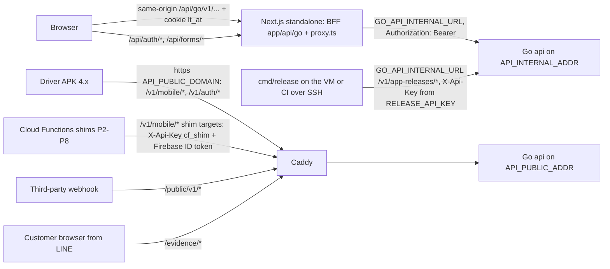
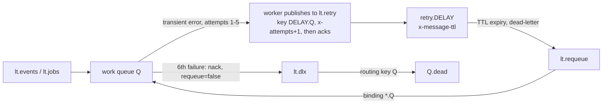

# Appendix B — API catalog, realtime topics, queues and Redis map

Part of the mv-go migration spec (Firebase -> Go 1.27 + Fiber v3.5 + PostgreSQL 18 + RabbitMQ + Redis + MinIO). Main document: [developer-spec.md](../../../developer-spec.md) (§5 API surface, §7 async, §8 realtime, §10 web tier, §11 mobile). Sibling appendices: [A — data model](./A-data-model.md), [C — auth and RBAC](./C-auth-rbac.md), [D — seed and mock data](./D-seed-and-mock-data.md), [E — web fetch audit](./E-web-fetch-audit.md). Decision record: [ADR 0029](../../adr/0029-migrate-firebase-stack-to-go-postgres.md).

This appendix is the route-level design input for `logitrack-api/api/openapi.yaml`. Table and column names follow Appendix A; capability keys follow the catalog in Appendix C §C.2; phases follow the strangler plan in main spec §12 (P0 foundations, P1 master data, P2 operations, P3 billing/finance, P4 HR/payroll, P5 comms, P6 security center/platform/dashboard, P7a mobile app, P7b storage flip, P8 decommission).

Citation shorthand in the "Replaces" columns: `web:` = `logitrack-web/`, `fn:` = `logitrack-web/functions/src/`, `mob:` = `logitrack-mobile/lib/`. A bare file name with a line (for example `taskService.ts:45`) is cited exactly as the fact-base reports cite it; the full path is in those reports. `.vibe-rules.md` line numbers are as of commit 4f552099 (the ADR 0029 edit shifts later lines). No secret values appear anywhere in this appendix; only environment variable names.

This appendix is normative for route paths, realtime topics, RabbitMQ exchanges/queues/routing keys and Redis keys (resolutions R36-R90): where another document of the set disagrees on one of these, this appendix wins and the other copies it.

## B.1 Conventions

### B.1.1 Base paths and route groups

| Prefix | Purpose | Listener |
|---|---|---|
| `/v1/*` | Versioned JSON API for staff (web through the BFF) | internal |
| `/v1/auth/*` | Login, Google OIDC, refresh, logout, password reset, tenant switch, SSE ticket, Firebase session exchange (P7a) | public (and internal) |
| `/v1/mobile/*` | Driver app API (APK 4.x from P7a), the targets of the five Cloud Functions callable shims (from P2, §B.2.22), the anonymous version-gate settings | public (and internal) |
| `/public/v1/*` | Inbound webhooks and postbacks from third parties, signature-verified per provider. **No routes exist today** (§B.2.24) | public (and internal) |
| `/evidence/*` | Server-rendered evidence gallery opened from LINE Flex cards | public (and internal) |
| `/healthz` | Liveness | public (and internal) |
| `/readyz`, `/startupz`, `/.well-known/jwks.json`, `/v1/bridge/*` | Readiness, migration gate, JWKS for the web edge gate, Firebase custom-token bridge for the BFF | internal |
| `/metrics` | Prometheus, separate `METRICS_ADDR`, never routed by Caddy | metrics port only |

`/v1` is additive-only (MANDATORY API-versioning rule `.vibe-rules.md:365-393`): a breaking change is a new path or `/v2`; retired routes return `Deprecation`/`Sunset` headers before deletion.

### B.1.2 Listener column (ingress policy, plan §4b, R35)

The `api` process runs two Fiber listeners from the same route registry:

| Listener | Bind | Serves | Anything else |
|---|---|---|---|
| internal | `API_INTERNAL_ADDR` on the compose network / loopback only; reached by the Next.js BFF at `GO_API_INTERNAL_URL` | **every** route in this appendix | n/a |
| public | `API_PUBLIC_ADDR` behind Caddy on `API_PUBLIC_DOMAIN` | only `/v1/mobile/*`, `/v1/auth/*`, `/public/v1/*`, `/evidence/*`, `/healthz`; groups additionally filtered by the allow-list `PUBLIC_ROUTE_GROUPS` | **404 `not_found`** (never 401/403, so the internal surface is not disclosed) |

In the tables, `internal` means the route exists only on the internal listener; `public` means it is mounted on the public listener **and**, like every route, on the internal listener. Every row carries exactly one of these two values. `X-Forwarded-For` is honoured only from `TRUSTED_PROXY_CIDRS` (Caddy on the public side, the `web` container on the internal side) so IP rate limits see the real client.

Path decisions this appendix takes to satisfy the ingress policy:

- Every endpoint the driver app calls lives under `/v1/mobile/*` (§B.2.21, R42), including the identity aliases `/v1/mobile/me`, `/v1/mobile/me/sessions`, `/v1/mobile/me/devices` and the SSE stream `GET /v1/mobile/events?ticket=`. Where the same service also backs a staff route (for example `GET /v1/tasks/{id}` and `GET /v1/mobile/tasks/{id}`), both rows exist and the Notes column names the shared service; the handler differs only in principal checks.
- The five Cloud Functions callable shims call `/v1/mobile/*` routes on the public listener (§B.2.22, R45). The five shims use seven target routes: three are routes APK 4.x also uses (`GET /v1/mobile/me`, `POST /v1/mobile/tasks/{id}/stops`, `POST /v1/mobile/broadcasts/{id}/read`); `POST /v1/mobile/trips/{id}/billing/compute` and the three `.../line-notify` routes exist only for the shims (APK 4.x gets the same effects from the outbox).
- Staff-only mobile administration lives under `/v1/app-installations/*` and `/v1/app-releases/*` on the **internal** listener, including APK publishing (R43): the publish CLI `cmd/release` runs on the private network (on the VM, or in a CI job over SSH) and calls `GO_API_INTERNAL_URL` with an API key of scope `release_publisher` read from `RELEASE_API_KEY` (R82). No release route exists on the public listener.
- The anonymous marketing forms (`waitlist`, `partner-interest`) are posted by the browser to the unauthenticated BFF route handlers `POST /api/forms/waitlist` and `POST /api/forms/partner-interest` (R77), which forward to the internal `POST /v1/waitlist` and `POST /v1/partner-interest`, rate-limited by `RATE_LIMIT_PUBLIC_FORMS` (R44). `/public/v1/*` stays empty and is reserved for signed third-party postbacks.

### B.1.3 Web path (BFF) and mobile path

The browser never calls Go. The generic BFF proxy (`app/api/go/[...path]/route.ts`, `runtime='nodejs'`, `dynamic='force-dynamic'`) maps `/api/go/<rest>` to `{GO_API_INTERNAL_URL}/<rest>`, reads the HttpOnly cookie `lt_at`, sends `Authorization: Bearer`, `X-Request-Id`, `X-Forwarded-For` (and `X-Act-On-Tenant` when present), streams the body back, strips hop-by-hop headers, forwards the abort signal, applies `GO_API_INTERNAL_TIMEOUT_MS` (not to `/v1/events`), and rejects mutations whose `Origin`/`Sec-Fetch-Site` is not same-origin (`WEB_PUBLIC_ORIGIN`). It holds no business logic, **never refreshes** (it cannot see `lt_rt`), and answers `404` for `v1/auth/(login|google|refresh|tenant|logout|logout-all|sse-ticket|exchange)` and `v1/bridge/*` (R38), so token-bearing responses only ever pass through the dedicated auth routes below; `v1/auth/password/*` passes through it (forgot, reset and the ticket form of change return no tokens). Go returns tokens in the JSON body to its internal caller (`platform: "web"`) and never sets cookies; only the BFF sets them (R38):

| BFF route (Next.js) | Go route it calls (internal) | Cookie effect |
|---|---|---|
| `POST /api/auth/login` | `POST /v1/auth/login` (`platform: "web"`) | sets `lt_at` and `lt_rt`; a `403 password_change_required` (with `details.passwordChangeTicket`, no tokens, R79) is passed to the page and sets no cookie |
| `GET /api/auth/google/nonce` | `GET /v1/auth/google/nonce` | none |
| `POST /api/auth/google` | `POST /v1/auth/google` (GIS ID token + the nonce above) | same as login |
| `POST /api/auth/refresh` | `POST /v1/auth/refresh` with the `lt_rt` value in the body | rotates both; a no-op `204` (no upstream call) while `lt_at` has more than 120 s left (R37), unless the body is `{"force": true}` (sent only after `claims_changed`, R78) |
| `GET /api/auth/refresh?next=` | same as `POST` | rotates both, then `303` to `next` (same-origin relative path only) or to `/login?next=` on failure; serves page navigations that `proxy.ts` redirected (R37) |
| `POST /api/auth/logout` | `POST /v1/auth/logout` (bearer from `lt_at`, `refreshToken` from `lt_rt`) | clears both |
| `POST /api/auth/tenant` | `POST /v1/auth/tenant` | replaces `lt_at` |
| `POST /api/auth/firebase-token` (from the P0 login switch until TW7 at the end of P6, R40, R80) | `POST /v1/bridge/firebase-token` | none; returns a Firebase custom token for pages that still read Firestore; removed with TW7 |
| `POST /api/forms/waitlist`, `POST /api/forms/partner-interest` (unauthenticated, R77) | `POST /v1/waitlist`, `POST /v1/partner-interest` | none; reads no cookie and sends no `Authorization`; forwards `X-Forwarded-For` so the per-IP `RATE_LIMIT_PUBLIC_FORMS` buckets see the visitor; same Origin check as every mutation |
| `/api/go/*` (generic proxy) | every other internal route, e.g. `GET /v1/events` (bearer from cookie) | none; `text/event-stream` is passed through unbuffered |

Cookies (R36): `lt_at` = access JWT, `HttpOnly; Secure; SameSite=Lax; Path=/` (so `proxy.ts` sees it on `/app/*`), `Max-Age` from `JWT_ACCESS_TTL`; `lt_rt` = refresh token, `HttpOnly; Secure; SameSite=Lax; Path=/api/auth`, `Max-Age` from `REFRESH_TOKEN_TTL_WEB`. `Secure` follows `SESSION_COOKIE_SECURE`, the domain `SESSION_COOKIE_DOMAIN`.

Refresh flow (R37, R78): on a `401` whose `error.code` is `token_expired` (or `unauthenticated` because no access token is present) the browser fetch helper `goFetch` runs **one** shared refresh (`POST /api/auth/refresh`, serialised across tabs with `navigator.locks`) and retries the request once. When `details.reason` is `claims_changed` the refresh is sent with `{"force": true}`, which skips the 120 s no-op. Inside the lock the `localStorage["lt:lastRefreshAt"]` and `["lt:lastForcedRefreshAt"]` timestamps (no token material) let a tab that waited skip a refresh another tab already completed after its trigger; a `claims_changed` caller counts only a forced one (T17). Any other 401 (`session_revoked`, `invalid_token`), or a failed refresh, clears the TanStack cache and goes to `/login?next=`. Go accepts a rotated refresh token for 30 s while its successor has not been presented (concurrent tabs) before treating reuse as theft (§B.2.2).

`proxy.ts` (Next 16 edge gate, matcher `/app/:path*`, R39) verifies `lt_at` with `jose` against `GET {GO_API_INTERNAL_URL}/.well-known/jwks.json` (cached by `kid`; `iss` = `JWT_ISSUER`, `aud` = `JWT_AUDIENCE`), then calls internal `GET /v1/me` cached per `(sid, ver)` for 60 s and checks `ROUTE_CAPABILITIES` (moved from `web:lib/capabilities.ts`, re-keyed to colon keys). A missing or expired `lt_at` redirects to `GET /api/auth/refresh?next=<path>`; the exact path `/app` redirects to the role's home route (R89; detail in Appendix E §E.8.4). The web server therefore also reads `JWT_ISSUER`, `JWT_AUDIENCE`, `JWT_ACCESS_TTL` and `REFRESH_TOKEN_TTL_WEB`. No build-time API URL or domain-flag variable exists; domain flags come from `GET /v1/config/web-flags` (Go env `WEB_FLAG_OVERRIDES`), cached as TanStack key `['webFlags']` for 60 s (R41). The only public web variable added is `NEXT_PUBLIC_GOOGLE_OIDC_CLIENT_ID`.

The driver app calls the public listener directly with `Authorization: Bearer <access JWT>` and the refresh token in the JSON body (stored in `flutter_secure_storage`), dart-defines `API_BASE_URL`, `SSE_BASE_URL`, `GOOGLE_OIDC_CLIENT_ID`. An APK 4.x that still holds a Firebase session from 3.x exchanges its Firebase ID token for a Go session once at `POST /v1/auth/exchange` (P7a, R42) and uses Go tokens only afterwards. Mobile SSE uses a ticket (`POST /v1/auth/sse-ticket` -> `GET /v1/mobile/events?ticket=`); the web never uses tickets (its stream is same-origin through the BFF with the cookie).

### B.1.4 Capability / auth column vocabulary

| Value | Meaning |
|---|---|
| `public` | No principal. Always rate-limited (Notes give the bucket). |
| `authenticated` | Any valid principal (JWT with live `sid` and matching `ver`, or an API key where stated). Row visibility is still enforced by RLS (Appendix C §C.3). |
| `<module>:<action>` | A capability key from the Appendix C catalog: **81 keys (77 + 4 platform)**, i.e. 77 tenant/scope keys including `mobile:create_hub` plus 4 `platform:*` keys (R73), colon form, defined once in Go `internal/authz/catalog.go`. Capabilities are resolved per request from `rbac:caps:*` (§B.6), never read from the token. `a \| b` = any-of; `a + b` = both. |
| `driver:self` | Principal is a driver (`drv` claim, or the driver resolved through `users.legacy_auth_uid` from a Firebase ID token forwarded by a callable shim, §B.2.22; the APK itself exchanges its Firebase ID token once through `POST /v1/auth/exchange`, §B.2.21, and then holds a Go token) and the row's `driver_id` (or `helper_driver_id`, or the driver's active/assigned truck for maintenance) is that driver. Driver routes are always `mobile:<x> + driver:self` (R5). |
| `platform` | Principal holds a platform role in `user_platform_roles` (`platform_admin`; `support` only where the Notes say read-only). Platform principals act on a tenant only through `X-Act-On-Tenant` (internal listener only; each request is audited as `platform_cross_tenant_access` in its own committed transaction before the handler runs, Appendix C §C.3.9). |
| `apikey` | Machine principal from an `api_keys` row, presented as `X-Api-Key`; the key's `capabilities[]` must contain the listed key. Key scopes (`api_keys.scope`, R82): `cf_shim` (public listener, only the shim targets of §B.2.22, and only together with a Firebase ID token, which yields a `driver:self` principal; the key alone grants nothing), `release_publisher` (internal listener, the two APK publish routes of §B.2.18; held by `cmd/release` as `RELEASE_API_KEY`), `integration` / `script` (internal listener, any route the key's capabilities allow). |

Scope axes are applied by the data layer, not by extra tokens in this column: a customer-scoped principal (`cs` claim, `user_scopes` rows of kind `customer` referencing `billing_parties.id`) sees only rows linked to its parties; a dispatcher (`dsp` claim, `user_scopes` kind `dispatcher`; the only two kinds, R86) reads across tenants; both scope principals are served exclusively from the `scope_*` projection views (`security_invoker`, Appendix C §C.3.7, R85) and never from the carrier-internal tables (billing snapshots, rate tables, statements, expenses, maintenance, payroll, penalties, compensation config); own-fleet staff also reach the rows of carriers that work for the own fleet (`tenants.contractor_tenant_id`, GUC `app.subtenant_ids`, R60); `tenant_id` on new rows is stamped by the resolver chain task -> trip -> driver -> truck -> self -> form and never taken from a header or body (the one exception is `PATCH /v1/tasks/{id}` `tenantId`, dispatcher/platform only, audited, R13).

Steward-only keys (R60): `fleet:manage_customers`, `fleet:manage_subcontractors`, `operations:manage_sources`, `operations:calculate_distances`, `security:view_status`, `security:manage_mobile_release` and `waitlist:view` govern global master data, and writes to public holidays (`tenant_id` NULL) and platform-wide broadcasts change data every tenant sees. They take effect only for own-fleet staff or `platform_admin` (GUC `app.steward`); held by anyone else they resolve to `403 permission_denied`.

### B.1.5 Request and response conventions

- **JSON**: UTF-8, field names camelCase in every request and response body, auth bodies included (`accessToken`, `refreshToken`, `idToken`, `installId`, `expiresIn`; R48). One convention for web and mobile; the AU draft's snake_case bodies are normalised to it. Timestamps RFC 3339 UTC; date-only strings `yyyy-MM-dd` are Bangkok calendar dates; `?year&month` are Bangkok months; money is a JSON number in THB with 2 decimals for billing (stored `NUMERIC(14,2)`, R20) and integer THB for payroll and penalties.
- **Success envelope**: `200/201 {"data": <object|array>, "nextCursor": "<opaque>"?, "meta": {...}?}`; `202 {"data": {"jobId": "<uuid>"}}` for async work tracked in `jobs` (R14, R64); `204` for deletes and fire-and-forget actions.
- **Error envelope** (R48, R76): exactly `{"error": {"code": "<stable_code>", "message": "<text>", "details": {...}, "requestId": "<id>"}}`; there is no second localised text field. Clients key off `code` only and render the text from their own en/th i18n catalogues (MANDATORY i18n rule); `message` is a fallback for logs and machine callers.

| HTTP | Codes |
|---|---|
| 400 | `bad_request` (malformed JSON, unknown query parameter), `header_not_allowed` (`X-Act-On-Tenant` on the public listener) |
| 401 | `unauthenticated` (no credential), `invalid_credentials` (login), `token_expired` (`details.reason` = `expired` \| `claims_changed`, R78), `session_revoked`, `invalid_token`, `invalid_signature` (webhooks) |
| 403 | `permission_denied` (`details.missingCapability`), `tenant_required`, `not_task_owner`, `truck_not_in_tenant`, `no_account` (Google sign-in without a linked user), `account_disabled`, `driver_profile_required`, `password_change_required` (login, Google sign-in and exchange: `details.passwordChangeTicket`, `details.expiresIn`, no tokens, R79) |
| 404 | `not_found` (also every non-allow-listed path on the public listener) |
| 405 | `method_not_allowed` (path exists, method does not; added in T01) |
| 409 | `already_exists` (also a user creation whose email another Firebase account holds while the bridge mirrors: `details.reason = "firebase_account_exists"`, Appendix C §C.6.4), `failed_precondition`, `idempotency_conflict`, `duplicate_trip_id`, `duplicate_seal`, `duplicate_tax_invoice`, `duplicate_destination`, `billing_period_locked` (`details.blockedInvoiceNumber`), `frozen_snapshot`, `payroll_locked`, `statement_not_draft`, `announcement_immutable` |
| 413 | `payload_too_large` (body over the 4 MiB API limit; uploads go to presigned URLs; added in T01) |
| 422 | `invalid_argument` (`details.fields[]`), `no_customer`, `no_rate`, `no_vehicle_class` (R15), `no_billing_date` (R19), `no_ended_at` (standby), `tenant_orphan`, `capability_not_overridable`, `too_many_scopes` (more than 20 parties per user) |
| 423 | `locked` (login lockout after 5 failures in 15 min per email) |
| 426 | `version_blocked` (`details.minAllowedVersion`, `details.apkDownloadUrl`) |
| 429 | `resource_exhausted` (`Retry-After` header) |
| 500 / 503 | `internal`, `unavailable`, `bridge_unavailable` (the Firebase account mirror failed, so the change was not committed, Appendix C §C.6.4) |

- **Pagination**: keyset only. `?limit=` (default 50, max 500; `GET /v1/trips/monitor` pages are 200) and `?cursor=` (opaque base64 of `(sort_value, id)`); default order `created_at DESC, id DESC`; endpoints that sort by another column (`last_message_at`, `delivered_at`, `ended_at`, `last_seen_at`, `last_login_at`, `date`) still tie-break on `id`. Response carries `nextCursor` (absent on the last page). No offset pagination and no silent caps (the seven web caps listed in Appendix E disappear).
- **Idempotency-Key**: required on rows marked `✱` in the Path column (driver-app writes that the offline outbox replays). Header `Idempotency-Key: <uuid>`; scope `(user_id, key)`; fingerprint = sha256 of method + path + body. Hot copy in Redis `idem:http:{userId}:{key}` for 24 h with in-flight lock `idem:lock:{userId}:{key}` (SET NX PX 30000); durable copy in `idempotency_keys(scope, key)` until `expires_at = created_at + IDEMPOTENCY_TTL` (default **168h**), consulted on a Redis miss (R53). A replay returns the stored status and body byte for byte with `Idempotent-Replayed: true`; a different fingerprint returns `409 idempotency_conflict` (`details.reason = "fingerprint_mismatch"`), a duplicate while the first request still runs `409 idempotency_conflict` (`details.reason = "in_flight"`, `Retry-After: 1`). Only `2xx` responses are recorded: any other outcome committed nothing, so its claim is released and the client may retry with the same key. A missing or non-uuid header is `400 bad_request` (`details.reason` `missing` or `malformed`). The `in_progress` row is the durable claim (its `created_at` fences `Complete`/`Release`); with the Redis lock it is a 30 s lease, and a claim older than that is taken over because its holder is presumed dead, so a Redis outage degrades to PostgreSQL alone. To keep a live holder from being taken over, the route runs under a 25 s deadline counted from before the lease is taken, and `✱` handlers do their database and storage work under the request context: a request that cannot finish in time is cancelled, rolled back and released before its lease ends. A handler that ignored its context and outlived the lease could run a second time for a retry; the natural keys below then decide, and the late response is stored nowhere (`Complete` reports the takeover), so the Redis and PostgreSQL copies never disagree. The `✱` routes without a natural key (check-in, deliver, stops deliver, resubmit-photos, maintenance check-in and complete, `PATCH` expenses, `POST /v1/mobile/hubs`) depend on that deadline (T09: `internal/platform/httpx/idempotency`). Durable natural keys remain the last line of defence (R63): the same uuid travels in the body as `clientOpId` and is stored as `client_op_id` with a partial `UNIQUE (driver_id, client_op_id)` on `incident_reports`, `standby_records`, `vehicle_expenses`, `leave_requests` and driver-created `tasks`; `chat_messages.client_message_id` is unique per chat; plus `trip_records.trip_no` UNIQUE, `vehicle_expenses (driver_id, tax_inv_id) WHERE type='fuel'`, the per-stop delivery index and the `broadcast_reads` PK.
- **Mobile headers**: `X-App-Version`, `X-App-Build`, `X-App-Flavor`, `X-Install-Id`, `X-Platform`. The version-floor middleware (env `MOBILE_VERSION_FLOOR_ENFORCE`) answers `426 version_blocked` on every `✱` route and on `GET /v1/mobile/me` when `X-App-Version` is below `settings['mobile_app'].minAllowedVersion` (ADR 0007 semantics, now server-side). Shim principals (§B.2.22) carry no app headers and are exempt; the APK 3.x floor is still enforced on the device from `GET /v1/mobile/settings` or the Firestore projection.
- **Tenant context**: the access token carries one active tenant (`tid`, `rol`), kept per session in `sessions.active_tenant_id`; `POST /v1/auth/tenant` re-issues it for another membership (R83). Cross-tenant work is platform-only, on the internal listener only, through `X-Act-On-Tenant: <uuid>` (acts as that tenant's `tenant_admin`; reads need `platform:cross_tenant_read`, writes `platform:cross_tenant_write`) or `X-Act-On-Tenant: *` (read-only bypass, `GET`/`HEAD` only); the public listener answers `400 header_not_allowed`. Each request writes one `security_events` row `platform_cross_tenant_access` in its **own committed transaction before** the handler's transaction begins (a read-only `*` transaction cannot insert; no audit, no access; Appendix C §C.3.9, R85).
- **Rate limits**: GCRA in Redis `rl:{bucket}:{key}`; buckets and limits are listed in §B.6.3 and repeated in the Notes of the affected rows.
- **Caching headers**: master-data reads (`/v1/hubs`, `/v1/holidays`, `/v1/mobile/settings`, `/v1/mobile/hubs`) return `ETag` and honour `If-None-Match` (304).

### B.1.6 OpenAPI 3.1 as the single source of truth (R27)

Each row in §B.2 becomes exactly one OpenAPI operation in `logitrack-api/api/openapi.yaml`: `operationId = <domain>.<verb><Resource>`, vendor extensions `x-listener: internal|public`, `x-capability: [...]`, `x-phase: P0..P8`, `x-idempotent: true` for `✱`, `x-replaces: [...]`. After the first generation the YAML file is the contract (ADR 0029 decision on SSOT): `shared-docs/schemas` Zod schemas and Dart models are generated or validated from it (openapi-typescript for the web, openapi-generator for Dart), request validation middleware uses it (kin-openapi), and CI fails when the Fiber route registry (method, path, listener, capability) and the OpenAPI document diverge. This appendix is then regenerated from the YAML, not edited by hand.

## B.2 Endpoints by domain

One row per operation. `✱` after a path = `Idempotency-Key` required (§B.1.5). "Phase" = the strangler phase in which the Go route ships (the web page or APK switches to it in the same phase unless the Notes say otherwise). "in tx" in the Notes = the `security_events` row is inserted in the same PostgreSQL transaction as the change (privileged or authorization-relevant change); "audit via consumer" = written by the `security.audit` queue (§B.5.3). Request/response field lists are indicative; the OpenAPI document generated from these rows is normative (§B.1.6).

### B.2.1 Health, discovery and web configuration

| Method | Path | Capability / auth | Listener | Phase | Replaces | Notes |
|---|---|---|---|---|---|---|
| GET | `/healthz` | public | public | P0 | — | Process alive; no dependency checks; used by Caddy and compose healthchecks on both listeners |
| GET | `/readyz` | public | internal | P0 | — | PostgreSQL `SELECT 1`, Redis `PING`, RabbitMQ channel (worker/scheduler), MinIO `BucketExists`; `503` while draining. Worker and scheduler answer it on `METRICS_ADDR` (T10): worker = PostgreSQL + an open RabbitMQ session (topology asserted); scheduler = PostgreSQL + Redis on every replica, plus the broker connection on the leader only (a standby holds none). A failure is `503 unavailable` with `details {reason: dependencies, checks: {name: "unreachable"}}` |
| GET | `/startupz` | public | internal | P0 | — | `200` once goose version >= the binary's required version |
| GET | `/.well-known/jwks.json` | public | internal | P0 | new (W4); retires the per-load `setAdminClaims` call `web:context/auth.tsx:52` as the edge's role source | Ed25519 public keys for `JWT_ACTIVE_KID` and the previous key (`JWT_SIGNING_KEY_FILE`, `JWT_PREVIOUS_KEY_FILE`); `Cache-Control: public, max-age=300`; consumed only by web `proxy.ts` over the private network |
| GET | `/v1/config/web-flags` | public | internal | P0 | build-time domain flag of the delivery-plan draft (removed, R35) | `{"data": {"domains": {"auth": "go", "masterdata": "firebase", ...}}}`, all nine domains of main spec §12.1, each `go` or `firebase`: a `PG_OWNED_DOMAINS` domain is `go`, then each `WEB_FLAG_OVERRIDES` entry (`domain=go\|firebase`) replaces its domain; both variables are parsed at start-up (a bad value stops the api) and the answer carries `Cache-Control: no-store`, so the 60 s TanStack `['webFlags']` poll is the only delay; contains no secrets; a domain rollback needs no web rebuild (`internal/webcfg`, T17) |

### B.2.2 Auth (`/v1/auth/*`, semantics owned by Appendix C §C.8 "Auth and tenancy endpoints", R4)

| Method | Path | Capability / auth | Listener | Phase | Replaces | Notes |
|---|---|---|---|---|---|---|
| POST | `/v1/auth/login` | public | public | P0 | `web:context/auth.tsx:150-153` + `web:lib/updateUserLastLogin.ts:93`; `mob:auth_repository.dart:71-109`; claims callables `setAdminClaims` (`fn:auth.ts:12`), `setDriverClaims` (`fn:auth.ts:75`) | Body `{email, password, platform: web\|android\|ios\|script, installId?, appVersion?, geo?}` -> `{accessToken, expiresIn, refreshToken, tenants[{id, nameTh, nameEn, kind, role}], defaultTenantId}` (web: returned in the JSON body to the BFF, which sets the cookies; Go never sets cookies, R38). A `must_change_password` user gets **no tokens**: `403 password_change_required` with `details.passwordChangeTicket` (single use, Redis `auth:pwchg:{ticket}`, 10 min) redeemed at `POST /v1/auth/password/change` (R79). Wrong email or password (also unknown, `deleted` or `reset_required` users) -> `401 invalid_credentials`; a correct password on a disabled account -> `403 account_disabled`. Argon2id, or Firebase-scrypt verify then rehash (Appendix C §C.5). The new `sessions` row stores `active_tenant_id` = `defaultTenantId` and `install_id`; a live session of the same user on the same install is revoked first (`device_relogin`, partial unique index on `sessions (user_id, install_id)`, R83). `last_login_*` written in tx; outbox `user.logged_in` (not audited, R22). Rate limits (`RATE_LIMIT_LOGIN`) `rl:login_ip` 10/min/IP, `rl:login_fail` 5 failures/15 min/email -> `423 locked` + `login_lockout` audit via consumer |
| GET | `/v1/auth/google/nonce` | public | public | P0 | — | `{nonce, expiresIn}`; Redis `auth:google:nonce:{nonce}` 10 min, single use; web only (GIS), called by BFF `GET /api/auth/google/nonce`. `rl:google_nonce_ip` 60/min/IP; `404` while `GOOGLE_OIDC_ALLOWED_CLIENT_IDS` is unset (T06) |
| POST | `/v1/auth/google` | public | public | P0 | `mob:auth_repository.dart:111-179` (Google sign-in); web Firebase popup sign-in | `{idToken, nonce?, platform, installId?, appVersion?}`; go-oidc against `accounts.google.com`, `aud` in `GOOGLE_OIDC_ALLOWED_CLIENT_IDS` (web client and the APK's existing server client id), `email_verified`, nonce required for `platform=web`; resolves `auth_identities (provider='google', provider_subject=sub)`, else links a user with the same verified email (`google_identity_linked` in tx); otherwise `403 no_account` (no self-signup). Response and session handling as login (`amr` `google`; a `must_change_password` user gets `403 password_change_required`, a disabled one `403 account_disabled` before any link). A rejected token, and a nonce that is used, unknown or not the token's, is `401 invalid_token`; a body `nonce` must be the token's and an unused issued one on every platform, and a GIS token (`azp` = `aud`, or no `azp`) with a `nonce` claim needs it in the body even on `android`/`ios`; a driver-app token (`azp` ≠ `aud`) sent without a body nonce may carry the SDK's own nonce (GoogleSignIn-iOS always adds one), which is ignored. Linking by email needs Google to be authoritative for the address (`@gmail.com`/`@googlemail.com`, or `hd` set), else `403 no_account`; a link by `sub` is unaffected; Google unreachable `503 unavailable`; `404` while `GOOGLE_OIDC_ALLOWED_CLIENT_IDS` is unset (T06, Appendix C §C.4.10). `rl:google_ip` 30/min/IP |
| POST | `/v1/auth/exchange` | public | public | P7a | Firebase session of an upgraded APK (`mob:auth_repository.dart:71-179` sign-in state carried from 3.x) | Session exchange (R42): `{idToken, platform: android\|ios, installId, appVersion?}` with a **Firebase** ID token, verified by go-oidc against issuer `https://securetoken.google.com/{FIREBASE_PROJECT_ID}` (audience `FIREBASE_PROJECT_ID`); user by `users.legacy_auth_uid = sub`, must be `status='active'` with `auth_time >= password_changed_at`; response as login (a new Go session, `amr` mapped from the Firebase `sign_in_provider`: `password` -> `pwd`, `google.com` -> `google`). Exists only while `AUTH_FIREBASE_BRIDGE_MODE` is `mobile` or `both` (otherwise `404`); web sessions cannot use it (the generic BFF proxy returns `404`). `rl:exchange_ip` 30/min/IP; outbox `user.logged_in` |
| POST | `/v1/auth/refresh` | public | public | P0 | Firebase SDK token refresh; `mob:main_layout.dart:194-238` | `{refreshToken}` -> rotated pair in the same family (`refresh_tokens`). A rotated token presented again within 30 s while its successor is unused (concurrent tabs or a retried mobile request) gets a sibling successor (R37); any other reuse revokes the family and session, bumps `auth_version`, writes `refresh_token_reuse` (critical) in tx and emits `session.revoked` (`reason=refresh_reuse`). TTL `REFRESH_TOKEN_TTL_WEB` (7 d sliding / 30 d absolute) or `REFRESH_TOKEN_TTL_MOBILE` (90 d). `rl:refresh_session` 60/min |
| POST | `/v1/auth/tenant` | authenticated | public | P0 | new (multi-tenant) | `{tenantId}` (must be an active membership) -> `{accessToken, expiresIn}` with that `tid`/`rol`; writes `sessions.active_tenant_id`, which every later refresh re-issues as `tid` (R83); refresh token unchanged; web through BFF `POST /api/auth/tenant` |
| POST | `/v1/auth/logout` | authenticated | public | P0 | `mob:auth_repository.dart:181-190` | `{refreshToken?, installId?}` -> `204`; revokes the current session, deletes the install's `device_tokens` row (body `installId`, else the session's). The bearer or the refresh token alone suffices, so the BFF can sign out a session whose access token has expired; a bearer of an already revoked session is `204`; no valid credential at all is `401 unauthenticated`. Outbox `user.sessions_revoked` (`reason=logout`) |
| POST | `/v1/auth/logout-all` | authenticated | public | P0 | — | `204`; revokes every own session, `auth_version++`, outbox `user.sessions_revoked` -> SSE `session.revoked` (`reason=logout_all`) |
| POST | `/v1/auth/password/forgot` | public | public | P0 | Firebase reset mail `web:features/auth/hooks/useForgotPassword.ts:16`; mobile had none | `{email, locale?}` -> **202** with an empty body always (R4), also for unknown, disabled and deleted users and over the rate limits; outbox `auth.password_reset_requested` -> `notify.email`, whose consumer creates the `password_reset_tokens` row (`PASSWORD_RESET_TTL`, 30 min) and sends the link (Appendix C §C.4.9). `rl:forgot_email` 3/h, `rl:forgot_ip` 20/h |
| POST | `/v1/auth/password/reset` | public | public | P0 | — | `{token, newPassword}` -> `204`; revokes all sessions; `password_reset_completed` in tx. An unknown, used or expired token is `422 invalid_argument` (`details.fields[0].field = "token"`); a policy violation `422` on `newPassword` (Appendix C §C.4.8). `rl:reset_ip` 10/h |
| POST | `/v1/auth/password/change` | authenticated, or public with a `passwordChangeTicket` | public | P0 | — | Bearer: `{currentPassword, newPassword}` -> `204`, other sessions revoked (`currentPassword` required: missing -> `422 invalid_argument` reason `required`, wrong -> reason `mismatch`; a user without a password, such as a Google-only one, sets one through `/password/forgot` + `/password/reset`, Appendix C §C.5.6). Ticket (R79): `{passwordChangeTicket, newPassword}` -> `204` without tokens (`GETDEL auth:pwchg:{ticket}`); the client then logs in again (web through `POST /api/auth/login`). Either way `must_change_password=false`, `password_changed_at` set, `password_changed` in tx. A wrong `currentPassword` or a bad ticket is `422 invalid_argument` (never a 401, which would sign the client out); the policy is checked before the ticket is consumed. When the body carries `passwordChangeTicket` the ticket form is used and any `Authorization` header is ignored (the generic BFF proxy forwards `lt_at` whenever the cookie exists); a ticket issued before a later `auth_version` bump is void. `rl:reset_ip` 10/h |
| POST | `/v1/auth/sse-ticket` | authenticated (session platform `android` or `ios`, else `403`) | public | P7a | — | Driver app only: `{ticket, expiresIn: 60}`, Redis `auth:sse:{ticket}` single use, consumed by `GET /v1/mobile/events?ticket=`. The web never calls it (same-origin cookie stream through the BFF; the generic proxy returns `404`) |

### B.2.3 Current principal and Firebase bridge (`/v1/me*`, `/v1/bridge/*`, semantics: Appendix C §C.6 and §C.8)

| Method | Path | Capability / auth | Listener | Phase | Replaces | Notes |
|---|---|---|---|---|---|---|
| GET | `/v1/me` | authenticated | internal | P0 | `setAdminClaims` (`fn:auth.ts:12`, called on every auth change `web:context/auth.tsx:52`); `checkAdminStatus` (`fn:auth.ts:140`, dead); `permissions_config` reads `web:hooks/usePermission.ts:51` | `{id, email, displayName, photoUrl, tenant{id,nameTh,nameEn,kind,role}\|null, tenants[], platformRoles[], dispatcher, steward, driver{id}\|null, customerScopes[{billingPartyId,name}], capabilities[], mustChangePassword, legacyAuthUid (bridge only)}`; TanStack `['me']` 5 min replaces the auth listener and every `usePermission` read; `proxy.ts` caches it per `(sid, ver)` for 60 s for route checks (R39). Driver app: `GET /v1/mobile/me` |
| PATCH | `/v1/me` | authenticated | internal | P0 | `web:lib/updateUserLastLogin.ts:93` | `{displayName?, photoKey?, lastLoginGeo?{lat,lng,source,accuracyM}}` (`photoKey` from `POST /v1/uploads/presign`, committed to `users.photo_file_id`); role, status and scopes are not self-editable (closes self-writable `users/{uid}`, `firestore.rules:57-60`) |
| GET | `/v1/me/tenants` | authenticated | internal | P0 | — | `[{id, nameTh, nameEn, kind, role, status}]` for the tenant switcher |
| GET | `/v1/me/sessions` | authenticated | internal | P0 | — | Own `sessions` (platform, device label, app version, IP, last seen). Driver app: `GET /v1/mobile/me/sessions` |
| DELETE | `/v1/me/sessions/{sid}` | authenticated | internal | P0 | — | `204`; revokes one own session. Driver app: `DELETE /v1/mobile/me/sessions/{sid}` |
| PUT | `/v1/me/devices` | authenticated | internal | P5 | `users.fcmTokens` (`mob:fcm_service.dart:28-50`) + `drivers.fcmToken` (`mob:driver_repository.dart:73-83`) | `{installId, token, platform, appFlavor}` upsert `device_tokens` PK `(user_id, install_id)`, `token` UNIQUE, `driver_id` nullable (R4); ships with `notify.fcm` in P5 (until P7a the ETL mirror fills `device_tokens` from the 3.x token fields). Driver app: `PUT /v1/mobile/me/devices` |
| DELETE | `/v1/me/devices/{installId}` | authenticated | internal | P5 | none (tokens are never removed today) | `204`. Driver app: `DELETE /v1/mobile/me/devices/{installId}` |
| POST | `/v1/bridge/firebase-token` | authenticated | internal | P0 | per-load claims refresh `web:context/auth.tsx:51-59` | Exists only while `AUTH_FIREBASE_BRIDGE_MODE` is `web` or `both` (otherwise `404`): `{customToken, expiresIn}` = RS256 Firebase custom token for the same uid carrying legacy claims `admin, role, driverId, customerScopeId, partnerScopeId` (R8, R40). Minted only for own-fleet staff, `platform_admin` and users imported from a legacy partner/customer claim; dispatchers and carrier/customer users created in Go get `403 permission_denied` (no Firestore session, because the legacy rules let any signed-in user read tasks, trips and drivers). Called only by BFF `POST /api/auth/firebase-token` (the generic proxy returns `404` for `v1/bridge/*`); deleted at the end of P6 with TW7 |

### B.2.4 Tenants, memberships and quarantine (semantics: Appendix C §C.8)

| Method | Path | Capability / auth | Listener | Phase | Replaces | Notes |
|---|---|---|---|---|---|---|
| GET | `/v1/tenants` | `platform:manage_tenants` \| `fleet:manage_subcontractors` (steward, carriers only) | internal | P1 | — | `?kind=own_fleet\|carrier\|quarantine&status&cursor`; carriers are tenants of kind `carrier` (no `subcontractors` table, R6/R7) |
| POST | `/v1/tenants` | `platform:manage_tenants` | internal | P1 | `web:features/subcontractors/services/subcontractorService.ts:86-107` (platform path) | `{kind: carrier, code, nameTh, nameEn?, contractorTenantId?}` + profile; creates the `billing_parties` row in the same tx; `tenant_created` in tx; outbox `tenant.created`. The quarantine tenant is inserted by migration `0002` with the fixed id `00000000-0000-7000-8000-00000000000f`, and the single `own_fleet` row (partial unique) by `cmd/seed` / `cmd/etl` with `OWN_FLEET_TENANT_ID` (R56); neither is created here. Own-fleet stewards onboard carriers through `POST /v1/subcontractors` |
| GET | `/v1/tenants/{id}` | `platform:manage_tenants` \| `fleet:manage_subcontractors` (steward) \| authenticated (member of `{id}`) | internal | P1 | — | Profile incl. `lineGroupId`, `billingDateBasis`, `contractorTenantId`, status history |
| PATCH | `/v1/tenants/{id}` | `platform:manage_tenants` | internal | P1 | `subcontractorService.ts:86-107` | `code`, `kind`, `status` (appends `status_history`), `contractorTenantId` (the tenant a carrier works for, R56/R60; a change writes `tenant_contractor_changed` in tx and deletes `cache:tenant:subtenants:*` of both tenants); profile-only edits use `PATCH /v1/subcontractors/{id}`; outbox `tenant.updated` |
| GET | `/v1/tenants/{id}/members` | `users:view` (tenant in reach) \| `platform` | internal | P0 | `getUsers` (`fn:users.ts:8`) per-tenant view | `?role&cursor` -> `[{user, role, status, lastLoginAt}]` |
| PUT | `/v1/tenants/{id}/members/{userId}` | `users:assign_role` (tenant in reach) \| `platform` | internal | P0 | `updateUserRole` (`fn:users.ts:42`) | `{role}` (`tenant_role` CHECK; no self-escalation; only `tenant_admin`/platform may grant `tenant_admin`); `auth_version++`, SSE `session.revoked` with `reason=claims_changed` (the user refreshes and stays signed in, R50), `user_role_changed` in tx. Ships in P0 with the Security Center users page (R49) |
| DELETE | `/v1/tenants/{id}/members/{userId}` | `users:assign_role` (tenant in reach) \| `platform` | internal | P0 | `updateUserRole` (`fn:users.ts:42`) | `204`; same side effects |
| GET | `/v1/tenants/quarantine/rows` | `platform:cross_tenant_read` | internal | P1 | — | `?table&cursor` -> rows with `tenant_source='quarantine'` plus the resolver trace (R11); counts also raised by the `tenancy.orphan-scan` job. P1 because the full initial ETL load runs at the start of P1 (R71) |
| POST | `/v1/tenants/quarantine/rows/{table}/{id}/rehome` | `platform:cross_tenant_write` | internal | P1 | — | `{tenantId}` -> `204`; sets `tenant_id`, `tenant_source` to the resolved source; `tenant_rehomed` in tx; bulk re-home of legacy driverless tasks after owner confirmation (D6) |

### B.2.5 Users administration (semantics: Appendix C §C.8)

PostgreSQL is the users writer from P0, so every user write route below ships in P0 and the Security Center users page switches its write actions (and its list) to Go in P0 (R49, issues T18/T19). Only `DELETE /v1/users/{id}` and the overview counter stay P6. Revocation semantics (R50): role, scope, driver-link and platform-role changes bump `users.auth_version` and emit SSE `session.revoked` with `reason=claims_changed` (clients refresh and stay signed in); only disable, password events, admin session revocation and refresh-token reuse end sessions.

| Method | Path | Capability / auth | Listener | Phase | Replaces | Notes |
|---|---|---|---|---|---|---|
| GET | `/v1/users` | `users:view` \| `platform` | internal | P0 | `getUsers` (`fn:users.ts:8`, `listUsers(1000)` unpaginated); users listeners `web:security-center/users/page.tsx:372`, `SessionManagementActiveUsers.tsx:148`; `syncExistingUsers` (`fn:users.ts:435`, retired) | `?q&role&status&sort=last_login_at&cursor`; tenant-scoped (tenants in reach) for `users:view`, all tenants for platform (`support` read-only); fixes the 50-row cap (W9) |
| POST | `/v1/users` | `users:manage` | internal | P0 | `createUser` (`fn:users.ts:177`; callers `security-center/users/page.tsx:484`, `features/drivers/components/EditDriverForm.tsx:183`); `onUserCreated` (`fn:triggers.ts:12`, now inline) | `{email, displayName, role, tenantId? (platform only), driverId?, billingPartyIds?, sendInvite?}` -> `{user, temporaryPassword?}` shown once (absent when `sendInvite`); never emails a password, invite = reset link (R29); `user_created` in tx; outbox `user.created` -> `notify.email` |
| GET | `/v1/users/{id}` | `users:view` \| `platform` | internal | P0 | — | User with memberships, scopes, driver link |
| PATCH | `/v1/users/{id}` | `users:manage` | internal | P0 | — | `{displayName?, email?}`; an email change bumps `auth_version` |
| POST | `/v1/users/{id}/invite` | `users:manage` | internal | P0 | — | `202`; (re)sends the invite as a password-reset link (R29); `user_invited` in tx; outbox `user.invited` -> `notify.email` |
| POST | `/v1/users/{id}/disable` | `users:manage` | internal | P0 | `setUserDisabled` (`fn:users.ts:299`) + `users.forceLogoutAt` listener `web:context/auth.tsx:91-129` | `{reason}` -> `204`; not self; `auth_version++`, sessions revoked, SSE `session.revoked` (`reason=disabled`), `user_disabled` in tx |
| POST | `/v1/users/{id}/enable` | `users:manage` | internal | P0 | `setUserDisabled` (`fn:users.ts:299`) | `204`; `user_enabled` in tx |
| DELETE | `/v1/users/{id}` | `platform` | internal | P6 | `onUserDeleted` (`fn:triggers.ts:35`) | Soft delete (`status='deleted'`), sessions revoked, `user_deleted` in tx |
| POST | `/v1/users/{id}/password/temporary` | `users:manage` (+ `drivers:set_password` when the user is a driver) | internal | P0 | password branch of `updateDriverAccount` (`fn:triggers.ts:137`, admin check commented out) | `{temporaryPassword}` once; `must_change_password=true`; sessions revoked (`reason=password_reset`); `user_password_temporary_issued` in tx; caller-chosen passwords are never accepted |
| GET | `/v1/users/{id}/sessions` | `users:revoke_sessions` | internal | P0 | `listUsers` metadata used by `SessionManagementActiveUsers.tsx` | Device, platform, app version, IP, last seen |
| DELETE | `/v1/users/{id}/sessions` | `users:revoke_sessions` | internal | P0 | `revokeUserRefreshTokens` (`fn:authSessions.ts:9`; callers `security-center/users/page.tsx:603`, `SessionManagementActiveUsers.tsx:180`) | `204`; not self (rule kept from `authSessions.ts:23-28`); `user_sessions_revoked` in tx; SSE `session.revoked` (`reason=admin_revoke`) |
| DELETE | `/v1/users/{id}/sessions/{sid}` | `users:revoke_sessions` | internal | P0 | same | `204`; one session |
| PUT | `/v1/users/{id}/driver-link` | `drivers:edit` + `users:manage` | internal | P0 | `linkDriverToUser` (`fn:users.ts:371`, logs nothing today) | `{driverId}`; one tx: `drivers.user_id`, driver membership in the driver's tenant, `auth_version++`; SSE `session.revoked` (`reason=claims_changed`); `driver_linked` in tx |
| DELETE | `/v1/users/{id}/driver-link` | `drivers:edit` + `users:manage` | internal | P0 | `linkDriverToUser` unlink path | `204`; `auth_version++`, `claims_changed`; `driver_unlinked` in tx |
| PUT | `/v1/users/{id}/scopes/{kind}` | `users:assign_role` (kind `customer`) \| `platform:manage_platform_roles` (kind `dispatcher`) | internal | P0 | `customerScopeId`/`partnerScopeId` edits through `updateUserRole` (`fn:users.ts:42`) | `kind` = `customer` \| `dispatcher` only (R86; any other value `404`); `{billingPartyIds[]}` (at most 20, else `422 too_many_scopes`) -> `user_scopes` rows referencing `billing_parties.id` (R6); `auth_version++`, `claims_changed`; `user_scope_changed` in tx |
| DELETE | `/v1/users/{id}/scopes/{kind}` | same as PUT | internal | P0 | same | `204` |
| POST | `/v1/users/{id}/platform-roles` | `platform:manage_platform_roles` | internal | P0 | hardcoded `ADMIN_EMAILS` bootstrap (`fn:auth.ts:5-7`), together with `cmd/seed` reading `PLATFORM_ADMIN_EMAILS` | `{role: platform_admin\|support}`; not self; `auth_version++`, `claims_changed`; `platform_role_granted` in tx |
| DELETE | `/v1/users/{id}/platform-roles/{role}` | `platform:manage_platform_roles` | internal | P0 | — | `204`; `claims_changed`; `platform_role_revoked` in tx |
| GET | `/v1/stats/users-by-role` | `security:view_overview` | internal | P6 | `DashboardStats.tsx:112-116`, `web:lib/fetchSecurityOverviewStats.ts:32-38` | Counts per tenant role and platform role |

### B.2.6 Roles, API keys, security events

| Method | Path | Capability / auth | Listener | Phase | Replaces | Notes |
|---|---|---|---|---|---|---|
| GET | `/v1/roles` | authenticated | internal | P0 | `CAPABILITY_META` / role defaults in `web:lib/capabilities.ts` and `web:lib/roles.ts` | `{capabilities, roles, stewardCapabilities}`: catalog `[{key, module, class, titleEn, titleTh}]` (`class` = `tenant` \| `global` \| `self` \| `scope` \| `platform`, Appendix C §C.2.2) + default role matrix `[{role, axis, capabilities}]` + the 7 global keys; generated also as `shared-docs/schemas/capabilities.ts` (with `ROUTE_CAPABILITIES`, T07) |
| GET | `/v1/roles/matrix` | `security:manage_roles` | internal | P6 | `permissions_config` reads (`web:hooks/usePermission.ts:51`; `roles/page.tsx:385-398`) | `?tenantId` (platform) -> `{roles:[{role, capabilities:{key:{default, effective, overridden}}}]}` so the UI can diff (ends the reset-to-hardcoded bug `roles/page.tsx:422-426`) |
| PUT | `/v1/roles/matrix` | `security:manage_roles` | internal | P6 | batch write `roles/page.tsx:388-398` + `logSecurityEvent` (`fn:securityEvents.ts:34`, caller `roles/page.tsx:401`) | `{overrides:[{role, capability, allowed}]}` into `role_capability_overrides`; `platform:*`, `dispatch:*` and `users:assign_role` rejected for tenant callers; `role_matrix_saved` with full diff in tx; `INCR rbac:ver`; SSE `roles.changed` |
| GET | `/v1/api-keys` | `security:manage_api_keys` | internal | P2 | `/app/security-center/api-keys` (no backend today) | Lists `key_prefix`, name, scope, capabilities, tenant, `last_used_at`, `expires_at`, `revoked_at`. Routes ship in P2 for the shims (R49); the API-keys page switches in P6 (T54) |
| POST | `/v1/api-keys` | `security:manage_api_keys` | internal | P2 | — | `{name, scope: integration\|script\|cf_shim\|release_publisher, capabilities[], expiresAt?, tenantId?}` -> `{id, keyPrefix, secret}` (secret shown once; stored as sha256(secret + `API_KEY_PEPPER`)); platform-level keys (`tenantId` null, required for `cf_shim` and `release_publisher`) require `platform`; `api_key_created` in tx. `scope` is stored in `api_keys.scope` (CHECK `integration`, `script`, `cf_shim`, `release_publisher`, R82). First consumers: the Cloud Functions callable shims (scope `cf_shim`, Functions param `LOGITRACK_API_KEY`, §B.2.22, T32) and `cmd/release` (scope `release_publisher`, env `RELEASE_API_KEY`, §B.2.18, T52) |
| DELETE | `/v1/api-keys/{id}` | `security:manage_api_keys` | internal | P2 | — | `204`; sets `revoked_at`; `api_key_revoked` in tx |
| GET | `/v1/security-events` | `security:view_audit` | internal | P6 | `audit/page.tsx:104-113`, `web:hooks/useSecurityEventsFeed.ts:65` | `?type&from&to&cursor`; append-only table (no UPDATE/DELETE grants); TanStack `['security','events',{range,type}]` infinite |
| GET | `/v1/security/overview` | `security:view_overview` | internal | P6 | `web:lib/fetchSecurityOverviewStats.ts` | Counters (users by status, failed logins 24 h, revoked sessions, outdated installs, open quarantine rows) |

### B.2.7 Drivers

| Method | Path | Capability / auth | Listener | Phase | Replaces | Notes |
|---|---|---|---|---|---|---|
| GET | `/v1/drivers` | `drivers:view` \| `dispatch:view_operations` | internal | P1 | full scans `taskService.ts:45`, `billing.ts:884,1217,1570`, `expenses.ts:99,165,194`, `BroadcastComposer.tsx:58`; listeners `DriversList.tsx:63`, `useDriverMonitor.ts:471`, `incident-reports/page.tsx:155`, `standby-records/page.tsx:207` | `?status&q&fields=minimal&cursor`; keyset page plus `meta.statusCounts` (`{<status>: n}` over every row matching the other filters, not just the page), so the drivers page stats no longer count only the first 100 rows; dispatcher and customer-scope principals read the `scope_drivers` view (no PII, Appendix C §C.3.7); `fields=minimal` = `{id, displayName}` for pickers; TanStack `['drivers',{status,q,fields}]` 5 min (polled 60 s while visible on the drivers page only, Appendix E); removes the 100-row cap. Driver-app helper picker: `GET /v1/mobile/drivers?fields=minimal` (R33) |
| POST | `/v1/drivers` | `drivers:create` | internal | P1 | `createDriverAccount` (`fn:triggers.ts:48`, no auth check; callers `web:app/app/drivers/actions.client.ts:82`, `features/drivers/api/drivers.ts:87`) | driverSchema fields (`fullNameTh` required, `customerDriverIds`) + optional `login{email}`; no default password ever (`fn:triggers.ts:66-69`): a login gets a generated temporary password shown once (R29); `status_history` "Initial Registration"; tenant = the carrier tenant named in the body (own-fleet callers only) else the caller's tenant; `user_created` in tx when a login is provisioned; outbox `driver.created` |
| GET | `/v1/drivers/{id}` | `drivers:view` | internal | P1 | `web:features/drivers/api/drivers.ts:96` | Includes `activeTruck` and `currentAssignment`; PII fields (ID card number, birth date, document keys) only with `drivers:view_pii` |
| PATCH | `/v1/drivers/{id}` | `drivers:edit` (+ `users:manage` for a login email change) | internal | P1 | `updateDriverAccount` (`fn:triggers.ts:137`, admin check commented out; callers `drivers/actions.client.ts:151`, `drivers.ts:142`) | Partial; passwords are never set here (`POST /v1/users/{id}/password/temporary`); `status` change appends `status_history` with actor; `tenantId` (broker-carrier move) accepted only from `platform` or a steward; the same tx moves the driver membership and writes `driver_tenant_moved` (Appendix C); outbox `driver.updated` |
| GET | `/v1/drivers/{id}/documents/{kind}` | `drivers:view_pii` | internal | P1 | public-read `drivers/**` Storage objects (ID card, licence; `storage.rules`) | `kind = profile\|id_card\|license` -> `302` to a 5-minute presigned GET; prefix `drivers/` is private |

### B.2.8 Trucks, renewals, assignments, vehicle locations

| Method | Path | Capability / auth | Listener | Phase | Replaces | Notes |
|---|---|---|---|---|---|---|
| GET | `/v1/trucks` | `fleet:view_trucks` \| `dispatch:view_operations` | internal | P1 | full scans `taskService.ts:40`, `expenses.ts:100,180`, `maintenance.ts:71,272`, `truckService.ts:119`; listener `useTrucksList.ts:29` | `?ownership&tenantId&status&type&q&cursor`; removes the 100-row cap; `['trucks',{filters,cursor}]` 5 min |
| POST | `/v1/trucks` | `fleet:create_truck` | internal | P1 | `web:app/app/trucks/new/action.client.ts:22,56` (check-then-add race) | truckSchema (Thai plate regex); `UNIQUE (tenant_id, license_plate)` -> `409 already_exists`; vehicle class mapped once by the truckType mapper, unknown -> `NULL` (never guessed); `status_history`; outbox `truck.created` |
| POST | `/v1/trucks/import` | `fleet:create_truck` | internal | P1 | `TruckImportDialog.tsx:159-164` | Multipart XLSX or `{rows[]}` -> `{created, updated, errors[]}` |
| GET | `/v1/trucks/renewals` | `fleet:view_renewals` | internal | P1 | `renewals/actions.client.ts:36-40`, `TruckComplianceCards.tsx:61`, `ComplianceSummary.tsx:33` | `?due=`; registered before `/v1/trucks/{id}` |
| GET | `/v1/trucks/{id}` | `fleet:view_trucks` | internal | P1 | `action.client.ts:100` | Truck + status history + current assignment (derived from `truck_assignments`, R14) |
| PATCH | `/v1/trucks/{id}` | `fleet:edit_truck` | internal | P1 | `truckService.ts:344,370` | Partial incl. GPS vehicle id (old matrix row `edit_telemetry` folded); status change appends `status_history {status, date, changedBy, notes}`; outbox `truck.updated` |
| POST | `/v1/trucks/{id}/renewals` | `fleet:manage_renewals` | internal | P1 | `RenewalForm.tsx:110-190`, `truckService.ts:104-114` | `{type: tax\|insurance, amount, paymentMethod, date, receiptKey?, notes, coverage?}`; one tx: truck fields, `status_history`, `transactions` ledger row; outbox `truck.renewed`. Gate corrected from the read capability (R5) |
| POST | `/v1/trucks/{id}/pm-check` | `accounting:audit_expense` | internal | P3 | `checkMaintenanceAlert` (`fn:triggers.ts:432`, no auth; callers `audit/page.tsx:175,203,229`) | `{mileage}` -> `{created, maintenanceId?}` (threshold 2000 km, port of `core/maintenance`); also runs inside fuel-expense approval; outbox `maintenance.created` |
| GET | `/v1/truck-assignments` | `fleet:view_assignments` | internal | P1 | `truck-assignment/actions.client.ts` reads | `?status&truckId&driverId&cursor`; history list is keyset + virtualised (W9) |
| POST | `/v1/truck-assignments` | `fleet:manage_assignments` | internal | P1 | `truck-assignment/actions.client.ts:70-135,217-291` (rules-only transaction) | `{truckId, driverId}`; one tx: assignment row, `drivers.current_assignment_id`, driver status on-duty; outbox `assignment.created` |
| POST | `/v1/truck-assignments/{id}/revoke` | `fleet:manage_assignments` | internal | P1 | `actions.client.ts:151-200` | Outbox `assignment.revoked` |
| GET | `/v1/vehicle-locations` | `fleet:view_live_map` \| `dispatch:view_operations` | internal | P6 | `CurrentVehiclePosition.tsx:33`, `DashboardVehicleMapClient.tsx:80` | `?truckId[]`; latest position per truck from `vehicle_locations` (Cartrack every 3 min, latest only as today); SSE topic `tenant:{tid}:vehicle_locations`. Gate corrected (R5) |
| GET | `/v1/admin/cartrack/probe` | `platform` | internal | P6 | diagnostic scripts `functions/scripts/{check-creds,test-cartrack,test-cartrack-full}.js` (credentials committed; rotate before push) | Calls the Cartrack status endpoint with the server-side `CARTRACK_API_USERNAME`/`CARTRACK_API_PASSWORD` and returns HTTP status + vehicle count only |

### B.2.9 Hubs and distances

| Method | Path | Capability / auth | Listener | Phase | Replaces | Notes |
|---|---|---|---|---|---|---|
| GET | `/v1/hubs` | authenticated | internal | P1 | 11 inline reads + `taskService.fetchHubs`: `taskService.ts:20`, `job-assign/page.tsx:119`, `first-mile`/`line-haul :98`, `income:297`, `rate-card:392`, `sources:141`, `billing.ts:747,1181`, `useDriverMonitor:506`; server `fn:lineNotify.ts:81`, `fn:tripBillingOnDelivered.ts:125` | **Single DTO** (W8): `{id, sourceId, sourceNameTh, sourceNameEn, latitude, longitude, stationType, linkedCustomerId, linkedCustomerName, linkedCustomerKind, createdByDriver}`; pages adapt with TanStack `select` (replaces 4 shapes); `?stationType&q`; ETag; Redis `cache:hubs:all`; `['hubs']` 10 min; new `features/hubs/api` on the web |
| GET | `/v1/hubs/maps` | authenticated | internal | P1 | `buildHubMaps` (`fn:tripBillingOnDelivered.ts:124-141`), `web:lib/placeFilter.ts`, `hubDisplay.ts` | `{nameToCode:{...}, codeToName:{...}}` as two separate objects backed by two Redis keys (never merged, `.vibe-rules.md:2379`); display/filter use only — billing resolves codes from PostgreSQL inside the pricing transaction |
| POST | `/v1/hubs` | `operations:manage_sources` | internal | P1 | `hub-dialog.tsx:168` | hubSchema (`sourceNameTh` required, `sourceNameEn` optional); `UNIQUE (source_id)` -> `409`; outbox `hubs.changed` (cache delete + SSE). Driver-created hubs: `POST /v1/mobile/hubs` |
| PATCH | `/v1/hubs/{id}` | `operations:manage_sources` | internal | P1 | `hub-dialog.tsx:166` | Partial; `hubs.changed` |
| POST | `/v1/hubs/import` | `operations:manage_sources` | internal | P1 | `pickup-import-dialog.tsx:310-347`, `scripts/import-hubs.ts` | XLSX/JSON rows upserted by `source_id`; `hubs.changed` |
| GET | `/v1/distances` | authenticated | internal | P1 | `HubDistancePanel.tsx:30` | `?hubId=` -> rows of `hub_soc_distances` (one table with `direction`, R14) |
| GET | `/v1/distances/{originId}/{destinationId}` | authenticated | internal | P1 | `mob:hub_soc_distances_repository.dart:50-80` (staff copy) | `{distanceKm, durationMinutes, direction}`; direction derived from station types |
| GET | `/v1/distances/meta` | authenticated | internal | P1 | `metadata/distances_last_calculated` (`sources/page.tsx:169`) | `{lastCalculatedAt}` from `settings` |
| POST | `/v1/jobs/distances.compute` | `operations:calculate_distances` | internal | P1 | `computeHubSocDistances` (`fn:distances.ts:243`; caller `sources/page.tsx:281`) | `202 {jobId}`; queue `distances.compute`; duplicate guard `lock:job:distances.compute:all`; SPX/SPK network grouping port of `fn:core/distances.ts`; stale pairs kept |

### B.2.10 Customers, subcontractors, companies

| Method | Path | Capability / auth | Listener | Phase | Replaces | Notes |
|---|---|---|---|---|---|---|
| GET | `/v1/customers` | authenticated (`fields=minimal`) \| `fleet:manage_customers` (full) | internal | P1 | `web:features/customers/api/customers.ts:32-54` | `?fields=minimal&q&cursor`, ordered by `code`; minimal = `{id, billingPartyId, code, name}`; `['customers']` 10 min |
| POST | `/v1/customers` | `fleet:manage_customers` | internal | P1 | `customers.ts:69-99` | customerSchema (`billingDateBasis`, `lineGroupId`, `driverIdTypes`, `paymentTermsDays`, address, `logoKey`); creates the `billing_parties` row in the same tx; outbox `customers.changed` (cache delete, SSE `global`, Firestore projection P1-P5 because Cloud Functions still read customers, R71) |
| GET | `/v1/customers/{id}` | `fleet:manage_customers` | internal | P1 | `customers.ts:32-54` | Full record |
| PATCH | `/v1/customers/{id}` | `fleet:manage_customers` | internal | P1 | `customers.ts:69-99` | Deletes `cache:customer:{id}`; outbox `customers.changed` |
| GET | `/v1/subcontractors` | authenticated (`fields=minimal`) \| `fleet:manage_subcontractors` | internal | P1 | `subcontractorService.ts:53`, `NewDriverForm.tsx:94` | Carrier-profile view of `tenants(kind='carrier')` + `billing_parties` (no separate table, R6) |
| POST | `/v1/subcontractors` | `fleet:manage_subcontractors` (active tenant must be `own_fleet`) \| `platform:manage_tenants` | internal | P1 | `subcontractorService.ts:86-107` | Creates a `carrier` tenant (`contractorTenantId` = the own fleet) + its billing party (keeps today's ability of own-fleet admins to onboard carriers; steward key, R60); `tenant_created` in tx; outbox `tenant.created` (Firestore projection of the carrier profile P1-P5, R71) |
| GET | `/v1/subcontractors/{id}` | `fleet:manage_subcontractors` \| authenticated (member of that tenant) | internal | P1 | `subcontractorService.ts:53` | Profile |
| PATCH | `/v1/subcontractors/{id}` | `fleet:manage_subcontractors` | internal | P1 | `subcontractorService.ts:86-107` | Profile fields only (bank, documents, `lineGroupId`, `billingDateBasis`); a carrier `tenant_admin` may edit only its own tenant; `code/kind/status` stay on `PATCH /v1/tenants/{id}` |
| GET | `/v1/companies` | `company:view` | internal | P1 | `companies.ts:28-60` | Invoice issuers |
| GET | `/v1/companies/owner` | `company:view` | internal | P1 | `companies.ts:28-60` | Owner company (header of invoices/receipts) |
| POST | `/v1/companies` | `company:manage` | internal | P1 | `companies.ts:66-104` | companySchema incl. `withholdingTaxRate` (snapshotted onto each statement, R18) and `logoKey`, `stampKey`, `signatureKey` (private objects, read server-side by the PDF renderer); outbox `companies.changed` (SSE `global`, Firestore projection P1-P5, R71) |
| PATCH | `/v1/companies/{id}` | `company:manage` | internal | P1 | `companies.ts:66-104`, `company-profile/page.tsx:143` | Partial; outbox `companies.changed` |

### B.2.11 Tasks (staff)

| Method | Path | Capability / auth | Listener | Phase | Replaces | Notes |
|---|---|---|---|---|---|---|
| GET | `/v1/tasks` | `operations:view_first_mile` \| `operations:view_line_haul` \| `dispatch:view_operations` | internal | P2 | listeners `first-mile/page.tsx:171-182`, `line-haul:171-182`, `job-assign:179-186`, `useDriverMonitor.ts:643-661`; `taskService.ts:51-84`; `documentId in` chunks `billing.ts:851`, `useDriverMonitor:678-697`, `income:453` | `?taskType&date&from&to&status[]&driverId&truckId&q&cursor`; sort `plan_date DESC` with a date filter else `created_at DESC`; customer scope and dispatcher projection by RLS and the `scope_tasks` view; `['tasks',{date,type,driverId,status}]` 30 s + `keepPreviousData` |
| GET | `/v1/tasks/{id}` | `operations:view_first_mile` \| `operations:view_line_haul` \| `driver:self` | internal | P2 | `EditTripDetailsDialog.tsx:138-144` | Task with stops, check-in fields, `tripId`; `driver:self` allowed per R33 (driver app reaches the same service at `GET /v1/mobile/tasks/{id}`) |
| GET | `/v1/tasks/by-number/{taskNo}` | `operations:view_first_mile` \| `operations:view_line_haul` | internal | P2 | `mob:trip_photo_order.dart:84-88` (lookup by number) | Returns an array: legacy numbers are not unique (web pads 3 digits, mobile does not) |
| POST | `/v1/tasks` | `operations:manage_tasks` | internal | P2 | `createOrUpdateTask` (`fn:tasks.ts:70`; callers `useFirstMileTask.ts:276`, `useLineHaulTask.ts:283`); direct `addDoc` `useFirstMileTask.ts:349`, `useLineHaulTask.ts:354`; `notifyTaskUpdate` (`fn:triggers.ts:312`, no auth); client `countTasksForDay`/`getNextRunOrder`; dead `getNextTaskId` (`fn:triggers.ts:397`), `getNextRunOrderForDriver` (`fn:tasks.ts:241`) | `{sourceHub, destination, date, time, taskType, jobCategory?, actualPickupAt?, truckId?, driverId?, helperDriverId?, billingCustomerId, isMultiDelivery?, deliveryStops?[]}`. Server: `task_no` from the SECURITY DEFINER allocator `next_task_seq()` over `task_number_counters (task_type, plan_date)`, **global across tenants** (R10, R66), format `FM\|LH-ddMMyyyy-NNN`; `run_order = max+1` per driver in tx; driver/plate/linked-customer snapshots from master tables; vehicle class from the mapper, unknown -> `NULL` (R15); status `assigned\|pending`; tenant = driver's tenant, else caller's tenant with `tenant_source='form'` (R13). Outbox `task.created`, `task.assigned` -> `notify.fcm`. Firestore write-back until P7b (main spec §13) |
| PATCH | `/v1/tasks/{id}` | `operations:manage_tasks` | internal | P2 | `updateDoc` `useFirstMileTask.ts:384`, `income/page.tsx:227`, `EditTripDetailsDialog.tsx:251`, `billing.ts:468` | Partial; `jobCategory` absent = unchanged; status is not rewritten unless `driverId` changes (fixes `fn:tasks.ts:120-137`); helper change checks payroll lock (`409 payroll_locked`); `date` change on a delivered trip emits `task.plan_date_changed` -> billing restamp under the period lock; `tenantId` accepted only from dispatcher/platform, `task_tenant_reassigned` in tx (R13). Outbox `task.updated`, `task.reassigned` (FCM unassigned/assigned) |
| POST | `/v1/tasks/{id}/cancel` | `operations:manage_tasks` | internal | P2 | `first-mile/page.tsx:243`, `line-haul:243`, `job-assign:306` | `{reason?}`; outbox `task.cancelled` -> FCM `_task_cancelled` |
| POST | `/v1/tasks/import` | `operations:manage_tasks` | internal | P2 | `first-mile/import-dialog.tsx:304-355`, `line-haul:310-346`, `job-assign:312-350` | XLSX/JSON -> `{created[], errors[]}`; numbers sequenced server-side; plates resolved to fleet (unknown plate = row rejected, blank plate allowed); `notify=false` default |
| POST | `/v1/tasks/{id}/stops` | `operations:manage_tasks` | internal | P2 | `addDeliveryStop` (`fn:multiDeliveryTrips.ts:341`) staff use | `{destination, sourceId?, isCustom?, destinationLinkedPartyId?, destinationCustomerLinkKind?}` -> stops[]; bootstraps stop 1 from `task.destination`; `409 duplicate_destination`; driver path `POST /v1/mobile/tasks/{id}/stops` |
| POST | `/v1/tasks/{id}/notify-line` | `operations:edit_trip_details` | internal | P5 | force path of `sendCustomerLineNotification` (`fn:lineNotify.ts:259`, any user could force today) | `{force?}` -> `202`; publishes `job.notify.line.force` (check-in card) |
| GET | `/v1/tasks/{id}/trip` | `operations:view_first_mile` \| `operations:view_line_haul` | internal | P2 | `first-mile/page.tsx:136-141`, `job-assign:154` | Trip or `404` |

### B.2.12 Trips, incidents, evidence

| Method | Path | Capability / auth | Listener | Phase | Replaces | Notes |
|---|---|---|---|---|---|---|
| GET | `/v1/trips` | `operations:view_driver_monitor` \| `accounting:view_income` \| `dispatch:view_operations` | internal | P2 | `income/page.tsx:336-342` (500-row window, browser date filter), `standby-backfill-dialog.tsx:212-217`, `EditTripDetailsDialog.tsx:773` | `?from&to&axis=created\|delivered\|billing&driverId&status[]&customerId&truckId&cursor`; generic keyset list sorted by the axis column, then `id`. The Income page uses `?axis=delivered&from&to&customerId` (keyset on `(delivered_at, id)`, infinite query `['income',{from,to,cust,kind}]`), replacing the 500-row window that silently dropped older trips; exports page through the same cursor; `billing*` fields only with `accounting:view_income`, never for dispatchers |
| GET | `/v1/trips/monitor` | `operations:view_driver_monitor` \| `dispatch:view_operations` | internal | P2 | `useDriverMonitor.ts:443-467` (unbounded trips listener) + side listeners `:471`, `:488`, `:649`; billing-join effect `:799` (re-reads every rate card on each change); per-row compute `:825`; export loop `:327-350` | **W8 aggregate**: server join of trips + task (check-in/depart, ADR 0001; assigned round) + driver Thai name + incident count + hub display + stored price preview from `trip_billing_snapshots` (with `accounting:view_income` only; never computed on read); plate (ADR 0005) and origin/destination (ADR 0006) filters server-side incl. "unresolved" buckets; keyset page 200; infinite query `['trips','monitor',{from,to,filters}]` 30 s, invalidated by SSE `trip.*`, `standby.*`, `incident.created` and `task.*` debounced 2 s; dispatchers get the `scope_trips` projection |
| GET | `/v1/trips/{id}` | `operations:view_driver_monitor` \| `accounting:view_income` | internal | P2 | `EditTripDetailsDialog.tsx` reads | Trip with photos (presigned URLs), stops progress, billing block per capability |
| GET | `/v1/trips/by-no/{tripNo}` | `operations:view_driver_monitor` \| `accounting:view_income` | internal | P2 | Firestore reads by document id, where the trip document id is the typed trip number (fact base, main spec §1) | `trip_no` UNIQUE (mutable) |
| POST | `/v1/trips/{id}/deliver` | `operations:edit_trip_details` | internal | P2 | admin close in `features/drivers/components/EditTripDetailsDialog.tsx` | `{deliveredAt, lat?, lng?, photos[]?, via: "admin_web"}`; one tx: status delivered, `delivered_at`, task completed, driver active truck cleared; outbox `trip.delivered` -> `billing.compute`, `notify.line` |
| PATCH | `/v1/trips/{id}` | `operations:edit_trip_details` | internal | P2 | `driver-monitor/EditTripDetailsDialog.tsx:305`, `features/drivers/components/EditTripDetailsDialog.tsx:492-759`, `income/page.tsx:265` | `{photos[], sealCode, partnerCode, ocrData, deliveredAt?, needsAdminReview?, reviewStatus?}`; a `deliveredAt` change on a priced trip checks the period lock read from PostgreSQL in the tx (`409 billing_period_locked`, R17); outbox `trip.updated`, `trip.delivered_at_changed` (restamp) |
| POST | `/v1/trips/{id}/cancel` | `operations:edit_trip_details` | internal | P2 | `EditTripDetailsDialog.tsx:782-797` | Outbox `trip.cancelled` |
| POST | `/v1/trips/bulk-cancel` | `operations:edit_trip_details` | internal | P2 | `EditTripDetailsDialog.tsx:782-797` (bulk in-transit cancel) | `{ids[]}` -> `{cancelled[], failed[]}` |
| POST | `/v1/trips/{id}/rename` | `operations:edit_trip_details` (tenant role `tenant_admin`) \| `platform` | internal | P2 | `renameTripRecord` (`fn:renameTripRecord.ts:51`, copy + delete; caller `EditTripDetailsDialog.tsx:894`) | `{newTripNo}` (port of `fn:core/tripDocId.ts` validation); `UPDATE trip_no` + `trip_no_history` row (R14); object keys do not move; `trip_record_renamed` in tx |
| POST | `/v1/trips/{id}/job-category` | `accounting:edit_rate_card` | internal | P3 | `setTripJobCategory` (`fn:tripBillingOnDelivered.ts:679`; caller `EditTripDetailsDialog.tsx:621`) | `{jobCategory: primary\|supplementary}` -> compute response; writes the **full** provenance set and checks period locks in tx (fixes `fn:tripBillingOnDelivered.ts:849-902`); outbox `trip.repriced` |
| POST | `/v1/trips/{id}/billing/compute` | authenticated; `forceRecompute` requires `accounting:recompute_force` | internal | P3 | `computeTripBillingSnapshot` (`fn:tripBillingOnDelivered.ts:624`; web callers `income/page.tsx:232,872`, `billing-document/page.tsx:491`, `EditTripDetailsDialog.tsx:642,660,732`, `useDriverMonitor.ts:825`) | Synchronous; response `{ok, skipped?, billingEstimateThb?, error?, blockedInvoiceNumber?, billingDateMoved?}` (unchanged shape); rate tables and period locks read from PostgreSQL in the pricing tx (`SELECT ... FOR SHARE`), never Redis (R17); frozen snapshot -> `billing_date` restamp only; unpriced reasons `no_customer`, `no_rate`, `no_vehicle_class`, `no_billing_date` (R62). Mobile calls from APK 3.x arrive through the shim target `POST /v1/mobile/trips/{id}/billing/compute` (§B.2.22) |
| PUT | `/v1/trips/{id}/billing/manual` | `accounting:override_price` | internal | P3 | `writeTripBillingSnapshot` (`billing.ts:444-466`), `EditBillingDialog.tsx:120-190` (second browser writer) | `{billingEstimateThb, jobCategory}` -> `trip_billing_snapshots.manual_override=true` (`computed_by='manual_edit'`); period lock in tx; the single manual-price exception; outbox `trip.repriced` |
| POST | `/v1/trips/{id}/notify-line` | `operations:edit_trip_details` | internal | P5 | `EditTripDetailsDialog.tsx:744,861` | `{force?}` -> `202`; delivered card |
| POST | `/v1/trips/{id}/evidence/revoke` | `operations:edit_trip_details` | internal | P5 | — (tokens are irrevocable today) | `204`; sets `trip_records.evidence_token_revoked_at`, after which `/evidence/{token}` answers `404`; a new token is minted on the next forced LINE send (`POST /v1/trips/{id}/notify-line` with `force`) (R47) |
| GET | `/v1/trips/{id}/photos` | `operations:view_driver_monitor` | internal | P2 | `web:lib/download-image-urls-zip.ts` | `[{key, type, url (presigned 15 min), geocoding, rank}]` in ADR 0018 workflow rank; the photo ZIP download stays in the browser as a lazy jszip chunk (no server ZIP endpoint, R69) |
| GET | `/v1/incidents` | `operations:view_incidents` \| `dispatch:view_operations` | internal | P2 | listener `incident-reports/page.tsx:101-106,132-137`; `useDriverMonitor.ts:482-503`; `EditTripDetailsDialog.tsx:87` | `?from&to&tripId&driverId&cursor`; customer scope = incidents of visible trips (closes `firestore.rules:93-96` and the "0 trips shows everything" path `incident-reports/page.tsx:185`); removes the 200-row cap |
| POST | `/v1/incidents` | `operations:edit_trip_details` | internal | P2 | `ReportIncidentModal.tsx:71-84` | Admin-reported incident `{tripId?, delayCause, description?, lat, lng, truckId?, photoKeys{map, situation1, situation2}}`; tenant from trip else driver; outbox `incident.created` |
| GET | `/evidence/{token}` | public | public | P5 | `tripEvidence` (`fn:tripEvidence.ts:118`) | HTML gallery with the Thai labels of `fn:tripEvidence.ts:25-49`; images as presigned GETs (`EVIDENCE_PRESIGN_TTL`, 15 min); `Cache-Control: private, max-age=300`; token non-expiring but revocable (`evidence_token_revoked_at IS NULL` is checked, R30/R47); 400/404/500 HTML pages kept; `rl:evidence_ip` 60/min (`RATE_LIMIT_EVIDENCE`); `evidence_viewed` audit via consumer |
| GET | `/evidence` | public | public | P5 | `tripEvidence?k=` query form (`fn:lineNotify.ts:239-242`) | `?k=<token>`; same handler. Old `cloudfunctions.net/tripEvidence?k=` links resolve only while that function stays as a redirect (main spec §19) |

### B.2.13 Standby (staff)

| Method | Path | Capability / auth | Listener | Phase | Replaces | Notes |
|---|---|---|---|---|---|---|
| GET | `/v1/standby` | `operations:view_driver_monitor` \| `dispatch:view_operations` | internal | P2 | listener `standby-records/page.tsx:166-171`; `billing.ts:828-835,1466-1483`; `income:401-407` | `?from&to&customerId&driverId&cursor`, sort `ended_at DESC`; removes the 300-row cap (date filter was applied to the newest 300) |
| POST | `/v1/standby/backfill` | `operations:create_standby` | internal | P2 | `standby-backfill-dialog.tsx:301-357` | Driver body + `driverId`; `backfilled_by_admin=true`; same tx effects as the driver submit; outbox `standby.completed` |
| PATCH | `/v1/standby/{id}/customer` | `accounting:edit_rate_card` | internal | P3 | `assignStandbyCustomerAndPrice` (`billing.ts:1613-1632`) | `{customerId}` -> `customer_resolved_from='manual'`, then compute; repricing an already-priced record additionally requires `accounting:recompute_force`; outbox `standby.customer_assigned` |
| POST | `/v1/standby/{id}/billing/compute` | authenticated; `forceRecompute` requires `accounting:recompute_force` | internal | P3 | `computeStandbyBillingSnapshot` (`fn:standbyBilling.ts:228`; caller `billing.ts:1629`) | `{ok, skipped?, blocked?, invoiceNumber?, billingEstimateThb?, error?}`; closes the ungated force (`fn:standbyBilling.ts:238-261`); `ended_at` axis; unpriced reasons `no_customer`, `no_rate`, `no_ended_at` stored in `billing_unpriced_reason` (R62); customer resolution keeps ignoring `task.billingCustomerId` for parity (R19) |
| POST | `/v1/standby/{id}/notify-line` | `operations:edit_trip_details` | internal | P5 | `standby-records/page.tsx:143` | `{force?}` -> `202` |
| POST | `/v1/standby/{id}/evidence/revoke` | `operations:edit_trip_details` | internal | P5 | — | `204`; sets `standby_records.evidence_token_revoked_at`; a new token is minted on the next forced LINE send (R47) |

### B.2.14 Billing: rate tables, fuel, rows, statements, documents, backfills

Money rule for every write in this table and in §B.2.12-§B.2.13: rate tables, fuel adjustments, service fees, standby rates, hub code maps and period locks are read from PostgreSQL inside the pricing transaction (`SELECT ... FOR SHARE` on the affected `billing_statements` rows); Redis copies serve the rate-card UI only (R17, R53). Rate tables, `trip_billing_snapshots`, `billing_counters` and `billing_statements` carry the **billing carrier's** tenant (the rate-card owner, the own fleet today), not the tenant that ran the trip (R61), so `accounting:*` capabilities apply in that tenant; the standby billing columns stay inline on `standby_records` and the service projection hides them from the executing tenant.

| Method | Path | Capability / auth | Listener | Phase | Replaces | Notes |
|---|---|---|---|---|---|---|
| GET | `/v1/billing/rate-entries` | `accounting:view_rate_card` | internal | P3 | `billing.ts:211-244` (part of the 7-collection reload after every mutation, `rate-card` page) | `?customerId&includeVoided&cursor`; order `effective_from DESC, import_id DESC`; served from `cache:ratecard:{partyId}`; `['rateCard','entries',cust]` 10 min, invalidated only by mutations of that tab |
| POST | `/v1/billing/rate-entries/import` | `accounting:edit_rate_card` | internal | P3 | `batchCreateCustomerRateEntries` (`billing.ts:131-173`), `RateCardImportDialog.tsx` | `{customerId, effectiveFromDateStr, rows[{hubId, rawHubName, destinationCode, vehicleClass, rateThb, distanceKm?, jobCategory}]}` -> `{importId: "rc_<ms>", count}`; codes normalised server-side (`extractHubId`, `normalizeDestinationCode` kept bug-compatible, `normalizeVehicleClass` folding for card rows); outbox `ratecard.changed` |
| POST | `/v1/billing/rate-entries` | `accounting:edit_rate_card` | internal | P3 | `billing.ts:175-209` | Single manual row (`manual_<ms>` import id) |
| POST | `/v1/billing/rate-entries/{id}/void` | `accounting:edit_rate_card` | internal | P3 | `billing.ts:255-267`; rules `firestore.rules:142-154` | `{reason}`; any other UPDATE/DELETE is rejected by the DB trigger (`409 announcement_immutable`); the void whitelist also allows `updated_at` (rules `:144`) |
| GET | `/v1/billing/fuel-adjustments` | `accounting:view_rate_card` | internal | P3 | `billing.ts:269-297` | `?customerId`; `['rateCard','fuelAdj',cust]` |
| POST | `/v1/billing/fuel-adjustments` | `accounting:edit_rate_card` | internal | P3 | `billing.ts:269-297`; band math `rate-card/page.tsx:659-711` | `{customerId, effectiveFromDateStr, mode: percent\|fixed_thb\|band, pct?, addThbPerTrip?, referenceFuelPriceThbPerLitre?, fuelBandBaselineFuelFloor?, fuelBandThbPerBaht?, announcementNote}`; band `addThbPerTrip` computed server-side (`computeFuelSurchargeThb`, satang math); outbox `ratecard.changed` |
| POST | `/v1/billing/fuel-adjustments/{id}/void` | `accounting:edit_rate_card` | internal | P3 | `billing.ts:409-425` | `{reason}`; void-only like rate entries |
| GET | `/v1/billing/service-fees` | `accounting:view_rate_card` | internal | P3 | `billing.ts:481-591` | `?customerId`; `['rateCard','serviceFees']` |
| POST | `/v1/billing/service-fees` | `accounting:edit_rate_card` | internal | P3 | `billing.ts:481-591` | `UNIQUE (billing_party_id, fee_type)` after ETL dedupe; `fee_type` `extra_stop\|standby` |
| PATCH | `/v1/billing/service-fees/{id}` | `accounting:edit_rate_card` | internal | P3 | `billing.ts:481-591` | Partial |
| DELETE | `/v1/billing/service-fees/{id}` | `accounting:edit_rate_card` | internal | P3 | `billing.ts:481-591` | `204` (service fees are deletable today; priced snapshots keep the amount) |
| GET | `/v1/billing/standby-rates` | `accounting:view_rate_card` | internal | P3 | `billing.ts:614-689` | `?customerId&includeVoided`; `['rateCard','standby']` |
| POST | `/v1/billing/standby-rates` | `accounting:edit_rate_card` | internal | P3 | `billing.ts:614-689` | `effectiveFrom` normalised to Bangkok midnight server-side (fixes `rate-card/page.tsx:1146`) |
| PATCH | `/v1/billing/standby-rates/{id}` | `accounting:edit_rate_card` | internal | P3 | `billing.ts:614-689` | Partial; standby rates are mutable today and stay so; priced `standby_records` keep their stored amount, so an edit affects only later pricing |
| POST | `/v1/billing/standby-rates/{id}/void` | `accounting:edit_rate_card` | internal | P3 | delete path in `billing.ts:614-689` | Soft delete `voided_at` (R20; replaces hard DELETE because `standby_records` FK the rate) |
| GET | `/v1/fuel/daily` | `accounting:view_fuel` | internal | P3 | `fuel-price-history/page.tsx:89-95`, `billing.ts:346-400` | `?from&limit` from `fuel_daily_snapshots` (insert-only) |
| GET | `/v1/fuel/daily/{dayKey}` | `accounting:view_fuel` | internal | P3 | `billing.ts:346-400` | One Bangkok day |
| GET | `/v1/fuel/monthly` | `accounting:view_fuel` | internal | P3 | `billing.ts:346-400` | `?limit=36` |
| GET | `/v1/fuel/retail` | `accounting:view_fuel` | internal | P3 | `getBangchakRetailOilPrices` (`fn:bangchakOilPrice.ts:30`; caller `accounting/fuel/page.tsx:322`, re-called on language switch) | `?locale=th\|en` -> `{locale, fetchedAt, source, items[]}`; Redis `cache:fuel:retail:{locale}` 1 h; `['fuel','bangchak',locale]` 60 min |
| POST | `/v1/jobs/bangchak.snapshot` | `accounting:edit_rate_card` | internal | P3 | `syncBangchakFuelMonthlySnapshot` (`fn:syncBangchakFuelMonthlySnapshot.ts:10`; caller `rate-card/page.tsx:856`) | `202 {jobId}`; queue `bangchak.snapshot`; daily row insert-only, monthly row upserted only on success (fixes the error overwrite of `fn:core/persistFuelMonthlySnapshot.ts:88-96`); the 05:00 cron moves to the Go scheduler in P3 together with this route, because the fuel tables are PostgreSQL-written from P3 (R70) |
| GET | `/v1/billing/rows` | `accounting:billing_document` | internal | P3 | `fetchBillingTripRows` (`billing.ts:737-1094`, 6 sequential hops, browser-local month bounds `:741-742`) | **W8 aggregate**: `?customerId=<id>\|all&year&month&types[]&categories[]&reviewMonth?`; server-assembled rows (trip, `multidrop_stop` expansion, standby) on each party's axis (`billingDateBasis` plan or delivered), Bangkok month bounds, unpriced rows with reason codes; preview filters never change the invoice set; `['billing','rows',cust,y,m]` 5 min, no refetch on focus |
| GET | `/v1/billing/rows/missing-billing-date` | `accounting:billing_document` | internal | P3 | `fetchTripsMissingBillingDate` (`billing.ts:1116`) | `?customerId&year&month`; trips delivered in the period without `billing_date` |
| GET | `/v1/billing/standby-diagnostics` | `accounting:billing_document` | internal | P3 | `fetchStandbyBillingDiagnostics` (`billing.ts:1455`) | `?customerId&year&month` -> `[{id, reason: no_customer\|no_rate\|not_computed\|no_ended_at}]`; shares the standby query with `/v1/billing/rows` (removes the duplicated read); `['billing','standbyDiag',cust,y,m]` |
| GET | `/v1/billing/shopee-report` | `accounting:shopee_report` | internal | P3 | `fetchShopeeExpressReportTrips` (`billing.ts:1249`; reads every customer's delivered trips and filters in the browser, `billing.ts:1264-1270`) | `?customerId&year&month&half` -> rows (filtered server-side); `['billing','shopee',customerId,y,m,half]` |
| GET | `/v1/billing/shopee-report.pdf` | `accounting:shopee_report` | internal | P3 | client PDF in `web:lib/shopeeExpressReport.ts:14-15` (jspdf + autotable; signed run-sheet photos fetched and downscaled in the browser, `shopeeExpressReport.ts:44-99`) | `?customerId&year&month&half`. `302` to a presigned GET (`S3_PRESIGN_GET_TTL`) of the newest finished render for these parameters when it finished after the latest change to the period's rows; otherwise starts a render (`jobs` row + outbox `job.documents.shopee-report` -> queue `documents.render`, duplicate guard `lock:job:documents.shopee-report:{customerId}:{yyyymm}:{half}`) and answers `202 {jobId}`; the page waits for SSE `job.updated` (or polls `GET /v1/jobs/{id}`) and repeats the GET. Output under `documents/reports/{jobId}/`; jspdf leaves the web bundle at P3 exit (R69) |
| GET | `/v1/billing/statements` | `accounting:billing_result` | internal | P3 | `web:lib/billingStatement.ts:217-252` | `?customerId&status&year&month&cursor` |
| POST | `/v1/billing/statements` | `accounting:billing_document` | internal | P3 | `saveBillingStatement` (`billingStatement.ts:128-168`; counter incremented before `addDoc`, `:84-94` -> numbering gaps) | `{customerId, year, month, types[], categories[], note?}`; one tx: rows from stored snapshots (never repriced), invoice number from the SECURITY DEFINER allocator `next_invoice_seq()` (row lock on `billing_counters (billing_party_id, period_year, period_month)`, R66) -> `{CODE}-{YYYYMM}-{SEQ:03}` with no gap on failure, `withholding_tax_rate` snapshotted from the issuing company (R18), `billing_statement_lines` persisted; outbox `statement.created` -> `documents.render` (live from P3, R69: invoice summary PDF, detail XLSX and bundle ZIP into `statement_documents`) |
| GET | `/v1/billing/statements/{id}` | `accounting:billing_result` | internal | P3 | `billing-result/page.tsx` | Statement + `documents[]` `{kind, status, url?}` from `statement_documents` (R14) |
| GET | `/v1/billing/statements/{id}/lines` | `accounting:billing_result` | internal | P3 | `billing-result/page.tsx` | `billing_statement_lines` (row id, row type, amount) |
| POST | `/v1/billing/statements/{id}/status` | `accounting:manage_statements` | internal | P3 | `billingStatement.ts:256-267` | `{status: sent\|paid\|cancelled, paymentDate?, paymentMethod?}`; draft -> sent -> paid, any -> cancelled; `sent`/`paid` lock the period (port of `fn:core/billingPeriodLock.ts`); `paid` renders the receipt; outbox `statement.status_changed` |
| DELETE | `/v1/billing/statements/{id}` | `accounting:manage_statements` | internal | P3 | `billingStatement.ts:276-278` | Draft only, otherwise `409 statement_not_draft` |
| GET | `/v1/billing/statements/{id}/documents/{kind}` | `accounting:billing_result` | internal | P3 | client downloads `billing-document/page.tsx:475`, `billing-result/page.tsx:280` (jspdf / xlsx-js-style / jszip in the browser, `web:lib/billingDocument.ts:12-16`) | `kind = invoice_summary_pdf\|invoice_detail_xlsx\|bundle_zip\|receipt_pdf` -> `302` to a presigned GET of the rendered object; `409 failed_precondition` (`details.status` = `pending\|rendering\|failed`) while not ready. jspdf and xlsx-js-style leave the web bundle at P3 exit (R69) |
| POST | `/v1/billing/statements/{id}/documents/regenerate` | `accounting:manage_statements` | internal | P3 | client regeneration `billing-result/page.tsx:269-304` | `202 {jobId}`; renders invoice PDF, detail XLSX and ZIP from `billing_statement_lines` (a re-download equals the original); `paid` statements also re-render the receipt |
| POST | `/v1/jobs/billing.backfill-trips` | `accounting:edit_rate_card`; `forceRecompute` requires `accounting:recompute_force` | internal | P3 | `backfillTripBillingSnapshots` (`fn:tripBillingOnDelivered.ts:990`; callers `rate-card/page.tsx:728`, `income/page.tsx:835`) | `{fromDateStr, toDateStr, maxScan?, maxWrite?, forceRecompute?, customerId?}` -> `202`; result `{scanned, eligible, written, skipped, failed, blocked, blockedInvoices[], failures[], capped}`; guard `lock:job:billing.backfill:{customerId\|all}`; queue `billing.backfill` |
| POST | `/v1/jobs/billing.backfill-standby` | `accounting:edit_rate_card`; `forceRecompute` requires `accounting:recompute_force` | internal | P3 | `backfillStandbyBillingSnapshots` (`fn:standbyBilling.ts:362`; callers `rate-card/page.tsx:732`, `utilities/backfill/page.tsx:64`) | Same shape; period locks respected |
| POST | `/v1/jobs/billing.impact-report` | `security:view_overview` | internal | P3 | `billingImpactReport` (`fn:billingRoundMigration.ts:69`; caller `utilities/billing-impact/page.tsx:75`) | `{fromDateStr, toDateStr, maxScan?}` -> `202`; read-only by design (ADR 0009) |

### B.2.15 Expenses and maintenance (staff)

| Method | Path | Capability / auth | Listener | Phase | Replaces | Notes |
|---|---|---|---|---|---|---|
| GET | `/v1/expenses` | `accounting:view_fuel` (type `fuel`) \| `accounting:view_other` (type `other`) \| `accounting:audit_expense` | internal | P3 | `getVehicleExpensesByType` (`features/accounting/api/expenses.ts:90-101`, scans every type and filters in the browser; drivers x2, trucks x2); audit full reload on status change `audit/page.tsx:106-108` | **W8 server filter**: `?type=fuel\|other&status&driverId&truckId&from&to&cursor`, keyset on `(date, id)`; `type` and `status` are both optional (no `type` = every type the principal may read; no `status` = all statuses), and `status` is both in the query key and the SQL, so the audit page no longer reloads everything on a status switch; plate comes from the frozen row snapshot; never dispatcher; infinite query `['expenses',{type,status,driverId,truckId,from,to}]` 60 s, virtualised table (W9) |
| POST | `/v1/expenses` | `accounting:edit_fuel` \| `accounting:edit_other` | internal | P3 | `createFuelExpense`/`createOtherExpense` (`expenses.ts:394-481`) | Admin-entered (`status=approved`, `created_by`) |
| PATCH | `/v1/expenses/{id}` | `accounting:edit_fuel` \| `accounting:edit_other` | internal | P3 | `expenses.ts:322-370` | `distanceKm`, `adminNote`, truck (sets `truck_id` and plate together), amounts |
| POST | `/v1/expenses/{id}/status` | `accounting:audit_expense` | internal | P3 | `expenses.ts:279-319`, `audit/page.tsx:175,203,229` | `{status, adminNote?}`; approving a fuel row with odometer runs the PM check in the same tx; outbox `expense.approved` (+ `maintenance.created` when due) |
| POST | `/v1/expenses/bulk-status` | `accounting:audit_expense` | internal | P3 | `audit/page.tsx:175,203,229` | `{ids[], status}` -> rows |
| POST | `/v1/expenses/toll-import` | `accounting:edit_other` | internal | P3 | `expenses.ts:222-260`, `TollExpenseImportDialog.tsx` | XLSX/JSON -> `{created, skipped}`; `toll_import_sequence` server-side |
| GET | `/v1/maintenance` | `fleet:manage_maintenance` | internal | P3 | `web:features/maintenance/api/maintenance.ts:72,253-257` | `?truckId&status&cursor`; status normalised `pm_booking, scheduled, in_progress, completed, cancelled`; never dispatcher |
| POST | `/v1/maintenance` | `fleet:manage_maintenance` | internal | P3 | `maintenance.ts:110-143` (non-atomic) | One tx: `maintenance_records` row + truck status maintenance + `active_maintenance_id`; outbox `maintenance.created` |
| PATCH | `/v1/maintenance/{id}` | `fleet:manage_maintenance` | internal | P3 | `maintenance.ts:160-241` | Validated status transition; completion writes last service date, mileage, next service mileage, clears `active_maintenance_id`, restores truck status, all in one tx; outbox `maintenance.updated` |
| POST | `/v1/maintenance/{id}/remind` | `fleet:manage_maintenance` | internal | P3 | `notifyMaintenanceReminder` (`fn:triggers.ts:362`; caller `features/maintenance/api/maintenance.ts:53`) | `{title?, body?}` -> `202`; outbox `maintenance.reminder_requested` -> FCM `maintenance_scheduled` |

### B.2.16 Chats and broadcasts (staff)

| Method | Path | Capability / auth | Listener | Phase | Replaces | Notes |
|---|---|---|---|---|---|---|
| GET | `/v1/chats` | `chat:view` | internal | P5 | `ConversationsPanel.tsx:127-163`, `ChatStatusWidget.tsx:19-36`, `with-driver/page.tsx:32-34`, `chat/layout.tsx:69` | `?filter=queue\|mine\|all&driverId&status&cursor`, sort `last_message_at DESC`; `queue` = unassigned and not closed; per-chat `unreadForMe`; `['chats','queued']`, `['chats','mine']` 15 s |
| POST | `/v1/chats` | `chat:send` | internal | P5 | `with-driver/page.tsx:48-62` | `{driverId}` -> the driver's open chat or a new one (partial unique on non-closed chats, R14) |
| GET | `/v1/chats/{id}` | `chat:view` | internal | P5 | `room/page.tsx:73-74` | Chat + read state |
| GET | `/v1/chats/{id}/messages` | `chat:view` | internal | P5 | unbounded history listener `room/page.tsx:89-91` | `?before&limit=50` keyset DESC on `(created_at, id)`; `['chat',id,'messages']` infinite, SSE appends via `setQueryData` |
| POST | `/v1/chats/{id}/messages` | `chat:send` | internal | P5 | `room/page.tsx:165-194` + `notifyChatMessageCreated` (`fn:chat.ts:77`, no auth; caller `room/page.tsx:172`) | `{text?, imageKey?, clientMessageId}` (`client_message_id` unique per chat, R63); one tx: insert, `last_message_*`, auto-assign + `in_progress` on the first admin reply, sender read state; outbox `chat.message_created` -> FCM to the driver (to the assigned admin on driver messages only when `NOTIFY_ADMIN_ON_DRIVER_MESSAGE` is on) |
| POST | `/v1/chats/{id}/read` | `chat:view` | internal | P5 | `lastReadByAdmin.{uid}` written inside the snapshot callback (`room/page.tsx:108-113`, `:140`) | `{lastReadAt?}` -> `204`; `chat_read_state (chat_id, user_id)` |
| POST | `/v1/chats/{id}/assign` | `chat:send` | internal | P5 | `room/page.tsx:177-238` | `{adminUserId?}` (default self) |
| POST | `/v1/chats/{id}/close` | `chat:send` | internal | P5 | `room/page.tsx:177-238` | — |
| POST | `/v1/chats/{id}/reopen` | `chat:send` | internal | P5 | `room/page.tsx:177-238` | — |
| PATCH | `/v1/chats/{id}` | `chat:send` | internal | P5 | `room/page.tsx:177-238` | `{priority: normal\|urgent}` |
| GET | `/v1/broadcasts` | `broadcasts:view` | internal | P5 | `BroadcastComposer.tsx:139-144`, `BroadcastHistoryModal.tsx:97-102` | `?cursor`; includes read counts from `broadcast_reads` |
| POST | `/v1/broadcasts` | `broadcasts:send` | internal | P5 | `sendBroadcast` (`fn:chat.ts:135`; caller `BroadcastComposer.tsx:205`) | `{recipientUserIds[] \| recipientGroup, title, messageText}`; recipients persisted (`broadcast_recipients`); a platform-wide recipient group (drivers of every tenant) is accepted only from stewards (R60); outbox `broadcast.created` -> batched FCM; Firestore projection for installed APKs until P7b. Gate corrected (R5) |
| DELETE | `/v1/broadcasts/{id}` | `broadcasts:send` | internal | P5 | `BroadcastComposer.tsx:178`, `BroadcastHistoryModal.tsx:80` | Soft delete `broadcasts.voided_at` (R14) -> `204` |

### B.2.17 HR: holidays, leave, payroll, penalties, compensation config

| Method | Path | Capability / auth | Listener | Phase | Replaces | Notes |
|---|---|---|---|---|---|---|
| GET | `/v1/holidays` | authenticated | internal | P4 | listener `holidays/page.tsx:122-125` (re-subscribes on language switch) | `?year`; ETag; `['holidays',y]` 10 min |
| POST | `/v1/holidays` | `hr:manage_holidays` | internal | P4 | `saveHoliday` (`fn:holidays.ts:148`; caller `AddHolidayDialog.tsx:92`) | Upsert key `(tenant_id, holiday_date, holiday_type)`; rows with `tenant_id` NULL (public holidays every tenant sees) only from stewards (R60); outbox `holidays.changed` (SSE `global` for public rows, `tenant:{tid}:config` for tenant rows, §B.4.2; projection to Firestore until P7b) |
| PATCH | `/v1/holidays/{id}` | `hr:manage_holidays` | internal | P4 | `saveHoliday` (`fn:holidays.ts:148`) | Partial; same steward rule for public rows |
| DELETE | `/v1/holidays/{id}` | `hr:manage_holidays` | internal | P4 | `deleteHoliday` (`fn:holidays.ts:124`; caller `holidays/page.tsx:194`) | `204` |
| PUT | `/v1/holidays/generate` | `hr:manage_holidays` | internal | P4 | `saveGeneratedHolidays` (`fn:holidays.ts:35`; caller `holidays/page.tsx:227`) | `{year, finalHolidays[], initialHolidays[]}` -> `{saved, deleted}`; Bangkok year bounds; public rows steward-only |
| GET | `/v1/leave-requests` | `hr:view_leave` | internal | P4 | `leave-requests/page.tsx:63-66` | `?status&driverId&cursor`; keyset (W9); `['leave',{status,driverId}]` infinite, polled 60 s while visible (Appendix E) |
| POST | `/v1/leave-requests/{id}/approve` | `hr:manage_leave` | internal | P4 | `leave-requests/page.tsx:117-129` | `pending` -> `approved` only (lower_snake statuses, R65); outbox `leave.decided` -> FCM |
| POST | `/v1/leave-requests/{id}/reject` | `hr:manage_leave` | internal | P4 | `leave-requests/page.tsx:117-129` | `{reason}`; `pending` -> `rejected` |
| POST | `/v1/leave-requests/{id}/cancel` | `hr:manage_leave` | internal | P4 | `leave-requests/page.tsx:117-129` | `approved` -> `cancelled` |
| GET | `/v1/payroll` | `hr:view_payroll` | internal | P4 | listener `payroll/page.tsx:91-94` | `?period&round&status&cursor`, sort `period_end DESC`; `['payroll',{period,round,status}]` infinite, polled 60 s while visible |
| POST | `/v1/jobs/payroll.run` | `hr:manage_payroll` | internal | P4 | `generateDriverPayoutRun` (`fn:driverCompensation.ts:74`; caller `payroll/page.tsx:70`) | `{period: "YYYY-MM", round: R1\|R2}` -> `202`; guard `lock:job:payroll:{period}:{round}`; writes `draft` runs only, line items frozen (ADR 0013); keyed by `driver_id` (documented fix of the uid-vs-doc-id task query `driverCompensation.ts:199-204`) |
| GET | `/v1/payroll/{id}` | `hr:view_payroll` | internal | P4 | lock check `EditTripDetailsDialog.tsx:123` (now server-enforced) | Run with `payroll_line_items` |
| POST | `/v1/payroll/{id}/approve` | `hr:manage_payroll` | internal | P4 | `approveDriverPayout` (`fn:driverCompensation.ts:336`; caller `payroll/page.tsx:149`) | One tx: penalty applications, `transactions` ledger row dated on the Bangkok calendar (fixes the UTC date at `fn:driverCompensation.ts:384`), status approved; outbox `payroll.approved` |
| POST | `/v1/payroll/{id}/status` | `hr:manage_payroll` | internal | P4 | `payroll/page.tsx:155-164` | `{status: pending_approval\|paid\|cancelled, paymentDate?, paymentMethod?}` with validated transitions; outbox `payroll.status_changed` |
| GET | `/v1/penalties` | `hr:manage_payroll` | internal | P4 | `penalties.ts:39-74` | `?driverId&status[]` |
| POST | `/v1/penalties` | `hr:manage_payroll` | internal | P4 | `penalties.ts:39-74` | penaltySchema (integer THB) |
| POST | `/v1/penalties/{id}/cancel` | `hr:manage_payroll` | internal | P4 | `penalties.ts:76-81` | — |
| GET | `/v1/payroll/config` | `hr:manage_payroll` | internal | P4 | `config.ts:37-76` | `?at=` effective version; `['compConfig','active'\|'all']` 10 min |
| POST | `/v1/payroll/config` | `hr:manage_payroll` | internal | P4 | `config.ts:37-76` | Appends a new effective-dated version (append-only) |

### B.2.18 Mobile release and installations (staff side, internal only, R43)

| Method | Path | Capability / auth | Listener | Phase | Replaces | Notes |
|---|---|---|---|---|---|---|
| GET | `/v1/app-releases` | `security:manage_mobile_release` \| `security:view_mobile_clients` | internal | P6 | `mobile-release/page.tsx` reads of `settings/mobile_app` | `?flavor`; rows of `mobile_app_releases`. The current floor and latest release are read through `GET /v1/mobile/settings` (§B.2.21), which the internal listener also serves |
| PUT | `/v1/app-releases/floor` | `security:manage_mobile_release` | internal | P6 | `mobileAppSettings.ts:65-96` | User principals only (API keys rejected). `{minAllowedVersion}` (strict semver); refused while the flavor has no published APK URL (a floor without a download link would trap drivers, ADR 0007); writes only the floor half of `settings['mobile_app']` (release publishing never writes it); `mobile_floor_changed` in tx; outbox `settings.changed` (cache delete, SSE, Firestore projection for installed APKs) |
| GET | `/v1/app-installations` | `security:view_mobile_clients` | internal | P6 | listener `mobile-clients/page.tsx:78-99`; `mobile-release/page.tsx:116` | `?tenantId&since&belowVersion&cursor`, sort `last_seen_at DESC`; carrier `tenant_admin` sees its own tenant; web polls 60 s while visible (W7) |
| GET | `/v1/app-installations/stats` | `security:view_mobile_clients` | internal | P6 | `fetchSecurityOverviewStats.ts:63-68` | `?since=7d&belowVersion=` -> blocked / outdated / ahead counts |
| POST | `/v1/app-releases/presign` | `apikey` (scope `release_publisher`, `security:manage_mobile_release`) \| `security:manage_mobile_release` | internal | P6 | `scripts/publish-mobile-release.mjs` (Storage upload) | `{flavor, version, buildNumber, sha256, sizeBytes}` -> presigned PUT to the public bucket (`S3_PUBLIC_BUCKET`), immutable key `app_releases/{flavor}/logitrack-{flavor}-v{version}.apk`; `409 already_exists` without `force`. The URL is signed for `S3_PRESIGN_ENDPOINT` (R74). Called by the publish CLI `cmd/release` from the private network (on the VM, or a CI job over SSH, R43) at `GO_API_INTERNAL_URL` with the `release_publisher` key from `RELEASE_API_KEY` (R82) |
| POST | `/v1/app-releases` | `apikey` (scope `release_publisher`, `security:manage_mobile_release`) \| `security:manage_mobile_release` | internal | P6 | `scripts/publish-mobile-release.mjs` (Firestore write) | Called by `cmd/release` like the presign route. Server HEADs the object, verifies sha256 and size, commits its public `file_objects` row (`purpose='apk'`), inserts `mobile_app_releases`, updates the release half of `settings['mobile_app']` (download URL under `S3_PUBLIC_BASE_URL`); never writes `minAllowedVersion` (ADR 0007 two-writer rule; `PUT /v1/app-releases/floor` rejects API keys so a person always presses the button); outbox `settings.changed` |

### B.2.19 Dashboard, badges, waitlist, partner interest

| Method | Path | Capability / auth | Listener | Phase | Replaces | Notes |
|---|---|---|---|---|---|---|
| GET | `/v1/dashboard/summary` | authenticated (each block gated by its capability) | internal | P6 | about 10.7k docs per visit: `DashboardStats.tsx:112-146`, delivered-trip ids `DashboardStats.tsx:175-178`, `ActivityChart.tsx:45-49`, `RecentUpdates.tsx`; incidentReport read twice, `vehicle_locations` x2 | **W8 aggregate**: `?from&to`; SQL aggregates incl. on-time % and histogram computed server-side; blocks: trips (`operations:view_driver_monitor`), trucks/compliance (`fleet:view_trucks`), incidents (`operations:view_incidents`), expenses (`accounting:view_fuel` \| `accounting:view_other`), chats (`chat:view`), activity series (`reporting:view_analytics`); `['dashboard','summary',{period}]` 60 s, polled 60 s while visible |
| GET | `/v1/badges` | authenticated (each counter gated by its capability) | internal | P6 | whole-collection waitlist listener `app-sidebar.tsx:65`; `ExpenseAuditWidget.tsx:17-24`; `ChatStatusWidget.tsx:19-36` | **W8 aggregate**: `{waitlist?, pendingExpenses?, unassignedChats?, urgentChats?}` gated by `waitlist:view`, `accounting:audit_expense`, `chat:view`; `['badges']` staleTime 30 s, polled 60 s while visible, plus SSE invalidation (Appendix E) |
| POST | `/v1/waitlist` | public | internal | P6 | `WaitlistModal.tsx:75`, `useWaitlist.ts:40` (anonymous Firestore write) | Posted by the marketing page to the unauthenticated BFF route handler `POST /api/forms/waitlist` (R44, R77), which forwards here; `rl:public_form_ip` 5/h/IP and `rl:public_form_email` 1/day/email (`RATE_LIMIT_PUBLIC_FORMS`), honeypot field; written under `WithSystem` (`waitlist` is RLS-exempt); outbox `waitlist.created` (badge SSE) |
| POST | `/v1/partner-interest` | public | internal | P6 | `join-network/actions.client.ts:20` | Through BFF `POST /api/forms/partner-interest` (R77); same limits; stored as `partner_interest.payload` |
| GET | `/v1/waitlist` | `waitlist:view` | internal | P6 | `waitlist/page.tsx:25` | `?cursor` |
| DELETE | `/v1/waitlist/{id}` | `waitlist:view` | internal | P6 | `waitlist/page.tsx:46` | `204` (same capability as today's page; no separate manage key exists in the catalog) |

### B.2.20 Uploads, files, realtime stream, jobs, operations

| Method | Path | Capability / auth | Listener | Phase | Replaces | Notes |
|---|---|---|---|---|---|---|
| POST | `/v1/uploads/presign` | authenticated | internal | P0 | every `putData` + `getDownloadURL` site in web (main spec §9) | `{purpose, entityId?, contentType, sizeBytes, sha256?, key?}` -> `{key, url, method: "PUT", headers, expiresAt}`; inserts `file_objects (status='pending', purpose, uploaded_by, tenant_id, expires_at)` (R1); `key?` re-signs a still-pending key; size <= `UPLOAD_MAX_BYTES`; TTL `S3_PRESIGN_PUT_TTL`; the URL is signed for `S3_PRESIGN_ENDPOINT` (the browser/APK-reachable `MEDIA_DOMAIN` origin; `S3_ENDPOINT` is server-side only, R74); `rl:presign_user` 120/min. The entity endpoint that references the key commits it (StatObject, `status='committed'`) inside its own tx |
| GET | `/v1/files` | authenticated (entity authorisation) | internal | P0 | raw Firebase download-token URLs in `` and downloads | `?key=` -> `302` to a presigned GET (`S3_PRESIGN_GET_TTL`); the web uses it as `/api/go/v1/files?key=` |
| GET | `/v1/events` | authenticated | internal | P0 | 31 web `onSnapshot` listeners (disposition per W7, Appendix E) | SSE stream for the web via the BFF (bearer from cookie, no ticket); `?topics=` explicit topics validated against the principal; implicit topics in §B.4.2; event ids from one global sequence, so `Last-Event-ID` replays across every topic of the connection (R52, §B.4.1); transport ships in P0, topics are added per domain phase |
| GET | `/v1/jobs` | authenticated (own jobs) \| `platform` (all; `support` read-only) | internal | P0 | 540 s callables with client-side timeouts | `?type&cursor&limit` over `jobs` (R14), keyset `(created_at, id)` DESC; any other parameter `400 bad_request`, a bad `type`, `limit` or `cursor` `422 invalid_argument` (T10); `support` reads every job (read-only); no `X-Act-On-Tenant` is needed (jobs has no RLS, R67), so a platform read of jobs is not a `platform_cross_tenant_access`; staff of a job's tenant holding its type's capability (`EffectiveTenant()` = `jobs.tenant_id`, `Can(cap)`) become readers with the per-type `POST /v1/jobs/{type}` routes (T21 first, then T37, T38, T44); until then every job type is a platform one (main spec §7.5, T07) |
| GET | `/v1/jobs/{id}` | authenticated (owner) \| `platform` (`support` read-only) | internal | P0 | same | `{id, type, status: queued\|running\|succeeded\|failed, params, progress{done,total}, result?, error?, createdAt, startedAt, finishedAt}` (R64); live updates via SSE `job.updated` on `user:{uid}`; a job the caller may not see is `404 not_found`; `support` reads every job (read-only); tenant staff readers as for `GET /v1/jobs` |
| POST | `/v1/admin/queues/{queue}/replay` | `platform` (`platform_admin`) | internal | P0 | — | `202 {jobId}`: a `queue.replay` job (`params {queue}`, `lock:job:queue.replay:{queue}`, held -> `409 already_exists` with `details.jobId`) and `queue_replayed` in one tx; unknown queue `404`. The leader scheduler runs the job (`api` never connects to the broker): it moves the messages that were in `{queue}.dead` when it started back to the work queue (§B.5.4), result `{moved}` (T10) |

### B.2.21 Driver app group (`/v1/mobile/*`, public listener)

The APK 4.x client (P7a, main spec §11) calls only this group plus `/v1/auth/*` (R42). Every row requires a driver principal unless the auth cell says otherwise: either a Go access token with the `drv` claim (from login, Google sign-in or the one-time `POST /v1/auth/exchange`), or, on the rows marked **shim target**, an `X-Api-Key` of scope `cf_shim` together with the Firebase ID token forwarded by a Cloud Functions shim (§B.2.22, accepted from P2 regardless of `AUTH_FIREBASE_BRIDGE_MODE`, R45). Without a `cf_shim` key, a Firebase ID token is accepted only as `idToken` in the body of `POST /v1/auth/exchange`, and only while `AUTH_FIREBASE_BRIDGE_MODE` includes `mobile` (P7a onwards; Appendix C §C.6.1, §C.6.2); APK 4.x exchanges it once and then uses Go tokens. Anywhere else a Firebase token is `401 invalid_token`. The Phase column is the phase in which the route first ships: shim targets ship with their shim (P2-P5), everything else for APK 4.x in P7a. Rows marked `✱` are replayed by the device's offline outbox. "Same service" names the staff route whose service the handler reuses; the driver handler adds the `driver:self` check and never exposes billing, PII or other drivers' rows. Until P7b the services still write Firestore (write-back mode, main spec §13), so APK 3.x and 4.x coexist.

| Method | Path | Capability / auth | Listener | Phase | Replaces | Notes |
|---|---|---|---|---|---|---|
| GET | `/v1/mobile/me` | authenticated; **shim target** (`setDriverClaims`) | public | P2 | driver resolution `drivers where authId==uid` (`mob:driver_repository.dart:7-25`); `setDriverClaims` (`fn:auth.ts:75`; callers `mob:auth_repository.dart:98,167`) | Same service as `GET /v1/me`, plus `driver{id, legacyDocId, ...}` and `mobileSettings`; version-floor check (`426`, APK 4.x only). Ships in P2 as the `setDriverClaims` shim target (the shim builds `{success, role, driverId: driver.legacyDocId, message}` and merges the claims itself); APK 4.x uses it from P7a |
| PATCH | `/v1/mobile/me` | authenticated | public | P7a | `_touchLastLogin` in the mobile auth repository | `{lastLoginGeo}` only |
| GET | `/v1/mobile/me/sessions` | authenticated | public | P7a | — | Same service as `GET /v1/me/sessions` (R42 identity alias) |
| DELETE | `/v1/mobile/me/sessions/{sid}` | authenticated | public | P7a | — | Same service as `DELETE /v1/me/sessions/{sid}`; `204` |
| PUT | `/v1/mobile/me/devices` | authenticated | public | P7a | `mob:fcm_service.dart:28-50`, `mob:driver_repository.dart:73-83` | Same service as `PUT /v1/me/devices` (two token stores collapse into `device_tokens`) |
| DELETE | `/v1/mobile/me/devices/{installId}` | authenticated | public | P7a | none | `204` |
| GET | `/v1/mobile/events` | single-use `?ticket=` from `POST /v1/auth/sse-ticket` (no bearer) | public | P7a | chat and queue listeners `mob:chat_repository.dart:53,78,93`, `mob:task_repository.dart:141` | SSE; implicit topics `user:{uid}`, `driver:{driverId}`; explicit `chat:{ownChatId}`; used only while the app is foregrounded and `MOBILE_SSE_ENABLED` is on (FCM data pushes remain the primary signal) |
| GET | `/v1/mobile/settings` | public | public | P6 | `settings/mobile_app` reads `mob:mobile_app_version_service.dart:71-88`; web listener `mobileAppSettings.ts:37-50` | Anonymous version gate (R42): `?flavor` -> `{minAllowedVersion, latestVersion, latestBuildNumber, apkDownloadUrl, apkSha256, apkSizeBytes, releaseNotes, flavor, releasedAt}`, non-sensitive fields only; unauthenticated so the gate runs before login (device keeps its cached floor, ADR 0007); ETag; `rl:public_ip` 60/min; the web reads it through the internal listener |
| POST | `/v1/mobile/heartbeat` | `driver:self` | public | P6 | `mob:mobile_client_heartbeat_service.dart:34-85` (auth-uid vs doc-id no-op bug) | `{installId, platform, appVersion, buildNumber, flavor}` -> `204`; upsert `mobile_installations` PK `(driver_id, install_id)` (R33); `rl:heartbeat_install` 1/30 s; no realtime event (staff list polls, W7) |
| GET | `/v1/mobile/driver` | `driver:self` | public | P7a | `mob:driver_repository.dart:7-25`, `main_layout.dart:306-330` | Own driver + `activeTruck` + `currentAssignment` + tenant |
| GET | `/v1/mobile/driver/assignments` | `mobile:view_history` + `driver:self` | public | P7a | `driver_profile_repository.dart:30-82` (N+1) | Assignment history with truck embedded, keyset |
| GET | `/v1/mobile/hubs` | `mobile:view_tasks` | public | P7a | `mob:hubs_repository.dart:180-204` | Same service and DTO as `GET /v1/hubs`; ETag; feeds the device cache (drift/sqlite) |
| POST | `/v1/mobile/hubs` ✱ | `mobile:create_hub` + `driver:self` | public | P7a | `mob:hubs_repository.dart:208-246` | Same service as `POST /v1/hubs` with the driver field subset; `created_by_driver=true`; outbox `hubs.changed` |
| GET | `/v1/mobile/distances` | `mobile:view_tasks` | public | P7a | `mob:hub_soc_distances_repository.dart:50-80` | `?hubId=`; same service as `GET /v1/distances` |
| GET | `/v1/mobile/distances/{originId}/{destinationId}` | `mobile:view_tasks` | public | P7a | `mob:hub_soc_distances_repository.dart:50-80` | `{distanceKm, durationMinutes, direction}` |
| GET | `/v1/mobile/trucks` | `mobile:checkin` + `driver:self` | public | P7a | `mob:trucks_repository.dart:46-62` | Same service as `GET /v1/trucks`, restricted to the driver's own tenant (rule "a driver may pick only trucks of their own company/partner", `.vibe-rules.md:2346`) |
| GET | `/v1/mobile/drivers` | `mobile:checkin` | public | P7a | whole-collection driver reads `check_in_page.dart:56,776,1630` (PII exposure) | Same route family as `GET /v1/drivers?fields=minimal`, served for driver principals by the SECURITY DEFINER function `driver_directory()` (active drivers of the driver's own tenant only, no PII, Appendix C §C.3.7); response `{id, displayName}`; helper picker (R33 replaces the planned `/v1/mobile/helpers`) |
| GET | `/v1/mobile/holidays` | authenticated | public | P7a | `mob:holiday_repository.dart:9-18` (stream) | `?year`; ETag |
| GET | `/v1/mobile/tasks` | `mobile:view_tasks` + `driver:self` | public | P7a | `mob:task_repository.dart:134-190` stream + `hasCheckedInTask`; `loading_phase_page.dart:188-194`; `getDeliveredTaskIdsForDriver` (`trip_records_repository.dart:170-188`) | `?status[]`; own queue incl. helper tasks with `tripId`, `tripStatus`; order computed server-side (ADR 0028); refreshed on resume, on FCM `tasks_changed`, and by a 60 s poll on Home |
| GET | `/v1/mobile/tasks/{id}` | `mobile:view_tasks` + `driver:self` | public | P7a | `mob:trip_photo_order.dart:84-88` | Same service as `GET /v1/tasks/{id}` (R33) |
| POST | `/v1/mobile/tasks/manual` ✱ | `mobile:checkin` + `driver:self` | public | P7a | `check_in_page.dart:2014-2062` (client `count()+1` numbering) | `{sourceHub, destination, taskType, date, truckId, licensePlate?}` -> task `pending`, number sequenced server-side; `clientOpId` stored as `client_op_id` (R63); truck outside the driver's tenant -> `403 truck_not_in_tenant`; tenant from the driver |
| POST | `/v1/mobile/tasks/{id}/check-in` ✱ | `mobile:checkin` + `driver:self` | public | P7a | `checkin_repository.dart:122-131`; truck fields `check_in_page.dart:1158-1166`; active truck set `~1178,2068`; LINE call `checkin_repository.dart:137` | `{truckId, helperDriverId?, checkInAt, lat, lng, photoKey, appScreenshotKey, installId}`; ownership `task.driver_id = drv OR task.helper_driver_id = drv` (legacy phone/plate fallback dropped, R28); one tx: commit uploaded objects, status `checked_in`, truck snapshot (class from the mapper), driver active truck; outbox `task.checked_in` -> `notify.line`, realtime |
| POST | `/v1/mobile/tasks/{id}/stops` ✱ | `mobile:submit_trip` + `driver:self`; **shim target** (`addDeliveryStop`) | public | P2 | `addDeliveryStop` call `loading_phase_page.dart:1380` | Same service as `POST /v1/tasks/{id}/stops` (Firestore write-back until P7b); `{id}` may be the Firestore task doc id (resolved through `legacy_doc_id`); the shim maps the response to `{ok, message}`. Ships in P2 for the shim; APK 4.x from P7a |
| POST | `/v1/mobile/trips` ✱ | `mobile:submit_trip` + `driver:self` | public | P7a | `loading_trip_repository.dart:11-171`; `trip_records_repository.dart:42-79` (TOCTOU duplicate check); task patch `:156-159` | Loading submit `{tripNo, taskId, origin, destination, sealCode, partnerCode?, ocrData, truckId, distance, parcelCount, sealTime, totalWeight, lat, lng, photos[{key,type,geocoding?}], isMultiDelivery?}`; `trip_no` validation (port of `fn:core/tripDocId.ts`) + UNIQUE -> `409 duplicate_trip_id`; seal -> `409 duplicate_seal`; `std`, `sta` from the distance table; job category and truck snapshot copied from the task; tenant from the task; outbox `trip.created` |
| GET | `/v1/mobile/trips` | `mobile:view_history` + `driver:self` | public | P7a | `trip_records_repository.dart:83-116,193-223`; `trip_history_page.dart:66-78` | `?status[]&cursor` keyset (replaces take-300 and the dual-id query) |
| GET | `/v1/mobile/trips/pending-in-transit` | `mobile:submit_trip` + `driver:self` | public | P7a | `trip_records_repository.dart:193-223` | Newest `in_transit` trip of the driver |
| GET | `/v1/mobile/trips/{id}` | `mobile:submit_trip` \| `mobile:view_history`, + `driver:self` | public | P7a | `trip_records_repository.dart:120-165`; `delivery_phase_page.dart:234,620` | Trip with presigned photo URLs; no billing fields |
| GET | `/v1/mobile/trips/by-no/{tripNo}` | `mobile:submit_trip` \| `mobile:view_history`, + `driver:self` | public | P7a | `trip_records_repository.dart:120-165` | — |
| POST | `/v1/mobile/trips/{id}/deliver` ✱ | `mobile:submit_trip` + `driver:self` | public | P7a | `delivery_trip_repository.dart:82-137`; best-effort `computeTripBillingSnapshot` (`:109`) and `sendCustomerLineNotification` (`:121`); `clearActiveTruck` (`:16,147,275`) | `{deliveredAt, lat, lng, photos[]}`; one tx: status `delivered`, `delivered_at`, task completed, active truck cleared; outbox `trip.delivered` -> `billing.compute`, `notify.line` (no client follow-up calls) |
| POST | `/v1/mobile/trips/{id}/billing/compute` | `mobile:submit_trip` + `driver:self`; **shim target only** (`computeTripBillingSnapshot`) | public | P3 | mobile calls of `computeTripBillingSnapshot` (`delivery_trip_repository.dart:109,249`) | Plain compute through the service of `POST /v1/trips/{id}/billing/compute` (`forceRecompute` rejected); `{id}` may be the Firestore trip doc id (resolved through `legacy_doc_id`, then `trip_no`). Response `{ok, skipped?, error?}` without amounts (drivers never see billing; APK 3.x ignores the result, `mob:features/delivery_phase/data/repositories/delivery_trip_repository.dart:107-115,248-253`); a trip not yet mirrored from Firestore returns `{ok: true, skipped: true, error: "not_mirrored"}` and is priced when the mirror emits `trip.delivered`. APK 4.x never calls it |
| POST | `/v1/mobile/tasks/{id}/line-notify` | `mobile:checkin` + `driver:self`; **shim target only** (`sendCustomerLineNotification`, event `checkin`) | public | P5 | `sendCustomerLineNotification` `{taskId, event: 'checkin'}` (`mob:features/home/data/repositories/checkin_repository.dart:137-139`) | `{}` -> `{ok, skipped?, reason?}`; enqueues `notify.line` for the check-in card unless `line_checkin_notified_at` is set (so a mirror-triggered send is never duplicated); `force` is not accepted from drivers (staff use `POST /v1/tasks/{id}/notify-line`); `{id}` may be the Firestore task doc id. APK 4.x never calls it (check-in emits `task.checked_in`) |
| POST | `/v1/mobile/trips/{id}/line-notify` | `mobile:submit_trip` + `driver:self`; **shim target only** (`sendCustomerLineNotification`, event `delivered`) | public | P5 | `sendCustomerLineNotification` `{tripId, event: 'delivered'}` (`delivery_trip_repository.dart:121-123,258-260`) | Same contract for the delivered card, guarded by `line_delivered_notified_at`; `{id}` resolved like the compute target. APK 4.x never calls it (delivery emits `trip.delivered`) |
| POST | `/v1/mobile/standby/{id}/line-notify` | `mobile:submit_standby` + `driver:self`; **shim target only** (`sendCustomerLineNotification`, event `standby`) | public | P5 | `sendCustomerLineNotification` `{standbyId, event: 'standby'}` (`standby_repository.dart:153-155`) | Same contract for the standby card, guarded by `standby_records.line_notified_at`; `{id}` may be the Firestore standby doc id. APK 4.x never calls it (standby submit emits `standby.completed`) |
| POST | `/v1/mobile/trips/{id}/stops/{index}/deliver` ✱ | `mobile:submit_trip` + `driver:self` | public | P7a | `delivery_trip_repository.dart:165-246` (read-modify-write); dead `submitDeliveryStopProgress` (`fn:multiDeliveryTrips.ts:164`) | `{deliveredAt, lat, lng, photos[]}` -> `{deliveryStopsProgress[], completed}`; `SELECT ... FOR UPDATE` on the trip; idempotent per index; the last stop has the effects of `/deliver` |
| POST | `/v1/mobile/trips/{id}/resubmit-photos` ✱ | `mobile:submit_trip` + `driver:self` | public | P7a | `delivery_trip_repository.dart:317-337` | `{photos[], lat, lng}` -> `review_status='pending_review'`, `resubmitted_at`; outbox `trip.resubmitted` |
| GET | `/v1/mobile/trips/{id}/photos` | `mobile:view_history` + `driver:self` | public | P7a | `mob:trip_photo_download_service.dart:142` | ADR 0018 rank order, presigned 15 min |
| GET | `/v1/mobile/incidents` | `mobile:report_incident` + `driver:self` | public | P7a | `trip_incident_photos.dart:54-62` | `?tripId` |
| POST | `/v1/mobile/incidents` ✱ | `mobile:report_incident` + `driver:self` | public | P7a | `incident_report_repository.dart:38-97` | `{tripId?, delayCause (incident_cause_* key), description?, lat, lng, truckId?, photoKeys{map, situation1, situation2}, clientOpId}`; `client_op_id` unique per driver (R63); tenant from the trip else the driver; outbox `incident.created` |
| GET | `/v1/mobile/standby` | `mobile:view_history` + `driver:self` | public | P7a | `trip_history_page.dart:84-93` | `?cursor` |
| POST | `/v1/mobile/standby` ✱ | `mobile:submit_standby` + `driver:self` | public | P7a | `standby_repository.dart:34-163` (3-document batch); LINE call `standby_repository.dart:153` | `{taskId, tripId?, customerId?, customerResolvedFrom?, startLocation, endLocation, startedAt, endedAt, note?, photos[{key,type}], lat, lng, truckId?, clientOpId}` (`client_op_id` unique per driver, R63); one tx: insert (ADR 0008 flags), task completed, trip status `standby`, active truck cleared; outbox `standby.completed` -> `billing.compute`, `notify.line` |
| GET | `/v1/mobile/expenses` | `mobile:submit_expense` + `driver:self` | public | P7a | `vehicle_expense_repository.dart:217-239` | `?type&cursor` |
| POST | `/v1/mobile/expenses` ✱ | `mobile:submit_expense` + `driver:self` | public | P7a | `vehicle_expense_repository.dart:43-114`; pending queue `:119-192` (Idempotency-Key = the local pending id); `existsTaxInvIdForDriver` `:197-212` | Fuel/other fields + `receiptKey?`, `odometerKey?`, `clientOpId` (R63) -> `status='pending'`; truck snapshot from the active truck else the assignment (frozen); `409 duplicate_tax_invoice` |
| PATCH | `/v1/mobile/expenses/{id}` ✱ | `mobile:submit_expense` + `driver:self` | public | P7a | set-merge path of `saveVehicleExpense` | Allowed while `pending` |
| GET | `/v1/mobile/maintenance` | `mobile:submit_maintenance` + `driver:self` | public | P7a | `maintenance_repository.dart:25-73` (stream + history) | `?status=active\|completed`; truck = active truck else assigned truck (the rule at `.vibe-rules.md:2345`) |
| POST | `/v1/mobile/maintenance/{id}/check-in` ✱ | `mobile:submit_maintenance` + `driver:self` | public | P7a | `maintenance_repository.dart:76-82` | `{checkInAt}` |
| POST | `/v1/mobile/maintenance/{id}/complete` ✱ | `mobile:submit_maintenance` + `driver:self` | public | P7a | `maintenance_repository.dart:86-114` | `{checkOutAt, invoiceKeys[], invoiceAmount, receiptKeys[]}` -> `driver_submitted=true`; outbox `maintenance.driver_submitted` |
| GET | `/v1/mobile/chat` | `mobile:chat` + `driver:self` | public | P7a | `chat_repository.dart:28-63`, `:77-84` | Own open chat + read state (`404` when none) |
| POST | `/v1/mobile/chat` | `mobile:chat` + `driver:self` | public | P7a | `chat_repository.dart:28-63` | Get-or-create the own chat |
| GET | `/v1/mobile/chat/messages` | `mobile:chat` + `driver:self` | public | P7a | unbounded listener `chat_repository.dart:87-94` | `?before&limit=50` keyset |
| POST | `/v1/mobile/chat/messages` ✱ | `mobile:chat` + `driver:self` | public | P7a | `chat_repository.dart:97-160` (transactions) | Same service as `POST /v1/chats/{id}/messages`; `{text?, imageKey?, clientMessageId}` |
| POST | `/v1/mobile/chat/read` | `mobile:chat` + `driver:self` | public | P7a | `lastReadByDriver` `chat_repository.dart:66-74` | `{lastReadAt?}` -> `204` |
| GET | `/v1/mobile/chat/unread-count` | `mobile:chat` + `driver:self` | public | P7a | client-computed count `main_layout.dart:156-173` | `{count}` |
| GET | `/v1/mobile/broadcasts` | `mobile:broadcasts` | public | P7a | `broadcast_repository.dart:8-28` | Only broadcasts addressed to the driver (`broadcast_recipients`), voided ones excluded |
| GET | `/v1/mobile/broadcasts/latest` | `mobile:broadcasts` | public | P7a | `broadcast_repository.dart:13,22` | Shown on Home after an FCM `broadcast` push |
| POST | `/v1/mobile/broadcasts/{id}/read` | `mobile:broadcasts`; **shim target** (`markBroadcastRead`) | public | P5 | `markBroadcastRead` call `broadcast_detail_page.dart:41` | `{alreadyRead}`; `broadcast_reads` PK makes it idempotent; `{id}` may be the Firestore broadcast doc id. Ships in P5 for the shim (which returns `{ok, alreadyRead}`); APK 4.x from P7a |
| GET | `/v1/mobile/leave-requests` | `mobile:leave_request` + `driver:self` | public | P7a | `leave_request_repository.dart:33-74` | Own requests |
| POST | `/v1/mobile/leave-requests` ✱ | `mobile:leave_request` + `driver:self` | public | P7a | `leave_request_repository.dart:33-74` | `{type: sick\|business, startDate, endDate, reason, attachmentKeys[], clientOpId}` (`client_op_id` unique per driver, R63); 1-7 days, `sick` backdated at most 30 days, `business` from today; outbox `leave.created` |
| POST | `/v1/mobile/uploads/presign` | `driver:self` | public | P7a | every mobile `putData` + `getDownloadURL` site | Same service as `POST /v1/uploads/presign`; re-signing a pending key lets the outbox retry after URL expiry |
| GET | `/v1/mobile/files` | `driver:self` | public | P7a | `http.get` of token URLs | `?key=` -> `302` presigned GET when the driver may see the owning entity |
| POST | `/v1/mobile/ocr/annotate` | `driver:self` | public | P7a | direct Cloud Vision call with an APK key `mob:cloud_vision_ocr_service.dart:13`; retry logic `:33-43` | Multipart JPEG <= 4 MB -> `{fullText, blocks}`; server key `GOOGLE_CLOUD_VISION_API_KEY`; flag `OCR_PROXY_ENABLED`; `rl:ocr_driver` 60/min |
| GET | `/v1/mobile/geo/reverse` | `driver:self` | public | P7a | APK Maps key `photo_overlay_service.dart:37` | `?lat&lng&lang=th`; `cache:geo:rev:{lat5}:{lng5}` 7 d; `GOOGLE_MAPS_SERVER_API_KEY` |
| GET | `/v1/mobile/geo/staticmap` | `driver:self` | public | P7a | APK static-map key `photo_overlay_service.dart:58` | `?lat&lng&zoom=16&size=640x640&scale=2` -> PNG stream, cached in object storage `cache/staticmaps/{hash}.png`; `GOOGLE_MAPS_STATIC_KEY`; overlay rendering stays on device |

### B.2.22 Cloud Functions callable shims (R45)

While APK 3.x is installed (P2 until P8), five callables are still invoked by name from the device. Each becomes a thin Cloud Functions shim (issue T32) that forwards to a `/v1/mobile/*` route on the **public** listener and maps the JSON response back to the byte-compatible legacy callable contract (`{success, role, driverId, message}`, `{ok, message}`, `{skipped, reason}`, `ComputeBillingResponse`, `{ok, alreadyRead}`), translating statuses to the legacy Title-case literals (D2). The shims have **no routes of their own**: their targets are rows of §B.2.21 marked "shim target". Auth contract for every shim call:

1. `X-Api-Key`: a platform-level `api_keys` row (`tenant_id` NULL) of scope `cf_shim`, created through `POST /v1/api-keys` and holding only the `mobile:*` capabilities of the five targets. Stored in the Cloud Functions params `LOGITRACK_API_BASE_URL` (the public API origin) and `LOGITRACK_API_KEY` (secret). There is no shared internal token.
2. `Authorization: Bearer <Firebase ID token>`: the caller's token copied from the callable's raw request, verified by go-oidc against issuer `https://securetoken.google.com/{FIREBASE_PROJECT_ID}` (audience `FIREBASE_PROJECT_ID`) and mapped `sub -> users.legacy_auth_uid -> drivers.user_id` to build the `driver:self` principal. This verification is on from P2 for `cf_shim` keys regardless of `AUTH_FIREBASE_BRIDGE_MODE`; that mode only decides whether the APK itself may use a Firebase token (at `POST /v1/auth/exchange`, P7a).

There is no acting-user header: the end user comes only from the verified token. A request missing either credential gets `401`; a `cf_shim` key on any other route gets `403`. `Idempotency-Key` is optional for shim principals (the callable carries no retry identity; natural keys and the `*_notified_at` flags protect the writes). Path `{id}` may be the Firestore document id, resolved through the table's `legacy_doc_id` (trips also by `trip_no`). Retirement evidence is the Cloud Functions invocation metric per callable plus the shim counter `shim_requests_total{callable}` (R26); the shims are deleted in P8 after zero traffic for two release cycles (`.vibe-rules.md:365-393`).

| Callable | Shim target (§B.2.21) | Shim live from | Key capability | Legacy contract rebuilt by the shim | Removed |
|---|---|---|---|---|---|
| `setDriverClaims` (`fn:auth.ts:75`) | `GET /v1/mobile/me` | P2 | `mobile:view_tasks` | `{success, role: 'driver', driverId: driver.legacyDocId, message}`; the shim merges the claims through the Admin SDK (merge, never overwrite) | P8 |
| `addDeliveryStop` (`fn:multiDeliveryTrips.ts:341`) | `POST /v1/mobile/tasks/{id}/stops` | P2 | `mobile:submit_trip` | `{ok, message}` | P8 |
| `computeTripBillingSnapshot` (mobile calls only, `fn:tripBillingOnDelivered.ts:624`) | `POST /v1/mobile/trips/{id}/billing/compute` | P3 | `mobile:submit_trip` | `ComputeBillingResponse` with `ok`, `skipped`, `error` only | P8 |
| `sendCustomerLineNotification` (mobile calls only, `fn:lineNotify.ts:259`) | event `checkin` -> `POST /v1/mobile/tasks/{id}/line-notify`; `delivered` -> `POST /v1/mobile/trips/{id}/line-notify`; `standby` -> `POST /v1/mobile/standby/{id}/line-notify` | P5 | `mobile:checkin`, `mobile:submit_trip`, `mobile:submit_standby` | `{ok, skipped?, reason?}` | P8 |
| `markBroadcastRead` (`fn:chat.ts:203`) | `POST /v1/mobile/broadcasts/{id}/read` | P5 | `mobile:broadcasts` | `{ok, alreadyRead}` | P8 |

### B.2.23 Evidence routes

The two `/evidence*` routes are listed in §B.2.12 (listener `public`, phase P5). They are the only replacement for the single `onRequest` function `tripEvidence` (`fn:tripEvidence.ts:118`); `EVIDENCE_BASE_URL` builds the links placed in LINE cards.

### B.2.24 Third-party webhooks and postbacks (`/public/v1/*`)

**There are no routes in this group today.** The codebase has no inbound webhook; its only `onRequest` function is `tripEvidence`, which maps to `/evidence/*` (§B.2.12). The group, its middleware and its naming are fixed now so a provider can be added without touching the ingress policy (owner question on planned providers: main spec §19).

Route shape: `/public/v1/{provider}/{event}` (for example a future LINE webhook would be `POST /public/v1/line/events`). A provider group is mounted on the public listener only when listed in `PUBLIC_ROUTE_GROUPS` (entry form `webhook:{provider}`); otherwise the path returns `404`.

Signature-verification middleware contract (`internal/platform/httpx/webhook.go`), applied in this order before any handler code:

| Step | Rule |
|---|---|
| 1. Body limit | Per-route maximum (default 256 KiB); larger bodies -> `413` without reading further |
| 2. Raw body capture | The exact received bytes are kept for verification; JSON is parsed only after step 3 |
| 3. Signature | Provider scheme (HMAC-SHA256 of the raw body, or the provider's documented algorithm) compared in constant time; the current secret and, during rotation, the previous secret are accepted; failure -> `401 invalid_signature` with no echo of input; sampled `webhook_signature_failed` audit via consumer |
| 4. Freshness | Where the provider signs a timestamp, reject outside +/- 300 s (`401 invalid_signature`) |
| 5. Replay | `SET NX idem:webhook:{provider}:{deliveryId}` (24 h); a duplicate returns `200` without side effects |
| 6. Rate limit | `rl:webhook:{provider}:{ip}` (provider IP ranges may be allow-listed instead when the provider publishes them) |
| 7. Persist and acknowledge | One tx inserts an `outbox_events` row with routing key `webhook.{provider}.received` (payload = parsed body + selected headers); respond `200`/`204` inside the provider's deadline. Processing happens in queue `webhook.{provider}` (§B.5.3); no business logic runs on the request path |
| 8. Tenancy | No user principal exists; the consumer resolves `tenant_id` from the payload (for example a LINE group id -> customer) and quarantines what it cannot resolve |

Secret naming pattern (names only; values live in the secret store, never in the repo): use the provider's own term as `{PROVIDER}_{TERM}` when it has one (for example `LINE_CHANNEL_SECRET`, already reserved), otherwise `{PROVIDER}_WEBHOOK_SECRET`, with `{PROVIDER}_WEBHOOK_SECRET_PREVIOUS` present only during rotation. Local testing exposes only `/public/v1/*` through the optional dev tunnel (`TUNNEL_TOKEN`).

### B.2.25 Draft routes that do not exist in this catalog

Paths proposed by the earlier runtime (RT), auth (AU) or delivery-plan drafts, by earlier drafts of this appendix (B) or of the main spec (MS), and where their function went. Implementers must not add them back.

| Draft path (source) | Replaced by | Reason |
|---|---|---|
| `POST /v1/auth/switch-tenant` (RT) | `POST /v1/auth/tenant` | R4: AU owns `/v1/auth/*` |
| `GET /v1/events?access_token=` (RT) | web: `GET /v1/events` with bearer from the BFF; mobile: `GET /v1/mobile/events?ticket=` | R4 (no tokens in query strings), R35 (ticket is mobile-only) |
| `PUT /v1/me/device-tokens`, `DELETE /v1/me/device-tokens/{installId}` (RT) | `PUT /v1/me/devices`, `DELETE /v1/me/devices/{installId}` | R4 |
| the auth draft's separate BFF "resume" navigation route (AU) | BFF `GET /api/auth/refresh?next=` | R38: the complete BFF auth route list is in §B.1.3 |
| a Firebase custom-token route under the `/v1/me` prefix (B draft) | `POST /v1/bridge/firebase-token` (internal; BFF `POST /api/auth/firebase-token`) | R40 |
| `POST /v1/auth/password/change-with-ticket` (named provisionally in R79); a reduced-scope token issued by login for `mustChangePassword` users (B draft) | `POST /v1/auth/password/change` with `{passwordChangeTicket, newPassword}`; login answers `403 password_change_required` without tokens | R79 defers to the path Appendix C §C.4.8 names; the JWT claim set stays at R3 |
| `GET /v1/me/driver`, `/v1/me/driver/assignments`, `/v1/me/tasks`, `/v1/me/trips`, `/v1/me/trips/pending-in-transit`, `/v1/me/incidents`, `/v1/me/standby`, `/v1/me/expenses`, `/v1/me/maintenance*`, `/v1/me/chat`, `/v1/me/chats/unread-count`, `/v1/me/leave-requests` (RT) | the matching `/v1/mobile/*` rows in §B.2.21 | Ingress policy: driver routes must be reachable on the public listener |
| driver-side `POST /v1/tasks/manual`, `POST /v1/tasks/{id}/check-in`, `POST /v1/trips`, `POST /v1/trips/{id}/stops/{index}/deliver`, `POST /v1/trips/{id}/resubmit-photos`, driver `POST /v1/incidents`, driver `POST /v1/standby`, `POST /v1/ocr/annotate`, `GET /v1/geo/*` (RT) | `/v1/mobile/*` equivalents | Same |
| `GET /v1/mobile/helpers` (AU §3.6) | `GET /v1/drivers?fields=minimal` (staff), `GET /v1/mobile/drivers` (driver) | R33 |
| `GET/POST/PATCH/DELETE /v1/tenants/{id}/members[/{userId}]` (RT) | `GET /v1/tenants/{id}/members`, `PUT`/`DELETE /v1/tenants/{id}/members/{userId}` | R4 |
| `GET /v1/capabilities`, `PUT /v1/roles/{role}/capabilities` (RT) | `GET /v1/roles`, `PUT /v1/roles/matrix` | R4 |
| `POST /v1/users/{id}/revoke-sessions` (RT) | `DELETE /v1/users/{id}/sessions` | R4 |
| `POST /v1/users/{id}/link-driver` (RT) | `PUT`/`DELETE /v1/users/{id}/driver-link` | R4 |
| `POST/DELETE /v1/users/{id}/dispatcher-grant` (RT) | `PUT`/`DELETE /v1/users/{id}/scopes/dispatcher` | R4 |
| `POST/DELETE /v1/users/{id}/platform-admin` (RT) | `POST /v1/users/{id}/platform-roles`, `DELETE /v1/users/{id}/platform-roles/{role}` | R4 |
| `GET /v1/security/events` (RT) | `GET /v1/security-events` | R4 |
| `POST /v1/security/events` (RT) | none; `role_matrix_saved` is written by `PUT /v1/roles/matrix` | The only whitelisted client type was `role_matrix_saved` (`fn:securityEvents.ts:6`) |
| the installation list and installation stats routes under the driver-app prefix (RT) | `GET /v1/app-installations`, `GET /v1/app-installations/stats` | Staff-only routes stay off the public group (R43) |
| the version-floor write and release list routes under the driver-app prefix (RT) | `PUT /v1/app-releases/floor`, `GET /v1/app-releases` | Same |
| the APK upload-presign and publish routes under the driver-app prefix with public API-key access (B draft); the main-spec draft's separate staff mobile-release prefix (MS) | `POST /v1/app-releases/presign`, `POST /v1/app-releases` (internal; `cmd/release` on the private network) | R43: no release route on the public listener |
| `POST /v1/mobile/compat/set-driver-claims`, `/add-delivery-stop`, `/compute-trip-billing`, `/send-customer-line-notification`, `/mark-broadcast-read` (B draft); `POST /v1/mobile/notify-line` (MS) | the shim targets of §B.2.22 (`GET /v1/mobile/me`, `POST /v1/mobile/tasks/{id}/stops`, `POST /v1/mobile/trips/{id}/billing/compute`, `POST /v1/mobile/{tasks\|trips\|standby}/{id}/line-notify`, `POST /v1/mobile/broadcasts/{id}/read`) | R45: shims call the `/v1/mobile/*` equivalents; one route per LINE event key because check-in has no trip yet |
| `GET /v1/stats/dashboard` (RT) | `GET /v1/dashboard/summary` | W8 aggregate |
| `GET /v1/waitlist/count`, `GET /v1/expenses/stats` (RT) | `GET /v1/badges` | W8 aggregate |
| the waitlist and partner-interest routes under the third-party postback prefix (RT); the AU and MS drafts' anonymous-form prefixes | `POST /v1/waitlist`, `POST /v1/partner-interest` (internal, through the unauthenticated BFF route handlers `POST /api/forms/waitlist`, `POST /api/forms/partner-interest`, R77) | R44: `/public/v1/*` is reserved for signed third-party postbacks; the browser never calls Go |
| `DELETE /v1/billing/standby-rates/{id}` (RT) | `POST /v1/billing/standby-rates/{id}/void` | R20 soft delete |
| `GET /v1/billing/statements/{id}/rows` (RT) | `GET /v1/billing/statements/{id}/lines` | R14 table name `billing_statement_lines` |
| `POST /v1/jobs/documents.shopee-report` (B draft) | `GET /v1/billing/shopee-report.pdf` (`302` to a ready render, else `202 {jobId}`) | One stable download URL; rendering stays asynchronous in `documents.render` |
| `POST /v1/trips/{id}/evidence-link` with 90-day expiry (AU §6); evidence rotation routes (MS) | `POST /v1/trips/{id}/evidence/revoke`, `POST /v1/standby/{id}/evidence/revoke`; new token minted on the next forced LINE send | R30, R47: evidence links are non-expiring and revocable; no link table |

## B.3 Cloud Functions crosswalk

All 53 deployable functions exported by `fn:index.ts:15-39` (functions fact-base report): **46 onCall (v2) + 4 onSchedule (v2) + 1 onRequest (v2) + 2 Auth triggers (v1)**. There are no Firestore or Storage triggers (Firestore is in `asia-southeast3`; `fn:triggers.ts:5-6`, `fn:chat.ts:6-7`, `fn:tripBillingOnDelivered.ts:1225-1226`), which is why every "trigger-like" effect today is a client call after a write or a 15-minute poll; in Go these become outbox events (§B.5). Global options today: region `asia-southeast1`, `enforceAppCheck: true` overridden to `false` on 23 callables (`fn:index.ts:8-12`).

Disposition classes: **endpoint** = replaced by the Go route(s) shown; **event** = replaced by an outbox event and a queue consumer (no client call); **scheduler** = Go scheduler cron publishing a job; **etl** = one-off repair executed as a `cmd/etl` step or load transform, not an endpoint; **inline** = absorbed into a Go service transaction; **retired** = no replacement needed. "Shim" marks the five mobile-called callables that stay deployed as callable shims until P8 (§B.2.22). Phase = the phase in which the callable's last web caller switches to Go (for shimmed callables, the phase of the APK 4.x replacement; the shim's own start is in §B.2.22).

| # | Function | Kind | Source | Callers today | Class | Go replacement | Phase | Shim |
|---|---|---|---|---|---|---|---|---|
| 1 | `setAdminClaims` | onCall | `fn:auth.ts:12` | web `context/auth.tsx:52` (every auth state change) | endpoint | `GET /v1/me` + edge gate on `/.well-known/jwks.json`; bootstrap list -> `cmd/seed` with `PLATFORM_ADMIN_EMAILS`; legacy claims for Firestore pages via `POST /v1/bridge/firebase-token` (P0-P6) | P0 | — |
| 2 | `setDriverClaims` | onCall | `fn:auth.ts:75` | mob `auth_repository.dart:98,167` | endpoint | `GET /v1/mobile/me` (shim target from P2) | P7a (shim P2) | yes |
| 3 | `checkAdminStatus` | onCall | `fn:auth.ts:140` | none (dead) | retired | covered by `GET /v1/me` | P0 | — |
| 4 | `revokeUserRefreshTokens` | onCall | `fn:authSessions.ts:9` | web `security-center/users/page.tsx:603`, `SessionManagementActiveUsers.tsx:180` | endpoint | `DELETE /v1/users/{id}/sessions[/{sid}]` | P0 | — |
| 5 | `logSecurityEvent` | onCall | `fn:securityEvents.ts:34` | web `roles/page.tsx:401` | endpoint | written in tx by `PUT /v1/roles/matrix` | P6 | — |
| 6 | `getUsers` | onCall | `fn:users.ts:8` | web `security-center/users/page.tsx:453` | endpoint | `GET /v1/users` (keyset, no 1000 cap) | P0 | — |
| 7 | `updateUserRole` | onCall | `fn:users.ts:42` | web `security-center/users/page.tsx:79,152,528,555` | endpoint | `PUT`/`DELETE /v1/tenants/{id}/members/{userId}`; scope part `PUT`/`DELETE /v1/users/{id}/scopes/{kind}` | P0 | — |
| 8 | `createUser` | onCall | `fn:users.ts:177` | web `security-center/users/page.tsx:484`, `features/drivers/components/EditDriverForm.tsx:183` | endpoint | `POST /v1/users` | P0 | — |
| 9 | `setUserDisabled` | onCall | `fn:users.ts:299` | web `security-center/users/page.tsx:587` | endpoint | `POST /v1/users/{id}/disable`, `/enable` | P0 | — |
| 10 | `linkDriverToUser` | onCall | `fn:users.ts:371` | web `security-center/users/page.tsx:176` | endpoint | `PUT`/`DELETE /v1/users/{id}/driver-link` | P0 | — |
| 11 | `syncExistingUsers` | onCall | `fn:users.ts:435` | web `security-center/users/page.tsx:648`, `SessionManagementActiveUsers.tsx:195` | retired | users live in PostgreSQL from P0; one-time import by `cmd/etl` (users step) | P0 | — |
| 12 | `onUserCreated` | Auth trigger (v1) | `fn:triggers.ts:12` | Firebase Auth | inline | user-creation service behind `POST /v1/users` (P0) and `POST /v1/drivers` (P1) (no async race on the users row) | P0 | — |
| 13 | `onUserDeleted` | Auth trigger (v1) | `fn:triggers.ts:35` | Firebase Auth | endpoint | `DELETE /v1/users/{id}` (soft delete) | P6 | — |
| 14 | `createDriverAccount` | onCall | `fn:triggers.ts:48` | web `app/app/drivers/actions.client.ts:82`, `features/drivers/api/drivers.ts:87` | endpoint | `POST /v1/drivers` (authenticated, capability-gated, no default password); the login account part moves earlier, to the P0 user routes (`POST /v1/users`, `PUT /v1/users/{id}/driver-link`) | P1 | — |
| 15 | `updateDriverAccount` | onCall | `fn:triggers.ts:137` | web `drivers/actions.client.ts:151`, `drivers.ts:142` | endpoint | `PATCH /v1/drivers/{id}` (P1) + `POST /v1/users/{id}/password/temporary` (P0) | P1 | — |
| 16 | `notifyTaskUpdate` | onCall | `fn:triggers.ts:312` | web `job-assign/page.tsx:308`, `line-haul/page.tsx:248`, `first-mile/page.tsx:248`, `useFirstMileTask.ts:313,351,389`, `useLineHaulTask.ts:321,356,393` | event | outbox `task.assigned\|reassigned\|cancelled` (visible) and `task.updated\|checked_in\|plan_date_changed` (silent `tasks_changed`, R21) -> `notify.fcm` | P2 | — |
| 17 | `notifyMaintenanceReminder` | onCall | `fn:triggers.ts:362` | web `features/maintenance/api/maintenance.ts:53` | endpoint | `POST /v1/maintenance/{id}/remind` | P3 | — |
| 18 | `getNextTaskId` | onCall | `fn:triggers.ts:397` | none (dead) | retired | `task_number_counters` inside `POST /v1/tasks` | P2 | — |
| 19 | `checkMaintenanceAlert` | onCall | `fn:triggers.ts:432` | web `accounting/audit/page.tsx:175,203,229` | endpoint | `POST /v1/trucks/{id}/pm-check` and automatically inside `POST /v1/expenses/{id}/status` | P3 | — |
| 20 | `computeHubSocDistances` | onCall | `fn:distances.ts:243` | web `sources/page.tsx:281` | endpoint | `POST /v1/jobs/distances.compute` -> queue `distances.compute` | P1 | — |
| 21 | `notifyChatMessageCreated` | onCall | `fn:chat.ts:77` | web `chat/room/page.tsx:172` | event | outbox `chat.message_created` -> `notify.fcm` | P5 | — |
| 22 | `sendBroadcast` | onCall | `fn:chat.ts:135` | web `chat/components/BroadcastComposer.tsx:205` | endpoint | `POST /v1/broadcasts` | P5 | — |
| 23 | `markBroadcastRead` | onCall | `fn:chat.ts:203` | mob `broadcast_detail_page.dart:41` | endpoint | `POST /v1/mobile/broadcasts/{id}/read` (shim target from P5) | P5 | yes |
| 24 | `syncVehicleLocations` | onSchedule (every 3 min) | `fn:cartrack.ts:84` | Cloud Scheduler | scheduler | cron `*/3 * * * *` -> `job.cartrack.sync` -> queue `cartrack.sync`; reads via `GET /v1/vehicle-locations` | P6 | — |
| 25 | `saveGeneratedHolidays` | onCall | `fn:holidays.ts:35` | web `holidays/page.tsx:227` | endpoint | `PUT /v1/holidays/generate` | P4 | — |
| 26 | `deleteHoliday` | onCall | `fn:holidays.ts:124` | web `holidays/page.tsx:194` | endpoint | `DELETE /v1/holidays/{id}` | P4 | — |
| 27 | `saveHoliday` | onCall | `fn:holidays.ts:148` | web `holidays/AddHolidayDialog.tsx:92` | endpoint | `POST /v1/holidays`, `PATCH /v1/holidays/{id}` | P4 | — |
| 28 | `getBangchakRetailOilPrices` | onCall | `fn:bangchakOilPrice.ts:30` | web `accounting/fuel/page.tsx:322` | endpoint | `GET /v1/fuel/retail` | P3 | — |
| 29 | `recordMonthlyBangchakFuelSnapshot` | onSchedule (05:00 Asia/Bangkok) | `fn:monthlyFuelPriceSnapshot.ts:18` | Cloud Scheduler | scheduler | cron `0 5 * * *` -> `job.bangchak.snapshot` (daily row insert-only, monthly row upserted on success only; fuel tables PostgreSQL-written from P3, R70) | P3 | — |
| 30 | `syncBangchakFuelMonthlySnapshot` | onCall | `fn:syncBangchakFuelMonthlySnapshot.ts:10` | web `accounting/rate-card/page.tsx:856` | endpoint | `POST /v1/jobs/bangchak.snapshot` | P3 | — |
| 31 | `computeTripBillingSnapshot` | onCall | `fn:tripBillingOnDelivered.ts:624` | mob `delivery_trip_repository.dart:109,249`; web `income/page.tsx:232,872`, `billing-document/page.tsx:491`, `EditTripDetailsDialog.tsx:642,660,732`, `useDriverMonitor.ts:825` | endpoint | `POST /v1/trips/{id}/billing/compute`; mobile calls: shim target `POST /v1/mobile/trips/{id}/billing/compute`; delivery pricing becomes outbox `trip.delivered` -> `billing.compute` | P3 | yes |
| 32 | `setTripJobCategory` | onCall | `fn:tripBillingOnDelivered.ts:679` | web `EditTripDetailsDialog.tsx:621` | endpoint | `POST /v1/trips/{id}/job-category` (full provenance, period lock) | P3 | — |
| 33 | `backfillTripBillingSnapshots` | onCall | `fn:tripBillingOnDelivered.ts:990` | web `rate-card/page.tsx:728`, `income/page.tsx:835` | endpoint | `POST /v1/jobs/billing.backfill-trips` -> queue `billing.backfill` | P3 | — |
| 34 | `normalizeRateEntryVehicleClasses` | onCall | `fn:tripBillingOnDelivered.ts:1170` | web `features/accounting/api/billing.ts:605` | etl | load transform in `cmd/etl` (rate-card class folding) | P3 | — |
| 35 | `autoComputeBillingOnDelivery` | onSchedule (every 15 min) | `fn:tripBillingOnDelivered.ts:1228` | Cloud Scheduler | event | outbox `trip.delivered` -> `billing.compute`; cron `*/15` `billing.safety-net` kept as a sweep | P3 | — |
| 36 | `backfillTaskCustomerLinks` | onCall | `fn:backfillCustomerLinks.ts:22` | web `utilities/backfill/page.tsx:172` | etl | `cmd/etl` step (also fixes the reused committed batch, `backfillCustomerLinks.ts:56,90-94`) | P2 | — |
| 37 | `backfillTripJobCategoryFromTask` | onCall | `fn:backfillTripJobCategory.ts:39` | web `utilities/backfill/page.tsx:154` | etl | `cmd/etl` step | P3 | — |
| 38 | `renameTripRecord` | onCall | `fn:renameTripRecord.ts:51` | web `EditTripDetailsDialog.tsx:894` | endpoint | `POST /v1/trips/{id}/rename` | P2 | — |
| 39 | `billingImpactReport` | onCall | `fn:billingRoundMigration.ts:69` | web `utilities/billing-impact/page.tsx:75` | endpoint | `POST /v1/jobs/billing.impact-report` | P3 | — |
| 40 | `normalizeAnnouncementEffectiveFrom` | onCall | `fn:billingRoundMigration.ts:219` | none (never run, `.vibe-rules.md:2019`) | etl | `cmd/etl` load transform (`effective_from_date` = Bangkok date) under the draft-period guard | P3 | — |
| 41 | `createOrUpdateTask` | onCall | `fn:tasks.ts:70` | web `useFirstMileTask.ts:276`, `useLineHaulTask.ts:283` | endpoint | `POST /v1/tasks`, `PATCH /v1/tasks/{id}` | P2 | — |
| 42 | `getNextRunOrderForDriver` | onCall | `fn:tasks.ts:241` | none (clients compute locally) | retired | `run_order = max+1` inside the task transaction | P2 | — |
| 43 | `submitDeliveryStopProgress` | onCall | `fn:multiDeliveryTrips.ts:164` | none (dead) | endpoint | `POST /v1/mobile/trips/{id}/stops/{index}/deliver` | P7a | — |
| 44 | `addDeliveryStop` | onCall | `fn:multiDeliveryTrips.ts:341` | mob `loading_phase_page.dart:1380` | endpoint | `POST /v1/tasks/{id}/stops`, `POST /v1/mobile/tasks/{id}/stops` (shim target from P2) | P2 | yes |
| 45 | `computeStandbyBillingSnapshot` | onCall | `fn:standbyBilling.ts:228` | web `features/accounting/api/billing.ts:1629` | endpoint | `POST /v1/standby/{id}/billing/compute` | P3 | — |
| 46 | `autoComputeStandbyBilling` | onSchedule (every 15 min) | `fn:standbyBilling.ts:271` | Cloud Scheduler | event | outbox `standby.completed` -> `billing.compute`; covered by the same `billing.safety-net` sweep | P3 | — |
| 47 | `backfillStandbyBillingSnapshots` | onCall | `fn:standbyBilling.ts:362` | web `rate-card/page.tsx:732`, `utilities/backfill/page.tsx:64` | endpoint | `POST /v1/jobs/billing.backfill-standby` | P3 | — |
| 48 | `backfillTripTruckData` | onCall | `fn:backfillTripTruckData.ts:58` | web `utilities/backfill/page.tsx:91` | etl | `cmd/etl` step | P2 | — |
| 49 | `backfillTruckType` | onCall | `fn:backfillTruckType.ts:66` | web `utilities/backfill/page.tsx:122` | etl | `cmd/etl` step | P2 | — |
| 50 | `generateDriverPayoutRun` | onCall | `fn:driverCompensation.ts:74` | web `payroll/page.tsx:70` | endpoint | `POST /v1/jobs/payroll.run` -> queue `payroll.run` | P4 | — |
| 51 | `approveDriverPayout` | onCall | `fn:driverCompensation.ts:336` | web `payroll/page.tsx:149` | endpoint | `POST /v1/payroll/{id}/approve` | P4 | — |
| 52 | `sendCustomerLineNotification` | onCall | `fn:lineNotify.ts:259` | mob `checkin_repository.dart:137`, `delivery_trip_repository.dart:121,258`, `standby_repository.dart:153`; web `standby-records/page.tsx:143`, `EditTripDetailsDialog.tsx:744,861` | event | outbox `task.checked_in`, `trip.delivered`, `standby.completed` -> `notify.line`; staff force through `POST /v1/{tasks\|trips\|standby}/{id}/notify-line`; 3.x mobile calls through the shim targets `POST /v1/mobile/{tasks\|trips\|standby}/{id}/line-notify` | P5 | yes |
| 53 | `tripEvidence` | onRequest | `fn:tripEvidence.ts:118` | customer browsers from LINE cards (URL built in `fn:lineNotify.ts:239-242`) | endpoint | `GET /evidence/{token}`, `GET /evidence?k=` | P5 | — |

Totals: endpoint 35, event 5, scheduler 2, etl 6, inline 1, retired 4 (= 53). Every web-invoked callable reaches zero web traffic by the end of P6. The five callables invoked by installed APK 3.x builds stay deployed as thin shims until those builds stop calling them, and are deleted in P8.

Shim summary: the five shims, their `/v1/mobile/*` targets, start phases and key capabilities are listed once, in §B.2.22 (R45).

## B.4 Realtime topics

Realtime is **SSE from Go fed by the outbox through Redis pub/sub**; FCM stays the push channel for the driver app; WebSocket is deferred (R30). Topics, events and replay follow the runtime design with the R22 naming fixes.

### B.4.1 Transport

| Aspect | Web | Driver app |
|---|---|---|
| Endpoint | `EventSource('/api/go/v1/events')` same-origin -> BFF -> `GET /v1/events` (internal) with `Authorization: Bearer` from `lt_at`; one stream per tab | `GET /v1/mobile/events?ticket=` (public) after `POST /v1/auth/sse-ticket`; only while foregrounded and `MOBILE_SSE_ENABLED` is on |
| Proxy behaviour | BFF passes `text/event-stream` through with `Cache-Control: no-cache, no-transform`, `X-Accel-Buffering: no`, forwards `Last-Event-ID`; Caddy buffering disabled on this path; no BFF timeout | Caddy buffering disabled on `/v1/mobile/events` |
| Topics | implicit from the principal (§B.4.2) + `?topics=` explicit (`chat:{id}`), validated against visibility | implicit `user:{uid}`, `driver:{driverId}` + explicit own `chat:{id}` |
| Keep-alive | `: ping` every `SSE_PING_INTERVAL` (25 s) | same |
| Limits | at most `SSE_MAX_CONN_PER_USER` (5) streams per user across replicas, leases in `rl:sse_conns:{userId}` (§B.6.2); the next stream gets `429 resource_exhausted`, `Retry-After: 60`, `details {bucket: "sse_conns", limit}` | same |
| Replay | one **global** sequence for all topics (R52): the relay takes `n = INCR rtlog:seq` per event, appends it to every `rtlog:{topic}` it targets with the explicit stream id `{n}-0`, and the SSE `id:` line is `n`. On reconnect `Last-Event-ID: n` -> `XRANGE rtlog:{topic} ({n}-0 +` for every non-ephemeral topic of the connection (max 500 per topic), merged by sequence, then live (live events at or below the last replayed id are dropped); because ids are global, one `Last-Event-ID` replays across all topics of the connection. When the replay cannot be complete the server sends `event: resync` (`{"reason"}`, with `id:` = the sequence at connect) and the client refetches its realtime-backed lists: `unknown_id` (`n` above `rtlog:seq`, or not a number), `trimmed` (a log lost entries after `n`: `XINFO STREAM` `entries-added` above its length with its first entry after `n`, since MAXLEN trimming is not recorded in `max-deleted-entry-id`, which only an `XDEL` raises; or `max-deleted-entry-id` after `n`), `expired` (a log of the connection is gone, or restarted after `n`, and the first event inside the `RTLOG_TTL` window is after `n`: `rtlog:marks`, §B.6.2), `too_far_behind` (more than 500 events after `n` on one topic: resync instead of a partial replay). As built (T12) | same |
| Shutdown | `event: reconnect` then close (graceful drain) | same |
| Auth loss | `session.revoked` on `user:{uid}`: `reason=claims_changed` -> forced refresh, the tab stays signed in and reopens the stream; any other reason -> logout, and any later request returns `401 session_revoked`. Go also ends a web stream at the access token's `exp` with `event: reconnect` | same reasons, plus the 401 interceptor on the next REST call |

Payload is thin by default: the outbox payload is `{"entity":"trip","id":"<uuid>","tenantId":"<uuid>","at":"<RFC3339>","version":12,"changed":["status","deliveredAt"], ...extras}`. Full bodies are sent only for `chat:{id}` messages and `job.updated`. Clients re-fetch through REST; the web maps events to TanStack `invalidateQueries` / `setQueryData` (W7).

Frames (as built, T12, `internal/sse`): the stream starts with `retry: 3000`; each event is `id: <seq>`, `event: <name>` (§B.4.4) and one `data:` line holding the envelope `{"type":"<name>","topic":"<topic>","eventId":"<uuid>","data":<payload>}` (the payload is wrapped, not merged into the top level, so a payload field such as an expense's `type` cannot clash with the event name). After the replay, and at once on a connection without `Last-Event-ID`, an id-only frame `id: <rtlog:seq at connect>` sets the client's `Last-Event-ID` without dispatching an event, so a reconnect replays from there even before the first event. Control events: `reconnect` `{"reason"}` (`token_expiring` 30 s before the access token's `exp`; `shutdown`; `lagging`, a stream whose 1024-message buffer filled; `interrupted`, the replica's `PSUBSCRIBE` was re-established and may have missed messages; `roles_changed`, a live `roles.changed` on the stream's `tenant:{tid}:config`; `connection_limit`) and `resync` (above). A live `session.revoked` naming the stream's own session in `sessionIds`, or with `reason=claims_changed`, ends the stream after the event; another session's logout leaves it open. Connect window: a stream authenticates (bearer, or ticket redeemed against PostgreSQL) before it subscribes, so these events can be published in between. Once subscribed and after the snapshot the stream re-checks its session (`auth.Service.CheckSession`): revoked is `401 session_revoked`, stale claims `401 token_expired` with `details.reason = "claims_changed"`. Both the post-commit hook and the relay's `RevocationHook` mark the session and raise the version before `session.revoked` is published, so every revocation published before the check is visible to it. The snapshot also reads the stream's control topics (`user:{uid}`, `tenant:{tid}:config`) from `rtlog:seq` taken before the credential was checked (ahead of `RequireAuth`; before the ticket is redeemed). An ending event in that window (`roles.changed` has no marker) is sent right after the opening frames (once: not again if the replay carried it) and ends the stream as it would live. An event published before the request never ends a stream, even when replayed: the credential reflects it. Responses carry `Content-Type: text/event-stream`, `Cache-Control: no-cache, no-transform`, `X-Accel-Buffering: no` and `Connection: close`; Redis or the fan-out down is `503 unavailable` with `Retry-After: 3`. `GET /v1/events` refuses a `ticket` parameter (`400 bad_request`, `details.reason = "ticket_not_accepted"`, the ticket is not spent) and every other parameter but `topics` and `lastEventId`. `lastEventId` is a fallback for the header: it is read only when the request carries no `Last-Event-ID`, because the browser's own reconnect of a URL with `lastEventId` sends a newer header. The BFF may convert it or forward it (main spec §10.3). `GET /v1/mobile/events` takes only `ticket` and `topics` and answers `404` while `MOBILE_SSE_ENABLED` is off. `?topics=` holds at most 20 catalogue topics, else `422 invalid_argument` with `details.fields[0].field = "topics"` and reason `unknown_topic` (`params.topic`) or `too_many` (`params.max`), like any bad value of a known parameter (§B.1.5); on the mobile route this is checked before the ticket is spent. A topic already implicit is a no-op, `chat:{id}` is allowed for the chat's driver and for staff with `chat:view` whose RLS reach holds the chat (read under `WithPrincipal`), anything else is `403 permission_denied` with `details.topic`.

### B.4.2 Topic catalogue

| Topic (Redis channel `rt:{topic}`, stream `rtlog:{topic}`) | Implicit subscribers | Events | Replay |
|---|---|---|---|
| `user:{userId}` | every principal | `session.revoked`, `job.updated`, `broadcast.created` (recipient drivers), `chat.message_created` (thin, own chat) | yes |
| `driver:{driverId}` | driver principals | `tasks.changed`, `maintenance.changed`, `leave.changed`, `trip.review_changed` | yes |
| `tenant:{tid}:tasks` | `operations:view_first_mile` \| `operations:view_line_haul` | `task.created`, `task.updated`, `task.assigned`, `task.checked_in`, `task.cancelled`, `task.reassigned`, `task.plan_date_changed` | yes |
| `tenant:{tid}:trips` | `operations:view_driver_monitor` | `trip.created`, `trip.updated`, `trip.delivered`, `trip.priced`, `trip.repriced`, `trip.cancelled`, `trip.resubmitted`, `standby.completed`, `standby.priced`, `incident.created` | yes |
| `tenant:{tid}:chats` | `chat:view` | `chat.created`, `chat.updated`, `chat.message_created` (thin) | yes |
| `chat:{chatId}` | explicit; authorised by chat visibility (`chat:view` in the tenant, or the chat's driver) | `message.created` (full message), `read.updated` | yes |
| `tenant:{tid}:fleet` | `fleet:view_trucks` | `truck.created`, `truck.updated`, `truck.renewed`, `assignment.created`, `assignment.revoked`, `driver.updated`, `maintenance.created`, `maintenance.updated`, `maintenance.driver_submitted` | yes |
| `tenant:{tid}:hr` | `hr:view_payroll` \| `hr:view_leave` | `leave.created`, `leave.decided`, `payroll.approved`, `payroll.status_changed` | yes |
| `tenant:{tid}:expenses` | `accounting:audit_expense` | `expense.created`, `expense.approved`, `expense.status_changed` | yes |
| `tenant:{tid}:billing` (tenant = the billing carrier, R61) | `accounting:view_rate_card` \| `accounting:billing_document` \| `accounting:billing_result` | `ratecard.changed`, `statement.created`, `statement.status_changed`, `documents.rendered` | yes |
| `tenant:{tid}:vehicle_locations` | `fleet:view_live_map` | `vehicle_locations.updated` (batch every 3 min) | no (ephemeral) |
| `tenant:{tid}:config` | every member of the tenant | `roles.changed`, `holidays.changed` (tenant-owned holiday rows only) | yes |
| `global` | every staff principal | `hubs.changed`, `customers.changed`, `companies.changed`, `holidays.changed` (public rows, `tenant_id` NULL), `mobile_settings.changed` (R51) | yes |
| `platform:security` | platform principals with `security:view_audit` (tenant staff read their own tenant's `security_events` only, Appendix C §C.2.3 row 58; they keep the 30 s poll) | `security.event`, `waitlist.created` | yes |
| `dispatch:{partyId}:tasks`, `dispatch:{partyId}:trips` | dispatcher principals (`dsp`), one pair per billing party of the grant (`cs`), instead of the tenant topics | cross-tenant operational events of that party's work, with billing, PII and cost fields stripped; the producer publishes the row on one topic per distinct party it involves (billing party, source and destination linked parties, stops' linked parties: the set `app_task_in_scope` / `app_trip_in_scope` check, Appendix C §C.3.3), so a dispatcher receives exactly the work RLS lets it read (§C.1.7) | yes |

Implicit subscriptions are computed at connect from the resolved principal (`sse.WebTopics`, T12): the effective tenant's families by capability; own-fleet staff with contractor reach (R60) also get the same families (config excepted) of every sub-tenant, the rows RLS lets them read; a dispatcher gets `dispatch:{partyId}:tasks` (`operations:view_first_mile` \| `operations:view_line_haul` \| `dispatch:view_operations`) and `dispatch:{partyId}:trips` (`operations:view_driver_monitor` \| `dispatch:view_operations`) for each party of its grant instead of the tenant tasks and trips topics; `platform:security` needs `security:view_audit` and a platform role; a customer-scope principal gets `user:{uid}` only; the driver app's stream (`sse.MobileTopics`) gets `user:{uid}` and `driver:{driverId}`.

`tenant:{tid}:billing` and `global` are additions to the runtime draft (rate-card invalidation and global master data had no topic there). Global master-data events go only to `global`, never to a per-tenant topic or a platform-wide master topic (R51). `tenant:{tid}:config` carries only the two tenant-level configuration events (the tenant's role-matrix overrides and its own holiday calendar); its exact name is `tenant:{tid}:config`. `installations.updated` and `users.changed` are not published: those lists poll or refetch on focus (W7, Appendix E §E.5).

### B.4.3 Producer event -> topic -> consumers

| Outbox event (routing key) | Producer | Topic(s) | SSE event / payload extras | Web reaction (TanStack, W6/W7) | Driver app reaction |
|---|---|---|---|---|---|
| `user.sessions_revoked` | logout-all, disable, role/membership/scope/driver-link/platform-role change, password reset/change, refresh reuse, admin revoke | `user:{uid}` | `session.revoked` `{reason, sessionIds?}`; `reason` = `claims_changed` \| `disabled` \| `password_changed` \| `password_reset` \| `admin_revoke` \| `refresh_reuse` \| `logout_all` \| `logout` (R50; `logout` from `POST /v1/auth/logout` and `DELETE /v1/me/sessions/{sid}`, T05); a client whose own session id is not in `sessionIds` stays signed in (a password change keeps the current session) | `claims_changed`: `POST /api/auth/refresh {force: true}`, invalidate `['me']` and the active queries, stay signed in; any other reason: clear cookies through `POST /api/auth/logout`, Firebase `signOut()` while the bridge runs, redirect `/login` | session-ending reasons: FCM data `type: session_revoked` + `reason` to the device tokens of the revoked sessions (`device_tokens.install_id = sessions.install_id`, R83, R84), then the login page; `claims_changed` sends no push: the next request fails the `ver` check, the app refreshes and stays signed in; the same events arrive via SSE when it is open |
| `job.updated` (written by consumers) | `jobs` progress | `user:{ownerUid}` | full `{id, type, status, progress, result?, error?}` | `setQueryData(['jobs', id])` | — |
| `task.created`, `task.assigned`, `task.updated`, `task.cancelled`, `task.reassigned`, `task.checked_in`, `task.plan_date_changed` | task services | `tenant:{tid}:tasks`, `dispatch:{partyId}:tasks` (per party of the task), `driver:{driverId}` (as `tasks.changed`) | `{taskType, planDate}` | invalidate prefix `['tasks']` (only observed queries refetch) and `['trips','monitor',...]` (debounced 2 s) | FCM data push `tasks_changed` (silent, deduped 30 s per driver, R21) or visible `{first_mile\|line_haul}_task_{assigned\|unassigned\|cancelled}`; then `GET /v1/mobile/tasks` |
| `trip.created`, `trip.updated`, `trip.delivered`, `trip.cancelled`, `trip.resubmitted` | trip services; FS->PG mirror during P2-P7a | `tenant:{tid}:trips`, `dispatch:{partyId}:trips` (per party of the trip and its task) | `{changed[]}` | invalidate `['trips','monitor',...]` (debounced 2 s), `['standby',...]` and `['incidents',...]` when relevant | `trip.review_changed` on `driver:{id}` after a review decision |
| `trip.priced`, `trip.repriced` | `billing.compute`, billing endpoints | `tenant:{tid}:trips` (billing fields not in payload; dispatch topic not used) | `{billingDateMoved?}` | invalidate `['trips','monitor',...]`, `['income',...]`; billing rows only through explicit mutation invalidation (no refetch on focus) | — |
| `standby.completed`, `standby.priced` | standby services, `billing.compute` | `tenant:{tid}:trips`, `dispatch:{partyId}:trips` (completed only; per party of the record, its task and trip) | — | invalidate `['trips','monitor',...]` (debounced 2 s), `['standby',...]`, `['billing','standbyDiag',...]`; `standby.priced` also `['income',...]` (debounced 2 s) | — |
| `incident.created` | incident services | `tenant:{tid}:trips`, `dispatch:{partyId}:trips` (per party of the trip) | `{tripId?}` | invalidate `['incidents',...]`, `['trips','monitor',...]` | — |
| `chat.message_created` | chat services | `chat:{id}` (full), `tenant:{tid}:chats` (thin), `user:{driverUserId}` (thin) | full message on `chat:{id}` | `setQueryData(['chat',id,'messages'])` append; invalidate `['chats','queued']`, `['chats','mine']`, `['badges']` | room open: append from SSE; otherwise FCM `chat` push |
| `chat.read` | read endpoints | `chat:{id}` | `read.updated` `{userId, lastReadAt}` | `setQueryData(['chat', id])` (read state, unread counters) | — |
| `chat.created`, `chat.updated` | chat services | `tenant:{tid}:chats` | `{status, assignedAdminUserId}` | invalidate chat lists, `['badges']` | — |
| `broadcast.created` | `POST /v1/broadcasts` | `user:{recipientUid}` per recipient driver | `{id, title}` | invalidate `['broadcasts']` (staff history) | FCM `broadcast` + `GET /v1/mobile/broadcasts/latest` |
| `maintenance.created`, `maintenance.updated`, `maintenance.driver_submitted` | maintenance services, PM check | `tenant:{tid}:fleet`, `driver:{driverId}` (`maintenance.changed`) | `{truckId, status}` | invalidate `['maintenance',...]`, `['trucks',...]`, `['truckAssignments',...]` | FCM `maintenance_scheduled` on creation/reminder; refetch on page open |
| `truck.created`, `truck.updated`, `truck.renewed`, `assignment.created`, `assignment.revoked`, `driver.updated` | master-data services | `tenant:{tid}:fleet` | `{entity, id}` | invalidate `['trucks',...]`, `['drivers',...]`, `['truckAssignments',...]`, `['maintenance',...]` | — |
| `leave.created`, `leave.decided` | leave services | `tenant:{tid}:hr`, `driver:{driverId}` (`leave.changed`) | `{status}` | invalidate `['leave',...]` | FCM (decision) + refetch on page open |
| `payroll.approved`, `payroll.status_changed` | payroll services | `tenant:{tid}:hr` | `{period, round}` | invalidate `['payroll',...]` | — |
| `expense.created`, `expense.approved`, `expense.status_changed` | expense services | `tenant:{tid}:expenses` | `{type, status}` | invalidate `['expenses',{type,status}]`, `['badges']` | — |
| `ratecard.changed` | rate-table endpoints | `tenant:{tid}:billing` | `{billingPartyId, customerId, table}` (`billingPartyId` keys the server cache, §B.6.1) | invalidate only the touched key: `['rateCard','entries'\|'fuelAdj'\|'serviceFees'\|'standby',...]` | — |
| `statement.created`, `statement.status_changed`, `documents.rendered` | statement endpoints, `documents.render` | `tenant:{tid}:billing` | `{billingPartyId, statementId, status}` (`billingPartyId` keys the period-lock hint, §B.6.1) | invalidate `['statements',...]` (list and `['statements','detail', id]`, R89) | — |
| `vehicle_locations.updated` | `cartrack.sync` consumer (outbox row with only a realtime topic) | `tenant:{tid}:vehicle_locations` | batch `[{truckId, lat, lng, speed, heading, at}]` | `setQueryData(['vehicleLocations'])` | — |
| `hubs.changed` | hub endpoints, driver hub creation | `global` | `{ids[]}` | invalidate `['hubs']` | next ETag revalidation |
| `customers.changed` | customer endpoints | `global` | `{ids[]}` | invalidate `['customers']` | — |
| `companies.changed` | company endpoints | `global` | `{ids[]}` | invalidate `['companies']` | — |
| `tenant.created`, `tenant.updated` | `POST /v1/tenants`, `POST /v1/subcontractors`, `PATCH /v1/tenants/{id}` | — (outbox only: cache invalidation, `firestore.shadow`) | outbox payload `{contractorTenantId, previousContractorTenantId}`: the tenant's `contractor_tenant_id` after the change and, on `tenant.updated` that moves it, the one before (`null` or absent when there is none); they key `cache:tenant:subtenants:{id}` of both contractors, and an event that names neither drops every `cache:tenant:subtenants:*` key (§B.6.1) | — (tenant lists refetch on focus) | — |
| `holidays.changed` | holiday endpoints | `global` (public rows) or `tenant:{tid}:config` (tenant rows) | `{year}` | invalidate `['holidays', year]` | next ETag revalidation |
| `settings.changed` (mobile app) | floor change, release publish | `global` (`mobile_settings.changed`) | `{key, flavor}`; `key` is the `settings` row (`mobile_app`) and also the outbox `aggregate_id`, which consumers use when `key` is absent; it keys `cache:settings:{key}` (§B.6.1) | invalidate `['mobileSettings']` | version gate re-check on resume |
| `roles.changed` | `PUT /v1/roles/matrix` | `tenant:{tid}:config` | — | invalidate `['me']`, `['roles']` (incl. `['roles','matrix']`) | — |
| `security.event` | `security.audit` consumer and in-tx writers | `platform:security` | `{type, severity}` | invalidate `['security','events',...]` | — |
| `waitlist.created` | `POST /v1/waitlist` | `platform:security` | — | invalidate `['badges']`, `['waitlist']` | — |

### B.4.4 Fan-out mechanics

The outbox relay in `scheduler` (single active publisher) handles every `outbox_events` row whose `realtime_topics` is non-empty: `INCR rtlog:seq` once per event (R52), then for each topic `XADD rtlog:{topic} MAXLEN ~ RTLOG_MAXLEN {n}-0 ...` (`n` = the new sequence value) for non-ephemeral topics (about 1000 entries; streams expire after `RTLOG_TTL`, 24 h) and `PUBLISH rt:{topic}` with the same id in the payload. The single relay keeps the sequence monotonic, so explicit ids always increase within each stream. For operational events it also publishes a projected copy to `dispatch:{partyId}:*`, one topic per distinct party of the row, with billing, PII and cost fields removed. Each `api` replica runs one `PSUBSCRIBE rt:*` loop and dispatches to its local connections by topic. Wire format (T10, `internal/platform/realtime`; one Lua script per event): stream entry id `{n}-0` with fields `type` (outbox `event_type`), `event_id` (outbox `event_id`) and `data` (the payload JSON); channel message `{"id": n, "topic": "<topic>", "type": "<event_type>", "eventId": "<uuid>", "data": <payload>}`; the streams get `PEXPIRE RTLOG_TTL` on every add; the same script records the first sequence of each Redis-clock minute in `rtlog:marks` (score = Unix minute, member = sequence; marks older than `RTLOG_TTL` + 1 h are dropped), which the replay uses to date a `Last-Event-ID` (T12). The SSE layer (T12, `realtime.EventName`) maps `type` to the SSE event name per topic: `user.sessions_revoked` -> `session.revoked`; on `driver:{id}` `task.*` -> `tasks.changed`, `maintenance.*` -> `maintenance.changed`, `leave.*` -> `leave.changed`, `trip.*` -> `trip.review_changed`; on `chat:{id}` `chat.message_created` -> `message.created` and `chat.read` -> `read.updated`; on `global` `settings.changed` -> `mobile_settings.changed`; every other type keeps its name, except that `trip.priced`, `trip.repriced` and `standby.priced` are never sent on a `dispatch:{partyId}:*` topic. Live messages are dispatched by the replica's `realtime.Hub` without blocking; channels outside the catalogue (`rt:cache`) are ignored, and every (re)confirmation of the `PSUBSCRIBE` ends the local streams with `reconnect` `interrupted`. `session.revoked` is published by the same relay on `rt:user:{uid}` (R22), so open web tabs and foregrounded apps sign out within about a second.

Driver-app listener replacements (web listeners: the 31-listener disposition table in Appendix E and main spec §10):

| Current mobile listener | Replacement |
|---|---|
| `mob:task_repository.dart:141` task queue stream | FCM `tasks_changed` / task pushes + `GET /v1/mobile/tasks` on resume and foreground + 60 s poll on Home; optional SSE `driver:{id}` |
| `mob:chat_repository.dart:53,78,93` chat, chat doc, messages | `chat:{id}` SSE while the room is open; chat list through FCM `chat` + `GET /v1/mobile/chat` |
| `mob:broadcast_repository.dart:13,22` | FCM `broadcast` + `GET /v1/mobile/broadcasts/latest` on Home |
| `mob:leave_request_repository.dart:43`, `mob:holiday_repository.dart:17` | Fetch on page open (ETag) |
| `mob:maintenance_repository.dart:39` | FCM `maintenance_scheduled` + `GET /v1/mobile/maintenance?status=active` on page open |
| `FirebaseAuth.authStateChanges()` | Refresh failure (`401`) -> login page; `session.revoked` when SSE is open |

## B.5 RabbitMQ topology

Every asynchronous effect goes through a transactional outbox and RabbitMQ; `api`, `worker` and `scheduler` are separate processes of one image. Names follow the runtime design with the R22 fixes (`notify.email`, five retries then DLQ, `user.logged_in` not audited). Definitions are committed in `logitrack-api/deploy/rabbitmq-definitions.json` and asserted idempotently by the worker at start. Connection: `RABBITMQ_URL`; consumer groups per worker replica: `WORKER_CONSUMERS`.

### B.5.1 Exchanges

| Exchange | Type | Durable | Published by | Purpose |
|---|---|---|---|---|
| `lt.events` | topic | yes | outbox relay only | Domain events, routing key `{aggregate}.{event}` |
| `lt.jobs` | direct | yes | outbox relay only (API and scheduler insert outbox rows; nothing publishes directly) | Commands, routing key `job.{type}` |
| `lt.retry` | topic | yes | worker | Delayed retries, routing key `{delay}.{queue}` |
| `lt.requeue` | topic | yes | RabbitMQ dead-lettering from the retry queues | Returns a delayed message to exactly one work queue (binding `*.{queue}`) |
| `lt.dlx` | direct | yes | RabbitMQ dead-lettering from work queues | Terminal failures, routing key = queue name |

`lt.requeue` is an addition to the runtime draft: dead-lettering retries back into `lt.events` with the original routing key would redeliver the message to every queue bound to that key, not only to the queue that failed.

### B.5.2 Routing keys

Events on `lt.events` (the outbox `routing_key` column; `aggregate_id` is text, R14):

| Aggregate | Routing keys |
|---|---|
| task | `task.created`, `task.assigned`, `task.updated`, `task.reassigned`, `task.cancelled`, `task.checked_in`, `task.plan_date_changed` |
| trip | `trip.created`, `trip.updated`, `trip.delivered`, `trip.delivered_at_changed`, `trip.priced`, `trip.repriced`, `trip.resubmitted`, `trip.cancelled` |
| standby | `standby.completed`, `standby.customer_assigned`, `standby.priced` |
| incident | `incident.created` |
| chat / broadcast | `chat.created`, `chat.updated`, `chat.message_created`, `chat.read`, `broadcast.created` |
| fleet | `truck.created`, `truck.updated`, `truck.renewed`, `assignment.created`, `assignment.revoked`, `driver.created`, `driver.updated`, `maintenance.created`, `maintenance.updated`, `maintenance.driver_submitted`, `maintenance.reminder_requested` |
| expenses | `expense.created`, `expense.approved`, `expense.status_changed` |
| HR | `leave.created`, `leave.decided`, `payroll.approved`, `payroll.status_changed`, `holidays.changed` |
| billing | `ratecard.changed`, `statement.created`, `statement.status_changed`, `documents.rendered` |
| master data | `hubs.changed`, `customers.changed`, `companies.changed`, `tenant.created`, `tenant.updated`, `settings.changed` |
| identity | `user.created`, `user.invited`, `user.logged_in`, `user.role_changed`, `user.sessions_revoked`, `auth.password_reset_requested`, `security.event` |
| platform | `storage.object_committed`, `waitlist.created`, `vehicle_locations.updated` (realtime only), `job.updated` (realtime only) |
| webhooks (future) | `webhook.{provider}.received` |

Jobs on `lt.jobs`: `job.billing.safety-net`, `job.billing.backfill-trips`, `job.billing.backfill-standby`, `job.billing.impact-report`, `job.documents.regenerate`, `job.documents.shopee-report` (started by `GET /v1/billing/shopee-report.pdf`), `job.notify.line.force`, `job.notify.email`, `job.cartrack.sync`, `job.bangchak.snapshot`, `job.distances.compute`, `job.payroll.run`, `job.etl.sync`, `job.tenancy.orphan-scan`, `job.storage.gc`.

Message properties: `message_id` = `outbox_events.id` (decimal text, monotonically increasing), `content_type: application/json`, persistent delivery, headers `tenant_id`, `event_type`, `occurred_at`, `traceparent`, `event_id` (outbox `event_id`, T10) and the producer's own string headers (e.g. `requestId`), `x-attempts` (set by the worker on retry). On a retry the worker also sets `x-original-exchange` and `x-original-routing-key` (the message then arrives from `lt.requeue` with key `{delay}.{queue}`; consumers see the original pair) and `x-last-error`.

### B.5.3 Queues

All work queues are durable quorum queues with `x-dead-letter-exchange: lt.dlx` and `x-dead-letter-routing-key: {queue}`. Each consumer inserts `consumer_inbox (consumer, message_id)` in the same PostgreSQL transaction as its side effect (duplicate key = already processed -> ack); worker transactions run through `db.WithSystem(ctx, tenantID)` so RLS applies with the event's tenant (R12).

| Queue | Bindings | Prefetch / flags | Worker group | Idempotency and ordering | Effect |
|---|---|---|---|---|---|
| `billing.compute` | `lt.events`: `trip.delivered`, `trip.delivered_at_changed`, `task.plan_date_changed`, `standby.completed`, `standby.customer_assigned`; `lt.jobs`: `job.billing.safety-net` | 8 | `billing` | `SELECT ... FROM trip_records WHERE id=$1 FOR UPDATE`, re-read state, drop the message when `message_id <= trip_billing_snapshots.last_event_id` (stale), `consumer_inbox`; skip already-priced unless forced; frozen snapshot -> `billing_date` restamp only; rate tables and period locks read from PostgreSQL in the same tx, never Redis (R17) | Writes `trip_billing_snapshots` (+ stop breakdown) or standby billing columns; write-back to the Firestore trip until P7b; emits `trip.priced` / `standby.priced`; permanent errors are acked and stored as unpriced reasons (`trip_billing_snapshots.unpriced_reason`: `no_customer`, `no_rate`, `no_vehicle_class`, `no_billing_date`; `standby_records.billing_unpriced_reason`: `no_customer`, `no_rate`, `no_ended_at`; R62) |
| `billing.backfill` | `lt.jobs`: `job.billing.backfill-trips`, `job.billing.backfill-standby`, `job.billing.impact-report` | 1 | `billing` | Job lock `lock:job:billing.backfill:{scope}`; progress to `jobs` every 50 rows | Batch compute with `maxScan`/`maxWrite` caps; result stored on the `jobs` row |
| `notify.fcm` | `lt.events`: `task.assigned`, `task.reassigned`, `task.cancelled` (visible), `task.updated`, `task.checked_in`, `task.plan_date_changed` (silent `tasks_changed`, R21), `chat.message_created`, `broadcast.created`, `maintenance.created`, `maintenance.reminder_requested`, `leave.decided`, `user.sessions_revoked` (silent `session_revoked`, R50) | 16 | `notify` | `idem:fcm:{messageId}:{tokenId}` 24 h; silent pushes deduped per driver with `idem:push:tasks_changed:{driverId}` (30 s); `notification_deliveries` log | FCM HTTP v1 (`FCM_PROJECT_ID`, `FCM_SERVICE_ACCOUNT_JSON`), one send per token, concurrency 16; `data.type` contract unchanged (`chat`, `broadcast`, `{first_mile\|line_haul}_task_{assigned\|unassigned\|cancelled}`, `maintenance_scheduled`) plus new `tasks_changed` and `session_revoked` (`{reason}`; sent only for session-ending reasons, to the device tokens whose `install_id` = `sessions.install_id` of the revoked sessions, R83; logged in `notification_deliveries` with `kind='session_revoked'`, R84); Android channels `chat` / `task_assignments`; `UNREGISTERED` -> delete the `device_tokens` row |
| `notify.line` | `lt.events`: `task.checked_in`, `trip.delivered`, `standby.completed`; `lt.jobs`: `job.notify.line.force` | 4 | `notify` | Guarded by `line_checkin_notified_at`, `line_delivered_notified_at`, `line_notified_at` unless forced; `idem:line:{recordId}:{event}` 24 h | LINE push (`LINE_CHANNEL_ACCESS_TOKEN`), Flex builders ported from `fn:core/lineMessage.ts` with golden strings; mints `evidence_token` when photos exist (links `EVIDENCE_BASE_URL/evidence/{token}`); target `line_group_id` precedence as `fn:lineNotify.ts:134-159,231-236`; 429/5xx retried, 4xx recorded as skipped |
| `notify.email` | `lt.events`: `auth.password_reset_requested`, `user.created`, `user.invited` (invite = reset link, R29); `lt.jobs`: `job.notify.email` | 4 | `notify` | `consumer_inbox` | SMTP (`SMTP_HOST`, `SMTP_PORT`, `SMTP_USER`, `SMTP_PASSWORD`, `SMTP_FROM`); en + th templates; recipients always chosen server-side. Payload (T10) `{userId, purpose?: reset\|invite, locale?: th\|en, requestedIp?, requestedBy?, sendInvite?}`: `purpose` defaults to `reset` for `auth.password_reset_requested` and `invite` for `user.invited`; `user.created` mails only with `sendInvite: true` and then always an invite (another `purpose` is a permanent error); `job.notify.email` carries the same object as job `params` (default `reset`); with `EMAIL_ENABLED=false` nothing is sent and a `job.notify.email` job ends `succeeded` `{sent: 0}` |
| `documents.render` | `lt.events`: `statement.created`, `statement.status_changed` (paid -> receipt); `lt.jobs`: `job.documents.regenerate`, `job.documents.shopee-report` | 2 | `documents` | Upsert `statement_documents (statement_id, kind)` (R14) | Renders invoice summary PDF, detail XLSX, bundle ZIP and receipt from `billing_statement_lines` (Sarabun fonts from `PDF_FONT_DIR`) and the Shopee report PDF; writes `documents/statements/{statementId}/...` or `documents/reports/{jobId}/...`; emits `documents.rendered`. Live from **P3** with billing (R69, issue T39); photo ZIPs stay in the browser |
| `images.thumbnail` | `lt.events`: `storage.object_committed` (images) | 4 | `documents` | Deterministic key `{key}.thumb.jpg` | Optional (`IMAGES_THUMBNAIL_ENABLED`); never touches originals |
| `cartrack.sync` | `lt.jobs`: `job.cartrack.sync` | 1, `x-single-active-consumer` | `integrations` | Latest-only upsert per truck | P6 (R70); Cartrack status API (`CARTRACK_API_USERNAME`, `CARTRACK_API_PASSWORD`, rotated); upsert `vehicle_locations`; outbox `vehicle_locations.updated` (realtime only) |
| `bangchak.snapshot` | `lt.jobs`: `job.bangchak.snapshot` | 1 | `integrations` | `fuel_daily_snapshots` insert-only by `day_key`; monthly upsert only on success | Daily and monthly snapshots in Go from P3 (R70); fixes the error overwrite (`fn:core/persistFuelMonthlySnapshot.ts:88-96`) |
| `distances.compute` | `lt.jobs`: `job.distances.compute` | 1 | `integrations` | Job lock | Distance Matrix (`GOOGLE_MAPS_SERVER_API_KEY`), 25x25 / 100 elements per request, SPX/SPK grouping; writes `hub_soc_distances` and `settings['distances_last_calculated']`; stale pairs kept |
| `payroll.run` | `lt.jobs`: `job.payroll.run` | 1 | `hr` | `lock:job:payroll:{period}:{round}`; DRAFT-only overwrite | Port of the compensation engine; line items frozen (ADR 0013) |
| `security.audit` | `lt.events`: `security.event` only | 8 | `platform` | `consumer_inbox`; append-only table | Appends `security_events` rows that are not written in-transaction (§B.5.7). `user.logged_in` and other `user.*`/`auth.*` keys are **not** bound (R22) |
| `tenancy.orphan-scan` | `lt.jobs`: `job.tenancy.orphan-scan` | 1 | `platform` | Read-only | Counts rows in the quarantine tenant per table (R11) and drivers whose tenant changed after `tenant_source='driver'` rows were stamped; emits `security.event tenant_orphans_detected` when the count is > 0 |
| `storage.gc` | `lt.jobs`: `job.storage.gc` | 1 | `platform` | Idempotent delete | Deletes `file_objects` rows with `status='pending'` older than 24 h and their objects; committed objects are never deleted |
| `etl.sync` | `lt.jobs`: `job.etl.sync` | 1 | `sync` | Watermark per collection | Transition mirror Firestore -> PostgreSQL for Firestore-owned collections (P1-P7b, `ETL_SYNC_ENABLED`); emits the matching domain events (for example `trip.delivered`) so billing and notifications work during coexistence |
| `firestore.shadow` | `lt.events`: `hubs.changed`, `customers.changed`, `companies.changed`, `truck.created`, `truck.updated`, `assignment.created`, `assignment.revoked`, `driver.created`, `driver.updated`, `tenant.created`, `tenant.updated`, `holidays.changed`, `broadcast.created`, `settings.changed`, `trip.priced`, `standby.priced` | 4 | `sync` | Upsert keyed by `legacy_doc_id`; id minting and status translation per main spec §13 (R25) | Compat projection PostgreSQL -> Firestore: collections installed APKs read (class B, until P7b), plus customers, carrier profiles and companies P1-P5 because Cloud Functions still read them (R71), plus the `billing*` fields of Firestore trips and standby records (P3-P7a). Firestore-owned writes made by Go during P2-P7a are synchronous write-backs in `api`, not this queue |
| `webhook.{provider}` (future) | `lt.events`: `webhook.{provider}.received` | per provider | `integrations` | Provider delivery id (`idem:webhook:*`) | Created together with the first `/public/v1/{provider}` route (§B.2.24) |

That is 16 queues today (the runtime draft's 15 plus `firestore.shadow`), each with its `{queue}.dead` queue.

### B.5.4 Retry and dead-letter flow (R22, R54)

| Attempt that failed | Delay queue | TTL |
|---|---|---|
| 1 | `retry.10s` (binds `10s.#`) | 10 s |
| 2 | `retry.1m` (binds `1m.#`) | 1 min |
| 3 | `retry.5m` (binds `5m.#`) | 5 min |
| 4 | `retry.30m` (binds `30m.#`) | 30 min |
| 5 | `retry.2h` (binds `2h.#`) | 2 h |
| 6 | dead-lettered to `{queue}.dead` | — |

Retry queues have `x-dead-letter-exchange: lt.requeue` and no fixed dead-letter routing key, so the original `{delay}.{queue}` key is kept and only queue `{queue}` (bound `*.{queue}` on `lt.requeue`) receives the message. Permanent errors (validation, `no_rate`, `tenant_orphan`, provider 4xx) are acked and recorded on the entity or job, never retried. Any message in a `.dead` queue raises an alert (`mq_dead_letter_depth > 0`, refreshed every 30 s by the worker); `POST /v1/admin/queues/{queue}/replay` (platform) moves them back: the leader scheduler publishes each to `lt.requeue` with key `replay.{queue}` (only `*.{queue}` matches) without `x-attempts` and the broker's `x-death` history, keeps `x-original-*` (recovered from `x-death` when absent), waits for the confirm and then acks it in `{queue}.dead` (T10). A replay interrupted by the end of the leader's context (shutdown, step-down, a closed broker connection) ends its job `failed` with the count moved so far; the rest stays in `{queue}.dead`. A `job.*` command dead-lettered after its last retry leaves its job `queued` until it is replayed (the consumer then runs it as usual).

### B.5.5 Transactional outbox and relay

- Table `outbox_events` (Appendix A, migration `0009`): `id bigint GENERATED ALWAYS AS IDENTITY`, `event_id uuid DEFAULT uuidv7()`, `aggregate_type`, `aggregate_id text` (R14: non-uuid aggregates such as `settings.key`), `tenant_id` nullable (platform events), `event_type`, `exchange` (`lt.events` default, `lt.jobs` for commands), `routing_key`, `realtime_topics text[]`, `payload jsonb`, `headers jsonb`, `created_at`, `published_at`, `attempts`, `last_error`. An `AFTER INSERT` trigger issues `NOTIFY outbox_new`.
- `api` never talks to RabbitMQ: services insert outbox rows in the domain transaction. Admin job endpoints insert a `jobs` row and an outbox row (`lt.jobs`) in one transaction and return `202 {jobId}`; the scheduler does the same for cron jobs.
- Relay (inside `scheduler`, leader-only through `pg_try_advisory_lock(hashtext('lt-scheduler'))`): `LISTEN outbox_new` with a 200 ms fallback tick -> `SELECT ... WHERE published_at IS NULL ORDER BY id LIMIT 500 FOR UPDATE SKIP LOCKED` -> per row: relay hook, `Cache.OnEvent` (§B.6.1), publish with publisher confirms, `PUBLISH`/`XADD` for `realtime_topics` -> `UPDATE published_at`. Order per aggregate follows `id` order within the single relay. Rows older than 7 days are pruned nightly. Metrics `outbox_pending`, `outbox_lag_seconds`.

### B.5.6 Scheduler jobs (Asia/Bangkok, leader-only)

| Cron | Job | Execution | Notes |
|---|---|---|---|
| continuous | outbox relay | in `scheduler` | 200 ms tick + `LISTEN` |
| `*/3 * * * *` | `cartrack.sync` | outbox -> `lt.jobs` | gated by `CARTRACK_SYNC_ENABLED` (P6, R70) |
| `0 5 * * *` | `bangchak.snapshot` | outbox -> `lt.jobs` | gated by `FUEL_MONTHLY_SNAPSHOT_ENABLED` (P3, R70) |
| `*/15 * * * *` | `billing.safety-net` | outbox -> `lt.jobs` | delivered trips with `delivered_at >= now()-30 min` and no price (limit 100) and completed standby in the same window, as `fn:tripBillingOnDelivered.ts:1228` and `fn:standbyBilling.ts:271` (P3) |
| `*/5 * * * *` | `etl.sync` | outbox -> `lt.jobs` | transition only (`ETL_SYNC_ENABLED`, P1-P7b) |
| `*/10 * * * *` | `auth.token-cleanup` | SQL in `scheduler` | expired/revoked `sessions`, `refresh_tokens`, used or expired `password_reset_tokens` (R2) |
| `0 * * * *` | `storage.gc` | outbox -> `lt.jobs` | pending `file_objects` older than 24 h |
| `0 3 * * *` | `tenancy.orphan-scan` | outbox -> `lt.jobs` | quarantine counts (R11) |
| `0 4 * * *` | `outbox.prune` (published, 7 d), `inbox.prune` (`consumer_inbox`, 30 d), `jobs.prune` (30 d), `idempotency.prune` (expired `idempotency_keys`), `rtlog.trim` (exact `XTRIM MAXLEN RTLOG_MAXLEN`) | SQL / Redis in `scheduler` | housekeeping; one `jobs` row each (T10) |

Each scheduled run is also recorded as a `jobs` row (`owner_user_id` NULL, `params.scheduledFor`) so runs are visible in `GET /v1/jobs` to platform principals. Until the consumer of a command cron lands, the cron is not scheduled (T10 `scheduler.Pending`): `storage.gc` (T11), `tenancy.orphan-scan` (T28), `etl.sync` (T24), `bangchak.snapshot` (T37), `billing.safety-net` (T38), `cartrack.sync` (T53).

### B.5.7 Where `security_events` rows are written

Event names and placement of the auth and IAM events are owned by Appendix C §C.4.13 (R85) and copied here; the domain events after them (trip rename, mobile floor, queue replay, evidence views, webhook signatures) are listed only here.

| Placement | Event types |
|---|---|
| Own committed transaction **before** the handler's transaction (no audit, no access; a read-only `*` request cannot insert in its own transaction, Appendix C §C.3.9) | `platform_cross_tenant_access` (every `X-Act-On-Tenant` request of a platform principal on the internal listener, refused, malformed and unknown-tenant ones included, `details.outcome` per Appendix C §C.3.9; severity `warning`) |
| Same transaction as the change: auth and IAM (Appendix C §C.4.13) | `refresh_token_reuse` (critical), `user_created`, `user_invited`, `user_role_changed`, `user_scope_changed`, `user_disabled`, `user_enabled`, `user_deleted`, `user_sessions_revoked`, `user_password_temporary_issued`, `password_changed`, `password_reset_completed`, `google_identity_linked`, `driver_linked`, `driver_unlinked`, `driver_tenant_moved`, `task_tenant_reassigned`, `platform_role_granted`, `platform_role_revoked`, `role_matrix_saved` (full diff), `api_key_created`, `api_key_revoked`, `tenant_created`, `tenant_contractor_changed`, `tenant_rehomed` |
| Same transaction as the change: other domains | `trip_record_renamed`, `mobile_floor_changed`, `queue_replayed` |
| `security.audit` consumer (outbox `security.event`) | `login_failed`, `login_lockout`, `password_reset_requested`, `tenant_orphans_detected` (Appendix C §C.4.13); `evidence_viewed`, `webhook_signature_failed` (sampled) |

The outbox `security.event` payload is the row in camelCase: `{eventType, severity, summary, details, actorUserId?, actorEmail?, targetUserId?, tenantId?, requestId?, occurredAt}` (first producer: T05's `login_failed`, `login_lockout`, `password_reset_requested`); the consumer inserts it as is.

Rule: a change that grants, removes or exercises privilege, or that the business must be able to prove later, is audited in-transaction (no audit, no change). High-volume or informational signals go through the consumer. `user.logged_in` updates `users.last_login_*` in the login transaction and produces no audit row.

## B.6 Redis key map

### B.6.1 Prefix and namespaces (R26)

Every key and channel is prefixed with `lt:{APP_ENV}:` (for example `lt:prod:cache:hubs:all`); the prefix is omitted in the tables below. Connection `REDIS_URL`; the server runs with AOF and `maxmemory-policy noeviction` because idempotency records and session revocations must never be evicted.

| Namespace | Holds | Owner package |
|---|---|---|
| `cache:` | Read-through caches with explicit invalidation; display and UI hints only | `internal/platform/cache` |
| `auth:` | Refresh-token index, session revocation, user auth version, SSE tickets, Google nonces, password-change tickets, Firebase uid lookups | `internal/auth` |
| `rbac:` | Resolved capability sets and the matrix version counter | `internal/authz` |
| `idem:` | HTTP idempotency records and locks, external side-effect dedupe (FCM, LINE, webhooks, silent pushes) | `internal/platform/httpx/idempotency`, `internal/notify` |
| `rl:` | GCRA rate-limit buckets and connection counters | `internal/platform/httpx/ratelimit` |
| `rt:` | Pub/sub channels for SSE fan-out and L1 cache invalidation | `internal/platform/realtime` |
| `rtlog:` | Streams for SSE replay (`Last-Event-ID`) | `internal/platform/realtime` |
| `lock:` | Job and cron duplicate-submission guards | `internal/jobs` |

Money rule (R17): **no pricing, period-lock, invoice-numbering or payroll decision ever reads Redis.** `billing.compute`, the billing endpoints, statement creation and payroll read rate tables, fuel adjustments, service fees, standby rates, hub codes and `billing_statements` locks from PostgreSQL inside their transaction. Keys marked "UI only" below may be stale for up to their TTL without any financial effect.

Enforcement (T09): keys are built only through `cache.Keyspace` (prefix and namespace fixed); the money paths run their transaction context through `cache.MoneyPath(ctx)`, under which every command of a guarded client (`cache.Open`, `cache.Guard`) fails with `ErrMoneyPath` before it leaves the process and the read-through caches refuse instead of serving, so a money path behaves the same whether Redis is up or stopped (tests of T37, T38 and T44 run it with Redis stopped); the pure engines (`billing/compute`, `billing/documents`, `hr/compute`) cannot link `go-redis` at all. A Redis failure never fails a UI read: the read-through caches fall back to their loader (PostgreSQL) and count `cache_redis_errors_total`.

Invalidation (T09, `internal/platform/cache`): a service that changes cached data deletes the keys after its transaction commits and publishes them on `rt:cache` (`Cache.Invalidate` / `Cache.OnEvent`); the outbox relay (T10) hands every relayed event to `Cache.OnEvent` as well, after the row's hook and before its publish: a second chance when the post-commit call failed, and the only path for `tenant.created` / `tenant.updated` (outbox only, §B.4.3). A failed `OnEvent` stops the relay batch at that row like a failed realtime step (main spec §7.1): the invalidation is at-least-once, and while Redis is down the outbox waits. Every invalidation first increments `cache:gen:{family}` (the segment after `cache:`, e.g. `ratecard`, `tenant`), and a read-through stores what it loaded only while that counter still holds the value it read before loading (`WATCH`), so a reader that loaded before a commit never writes the old value back; such a value is returned to its own caller only. Every Redis call is bounded (300 ms for a read, 1 s for an invalidation) and the client honours context deadlines, so a hung Redis costs a read one bound before the loader answers. Events and the keys they drop: `hubs.changed` -> `cache:hubs:all`, `cache:hubs:n2c`, `cache:hubs:c2n`; `ratecard.changed` -> `cache:ratecard:{billingPartyId}` (payload `billingPartyId`); `customers.changed` -> `cache:customer:{id}` for each of payload `ids[]`, else payload `customerId`, else `aggregate_id`; `settings.changed` -> `cache:settings:{key}` (payload `key`, else `aggregate_id`, the settings key); `statement.created`, `statement.status_changed` -> `cache:period_locks:{billingPartyId}` (payload `billingPartyId`); `tenant.created`, `tenant.updated` -> `cache:tenant:own_fleet` and `cache:tenant:subtenants:{contractorTenantId}` and `{previousContractorTenantId}`. When an event does not carry its id, every key of that family is dropped (`cache:ratecard:*`, `cache:customer:*`, `cache:settings:*`, `cache:period_locks:*`, `cache:tenant:subtenants:*`; a handful each), never none. The payload fields are those of §B.4.3.

### B.6.2 Keys

| Key (after prefix) | Type / TTL | Content | Written by | Invalidation | Use |
|---|---|---|---|---|---|
| `cache:hubs:all` | string JSON / 10 min | Hub master in the single `/v1/hubs` DTO | hubs service (read-through) | `DEL` after any hub write, `hubs.changed` | `GET /v1/hubs`, `GET /v1/mobile/hubs` (ETag source) |
| `cache:hubs:n2c` | hash / 10 min | `nameToCode` | hubs service | same | `GET /v1/hubs/maps` (UI only; pricing reads hub codes from PostgreSQL, R53) |
| `cache:hubs:c2n` | hash / 10 min | `codeToName` — **a distinct key, never merged with `n2c`** (`.vibe-rules.md:2379`) | hubs service | same | `GET /v1/hubs/maps` (UI only) |
| `cache:ratecard:{billingPartyId}` | string JSON / 1 h | Rate entries (with void flag), fuel adjustments, service fees, standby rates for one party | billing service (read-through) | `DEL` on any write for that party (`ratecard.changed`) | rate-card page reads (UI only) |
| `cache:customer:{id}` | hash / 1 h | `billingDateBasis`, `lineGroupId`, `code`, `paymentTermsDays` | parties service | customer `PATCH` | display, LINE target lookup |
| `cache:settings:{key}` | string / 5 min | `settings` rows (`mobile_app`, `distances_last_calculated`) | settings service | `settings.changed` | `GET /v1/mobile/settings`, `/v1/distances/meta` |
| `cache:period_locks:{billingPartyId}` | set of `YYYY-MM` / 10 min | Sent/paid periods | billing service | statement status change | badges and warnings in the billing UI only (UI only; never consulted by a write) |
| `cache:fuel:retail:{locale}` | string / 1 h | Bangchak retail prices | `GET /v1/fuel/retail` | TTL | fuel page |
| `cache:geo:rev:{lat5}:{lng5}` | string / 7 d | Reverse-geocode result | geo proxy | TTL | `GET /v1/mobile/geo/reverse` |
| `cache:vehicle_locations:{tenantId}` | hash truckId -> JSON / 10 min | Latest positions | `cartrack.sync` consumer | each sync | `GET /v1/vehicle-locations` |
| `cache:tenant:own_fleet` | string / 1 h | uuid of the `tenants.kind='own_fleet'` row (R7) | tenancy service | tenant change | resolver default |
| `cache:tenant:subtenants:{tenantId}` | string JSON / 10 min | ids of the carrier tenants whose `contractor_tenant_id` is `{tenantId}` (contractor reach, R60, Appendix C §C.3.4) | tenancy service (read-through) | `DEL` (post-commit) on `tenant.created` / `tenant.updated` of a carrier whose contractor changed | value of the GUC `app.subtenant_ids` set for each own-fleet staff request (RLS reach) |
| `cache:gen:{family}` | integer / 24 h after the last increment | invalidation generation of a cache family (`hubs`, `ratecard`, `customer`, `settings`, `period_locks`, `tenant`, ...) | `Cache.Invalidate` / `Cache.OnEvent` (`INCR` before the `DEL`) | TTL | a read-through stores its loaded value only while the counter is unchanged (`WATCH`), so a value loaded before a commit is never written back (§B.6.1) |
| `cache:web_flags` | string / 60 s | Effective web domain flags (reserved; unused since T17: the flags are the api's own env, parsed at start-up, so a Redis copy would only add up to 60 s to a rollback) | config service | TTL | `GET /v1/config/web-flags` |
| `cache:mirror_ack:{collection}:{doc_id}` | string / 10 min | Last Firestore `UpdateTime` the mirror applied for that document, Unix microseconds (read-your-writes, P2-P7a only, R53) | `etl.sync` consumer and the listener mirror (`Cache.SetMirrorAck`) | raised on each applied change, never lowered (a late, older change keeps the newer ack); TTL | write-back handlers wait up to 3 s until it reaches their own write's `UpdateTime`, else answer `202` with the Firestore document echoed |
| `auth:rt:{sha256(token)}` | hash / remaining refresh life | `{sessionId, familyId, userId, exp}` (PostgreSQL `refresh_tokens` is the source of truth; rebuilt on miss) | auth service | rotation, logout, revoke | `POST /v1/auth/refresh` fast path |
| `auth:sess:revoked:{sid}` | string / access TTL + leeway | Revoked session marker; a failed post-commit write is retried until the TTL would have ended, and a version miss rebuilds it from `sessions.revoked_at` (Appendix C §C.4.3, §C.4.7) | auth service | TTL | every authenticated request |
| `auth:user:ver:{userId}` | string / 1 h | `users.auth_version` compared with the `ver` claim; a stale `ver` answers `401 token_expired` with `details.reason = "claims_changed"`, so clients refresh and stay signed in (R50) | auth service | bump on role, scope, platform role, driver link, disable, password | every authenticated request |
| `auth:sse:{ticket}` | string / 60 s, single use (`GETDEL`) | `{userId, sessionId}` | `POST /v1/auth/sse-ticket` | consumed | `GET /v1/mobile/events` |
| `auth:google:nonce:{nonce}` | string / 10 min, single use | `{issuedAt}` | `GET /v1/auth/google/nonce` | consumed (`GETDEL`) only by a token that carries this nonce, sent with it in the body | `POST /v1/auth/google` (web; any platform that sends a body nonce, and a GIS token replayed on `android`/`ios` without it is refused) |
| `auth:pwchg:{ticket}` | string / 10 min, single use (`GETDEL`) | `{userId, authVersion}` of a `must_change_password` login (void once `auth_version` moved) | `POST /v1/auth/login` and `POST /v1/auth/google` (`403 password_change_required`, R79) | consumed | `POST /v1/auth/password/change` with `passwordChangeTicket` |
| `auth:fbuid:{firebaseUid}` | string / 5 min | `users.id` of the user whose `users.legacy_auth_uid` is the token `sub`: a hint only, the row (status, `password_changed_at`, claims) is read on every use and a cached id whose row no longer carries the uid is dropped (Appendix C §C.6.2) | Firebase ID-token verifier | TTL; dropped when stale | `POST /v1/auth/exchange` and shim principals (§B.2.22) |
| `rbac:ver` | integer | Matrix version embedded in capability keys | `PUT /v1/roles/matrix` (`INCR`) | — | cache busting |
| `rbac:caps:{tenantId\|platform}:{role}:{ver}:{fp}` | string JSON / 10 min | Effective capability set (catalog defaults + platform override + tenant override); `fp` = `authz.RoleSetFingerprint`, 8 hex digits of sha256 over the compiled-in default sets and key classes, so a release that changes a default (or a rollback) never reads another release's entries | authz | new `rbac:ver`; new `fp` on deploy | `RequireCap` on every request; capabilities are never in the JWT |
| `idem:http:{userId}:{key}` | string / 24 h | `{fingerprint, status, contentType, body \| bodyBase64}` (body verbatim; `bodyBase64` only for non-UTF-8 bodies or ones containing a NUL byte, which `jsonb` cannot hold as `\u0000`) | idempotency middleware | TTL (durable copy in `idempotency_keys` until `IDEMPOTENCY_TTL`, default 168h, R53) | `✱` routes |
| `idem:lock:{userId}:{key}` | string / 30 s (`SET NX PX 30000`) | in-flight marker | idempotency middleware | request end | concurrent replay guard |
| `idem:fcm:{messageId}:{tokenId}` | string / 24 h | sent marker | `notify.fcm` | TTL | no duplicate pushes on redelivery |
| `idem:push:tasks_changed:{driverId}` | string / 30 s | last silent push | `notify.fcm` | TTL | R21 dedupe |
| `idem:line:{recordId}:{event}` | string / 24 h | sent marker (the `*_notified_at` columns remain authoritative) | `notify.line` | TTL | redelivery guard |
| `idem:webhook:{provider}:{deliveryId}` | string / 24 h | delivery seen | webhook middleware | TTL | replay protection (§B.2.24) |
| `rl:{bucket}:{subject}` | every bucket but `login_fail`: GCRA state (Lua) / until the bucket is full again (at most the bucket window); `login_fail`: integer / 15 min | Every bucket but `login_fail`: the theoretical arrival time in µs of the Redis clock; `{subject}` is the first 16 bytes of the unkeyed sha256(subject) in hex (subject = the client IP, an IPv6 address as its /64, the session id, the normalised email, ...), so keys have a fixed length and no raw IP or email appears in a key name. `rl:login_fail:{sha256hex}`: the sign-in attempts of one email, an integer counted (`INCR`) before each password check; the subject is the full 64-character sha256 hex of the normalised (trimmed, lower-cased) email; the window is 15 min from the first attempt and restarts at the fifth, so a lock lasts 15 min. Hashing pseudonymises and does not anonymise: an IPv4 subject is recovered by hashing all 2^32 addresses and an email by hashing candidates, so `rl:*` keys are personal data like the rest of Redis | `ratelimit.Limiter`: the rate-limit middleware and the auth routes (`internal/auth`, which checks `login_ip`, `refresh_session`, `sse_ticket`, `forgot_email`, `forgot_ip` and `reset_ip` through it); `login_fail`: `internal/auth` | TTL; `login_fail` also `DEL` on a successful sign-in | §B.6.3; Appendix C §C.4.12 |
| `rl:sse_conns:{userId}` | sorted set / lease (3 x `SSE_PING_INTERVAL`) | one lease per open SSE stream: member = stream id, score = lease expiry in ms of the Redis clock (T12: a counter decremented on disconnect would count the streams of a crashed replica forever) | SSE handler (`ratelimit.ConnLimiter`) | renewed with every heartbeat, `ZREM` when the stream ends, expired leases dropped on every acquire | cap `SSE_MAX_CONN_PER_USER` |
| `rt:{topic}` | pub/sub channel | SSE fan-out (topics in §B.4.2) | outbox relay | — | `api` replicas `PSUBSCRIBE rt:*` |
| `rt:cache` | pub/sub channel | `{"keys": [...]}`: full keys of deleted cache entries | services (post-commit hook, `Cache.Invalidate` / `Cache.OnEvent`) and the outbox relay (`Cache.OnEvent`) | — | drops in-process L1 copies (`cache.WithL1`) on other replicas; a (re)subscription flushes them, since messages sent while it was down are lost |
| `rtlog:seq` | integer, no TTL | Global SSE event sequence `n` (R52) | outbox relay (`INCR`) | never reset | stream entry id `{n}-0` in every `rtlog:{topic}` and the SSE `id:` line `n` |
| `rtlog:{topic}` | stream, `MAXLEN ~ RTLOG_MAXLEN` / `RTLOG_TTL` (24 h); entry ids `{seq}-0` | replay log | outbox relay | `rtlog.trim` job | `Last-Event-ID` replay across the topics of a connection (not for ephemeral topics) |
| `rtlog:marks` | sorted set / `RTLOG_TTL` + 1 h | first sequence of each Redis-clock minute with an event (score = Unix minute, member = sequence) | outbox relay (same script as the `XADD`s) | marks older than `RTLOG_TTL` + 1 h dropped on every publish | dates a `Last-Event-ID`: whether a log that expired could have held events after it (`resync` `expired`, T12) |
| `lock:job:{type}:{scope}` | string / 1 h (`SET NX`) | job id holding the lock | job endpoints | job end | duplicate payroll runs, backfills, distance jobs |
| `lock:cron:{job}:{scheduledFor}` | string / 10 min | scheduler leader marker | scheduler | TTL | second guard next to the PostgreSQL advisory lock |

Keys from the drafts that do not exist: `sess:*` and `sse:user:{uid}` (now `auth:*` and `rt:user:{uid}`, R2/R22), `cache:roles:caps` and `cache:role_caps:*` (now `rbac:caps:*`), `cache:hubs:name_to_code` / `cache:hubs:code_to_name` (now `cache:hubs:n2c` / `cache:hubs:c2n`), `cartrack:last`, `fcm:sent:*`, `line:sent:*`, `sse:conns:*`, the earlier mirror-ack spelling with an `updateTime` suffix, `tenant:own_fleet` (folded into the namespaces above).

### B.6.3 Rate-limit buckets

Three buckets are configuration (main spec §16, format `count/window`, master switch `RATE_LIMIT_ENABLED`): `RATE_LIMIT_LOGIN` (`login_ip`; `login_fail` is the fixed lockout rule of Appendix C §C.4.12, applied whatever `RATE_LIMIT_ENABLED` says), `RATE_LIMIT_PUBLIC_FORMS` (`public_form_ip`, R44) and `RATE_LIMIT_EVIDENCE` (`evidence_ip`); every other bucket, `public_form_email` (1/day) included, is a code constant. The defaults below are the design values, and `.env.example` ships them.

| Bucket (`rl:{bucket}:{subject}`) | Subject | Default | Applied to |
|---|---|---|---|
| `login_ip` | client IP | 10/min | `POST /v1/auth/login` |
| `login_fail` | email | 5 failures/15 min -> `423 locked` for 15 min (each attempt counted atomically before its password check, cleared by a success) | `POST /v1/auth/login` |
| `google_ip` | client IP | 30/min | `POST /v1/auth/google` |
| `google_nonce_ip` | client IP | 60/min | `GET /v1/auth/google/nonce` (T06) |
| `refresh_session` | session id | 60/min | `POST /v1/auth/refresh` |
| `exchange_ip` | client IP | 30/min | `POST /v1/auth/exchange` |
| `sse_ticket` | session id | 30/min | `POST /v1/auth/sse-ticket` |
| `forgot_email`, `forgot_ip` | email, IP | 3/h, 20/h | `POST /v1/auth/password/forgot` |
| `reset_ip` | IP | 10/h | `POST /v1/auth/password/reset`, `POST /v1/auth/password/change` |
| `public_form_ip`, `public_form_email` | IP, email | 5/h, 1/day | `POST /v1/waitlist`, `POST /v1/partner-interest` |
| `public_ip` | IP | 60/min | `GET /v1/mobile/settings` |
| `evidence_ip` | IP | 60/min | `/evidence/*` |
| `heartbeat_install` | install id | 1/30 s | `POST /v1/mobile/heartbeat` |
| `presign_user` | user id | 120/min | `POST /v1/uploads/presign`, `POST /v1/mobile/uploads/presign` |
| `ocr_driver` | driver id | 60/min | `POST /v1/mobile/ocr/annotate` |
| `webhook` | `{provider}:{ip}` | per provider | `/public/v1/*` |
| `apikey` | api key id | 600/min | any request authenticated by `X-Api-Key` |
| `user` | user id | 600/min | every other authenticated request (global default) |

Semantics (T09, `internal/platform/httpx/ratelimit`): `count/window` allows a burst of `count`, then one request every `window/count` (GCRA, one Lua script on the Redis server clock, so replicas share the limit). The process holds one `ratelimit.Limiter`: route groups apply it as middleware rules, and `internal/auth` calls it (`Allow`) for `login_ip`, `refresh_session`, `sse_ticket`, `forgot_email`, `forgot_ip` and `reset_ip`, whose subject (a session id, the email of the body) is known only inside the handler; both answer the same way, so a bucket and subject spend one budget whichever caller checks it. `RATE_LIMIT_ENABLED` and the three `RATE_LIMIT_*` limits are parsed once (`ratelimit.Config`, part of the api configuration) and handed to both. A request is counted in the same step that checks it (there is no check-only call), so parallel requests for one subject cannot all pass; a denied request consumes nothing and gets `429 resource_exhausted` with `Retry-After` (whole seconds, at least 1) and `details.bucket`. "Client IP" and "IP" subjects are the address resolved through `TRUSTED_PROXY_CIDRS`: an IPv4 address as it is, an IPv6 address as its /64 prefix (one subscriber or VPS can rotate through a whole /64); `webhook` uses `{provider}:{that subject}`. When Redis cannot answer within 300 ms (the client honours context deadlines, so a hung Redis is cut off too) the middleware and `internal/auth` let the request through, log it and count `ratelimit_errors_total` (fail open). Fail open covers Redis errors only: a `RATE_LIMIT_*` value whose interval `window/count` is under 1 µs stops the process at start, and a route rule without a usable limit (`webhook` must set its own) panics when the router is built. `login_fail` is not a GCRA bucket: GCRA would release one more guess every 3 min after 5 failures instead of holding a 15 min lock, and a check made before counting would let parallel guesses through. The lockout counts each sign-in attempt atomically before the password check under `rl:login_fail:{sha256hex(email)}` (an integer, §B.6.2), answers `423 locked` once 5 failed attempts fall in 15 min, and a successful sign-in clears the count; it is implemented in `internal/auth` (T05, Appendix C §C.4.12).

## B.7 Endpoint count summary

Counted from the §B.2 tables: one row = one operation (method + path) = one OpenAPI operation. "public" rows are also served by the internal listener; "internal" rows exist only there.

### B.7.1 Per domain

| Section | Domain | internal | public | Total |
|---|---|---|---|---|
| B.2.1 | Health, discovery, web configuration | 4 | 1 | 5 |
| B.2.2 | Auth (`/v1/auth/*`) | 0 | 12 | 12 |
| B.2.3 | Current principal and Firebase bridge (`/v1/me*`, `/v1/bridge/*`) | 8 | 0 | 8 |
| B.2.4 | Tenants, memberships, quarantine | 9 | 0 | 9 |
| B.2.5 | Users administration | 19 | 0 | 19 |
| B.2.6 | Roles, API keys, security events | 8 | 0 | 8 |
| B.2.7 | Drivers | 5 | 0 | 5 |
| B.2.8 | Trucks, renewals, assignments, vehicle locations | 13 | 0 | 13 |
| B.2.9 | Hubs and distances | 9 | 0 | 9 |
| B.2.10 | Customers, subcontractors, companies | 12 | 0 | 12 |
| B.2.11 | Tasks (staff) | 10 | 0 | 10 |
| B.2.12 | Trips, incidents, evidence | 17 | 2 | 19 |
| B.2.13 | Standby (staff) | 6 | 0 | 6 |
| B.2.14 | Billing | 36 | 0 | 36 |
| B.2.15 | Expenses and maintenance (staff) | 10 | 0 | 10 |
| B.2.16 | Chats and broadcasts (staff) | 13 | 0 | 13 |
| B.2.17 | HR | 19 | 0 | 19 |
| B.2.18 | Mobile release and installations (staff, internal only) | 6 | 0 | 6 |
| B.2.19 | Dashboard, badges, waitlist, partner interest | 6 | 0 | 6 |
| B.2.20 | Uploads, files, realtime stream, jobs, operations | 6 | 0 | 6 |
| B.2.21 | Driver app group (`/v1/mobile/*`, including the shim targets) | 0 | 62 | 62 |
| B.2.22 | Cloud Functions callable shims (no routes of their own) | 0 | 0 | 0 |
| B.2.24 | Third-party webhooks (`/public/v1/*`) | 0 | 0 | 0 |
| | **Total** | **216** | **77** | **293** |

### B.7.2 Per listener (public surface audit)

| Public route group | Operations | Check |
|---|---|---|
| `/healthz` | 1 | liveness only |
| `/v1/auth/*` | 12 | all rate-limited or authenticated; `POST /v1/auth/exchange` exists only in bridge mode `mobile`/`both` |
| `/v1/mobile/*` | 62 | 57 driver routes used by APK 4.x (three of them also shim targets: `GET /v1/mobile/me`, `POST /v1/mobile/tasks/{id}/stops`, `POST /v1/mobile/broadcasts/{id}/read`) + `GET /v1/mobile/settings` (anonymous, rate-limited) + 4 shim-only targets (`POST /v1/mobile/trips/{id}/billing/compute`, three `.../line-notify`; `cf_shim` API key **and** Firebase ID token). No release or staff administration route (R43) |
| `/evidence/*` | 2 | token-gated HTML, revocable, rate-limited |
| `/public/v1/*` | 0 | middleware contract only (§B.2.24) |
| **Public total** | **77** | every other path on `API_PUBLIC_ADDR` returns `404` |

Internal-only operations: 216 (staff API reached through the BFF, JWKS, readiness probes, web flags, the BFF-only Firebase bridge token, anonymous web forms through BFF route handlers, the APK publish routes used by `cmd/release`). Rows that require `Idempotency-Key`: 16, all in the driver app group (optional for shim principals).

### B.7.3 Per phase

| Phase | internal | public | Total | Main content |
|---|---|---|---|---|
| P0 Foundations | 37 | 11 | 48 | health, JWKS, web flags, auth (except exchange and SSE ticket), `/v1/me*` (except devices), Firebase bridge token, role catalog, users administration and memberships (PostgreSQL is the users writer from P0, R49), uploads/files, SSE stream, jobs, queue replay |
| P1 Master data | 42 | 0 | 42 | tenants, quarantine review (full ETL load at P1, R71), subcontractors, customers, companies, hubs, distances, trucks, assignments, drivers |
| P2 Operations | 26 | 2 | 28 | tasks, trips (non-billing), monitor aggregate, standby/incidents lists, API keys (R49); shim targets `GET /v1/mobile/me` and `POST /v1/mobile/tasks/{id}/stops` |
| P3 Billing / finance | 52 | 1 | 53 | billing compute and rate tables, rows/diagnostics aggregates, statements, server-rendered statement documents and Shopee PDF (R69), backfills, fuel incl. Bangchak snapshots (R70), expenses, maintenance; shim target `POST /v1/mobile/trips/{id}/billing/compute` |
| P4 HR / payroll | 19 | 0 | 19 | holidays, leave, payroll, penalties, config |
| P5 Comms | 20 | 6 | 26 | chats, broadcasts, device tokens, LINE force routes, evidence gallery and revocation; shim targets for LINE (three routes) and broadcast read |
| P6 Security center / platform / dashboard | 20 | 2 | 22 | user delete, role matrix, security events and overview, installations, releases incl. APK publishing (internal), vehicle locations and Cartrack probe (R70), dashboard summary, badges, waitlist; mobile settings and heartbeat |
| P7a Mobile app | 0 | 55 | 55 | driver app routes for APK 4.x, `POST /v1/auth/exchange`, `POST /v1/auth/sse-ticket` |
| P7b, P8 | 0 | 0 | 0 | no new routes; P8 deletes the five Cloud Functions shims (the four shim-only targets go with them); `POST /v1/bridge/firebase-token` is deleted at the end of P6 |
| **Total** | **216** | **77** | **293** | |

Cross-checks: 53 Cloud Functions mapped in §B.3 (46 onCall + 4 onSchedule + 1 onRequest + 2 Auth triggers); 28 draft route entries retired in §B.2.25; 16 work queues in §B.5.3; 16 SSE topic patterns in §B.4.2; 8 Redis namespaces in §B.6.1; capability catalog 81 keys (77 + 4 platform, R73).
