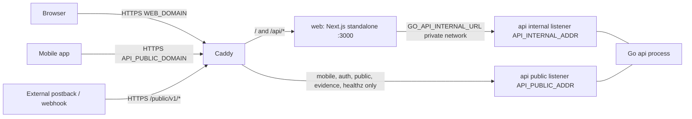

# Appendix E — Next.js data-fetching audit and migration map

> Part of the mv-go migration spec. Main spec: [developer-spec.md](../../../developer-spec.md) (§10 Web tier, §8 Realtime, §12 Delivery plan). Siblings: [Appendix A — data model](./A-data-model.md), [Appendix B — API catalog](./B-api-catalog.md), [Appendix C — auth and RBAC](./C-auth-rbac.md), [Appendix D — seed and mock data](./D-seed-and-mock-data.md). Decision record: [ADR 0029](../../adr/0029-migrate-firebase-stack-to-go-postgres.md).

This appendix is the full read-only audit of how `logitrack-web` loads data today, and the page-by-page map of what replaces it: TanStack Query v5 hooks in the browser, a thin Next.js BFF, and Go endpoints reached only over the private network (plan decisions W1–W10, R35; main spec §10). It is the deliverable of task TW1 and the input to TW2–TW9 (main spec §18). Every TW task is a branch cut from `mv-go` and merged by PR into `mv-go`; nothing touches `main`, which is live production, until the whole issue plan is done and the owner decides the final merge (R90).

**Evidence rules.** Every path is relative to `logitrack-web/` unless it starts with another top-level folder. Line numbers come from the original audit and from the web fact base; lines marked "(verified here)" were added or re-checked against the working tree on 2026-10-09 (branch `mv-go`, HEAD `4f552099`, `package.json` version 3.6.0). Nothing in this appendix changes code.

**Abbreviations** (same as the audit):

| Code | Meaning |
|---|---|
| L | realtime listener (`onSnapshot`) |
| G / GS | `getDocs` / `getDocsFromServer` |
| D | `getDoc` |
| C | `getCountFromServer` |
| F | Cloud Function call (`httpsCallable`) |
| ∞ | query without `limit()` |
| UC | `"use client"` at the top of the page file |

**Phase codes** follow the delivery plan (main spec §12): P0 foundations, P1 master data, P2 operations, P3 billing / finance / maintenance / utilities (including server-side documents, R69, and the Bangchak fuel snapshots, R70), P4 HR / payroll, P5 comms, P6 security center / platform / dashboard / mobile release / waitlist (including Cartrack sync, vehicle locations, dashboard summary and badges, R70), P7 mobile cut-over, P8 decommission. A page's phase is the phase in which its Go endpoints go live and its hooks switch their `queryFn` from Firestore to the BFF. One exception to the domain grouping: PostgreSQL is the users writer from P0, so the Security Center users page moves in P0 (R49); the rest of the Security Center stays P6. The runtime web flag that performs the switch is listed per page (E.2.0); flags are read at runtime from `GET /v1/config/web-flags` (Go env `WEB_FLAG_OVERRIDES`), cached as `['webFlags']`, so a domain rolls back without a rebuild (R35). No build-time API URL or domain-flag variable exists (R41).

**Endpoint notation.** "Target Go endpoint" is the path on the Go **internal** listener. The browser never calls Go: it calls the same path under the BFF prefix, so `GET /v1/hubs` is `fetch('/api/go/v1/hubs')` in the browser (W2, E.8). Appendix B is normative for every route, realtime topic and Redis key named here, including the R35 additions (`/v1/trips/monitor`, `/v1/dashboard/summary`, `/v1/billing/rows`, `/v1/billing/standby-diagnostics`, `/v1/badges`, server-filtered `/v1/expenses`, single-DTO `/v1/hubs`, `/v1/config/web-flags`, `/.well-known/jwks.json`). Appendix C §C.8 constrains the auth and tenancy routes (`/v1/auth/*`, `/v1/me`, `/v1/users`, `/v1/tenants`, `/v1/roles`, `/v1/api-keys`, `/v1/security-events`; the AU names win, R46). Staff mobile administration lives on `/v1/app-installations*` and `/v1/app-releases*` (internal only, R43); the only `/v1/mobile/*` route the web reads is `GET /v1/mobile/settings`, which the internal listener also serves (R42).

**Migration mechanics that apply to every row in E.2:**

1. **P0 (TW4):** the page's existing promise function is wrapped in a hook under `features/<domain>/api/use*.ts` with its canonical query key (E.6). The `queryFn` still reads Firestore. This alone removes duplicate loads, the "reload everything after a mutation" pattern and the language-toggle refetches.
2. **Domain phase (TW5, TW6, TW8):** when `['webFlags']` enables the domain, the hook's `queryFn` calls the BFF; the page's listeners are replaced per E.5; lists move to server paging per W9 (E.10).
3. **P6 (TW7):** after the last Firestore read and the Firebase bridge `web` mode are gone, the Firebase SDK is removed from the web bundle.

---

## E.1 Baseline facts

| Item | Evidence |
|---|---|
| next 16.1.1, react / react-dom 19.2.3, firebase ^12.7.0, firebase-admin ^13.6.0 (only used by `scripts/*.mjs`) | `package.json:59,60,68,71,73` |
| No `@tanstack/*` package of any kind | `package.json:31-102` |
| Heavy libraries: xlsx (SheetJS CDN tarball 0.20.3), xlsx-js-style, jspdf + jspdf-autotable, jszip, leaflet, react-leaflet ^4.2.1, @fullcalendar/* | `package.json:32-36,62-65,75,79-80` |
| Static export is used in production only; dev runs in server mode, so dev and prod behave differently | `next.config.ts:10` |
| `images.unoptimized: true`, so the `remotePatterns` list has no effect | `next.config.ts:12-33` |
| Build uses webpack plus a script that copies Next's page-data `.txt` files to flat names so Firebase Hosting can serve them | `package.json:9-10`, `scripts/flatten-next-flight-paths.mjs:1-8` |
| Firebase Hosting serves `out/`, with placeholder rewrites for `[id]` routes | `firebase.json:26,63-80`, `firebase.prod.json:59-76`, `app/app/customers/[id]/page.tsx:3-5` |
| Hosting cache headers: `/_next/static/**` immutable 1 year, `**/*.html` `max-age=0, must-revalidate`, `Cross-Origin-Embedder-Policy: unsafe-none` on everything | `firebase.json:34-61` (verified here) |
| No `middleware.ts` and no `proxy.ts` | `ls` (verified here: neither file exists) |
| No `app/providers.tsx`; providers are mounted directly in the root layout | `app/layout.tsx:4-5` (verified here) |
| `app/app/layout.tsx` is `"use client"` (line 1), so the whole `/app` subtree renders on the client and there is no server-side data fetching anywhere | `app/app/layout.tsx:1` |
| Firestore uses the default memory cache (no IndexedDB persistence); App Check is initialised in the browser | `firebase/client.ts` (`getFirestore(app)` L103/L125, `initializeAppCheck` L70-99) |
| Billing-critical reads deliberately bypass the cache | `features/accounting/api/billing.ts:822,828,1122,1264,1466,1476`, `lib/billingStatement.ts:236` |
| Sign-in is Firebase email/password in the browser; claims live in React context; `setAdminClaims` runs on every auth state change; force logout is a Firestore listener on `users/{uid}` | `context/auth.tsx:43,47-48,52-53,91-129,150` |
| Route guard is client-only and runs after children render | `app/app/layout.tsx:115-132,134-142` (verified here) |
| All PDF / XLSX / ZIP generation runs in the browser; nothing is stored server-side | `lib/billingDocument.ts:12-16,939-987`, `lib/shopeeExpressReport.ts:14-15,324-342`, `lib/download-image-urls-zip.ts:1,81-115` |
| No web push and no service worker | web fact base, grep for `getMessaging` / `serviceWorker` |
| `page.tsx` files under `app/app`: **63** (all listed in E.2.0) | `find app/app -name page.tsx` (verified here) |
| `onSnapshot` call sites: **31** (all listed in E.5) | grep (verified here) |
| Approximate counts in app code: `getDocs` 112, `getDoc` 26, `getCountFromServer` 19, `getDocsFromServer` 7, `httpsCallable` 30, `useEffect` 208, `useMemo` 156, `useCallback` 37, `React.memo` 0, `Promise.all` 34, `dynamic()` 17, `"use client"` files 219 | audit grep sweep |
| About 17 places load a whole master-data collection without `limit()` | audit §2.1 (itemised in E.4) |
| No polling (`setInterval` / `visibilitychange`) anywhere | audit grep sweep |

**Most wasteful pages, ranked by wasted reads** (audit §3.3; fix in brackets):

1. **Driver monitor** — every realtime change re-reads every rate card, fuel adjustment and missing task (`features/drivers/hooks/useDriverMonitor.ts:799`). [W8 `GET /v1/trips/monitor`, W7 SSE, P2]
2. **Dashboard** — about 10.7k documents per visit, used only to compute counts. [W8 `GET /v1/dashboard/summary`, P6]
3. **Expense audit, fuel and other** — full `vehicle_expenses` scans ×2 plus drivers ×2 and trucks ×2, repeated on every filter change. [W8 `GET /v1/expenses`, P3]
4. **Billing-document and Shopee report** — a 6-hop waterfall, a duplicated standby query, drivers ×2, all-customer reads. [W8 `GET /v1/billing/rows`, P3]
5. **Rate-card** — 6 full collections, all 7 queries reloaded after each of 12 mutation sites. [W6 per-tab keys, P3]
6. **First-mile, line-haul and job-assign** — hubs ×2 and a 4-step master-data waterfall on mount or per dialog open. [W5/W6 cached master hooks, P0 then P2]
7. **Income** — 5-stage waterfall over a 500-row window, browser-side date filtering. [W9 keyset infinite query, P3]
8. **Trucks** (trucks ×2), **sources** (customers ×3), **standby / incidents** (realtime driver listeners), **chat** (unbounded history). [P1, P2, P5]

---

## E.2 Per-page lifecycle

### E.2.0 Index of all 63 pages

| # | Page file (`app/app/…`) | Route | Table | Phase | Web flag |
|---|---|---|---|---|---|
| 1 | `accounting/audit/page.tsx` | `/app/accounting/audit` | E.2.3 | P3 | `billing` |
| 2 | `accounting/billing-document/page.tsx` | `/app/accounting/billing-document` | E.2.3 | P3 | `billing` |
| 3 | `accounting/billing-result/page.tsx` | `/app/accounting/billing-result` | E.2.3 | P3 | `billing` |
| 4 | `accounting/fuel-price-history/page.tsx` | `/app/accounting/fuel-price-history` | E.2.3 | P3 | `billing` |
| 5 | `accounting/fuel/page.tsx` | `/app/accounting/fuel` | E.2.3 | P3 | `billing` |
| 6 | `accounting/income/page.tsx` | `/app/accounting/income` | E.2.3 | P3 | `billing` |
| 7 | `accounting/other/page.tsx` | `/app/accounting/other` | E.2.3 | P3 | `billing` |
| 8 | `accounting/rate-card/page.tsx` | `/app/accounting/rate-card` | E.2.3 | P3 | `billing` |
| 9 | `accounting/shopee-express-report/page.tsx` | `/app/accounting/shopee-express-report` | E.2.3 | P3 | `billing` |
| 10 | `chat/page.tsx` (+ `chat/layout.tsx`) | `/app/chat` | E.2.1 | P5 | `comms` |
| 11 | `chat/room/page.tsx` | `/app/chat/room` | E.2.1 | P5 | `comms` |
| 12 | `chat/with-driver/page.tsx` | `/app/chat/with-driver` | E.2.1 | P5 | `comms` |
| 13 | `companies/page.tsx` | `/app/companies` | E.2.4 | P1 | `masterdata` |
| 14 | `customers/[id]/edit/page.tsx` | `/app/customers/[id]/edit` | E.2.4 | P1 | `masterdata` |
| 15 | `customers/[id]/page.tsx` | `/app/customers/[id]` | E.2.4 | P1 | `masterdata` |
| 16 | `customers/new/page.tsx` | `/app/customers/new` | E.2.4 | P1 | `masterdata` |
| 17 | `customers/page.tsx` | `/app/customers` | E.2.4 | P1 | `masterdata` |
| 18 | `dashboard/page.tsx` | `/app/dashboard` | E.2.1 | P6 | `dashboard` |
| 19 | `driver-monitor/page.tsx` | `/app/driver-monitor` | E.2.1 | P2 | `operations` |
| 20 | `drivers/edit/page.tsx` | `/app/drivers/edit` | E.2.2 | P1 | `masterdata` |
| 21 | `drivers/new/page.tsx` | `/app/drivers/new` | E.2.2 | P1 | `masterdata` |
| 22 | `drivers/page.tsx` | `/app/drivers` | E.2.2 | P1 | `masterdata` |
| 23 | `drivers/view/page.tsx` | `/app/drivers/view` | E.2.2 | P1 | `masterdata` |
| 24 | `first-mile/page.tsx` | `/app/first-mile` | E.2.1 | P2 | `operations` |
| 25 | `holidays/page.tsx` | `/app/holidays` | E.2.2 | P4 | `hr` |
| 26 | `incident-reports/page.tsx` | `/app/incident-reports` | E.2.1 | P2 | `operations` |
| 27 | `job-assign/page.tsx` | `/app/job-assign` | E.2.1 | P2 | `operations` |
| 28 | `leave-requests/page.tsx` | `/app/leave-requests` | E.2.2 | P4 | `hr` |
| 29 | `line-haul/page.tsx` | `/app/line-haul` | E.2.1 | P2 | `operations` |
| 30 | `maintenance/page.tsx` | `/app/maintenance` | E.2.2 | P3 | `billing` |
| 31 | `operations/roles/page.tsx` | `/app/operations/roles` | E.2.4 | — (no data) | — |
| 32 | `page.tsx` | `/app` | E.2.4 | — (no data) | — |
| 33 | `payroll/config/page.tsx` | `/app/payroll/config` | E.2.2 | P4 | `hr` |
| 34 | `payroll/page.tsx` | `/app/payroll` | E.2.2 | P4 | `hr` |
| 35 | `payroll/penalties/page.tsx` | `/app/payroll/penalties` | E.2.2 | P4 | `hr` |
| 36 | `renewals/page.tsx` | `/app/renewals` | E.2.2 | P1 | `masterdata` |
| 37 | `security-center/api-keys/page.tsx` | `/app/security-center/api-keys` | E.2.4 | P6 UI (no data today; the routes ship P2, R49) | `security` |
| 38 | `security-center/audit/page.tsx` | `/app/security-center/audit` | E.2.4 | P6 | `security` |
| 39 | `security-center/mobile-clients/page.tsx` | `/app/security-center/mobile-clients` | E.2.4 | P6 | `mobile_release` |
| 40 | `security-center/mobile-release/page.tsx` | `/app/security-center/mobile-release` | E.2.4 | P6 | `mobile_release` |
| 41 | `security-center/page.tsx` | `/app/security-center` | E.2.4 | P6 | `security` |
| 42 | `security-center/roles/page.tsx` | `/app/security-center/roles` | E.2.4 | P6 | `security` |
| 43 | `security-center/status/page.tsx` | `/app/security-center/status` | E.2.4 | — (no data) | — |
| 44 | `security-center/users/page.tsx` | `/app/security-center/users` | E.2.4 | P0 (R49, R81) | `auth` |
| 45 | `settings/company-profile/page.tsx` | `/app/settings/company-profile` | E.2.4 | P1 | `masterdata` |
| 46 | `sources/page.tsx` | `/app/sources` | E.2.2 | P1 | `masterdata` |
| 47 | `standby-records/page.tsx` | `/app/standby-records` | E.2.1 | P2 | `operations` |
| 48 | `subcontractors/[id]/edit/page.tsx` | `/app/subcontractors/[id]/edit` | E.2.4 | P1 | `masterdata` |
| 49 | `subcontractors/[id]/page.tsx` | `/app/subcontractors/[id]` | E.2.4 | P1 | `masterdata` |
| 50 | `subcontractors/new/page.tsx` | `/app/subcontractors/new` | E.2.4 | P1 | `masterdata` |
| 51 | `subcontractors/page.tsx` | `/app/subcontractors` | E.2.4 | P1 | `masterdata` |
| 52 | `truck-assignment/page.tsx` | `/app/truck-assignment` | E.2.2 | P1 | `masterdata` |
| 53 | `trucks/edit/page.tsx` | `/app/trucks/edit` | E.2.2 | P1 | `masterdata` |
| 54 | `trucks/maintenance/page.tsx` | `/app/trucks/maintenance` | E.2.2 | P3 | `billing` |
| 55 | `trucks/new/page.tsx` | `/app/trucks/new` | E.2.2 | P1 | `masterdata` |
| 56 | `trucks/page.tsx` | `/app/trucks` | E.2.2 | P1 | `masterdata` |
| 57 | `trucks/renew/page.tsx` | `/app/trucks/renew` | E.2.2 | P1 | `masterdata` |
| 58 | `trucks/view/page.tsx` | `/app/trucks/view` | E.2.2 | P1 | `masterdata` |
| 59 | `unauthorized/page.tsx` | `/app/unauthorized` | E.2.4 | — (no data) | — |
| 60 | `users/page.tsx` | `/app/users` | E.2.4 | — (no data) | — |
| 61 | `utilities/backfill/page.tsx` | `/app/utilities/backfill` | E.2.4 | P3 | `billing` |
| 62 | `utilities/billing-impact/page.tsx` | `/app/utilities/billing-impact` | E.2.4 | P3 | `billing` |
| 63 | `waitlist/page.tsx` | `/app/waitlist` | E.2.4 | P6 | `security` |

`/app/maintenance` and `/app/trucks/maintenance` sit in P3 because the delivery plan moves maintenance with vehicle expenses (the PM check runs inside expense approval, Appendix B §B.2.15). `/app/security-center/users` sits in P0 because user writes go to PostgreSQL from P0 (R49); the role matrix, security events, API-keys UI and status pages stay P6. The shell that wraps every `/app` route is covered at the end of E.2.4.

### E.2.1 Operations, dashboard and chat (audit table 1a)

| Route | What loads on mount | Sequential or parallel | Same collection loaded twice | Unbounded or oversized reads | Client-side filter / sort / paging | Refetch triggers and listeners | Heavy static imports / UC | Target hooks (TanStack) | Target Go endpoint(s) + phase |
|---|---|---|---|---|---|---|---|---|---|
| `/app/dashboard` | **DashboardStats** `features/dashboard/components/DashboardStats.tsx:111-149`: 9 counts (users by 5 roles, drivers Active / On-Duty / all, delivered trips), G trip_records delivered **limit 5000**, G trip_records limit 500, G incidentReport limit 2000.<br>**ActivityChart** `ActivityChart.tsx:45-50`: G trip_records limit 1000.<br>**Map** `DashboardVehicleMapClient.tsx:79-82`: G vehicle_locations 100 + G incidentReport **2000**.<br>**CurrentVehiclePosition** `:33-34`: G vehicle_locations 50.<br>**RecentUpdates** `:51-77`: 50 trips, 10 drivers, 10 incidents, 20 maintenance.<br>**ComplianceSummary** `:32-34`: G trucks own+active ∞.<br>**ExpenseAuditWidget** `:17-21`: L vehicle_expenses PENDING ∞.<br>**ChatStatusWidget** `:19-23`: L chats unassigned ∞. | 8 widgets fire in parallel; each uses `Promise.all` internally | incidentReport 2000 read twice (Stats and Map); vehicle_locations twice; trip_records in 4 overlapping queries | Worst case about 10.7k documents per visit, plus unbounded trucks / expenses / chats. The 5000 delivered trips are read only to collect their IDs (`:175-178`). | On-time %, package counts and the daily histogram computed in the browser (`DashboardStats.tsx:164-200`, `ActivityChart.tsx:55-81`) | Mount only; ActivityChart again on period change (`:91`). 2 listeners stay open (counts only). | Leaflet behind `dynamic()` (`DashboardVehicleMap.tsx:5`), but the barrel re-exports the map client module (`features/dashboard/index.ts:7`). UC: yes. | `useDashboardSummary({period})` `['dashboard','summary',{period}]` (poll 60 s while visible; `period` maps to `from` / `to`); `useVehicleLocations()` `['vehicleLocations']`; `useIncidents({from,to})` first page only, for map markers; `useBadges()` `['badges']`. Page imports widget files directly, not the barrel. | `GET /v1/dashboard/summary?from&to` (W8: role counts, driver status counts, delivered count, on-time %, package counts, daily histogram, recent updates, compliance counts as SQL aggregates); `GET /v1/vehicle-locations`; `GET /v1/incidents?from&to&cursor` (first keyset page, map labelled "latest N"); `GET /v1/badges`. SSE `tenant:{tid}:chats`, `tenant:{tid}:expenses` invalidate; `tenant:{tid}:vehicle_locations` updates the map through `setQueryData`. **P6** (Cartrack sync, `vehicle_locations`, the summary and badges all ship in P6, R70) |
| `/app/driver-monitor` | Hook `features/drivers/hooks/useDriverMonitor.ts`:<br>L trip_records createdAt range, **no limit**, default 30 days, **max 180 days** (`:76-79,443-467`)<br>L drivers 300 (`:469-480`)<br>L incidentReport 500 (`:482-503`)<br>G hubs ∞ (`:505-526`)<br>L tasks 500 (`:643-661`)<br>Then a billing join (`:663-799`): G tasks `in` chunks of 30 for trips older than the 500 tasks, plus customer_rate_entries and fuel adjustments (∞) per customer (`:745-748`, `lib/billingRates.ts:88-160`).<br>Plus up to 3 parallel F calls to `computeTripBillingSnapshot` (`:810-840`). | Listeners in parallel; the billing join waits on trips and tasks, and inside it task chunks are fetched one after another (`:685-696`) | Edit dialog re-reads drivers (∞) and customers (`EditTripDetailsDialog.tsx:227,240`); incidents read by listener and again in the dialog | Trips listener has no limit; the large-data hint only shows at 2000 trips (`DriverMonitorDashboard.tsx:353`). Export pages in batches of 500 (`:84,327-350`). | 9 filters in the browser (`:857-876`), page size 15 (`:984-988`) | **Billing effect depends on `[trips, tasks, ...]` (`:799`), so every change to any trip or task re-reads every rate card and fuel adjustment and re-fetches the missing tasks.** 4 listeners. Pricing calls are not cancelled on unmount. | xlsx static (`DriverMonitorDashboard.tsx:6`); jszip static through `lib/download-image-urls-zip.ts:1` (imported at `:81`). UC: yes. Data loading is gated by the permission guard because the guard wraps a child component. | `useMonitorTrips(filters)` infinite `['trips','monitor',{from,to,filters}]` (200 per page, filters sent to the server); edit dialog: `useDrivers({status,fields:'minimal'})`, `useCustomers()`, `useIncidents({tripId})` all `enabled: open`; mutations `usePatchTrip`, `useSetTripJobCategory`, `useComputeTripBilling`, `useRenameTrip`, `useBulkCancelTrips`, `usePatchTask` (helper). Export pages through `GET /v1/trips` with lazy xlsx. Photo ZIP: `useTripPhotos(id)` `['trips','photos',id]` `enabled` on click, zipped by the lazy jszip chunk (no server ZIP endpoint, R69). No browser billing join, no `computeTripBilling` (`:756`). | `GET /v1/trips/monitor?from&to&…&cursor` (W8: server join tasks + drivers + incidents + hub display + stored price preview; keyset 200; customer scope enforced by Go + RLS); export `GET /v1/trips?from&to&axis=created&cursor`; `GET /v1/trips/{id}/photos` (presigned URLs in ADR 0018 rank order); `PATCH /v1/trips/{id}`, `POST /v1/trips/{id}/rename`, `POST /v1/trips/bulk-cancel`, `PATCH /v1/tasks/{id}` (helper; `payroll_locked` checked server-side) — **P2**. `POST /v1/trips/{id}/job-category`, `POST /v1/trips/{id}/billing/compute` — **P3**. `POST /v1/trips/{id}/notify-line` — **P5**. SSE `tenant:{tid}:trips`, `tenant:{tid}:tasks` (dispatchers: `dispatch:trips`, `dispatch:tasks`). |
| `/app/first-mile` | G hubs ∞ (`app/app/first-mile/page.tsx:96-123`).<br>L tasks by day (or limit 100 when no date) (`:170-209`).<br>**The task dialog is always mounted** (`:490`), so `useFirstMileTask` loads on page mount, one after another: hubs → trucks → drivers → customers, all ∞ (`features/tasks/hooks/useFirstMileTask.ts:66-106`). | **4-step waterfall** (`:69,92,95,97`) alongside the page loads | **hubs loaded twice on mount** (page and dialog hook); the import dialog loads hubs / trucks / customers again when opened (`import-dialog.tsx:91-100`) | Four full master-data collections | Customer scope and SOC/hub filters in the browser (`:260-279`); hub dropdown shows only the first 50 (`:363`) | Tasks listener re-subscribes on date change. Task-ID generation runs a count query 500 ms after date or destination changes (`useFirstMileTask.ts:200-224`). | xlsx and xlsx-js-style static in the import dialog (`import-dialog.tsx:4-5`). UC: yes. **Fetching starts before the permission guard resolves** (guard at `:282`). | `useTasksByDay({date,type:'FIRST_MILE'})` `['tasks',{date,type}]` with `placeholderData: keepPreviousData`; `useHubs()` `['hubs']` + `select` to dropdown options (searchable, no slice); dialog hooks `useTruckSearch(q)`, `useDrivers({fields:'minimal'})`, `useCustomers()` with `enabled: dialogOpen`; `useTaskTrip(taskId)`; mutations `useCreateTask`, `useUpdateTask`, `useCancelTask`, `useImportTasks`; import dialog `next/dynamic`. All queries `enabled` only when `['me']` grants the route capability. | `GET /v1/tasks?taskType=FIRST_MILE&date=` (customer scope server-side); `GET /v1/hubs`; `GET /v1/trucks?q&status`; `GET /v1/drivers?fields=minimal`; `GET /v1/customers?fields=minimal`; `GET /v1/tasks/{id}/trip`; `POST /v1/tasks` (task number from `task_number_counters`, run order in the same transaction, which removes the count query), `PATCH /v1/tasks/{id}`, `POST /v1/tasks/{id}/cancel` (FCM from the outbox replaces `notifyTaskUpdate`), `POST /v1/tasks/import`. SSE `tenant:{tid}:tasks`. **P2** (hub writes from `hub-dialog.tsx` are P1) |
| `/app/line-haul` | Same pattern: hubs (`line-haul/page.tsx:98`), L tasks LINE_HAUL by day / limit 100 (`:170-209`), dialog always mounted (`:492`) → `useLineHaulTask.ts:71,99,102,104` waterfall | Waterfall | hubs ×2 on mount | Same as first-mile | Same as first-mile; hub dropdown sliced to 50 (`line-haul/page.tsx:365`, verified here) | Same as first-mile | Same as first-mile (`line-haul/import-dialog.tsx:4-5`) | Same hooks with `type:'LINE_HAUL'`. | Same endpoints with `taskType=LINE_HAUL`. SSE `tenant:{tid}:tasks`. **P2** |
| `/app/job-assign` | G hubs ∞ (`job-assign/page.tsx:117-141`).<br>L tasks by day, optional type, else limit 150 (`:177-207`).<br>The dialog sits inside `DialogContent` (`:511-519`), so the 4-step waterfall runs **every time the dialog opens** and every time the FM/LH type is switched. | Page loads in parallel; dialog is a waterfall | hubs on mount plus once per dialog open; import dialog when opened (`import-dialog.tsx:101-109`) | — | Browser-side filter (`:319-329`); hubs sliced to 50 (`:436`) | Listener re-subscribes on date or type change | xlsx static in the import dialog (`:4-5`). UC: yes. Fetching starts before the guard (`:332`). | `useTasksByDay({date,type?})`; `useHubs()`; dialog master hooks as first-mile with `enabled: isOpen` — reopening the dialog or switching FM↔LH reuses the cache instead of re-running the waterfall; mutations as first-mile. | Same as first-mile, `taskType` optional. SSE `tenant:{tid}:tasks`. **P2** |
| `/app/standby-records` | L standby_records limit 300 (`standby-records/page.tsx:166-171`)<br>L drivers 300 (`:205-216`)<br>D task for the detail dialog (`:106-113`)<br>Backfill dialog when open: L drivers 500, G tasks 50 (`standby-backfill-dialog.tsx:116-135,157+`) | Parallel | drivers loaded twice (page 300 + dialog 500) | A realtime driver listener used only for display names | **Date range filtered in the browser over the latest 300 records** (`:233-256`), so older matching records silently disappear | 2 listeners | `usePermission` ×2 (`:104`, guard `:272`). UC: yes. | `useStandby({from,to,customerId})` infinite `['standby',{from,to,customerId}]`; `useTask(id)` `['tasks','detail',id]` `enabled: dialogOpen`; backfill dialog `useDrivers({fields:'minimal'})`, `useTasks({driverId})`, `useTrips({driverId})` `enabled: open`; mutations `useBackfillStandby`, `useNotifyStandbyLine`; `['me']` selector replaces both `usePermission` reads. | `GET /v1/standby?from&to&customerId&driverId&cursor` (rows carry the driver display name — no driver listener); `GET /v1/tasks/{id}`; `GET /v1/drivers?fields=minimal`; `GET /v1/tasks?driverId&status[]`; `GET /v1/trips?driverId`; `POST /v1/standby/backfill` (one transaction: record + task Completed + trip standby; photos via `POST /v1/uploads/presign`). SSE `tenant:{tid}:trips` (`standby.*`). **P2**; `POST /v1/standby/{id}/notify-line` **P5** |
| `/app/incident-reports` | L incidentReport 200 (`:100-106`)<br>L drivers 300 (`:153-164`)<br>Customer role: G trip_records by customer limit 500 (`:126-146`) | Parallel | — | Customer-scope lookup capped at 500 trips | Date filtered in the browser (`:182-216`). **If the customer has 0 trips, the filter is skipped and all incidents are shown** (`:185`). | 2 listeners; the customer-trips effect cleanup does nothing (`:145`) | Map behind `dynamic()`, but the barrel re-exports the client module (`features/incident-reports/index.ts:2`). UC: yes. | `useIncidents({from,to})` infinite `['incidents',{from,to}]`; map imported from its component file, not the barrel. | `GET /v1/incidents?from&to&cursor` (`scope:customer` through the trip join, enforced by Go + RLS; removes the 500-trip lookup and the show-everything path at `:185`; rows carry driver display name). SSE `tenant:{tid}:trips` (`incident.created`). **P2** |
| `/app/chat` (page `chat/page.tsx` + layout `chat/layout.tsx`) | Layout: D chat (`chat/layout.tsx:69`).<br>ConversationsPanel (mounted by the layout at `:132,187`, so it persists across `/app/chat/*`, verified here): G drivers 200 (`ConversationsPanel.tsx:60,76-78`), **L chats unassigned ∞** and **L chats assigned to me ∞** (`:127-189`).<br>`?view=broadcast` (page renders `BroadcastComposer`, `chat/page.tsx:13`): G drivers ∞ + G broadcasts 50 (`BroadcastComposer.tsx:58,140-144`). | Parallel | drivers loaded twice when broadcasting | Closed chats downloaded and then filtered out in the browser (`:137,169`) | Driver search in the browser over 200 (`:108-122`) | 2 listeners for the whole session; `setLoading(false)` called before data arrives (`:191`) | UC: yes | `useChats('queue')` `['chats','queued']`, `useChats('mine')` `['chats','mine']`; `useChat(id)` `['chat',id]`; driver search `useDrivers({q,fields:'minimal'})` (debounced, server search); broadcast view `useBroadcasts()` infinite `['broadcasts']`, `useSendBroadcast`, `useDeleteBroadcast`; loading state from `isPending`. | `GET /v1/chats?filter=queue\|mine` (closed chats excluded server-side; `unreadForMe` per row); `GET /v1/chats/{id}`; `GET /v1/drivers?q&fields=minimal`; `GET /v1/broadcasts?cursor`, `POST /v1/broadcasts`, `DELETE /v1/broadcasts/{id}` (soft, `broadcasts.voided_at`). SSE `tenant:{tid}:chats`. **P5** |
| `/app/chat/room` | L chat doc (`room/page.tsx:74`)<br>**L messages, full history, oldest first ∞** (`:89-116`)<br>D chat again plus a write (`:130,140`) | Parallel | The chat doc is read 3 times (layout D, room L, room D) | All messages ever sent in the chat | — | **Writes `lastReadByAdmin` inside the snapshot callback whenever the last message is from the driver** (`:108-113`), which wakes every chat listener again | UC: yes | `useChat(id)` (shared with the layout, one fetch); `useChatMessages(id)` infinite `['chat',id,'messages']` keyset newest-first, 50 per page; `useSendMessage` (optimistic, `clientMessageId`); `useMarkChatRead` called from an effect on a new last message, debounced, never inside a data callback; `useAssignChat`, `useCloseChat`, `useReopenChat`. | `GET /v1/chats/{id}`; `GET /v1/chats/{id}/messages?before&limit=50`; `POST /v1/chats/{id}/messages` (one transaction: insert + chat `last_message*` + auto-assign; FCM from the outbox replaces `notifyChatMessageCreated`); `POST /v1/chats/{id}/read`; `POST /v1/chats/{id}/assign\|close\|reopen`; images via `POST /v1/uploads/presign`. SSE explicit topic `chat:{id}` (`message.created` → `setQueryData`, `read.updated`). **P5** |
| `/app/chat/with-driver` | G chats by driverId, then G driver by authId, then add | Sequential | — | — | — | — | UC: yes | `useOpenChatWithDriver()` mutation, then `router.replace` to the room. | `POST /v1/chats {driverId}` (returns the driver's open chat or creates one; one open chat per driver is enforced by the partial unique index `chats_one_open_per_driver`, which migration `0010` adds after the ETL, R59) replaces the 3 sequential steps. **P5** |

### E.2.2 Fleet, master data and HR (audit table 1b)

The audit grouped `/app/trucks/{view,edit,new,renew,maintenance}` and `/app/drivers/{view,edit,new}` into one row each; they are split here because their targets differ.

| Route | What loads on mount | Seq / Par | Same collection twice | Unbounded / oversized | Client-side work | Refetch / listeners | Heavy imports / UC | Target hooks (TanStack) | Target Go endpoint(s) + phase |
|---|---|---|---|---|---|---|---|---|---|
| `/app/trucks` | L trucks limit 100 (`features/trucks/hooks/useTrucksList.ts:27-29`); G trucks ∞ (`TruckComplianceCards.tsx:56-63`) | Parallel | **trucks ×2** | Compliance cards read the whole collection, but **the list is cut off at 100** | Filter and paging (10 per page) in the browser (`useTrucksList.ts:96-113`) | 1 listener; `refreshKey` is only passed to the cards | xlsx static (`TruckImportDialog.tsx:24`). UC: yes. | `useTrucks({filters,cursor})` `['trucks',{filters,cursor}]` (server filter, keyset page, `keepPreviousData`; refetch 60 s while visible per W7); compliance cards `useRenewals({due})` `['renewals',{due}]`; `useImportTrucks` in a `next/dynamic` dialog. | `GET /v1/trucks?ownership&tenantId&status&type&q&cursor` (a subcontractor is a carrier tenant, so its filter is `tenantId`); `GET /v1/trucks/renewals?due=` (server counts for the cards); `POST /v1/trucks/import`. SSE `tenant:{tid}:fleet` (`truck.*`). **P1** |
| `/app/trucks/view` | D truck, then assignment history (sequential) + subcontractors ∞ (`useTruckPreview.ts:24-61`) | Sequential pair | subcontractors (one of 5 call sites) | Full subcontractor list loaded to show one name | — | Effect depends on `t`, refetches on language toggle (`useTruckPreview.ts:57`) | `dynamic()` wrapper. UC: yes. | `useTruck(id)` `['trucks','detail',id]`; `useTruckAssignments({truckId})` infinite (parallel with the truck query); tenant name comes inside the truck DTO. | `GET /v1/trucks/{id}`; `GET /v1/truck-assignments?truckId&cursor`. **P1** |
| `/app/trucks/edit` | subcontractors ∞ + D truck (`EditTruckForm.tsx:41-120`) | Sequential pair | subcontractors | Full subcontractor list | — | `t` in dependencies (`EditTruckForm.tsx:120`) | `dynamic()` wrapper. UC: yes. | `useTruck(id)`, `useSubcontractors()` (cached 10 min), `useUpdateTruck`; file uploads through `usePresignUpload`. | `GET /v1/trucks/{id}`, `PATCH /v1/trucks/{id}` (status change appends `status_history`); `GET /v1/subcontractors`; `POST /v1/uploads/presign`. **P1** |
| `/app/trucks/new` | subcontractors ∞ | — | subcontractors | Full subcontractor list | Licence-plate uniqueness is a client check-then-add (`trucks/new/action.client.ts:21-23,55-56`) | — | `dynamic()` wrapper. UC: yes. | `useSubcontractors()`, `useCreateTruck`. | `POST /v1/trucks` (`UNIQUE(tenant_id, license_plate)` → `already_exists`, closes the race). **P1** |
| `/app/trucks/renew` | D truck | — | — | — | — | — | `dynamic()` wrapper. UC: yes. | `useTruck(id)`, `useRenewTruck`. | `POST /v1/trucks/{id}/renewals` (one transaction: truck fields + `status_history` + `transactions` ledger row). **P1** |
| `/app/trucks/maintenance` | D truck, then history (`MaintenanceDashboard.tsx:77-95`) | Sequential pair | — | — | — | — | `dynamic()` wrapper. UC: yes. | `useTruck(id)`, `useMaintenance({truckId})` infinite (parallel); `useCreateMaintenance`, `useUpdateMaintenance`, `useRemindMaintenance`. | `GET /v1/maintenance?truckId&status&cursor`, `POST /v1/maintenance`, `PATCH /v1/maintenance/{id}` (truck status change in the same transaction), `POST /v1/maintenance/{id}/remind`. **P3** |
| `/app/drivers` | L drivers limit 100 (`DriversList.tsx:58-63`) | — | — | **Cut off at 100**; stats computed over those 100 only | Filter and paging in the browser (`:95-122`) | 1 listener | No page guard (`drivers/page.tsx:5-7`). UC: yes. | `useDrivers({status,q})` infinite `['drivers',{status,q}]` (refetch 60 s while visible per W7); stats cards from server counts. Route gating moves to `proxy.ts` (E.8.4). | `GET /v1/drivers?status&q&cursor` with per-status counts for the stat cards (see E.10 row 3). **P1** |
| `/app/drivers/view` | D driver + history + subcontractors ∞ (`DriverPreview.tsx:47-83`) | Mixed | — | Full subcontractor list | — | `t` in dependencies (`DriverPreview.tsx:79`) | `dynamic()` wrapper. UC: yes. | `useDriver(id)` `['drivers','detail',id]`; `useTruckAssignments({driverId})` infinite; tenant name inside the driver DTO; document images as `/api/go/v1/drivers/{id}/documents/{kind}` links. | `GET /v1/drivers/{id}` (PII fields only with `drivers:view_pii`); `GET /v1/drivers/{id}/documents/{kind}` (302 to a short-lived presigned GET; the `drivers/` prefix is private); `GET /v1/truck-assignments?driverId&cursor`. **P1** |
| `/app/drivers/edit` | D driver + subcontractors ∞ (`EditDriverForm.tsx:98-161`) | Mixed | — | Full subcontractor list | — | `t` in dependencies (`EditDriverForm.tsx:147`) | `dynamic()` wrapper. UC: yes. | `useDriver(id)`, `useSubcontractors()`, `useUpdateDriver`; uploads via presign. | `PATCH /v1/drivers/{id}`; credentials via `POST /v1/users/{id}/password/temporary` (Appendix C §C.8; shipped in P0 with the users write path, R49); `POST /v1/uploads/presign`. **P1** |
| `/app/drivers/new` | subcontractors when the employment type changes (`NewDriverForm.tsx:94`) | — | — | Full subcontractor list | — | — | UC: yes | `useSubcontractors()` with `enabled` when the employment type needs it; `useCreateDriver`. | `POST /v1/drivers` (no default password; a temporary one is generated and shown once, R29). **P1** |
| `/app/maintenance` | `getMaintenanceOverview`: G trucks ∞ + G maintenance ∞ (`features/maintenance/api/maintenance.ts:68-73`) | Parallel | Create form loads trucks again ∞ (`MaintenanceFormWrapper.tsx:49-55`) | Both collections in full | Sort and filter in the browser; **renders every row** (`MaintenanceOverview.tsx:515`) | Reloaded after every save (`:142,207`) | MaintenanceOverview is `dynamic()` (`page.tsx:8`), LocationPicker is `dynamic()`. UC: yes. | `useMaintenance({status})` infinite + TanStack Table/Virtual (W9); create form `useTruckSearch(q)`; saves invalidate `['maintenance']` and `['trucks']` instead of reloading. | `GET /v1/maintenance?truckId&status&cursor`, `POST /v1/maintenance`, `PATCH /v1/maintenance/{id}` (status enum normalised; transitions atomic). **P3** |
| `/app/renewals` | G trucks ordered by updatedAt ∞ (`renewals/actions.client.ts:35-40`) | — | — | Full collection | Renders every row (`renewals/page.tsx:190`) | Mount | UC: yes | `useRenewals({due})` `['renewals',{due}]`. | `GET /v1/trucks/renewals?due=` (server-filtered by due window). **P1** |
| `/app/truck-assignment` | Promise.all: active assignments, **all assignments** (code comment admits "fetch all", `actions.client.ts:237-245`), drivers ∞ (`:318`), trucks ∞ (`:358`) | Parallel | — | 3 full collections | Renders every history row (`page.tsx:466`) | Reloaded after each mutation | UC: yes | `useTruckAssignments({status:'active'})`; history `useTruckAssignments({})` infinite + TanStack Virtual; pickers `useDrivers({fields:'minimal'})`, `useTruckSearch(q)`; `useAssignTruck`, `useRevokeAssignment` invalidate `['truckAssignments']`, `['trucks']`, `['drivers']`. | `GET /v1/truck-assignments?status&truckId&driverId&cursor`; `POST /v1/truck-assignments` (one transaction replaces `actions.client.ts:70-135`); `POST /v1/truck-assignments/{id}/revoke`. SSE `tenant:{tid}:fleet` (`assignment.*`). **P1** |
| `/app/sources` | Promise.all hubs ∞ + customers ∞ (`sources/page.tsx:137-161`); D metadata (`:166-178`); **2 HubDialog instances each load customers on mount** (`first-mile/hub-dialog.tsx:78-88`, rendered at `sources/page.tsx:372,381`) | Parallel | **customers ×3** | — | Filter and paging (10) in the browser | Distance lookups when a map point is clicked (`components/map/SourcesMap.tsx:208`, `HubDistancePanel.tsx:30`) | xlsx static (`:6`, `pickup-import-dialog.tsx:4`); map is `dynamic()` (`:45`). UC: yes. | `useHubs()` (full DTO cached; client filter over a few hundred rows is acceptable); `useCustomers()` shared by the page and both dialogs (one request); `useDistancesMeta()`; `useHubDistances(hubId)` `enabled` on click; `useCreateHub`, `useUpdateHub`, `useImportHubs`; `useComputeDistances` + `useJob(id)`. | `GET /v1/hubs`; `GET /v1/customers?fields=minimal`; `GET /v1/distances/meta`; `GET /v1/distances?hubId=`; `POST /v1/hubs`, `PATCH /v1/hubs/{id}`, `POST /v1/hubs/import`; `POST /v1/jobs/distances.compute`, `GET /v1/jobs/{id}`. SSE `global` `hubs.changed` and `customers.changed` invalidate `['hubs']` and `['customers']` in every open tab (R51). **P1** |
| `/app/holidays` | L holidays ∞ (`holidays/page.tsx:120-144`) | — | — | Small collection | Browser-side | **Re-subscribes on language toggle because `t` is a dependency** (`:144`) | FullCalendar ×5 static (`:67-71`). UC: yes. | `useHolidays(year)` `['holidays',y]` (plain fetch, no listener; `t` out of deps); `useSaveHoliday`, `useDeleteHoliday`, `useGenerateHolidays`; calendar through `next/dynamic` with `ssr: false`. | `GET /v1/holidays?year`; `POST /v1/holidays`, `PATCH/DELETE /v1/holidays/{id}`; `PUT /v1/holidays/generate`. `holidays.changed` invalidates `['holidays',y]` when the stream is open: on `global` for platform rows (`tenant_id` NULL, written only by stewards, R60) and on `tenant:{tid}:config` for tenant rows (Appendix B §B.4.2, R51). **P4** |
| `/app/payroll` | L payroll limit 100 (`payroll/page.tsx:89-116`) | — | — | — | Renders all (`:306`) | 1 listener | UC: yes | `usePayroll({period,round,status})` infinite (refetch 60 s while visible per W7); `useRunPayroll` + `useJob(id)`; `useApprovePayroll`, `useSetPayrollStatus`. | `GET /v1/payroll?period&round&status&cursor`; `POST /v1/jobs/payroll.run`; `POST /v1/payroll/{id}/approve`; `POST /v1/payroll/{id}/status`. **P4** |
| `/app/payroll/penalties` | G drivers ∞, then config, then penalties 200 (`penalties/page.tsx:46-66`) | **3-step waterfall** (the steps don't depend on each other) | — | drivers ∞ | — | — | UC: yes | Three independent queries in parallel: `useDrivers({fields:'minimal'})`, `useCompConfig('active')`, `usePenalties({driverId,status})`; `useCreatePenalty`, `useCancelPenalty`. | `GET /v1/drivers?fields=minimal`; `GET /v1/payroll/config?at=`; `GET/POST /v1/penalties`; `POST /v1/penalties/{id}/cancel`. **P4** |
| `/app/payroll/config` | Promise.all active config + all configs (`config/page.tsx:42-59`) | Parallel | — | Configs ∞ (small) | — | — | UC: yes | `useCompConfig('active')` `['compConfig','active']`, `useCompConfig('all')`; `useCreateCompConfig`. | `GET /v1/payroll/config?at=`; `GET/POST /v1/payroll/config` (append-only versions). **P4** |
| `/app/leave-requests` | **L leave_requests ∞** (`leave-requests/page.tsx:61-66`) | — | — | Grows without bound | Renders all (`:243`) | 1 listener | UC: yes | `useLeaveRequests({status})` infinite (refetch 60 s while visible per W7); `useDecideLeave` (approve / reject / cancel). | `GET /v1/leave-requests?status&driverId&cursor`; `POST /v1/leave-requests/{id}/approve\|reject\|cancel`. **P4** |

### E.2.3 Accounting (audit table 1c)

| Route | What loads | Seq / Par | Same collection twice | Unbounded / oversized | Client-side work | Refetch triggers | Heavy imports / UC | Target hooks (TanStack) | Target Go endpoint(s) + phase |
|---|---|---|---|---|---|---|---|---|---|
| `/app/accounting/billing-document` | Mount: customers ∞ + owner company (`billing-document/page.tsx:232-254`).<br>On **Load** (`:256-285`, button `:804`), three calls in parallel:<br>**`fetchBillingTripRows`** (`features/accounting/api/billing.ts:737-...`): hubs ∞ (`:747`) → D customer → D subcontractor (`:801-805`) → GS delivered trips for the month (`:822`) → GS **standby for the month, all customers** (`:828-834`) → tasks chunks (`:850`) → **drivers ∞** (`:884`).<br>**`fetchStandbyBillingDiagnostics`** (`:1455-...`): GS standby for the period + recent 300 (`:1465-1483`) → tasks → standby_rate_entries ∞ + service fees ∞ (`:1549-1566`) → **drivers ∞** (`:1570`).<br>`fetchTripsMissingBillingDate` (`:1116-1128`). | **About 6 sequential round-trips** inside `fetchBillingTripRows` | **Same standby-for-the-period query run twice** (`:828` and `:1466`); **drivers ∞ twice** | All-customer standby even when one customer is selected; drivers / rate tables in full | Filters and preview in the browser; **preview renders every row** (`:998`) | Manual load; reloads after recompute (`:528`) and after standby fix (`:815`) | `lib/billingDocument.ts:12-16` statically imports jspdf, autotable and xlsx-js-style; jszip already dynamic (`:957`). UC: yes. Fetch starts before the guard (`:554`). | `useCustomers()`; `useOwnerCompany()` `['companies',{owner:true}]`; on Load: `useBillingRows(cust,y,m)` `['billing','rows',cust,y,m]`, `useStandbyDiagnostics(cust,y,m)` `['billing','standbyDiag',cust,y,m]`, `useMissingBillingDate(cust,y,m)` `['billing','missingDate',cust,y,m]`, all `enabled: loadRequested`, staleTime 5 min, no focus refetch; `useComputeTripBilling`, `useAssignStandbyCustomer` invalidate only those exact keys; `useCreateStatement`; preview through TanStack Table + Virtual. | `GET /v1/customers?fields=minimal`; `GET /v1/companies/owner`; `GET /v1/billing/rows?customerId&year&month&types[]&categories[]` (replaces the 6-hop assembly; Bangkok month bounds server-side; unpriced rows carry reason codes `no_customer`, `no_rate`, `no_vehicle_class`, `no_billing_date`, R62); `GET /v1/billing/standby-diagnostics?customerId&year&month` (one standby read server-side); `GET /v1/billing/rows/missing-billing-date?customerId&year&month`; `POST /v1/trips/{id}/billing/compute`; `PATCH /v1/standby/{id}/customer`; `POST /v1/billing/statements` (invoice number and statement in one transaction; `documents.render` produces the PDF, detail XLSX and bundle ZIP into `statement_documents` in P3, R69); `GET /v1/billing/statements/{id}` (presigned document URLs). SSE `tenant:{tid}:billing` (`statement.*`, `documents.rendered`). **P3** |
| `/app/accounting/income` | `loadData` (`income/page.tsx:286-585`), one step after another: customers ∞ (`:289`) → hubs ∞ (module-level cache `:180-181,297`) → **trip_records delivered, newest 500 by createdAt** (`:336-342`) → standby 300 (`:401-407`) → tasks chunks (`:451-454`) → rate / fuel per customer (`:488-491`) | **5-stage waterfall** | — | 500-trip window | **Date filtered in the browser over that 500 window** (`:597-621`), so older trips are silently missing; paging in the browser | Mount (`:587-589`) and a full reload after every fix (`:246,252,847,916`) | xlsx static (`:10`); EditBillingDialog comes through the accounting barrel, which also re-exports the xlsx dialogs (`:54`). UC: yes. Fetch starts before the guard (`:928`). | `useIncome({from,to,customerId})`: two infinite queries `['income',{from,to,cust,kind:'trips'}]` and `['income',{from,to,cust,kind:'standby'}]` (keyset, server date filter); missing-billing tab `useBillingRows('all',y,m)` filtered to unpriced rows; mutations `usePatchTaskPlanDate`, `usePatchTripDeliveredAt`, `useComputeTripBilling`, `useBackfillTrips` + `useJob(id)` invalidate `['income']` and `['billing']`; `EditBillingDialog` imported from its file; export uses lazy xlsx after `fetchNextPage` to the end of the range. | `GET /v1/trips?axis=delivered&status[]=delivered&from&to&customerId&cursor` (rows carry `billing*` for `accounting:view_income`, task plan date, hub display); `GET /v1/standby?from&to&customerId&cursor`; `GET /v1/billing/rows?customerId=all&year&month` (unpriced rows with server reasons for the missing tab); `PATCH /v1/tasks/{id}` (plan date; restamp through `billing.compute`, period lock); `PATCH /v1/trips/{id}` (`deliveredAt`; repriced server-side, `billing_period_locked`); `POST /v1/trips/{id}/billing/compute`; `PUT /v1/trips/{id}/billing/manual` (EditBillingDialog); `POST /v1/jobs/billing.backfill-trips`, `GET /v1/jobs/{id}`. **P3** |
| `/app/accounting/rate-card` | Promise.all of 7: customers ∞, **customer_rate_entries ∞ across all customers** (`billing.ts:211-217`), fuel adjustments ∞, monthly fuel snapshots 36, hubs ∞, service fees ∞, standby rates ∞ (`rate-card/page.tsx:384-418`) | Parallel | — | 6 full collections | Filter and paging in the browser (`:468-553`) | **All 7 reloaded after each of the 12 mutation call sites.** A daily fuel snapshot is read when the dialog date changes (`:432-466`). | xlsx static (`:6`) and via RateCardImportDialog (barrel import `:76`). UC: yes. | `useCustomers()`; per tab `useRateEntries(cust)` `['rateCard','entries',cust]` (server paged), `useFuelAdjustments(cust)` `['rateCard','fuelAdj',cust]`, `useServiceFees()` `['rateCard','serviceFees']`, `useStandbyRates()` `['rateCard','standby']`, each `enabled` only for the visible tab; `useFuelMonthly()` `['fuel','monthly']`; `useFuelDaily(dayKey)` `enabled` when the dialog date is set; `useHubs()`; each of the 12 mutations invalidates only the key it touched; backfill and Bangchak jobs through `useJob(id)`. | `GET /v1/billing/rate-entries?customerId&includeVoided&cursor`, `POST /v1/billing/rate-entries`, `POST /v1/billing/rate-entries/import`, `POST /v1/billing/rate-entries/{id}/void`; `GET/POST /v1/billing/fuel-adjustments`, `POST /v1/billing/fuel-adjustments/{id}/void`; `GET/POST /v1/billing/service-fees`, `PATCH/DELETE /v1/billing/service-fees/{id}`; `GET/POST /v1/billing/standby-rates`, `PATCH /v1/billing/standby-rates/{id}`, `POST /v1/billing/standby-rates/{id}/void` (soft void, `standby_rate_entries.voided_at`, R20; there is no DELETE); `GET /v1/fuel/monthly?limit=36`, `GET /v1/fuel/daily/{dayKey}`; `GET /v1/hubs`; `POST /v1/jobs/billing.backfill-trips`, `POST /v1/jobs/billing.backfill-standby`, `POST /v1/jobs/bangchak.snapshot`, `GET /v1/jobs/{id}`. SSE `tenant:{tid}:billing` `ratecard.changed` `{customerId, table}` invalidates only the matching `['rateCard',…]` key in other tabs (R51). `normalizeRateEntryVehicleClasses` (`billing.ts:608`) becomes a `cmd/etl` step, not an endpoint. **P3** |
| `/app/accounting/fuel` | Promise.all: `getVehicleExpensesByType("fuel")` (= **full vehicle_expenses scan of every type, filtered in the browser**, plus drivers ∞ and trucks ∞; `expenses.ts:90-101`), plus `getDriversForFilter` ∞ (`:165`), plus `getTrucksForFilter` ∞ (`:180`) (`fuel/page.tsx:244-255`); F `getBangchakRetailOilPrices` (`:326-348`) | Parallel | **drivers ×2, trucks ×2** | vehicle_expenses all-time, all types | Renders all rows (`:726`) | Bangchak function called on mount **and on every language toggle** | Map is `dynamic()` (`:26`). `usePermission` ×2 in one component (`:198,325`). UC: yes. | `useExpenses({type:'fuel',status,driverId,truckId,from,to})` infinite + TanStack Virtual; filter pickers `useDrivers({fields:'minimal'})`, `useTruckSearch(q)`; `useFuelRetail(locale)` `['fuel','bangchak',locale]` (60 min; a language toggle hits the cache after the first load); `['me']` selector replaces both permission reads; `useCreateExpense`, `usePatchExpense`. | `GET /v1/expenses?type=fuel&status&driverId&truckId&from&to&cursor` (server filter; rows carry driver name and plate); `GET /v1/fuel/retail?locale=`; `POST /v1/expenses`; `PATCH /v1/expenses/{id}`; `POST /v1/uploads/presign`. The daily and monthly Bangchak snapshots behind the fuel pages are written by the Go scheduler from P3 (R70). **P3** |
| `/app/accounting/other` | Same as fuel with "other" (`other/page.tsx:110-126`) | Parallel | drivers ×2, trucks ×2 | Same | Renders all (`:458`) | Reload after each mutation | `TollExpenseImportDialog` through the accounting barrel (`other/page.tsx:14`). UC: yes. | `useExpenses({type:'other',…})` infinite + Virtual; pickers as fuel; `useImportTolls` in a `next/dynamic` dialog; mutations invalidate `['expenses']`. | `GET /v1/expenses?type=other&…&cursor`; `POST /v1/expenses`; `PATCH /v1/expenses/{id}`; `POST /v1/expenses/toll-import`. **P3** |
| `/app/accounting/audit` | `getVehicleExpensesForAudit` → fuel **then** other (`expenses.ts:263-276`) | **Sequential pair** | **vehicle_expenses ×2, drivers ×2, trucks ×2** | Full scans | **The status filter is applied in the browser** (`expenses.ts:270-272`), yet the page **re-downloads everything on every status change** (`audit/page.tsx:106-108`). Renders all (`:492`). | Status change and every save (`:315`) | jszip static via `lib/download-image-urls-zip` (`:28`). UC: yes. | `useExpenses({status})` infinite + Virtual (type omitted = fuel and other in one server query; status in the key and in the server query, W6); `useSetExpenseStatus`, `useBulkExpenseStatus` invalidate `['expenses']` and `['badges']`; zip helper loaded on click. | `GET /v1/expenses?status&cursor`; `POST /v1/expenses/{id}/status`; `POST /v1/expenses/bulk-status` (fuel approval with odometer runs the PM check in the same transaction, replacing `checkMaintenanceAlert` at `audit/page.tsx:175,203,229`). SSE `tenant:{tid}:expenses`. **P3** |
| `/app/accounting/billing-result` | customers ∞ (`:127-129`); GS statements (`lib/billingStatement.ts:217-252`, server read at `:236`, verified here); D user per creator (`:154-178`) | Parallel | `fetchBillingTripRows` runs per download (`:279,296`) | — | Period filtered in the browser (`:187`) | Mount | `lib/billingDocument` static (jspdf / xlsx-js-style) (`billing-result/page.tsx:15`). UC: yes. | `useStatements({customerId,status,year,month})` infinite `['statements',{…}]`; `useStatement(id)` `['statements','detail',id]` (SSE `documents.rendered` refreshes it; fallback poll every 5 s while any document is still rendering and the stream is closed, stops after 2 min); `useSetStatementStatus`, `useDeleteStatement`, `useRegenerateDocuments`. Downloads are presigned links, no client rendering. | `GET /v1/billing/statements?customerId&status&year&month&cursor` (period filter server-side; creator display name embedded, so no per-creator `users` reads); `GET /v1/billing/statements/{id}` (documents with presigned URLs); `POST /v1/billing/statements/{id}/status` (`paid` renders the receipt); `DELETE /v1/billing/statements/{id}` (draft only); `POST /v1/billing/statements/{id}/documents/regenerate`. SSE `tenant:{tid}:billing` (`statement.status_changed`, `documents.rendered`). **P3** (documents included, R69) |
| `/app/accounting/shopee-express-report` | customers ∞ + owner company (`:67-92`); on load `fetchShopeeExpressReportTrips`: hubs (`billing.ts:1181`) → GS **all delivered trips for the period, not filtered by customer** (`:1264-1270`) → tasks → hubs + drivers ∞ (`:1217,1320`) | Waterfall | hubs | All customers' trips for the period | Customer filtered in the browser | Manual | `lib/shopeeExpressReport.ts:14-15` jspdf static. UC: yes. | `useCustomers()`, `useOwnerCompany()`, `useShopeeReport(cust,y,m,half)` `['billing','shopee',cust,y,m,half]` `enabled` on load; PDF: a link to `/api/go/v1/billing/shopee-report.pdf?…`; on `202 {jobId}` the page waits on `useJob(id)` (SSE `job.updated`) and follows the link again. | `GET /v1/billing/shopee-report?customerId&year&month&half` (customer filter server-side); `GET /v1/billing/shopee-report.pdf?customerId&year&month&half` (302 to the newest current render, else starts a `documents.render` job and answers `202 {jobId}`; run-sheet photos read from object storage); `GET /v1/jobs/{id}`. **P3** (R69) |
| `/app/accounting/fuel-price-history` | G fuel_daily_snapshots limit 400 (`:88-95`) | — | — | 400 | Fuel type filtered in the browser | Range change (`:117`) | UC: yes | `useFuelDaily({from})` `['fuel','daily',{from}]` (60 min). Client filter by fuel type stays. One snapshot per day, so the 400 cap only bites on ranges longer than 400 days; the hook pages with `limit` instead of capping (E.10). | `GET /v1/fuel/daily?from&limit`. **P3** |

### E.2.4 Security, admin and other (audit table 1d)

The audit table 1d has three columns; the two target columns are added. Rows the audit grouped (`/app/companies, /app/customers, /app/subcontractors`, the `[id]` pages, and the redirect/static group) are split one row per page.

| Route | What loads | Notes | Target hooks (TanStack) | Target Go endpoint(s) + phase |
|---|---|---|---|---|
| `/app/security-center` | 7 role counts + mobile installation count (`lib/fetchSecurityOverviewStats.ts:32-68`); L security_events 150 (`page.tsx:49-52`, `hooks/useSecurityEventsFeed.ts:60-80`); L users 80 (`SessionManagementActiveUsers.tsx:139-174`, `t` in dependencies) | **`usePermission` is used 4 times on this page: 4 identical reads of `permissions_config/{role}` for non-admins** (`page.tsx:47-48`, `useSecurityOverviewStats.ts:41`, `SessionManagementActiveUsers.tsx:130`). Session map is `dynamic()`. | `useSecurityOverview()` `['security','overview']`; `useUsersByRole()` `['security','usersByRole']`; `useSecurityEvents({range,type})` infinite (refetch 30 s while visible); `useUsers({sort:'last_login_at'})` infinite (refetch 60 s while visible; `t` out of deps); `useUserSessions(userId)` on expand; one `['me']` selector replaces the 4 permission reads. | `GET /v1/security/overview` (users by status, failed logins, revoked sessions, outdated installs, quarantine rows); `GET /v1/stats/users-by-role` (the 7 role counts, `fetchSecurityOverviewStats.ts:32-38`); `GET /v1/security-events?type&from&to&cursor`; `GET /v1/users?sort=last_login_at&cursor`; `GET /v1/users/{id}/sessions`. **P6** |
| `/app/security-center/users` | **L users limit 50, and `setLimitCount` is never called, so the list is permanently capped at 50** (`users/page.tsx:348,364-409`); customers ∞ (`:412-422`); drivers 300 (`:425-450`); `getUsers` function only on demand (`:453`) | Search and sort in the browser over those 50 (`:669-693`). Listener depends on the `currentUser` object. | `useUsers({q,role,status})` infinite `['users',{q,…}]` (server search and sort; "load more" works; refetch 60 s while visible); `useCustomers()` (minimal); `useDrivers({q,fields:'minimal'})` for the link picker; mutations `useCreateUser`, `useUpdateUser`, `useSetUserEnabled`, `useIssueTemporaryPassword`, `useRevokeUserSessions`, `useSetUserScopes`, `useLinkDriver`, `useSetMembershipRole`, each invalidating `['users']`. Role, scope and driver-link changes keep the target signed in (`claims_changed`); disable, temporary password and revoke end its sessions (R50). | `GET /v1/users?q&role&status&sort&cursor`; `POST /v1/users` (temporary password shown once, R29); `GET/PATCH /v1/users/{id}`; `POST /v1/users/{id}/disable`, `/enable`; `POST /v1/users/{id}/password/temporary`; `DELETE /v1/users/{id}/sessions`; `PUT/DELETE /v1/users/{id}/scopes/{kind}`; `PUT/DELETE /v1/users/{id}/driver-link`; `PUT/DELETE /v1/tenants/{id}/members/{userId}` (Appendix C §C.8; AU paths, R46). `getUsers` and `syncExistingUsers` retire. **P0**: PostgreSQL writes users from P0, so the list and all write actions move then (T18/T19, R49, R81). |
| `/app/security-center/audit` | G security_events limit 500, re-queried on range or action change (`audit/page.tsx:94-130`) | Text search in the browser | `useSecurityEvents({range,type})` infinite (keyset instead of the 500 cap); text search over loaded pages with an explicit "loaded N" indicator. | `GET /v1/security-events?type&from&to&cursor`. **P6** |
| `/app/security-center/mobile-clients` | L collectionGroup mobile_installations 200 (`:69-118`) + L settings (`:61-67`, via `features/mobile-release/api/mobileAppSettings.ts:46`) | 2 listeners | `useInstallations({tenantId,since})` infinite (refetch 60 s while visible); `useMobileSettings()` `['mobileSettings']` (refetch on focus). | `GET /v1/app-installations?tenantId&since&belowVersion&cursor` (carrier `tenant_admin` sees its own tenant; R43); `GET /v1/mobile/settings` (the anonymous version-gate document, also on the internal listener). **P6** |
| `/app/security-center/mobile-release` | Settings get; G collectionGroup mobile_installations with `lastSeenAt >= since`, **unbounded** (`:114-122`) | — | `useMobileSettings()`, `useInstallationStats({since,belowVersion})`, `useMobileReleases(flavor)`; `useSetVersionFloor` invalidates `['mobileSettings']` and `['installations']`. ADR 0007 guard kept: no floor change while the flavor has no `apkDownloadUrl`. | `GET /v1/mobile/settings`; `GET /v1/app-installations/stats?since&belowVersion` (counts, replaces the unbounded scan); `GET /v1/app-releases?flavor`; `PUT /v1/app-releases/floor`. APK publishing is not a web action: the `cmd/release` CLI on the private network calls `POST /v1/app-releases/presign` and `POST /v1/app-releases` at `GO_API_INTERNAL_URL` with an API key of scope `release_publisher` from `RELEASE_API_KEY` (R43, R82). **P6** |
| `/app/security-center/roles` | `permissions_config` read one role at a time in a `for…await` loop (`roles/page.tsx:336-372`) | Waterfall over N roles | `useRoles()` `['roles']` (catalog); `useRoleMatrix()` `['roles','matrix']` (one request); `useSaveRoleMatrix` invalidates `['roles']` and `['me']`. | `GET /v1/roles`; `GET /v1/roles/matrix`; `PUT /v1/roles/matrix` (security event written server-side, replacing the `logSecurityEvent` call; SSE `roles.changed` on `tenant:{tid}:config`). **P6** |
| `/app/security-center/api-keys` | Nothing (static "coming soon" card; verified here, `api-keys/page.tsx:1-33`) | No data today | `useApiKeys()` `['apiKeys']`; `useCreateApiKey` (secret shown once), `useDeleteApiKey`. | `GET /v1/api-keys`, `POST /v1/api-keys`, `DELETE /v1/api-keys/{id}` (Appendix C §C.8; `api_keys` table, R2; each key has a `scope` of `integration`, `script`, `cf_shim` or `release_publisher`, R82). The routes ship in **P2** for their first consumer, the Cloud Functions shims (T32, R49); the UI is **P6** (T51; new UI, not a migration) |
| `/app/security-center/status` | Nothing (static "coming soon" card; verified here, `status/page.tsx:1-33`) | **No data** | None. | None: `/readyz` and `/metrics` are private-network endpoints, `/healthz` is a bare liveness probe, and the BFF forwards only `v1/…` paths, so none of them reaches the browser. — |
| `/app/waitlist` | L waitlist ∞ (`waitlist/page.tsx:24-40`) | Duplicates the sidebar's own full waitlist listener | `useWaitlist()` infinite (refetch on focus and every 60 s while visible); `useDeleteWaitlistEntry` invalidates `['waitlist']` and `['badges']`. | `GET /v1/waitlist?cursor`; `DELETE /v1/waitlist/{id}`. The sidebar count moves to `GET /v1/badges`. The anonymous landing-page writers (sites verified here, listed in E.8.3) move to the unauthenticated BFF handlers `POST /api/forms/waitlist` / `POST /api/forms/partner-interest`, which call internal `POST /v1/waitlist` / `POST /v1/partner-interest` (R44, R77). **P6** |
| `/app/companies` | `getCompanies` ∞ (`companies/page.tsx:22-30`) | Browser-side filter and paging | `useCompanies()` `['companies']`; `useCreateCompany`, `useUpdateCompany`. | `GET /v1/companies`; `POST /v1/companies`, `PATCH /v1/companies/{id}`. SSE `global` `companies.changed` (R51). **P1** |
| `/app/customers` | `getCustomers` ∞ (`CustomersList.tsx:32-45`) | Browser-side filter and paging | `useCustomers({q})` `['customers']` (full fields for this page; the minimal projection is a separate key param). | `GET /v1/customers?q&cursor`. SSE `global` `customers.changed` (R51). **P1** |
| `/app/customers/[id]` | D by id (`features/customers/components/CustomerDetail`) | `generateStaticParams` placeholder plus Firebase rewrite; the ID is read from the URL path (`features/customers/utils/customerRouteId.ts`); `app/app/customers/[id]/page.tsx:3-5` | `useCustomer(id)` `['customers','detail',id]`, id from route params once `[id]` is a real dynamic route (E.9). | `GET /v1/customers/{id}`. **P1** |
| `/app/customers/[id]/edit` | D by id | As above; `EditCustomerForm.tsx:128` has `t` in dependencies | `useCustomer(id)`, `useUpdateCustomer`; logo upload via presign. | `GET/PATCH /v1/customers/{id}` (`logoKey`); `POST /v1/uploads/presign`. **P1** |
| `/app/customers/new` | Nothing on mount: renders `NewCustomerForm`, which calls `createCustomer` on submit (verified here, `NewCustomerForm.tsx:5,88`). The audit listed it with the static group. | Write-only form | `useCreateCustomer` invalidates `['customers']`. | `POST /v1/customers`; `POST /v1/uploads/presign`. **P1** |
| `/app/subcontractors` | `getSubcontractors` ∞ (`SubcontractorsListDashboard.tsx:33-46`) | Browser-side filter and paging | `useSubcontractors({q})` `['subcontractors']`. | `GET /v1/subcontractors` (alias of the tenant profile, tenants of kind `carrier`). **P1** |
| `/app/subcontractors/[id]` | D by id; then loads **all trucks** and filters them in the browser (`SubcontractorDetail.tsx:29-48`) | `generateStaticParams` placeholder plus Firebase rewrite | `useSubcontractor(id)` `['subcontractors','detail',id]`; `useTrucks({tenantId:id})`. | `GET /v1/subcontractors/{id}`; `GET /v1/trucks?tenantId&cursor` (the subcontractor is a carrier tenant; the server filter replaces the all-trucks scan). **P1** |
| `/app/subcontractors/[id]/edit` | D by id | `generateStaticParams` placeholder plus Firebase rewrite | `useSubcontractor(id)`, `useUpdateSubcontractor`. | `GET/PATCH /v1/subcontractors/{id}`. **P1** |
| `/app/subcontractors/new` | Nothing on mount: renders `NewSubcontractorWizard`, which calls `createSubcontractor` on submit (verified here, `NewSubcontractorWizard.tsx:7,59`). The audit listed it with the static group. | Write-only form | `useCreateSubcontractor` invalidates `['subcontractors']`. | `POST /v1/subcontractors`. **P1** |
| `/app/settings/company-profile` | `getOwnerCompany` (`:96-117`) | — | `useOwnerCompany()` `['companies',{owner:true}]`; `useUpdateCompany`; logo / stamp / signature via presign. | `GET /v1/companies/owner`; `PATCH /v1/companies/{id}` (`logoKey`, `stampKey`, `signatureKey`, private objects read server-side by the PDF renderer); `POST /v1/uploads/presign`. **P1** |
| `/app/utilities/backfill` | Loads only on user action | Callables `backfillStandbyBillingSnapshots`, `backfillTripTruckData`, `backfillTruckType`, `backfillTripJobCategoryFromTask`, `backfillTaskCustomerLinks` (web fact base) | `useBackfillStandby` + `useJob(id)` (progress from SSE `job.updated`, fallback poll 5 s). | `POST /v1/jobs/billing.backfill-standby`; `GET /v1/jobs/{id}`. The other four callables become `cmd/etl` steps (Appendix B callable crosswalk); their buttons are removed once PG owns those rows. **P3** |
| `/app/utilities/billing-impact` | Loads only on user action | Callable `billingImpactReport` | `useBillingImpactReport` + `useJob(id)`. | `POST /v1/jobs/billing.impact-report`; `GET /v1/jobs/{id}`. **P3** |
| `/app` | **No data.** Server `redirect("/app/dashboard")` (`app/app/page.tsx:1-5`, verified here) | — | None. | None. The role-specific landing (`getDefaultRouteForRole`, `lib/permissions.ts:92`) moves into `proxy.ts` (E.8.4). — |
| `/app/operations/roles` | **No data.** Server `redirect("/app/security-center/roles")` (`operations/roles/page.tsx:1-5`, verified here) | — | None. | None. Becomes a `redirects()` entry (E.9). — |
| `/app/users` | **No data.** Client redirect in an effect (`users/page.tsx:9-17`, verified here) | Mounts, then replaces the URL | None. | None. Becomes a permanent `redirects()` entry, so no client round-trip (E.9). — |
| `/app/unauthorized` | **No data.** Static page; reads the role from `useAuth` (`unauthorized/page.tsx:15-19`, verified here) | — | Reads the role and home route from `useMe()` (`['me']`). | None (`['me']` is shared). — |

**Shell on every `/app` route** (audit 1d footer): auth listener on `users/{uid}` (`context/auth.tsx:82-137`), the `setAdminClaims` function call (`:52-53`), and the sidebar's L on the **whole waitlist collection, used only for a count** (`components/app-sidebar.tsx:63-74`). Target: `proxy.ts` decides access before any JS ships (E.8.4); `useMe()` `['me']` (`GET /v1/me`) replaces the listener and the callable; the badge comes from `useBadges()` `['badges']` (`GET /v1/badges`); SSE `session.revoked` on `user:{uid}` either refreshes the session in place (`reason=claims_changed`: role, scope, driver-link or platform-role change, R50) or signs the tab out (any other reason, or a 401 `session_revoked` from any call). Phase **P0** (the shell moves with auth, before any domain).

---

## E.3 Cross-cutting findings

Severity scale: **Critical** = data exposure or wrong business output; **High** = large wasted reads on hot paths or user-visible wrong lists; **Medium** = avoidable refetches, latency or bundle weight; **Low** = enabler or cosmetic. "Fixed by" names the plan decision (main spec §10, plan §4b W1–W10).

| # | Finding (audit §) | Evidence | Severity | Fixed by | Phase |
|---|---|---|---|---|---|
| E.3.1 | **The same master data is loaded from many places** (2.1). Hubs from 11 inline sites plus 5 callers of `taskService.fetchHubs`, mapped into at least 4 shapes; drivers from 24 sites with limits 10 / 200 / 300 / 500 / ∞; trucks 16; customers 16; subcontractors 5 + 2. An ops session (dashboard → monitor → job-assign ×2 → first-mile → billing-document) reads hubs ~7×, drivers ~7×, customers 4×. | `taskService.ts:19-37`, `useDriverMonitor.ts:506-521`, `billing.ts:747-769`, `income/page.tsx:297-326`; full site list in E.4 | High | W5 (hooks + shared cache), W6 (`['hubs']` 10 min, `['drivers',…]` 5 min, …), W8 (`GET /v1/hubs` one DTO + `select` per page; `features/hubs/api` created) | P0 hooks; P1 endpoints |
| E.3.2 | **No caching layer** (2.2). No TanStack / SWR / store; the only cache is a module-level hub map; "full reload after every change" is the standard pattern (rate-card ×12, income ×4, expense pages). | `income/page.tsx:180-181`; `rate-card/page.tsx:384-418` | High | W5 (`QueryClientProvider` in `app/providers.tsx`, defaults staleTime 30 s / gcTime 5 min / focus refetch / retry 2 on network and 5xx), W6 (targeted invalidation) | P0 |
| E.3.3 | **AuthProvider re-render fan-out** (2.3). Context value is a new object literal per render; `logout`/`login`/`refreshClaims` not memoised; 41 files use `useAuth`; 3 startup re-renders plus a second claims refresh for admins; effects that depend on the object re-run (`usePermission` re-reads `permissions_config`, the sidebar waitlist listener resubscribes). | `context/auth.tsx:56-58,171`; `hooks/usePermission.ts:87`; `components/app-sidebar.tsx:74` | Medium | W5 (memoised context value; `useAuth()` becomes a thin wrapper over `useMe()`; `usePermission` becomes a selector on `['me']` with no read of its own) | P0 |
| E.3.4 | **`setAdminClaims` on every auth state change with a user** (2.4): one callable per hard load and per tab (static export makes every full navigation a hard load); admins also force a token refresh. | `context/auth.tsx:52-53` | Medium | W4 (`proxy.ts` reads verified claims from the `lt_at` cookie), W5 (`['me']` from `GET /v1/me`, roles and capabilities resolved by Go) | P0 |
| E.3.5 | **LanguageProvider re-render fan-out** (2.5): `t` recreated per render, value object new each time, 136 consumers; 8 effects with `t` in deps refetch or resubscribe on language toggle; fuel page re-calls the Bangchak function per toggle. | `context/language.tsx:33-48`; `holidays/page.tsx:144`, `SessionManagementActiveUsers.tsx:174`, `EditDriverForm.tsx:147`, `DriverPreview.tsx:79`, `EditTruckForm.tsx:120`, `useTruckPreview.ts:57`, `EditCustomerForm.tsx:128`, `EditBillingDialog.tsx:114`; `fuel/page.tsx:345-348` | Medium | W5 (memoise `t` with `useCallback` keyed on language; remove `t` from all 8 effect dependency lists; fuel prices keyed `['fuel','bangchak',locale]`), W10 (per-language locale loading) | P0 |
| E.3.6 | **The 500 ms redirect hack** (2.6): layout waits 500 ms then `router.replace("/login")`, rendering `null` meanwhile; the route permission check runs in an effect after children render, so a disallowed page mounts and fetches before the redirect. | `app/app/layout.tsx:115-132,134-142,168-170,328` | Medium | W4 (`proxy.ts` redirects before any HTML or JS is served) | P0 |
| E.3.7 | **No `middleware.ts`** (2.7): every protected route ships its full bundle and boots Firebase before any auth decision. Static export makes middleware and route handlers impossible today. | `ls` (no file); `next.config.ts:10` | Medium | W1 (`output: 'standalone'` gives a Node server), W4 (`proxy.ts`, the Next 16 name for middleware) | P0 |
| E.3.8 | **Permission guard fetches twice and does not gate data loading** (2.8): each `usePermission` does its own `getDoc(permissions_config/{role})` (security-center ×4, standby ×2, fuel ×2); `PagePermissionGuard` gates rendering only, so first-mile, line-haul, job-assign, incident-reports, standby-records, income and billing-document fetch before the guard. | `hooks/usePermission.ts:51-52`; `components/page-permission-guard.tsx:14`; `fuel/page.tsx:198,325` | High | W4 (route gate at the edge), W5 (capability selector on `['me']`; every page query has `enabled: can(cap)`) | P0 |
| E.3.9 | **Customer scoping happens only in the browser** (2.9): rules let any signed-in user read `tasks` and `trip_records`, and customers read every `incidentReport`; scoping is browser code; a customer with 0 trips sees all incidents. | `firestore.rules:93-96,195-196,288-289`; `first-mile/page.tsx:260-269`; `useDriverMonitor.ts:216-219`; `incident-reports/page.tsx:185` | **Critical** | W8 (scope enforced by Go on every list endpoint: `scope:customer` on tasks, trips, standby, incidents) + RLS (Appendix C §C.3). No Firestore-side mitigation is planned; exposure ends per domain when the page switches to Go | P2 (tasks, trips, standby, incidents) |
| E.3.10 | **i18n payload** (2.10): both languages imported statically into the root client provider; 3,275 keys per language, ~213 KB `en` and ~320 KB `th` source on every route including landing; `accounting.ts` is the largest (53 KB en / 79 KB th). | `context/language.tsx:4`; `context/locales/index.ts:1-92` | Medium | W10 (dynamic import of the active language only; per-namespace split afterwards) | P0 |
| E.3.11 | **Bundle concerns** (2.11): production-only static export; image optimisation off; 5 font families (Poppins 6 weights, Geist, Geist Mono, Inter, Sarabun 4 weights) plus render-blocking Material Symbols; xlsx, jspdf / xlsx-js-style, jszip, FullCalendar imported statically; barrels re-export client-only modules. | `next.config.ts:10,12`; `app/layout.tsx:9-34,53`; file list in E.7 | Medium | W1 (standalone), W10 (lazy imports, barrel cleanup, font and locale trim, bundle-analyzer baseline) | P0 (temporary lazy loading), P3 (the PDF / XLSX document stack leaves the web with server rendering, R69; photo ZIPs keep a lazy jszip chunk, see E.7) |
| E.3.12 | **Existing promise functions that hooks can wrap unchanged** (2.12): `billing.ts` (25), `expenses.ts` (11), `customers.ts` (6), `companies.ts` (6), `drivers.ts` (4), `maintenance.ts` (5), compensation `config.ts` + `penalties.ts` (3 + 4), `mobileAppSettings.ts` (3), `truckService.ts` (7), `taskService.ts` (6), `subcontractorService.ts` (5), `lib/billingStatement.ts` (5), `lib/billingRates.ts`, `lib/fetchSecurityOverviewStats.ts`, `app/app/{truck-assignment,drivers,renewals,trucks/new}/action(s).client.ts`. Missing: `features/hubs/api`. | audit §2.12 | Low (enabler) | W5 (these become the first `queryFn`s in P0; bodies switch to `goFetch('/v1/…')` per domain) | P0 |
| E.3.13 | **Other correctness issues** (2.13): silent truncation (users 50, trucks 100, drivers 100, income 500, standby 300, incidents 200, hub dropdowns 50); the incident customer-trips effect has a no-op cleanup; ConversationsPanel sets loading false before data arrives; the chat room writes inside its own snapshot callback; `useDriverMonitor` pricing calls keep running after unmount. | `incident-reports/page.tsx:145`; `ConversationsPanel.tsx:191`; `chat/room/page.tsx:108-113`; `useDriverMonitor.ts:829-839`; caps itemised in E.10 | High | W9 (keyset paging, no silent caps), W5 (query cancellation through the `signal` TanStack passes to every `queryFn`; `isPending` instead of manual loading flags; mutations never run inside data callbacks) | Per list domain (E.10) |
| E.3.14 | **(verified here) The accounting barrel pulls the PDF stack into every page that imports it.** `features/accounting/api/billing.ts:31` value-imports `billingAxisDate` from `lib/billingDocument.ts`, whose lines 12-16 statically import jspdf, jspdf-autotable and xlsx-js-style; `features/accounting/index.ts:9-10` re-exports `./api/billing` and `./api/expenses`. Income, rate-card, other, billing-document, billing-result and shopee-express-report import from that barrel, so lazy-loading the download handlers alone does not remove jspdf from their chunks. | `features/accounting/api/billing.ts:31`; `lib/billingDocument.ts:12-16,124`; `features/accounting/index.ts:1-10`; importers `income/page.tsx:54,106`, `rate-card/page.tsx:76`, `other/page.tsx:14`, `billing-document/page.tsx:25`, `billing-result/page.tsx:16`, `shopee-express-report/page.tsx:9` | Medium | W10 (split `lib/billingDocument.ts` into a pure model module and a render module; E.7 row 5) | P0 |
| E.3.15 | **(verified here) Material Symbols is used only by landing components.** The stylesheet is render-blocking in the root layout for every route, but only `components/landing/{Hero,Features,Footer,Header}.tsx` use the icon font. | `app/layout.tsx:53`; grep for `material-symbols` | Low | W10 (move the stylesheet to the landing route group or switch those icons to `lucide-react`; E.7 row 11) | P0 |
| E.3.16 | **(verified here) Firebase deploy and env handling are wired into `package.json` scripts.** `deploy:dev` / `deploy:prod` copy an env file into `.env.production`, build the static export and run `firebase deploy`; nothing builds a server artifact. | `package.json:14-17` | Medium | W1 (container build of the standalone output; Hosting reduced to a redirect until P8, E.9) | P0 |

---

## E.4 Master-data reload map

Every site below re-reads the collection on mount or on open; nothing is shared between pages because the Firestore cache is memory-only and every page refetches (audit §2.1). Site lists were re-run with grep on 2026-10-09 (verified here); the audit's headline counts are kept in the first column. After migration each entity has **one** query key; pages that only need display names get them inside the server rows (W8 joins) and do not load the entity at all.

| Entity (audit count) | Load sites (file:line) | Limits used | Replacement query key → Go endpoint | Notes |
|---|---|---|---|---|
| **hubs** (11 inline + 5 via `taskService.fetchHubs`) | Inline: `app/app/first-mile/page.tsx:98`, `app/app/line-haul/page.tsx:98`, `app/app/job-assign/page.tsx:119`, `app/app/sources/page.tsx:141`, `app/app/accounting/income/page.tsx:297`, `app/app/accounting/rate-card/page.tsx:392`, `app/app/first-mile/hub-dialog.tsx:147` (duplicate check by `source_id`), `features/accounting/api/billing.ts:747`, `features/accounting/api/billing.ts:1181`, `features/drivers/hooks/useDriverMonitor.ts:506`, `lib/hubSocDistances.ts:61`.<br>`taskService.fetchHubs` (`features/tasks/services/taskService.ts:19-20`) callers: `features/tasks/hooks/useFirstMileTask.ts:69`, `features/tasks/hooks/useLineHaulTask.ts:71`, `app/app/first-mile/import-dialog.tsx:94`, `app/app/line-haul/import-dialog.tsx:92`, `app/app/job-assign/import-dialog.tsx:104`. | Always ∞ | `['hubs']` → `GET /v1/hubs` (one normalised DTO, ETag; 10 min / 60 min; SSE `global` `hubs.changed` invalidates it in every tab, R51). Per-page shapes become `select` functions in `features/hubs/api/selectors.ts` (dropdown options, id→hub, code→display label). Name/code resolution: `['hubs','maps']` → `GET /v1/hubs/maps` (`nameToCode` and `codeToName` as two separate objects backed by the two Redis keys `cache:hubs:n2c` and `cache:hubs:c2n`, never merged; display and filters only, because pricing reads hub maps from PostgreSQL, R53). | The 4 legacy shapes (`taskService.ts:19-37`, `useDriverMonitor.ts:506-521`, `billing.ts:747-769`, `income/page.tsx:297-326`) collapse into one DTO. The hub-dialog duplicate check becomes the server's `UNIQUE(source_id)` → `already_exists`. Billing and monitor pages stop loading hubs entirely (server join). `lib/hubSocDistances.ts` client batch writes move behind `POST /v1/jobs/distances.compute`. |
| **drivers** (24 load sites) | `app/app/security-center/users/page.tsx:428` (G 300), `app/app/standby-records/page.tsx:206` (L 300), `app/app/standby-records/standby-backfill-dialog.tsx:118` (L 500), `app/app/chat/components/BroadcastComposer.tsx:58` (G ∞), `app/app/chat/components/ConversationsPanel.tsx:77` (G 200, `DRIVER_SEARCH_LIMIT`), `app/app/chat/components/DriverProfileSidebar.tsx:52` (G by `authId`), `app/app/chat/with-driver/page.tsx:42` (G by `authId`), `app/app/truck-assignment/actions.client.ts:318` (G ∞), `app/app/incident-reports/page.tsx:154` (L 300), `app/app/payroll/penalties/page.tsx:49` (G ∞), `app/app/driver-monitor/EditTripDetailsDialog.tsx:177` (G ∞), `features/accounting/api/billing.ts:884,1217,1570` (G ∞ ×3), `features/accounting/api/expenses.ts:99,165,194` (G ∞ ×3), `features/tasks/services/taskService.ts:45` (G ∞), `features/drivers/components/DriversList.tsx:60` (L 100), `features/drivers/components/EditTripDetailsDialog.tsx:227` (G ∞), `features/drivers/hooks/useDriverMonitor.ts:470` (L 300), `features/dashboard/components/RecentUpdates.tsx:61` (G 10), `hooks/useDriverNamesByAuthId.ts:33` (G `authId in` chunks). Counts only: `features/dashboard/components/DashboardStats.tsx:119,122,124`. | 10 / 200 / 300 / 500 / ∞, mixed realtime and one-shot | Pickers and filters: `['drivers',{status,fields:'minimal'}]` → `GET /v1/drivers?status&fields=minimal` (5 min / 30 min). Drivers list page: `['drivers',{status,q}]` infinite → `GET /v1/drivers?status&q&cursor`. Detail: `['drivers','detail',id]` → `GET /v1/drivers/{id}`. Counts: inside `GET /v1/dashboard/summary`. | Pages capped below the real driver count fail to resolve names today. After migration, monitor, standby, incidents, billing rows, Shopee rows, expenses and chat lists receive the driver display name (`driverDisplayName` rule: `fullNameTh` first) in each row. The sites at `standby-records/page.tsx:206`, `incident-reports/page.tsx:154`, `useDriverMonitor.ts:470`, `billing.ts:884,1217,1570`, `expenses.ts:99`, `RecentUpdates.tsx:61`, `chat/with-driver/page.tsx:42` and `useDriverNamesByAuthId.ts:33` disappear rather than becoming queries (`useDriverNamesByAuthId` is deleted); the remaining picker sites share one `['drivers',{fields:'minimal'}]` query. |
| **trucks** (16 query sites) | `app/app/truck-assignment/actions.client.ts:358` (G ∞), `app/app/renewals/actions.client.ts:36` (G ∞), `app/app/trucks/new/action.client.ts:21` (G by plate, limit 1), `features/accounting/api/expenses.ts:100,180` (G ∞ ×2), `features/tasks/services/taskService.ts:40` (G ∞), `features/maintenance/api/maintenance.ts:71,272` (G ∞ ×2), `features/dashboard/components/ComplianceSummary.tsx:32` (G own+active ∞), `features/trucks/services/truckService.ts:118` (G ∞), `features/trucks/services/truckService.ts:317` (G by plate, limit 1), `features/trucks/hooks/useTrucksList.ts:26` (L 100), `features/trucks/components/TruckComplianceCards.tsx:61` (G ∞). Writes on the same collection: `trucks/new/action.client.ts:55`, `truckService.ts:343`, `TruckImportDialog.tsx:160`. | 100 or ∞; two "limit 1" plate-uniqueness probes | List: `['trucks',{filters,cursor}]` → `GET /v1/trucks?ownership&tenantId&status&type&q&cursor` (5 min / 30 min). Pickers: `useTruckSearch(q)` = `['trucks',{q,status:'active'}]` first page. Detail: `['trucks','detail',id]`. Renewal / compliance: `['renewals',{due}]` → `GET /v1/trucks/renewals?due=`. | Plate probes become `UNIQUE(tenant_id, license_plate)` (`already_exists`). Expense and maintenance pages stop loading trucks (plate in rows). |
| **customers** (16 `getCustomers` callers) | `app/app/security-center/users/page.tsx:415`, `app/app/accounting/shopee-express-report/page.tsx:68`, `app/app/accounting/income/page.tsx:289`, `app/app/accounting/billing-result/page.tsx:128`, `app/app/accounting/rate-card/page.tsx:388`, `app/app/accounting/billing-document/page.tsx:233`, `app/app/job-assign/import-dialog.tsx:105`, `app/app/line-haul/import-dialog.tsx:93`, `app/app/first-mile/import-dialog.tsx:95`, `app/app/sources/page.tsx:142`, `app/app/first-mile/hub-dialog.tsx:81`, `features/customers/components/CustomersList.tsx:36`, `features/tasks/hooks/useFirstMileTask.ts:97`, `features/tasks/hooks/useLineHaulTask.ts:104`, `features/drivers/components/EditTripDetailsDialog.tsx:240`. (15 sites matched by the 2026-10-09 grep; the audit counted 16.) | Always ∞ | `['customers']` → `GET /v1/customers?fields=minimal` for pickers (10 min / 60 min); the customers admin page uses the full projection (`['customers',{q}]` → `GET /v1/customers?q&cursor`); detail `['customers','detail',id]`. SSE `global` `customers.changed` invalidates the prefix (R51). | `/app/sources` loads customers 3× today (page + 2 HubDialog instances); with one key it is one request. |
| **subcontractors** (5 `getSubcontractors` callers + 2 direct queries) | `getSubcontractors`: `features/drivers/components/DriverPreview.tsx:82`, `features/subcontractors/components/SubcontractorsListDashboard.tsx:37`, `features/trucks/components/form/EditTruckForm.tsx:42`, `features/trucks/components/form/NewTruckWizard.tsx:44`, `features/trucks/hooks/useTruckPreview.ts:60` (implementation `features/subcontractors/services/subcontractorService.ts:52`). Direct: `features/drivers/components/NewDriverForm.tsx:94`, `features/drivers/components/EditDriverForm.tsx:152`. | Always ∞ | `['subcontractors']` → `GET /v1/subcontractors` (10 min / 60 min). | View pages that load the whole list to print one name get the tenant name inside the truck / driver DTO instead. |
| **owner company** (not counted by the audit; verified here) | `app/app/accounting/billing-document/page.tsx:235`, `app/app/accounting/shopee-express-report/page.tsx:76`, `app/app/settings/company-profile/page.tsx:98` | `limit 1` (`features/companies/api/companies.ts:28-38`) | `['companies',{owner:true}]` → `GET /v1/companies/owner` (10 min / 60 min; SSE `global` `companies.changed`, R51). | Shared between the three pages after the first load. |
| **`permissions_config/{role}`** (audit §2.8; sites verified here) | `usePermission` instances: `app/app/security-center/page.tsx:47,48`, `app/app/security-center/audit/page.tsx:85`, `app/app/security-center/users/page.tsx:341`, `app/app/security-center/mobile-clients/page.tsx:47`, `app/app/accounting/fuel/page.tsx:198,325`, `app/app/accounting/other/page.tsx:67`, `app/app/accounting/rate-card/page.tsx:238`, `app/app/standby-records/page.tsx:104`, `features/security-center/components/SessionManagementActiveUsers.tsx:130`, `hooks/useSecurityOverviewStats.ts:41`, `components/page-permission-guard.tsx:14`; each does its own `getDoc` (`hooks/usePermission.ts:51-52`) | One read per instance | `['me']` → `GET /v1/me` (capabilities resolved by Go, `role_capability_overrides` applied; 5 min / 30 min). `usePermission(cap)` becomes `useMe({select: me => me.capabilities.includes(cap)})`. | The underscore / colon key split ends here: the Go catalog (colon keys, Appendix C §C.2) is the only vocabulary. |

**Session trace after migration** (same ops path as audit §2.1): hubs 1 request, drivers (minimal) 1 request, customers 1 request, owner company 1 request — each refreshed only when its staleTime expires or a mutation invalidates it.

---

## E.5 Listener disposition

All 31 `onSnapshot` sites (grep, verified here) with their replacement, consistent with plan W7 and the topic catalogue in Appendix B §B.4 (main spec §8). This table is the detailed source; main spec §10.8 summarises it. Three dispositions:

- **SSE** — the page keeps a normal query; events on the tab's single stream (`EventSource('/api/go/v1/events')`, E.8.5) call `invalidateQueries` or `setQueryData`.
- **Poll** — `refetchInterval` while the tab is visible (`refetchIntervalInBackground: false`) plus `refetchOnWindowFocus`; interval in the row.
- **Plain fetch** — a cached query with a long staleTime, or removed entirely because the server joins the data into the rows that need it.

| # | Site | Listens to today | Used by | Disposition | Replacement (key, topic / interval) | Phase |
|---|---|---|---|---|---|---|
| 1 | `app/app/chat/components/ConversationsPanel.tsx:127` | chats `assignedAdminId == null` by `lastMessageAt` desc, ∞ | chat queue (layout) | SSE | `['chats','queued']`; `tenant:{tid}:chats` (`chat.created`, `chat.updated`, `chat.message_created`) → invalidate | P5 |
| 2 | `app/app/chat/components/ConversationsPanel.tsx:159` | chats `assignedAdminId == uid` by `lastMessageAt` desc, ∞ | my chats (layout) | SSE | `['chats','mine']`; `tenant:{tid}:chats` → invalidate | P5 |
| 3 | `app/app/chat/room/page.tsx:74` | `chats/{chatId}` document | chat room header / state | SSE | `['chat',id]`; explicit topic `chat:{id}` (`read.updated`) and `tenant:{tid}:chats` `chat.updated` → invalidate | P5 |
| 4 | `app/app/chat/room/page.tsx:90` | `chats/{chatId}/messages` by `createdAt` asc, ∞ | chat room messages | SSE | `['chat',id,'messages']` infinite (keyset, 50 per page, newest first); `chat:{id}` `message.created` (full body) → `setQueryData` prepend to page 0, dedupe by `clientMessageId` | P5 |
| 5 | `app/app/first-mile/page.tsx:182` | tasks `FIRST_MILE` by day, or `createdAt` desc limit 100 | first-mile board | SSE | `['tasks',{date,type}]`; `tenant:{tid}:tasks` (`task.*`; dispatchers `dispatch:tasks`) → invalidate prefix `['tasks']` (only observed queries refetch) | P2 |
| 6 | `app/app/holidays/page.tsx:125` | holidays by date asc, ∞ | holidays calendar | Plain fetch | `['holidays',y]` 10 min; invalidated by holiday mutations and, when the stream is open, `holidays.changed` on `global` (platform rows) or `tenant:{tid}:config` (tenant rows) | P4 |
| 7 | `app/app/incident-reports/page.tsx:106` | incidentReport `createdAt` desc limit 200 | incident list | SSE | `['incidents',{from,to}]` infinite; `tenant:{tid}:trips` `incident.created` → invalidate | P2 |
| 8 | `app/app/incident-reports/page.tsx:155` | drivers limit 300 | incident list (names) | Plain fetch (removed) | none: driver display name is joined into `GET /v1/incidents` rows | P2 |
| 9 | `app/app/job-assign/page.tsx:186` | tasks [type] by day, or `createdAt` desc limit 150 | job-assign board | SSE | `['tasks',{date,type}]`; `tenant:{tid}:tasks` → invalidate prefix `['tasks']` | P2 |
| 10 | `app/app/leave-requests/page.tsx:66` | leave_requests `createdAt` desc, ∞ | leave approvals | Poll 60 s | `['leave',{status}]` infinite; decision mutations invalidate; `tenant:{tid}:hr` `leave.*` also invalidates when the stream is open | P4 |
| 11 | `app/app/line-haul/page.tsx:182` | tasks `LINE_HAUL` by day, or `createdAt` desc limit 100 | line-haul board | SSE | `['tasks',{date,type}]`; `tenant:{tid}:tasks` → invalidate prefix `['tasks']` | P2 |
| 12 | `app/app/payroll/page.tsx:94` | payroll `periodEnd` desc limit 100 | payroll list | Poll 60 s | `['payroll',{period,round,status}]` infinite; `job.updated` on `user:{uid}` (payroll run finished) and approve / status mutations invalidate | P4 |
| 13 | `app/app/security-center/mobile-clients/page.tsx:99` | collectionGroup mobile_installations `lastSeenAt` desc limit 200 (partner filter) | mobile clients table | Poll 60 s | `['installations',{tenantId,since}]` infinite | P6 |
| 14 | `app/app/security-center/users/page.tsx:372` | users `lastLogin` desc limit N (stuck at 50) | user management | Poll 60 s | `['users',{q,role,status}]` infinite; user mutations invalidate | P0 (R49, R81) |
| 15 | `app/app/standby-records/page.tsx:171` | standby_records `createdAt` desc limit 300 | standby list | SSE | `['standby',{from,to,customerId}]` infinite; `tenant:{tid}:trips` `standby.completed`, `standby.priced` → invalidate | P2 |
| 16 | `app/app/standby-records/page.tsx:207` | drivers limit 300 | standby list (names) | Plain fetch (removed) | none: driver display name joined into `GET /v1/standby` rows | P2 |
| 17 | `app/app/standby-records/standby-backfill-dialog.tsx:119` | drivers limit 500 | backfill dialog picker | Plain fetch | `['drivers',{status,fields:'minimal'}]` 5 min, `enabled: open` | P2 |
| 18 | `app/app/waitlist/page.tsx:26` | waitlist `createdAt` desc, ∞ | waitlist admin | Poll 60 s | `['waitlist']` infinite; delete mutation invalidates; `platform:security` `waitlist.created` invalidates for platform users | P6 |
| 19 | `components/app-sidebar.tsx:65` | whole waitlist collection, for a badge count | sidebar (every route) | Poll 60 s (count endpoint) | `['badges']` → `GET /v1/badges` (staleTime 30 s). P0 interim: the hook's `queryFn` uses one `getCountFromServer` instead of a listener until the Go endpoint ships | P0 interim, P6 |
| 20 | `context/auth.tsx:95` | `users/{uid}` document, `forceLogoutAt` | shell (every route) | SSE | `user:{uid}` `session.revoked`: `reason=claims_changed` → forced refresh (E.8.3) + refetch `['me']` + reopen the stream, the user stays signed in (R50); any other reason (`disabled`, `password_changed`, `password_reset`, `admin_revoke`, `refresh_reuse`, `logout_all`) → `POST /api/auth/logout` (clears cookies) → `/login`; any 401 `session_revoked` does the same. No query key | P0 |
| 21 | `features/dashboard/components/ChatStatusWidget.tsx:23` | chats `assignedAdminId == null`, ∞ (count) | dashboard widget | SSE | `['badges']` (`unassignedChats`); `tenant:{tid}:chats` → invalidate `['badges']` | P6 |
| 22 | `features/dashboard/components/ExpenseAuditWidget.tsx:21` | vehicle_expenses `status == PENDING`, ∞ (count) | dashboard widget | Poll 60 s | `['badges']` (`pendingExpenses`); `tenant:{tid}:expenses` invalidates when the user has `accounting:audit_expense` | P6 |
| 23 | `features/drivers/components/DriversList.tsx:63` | drivers `createdAt` desc limit 100 | drivers list | Poll 60 s | `['drivers',{status,q}]` infinite; driver mutations invalidate | P1 |
| 24 | `features/drivers/hooks/useDriverMonitor.ts:454` | trip_records `createdAt` range (30 d default, 180 d max), no limit | driver monitor | SSE | `['trips','monitor',{from,to,filters}]` infinite; `tenant:{tid}:trips` (any `trip.*`, `standby.*`, `incident.created`) and `tenant:{tid}:tasks` → invalidate debounced 2 s (the plan's `trips.changed`); dispatchers use `dispatch:trips` / `dispatch:tasks` | P2 |
| 25 | `features/drivers/hooks/useDriverMonitor.ts:471` | drivers limit 300 | driver monitor (names) | Plain fetch (removed) | none: joined into `GET /v1/trips/monitor` rows; edit dialog uses `['drivers',{fields:'minimal'}]` | P2 |
| 26 | `features/drivers/hooks/useDriverMonitor.ts:488` | incidentReport `createdAt` desc limit 500 | driver monitor (incident flags) | Plain fetch (removed) | none: incident flags joined into monitor rows; edit dialog uses `['incidents',{tripId}]` | P2 |
| 27 | `features/drivers/hooks/useDriverMonitor.ts:649` | tasks `createdAt` desc limit 500 | driver monitor (task join) | Plain fetch (removed) | none: task fields (check-in, depart, round, job category) joined into monitor rows; the 30-id chunk fetches (`:680-697`) disappear | P2 |
| 28 | `features/mobile-release/api/mobileAppSettings.ts:46` | `settings/mobile_app` document | mobile-clients version badge | Poll (refetch on focus) | `['mobileSettings']` 5 min → `GET /v1/mobile/settings`; `PUT /v1/app-releases/floor` invalidates; `global` `mobile_settings.changed` invalidates when the stream is open (R51) | P6 |
| 29 | `features/security-center/components/SessionManagementActiveUsers.tsx:148` | users `lastLogin` desc limit 80 | security overview | Poll 60 s | `['users',{sort:'last_login_at'}]` infinite; sessions per user `['users','sessions',id]` on expand | P6 |
| 30 | `features/trucks/hooks/useTrucksList.ts:29` | trucks `createdAt` desc limit 100 | trucks list | Poll 60 s | `['trucks',{filters,cursor}]`; `tenant:{tid}:fleet` `truck.updated` invalidates when the stream is open | P1 |
| 31 | `hooks/useSecurityEventsFeed.ts:65` | security_events `createdAt` desc limit `maxDocs` | security overview feed | Poll 30 s | `['security','events',{range,type}]` infinite | P6 |

Totals: **SSE 12** (#1, 2, 3, 4, 5, 7, 9, 11, 15, 20, 21, 24), **poll 12** (#10, 12, 13, 14, 18, 19, 22, 23, 28, 29, 30, 31), **plain fetch 7** (#6, 8, 16, 17, 25, 26, 27).

### E.5.1 Realtime bridge in the browser

| Piece | Design |
|---|---|
| Stream | One `EventSource('/api/go/v1/events')` per tab, opened by `lib/realtime/RealtimeProvider.tsx` inside `app/providers.tsx` after `['me']` resolves. Same origin, so the HttpOnly `lt_at` cookie travels automatically; the BFF turns it into `Authorization: Bearer` (E.8.2). The SSE ticket (`POST /v1/auth/sse-ticket`) is **not** used by the web; it exists only for the driver app's `GET /v1/mobile/events?ticket=` on the public listener (R42). |
| Topics | Implicit, derived by Go from the token and capabilities (Appendix B §B.4.2): `user:{uid}`, `tenant:{tid}:{tasks,trips,chats,fleet,hr,expenses}`, `tenant:{tid}:billing` (`ratecard.changed`, `statement.*`, `documents.rendered`; `tid` is the billing carrier, R61), `tenant:{tid}:vehicle_locations`, `tenant:{tid}:config` (`roles.changed`, tenant `holidays.changed`), `global` (`hubs.changed`, `customers.changed`, `companies.changed`, platform `holidays.changed`, `mobile_settings.changed`; R51), `platform:security`; dispatchers get `dispatch:tasks` / `dispatch:trips` instead of the tenant operation topics. Explicit `chat:{id}` is registered by `useRealtimeTopic('chat:'+id)`; a changed set reopens the stream with `?topics=` and the last seen id, at most once per 500 ms. |
| Event → cache | A static map `event type → queryKey prefix (+ debounce)` in `lib/realtime/eventMap.ts`: `task.*` → `['tasks']`, `['trips','monitor']` (2 s); `trip.*`, `standby.*`, `incident.created` → `['trips','monitor']` (2 s), `['standby']`, `['incidents']`; `trip.priced`, `trip.repriced`, `standby.priced` also → `['income']` (2 s); `standby.*` also → `['billing','standbyDiag']`. `['billing','rows']` and `['billing','missingDate']` are never event-invalidated: the billing-document preview is a deliberate 5-minute snapshot refreshed by its mutations and the Load button. `chat.*` → `['chats']`, `['badges']`; `message.created` → `setQueryData(['chat',id,'messages'])`; `read.updated` → `setQueryData(['chat',id])`; `expense.*` → `['expenses']`, `['badges']`; `maintenance.*`, `assignment.*`, `truck.*`, `driver.updated` → `['maintenance']`, `['truckAssignments']`, `['trucks']`, `['drivers']`; `leave.*`, `payroll.*` → `['leave']`, `['payroll']`; `ratecard.changed` `{customerId, table}` → only the matching `['rateCard','entries'\|'fuelAdj'\|'serviceFees'\|'standby',…]` key; `statement.*`, `documents.rendered` → `['statements']`; `vehicle_locations.updated` → `setQueryData(['vehicleLocations'])`; `hubs.changed` → `['hubs']` (which includes `['hubs','maps']`); `customers.changed` → `['customers']`; `companies.changed` → `['companies']`; `holidays.changed` → `['holidays']`; `mobile_settings.changed` → `['mobileSettings']`; `roles.changed` → `['me']`, `['roles']`; `security.event` → `['security','events']`; `waitlist.created` → `['waitlist']`, `['badges']`; `job.updated` → `setQueryData(['jobs',id])` and, on `succeeded`, the keys named by the job type; `session.revoked` → E.5 row 20. Payloads are thin (`entity`, `id`, `changed[]`); only chat messages, vehicle-location batches and jobs are trusted as data. |
| Reconnect | Event ids come from one global sequence (`{seq}-0`, R52), so one `Last-Event-ID` replays every topic of the connection. Auto-reconnect sends `Last-Event-ID` (forwarded by the BFF); when the provider recreates the stream (topic change, tenant switch, refresh) it passes `?lastEventId=`, which the BFF maps to the header. `event: resync` (id older than the replay window) → invalidate every active query in the affected domains. `event: reconnect` (drain, or the access token's `exp`) → unforced refresh (E.8.3), reopen after a jittered 1–3 s. |
| Auth expiry | EventSource cannot see status codes: on `error` with `readyState === CLOSED` the provider runs the shared refresh (E.8.3) and reopens, or routes to `/login` if it fails. A tenant switch changes the implicit topics, so the stream is reopened after it. |
| Backpressure | Unobserved queries are not refetched; a hidden tab defers invalidations until visible. List invalidation is debounced per key (2 s monitor trips and income, 500 ms elsewhere). Go caps streams per user (`SSE_MAX_CONN_PER_USER`); a tab over the cap gets 429 and falls back to focus refetch plus a 60 s poll of its active keys. |

---

## E.6 Query-key catalogue

Canonical keys from plan W6, plus the keys this appendix adds so every page in E.2 has one (marked "added"). This catalogue is the detailed source; main spec §10.7 summarises it. Realtime topics and event names follow Appendix B §B.4. Global defaults (W5, set once in `app/providers.tsx`): `staleTime 30_000`, `gcTime 300_000`, `refetchOnWindowFocus: true`, `retry` at most 2 and only for network errors and 5xx, `QueryCache.onError` sends a final 401 to `/login?next=`. A row overrides only what it lists.

**Conventions.**

- A key is `[domain, …]`; the second element is either a params object or a sub-resource string (`'detail'`, `'maps'`, `'messages'`). Invalidating the domain prefix (`['trucks']`) reaches every variant.
- `cursor` in a W6 key means the keyset position. For `useInfiniteQuery` it is the `pageParam`, not part of the key; for page-at-a-time tables (trucks) it stays in the key with `placeholderData: keepPreviousData`.
- Every `queryFn` passes TanStack's `signal` to `goFetch`, so unmounting or a key change aborts the BFF request and, through it, the Go request (fixes the uncancelled pricing calls, E.3.13).
- Per-page shapes are `select` functions next to the hook, never separate queries for the same data.
- Mutations declare the keys they invalidate in `meta.invalidates`; one global `MutationCache.onSuccess` performs the invalidation, so no page reloads "everything".
- Hooks live in `features/<domain>/api/use*.ts` (W5). New API folders: `features/hubs/api`, `features/chat/api`, `features/standby/api`, `features/holidays/api`, `features/leave/api`, `features/jobs/api`, `features/platform/api`, `features/waitlist/api`, `features/dashboard/api`, `features/security-center/api`.

| Key | Hook (folder) | staleTime / gcTime | Refetch policy | Go endpoint | Invalidated by | Source |
|---|---|---|---|---|---|---|
| `['me']` | `useMe` (`features/auth/api`) | 5 min / 30 min | focus | `GET /v1/me` | role-matrix save, tenant switch (`POST /api/auth/tenant` invalidates every key), password change; SSE `roles.changed`; `session.revoked` `claims_changed` → forced refresh, then refetch (R50); any other `session.revoked` reason logs out instead | W6 |
| `['webFlags']` | `useWebFlags` (`features/platform/api`) | 60 s / 30 min | focus | `GET /v1/config/web-flags` | TTL only (Go env `WEB_FLAG_OVERRIDES`) | R35 |
| `['badges']` | `useBadges` (`features/dashboard/api`) | 30 s / 5 min | poll 60 s while visible | `GET /v1/badges` | SSE `chat.*`, `expense.*`, `waitlist.created`; expense status and waitlist delete mutations | W6 |
| `['jobs', id]` | `useJob` (`features/jobs/api`) | 0 / 10 min | poll 5 s until `succeeded` or `failed` when the stream is closed | `GET /v1/jobs/{id}` | SSE `job.updated` (`setQueryData`) | added |
| `['hubs']` | `useHubs` (`features/hubs/api`) | 10 min / 60 min | focus | `GET /v1/hubs` | hub create / update / import; SSE `global` `hubs.changed` (R51) | W6 |
| `['hubs','maps']` | `useHubMaps` (`features/hubs/api`) | 10 min / 60 min | focus | `GET /v1/hubs/maps` (`nameToCode`, `codeToName` kept separate, R53) | same as `['hubs']` (prefix) | added |
| `['distances', {hubId}]`, `['distances','meta']` | `useHubDistances`, `useDistancesMeta` (`features/hubs/api`) | 10 min / 60 min | none | `GET /v1/distances?hubId=`, `GET /v1/distances/meta` | `distances.compute` job success | added |
| `['customers', params?]` | `useCustomers` (`features/customers/api`) | 10 min / 60 min | focus | `GET /v1/customers?fields=minimal` (pickers) or `?q&cursor` (admin list) | customer create / update; SSE `global` `customers.changed` (R51) | W6 |
| `['customers','detail', id]` | `useCustomer` | 5 min / 30 min | focus | `GET /v1/customers/{id}` | customer update | added |
| `['subcontractors', params?]`, `['subcontractors','detail', id]` | `useSubcontractors`, `useSubcontractor` (`features/subcontractors/api`) | 10 min / 60 min | focus | `GET /v1/subcontractors`, `GET /v1/subcontractors/{id}` | subcontractor create / update | W6 / added |
| `['companies']`, `['companies', {owner:true}]` | `useCompanies`, `useOwnerCompany` (`features/companies/api`) | 10 min / 60 min | focus | `GET /v1/companies`, `GET /v1/companies/owner` | company create / update; SSE `global` `companies.changed` (R51) | W6 |
| `['drivers', {status, q, fields}]` | `useDrivers` (`features/drivers/api`) | 5 min / 30 min | poll 60 s while visible on `/app/drivers` only | `GET /v1/drivers?status&q&fields&cursor` | driver create / update, assignment create / revoke; SSE `driver.updated`, `assignment.*` | W6 |
| `['drivers','detail', id]` | `useDriver` | 5 min / 30 min | focus | `GET /v1/drivers/{id}` | driver update | added |
| `['trucks', {filters, cursor}]` | `useTrucks`, `useTruckSearch` (`features/trucks/api`) | 5 min / 30 min | poll 60 s while visible on `/app/trucks` only; `keepPreviousData` | `GET /v1/trucks?ownership&tenantId&status&type&q&cursor` | truck create / update / import / renewal, assignment, maintenance status; SSE `truck.*`, `assignment.*`, `maintenance.*` | W6 |
| `['trucks','detail', id]` | `useTruck` | 5 min / 30 min | focus | `GET /v1/trucks/{id}` | truck update / renewal, maintenance | added |
| `['renewals', {due}]` | `useRenewals` (`features/trucks/api`) | 5 min / 30 min | focus | `GET /v1/trucks/renewals?due=` | renewal, truck update | added |
| `['truckAssignments', {status, truckId, driverId}]` | `useTruckAssignments` (`features/trucks/api`, infinite) | 5 min / 30 min | focus | `GET /v1/truck-assignments?status&truckId&driverId&cursor` | assign / revoke; SSE `assignment.*` | added |
| `['holidays', y]` | `useHolidays` (`features/holidays/api`) | 10 min / 60 min | none | `GET /v1/holidays?year` | holiday save / delete / generate; SSE `holidays.changed` (`global` for platform rows, `tenant:{tid}:config` for tenant rows) | W6 |
| `['compConfig', 'active' \| 'all']` | `useCompConfig` (`features/driver-compensation/api`) | 10 min / 60 min | none | `GET /v1/payroll/config?at=` / list | config create | W6 |
| `['tasks', {date, type, driverId, status}]` | `useTasksByDay`, `useTasks` (`features/tasks/api`) | 30 s / 5 min | focus; `keepPreviousData` while the date changes | `GET /v1/tasks?taskType&date&driverId&status[]&cursor` | task create / update / cancel / import; SSE `task.*` | W6 |
| `['tasks','detail', id]`, `['tasks','trip', taskId]` | `useTask`, `useTaskTrip` | 30 s / 5 min | focus | `GET /v1/tasks/{id}`, `GET /v1/tasks/{id}/trip` | task update; SSE `task.*` | added |
| `['trips','monitor', {from, to, filters}]` | `useMonitorTrips` (`features/drivers/api`, infinite, 200 per page) | 30 s / 5 min | focus | `GET /v1/trips/monitor` | trip patch / rename / cancel / job category / compute; SSE `trip.*`, `standby.*`, `incident.created`, `task.*` (debounced 2 s) | W6 |
| `['trips', {driverId, from, to, axis}]`, `['trips','detail', id]` | `useTrips`, `useTrip` (`features/drivers/api`) | 30 s / 5 min | none | `GET /v1/trips?…&cursor`, `GET /v1/trips/{id}` | trip mutations | added |
| `['trips','photos', id]` | `useTripPhotos` (`features/drivers/api`), `enabled` on click | 60 s / 5 min | none | `GET /v1/trips/{id}/photos` (presigned URLs, 15 min) | photo resubmit / admin photo edit | added |
| `['standby', {from, to, customerId}]` | `useStandby` (`features/standby/api`, infinite) | 30 s / 5 min | focus | `GET /v1/standby?from&to&customerId&driverId&cursor` | standby backfill, customer assignment, compute; SSE `standby.*` | added |
| `['incidents', {from, to, tripId}]` | `useIncidents` (`features/incident-reports/api`, infinite) | 30 s / 5 min | focus | `GET /v1/incidents?from&to&tripId&cursor` | admin incident create; SSE `incident.created` | added |
| `['vehicleLocations']` | `useVehicleLocations` (`features/dashboard/api`) | 60 s / 5 min | none (stream-driven) | `GET /v1/vehicle-locations` | SSE `vehicle_locations.updated` (every 3 min with Cartrack sync) | added |
| `['dashboard','summary', {period}]` | `useDashboardSummary` (`features/dashboard/api`) | 60 s / 5 min | poll 60 s while visible | `GET /v1/dashboard/summary` | TTL only | W6 |
| `['billing','rows', customerId, y, m]` | `useBillingRows` (`features/accounting/api`) | 5 min / 30 min | **no** focus refetch | `GET /v1/billing/rows?customerId&year&month&types[]&categories[]` | trip compute / manual price / job category, standby customer assignment, statement create — exact key only | W6 |
| `['billing','standbyDiag', customerId, y, m]` | `useStandbyDiagnostics` | 5 min / 30 min | no focus refetch | `GET /v1/billing/standby-diagnostics?customerId&year&month` | standby customer assignment, standby compute; SSE `standby.*` | W6 |
| `['billing','missingDate', customerId, y, m]` | `useMissingBillingDate` | 5 min / 30 min | no focus refetch | `GET /v1/billing/rows/missing-billing-date` | trip compute (restamp), task plan-date change | added |
| `['billing','shopee', customerId, y, m, half]` | `useShopeeReport` | 5 min / 30 min | no focus refetch | `GET /v1/billing/shopee-report` (rows); the PDF is `GET /v1/billing/shopee-report.pdf` | TTL only | added |
| `['income', {from, to, cust, kind}]` | `useIncome` (`features/accounting/api`, infinite; `kind` = `trips` or `standby`) | 5 min / 30 min | no focus refetch | `GET /v1/trips?axis=delivered&…`, `GET /v1/standby?…` | plan-date / delivered-date edits, compute, manual price, backfill job success; SSE `trip.priced`, `trip.repriced`, `standby.priced` (debounced 2 s) | W6 |
| `['rateCard','entries', customerId]` | `useRateEntries` (paged on the server) | 10 min / 60 min | none | `GET /v1/billing/rate-entries?customerId&includeVoided&cursor` | rate entry create / import / void; SSE `ratecard.changed` for that customer and table | W6 |
| `['rateCard','fuelAdj', customerId]` | `useFuelAdjustments` | 10 min / 60 min | none | `GET /v1/billing/fuel-adjustments?customerId` | fuel adjustment create / void; SSE `ratecard.changed` (same rule) | W6 |
| `['rateCard','serviceFees']` | `useServiceFees` | 10 min / 60 min | none | `GET /v1/billing/service-fees` | service-fee create / update / delete; SSE `ratecard.changed` (same rule) | W6 |
| `['rateCard','standby']` | `useStandbyRates` | 10 min / 60 min | none | `GET /v1/billing/standby-rates` | standby-rate create / update / void; SSE `ratecard.changed` (same rule) | W6 |
| `['fuel','monthly']`, `['fuel','daily', dayKey \| {from}]` | `useFuelMonthly`, `useFuelDaily` | 60 min / 2 h | none | `GET /v1/fuel/monthly?limit=36`, `GET /v1/fuel/daily/{dayKey}`, `GET /v1/fuel/daily?from&limit` | `bangchak.snapshot` job success | added |
| `['fuel','bangchak', locale]` | `useFuelRetail` | 60 min / 2 h | none | `GET /v1/fuel/retail?locale=` | TTL only | W6 |
| `['expenses', {type, status, driverId, truckId, from, to}]` | `useExpenses` (infinite) | 60 s / 5 min | focus | `GET /v1/expenses?type&status&driverId&truckId&from&to&cursor` (status filtered on the server **and** in the key) | status / bulk-status / create / patch / toll import; SSE `expense.*` | W6 |
| `['statements', {customerId, status, year, month}]`, `['statements','detail', id]` | `useStatements` (infinite), `useStatement` | 5 min / 30 min; detail 30 s | detail polls 5 s while any document is rendering and the stream is closed (stop after 2 min) | `GET /v1/billing/statements?…&cursor`, `GET /v1/billing/statements/{id}` | statement create / status / delete / regenerate; SSE `statement.created`, `statement.status_changed`, `documents.rendered` on `tenant:{tid}:billing` | added |
| `['maintenance', {truckId, status}]` | `useMaintenance` (`features/maintenance/api`, infinite) | 60 s / 5 min | focus | `GET /v1/maintenance?truckId&status&cursor` | maintenance create / update, fuel approval that creates PM; SSE `maintenance.*` | added |
| `['payroll', {period, round, status}]` | `usePayroll` (`features/driver-compensation/api`, infinite) | 60 s / 5 min | poll 60 s while visible | `GET /v1/payroll?period&round&status&cursor` | payroll run job success, approve, status change | added |
| `['penalties', {driverId, status}]` | `usePenalties` | 5 min / 30 min | focus | `GET /v1/penalties?driverId&status[]` | penalty create / cancel, payroll approve | added |
| `['leave', {status, driverId}]` | `useLeaveRequests` (`features/leave/api`, infinite) | 60 s / 5 min | poll 60 s while visible | `GET /v1/leave-requests?status&driverId&cursor` | approve / reject / cancel | added |
| `['chats','queued']`, `['chats','mine']` | `useChats` (`features/chat/api`) | 15 s / 5 min | focus | `GET /v1/chats?filter=queue`, `?filter=mine` | assign / close / reopen; SSE `chat.*` | W6 |
| `['chat', id]` | `useChat` | 15 s / 5 min | focus | `GET /v1/chats/{id}` | read / assign / close; SSE `chat:{id}` | added |
| `['chat', id, 'messages']` | `useChatMessages` (infinite, keyset `(created_at, id)`, 50 per page, newest first) | never stale / 10 min | none | `GET /v1/chats/{id}/messages?before&limit=50` | SSE `message.created` → `setQueryData`; own send (optimistic) | W6 |
| `['broadcasts']` | `useBroadcasts` (infinite) | 60 s / 5 min | focus | `GET /v1/broadcasts?cursor` | broadcast send / delete | added |
| `['security','overview']` | `useSecurityOverview` (`features/security-center/api`) | 60 s / 5 min | focus | `GET /v1/security/overview` | user / membership mutations | added |
| `['security','usersByRole']` | `useUsersByRole` (`features/security-center/api`) | 60 s / 5 min | focus | `GET /v1/stats/users-by-role` | user create / disable / membership mutations | added |
| `['security','events', {range, type}]` | `useSecurityEvents` (infinite) | 30 s / 5 min | poll 30 s while visible | `GET /v1/security-events?type&from&to&cursor` | poll; SSE `security.event` on `platform:security` for principals subscribed to it | W6 |
| `['users', {q, role, status, sort}]` | `useUsers` (infinite) | 60 s / 5 min | poll 60 s while visible | `GET /v1/users?q&role&status&sort&cursor` | user create / update / disable / enable / scopes / driver-link / membership | W6 |
| `['users','sessions', id]` | `useUserSessions` | 30 s / 5 min | focus | `GET /v1/users/{id}/sessions` | session revoke | added |
| `['roles']`, `['roles','matrix']` | `useRoles`, `useRoleMatrix` | 10 min / 60 min | focus | `GET /v1/roles`, `GET /v1/roles/matrix` | `PUT /v1/roles/matrix`; SSE `roles.changed` | added |
| `['apiKeys']` | `useApiKeys` | 60 s / 5 min | focus | `GET /v1/api-keys` | create / delete | added |
| `['installations', {tenantId, since}]`, `['installations','stats', {since, belowVersion}]` | `useInstallations` (infinite), `useInstallationStats` (`features/mobile-release/api`) | 60 s / 5 min | poll 60 s while visible | `GET /v1/app-installations?…&cursor`, `GET /v1/app-installations/stats?…` (R43) | version-floor change | added |
| `['mobileSettings']`, `['mobileReleases', {flavor}]` | `useMobileSettings`, `useMobileReleases` | 5 min / 30 min | focus | `GET /v1/mobile/settings`, `GET /v1/app-releases?flavor` (R43) | `PUT /v1/app-releases/floor`; SSE `global` `mobile_settings.changed` (R51) | added |
| `['waitlist']` | `useWaitlist` (`features/waitlist/api`, infinite) | 60 s / 5 min | poll 60 s while visible | `GET /v1/waitlist?cursor` | delete; SSE `waitlist.created` | added |

---

## E.7 Lazy-load and bundle plan

Plan W10, made file-exact (all import lines verified here). Rows 1–14 are P0 quick wins (TW9); rows 15–17 remove libraries when their server replacement ships. Measure before and after with `@next/bundle-analyzer` (row 13); size figures for the libraries are not measured (E.11 item 2).

| # | Item | Current code | Change | Phase |
|---|---|---|---|---|
| 1 | xlsx in page / dashboard modules | `app/app/accounting/income/page.tsx:10`, `app/app/accounting/rate-card/page.tsx:6`, `app/app/sources/page.tsx:6`, `features/drivers/components/DriverMonitorDashboard.tsx:6` (all `import * as XLSX from "xlsx"`) | `const XLSX = await import("xlsx")` inside the export / parse click handlers; nothing from xlsx at module scope. | P0 |
| 2 | Import dialogs | `app/app/first-mile/import-dialog.tsx:4-5`, `app/app/line-haul/import-dialog.tsx:4-5`, `app/app/job-assign/import-dialog.tsx:4-5` (xlsx + xlsx-js-style), `app/app/sources/pickup-import-dialog.tsx:4`, `features/trucks/components/TruckImportDialog.tsx:24`, `features/accounting/components/RateCardImportDialog.tsx:4`, `features/accounting/components/TollExpenseImportDialog.tsx:4` | Each dialog is rendered through `next/dynamic(() => import(...), { ssr: false })` and only mounted when opened; the static xlsx import inside the dialog module is then part of the dialog's own chunk. | P0 |
| 3 | Invoice / receipt documents | `lib/billingDocument.ts:12-16` (jspdf, jspdf-autotable, `bahttext` via `require` at `:15`, xlsx-js-style); value imported by `app/app/accounting/billing-document/page.tsx:9` (handler `:475`) and `app/app/accounting/billing-result/page.tsx:15` (handlers `:280,297`) | Load the render module inside the download handlers: `const { downloadBillingZip } = await import("@/lib/billingDocumentRender")`. Temporary until row 15. | P0 |
| 4 | Shopee report PDF | `lib/shopeeExpressReport.ts:14-15` (jspdf, autotable); imported by `app/app/accounting/shopee-express-report/page.tsx:13` | Same lazy pattern in the download handler. Temporary until row 15. | P0 |
| 5 | Split the billing document module (E.3.14) | `features/accounting/api/billing.ts:31` value-imports `billingAxisDate` from `lib/billingDocument.ts`; the module mixes pure helpers (types `:23-208`, `billingAxisDate` `:124`, `billingDateBasisOf` `:136`, `collectBillingRounds` `:160`, `formatFuelBand` `:190`, `groupToLineItems` `:289`) with renderers (`generateInvoiceBlob` `:632`, `generateReceiptBlob` `:642`, `generateDetailExcelBuffer` `:657`, `downloadBillingZip` `:939`, `downloadReceiptPdf` `:972`) | Move the pure part to `lib/billingDocumentModel.ts` (no heavy imports) and the renderers to `lib/billingDocumentRender.ts`; `billing.ts` and the pages import types and helpers from the model. Without this, rows 3–4 do not shrink the accounting chunks. | P0 |
| 6 | Image ZIP helper | `lib/download-image-urls-zip.ts:1` (`import JSZip from "jszip"`); importers `app/app/accounting/audit/page.tsx:28`, `features/drivers/components/DriverMonitorDashboard.tsx:81`, `components/accounting/AccountingBatchImagesZipCard.tsx:18`, `components/accounting/AccountingPreviewImageActions.tsx:14`, `components/image-preview/ImageUrlPreviewDownloadBar.tsx:13` | Split into `lib/zipEntries.ts` (entry builders such as `buildAccountingZipEntries`, `buildTripPhotosZipEntries`; no jszip) and `lib/zipDownload.ts` (`await import("jszip")` inside `downloadImagesAsZip`). `lib/billingDocument.ts:957` already uses the dynamic form. | P0 |
| 7 | FullCalendar | `app/app/holidays/page.tsx:67-71` (5 static `@fullcalendar/*` imports) | Move the calendar into `features/holidays/components/HolidayCalendar.tsx`, loaded with `next/dynamic(..., { ssr: false })` and a skeleton. | P0 |
| 8 | Barrels that re-export client-only modules | `features/dashboard/index.ts:7` (`DashboardVehicleMapClient`, which `DashboardVehicleMap.tsx:6` already loads dynamically); `features/incident-reports/index.ts:2` (`IncidentLocationMapClient`); `features/accounting/index.ts:1-3` (xlsx dialogs) and `:9-10` (`export *` of the API modules). Importers: `app/app/dashboard/page.tsx:12`, `app/app/incident-reports/page.tsx:40`, `app/app/accounting/{income,rate-card,other,billing-document,billing-result,shopee-express-report}/page.tsx` | Delete the `*Client` re-exports and the dialog / API re-exports; pages import components from their files (dialogs via `next/dynamic`) and functions from `features/accounting/api/*`. Add an ESLint `no-restricted-imports` rule for the barrel paths so the pattern does not return. | P0 |
| 9 | Locales | `context/language.tsx:4` imports `translations` from `context/locales/index.ts:1-92`, which statically imports every namespace of both languages (3,275 keys each; ~213 KB `en`, ~320 KB `th` source; `accounting.ts` 53 KB / 79 KB) | Step 1: `context/locales/{en,th}/index.ts` aggregators plus `context/locales/load.ts` with `{ en: () => import("./en"), th: () => import("./th") }`; the provider loads only the active language (default from the stored preference) and keeps the other unloaded until a toggle. Step 2: split the largest namespaces (`accounting`, `driverMonitor`) behind route-group loaders. `t` memoised (E.3.5). | P0 |
| 10 | Fonts | `app/layout.tsx:9-34`: Poppins 6 weights (`:9-12`, applied as body class at `:57`), Geist (`:13-16`), Geist Mono (`:18-21`), Inter (`:25-28`), Sarabun 4 weights (`:30-34`); `app/globals.css:9-10` maps sans / mono to Geist, `:55` maps `--font-display` to Inter + Sarabun | Keep Sarabun and the Geist family (sans + mono, which `globals.css:9-10` already use); drop Poppins and Inter; set `--font-display` to Geist sans + Sarabun. The computed body font today is not verified (E.11 item 10), so take before / after screenshots of `/app/dashboard` and an invoice preview in the TW9 PR. | P0 |
| 11 | Material Symbols stylesheet | `app/layout.tsx:53` (render-blocking `<link>` to Google Fonts on every route); used only by `components/landing/{Hero,Features,Footer,Header}.tsx` (E.3.15) | Remove from the root layout; load it in the landing route's layout only, or replace those icons with `lucide-react` (already a dependency) and drop the stylesheet. | P0 |
| 12 | Image optimisation | `next.config.ts:12` `images.unoptimized: true` | Keep as is (W1/W10). Re-evaluate after the analyzer baseline; enabling it would route photo URLs through the Next image optimizer, which needs the object-store host (the Caddy site `MEDIA_DOMAIN` that fronts MinIO for presigned and public object URLs, R74) in `remotePatterns`. | P0 decision, revisit P6 |
| 13 | Bundle measurement | none | Add `@next/bundle-analyzer` (dev dependency, same major as `next`), `ANALYZE=true next build --webpack`; record per-route First Load JS for `/app/dashboard`, `/app/driver-monitor`, `/app/accounting/income`, `/app/accounting/billing-document`, `/app/holidays` before and after rows 1–11 in the TW9 issue. | P0 |
| 14 | `firebase-admin` in dependencies | `package.json:60`; only `scripts/*.mjs` use it | Move to `devDependencies` (it is never bundled, but it enlarges the production install and the standalone trace). | P0 |
| 15 | Remove the PDF / XLSX document stack | rows 3–5 | When `documents.render` produces statement PDFs, detail XLSX and the bundle ZIP (`GET /v1/billing/statements/{id}` presigned links) and the Shopee report PDF (`GET /v1/billing/shopee-report.pdf`), delete `lib/billingDocumentRender.ts`, `lib/shopeeExpressReport.ts`, `lib/pdfThai.ts` and the dependencies `jspdf`, `jspdf-autotable`, `xlsx-js-style`, `bahttext`. | P3 exit (T39 renders, T42 removes; R69 corrects plan W8's "P4") |
| 16 | jszip | row 6 | Billing ZIPs move server-side with row 15. The photo ZIPs (accounting batches, trip photos from `GET /v1/trips/{id}/photos`, maintenance images) have no server endpoint, so jszip stays as a lazy chunk for them (R69). | stays (lazy) |
| 17 | Firebase SDK | `firebase/client.ts`, `firebase` dependency (`package.json:59`), App Check | Removed by TW7 after the last Firestore read and the bridge `web` mode are gone; drop `NEXT_PUBLIC_FIREBASE_*` and `NEXT_PUBLIC_APP_CHECK_*`. | P6 |

xlsx (SheetJS) itself stays: imports are parsed in the browser for preview and sent to the import endpoints as JSON rows or as the original file (Appendix B accepts both for trucks, hubs, tasks and tolls), and exports are built in the browser from query data. It is only ever loaded lazily (rows 1–2).

### E.7.1 TW9 results

Measured on 2026-10-10 with `next build --webpack` and `@next/bundle-analyzer` 16.1.1, with dummy `NEXT_PUBLIC_FIREBASE_*` values (the client compilation is the same for the static export still on `mv-go` before TW2 and for the standalone output). Next 16 no longer prints First Load JS, so `logitrack-web/scripts/bundle-report.mjs` reads `.next/analyze/client.json`: a route's initial JS is every chunk webpack marks initial (`isInitialByEntrypoint`) for `main-app`, a layout above the page or the page itself, summed as per-chunk gzip and parsed sizes; the report also lists the forbidden libraries and the locale dictionaries found in those chunks. `logitrack-web/bundle-before-tw9.json` is the report of the tree before rows 1–11, `logitrack-web/bundle-budget.json` the report after them and the committed budget; `pnpm bundle:check` (CI job `bundle-budget`, main spec §17.3 item 5) fails on a forbidden library or a dictionary in any route's initial JS, or on more than 5% growth over the budget.

| Route | Initial JS before (KB gzip) | After | Change | Parsed KB before -> after | Forbidden libraries before (none after) |
|---|---:|---:|---:|---|---|
| `/app/accounting/income` | 1,129 | 425 | -62% | 3,654 -> 1,396 | xlsx, xlsx-js-style, jspdf, jspdf-autotable, bahttext |
| `/app/accounting/billing-document` | 1,123 | 401 | -64% | 3,631 -> 1,316 | xlsx, xlsx-js-style, jspdf, jspdf-autotable, bahttext |
| `/app/accounting/rate-card` | 1,133 | 427 | -62% | 3,680 -> 1,418 | xlsx, xlsx-js-style, jspdf, jspdf-autotable, bahttext |
| `/app/first-mile` | 991 | 432 | -56% | 3,225 -> 1,426 | xlsx, xlsx-js-style |
| `/app/driver-monitor` | 709 | 439 | -38% | 2,472 -> 1,450 | xlsx, jszip |
| `/app/trucks` | 596 | 345 | -42% | 2,075 -> 1,120 | xlsx |
| `/app/holidays` | 555 | 392 | -29% | 1,991 -> 1,282 | `@fullcalendar/*` (6 packages) |
| `/app/dashboard` | 473 | 338 | -28% | 1,708 -> 1,092 | leaflet |
| `/app/security-center` | 483 | 349 | -28% | 1,746 -> 1,131 | leaflet, react-leaflet |
| `/login` | 417 | 326 | -22% | 1,506 -> 1,042 | none |
| `/` | 398 | 308 | -23% | 1,456 -> 992 | none |

All 73 routes: -18% to -65%, mean 541 -> 357 KB gzip. Before TW9 every route also carried both dictionaries (en 37.5 + th 56.4 KB gzip); after it no route has a forbidden library or a dictionary in its initial JS. Per row of the table above:

- **Rows 1–2:** done as written. `components/lazy-dialog.tsx` owns the Radix root and `DialogTrigger` (focus return and `aria-expanded` unchanged) and mounts the `next/dynamic` dialog body on the first open; the body then stays mounted, as before. `RateCardImportDialog`, already controlled, mounts on the first open the same way.
- **Rows 3–5:** done as written: `lib/billingDocumentModel.ts` (types, `billingAxisDate`, `billingDateBasisOf`, `collectBillingRounds`, `formatFuelBand`, `groupToLineItems`, `formatLineItemDates`) and `lib/billingDocumentRender.ts` (PDF, XLSX, ZIP). The T36 golden vectors keep their source `lib/billingDocument.test.ts` at `4f552099`; `lib/billingGolden.test.ts` now checks them against the model module.
- **Row 6 (refined):** jszip is imported inside `downloadImagesAsZip`. The entry builders are a few hundred bytes, so the module is not split into `zipEntries` / `zipDownload`.
- **Row 7:** done as written.
- **Row 8 (refined):** besides the three barrels, `features/security-center/index.ts` re-exported the leaflet `SessionLoginLocationMap` (leaflet was in `/app/security-center`'s initial JS) and `features/trucks/index.ts` the xlsx `TruckImportDialog`; both dropped. The accounting barrel keeps `EditBillingDialog` and `UnpricedStandbyPanel`; pages import the API from `features/accounting/api/billing`. The ESLint rule guards the modules rather than the barrel paths: `@typescript-eslint/no-restricted-imports` bans static imports of xlsx, xlsx-js-style, jspdf, jspdf-autotable, bahttext, jszip, fullcalendar, `@fullcalendar/*`, leaflet, react-leaflet and leaflet-geosearch outside the lazily loaded modules (`LAZY_MODULES` in `eslint.config.mjs`), and static imports or re-exports, from any barrel, of those modules; type imports stay allowed.
- **Row 9 (step 1):** done. The provider renders a loading screen (the same as the `/app` auth wait) until the dictionary is in, so prerendered HTML carries no translated text and hydration never depends on the stored language; the module starts fetching the stored language when it evaluates, in parallel with hydration. A stored language that fails to load falls back to English, then to a reload screen; a toggle keeps the current language on screen until the other is in, and the last toggle wins. Checked in a browser on the static export: a first visit fetches only `locale-en`, a visit with `th` stored only `locale-th`, a toggle one more chunk, a toggle back none, no hydration warning. The new parity test (`context/locales/parity.test.ts`) found two Thai-only keys, `auth.sso` and `firstMile.sources.noHubsInFilter` (English users saw the raw key on `/app/sources`); English entries were added. Step 2 (per-route-group namespaces, `accounting` is about a third of each dictionary) is left as a follow-up.
- **Row 10 and E.11 item 10 (resolved):** the body rendered **Poppins**. next/font's un-layered `.__className_*` rule beats Tailwind v4's `.font-display`, which sits in `@layer utilities`, whatever the stylesheet order, and Thai fell back to the operating system's Thai font rather than Sarabun (computed `font-family` on `/login` and `/` before: `Poppins, "Poppins Fallback"`). After: `Geist, "Geist Fallback", Sarabun, "Sarabun Fallback", sans-serif`, so Latin text moves from Poppins to Geist and Thai from the system font to Sarabun; `/login` (en) and `/` (th) were compared by screenshot before and after. `/app/dashboard` and the invoice preview need a signed-in session and are left to the owner; the invoice and receipt PDFs embed Sarabun themselves and do not change.
- **Row 11:** the landing icons are `lucide-react` (`MapPin`, `Globe`, `Gauge`, `ShieldCheck`, `KeyRound`, `Clock`, `LayoutDashboard`, `Languages`, `Sun` / `Moon`) and the theme toggle has an `aria-label` (`landing.header.toggleTheme`); no page requests Google Fonts any more.
- **Row 12 (decision):** keep `images.unoptimized: true`. Ten of the 12 `next/image` sites show user documents and photos (ID cards, licences, truck documents, logos) from Storage URLs with download tokens (presigned with a TTL after R74) or `blob:` previews, so the optimizer would cache nothing, re-encode on the single VM and keep copies of identity documents on its disk; the about page's Unsplash images already ask for sized variants. Revisit at P6 as planned.
- **Row 13:** this section. **Row 14:** `firebase-admin` moves to `devDependencies` in TW2.

---

## E.8 BFF, session and proxy.ts design

Concise implementation contract for W2–W4 and the web side of W7, with the session resolutions R36–R41, R44, R48, R50 and R76–R80 applied. Rationale, alternatives and the ingress policy live in main spec §10 and §2; token semantics (claims, rotation, reuse detection, revocation) in Appendix C §C.4.

### E.8.1 Topology



| Listener | Bound to | Routes | Everything else |
|---|---|---|---|
| Internal (`API_INTERNAL_ADDR`) | compose network / loopback only | every route (all `/v1/*` including `/v1/events`, `/v1/bridge/*`, `/v1/app-installations*`, `/v1/app-releases*`, `/v1/waitlist`, `/v1/partner-interest`), `/.well-known/jwks.json`, `/healthz` | — |
| Public (`API_PUBLIC_ADDR`, behind Caddy) | Caddy upstream | `/v1/mobile/*`, `/v1/auth/*` (mobile), `/public/v1/*` (signed third-party webhooks / postbacks only; empty today), `/evidence/*`, `/healthz`. No staff, release, bridge or form routes (R43, R44). | **404** (not 401, so the surface is not revealed). Allow-list env `PUBLIC_ROUTE_GROUPS`; `X-Forwarded-For` trusted only from `TRUSTED_PROXY_CIDRS`. |

The browser holds no Go URL. No build-time API URL or domain-flag variable exists; domain flags come from `GET /v1/config/web-flags` (R41). The only browser-visible variable the web adds is `NEXT_PUBLIC_GOOGLE_OIDC_CLIENT_ID`. Local dev: everything on localhost through compose (`web` :3000 → `http://api:8080`); external postbacks are tested through a tunnel that exposes only `/public/v1/*`.

### E.8.2 BFF proxy: `app/api/go/[...path]/route.ts`

| Aspect | Contract |
|---|---|
| Exports | `GET`, `HEAD`, `POST`, `PUT`, `PATCH`, `DELETE` (`OPTIONS` → 405); `runtime = "nodejs"`; `dynamic = "force-dynamic"`. No business logic (only `/api/auth/*` and the two form handlers carry logic, E.8.3). |
| Path mapping | `/api/go/{path}?{query}` → `${GO_API_INTERNAL_URL}/{path}?{query}`. Only `v1/…` is forwarded; segments are re-encoded; a `..`, empty or encoded-`/` segment → 400 `bad_request`. **Blocked with 404 `not_found` (R38):** `^v1/auth/(login\|google\|refresh\|tenant\|logout\|logout-all\|sse-ticket\|exchange)$` and `v1/bridge/*`; they mint, rotate or end sessions and go through `/api/auth/*`, so tokens never reach browser JavaScript. Everything else passes, including `v1/auth/google/nonce` and `v1/auth/password/{forgot,reset,change}`. |
| Request headers out | `Authorization: Bearer <lt_at>` from the cookie (a browser-sent `Authorization` is dropped); `X-Request-Id` (incoming UUID or a new one, echoed back); `X-Forwarded-For` (Caddy's chain, trusted by Go only from `TRUSTED_PROXY_CIDRS`); passed through: `content-type`, `accept`, `accept-language`, `if-none-match`, `if-match`, `range`, `idempotency-key`, `last-event-id`, `user-agent`, `x-act-on-tenant` (honoured for platform principals only). Dropped: `cookie`, `host`, hop-by-hop headers (`connection`, `keep-alive`, `proxy-authenticate`, `proxy-authorization`, `te`, `trailer`, `transfer-encoding`, `upgrade`). Upstream `accept-encoding: identity` (Caddy compresses for the browser). |
| Body | Streamed: `fetch(url, { method, headers, body: req.body, duplex: "half", redirect: "manual", signal })`; nothing is buffered because the browser, not the BFF, replays after a refresh. `redirect: "manual"` lets the `GET /v1/files?key=` 302 reach the browser. Uploads never pass through the BFF: the browser gets a presigned `PUT` from `POST /v1/uploads/presign`, signed against `S3_PRESIGN_ENDPOINT` (served through `MEDIA_DOMAIN`), and the private bucket's CORS allows `CORS_ALLOWED_ORIGINS` (R74). |
| Cancellation and timeout | `signal = AbortSignal.any([req.signal, AbortSignal.timeout(GO_API_INTERNAL_TIMEOUT_MS)])`; `v1/events` uses `req.signal` only. Browser abort (TanStack `signal`) → BFF abort → Go context cancelled. Longer work is a Go job (`202` + `GET /v1/jobs/{id}`). |
| Response | `new Response(upstream.body, { status, headers })`, streamed; hop-by-hop headers, `content-encoding`, `content-length` and any `set-cookie` stripped. |
| CSRF | Every method except `GET` / `HEAD` needs `Origin` = `WEB_PUBLIC_ORIGIN` and `Sec-Fetch-Site: same-origin` (Appendix C §C.4.5), else 403 `permission_denied` (`details.reason = "origin"`) without calling Go. `SameSite=Lax` keeps cookies off cross-site subresource requests. |
| 401 handling | **Never refreshes (R37):** `lt_rt` (`Path=/api/auth`) never reaches this handler; a 401 passes through and the browser's `goFetch` runs the shared refresh (E.8.3). |
| Errors | Go's envelope is exactly `{"error":{"code","message","details","requestId"}}` (Appendix B §B.1.5, R48, R76); Go errors pass through. BFF-originated: 404 `not_found` (outside `v1/` or blocked), 400 `bad_request`, 403 `permission_denied`, 502 `unavailable` (upstream unreachable), 504 `unavailable` (timeout); all with `X-Request-Id`. |

`lib/goFetch.ts` (browser, main spec §10.6) prefixes `/api/go`, uses `credentials: "same-origin"` and the TanStack `signal`, sends `Idempotency-Key` (one `crypto.randomUUID()` per user action, reused on retry) on the mutations Appendix B marks idempotent, and parses `{data, nextCursor, meta}` or the error envelope into `ApiError {status, code, message, details, requestId}`; the UI localises by `code` through the en/th i18n catalogues and shows `message` only as a fallback (R76). On 401 `token_expired`, or a 401 `unauthenticated` for a missing token (`lt_at` past its `Max-Age`), it runs the shared refresh (E.8.3) and retries once, with `force` only when `details.reason` is `claims_changed` (the other reason is `expired`, R78). On refresh failure, 401 `session_revoked` or 401 `invalid_token` it clears the cache, closes the stream, signs out of the bridge and navigates to `/login?next=`.

### E.8.3 Session cookies and `/api/auth/*`

| Cookie | Content | Attributes | Lifetime |
|---|---|---|---|
| `lt_at` | access JWT (EdDSA, 15 min, claims `sub, sid, ver, tid, rol, plt, dsp, drv, cs, amr, jti`) | `HttpOnly; Secure` (from `SESSION_COOKIE_SECURE`); `SameSite=Lax`; **`Path=/`**; `Domain` only when `SESSION_COOKIE_DOMAIN` is set (host-only otherwise) | `Max-Age` = `JWT_ACCESS_TTL` |
| `lt_rt` | opaque refresh token (rotating, family reuse detection) | same flags; **`Path=/api/auth`** | remaining refresh life: `REFRESH_TOKEN_TTL_WEB` (7 days sliding), 30 days absolute |

The paths are fixed by R36 and replace plan W3's `/api/go` and `/api/auth/refresh`: `proxy.ts` (W4) must read `lt_at` on `/app/*` navigations, and logout, tenant switch and refresh must all read `lt_rt`. The refresh token therefore never accompanies `/api/go/*` or page requests, and neither token is readable by script.

**BFF auth routes (complete list, R38).** Go returns tokens in the JSON body to this internal caller (`platform: "web"`) and never sets cookies; only the BFF sets them.

| BFF route | Go call (internal) | Behaviour |
|---|---|---|
| `POST /api/auth/login` | `POST /v1/auth/login` (`platform: "web"`, `User-Agent`, `X-Forwarded-For`, optional geo) | Sets `lt_at` + `lt_rt`; returns `{ user, tenants, activeTenantId }`, never tokens. A `must_change_password` user gets no session (R79, Appendix C §C.4.8): Go answers `403 password_change_required` with `details.passwordChangeTicket` (single use, 10 min) and no tokens, the BFF sets no cookie and passes the envelope through, the login page posts `{passwordChangeTicket, newPassword}` to `POST /api/go/v1/auth/password/change` (generic proxy, no bearer) and then signs in again through this route. Replaces `signInWithEmailAndPassword` + `updateUserLastLogin` (`context/auth.tsx:150-153`). |
| `GET /api/auth/google/nonce` | `GET /v1/auth/google/nonce` | Pass-through of the single-use nonce (Appendix C §C.4.10). |
| `POST /api/auth/google` | `POST /v1/auth/google` (`idToken`, `nonce`) | GIS button (`NEXT_PUBLIC_GOOGLE_OIDC_CLIENT_ID`) yields an ID token; Go verifies `aud` against `GOOGLE_OIDC_ALLOWED_CLIENT_IDS`. Cookies as login; no authorization-code flow. |
| `POST /api/auth/refresh` `{force?}` | `POST /v1/auth/refresh` (`refreshToken` from `lt_rt`) | Called only through the shared refresh below. Without `force` it is a no-op (204) while `lt_at` has more than 120 s left (R37); otherwise it rotates both cookies. `force: true` (sent only for `claims_changed`, R78) always rotates. Failure clears both cookies → 401. |
| `GET /api/auth/refresh?next=` | same | Navigation form for the `proxy.ts` bounce: rotate, then 303 to `next` (a same-origin path under `/app`); failure → 303 `/login?next=`. Top-level navigations only (`Sec-Fetch-Mode: navigate`), so deep links from LINE or e-mail into `/app/*` still refresh. |
| `POST /api/auth/logout` | `POST /v1/auth/logout` (bearer from `lt_at`, `refreshToken` from `lt_rt`) | Revokes the current session at Go, expires both cookies (`Max-Age=0`); the client clears the cache, closes the stream and signs out of the bridge. The web offers no "log out everywhere" call (the generic proxy blocks `v1/auth/logout-all`); the session list `DELETE /v1/me/sessions/{sid}` covers it (Appendix C §C.4.5). |
| `POST /api/auth/tenant` `{tenantId}` | `POST /v1/auth/tenant` | Replaces `lt_at` (new `tid` / `rol`); Go stores the choice in `sessions.active_tenant_id`, so later refreshes keep it (R83); the client invalidates every query and reopens the stream (implicit topics follow `tid`). Without it a tenant switch would hand a token to the browser. |
| `POST /api/auth/firebase-token` | `POST /v1/bridge/firebase-token` (internal listener only; R40) | Bridge from the P0 login switch until TW7 (P6), while `AUTH_FIREBASE_BRIDGE_MODE` is `web` or `both` (else Go answers 404): a Firebase custom token with the legacy claims `admin, role, driverId, customerScopeId, partnerScopeId` for `signInWithCustomToken`, so unmigrated pages keep reading Firestore. Minted only for own-fleet staff, `platform_admin` and users imported from a legacy partner or customer claim; dispatchers and carrier or customer users created in Go get no Firestore session, so every page they reach must already be Go-backed. The custom token's `uid` is `users.legacy_auth_uid` (for an own-fleet user created in Go it is set to the user's id at the first mint, Appendix C §C.6.3). Called once per login, after a `claims_changed` refresh (the legacy claims follow the new role or scope) and when the Firebase SDK reports no signed-in user, never per page load (removes `setAdminClaims`, `context/auth.tsx:52-53`). Deleted by TW7 (P6). |

**Anonymous forms (R44, R77).** Route handlers `POST /api/forms/waitlist` and `POST /api/forms/partner-interest` read no cookie and send no `Authorization`; with the mutation Origin check they forward the body to `POST /v1/waitlist` / `POST /v1/partner-interest` on the internal listener with `X-Forwarded-For`, so Go's per-IP `RATE_LIMIT_PUBLIC_FORMS` sees the visitor. They replace the anonymous Firestore writes (`components/landing/WaitlistModal.tsx:75`, `features/auth/hooks/useWaitlist.ts:40`, `app/join-network/actions.client.ts:20`). `/public/v1/*` stays reserved for signed third-party postbacks.

**Shared refresh (R37, R78).** One refresh per browser at a time:

1. Every caller (`goFetch` after a 401; the realtime provider after a stream error, `event: reconnect` or `session.revoked`) enters `navigator.locks.request("lt-refresh", …)`, which serialises all tabs of the origin.
2. Inside the lock it reads `localStorage["lt:lastRefreshAt"]` (a timestamp, no token material; try/catch). If a refresh completed after the caller's trigger (failed request start or event arrival), it skips the call and retries with the already rotated cookie.
3. Otherwise it calls `POST /api/auth/refresh` (`force: true` only for `claims_changed`) and records the completion time.
4. The race the lock cannot see (a `GET /api/auth/refresh?next=` navigation while another tab refreshes) is absorbed by Go's 30 s reuse grace (Appendix C §C.4.4, R37).

**`claims_changed` (R50).** A role, scope, driver-link or platform-role change bumps `users.auth_version` without ending sessions. Open tabs get SSE `session.revoked` `reason=claims_changed`; a tab without a stream gets 401 `token_expired` with `details.reason = "claims_changed"` on its next call, because Go fails a `ver` older than `users.auth_version` on a live session with `token_expired` (R78, Appendix C §C.4.3; not yet exercised, E.11 item 15). Both run the shared refresh with `force: true` (the 120 s no-op would keep the stale token), refetch `['me']` and reopen the stream; the user stays signed in. Any other `session.revoked` reason, a 401 `session_revoked` or a failed refresh ends the session in the tab (`POST /api/auth/logout`, clear the cache, close the stream, `/login`). This replaces the `forceLogoutAt` listener (`context/auth.tsx:91-129`).

### E.8.4 `proxy.ts` edge gate

File `proxy.ts` at the `logitrack-web` root (Next 16 name for middleware), `export const config = { matcher: ["/app/:path*"] }`; public routes (`/`, `/login`, `/join-network`, `/about`) are outside the matcher. Checks in order (R39):

1. **Cookie.** No `lt_at` → 307 to `/api/auth/refresh?next=<path+query>`, which can read `lt_rt` and lands on `next` or `/login?next=`.
2. **Verify** `lt_at` with `jose`: `jwtVerify(token, JWKS, { algorithms: ["EdDSA"], issuer: JWT_ISSUER, audience: JWT_AUDIENCE, clockTolerance: 30 })`, `JWKS = createRemoteJWKSet(new URL("/.well-known/jwks.json", GO_API_INTERNAL_URL))` (cached in memory by `kid`, refetched on an unknown `kid` with a cooldown). Expired → step 1; bad signature or claims → clear `lt_at`, redirect `/login`.
3. **Principal class.** `rol = driver` with no other role → `/app/unauthorized` (drivers hold only `mobile:*` keys); `plt` = platform, `dsp` = dispatcher, `cs` without `tid` = customer scope.
4. **Capabilities.** The token carries none (Appendix C §C.4.1) and `role_capability_overrides` can change a role's set, so the gate reads the effective set from internal `GET /v1/me` with the same bearer, cached in-process per `(sid, ver)` for 60 s; a `ver` change misses the cache. There is no must-change-password branch: such a user never holds a session (R79, E.8.3 login row).
5. **Decide.** `ROUTE_CAPABILITIES` moves from `lib/capabilities.ts:340` to `lib/routeCapabilities.ts`, generated from the Go catalog with colon keys (Appendix C §C.2.7) and shared with the sidebar. Exact match, then longest prefix (as `canAccessRoute`, `lib/permissions.ts:41`); `/app/dashboard` and `/app/unauthorized` are open; **unmapped paths are denied** (today `lib/permissions.ts:72` allows them, and `:55-57` hard-codes the Security Center to admins). It is a necessary-condition filter: it never denies what Go would allow for that role class.
6. **Outcome.** Denied → 307 `/app/unauthorized?from=`; `/app` exactly → 307 to the role's home (`getDefaultRouteForRole`, `lib/permissions.ts:92`; the page's server redirect stays as fallback); allowed → `NextResponse.next()`.

This replaces the 500 ms redirect (`app/app/layout.tsx:115-132`), the post-render `canAccessRoute` effect (`:134-142`), fetch-before-guard in 7 pages, the per-instance `permissions_config` reads (`hooks/usePermission.ts:51-52`) and `setAdminClaims` on every load (`context/auth.tsx:52-53`). The gate is a UX and bundle boundary; Go authorises every request, and in-page controls keep `PagePermissionGuard` / `usePermission` as `['me']` selectors.

### E.8.5 SSE through the BFF

`GET /api/go/v1/events` goes through the same route handler with no timeout. Response headers set by the BFF: `Content-Type: text/event-stream`, `Cache-Control: no-cache, no-transform`, `X-Accel-Buffering: no`. `Last-Event-ID` is forwarded; a `lastEventId` query parameter (used when the client recreates the stream, E.5.1) is converted to that header. Caddy serves this path without `encode` and with `flush_interval -1` (E.9.4); Next's own compression is disabled (`compress: false`, E.9.1) so the stream is never buffered. Go ends a web stream at the access token's `exp` with `event: reconnect`; the provider refreshes and reopens with `Last-Event-ID`. The driver app uses the ticket form on the public listener (`POST /v1/auth/sse-ticket` → `GET /v1/mobile/events?ticket=`, R42); the web never does.

### E.8.6 Runtime web flags

`['webFlags']` (`GET /v1/config/web-flags`, 60 s) returns the per-domain switch (`auth`, `masterdata`, `operations`, `billing`, `hr`, `comms`, `security`, `mobile_release`, `dashboard`) from Go env `WEB_FLAG_OVERRIDES` layered over `PG_OWNED_DOMAINS`. `auth` flips in P0 and covers the shell, login and the Security Center users page (R49). Each hook chooses its `queryFn` (Firestore legacy or `goFetch`) from the flag at call time, so rolling a domain back is an env change on Go plus at most 60 s, with no web rebuild. Domain ownership on the server side is `PG_OWNED_DOMAINS` (main spec §12).

### E.8.7 Environment variables touched by this appendix

| Name | Secret | Consumer | Phase |
|---|---|---|---|
| `GO_API_INTERNAL_URL` | no | BFF route handlers, `proxy.ts` (server only; also the JWKS source) | P0 |
| `GO_API_INTERNAL_TIMEOUT_MS` | no | BFF | P0 |
| `SESSION_COOKIE_DOMAIN` | no | `/api/auth/*` | P0 |
| `SESSION_COOKIE_SECURE` | no | `/api/auth/*` | P0 |
| `WEB_PUBLIC_ORIGIN` | no | BFF CSRF check, `next` validation, form handlers | P0 |
| `JWT_ISSUER`, `JWT_AUDIENCE` | no | `proxy.ts` (same values as Go, R39) | P0 |
| `JWT_ACCESS_TTL`, `REFRESH_TOKEN_TTL_WEB` | no | cookie `Max-Age` in `/api/auth/*` (same values as Go, R36, R39) | P0 |
| `NEXT_PUBLIC_GOOGLE_OIDC_CLIENT_ID` | no (public) | Google Identity Services button | P0 |
| `AUTH_FIREBASE_BRIDGE_MODE` | no | api, worker (read by Go only; the BFF calls the bridge, which answers 404 unless the mode is `web` or `both`) | `web` from the P0 login switch to TW7 at the end of P6 (R80) |
| `NEXT_PUBLIC_FIREBASE_*`, `NEXT_PUBLIC_APP_CHECK_*` | no (public) | Firebase SDK in the browser | dropped at P6 (TW7) |
| Go side: `WEB_FLAG_OVERRIDES`, `RATE_LIMIT_PUBLIC_FORMS`, `SSE_PING_INTERVAL`, `SSE_MAX_CONN_PER_USER`, `GOOGLE_OIDC_ALLOWED_CLIENT_IDS`, `TRUSTED_PROXY_CIDRS`, `PUBLIC_ROUTE_GROUPS` | no | api | P0 |
| `S3_PRESIGN_ENDPOINT`, `CORS_ALLOWED_ORIGINS`, `MEDIA_DOMAIN` | no | api (+ infra for CORS), caddy for `MEDIA_DOMAIN` | P0 |
| `RELEASE_API_KEY` | yes | release (`cmd/release` on the private network; never the web) | P6 |

The canonical table with every process is main spec §16.

---

## E.9 next.config and hosting diff

Plan W1, done in P0 (TW2) because the BFF and `proxy.ts` need a Node server. The "before" side is quoted from the pre-TW2 tree; the diffs show what TW2 landed (the files in the tree are the reference).

### E.9.1 `next.config.ts`

```diff
 import type { NextConfig } from "next";
 import path from "path";

+export const SECURITY_HEADERS = [ /* COEP unsafe-none (firebase.json "**"), nosniff, strict-origin-when-cross-origin */ ];
+export const PAGE_CACHE_CONTROL = "public, max-age=0, must-revalidate";   // firebase.json "**/*.html"
+export const APP_CACHE_CONTROL = "private, no-cache";                    // /app/* is per-user from TW3
+export const ASSET_CACHE_CONTROL = "public, max-age=3600";               // Hosting's default for unmatched files
+export const PAGE_SOURCE = "/:path((?!_next/|api/|app/|app$).*)";         // every path but /_next, /api, /app
+export const ASSET_SOURCE = `/:path((?!_next/|api/|app/).+\\.(?:${ASSET_EXTENSIONS.join("|")}))`; // images, fonts
+const monorepoRoot = path.join(__dirname, "..");
+
 const nextConfig: NextConfig = {
+  output: "standalone",                // W1: always a Node server (container `web` behind Caddy)
+  outputFileTracingRoot: monorepoRoot, // server.js lands at .next/standalone/logitrack-web/server.js
+  compress: false,                     // Caddy compresses; keeps /api/go/v1/events (SSE) unbuffered
   transpilePackages: ["shared-docs"],
   turbopack: {
-    // Must stay logitrack-web so shared-docs (and other workspace deps) resolve from logitrack-web/node_modules
-    root: path.resolve(__dirname),
+    root: monorepoRoot,                // must equal outputFileTracingRoot; turbopack is unused (--webpack)
   },
-  output: process.env.NODE_ENV === "production" ? "export" : undefined,
   images: {
     unoptimized: true,
     remotePatterns: [ /* unchanged: lh3, firebasestorage, flagcdn, unsplash */ ],
   },
+  async headers() {
+    return [
+      { source: "/:path*", headers: SECURITY_HEADERS },
+      { source: PAGE_SOURCE, headers: [{ key: "Cache-Control", value: PAGE_CACHE_CONTROL }] },
+      { source: ASSET_SOURCE, headers: [{ key: "Cache-Control", value: ASSET_CACHE_CONTROL }] },  // later rule wins
+      { source: "/app/:path*", headers: [{ key: "Cache-Control", value: APP_CACHE_CONTROL }] }, // also matches /app
+    ];
+  },
+  async redirects() {
+    return [
+      { source: "/app/users", destination: "/app/security-center/users", permanent: true },
+      { source: "/app/operations/roles", destination: "/app/security-center/roles", permanent: true },
+    ];
+  },
   webpack: (config, { isServer }) => { /* unchanged shared-docs alias */ },
 };
```

Notes:

- `output: 'standalone'` applies to dev and prod alike, so the "dev is a server, prod is an export" split (`next.config.ts:10`) disappears.
- Verified in TW2 (E.11 item 11): `server.js` lands at `.next/standalone/logitrack-web/server.js`; `shared-docs` is bundled through the webpack alias, so the server needs no `shared-docs` files at runtime; a `turbopack.root` different from `outputFileTracingRoot` makes Next warn and use the latter, so both are the repo root.
- Cache rules: `firebase.json:44-52` (`**/*.html` → `public, max-age=0, must-revalidate`) becomes `PAGE_CACHE_CONTROL` on `PAGE_SOURCE`, every path outside `/_next`, `/api` and `/app` (documents and RSC payloads); the images and fonts among those paths (`ASSET_SOURCE`: `public/` and `app/icon.jpg`) never matched `**/*.html` and got Hosting's default one-hour cache, so they keep it as `ASSET_CACHE_CONTROL` (`public, max-age=3600`, a later rule than `PAGE_SOURCE`, so it wins); `/app`, `/app/*` get the stricter `private, no-cache`; `firebase.json:35-43` (`/_next/static/**` immutable for one year) is what the standalone server already sends for hashed assets. Verified in TW2: Next 16.1.1 keeps these `headers()` values on prerendered and dynamic pages, RSC payloads, `public/` files and the `app/icon.jpg` metadata route, so Caddy does not set `Cache-Control` (the earlier plan to repeat it in Caddy is dropped). Unknown paths keep Next's `private, no-cache, no-store` 404.
- `images.remotePatterns` keeps the `firebasestorage.googleapis.com` entry until P8; it has no effect while `unoptimized` is true (E.7 row 12).

### E.9.2 `package.json`

```diff
   "scripts": {
     "dev": "next dev --webpack",
-    "build": "next build --webpack && node scripts/flatten-next-flight-paths.mjs",
-    "start": "next start",
+    "build": "next build --webpack",
+    "check:standalone": "node scripts/check-standalone.mjs",
+    "start": "node scripts/start-standalone.mjs",
-    "deploy": "pnpm run build && firebase deploy",
-    "deploy:dev": "… copies ../envs/.env.dev.web, builds the export, firebase deploy --project … ",
-    "deploy:prod": "… copies ../envs/.env.prod.web, builds the export, firebase deploy --config firebase.prod.json …",
-    "deploy:clean": "pnpm run clean && pnpm run build && firebase deploy",
```

- `scripts/flatten-next-flight-paths.mjs` is deleted (it only exists to make the export servable by Hosting, `package.json:10`). `scripts/check-standalone.mjs` (TW2) is the post-build gate of main spec §17.3 item 3: it also scans the prerendered `.next/server/app` and `.next/server/pages` output, not only `.next/static`, for server-only values; the `analyze` script arrives with `@next/bundle-analyzer` in TW9.
- `start` runs `scripts/start-standalone.mjs`, not `server.js` directly: the standalone trace leaves out `.next/static` and `public`, and `server.js` serves both from its own directory, so the script first copies them next to it (replacing earlier copies), as the Dockerfile's two `COPY` lines do. Without that, `pnpm build && pnpm start` serves HTML whose chunks, CSS and `public/` files all 404.
- Deployment becomes a container image built in CI (main spec §17); the `deploy:*` scripts (`package.json:14-17`) and the root `deploy:dev` / `deploy:prod` that called them go away together with their env-file copying.
- Dependencies added in P0: `@tanstack/react-query` (v5), `@tanstack/react-query-devtools` (dev), `jose`, `@next/bundle-analyzer` (dev); with the first W9 list: `@tanstack/react-table` **v8** (pinned; v9 is evaluated later, R75) and `@tanstack/react-virtual`. Exact versions are pinned by the lockfile in TW4 / TW9.
- `firebase-admin` moves to `devDependencies` (E.7 row 14); `firebase` is removed in P6 (E.7 row 17).

### E.9.3 Firebase Hosting

- `firebase.json` keeps its `functions`, `firestore` and `storage` blocks (they deploy Cloud Functions and rules until P8). The `hosting` block (`firebase.json:25-81`) loses `public: "out"`, the cache `headers` (`:34-61`) and the four placeholder `rewrites` (`:63-80`), and becomes `public: "hosting-placeholder"` (one `index.html`, never served because redirects win over static files) plus a single redirect `/:path*` → `https://WEB_DOMAIN/:path` with status 301, so old bookmarks keep working until P8. Same change in `firebase.prod.json` (rewrites at `:59-76`). `WEB_DOMAIN` is a literal placeholder: the owner writes the decided dev and prod hosts over it in the commit used for the targeted Hosting deploy (main spec §19 questions 8, 18). Both files declare `hosting.predeploy: node "$PROJECT_DIR/scripts/check-hosting-redirect.mjs" "$PROJECT_DIR/<file>"`, which fails while a redirect holds `WEB_DOMAIN`, a host without a dot or a non-`https://` URL; the CLI runs every predeploy hook before preparing anything, so any deploy that includes Hosting aborts as a whole until the host is written (targeted `functions:<names>` / `firestore:rules` deploys do not run it). Whether Hosting keeps the query string on this redirect is checked on that deploy.
- Before that deploy, for dev and prod each (main spec §10.12): add `WEB_DOMAIN` to Firebase Auth → Authorized domains (the web still uses `signInWithPopup` until TW3), to the domain list of the App Check reCAPTCHA key behind `NEXT_PUBLIC_APP_CHECK_RECAPTCHA_SITE_KEY` (callables keeping the global `enforceAppCheck: true` are still called until TW7) and, if the browser API key has HTTP-referrer restrictions, `https://WEB_DOMAIN/*`; then pass the smoke gate on `https://WEB_DOMAIN` (one Google sign-in, one email/password sign-in, one App Check-enforced callable such as `getUsers`). TW3's GIS button additionally needs `https://WEB_DOMAIN` among the Authorized JavaScript origins of the OAuth client behind `NEXT_PUBLIC_GOOGLE_OIDC_CLIENT_ID`. The 301 is cached by browsers, so rolling back to the previous Hosting release does not reach clients that already followed it.
- The four `[id]` pages lose their `generateStaticParams` placeholders (`app/app/customers/[id]/page.tsx:3-5`, `app/app/subcontractors/[id]/page.tsx:3-5`, and the two `[id]/edit` pages) and become real dynamic routes rendered on demand (the client components read `useParams()`); `features/customers/utils/customerRouteId.ts` (ID parsed from the URL path because the export served one placeholder HTML for every ID) is deleted.

### E.9.4 Container and Caddy (web only; the full Dockerfile is main spec §10.12, compose and Caddyfile §15)

The image (`logitrack-web/Dockerfile`, TW2) is a multi-stage `node:22.23.3-alpine` build pinned by digest, with the repo root as context and `logitrack-web/Dockerfile.dockerignore` as an allow-list (workspace manifests, `logitrack-web`, `shared-docs`; never `**/.env*`): corepack provides the pnpm of the root `packageManager`, `pnpm install --frozen-lockfile --filter logi-track...` runs after copying every workspace member's `package.json` (`logitrack-web`, `logitrack-web/functions`, `shared-docs`) so the frozen lockfile validates, then `pnpm --filter logi-track build` and `check:standalone`; the runtime stage copies `.next/standalone`, `.next/static` and `public` and runs `node logitrack-web/server.js` as `USER node` (`PORT=3000`, `HOSTNAME=0.0.0.0`, `NODE_ENV=production`). Server-only env (`GO_API_INTERNAL_URL`, `GO_API_INTERNAL_TIMEOUT_MS`, `SESSION_COOKIE_*`, `WEB_PUBLIC_ORIGIN`, `JWT_ISSUER`, `JWT_AUDIENCE`, `JWT_ACCESS_TTL`, `REFRESH_TOKEN_TTL_WEB`) is injected at runtime by compose; only `NEXT_PUBLIC_GOOGLE_OIDC_CLIENT_ID` (and the Firebase public config until P6) is needed at build time. The liveness route is `GET /api/healthz`. Paths and copy targets were confirmed by building and running the image (E.11 item 11).

```caddyfile
{$WEB_DOMAIN} {
	@events path /api/go/v1/events
	handle @events {
		reverse_proxy web:3000 {
			flush_interval -1
		}
	}
	handle {
		encode zstd gzip
		reverse_proxy web:3000
	}
}
```

TLS certificates are obtained automatically for `WEB_DOMAIN` (ACME account `ACME_EMAIL`, read at runtime as `{env.ACME_EMAIL}` so the local `http://` sites need none). The `API_PUBLIC_DOMAIN` site block, which reaches only the Go public listener and answers 404 for every other path, and the `MEDIA_DOMAIN` site that fronts MinIO for presigned and public object URLs (R74) are in main spec §15.

---

## E.10 Silent truncation fixes

**Rule after migration (W9):** a list either pages with a keyset cursor `(created_at, id)` or an equivalent sort key (`useInfiniteQuery` with "load more" or a virtualised table), or, when a cap is intentional, it says so on screen ("latest N"). Filters run on the server, never over a capped window. Go list responses always carry `nextCursor`; a page that renders a capped list without paging or a label fails review.

Rows 1–7 are the seven caps named in plan W9; rows 8–17 are the remaining caps found in the audit and fact base.

| # | Cap | Site | What goes wrong today | Fix | Target key → endpoint | Phase |
|---|---|---|---|---|---|---|
| 1 | users 50 | `app/app/security-center/users/page.tsx:348,370,409` (`setLimitCount` never called) | Users beyond the 50 most recent logins never appear; search and sort run over those 50 (`:669-693`) | Infinite keyset list; search, role and status filters on the server | `['users',{q,role,status,sort}]` → `GET /v1/users?q&role&status&sort&cursor` | P0 (R49) |
| 2 | trucks 100 | `features/trucks/hooks/useTrucksList.ts:27-29` | List stops at 100 while the compliance cards count the whole fleet; filters and the 10-row paging run over those 100 (`:96-113`) | Server filters and keyset pages (`keepPreviousData` between pages); cards from server counts | `['trucks',{filters,cursor}]` → `GET /v1/trucks?…&cursor`; `['renewals',{due}]` | P1 |
| 3 | drivers 100 | `features/drivers/components/DriversList.tsx:58-63` | Drivers beyond 100 are invisible and the stat cards count only those 100 | Infinite keyset list with server filters; stat cards from per-status counts returned with the list | `['drivers',{status,q}]` → `GET /v1/drivers?status&q&cursor` | P1 |
| 4 | income 500 | `app/app/accounting/income/page.tsx:336-342`, date filter `:597-621` | Delivered trips older than the newest 500 by `createdAt` silently drop out of any date range | Date range applied by the server on the delivered axis; keyset pages; export pages to the end of the range | `['income',{from,to,cust,kind}]` → `GET /v1/trips?axis=delivered&from&to&customerId&cursor`, `GET /v1/standby?from&to&customerId&cursor` | P3 |
| 5 | standby 300 | `app/app/standby-records/page.tsx:166-171`, date filter `:233-256` | Records outside the newest 300 never match a date filter | Server date filter (`ended_at` axis), keyset pages | `['standby',{from,to,customerId}]` → `GET /v1/standby?from&to&cursor` | P2 |
| 6 | incidents 200 | `app/app/incident-reports/page.tsx:100-106`, date filter `:182-216` | Incidents outside the newest 200 never match a date filter | Server date filter, keyset pages, customer scope on the server | `['incidents',{from,to}]` → `GET /v1/incidents?from&to&cursor` | P2 |
| 7 | hub dropdown 50 | `app/app/first-mile/page.tsx:363`, `app/app/line-haul/page.tsx:365`, `app/app/job-assign/page.tsx:436` (`hubs.slice(0, 50)`) | Hubs after the 50th cannot be chosen from the filter dropdown | Searchable combobox (`cmdk`, already a dependency, `package.json:57`) over the full cached `['hubs']` list; no slice | `['hubs']` → `GET /v1/hubs` | P0 (hook), P1 (endpoint) |
| 8 | customer-trip lookup 500 | `app/app/incident-reports/page.tsx:126-146` | A customer with more than 500 trips loses incidents on older trips; with 0 trips sees every incident (`:185`) | Removed: scope enforced by Go through the trip join and RLS | as row 6 | P2 |
| 9 | task boards without a date: 100 / 150 | `app/app/first-mile/page.tsx:170-209`, `app/app/line-haul/page.tsx:170-209` (100), `app/app/job-assign/page.tsx:177-207` (150) | With no date selected only the newest 100 / 150 tasks show, unlabelled | Date is required for the board; the no-date view becomes an infinite list labelled "latest" | `['tasks',{date,type}]` → `GET /v1/tasks?taskType&date&cursor` | P2 |
| 10 | payroll 100 | `app/app/payroll/page.tsx:92` | Older payroll runs are unreachable | Infinite keyset by `period_end` | `['payroll',{…}]` → `GET /v1/payroll?…&cursor` | P4 |
| 11 | penalties 200 | `features/driver-compensation/api/penalties.ts:39-43` (used by `app/app/payroll/penalties/page.tsx:46-66`) | Penalties beyond the newest 200 are unreachable | Server filters (`driverId`, `status`) and paging | `['penalties',{driverId,status}]` → `GET /v1/penalties?driverId&status[]` | P4 |
| 12 | security audit 500 | `app/app/security-center/audit/page.tsx:106,111` (`FETCH_LIMIT`) | Long ranges are cut at 500 events; text search runs over those 500 | Infinite keyset over the range | `['security','events',{range,type}]` → `GET /v1/security-events?type&from&to&cursor` | P6 |
| 13 | security overview feed (`maxDocs`, 150 on the overview) and active users 80 | `hooks/useSecurityEventsFeed.ts:63`; `features/security-center/components/SessionManagementActiveUsers.tsx:139-174` | Intentional "recent" widgets, but unlabelled | Keep as first page of the infinite queries, labelled "latest N", with a link to the full list | `['security','events',…]`, `['users',{sort:'last_login_at'}]` | P6 |
| 14 | mobile installations 200 | `app/app/security-center/mobile-clients/page.tsx:69-118` | Installations beyond 200 are invisible, so the outdated-version summary undercounts | Infinite list; summary from the stats endpoint | `['installations',…]`, `['installations','stats',…]` → `GET /v1/app-installations`, `/stats` | P6 |
| 15 | chat driver search 200; broadcasts 50 | `app/app/chat/components/ConversationsPanel.tsx:60,76-78`; `app/app/chat/components/BroadcastComposer.tsx:140-144` | Drivers outside the first 200 cannot be found to start a chat; older broadcasts unreachable | Server search `q` for drivers; infinite broadcasts | `['drivers',{q,fields:'minimal'}]`; `['broadcasts']` | P5 |
| 16 | standby diagnostics "recent 300"; Shopee and billing reads | `features/accounting/api/billing.ts:1476-1483` | Diagnostics consider only the newest 300 standby records | Diagnostics computed server-side over the whole period | `['billing','standbyDiag',…]` → `GET /v1/billing/standby-diagnostics` | P3 |
| 17 | dashboard samples 5000 / 2000 / 1000 / 500 and fuel history 400 | `features/dashboard/components/DashboardStats.tsx:111-149`, `ActivityChart.tsx:45-50`, `DashboardVehicleMapClient.tsx:79-82`; `app/app/accounting/fuel-price-history/page.tsx:88-95` | Counts, on-time % and histograms are computed over capped samples, so they are wrong once the period exceeds the cap; fuel history stops at 400 days | SQL aggregates for the dashboard; fuel history pages by `from` / `limit` | `['dashboard','summary',{period}]` → `GET /v1/dashboard/summary`; `['fuel','daily',{from}]` | P6; P3 |

The driver-monitor trips listener is the opposite problem (no limit at all over up to 180 days, `useDriverMonitor.ts:76-79,443-467`): it becomes `['trips','monitor',…]` with 200-row keyset pages (W8/W9, P2). Chat history (∞, `chat/room/page.tsx:89-116`), leave requests (∞) and the waitlist (∞) likewise move to keyset pages (E.6).

---

## E.11 UNVERIFIED items

Items 1–9 are the audit's §4 list; items 10–15 were found while writing this appendix. Each has the measurement that settles it and when it must be settled.

| # | UNVERIFIED item | Why it is not verified | How to measure | Settle by |
|---|---|---|---|---|
| 1 | Real collection sizes (trips per month, drivers, trucks, rate entries, vehicle_expenses, chat messages). Read costs in this appendix are code-path ceilings, not measurements. | No production data was read | `cmd/etl` dry-run per-collection counts (Appendix A ETL) on the source project; record the numbers in TW1. They set page sizes and which tables get virtualisation. Owner input on volume and source project: main spec §19 (open question 7). | Before P1 |
| 2 | Whether the barrel re-exports actually pull leaflet or xlsx into the dashboard, incidents and accounting chunks after tree-shaking; library sizes (xlsx ~400 KB, jspdf ~300 KB, leaflet ~140 KB, FullCalendar ~200 KB minified) are rough figures | No build analysis was run | **Resolved (TW9, E.7.1):** they did (leaflet in `/app/dashboard`, `/app/incident-reports`, `/app/security-center`; xlsx-js-style, jspdf and jszip in every accounting page); measured gzip: xlsx 152, xlsx-js-style 308, jspdf 102, `@fullcalendar/*` 67, leaflet 41, jszip 27 KB | — |
| 3 | Whether react-leaflet 4.2.1 (which expects React 18) behaves correctly under React 19.2.3 | Not exercised | Run the dashboard map, incident map, sources map and `LocationPicker` in dev with Strict Mode; check console errors, marker updates and unmount; check the peer-dependency warning from `pnpm install`. If broken, upgrade to the React 19 compatible react-leaflet major in its own PR. | P0 |
| 4 | Go endpoint shapes, SSE behaviour and session issuance used here | No Go code exists in the workspace; the contracts come from Appendix B / C designs | OpenAPI contract (main spec §5, R27) plus a BFF contract test that runs the routes in E.8 against the P0 Go skeleton | P0 |
| 5 | Whether the 500 ms redirect delay (`app/app/layout.tsx:115-132`) is still needed for Firebase persistence | The "login loop" comment is not reproduced | Moot once `proxy.ts` gates `/app/*` (E.8.4). While the Firebase bridge keeps `onAuthStateChanged` for unmigrated pages, add an e2e test: log in, hard-reload `/app/dashboard`, assert no redirect to `/login` | P0 |
| 6 | Whether Next 16.1.1's default `optimizePackageImports` already covers `lucide-react` and `date-fns` | Next defaults not inspected | **Resolved (TW9):** both are in the default list (`next/dist/server/config.js`); the client bundles hold 131 of 3,824 lucide icons and 58 date-fns modules, so nothing is added | — |
| 7 | Whether React batches `setCustomClaims` / `setLoading` (`context/auth.tsx:47-49`) into one render | Not profiled | React DevTools profiler during login; moot once `useAuth` wraps `['me']` | P0 |
| 8 | Whether the incident page's "show everything when the customer has 0 trips" path (`incident-reports/page.tsx:185`) is reachable in production | Depends on real data; the rules allow it | Count customer-scoped users whose customer has 0 trips (ETL counts or a one-off Firestore query by the owner). If any exist, the exposure is live until P2 and goes to the risk register (main spec §19). | Before P2 |
| 9 | `lib/billingStatement.ts` statement query lines (~221-236) | Came from a grep window | **Resolved (verified here):** `getBillingStatements` spans `lib/billingStatement.ts:217-252`; the server read (`getDocsFromServer`) is at `:236` | — |
| 10 | Which font the body actually renders: `app/layout.tsx:57` applies both `poppins.className` and the `font-display` utility, which `app/globals.css:55` maps to Inter + Sarabun | CSS precedence depends on generated stylesheet order | **Resolved (TW9, E.7.1):** Poppins, since next/font's un-layered class beats Tailwind's layered `.font-display`; Thai used the system font. Now Geist + Sarabun | — |
| 11 | Whether the standalone trace includes `shared-docs` (aliased in webpack, `transpilePackages`) and where `server.js` lands under the pnpm workspace | No standalone build has been run | **Resolved (TW2):** `server.js` is at `.next/standalone/logitrack-web/server.js`; `shared-docs` is bundled by the webpack alias, so nothing of it is needed at runtime; the image was built and every route class served (E.9.1, E.9.4) | — |
| 12 | That SSE through the Next route handler is not buffered once `compress: false` is set | Not exercised. The Caddy half is verified (TW2): through the `WEB_DOMAIN` site a stub upstream's events arrive one per second, unbatched; the Next route handler half needs the BFF | `curl -N` through Caddy to `/api/go/v1/events` with a valid cookie: the `: ping` lines (every `SSE_PING_INTERVAL`) must arrive on time; repeat with a 10-minute idle | P0 (TW3) |
| 13 | That `proxy.ts` in Next 16.1.1 runs in the Node.js runtime so the in-process JWKS and `/v1/me` caches persist between requests | Next 16 runtime behaviour not tested in this repo | Log cache hits in a dev and a standalone build; if the proxy does not keep module state, hold the caches on `globalThis` | P0 (TW3) |
| 14 | That several tabs refreshing at once never trip refresh-token reuse detection | The design is settled (shared refresh under `navigator.locks`, the 120 s no-op, Go's 30 s reuse grace in Appendix C §C.4.4; R37) but not exercised | E2E: three tabs idle past `JWT_ACCESS_TTL`, then focus all; assert exactly one rotation and no `refresh_token_reuse` event; repeat with a `GET /api/auth/refresh?next=` navigation racing a tab's refresh | P0 (TW3) |
| 15 | That Go answers a stale `ver` on a live session (claims change, R50) with 401 `token_expired` and `details.reason = "claims_changed"`, so `goFetch` sends `force: true` | The contract is decided (R78 and Appendix C §C.4.3: code `token_expired`, `details.reason` `expired` \| `claims_changed`), but no Go code exists to exercise it | Contract test against the P0 Go skeleton: change a user's role, call any route with the old access token, assert the code and reason; E2E: the tab stays signed in and `['me']` shows the new role within 5 s | P0 (TW3 / T18) |
